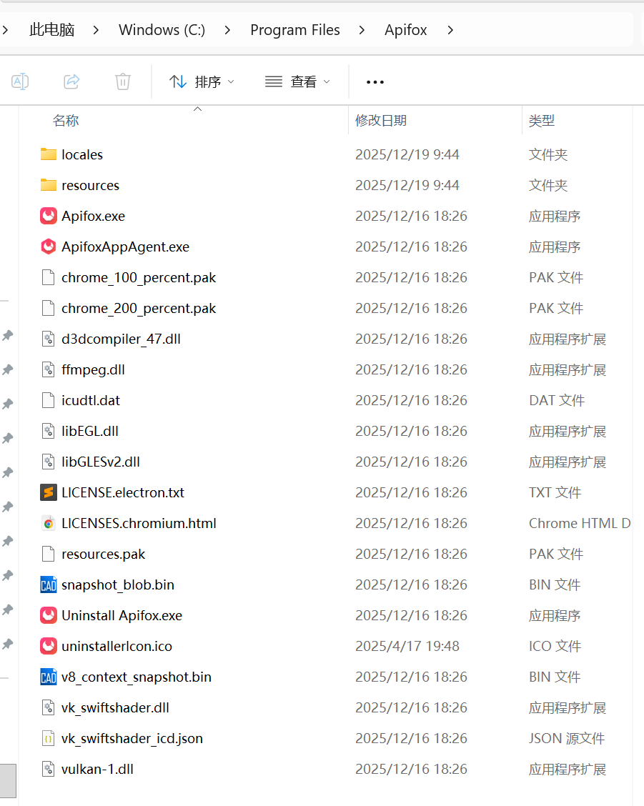
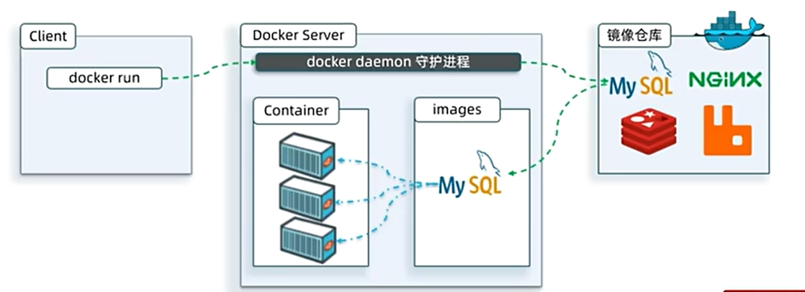
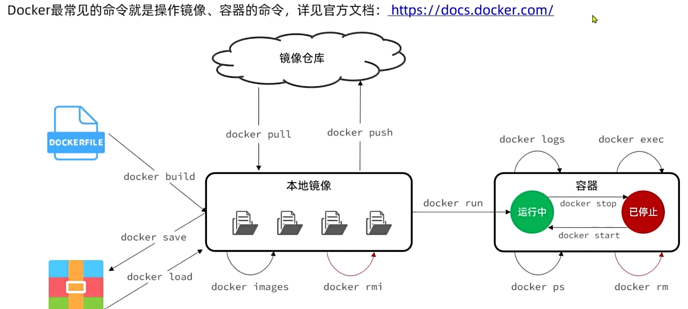
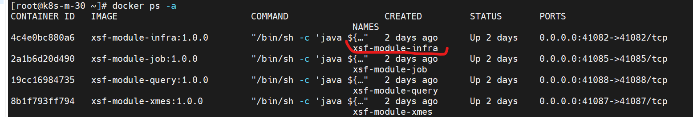
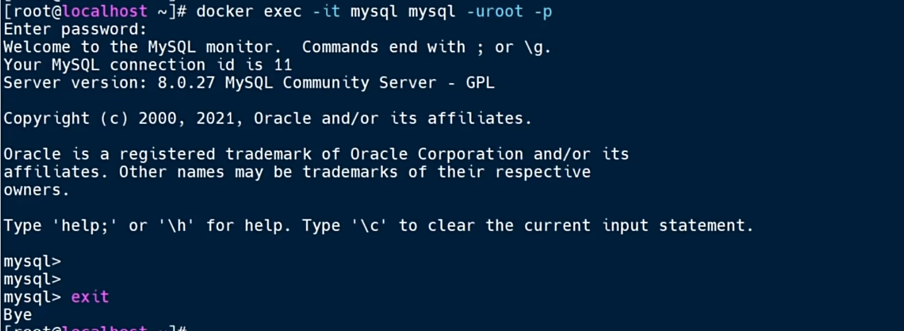

# Docker

## Docker概念

1. 通过Docker下载的应用如MySQL，下载的是**应用镜像image，镜像不仅包含应用本身还包含应用运行所需的环境、配置、系统函数库等** ==> **Docker会在运行镜像时创建一个隔离环境，称为容器（container）** ==> **能跨系统运行**

2. Docker下载的应用是类似下图的已经安装好的安装包，所以是免安装的，另外再加上应用运行时所需的环境。


3. **容器之间是相互隔离的**，所以可以在同一个服务器上部署多个相同的应用，如MySQL，形成**应用集群**。


4. docker 命令解析:   

    (1). docker run 创建并**运行**一个**容器**，-d是让容器在后台运行；   

    (2). --name *** 给容器命名，这里是给容器命名为mysql；   

    (3). -p 映射端口，因为容器是隔离的，要把容器的端口跟实际机器的端口映射上 ==> 如果是一个服务上安装多个容器，端口要区分开。   

    (4). -e KEY=VALUE, key value分别是什么取决于安装的容器类型要求（docker hub上说明文档上会有，类似于node npm）   

    (5). 最后一行的mysql指定要下载什么镜像应用。 

```docker
docker run -d \
    --name mysql \
    -p 3306:3308 \
    -e TZ=Asia/Shanghai \
    -e MYSQL_ROOT_PASSWORD=123 \
    mysql
```

## Docker常见命令

1. docker images 查看本地所有镜像

2. docker rmi 删除镜像（remove image）

3. docker build 自定义镜像

4. docker save 把打包好的镜像保存成本地的压缩包

5. docker load加载镜像

6. docker pull 、 docker push

7. docker run **创建并运行**容器

8. docker stop 停止容器中的进程，容器还在

9. docker start 启动容器中的进程

10. docker ps 查看容器中进程的状态

11. docker rm **删除容器**

12. docker logs 查看容器中的日志

13. docker exec 进入容器


14. docker ps -a 这个命令中的-a=--all，显示所有容器，不管是运行中还是已停止的，docker ps这个命令只显示正在运行的容器。
 

上图最后一列是容器名字，COMMAND列表示Docker在容器里执行的“主命令”

15. 查看某个容器的实际配置: docker exec -it <container name> env 如：

    ```
    // 查看容器名为 nacos的所有配置
    docker exec -it nacos env

    docker exec -it nacos env | grep nacos

    docker exec -it nacos env | egrep 'NACOS|JAVA|SPRING'

    docker exec -it nacos env | grep -E 'NACOS|JAVA|SPRING'
    ```

    exec 是在容器内部执行命令；   
    
    -it作用是让你像在“容器内部**终端**”里敲命令一样；   
    
    **env是Linux内置命令，作用是打印当前进程可见的所有环境变量**。   
    
    **| 是Linux管道**，把前一个命令的输出作为后一个命令的输入，即env的输出 -> 交给grep处理   

    grep是搜索文本行，egrep相当于 grep -E

    | 命令                  | 正则能力          | 说明          |
    | ------------------- | ------------- | ----------- |
    | `grep`              | **基础正则（BRE）** | 功能弱，很多符号要转义 |
    | `grep -E`           | **扩展正则（ERE）** | 推荐使用        |
    | `egrep`             | 等价于 `grep -E` | 老习惯         |
    | `grep -F` / `fgrep` | **不支持正则**     | 纯字符串匹配（最   快）  |


16. **Docker 配置优先级**： 

    ```
    JVM -D参数  (最高) 
    Docker env （第二，docker-compose.yml文件时给Docker注入环境变量的配置文件） 
    applicaiton.properties/yaml （最低）
    ```

17. JVM -D参数（java -Dkey=value）是Java配置里的“最高优先级”，在JVM启动时设置一个系统属性，仅在当前JVM生效，下次启动时不用就不生效。而docker env时在进程及其子进程生效。

    ```bash
    // java -Dkey=value 

    java -Dspring.profiles.active=prod -jar app.jar
    ```

上述命令 ：

        key = spring.profiles.active   
        value = prod

启动时JVM会做一件事： System.setProperty(""spring.profiles.active", "prod"");  

-jar app.jar 是另一个命令了，告诉JVM用可执行jar模式启动app.jar


18. docker exec -it mysql bash 
