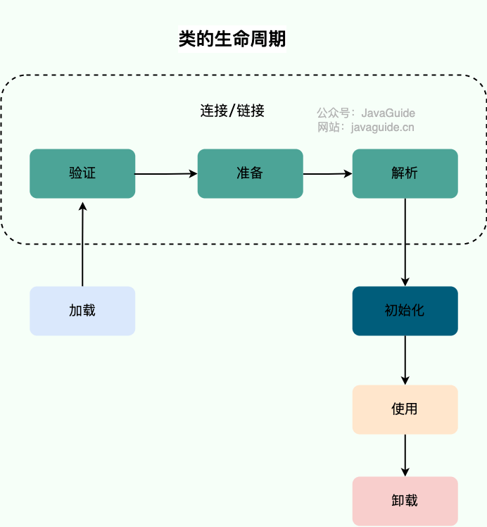
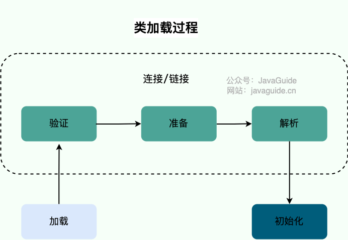
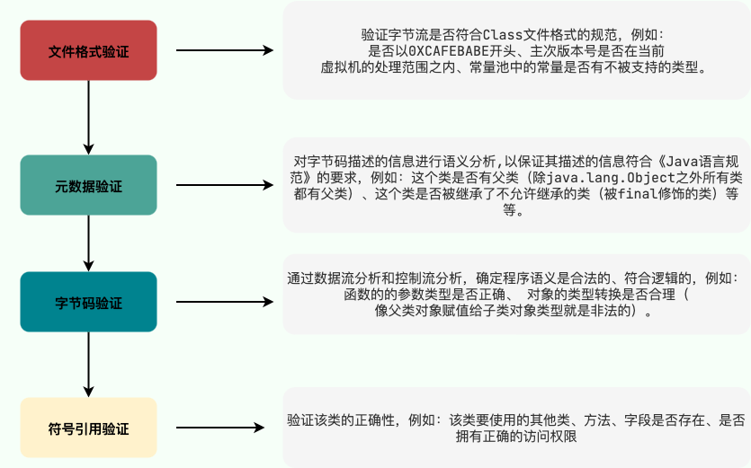
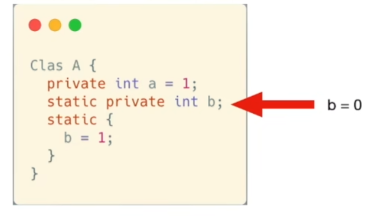
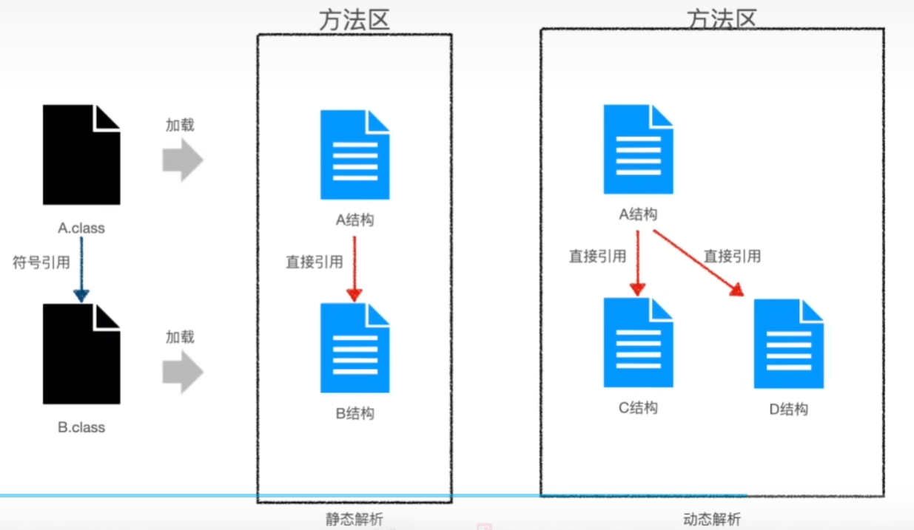

# JVM相关

1. 三种类加载器之间不是类的继承关系。所谓的父加载器、子加载器只是一种逻辑表述。

## 类加载过程

### 类的生命周期

1. 类的声明周期：加载、连接Linking（验证、准备、解析）、初始化、使用、卸载。

### 类加载过程

1. 类加载过程：加载、连接（验证、准备、解析）、初始化。

#### 加载Loading

1. 加载这一步骤主要是由类加载器完成。主要过程：

   (1). 通过**全类名**获取定义此类的**二进制字节流**；

   (2). 将字节流所代表的静态存储结构转换为方法区的运行时数据结构；

   (3). **在堆/内存中生成一个代表该类的class对象**，作为方法区这些数据的访问入口。

2. 二进制字节流的来源有很多，最常见的是.class文件中保存的字节码，或者动态代理技术在运行时动态生成的，或者来源于网络、ZIP包等其他地方。
3. **.class文件是二进制字节流的物理载体，是二进制字节流的静态存储形式**，字节流是其JVM类加载时动态数据输入的一种数据形态。

#### 验证 Verification

1. 验证的主要目的时确保Class文件中的字节流中包含的信息**符合《Java虚拟机规范》的全部约束要求**，保证这些信息被当作代码运行之后**不会危害虚拟机自身的安全**。

#### 准备Prepatation

1. 为**类变量/static静态变量**进行内存分配，**仅分配内存、不执行代码 ==> 给变量赋默认值，真正的变量赋值在初始化阶段执行**。如下图中变量a在准备阶段被赋0值，在初始化阶段才赋值为1。

#### 解析Resolution

1. 解析阶段时虚拟机把**符号引用**转换成**直接引用**。
2. 符号引用：如果对象A内部引用了对象B，**在编译阶段对象B还没被加载，对象A无法引用到对象B的实际地址，只能用字面量的形式定位B的位置，比如一个字符串。符号引用与虚拟机实现的内存布局无关**，因为B还没在内存中被加载。
3. 直接引用：对象B已经在内存中被加载了，**直接引用就是指向对象B的指针**、相对偏移量或者是一个能间接定位到目标的句柄。直接引用和虚拟机是实现的内存布局直接相关。

##### 静态解析和动态解析

4. 如果对象B是一个很明确的实现类，就是静态解析；如果B用了**多态**，就要**使用动态解析**，等**运行时**发生了调用，**虚拟机调用栈中得到了具体的类型信息，才能进行解析** ==> **动态解析可能发生在 类加载过程中的 初始化 阶段之后**。

#### 初始化Initialization

1. 调用\<clinit>方法进行初始化。
2. **为了保证线程安全，\<clinit>方法会被JVM加锁，确保仅执行一次**。
3. \<clinit>方法主要作用是 完成**类变量的赋值和静态代码块的执行**。
4. 初始化的触发条件：

   (1). **首次创建类实例new**；

   (2). 反射调用Class.forName()方法；

   (3). 启动包含main方法的类

#### 卸载 Unloading

1. 将类从内存中卸载，回收Class对象和类相关数据。
