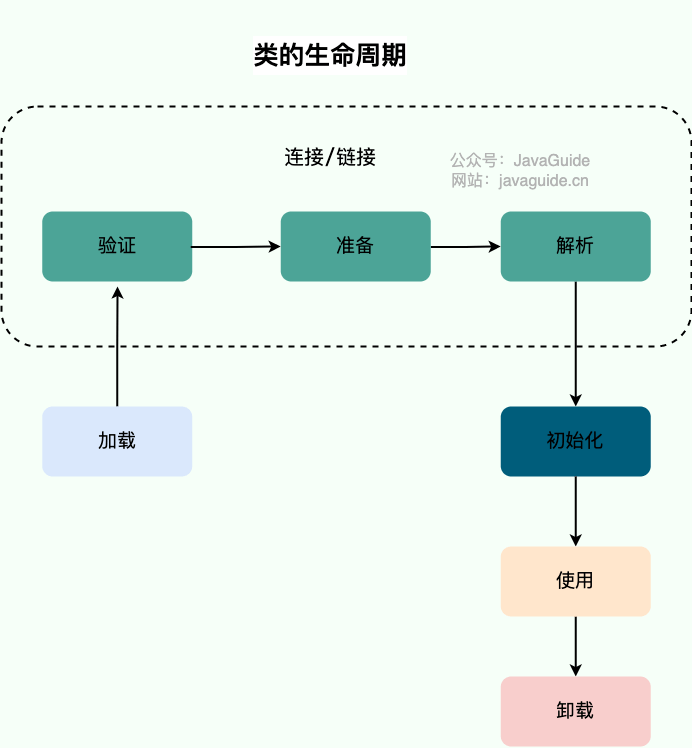
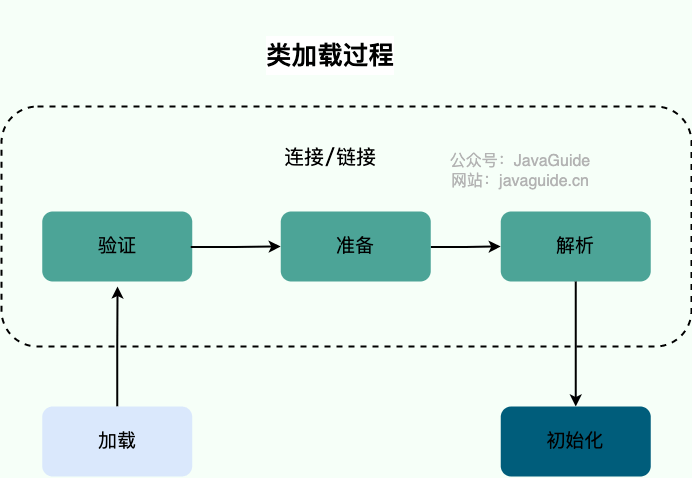
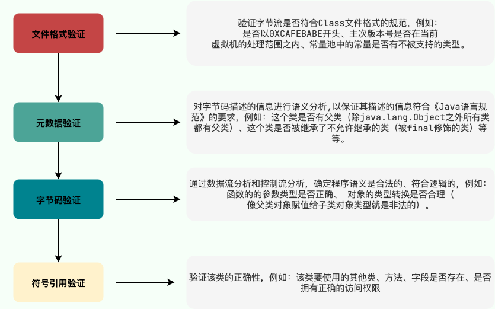
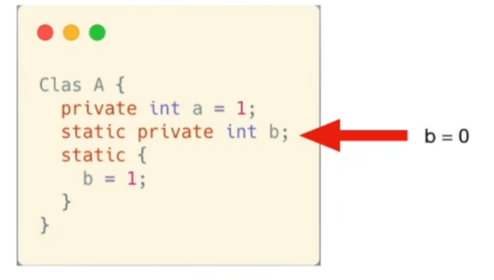
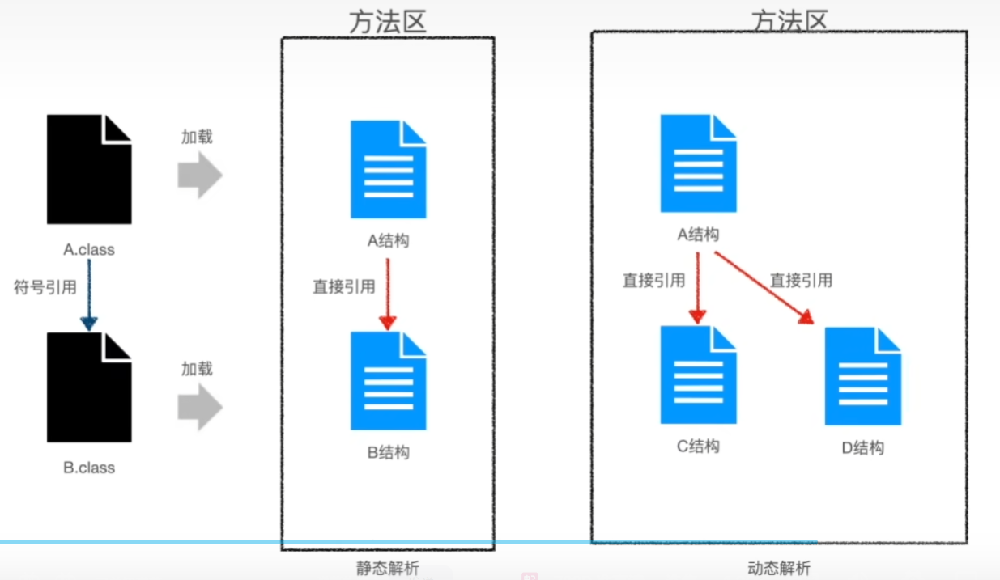

# JVM相关

1. 三种类加载器之间不是类的继承关系。所谓的父加载器、子加载器只是一种逻辑表述。

## 类加载过程

### 类的生命周期

1. 类的声明周期：加载、连接Linking（验证、准备、解析）、初始化、使用、卸载。

### 类加载过程

1. 类加载过程：加载、连接（验证、准备、解析）、初始化。

#### 加载Loading

1. 加载这一步骤主要是由类加载器完成。主要过程：

   (1). 通过**全类名**获取定义此类的**二进制字节流**；

   (2). 将字节流所代表的静态存储结构转换为方法区的运行时数据结构；

   (3).
   **在堆/内存中生成一个代表该类的class对象**，作为方法区这些数据的访问入口。

2. 二进制字节流的来源有很多，最常见的是.class文件中保存的字节码，或者动态代理技术在运行时动态生成的，或者来源于网络、ZIP包等其他地方。
3. **.class文件是二进制字节流的物理载体，是二进制字节流的静态存储形式**，字节流是其JVM类加载时动态数据输入的一种数据形态。

#### 验证 Verification

1. 验证的主要目的时确保Class文件中的字节流中包含的信息**符合《Java虚拟机规范》的全部约束要求**，保证这些信息被当作代码运行之后**不会危害虚拟机自身的安全**。



#### 准备Prepatation

1. 为**类变量/static静态变量**进行内存分配，**仅分配内存、不执行代码 ==> 给变量赋默认值，真正的变量赋值在初始化阶段执行**。如下图中变量a在准备阶段被赋0值，在初始化阶段才赋值为1。
   

#### 解析Resolution

1. 解析阶段时虚拟机把**符号引用**转换成**直接引用**。
2. 符号引用：如果对象A内部引用了对象B，**在编译阶段对象B还没被加载，对象A无法引用到对象B的实际地址，只能用字面量的形式定位B的位置，比如一个字符串。符号引用与虚拟机实现的内存布局无关**，因为B还没在内存中被加载。
3. 直接引用：对象B已经在内存中被加载了，**直接引用就是指向对象B的指针**、相对偏移量或者是一个能间接定位到目标的句柄。直接引用和虚拟机是实现的内存布局直接相关。



##### 静态解析和动态解析

1. 如果对象B是一个很明确的实现类，就是静态解析；如果B用了**多态**，就要**使用动态解析**，等**运行时**发生了调用，**虚拟机调用栈中得到了具体的类型信息，才能进行解析**
   ==> **动态解析可能发生在 类加载过程中的 初始化 阶段之后**。

#### 初始化Initialization

1. 调用\<clinit>方法进行初始化。
2. **为了保证线程安全，\<clinit>方法会被JVM加锁，确保仅执行一次**。
3. \<clinit>方法主要作用是 完成**类变量的赋值和静态代码块的执行**。
4. 初始化的触发条件：

   (1). **首次创建类实例new**；

   (2). 反射调用Class.forName()方法；

   (3). 启动包含main方法的类

#### 卸载 Unloading

1. 将类从内存中卸载，回收Class对象和类相关数据。

## JVM垃圾回收机制

1. GC主要回收的是堆内存Heap + 方法区/元空间中的部分类元数据。
2. 栈一般不用GC，因为方法调用结束之后，会自动出栈，局部变量就没了。

### 怎么判断对象是不是垃圾 ==> JVM使用可达性分析

1. 引用计数法（记录对象被引用的次数，值为0表示没人引用了可以回收）存在循环引用的问题 ==>
   A和B相互引用，计数都不为0但是实际上已经都不被其他对象引用了。

2. 可达性分析从GC Roots出发，沿着引用链能到达的不是垃圾，到达不了的是垃圾对象。
3. GC Roots是什么：

   ```
      1. 虚拟机栈中的局部变量引用
      2. 方法区中的静态变量引用
      3. 方法区中的常量引用
      4. 本地方法栈 JNI(Java Native Interface) 引用
      5. 被 synchronized 锁持有的对象
      6. 类加载器相关引用
   ```

   能被这些对象访问到的，就不是垃圾对象

4. Java对象的引用类型。

   | 引用类型 | 回收特点                           | 典型场景              |
   | -------- | ---------------------------------- | --------------------- |
   | 强引用   | 只要还被强引用，就不会回收         | 普通 new 出来的对象   |
   | 软引用   | 内存不足时可能回收                 | 缓存                  |
   | 弱引用   | 下一次 GC 时就可能回收             | ThreadLocalMap 的 key |
   | 虚引用   | 不能通过它获取对象，只用于回收通知 | 堆外内存、Cleaner     |

   ```java
   // 软引用
   SoftReference<String> softReference2 = new SoftReference<>(new String("def")); // 匿名对象

   //弱引用
   WeakReference<String> weakReference2 = new WeakReference<>(new String("abc")); // 匿名对象

   //虚引用 相当于没引用 对GC没影响
   PhantomReference phantomReference2 = new PhantomReference(new String("abc"), queue); // 匿名对象
   ```

5. 如何判断一个类是无用的类：该类的所有实例对象都被回收 + 该类的ClassLoader已被回收 + 该类的 java.lang.Class 对象没有在任何地方被引用

### 垃圾回收算法

#### 标记-清除算法 Mark-Sweep

1. 给可以存活的对象打标记，把未做标记的对象都清楚掉 ==> 会产生内存碎片。

#### 标记-复制算法Mark-Copy

1. 把内存分成两块，每次只使用其中一块。GC时把需要存货的对象移动到另一个块，然后把原来那块区域清空。==> 没有内存碎片，但是复制成本高 ==>
   **适合年轻代对象**。

#### 标记-整理Mark-Compact

1. 标记完存活对象之后，把存活对象往一边移动，把边界之外的对象清除 ==>
   **适合老年代的对象**，没有复制那么开销大。

### 分代收集思想

1. 不同代的对象生命周期不同，使用不同的GC回收方法

   ```
      Heap
      ├── Young Generation
      │   ├── Eden
      │   ├── Survivor From
      │   └── Survivor To
      └── Old Generation
   ```

#### 对象分配和晋升流程

1. **新对象优先进入Eden区**，Eden满了触发Minor GC / Young
   GC，之后存活的对象**被复制到Survivor区**，此时它熬过了一次GC，年龄age+1；
2. **后续对象在Survivor区中每熬过一次GC年龄就加1**，年龄增长到一定程度（默认15岁），就**晋升到老年代**。
3. **大对象一出生就直接进入老年代**。

#### Minor GC、Major GC、Full GC 的区别

1. Minor GC/Young GC是回收年轻代，回收速度快、频率高 ==>
   Eden空间不足就会被触发；
2. Major GC / Old GC回收老年代；
3. Full
   GC 回收年轻代 + 老年代 + 整个堆甚至包括元空间的回收。==> 耗时长，老年代空间不足或者大对象分配失败等都可能触发。==>
   **Full GC仍然无法释放足够内存，可能OOM**

   ```
   //OOM 堆内存不足
   java.lang.OutOfMemoryError: Java heap space

   // 元空间不足，常见于类加载过多、动态代理类过多、类加载器泄漏等
   java.lang.OutOfMemoryError: Metaspace
   ```

#### GC需要分析对象引用关系，因此需要JVM暂停所有用户线程，防止修改

#### 垃圾回收器

| 垃圾回收器        | 主要作用区域 | 回收算法         | 线程模型        | 停顿特点   | 目标             | 典型场景               |
| ----------------- | ------------ | ---------------- | --------------- | ---------- | ---------------- | ---------------------- |
| Serial            | 年轻代       | 复制算法         | 单线程          | 全程 STW   | 简单、低资源消耗 | 小内存、客户端、小程序 |
| Serial Old        | 老年代       | 标记-整理        | 单线程          | 全程 STW   | 简单稳定         | 小堆、CMS 失败兜底     |
| ParNew            | 年轻代       | 复制算法         | 多线程并行      | 全程 STW   | 配合 CMS         | JDK 8 老系统           |
| Parallel Scavenge | 年轻代       | 复制算法         | 多线程并行      | 全程 STW   | 高吞吐           | 后台任务、批处理       |
| Parallel Old      | 老年代       | 标记-整理        | 多线程并行      | 全程 STW   | 高吞吐           | 后台任务、计算型服务   |
| CMS               | 老年代       | 标记-清除        | 并发 + 少量 STW | 停顿较短   | 低停顿           | JDK 8 老服务端系统     |
| G1                | 整个堆       | Region 复制/整理 | 并发 + 并行     | 可预测停顿 | 平衡吞吐和延迟   | 主流服务端应用         |
| ZGC               | 整个堆       | 并发整理         | 大量并发        | 极低停顿   | 超低延迟         | 大内存、低延迟系统     |
| Shenandoah        | 整个堆       | 并发整理         | 大量并发        | 极低停顿   | 超低延迟         | 大内存、低延迟系统     |
| Epsilon           | 不回收       | 无               | 无              | 无 GC 停顿 | 性能测试         | 特殊测试场景           |

1. 其中G1全称Garbage
   First，是现代服务端Java应用常用的垃圾回收器。它不是把年轻代/老年代分成一整块连续的区域，而是**把堆切成很多小块、小Regoin，每个Region可以临时扮演不同角色**。**G1会优先回收垃圾最多、垃圾回收收益最高的Region**。

   ```
      Eden Region
      Survivor Region
      Old Region
      Humongous Region
   ```

#### 内存泄漏

1. 内存泄漏就是对象已经没用了，但是还有引用持有他，所以无法被垃圾回收。
2. 处理OOM

   ```
   # JVM启动参数，用于在发生 OOM 时生成堆转储文件
   -XX:+HeapDumpOnOutOfMemoryError -XX:HeapDumpPath=/app/logs/app.dump
   ```

   这个转储文件是一个二进制文件，需要一些第三方工具打开才能分析。

## JVM线上问题排查及性能调优

1. 堆内存配置：建议-Xms 和 -Xmx 设置成一样，避免运行过程中堆频繁扩容和收缩，减少性能抖动。

   ```
      -Xms512m  //JVM 初始堆大小
      -Xmx512m  // JVM 最大堆大小

      -Xmn //young区的大小，Heap Space Size = Young Space Size + Old Space Size，所以-Xmn总是要设定的小于-Xmx，否则Old区没位置了，就会OOM
   ```

2. 以下情况可能让GC压力大：

   ```
      1. 一次性查询大量数据
      2. 大 List、大 Map 临时对象太多
      3. JSON 序列化/反序列化频繁
      4. 批量导入、批量导出
      5. 日志拼接产生大量字符串
      6. 缓存没有过期策略
      7. ThreadLocal 没清理
      8. 大文件一次性读入内存
      9. MQ 消费积压后一次拉太多消息处理
   ```

3. 排查 GC 问题时，不能只调参数，要先看 GC 日志和监控，关注 Young GC 频率、Full
   GC 频率、暂停时间、老年代回收后是否下降。如果 Full
   GC 后老年代仍然不下降，通常要怀疑内存泄漏或者对象被长期引用。
