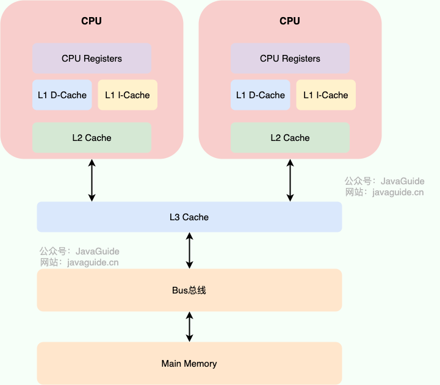

# Java Memory Model Java内存模型

1. **JAVA内存模型**本质上不是真实存在的一块内存，而**是Java对多线程读写内存行为的一套抽象规范**。
2. **JMM和JVM运行时区域的内存结构是两个不同的东西。JVM运行时区域的内存结构如下。JMM内存模型指的是抽象概念。**

   | 区域       | 作用             |
   | ---------- | ---------------- |
   | 程序计数器 | 当前线程执行位置 |
   | 虚拟机栈   | 方法调用         |
   | 本地方法栈 | native方法       |
   | 堆         | 对象实例         |
   | 方法区     | 类信息、常量     |

## JMM

### CPU缓存

1. 内存比硬盘IO快，但是内存速度远慢于CPU处理速度，如果CPU每次都直接读内存会造成大量等待。因此出现在CPU
   core 旁边加一个缓存区域（CPU
   Cache， CPU缓存），把数据先从主内存中复制到CPU缓存中，CPU操作时直接读取CPU缓存中的副本，不需要每次都读取主内存。

2. CPU缓存结构通常分为L1,L2,L3三层，L1
   L2是核心私有的，L3才会共享。

3. **产生问题：现在CPU是多核的，每个核心都有自己的CPU缓存，这些CPU缓存之间数据不会完全共享，就会造成缓存的一致性问题**。

4. 解决缓存一致性问题：

   （1）.
   **硬件层面通过缓存一致性协议（MESI）**，某个核心修改变量时通知其他CPU核心，其他CPU就把这个变量标记为InValid，下次用到时直接从主内存中读取。

   | 状态 | 含义           |
   | ---- | -------------- |
   | M    | Modified 修改  |
   | E    | Exclusive 独占 |
   | S    | Shared 共享    |
   | I    | Invalid 失效   |

   （2）. 但是CPU还会为了提性能进行指令重排，指令重排在单线程的情况下没什么问题，但是多线程时不能保证语义一致。因此需要**JMM**去规定多线程并发编程内存访问的规则。

### 指令重排和as-if-serial

1. as-if-serial:**允许CPU做指令重排的前提是，单线程下指令重排优化之后的执行结果跟按照源码顺序执行的结果一样**。==>
   **指令重排的代码之间没有数据依赖**:

   ```java
     int a = 1;
     int b = 2;
   ```

2. 如果有数据依赖如下，则满足不了as-if-serial，单线程下也不能指令重排：

   ```java
    int a = 1;
    int b = a + 1;
   ```

### 满足了as-if-serial的指令重排在多线程时仍会有问题 ==> 因为其他线程会观察到当前线程“未完成”的状态

1. 线程A

   ```java
    a = 1;
    flag = true;
   ```

   线程B

   ```java
    if(flag){
        System.out.println(a);
    }
   ```

   上述例子a和flag之间没有数据依赖，可以指令重排把flag =
   true放在a=1前面执行；那线程B执行完成if(flag)之后去打印变量a时，变量a还没被赋值成1呢 ==>
   **线程之间的可见性和有序性被指令重排破坏了**

### 为什么要有JMM ==> 保证多线程并发编程下内存访问的原子性、可见性、有序性

1. 不同的CPU内存行为不同，同一套代码换个CPU换个操作系统行为可能会不一样，**Java要实现跨平台就要有自己的内存模型来屏蔽底层CPU差异**。

2. **JMM是Java定义的并发编程的相关规范，定义线程如何与内存交互，保证并发编程的内存访问的原子性、可见性、有序性**。

### JMM如何保证并发编程的特性？

#### （一）JMM抽象线程和主内存之间的关系，定义线程如何与内存交互

1. JMM把线程对内存的访问抽象成:**这里的主内存和工作内存都是JMM的抽象概念**

   ```
   主内存（Main Memory）
           ↑ ↓
   工作内存（Working Memory）
           ↑ ↓
   线程（Thread）
   ```

   (1).
   **主内存中存放所有线程之间的共享变量（堆中的对象、数组元素、静态static变量，不包括局部变量，局部变量在线程栈上不在主内存中）**；

   (2).
   **工作内存中保存共享变量的本地副本**,是线程私有的 ==> 先从主内存复制到工作内存，然后线程根据这个工作内存中的变量工作。

2. JMM规定了线程在主内存和工作内存之间的内存操作（了解即可）：

   | 操作   | 作用对象   | 作用                             | 通俗理 解            |
   | ------ | ---------- | -------------------------------- | -------------------- |
   | read   | 主内存     | 把变量值从主内存读取出来         | “准备读取”           |
   | load   | 工作内存   | 把 read 得到的值放入工作内存副本 | “加载到线程缓存”     |
   | store  | 工作内存   | 把工作内存中的值准备写回主内存   | “准备同步回去”       |
   | write  | 主内存     | 把 store 的值真正写入主内存      | “正式更新主内存”     |
   | use    | 工作内存   | 把变量值传给执行引擎使用         | “线程开始使用变量”   |
   | assign | 工作内存   | 把执行结果赋值给工作内存中的变量 | “线程修改变量值”     |
   | lock   | 主内存变量 | 标记变量被某线程独占             | “加锁，别人不能改”   |
   | unlock | 主内存变量 | 释放变量锁定状态                 | “解锁，别人可以用了” |

#### （二）JMM引入 happens-before规则

1. **happens-before是JMM定义的一种“可见性+有序性”的保证关系，它规定了单线程和跨线程情况下“谁的结果必须对谁可见”**，有如下规则：

| 规则                                        | 规则内容                                                           | 核心作用                                                                 | 示例                                                     |
| ------------------------------------------- | ------------------------------------------------------------------ | ------------------------------------------------------------------------ | -------------------------------------------------------- |
| 程序顺序规则（Program Order Rule）          | 同一线程中，前面的操作 happens-before 后面的操作                   | 保证单线程语义正确，能满足as-if-serial即可，不是必须按照代码书写顺序执行 | `a=1; b=2;` 中 `a=1` happens-before `b=2`                |
| volatile 变量规则（Volatile Variable Rule） | 对 volatile 变量的写 happens-before 后续对该变量的读               | 保证可见性、有序性                                                       | 线程A `flag=true`，线程B读取 `flag` 后一定能看到之前修改 |
| 锁规则（Monitor Lock Rule）                 | 对同一把锁的 unlock happens-before 后续 lock                       | 保证同步块之间的数据可见性                                               | `synchronized(lock)`                                     |
| Thread.start() 规则                         | 主线程调用 `thread.start()` happens-before 新线程中的所有操作      | 保证启动线程能看到启动前的数据                                           | `a=1; thread.start();`                                   |
| Thread.join() 规则                          | 线程中的所有操作 happens-before 其他线程从 `join()` 返回           | 保证 join 后能看到线程执行结果                                           | `thread.join(); System.out.println(a);`                  |
| **传递性（Transitivity）**                  | 如果 A happens-before B，B happens-before C，则 A happens-before C | 构建复杂可见性链路                                                       | volatile 可见性传播                                      |
| final 字段规则（Final Field Rule）          | **对象构造完成后，final 字段对其他线程可见**                       | 保证 final 初始化安全                                                    | `final int x`                                            |
| interrupt 规则（Thread Interrupt Rule）     | 对线程 interrupt() happens-before 被中断线程检测到中断             | 保证中断信号可见                                                         | `thread.interrupt()`                                     |

#### (三) Java 通过 volatile 和synchronized 关键字 等并发原语 建立 happens-before关系

1. 包括 volatile， synchronized，Lock，final，Thread.start()/join()等

| 并发原语              | 建立的 happens-before 规则        | 解决的并发特性         | 底层实现核心         |
| --------------------- | --------------------------------- | ---------------------- | -------------------- |
| volatile              | volatile写 HB volatile读          | 可见性、有序性         | 内存屏障             |
| synchronized          | unlock HB 后续lock                | 原子性、可见性、有序性 | Monitor + 内存屏障   |
| Lock（ReentrantLock） | unlock HB lock                    | 原子性、可见性、有序性 | AQS + CAS + volatile |
| final                 | 构造完成 HB 其他线程读取final字段 | 可见性（初始化安全）   | 写屏障               |
| Thread.start()        | start前操作 HB 新线程操作         | 可见性                 | JVM线程启动同步      |
| Thread.join()         | 线程操作 HB join返回              | 可见性                 | JVM线程终止同步      |
| CAS                   | 不直接建立HB（通常配合volatile）  | 原子性                 | CPU原子指令 cmpxchg  |

#### (四) 实现happens-before的底层是 内存屏障

1. 内存屏障 Memory
    Barrier是一种特殊的CPU指令： 两个作用，一是限制指令重排，二是保证内存可见性（刷新主内存、同步CPU缓存）。

2. JMM抽象了四种内存屏障

    | 屏障          | 禁止什么重排                   |
    | ------------- | ------------------------------ |
    | LoadLoad      | 读后面的读不能提前             |
    | StoreStore    | 写后面的写不能提前             |
    | LoadStore     | 读后面的写不能提前             |
    | **StoreLoad** | **写后面的读不能提前（最强**） |

3. 以volatile为例，内存屏障是怎么作用的：

        (1). volatile写：插入StoreBarrier，刷新CPU缓存、禁止前面的写重排到后面；

        (2). volatile读：插入LoadBarrier，强制重新读取主内存，禁止后面的读写提前。

## 并发编程三大特性

1. **可见性**：某个线程堆共享变量做了修改，其他线程可以立刻看到修改后的最新值。（如果线程B一直读自己CPU缓存里面的旧值而不是主内存中的值，就不能满足可见性，所以**满足可见性需要刷新值到主内存中**）==>
   happens-before前面的结果能被后面的看到
2. 有序性：happens-before前面的不能被重排到后面
3. 原子性：多个操作的不可分割，要么都成功，要么都失败。

### JMM整体链路

```
  CPU运行速度远大于内存速度
          ↓
  引入 CPU Cache
          ↓
  多核 CPU 各自缓存
          ↓
  产生缓存一致性问题
          ↓
  MESI 协议保证缓存同步
          ↓
  但 CPU/JVM 为提高性能
  仍会发生指令重排
          ↓
  as-if-serial 保证单线程结果正确
          ↓
  单线程没有问题
          ↓
  多线程会观察执行过程
          ↓
  可能观察到错误中间状态
          ↓
  Java 定义 JMM
          ↓
  JMM 定义共享变量访问规则
          ↓
  提出 happens-before
  定义可见性与有序性
          ↓
  Java提供volatile / synchronized原语实现happens-before，CAS负责原子性
          ↓
  JVM底层通过插入内存屏障 实现 happens-before
          ↓
  禁止危险重排 + 同步CPU缓存
          ↓
  最终实现：
  可见性 / 原子性 / 有序性
```

```
【计算机硬件层】

CPU运行速度远大于主内存（RAM）
        ↓
CPU如果每次都访问内存，性能太低
        ↓
引入 CPU Cache（L1/L2/L3高速缓存）
        ↓
线程实际优先操作CPU缓存中的数据副本
        ↓
单核CPU没问题
        ↓
多核CPU下：
每个核心都有自己的Cache
        ↓
同一共享变量可能存在多个缓存副本
        ↓
产生缓存一致性问题（Cache Coherence Problem）
        ↓
线程A修改变量后
线程B可能仍读取旧缓存
        ↓
CPU通过 MESI 缓存一致性协议
保证缓存同步与失效通知
        ↓
解决了“部分可见性问题”
        ↓
但为了进一步提升性能
CPU / JVM / 编译器
仍会进行：
- 指令重排
- 乱序执行
- 寄存器优化
- 提前读写
        ↓
出现指令重排问题


==================================================


【单线程阶段】

JVM/CPU允许指令重排
        ↓
但必须满足：
as-if-serial（貌似串行语义）
        ↓
即：
不管如何优化重排
单线程最终结果必须与源码顺序一致
        ↓
因此：
单线程下即使发生重排
程序通常也不会出问题
        ↓
因为：
没有其他线程观察执行过程


==================================================


【多线程问题出现】

多线程下：
线程之间会观察执行过程
        ↓
某些重排会暴露“错误中间状态”
        ↓

例如：

线程A：
a = 1;
flag = true;

可能被重排为：
flag = true;
a = 1;

线程B：
if(flag){
    print(a);
}

可能看到：
flag=true
但 a=0
        ↓
因此：
仅靠 as-if-serial
无法保证多线程正确性


==================================================


【JMM（Java Memory Model）出现】

Java为了屏蔽不同CPU架构差异
并保证多线程正确性
定义：
JMM（Java内存模型）
        ↓
JMM本质：
Java对“多线程共享变量访问行为”的规范
        ↓
JMM抽象：
主内存（Main Memory）
        ↓↑
线程工作内存（Working Memory）
        ↓↑
线程只能操作共享变量副本
线程之间必须通过主内存通信
        ↓
JMM核心目标：
保证并发三大特性：
- 可见性（Visibility）
- 原子性（Atomicity）
- 有序性（Ordering）


==================================================


【happens-before】

JMM提出：
happens-before规则
        ↓
定义：
哪些操作之间
必须保证：
- 可见性
- 有序性
        ↓

如果：
A happens-before B

则必须保证：
1. A的结果对B可见
2. A不能被重排到B后面


==================================================


【Java并发原语】

Java提供并发原语：
- volatile
- synchronized
- Lock
- final
- Thread.start/join
        ↓
这些原语的作用：
建立 happens-before 关系


==================================================


【volatile】

volatile规则：
volatile写
happens-before
后续volatile读
        ↓
实现：
- 可见性
- 有序性
        ↓
不保证：
- 原子性


==================================================


【synchronized / Lock】

unlock
happens-before
后续lock
        ↓
实现：
- 可见性
- 有序性
- 原子性


==================================================


【CAS】

CAS：
Compare And Swap
        ↓
底层依赖CPU原子指令：
cmpxchg
        ↓
通过：
比较 + 更新
实现无锁原子操作
        ↓
CAS主要解决：
原子性
        ↓
通常配合volatile
一起保证可见性


==================================================


【JVM如何真正实现 happens-before】

happens-before
只是JMM定义的“规则”
        ↓
JVM负责真正落地这些规则
        ↓
JVM通过：
Memory Barrier（内存屏障）
实现 happens-before
        ↓
内存屏障作用：
1. 禁止危险指令重排
2. 强制CPU缓存同步
        ↓
例如：

volatile写：
插入 Store Barrier

volatile读：
插入 Load Barrier

synchronized：
插入 Monitor相关屏障


==================================================


【最终结果】

JVM + CPU + 内存屏障
共同实现：

1. 可见性
线程修改后其他线程立即可见

2. 原子性
操作不可分割

3. 有序性
禁止危险重排序

最终保证：
Java多线程并发编程正确性

```
