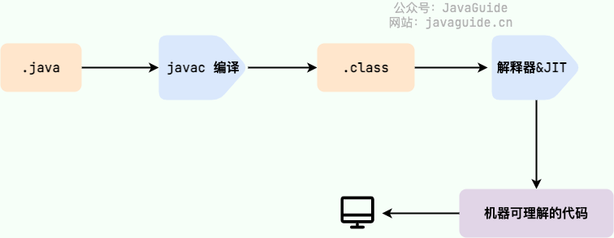
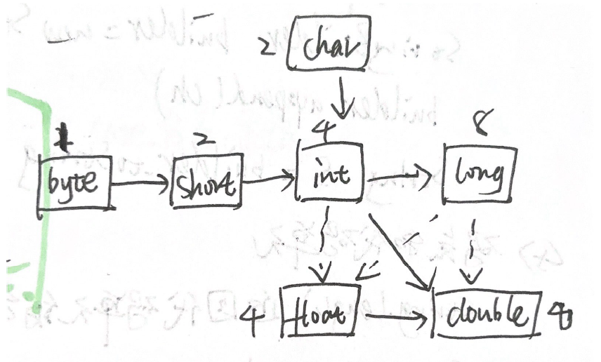

<!--
 * @Author: wyw 355432666@qq.com
 * @Date: 2023-12-23 20:11:11
 * @LastEditors: wyw 355432666@qq.com
 * @LastEditTime: 2024-05-29 16:48:56
 * @FilePath: \Java Core学习笔记\第一章 JAVA程序设计概述.md
 * @Description: 这是默认设置,请设置`customMade`, 打开koroFileHeader查看配置 进行设置: https://github.com/OBKoro1/koro1FileHeader/wiki/%E9%85%8D%E7%BD%AE
-->
# 解释型语言和编译型语言

1. **解释型**运行前不编译，**运行程序时才编译**，每执行一次就要翻译一次。
2. 编译型：一次性把源代码全部编译成机器语言，形成二进制文件
3. 字节码是存放在.class文件中的，用来给JVM执行的。

## Java是编译与解释共存的语言

1. Java程序从源代码到运行的过程如下图：

        (1). 编译阶段：.java文件被javac编译器编译成.class文件   
        
        (2). 解释阶段：JVM逐条把字节码解释成机器码并执行相应的机器码指令；JVM中还包含JIT（Just in Time Compilation）编译器，JIT属于运行时编译，JIT编译器会在运行时把频繁执行的字节码编译成本地机器码，以提高执行效率。

# 基础概念

1. Java区分大小写
2. public是访问修饰符，用于控制程序对内部代码的访问级别；**一个文件只能有一个public类**；源代码文件必须与公共类同名。**public类中必须有一个main方法，因为虚拟机从main方法开始执行。**
3. class是类，作为一个加载程序逻辑的容器。
4. 类名要大写字母开头，大驼峰命名法。
5. 命令行 Java ClassName 运行程序。
6. 面向对象语言的特性：封装、继承、多态。
7. Java语言的特性：面向对象、Java虚拟机实现平台无关性、支持多线程。
8. JavaSE 是Java平台标准版；JavaEE是Java平台企业版。

## Java为什么能实现平台无关性？达到“一次编译，到处运行”的跨平台能力？

1. **不同平台的**Javac编译器生成的**字节码是相同的**，字节码是中间层指令集，**不受平台类型的影响**。
2. JVM是和平台配适的，**不同的操作系统要安装不同版本的JVM**，JVM会根据不同平台把字节码解释为当前平台所能理解的本地机器码。
3. 综上 字节码是不受平台影响的，JVM版本和本地机器码是受平台影响的。

## JVM JDK JRE

1. JVM是虚拟机，**JVM本身是一种规范，根据这种规范实现的虚拟机不只有一种**。
2. JRE，Java Runtime Environment是**运行已编译Java程序所需的环境**，主要包括(1)JVM和(2)Java基础类库（Class Library）。
3. JDK，Java Development Kit是**Java开发工具包**，包含了JRE、javadoc（文档生成器）等开发和调试Java程序的工具。


# Java的基本数据类型：8种=4整型+2浮点+1布尔+1字符类型char

1. string是一个对象，不属于基本数据类型
2. bignumber大数值是一个Java对象，不是一种数据类型
3. 一个字节是8位
4.

    | 序号 | 类型 | 字节的大小 | 备注|
    | -- | ------ | ------ | ------|
    | 1 | int整型 | 4字节 |范围20亿出头 |
    | 2 | short整型 | 2字节 | |
    | 3 | long整型 | 8字节 |有L后缀，如40000000L |
    | 4 | byte整型 | 1字节 |范围-128~127 |
    | 5 | float浮点类型 | 4字节 |有效位数6~7位，不常用，有F后缀如3.14F |
    | 6 | double浮点类型 | 8字节 |有效位数15位，精度是float的两倍 |
    | 7 | boolean类型 | 1字节 |整数和布尔值之间不能进行转换 |
    | 8 | char类型 | 2字节 |16位的Unicode字符，不要在程序中使用这种类型 |

5. ±INFINITY和NaN是特殊浮点值
6. **浮点值不适用于无法接受任何误差的金融计算**，因为二进制无法精确表示1/10，2-1.1=0.8999999无限循环，就像十进制中的1/3=0.3333333无限循环。====》使用BigDecimal做金融计算。

# 变量与运算

1.

    ```
        int x // 声明变量
        x=12 //初始化变量
    ```

2. (1) 常量  **final的变量只能赋值一次**

   ```
   final double CM_INCH=2.54 //常量名称全大写
   ```

   (2) 类的常量 **static**

    ```
    public class Me {
        public static final double CMINCH=2.54
    }
    ```

3. 严格浮点计算**strictfp**（在过程中使用截断计算，生成可再生的结果）

    ```
    public static strictfp void main(){
        // 该方法中所有计算都是严格的浮点计算
    }
    ```

4. **截断计算**：是将一个浮点数截为整数，不要小数部分，不是四舍五入，**可能会产生溢出**
5. **Math与StrictMath**

   （1）下面的sqrt()函数是Math.sqrt ，Math函数没有用strictfp实现，因此性能快，其实际计算方式取决于Intel处理器硬件的行为。

    ```
    import static java.lang.Math.*;

    ...
    System.out.println(sqrt(PI));
    ```

    （2）StrictMath类是完全可预测的结果
6. 数据类型之间的转换:

     (1) 小字节类型转大的无信息丢失   

     (2)大转小可能有信息丢失   

     (3)同样字节大小的类型，整型转浮点可能有精度损失   

   

    6.1

    **二元计算**需要将两个数转为**同一类型**，往尽可能不损失精度的方向转，优先级如下：

   double>float>long>int

    6.2  强制类型转换，double可转int，
        ```
        double x=9.7777
        int n=(int) x
        ```
7. 位运算：**不使用短路运算**  
8.1.  &且 |或 ^异或 ！非(取反)  
8.2.  ^异或是相同为false，不同为true
8.3. <<左移 >>右移（正数高位补0，负数高位补1）  >>>无符号右移，都用0填充高位

    ```
    1<<3 即 0001变为1000
    ```

# 字符串

9. 字符串拼接：将一个字符串与一个非字符串拼接时，后者被当作字符串使用,JS中也是这样

    ```
    int age=13;
    String S='PG'+age;
    // S变为'PG13'
    ```

10. **Java中字符串是不可变的，因为String类是final类，并且用来保存字符串的数组也被final修饰**；字符串一但被创建出来就不可以被修改，程序员调用方法修改一个字符串变量，其实底层是创建了一个新的字符串，让变量引用这个新的字符串：

```java
public final class String implements java.io.Serializable, Comparable<String>, CharSequence {
    private final byte[] value; // 用来保存字符串的数组
  //...
}
```

```java
String s = "Hello";
s = s + " World"; // 这实际上创建了一个新的字符串对象
```

11. **利用字符串的不可变性，安全的实现字符串的共享**：**所有使用字面量方式创建出的字符串都被储存在字符串常量池(String Pool)中**,下次再用字面量形式创建字符串时如果字符串常量池中已经有了一样内容的，就直接引用常量池中的。

18. 哪些字符串是共享字符串常量池的？

        (1). 编译时就能确定的字符串是共享常量池的，字面量方法和常量表达式生成的字符串

        ```java
            String str = "hello";  // 直接用""创建的字符串是字面量创建的
            String str1 = "hello";
            System.out.println(str == str1);  // true

            String str2 = "he" + "hello";
            System.out.println(str2 == str1);  // true
        ```
        
        (2). 运行时才能确定的字符串不共享常量池。如new方法、String.subString方法创建的字符串，

        ```java
        String str1 = "str";
        String str2 = "ing";
        String str4 = str1 + str2;
        String str5 = "string";
        System.out.println(str4 == str5);//false
        ```

        但是如果给str1和str2加上final，编译器会把他们当作常量来处理

        ```java

        final String str1 = "str";
        final String str2 = "ing";
        // 下面两个表达式其实是等价的
        String c = "str" + "ing";// 常量池中的对象
        String d = str1 + str2; // 常量池中的对象
        System.out.println(c == d);// true
        ```
19. new方法跟字面量方式不一样，每次都会在堆内存中创建一个新的字符串。

```java
    String s3 = new String("hello");
    String s4 = new String("hello");
    System.out.println(s3 == s4); // false
```

13. 字符串频繁变动的情况下可以**使用StringBuilder或StringBuffer构建可变字符串**。

    ```
    StringBuilder builder=new StringBuilder();
    builder.append('CH');
    String S=bulder.toString;===>最后生成一个string对象
    ```

14. StringBuilder和StringBuffer的区别：

    (1). StringBuilder是非线程安全的,**StringBuffer是线程安全的，方法上使用了Synchronized关键字**。

15. 字符串String可能为null，因为字符串是一个变量
16. **比较字符串**

        (1). equals方法用来检测字符串的内容是否一样。"=="只检测**对象的引用位置是否相同**，字符串相同但是位置不同则false，

    ```
    String S='PG';
    S.equals('dghh')
    ```

        (2). **只有字符串字面量共享引用，+或者substring等操作的结果不共享引用，但是他们创造出来的字符串也还是不可变的final的。**

    ```
    "HH".substring(0,1)=="H"是false
    ```

17. 字符串拼接使用"+"还是StringBuilder？**使用"+"拼接字符串的时候编译器会新建一个StringBuilder，并且在拼接的时候调用StringBuilder的append方法**，因此：

    (1). 在循环外简单的情况下，使用"+"和StringBuilder效果一样

    ```java
    String str = "Hello" + " " + "World"; 
    //编译器会把上面的代码编译成类似下面
    StringBuilder sb = new StringBuilder();
    sb.append("Hello");
    sb.append(" ");
    sb.append("World");
    String str = sb.toString();
    ```

    (2). 如果在循环中使用"+"就会在循环中每次新建一个StringBuilder对象，浪费内存，这种情况下显式的使用StringBuilder更好

    ```java
    String str = "";
    for (int i = 0; i < 1000; i++) {
        str += "a";
    }

    //上面的代码相当于下面，不好
    String str = "";
    for (int i = 0; i < 1000; i++) {
        StringBuilder sb = new StringBuilder();
        sb.append(str);
        sb.append("a");
        str = sb.toString();
    } 

    //显式的使用StringBuilder更好
    StringBuilder sb = new StringBuilder();
    for (int i = 0; i < 1000; i++) {
        sb.append("a");
    }
    String str = sb.toString();
    ```

19. 枚举类型

    ```
    enum Size{ // 这是一个枚举类
        SMALL,LARGE
    }
    Size s=Size.SMALL
    ```

20. **码点和代码单元**  length()方法不准
    string.length返回代码单元的数量，不是看到的字符长度，特殊字符可能占2个代码单元，看到的字符长度用codePointCount方法获得

    ```
    string.codePointCount(0,string,length())
    ```

# 输入输出

1.

    ```
    System.out.print('hello')
    Scanner in =new Scanner(System.in)
    String name=in.nextLine()// 读一行
    String word=in.next() //读单词
    int age=in.nextInt() //读整数
    double price=in.nextDouble() //读浮点数
    ```

2. 格式化输出

   ```
   double x=1000/3;
   System.out.printf("%8.2f",x)   
   System.out.printf("%,.2f",x)   
   System.out.printf("%(.2f",x)   
   ```

# 流程控制

1. 块作用域 **不能在嵌套的两个块中声明同名变量**
2. for循环

   ```
   for(int i=1;i<=10;i++) {
    //i的作用域
   } // i no longer defined here
   ```

3. switch 如果某个case末尾没有break就会接着执行下一个case分支（危险）
4. 中断控制流程语句  
   4.1. break，可以**带标签break**

   ```
   label:
   while(){
    for(){
        break label;
    }
   } //jump here
   ```

   4.2. continue，带标签的continue跳到与标签匹配的循环首部

# 基本类型和包装类型

1. 包装类型可用于泛型，基本类型不可用。
2. 包装类型属于对象。
3. 包装类型不赋值就是null，基本类型都有默认值且不是null。
4. 比较方式：基本类型用"=="比较的是值，包装类型用"=="比较的是内存地址，如果想比较包装类型的值要用equals()方法。
5. 8个基本类型对应的包装类型分别是什么：

    byte   Byte

    short  Short

    int    Integer

    long   Long

    float  Float

    double Double

    char   Character

    boolean Boolean

# 成员变量与局部变量的区别

1. **成员变量用static修饰就是属于类的，不用static就是属于实例对象的**；局部变量是代码块或方法中变量或方法的参数。
2. 成员变量和局部变量都能用final修饰。

# 静态变量有什么作用？

1. 静态变量static是属于类的，会被类的所有实例共享，**静态变量只会被分配一次内存**，通常被final修饰为常量，通过类名访问静态变量。

# 静态方法为什么不能调用非静态成员？

1. 比如算法题时，类的main方式必须被声明为静态方法，因此main方法想调用类中的其他方法，则其他方法也必须是静态方法才能用。
2. 因为静态方法是属于类的，在类加载的时候就会分配内存，**非静态成员是属于实例的，只有实例化之后才存在，因此在静态方法内部调用非静态成员，相当于调用一个还不存在的变量或方法**。

# 面向对象的三大特征

1. 封装：把一个对象的状态信息（即属性）隐藏在对象内部，提供可以被外界访问的方法来操作属性。
2. 继承：子类继承父类的成员变量和方法：

   private变量和方法不能被继承；

   final类不能被继承，final类中的方法都是默认final的。

3. 多态：多态就是一个对象可以有多种状态，他可以被自身类型的变量引用，也可以被他的

   （1）父类变量引用；

   （2）引用之后该变量**不能调用**只在子类中存在但是**父类中没有的方法**；

   （3）变量调用的某方法子类如果重写了，真正执行的就是子类重写的方法，子类没重写过执行的就是父类的方法。
