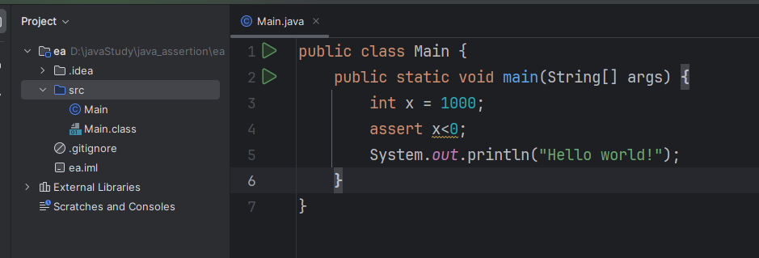

<!--
 * @Author: wyw 355432666@qq.com
 * @Date: 2024-04-02 17:18:17
 * @LastEditors: wyw 355432666@qq.com
 * @LastEditTime: 2024-05-09 11:37:44
 * @FilePath: \Java Core学习笔记\第七章 Exceptions， Assertion， Logging.md
 * @Description: 这是默认设置,请设置`customMade`, 打开koroFileHeader查看配置 进行设置: https://github.com/OBKoro1/koro1FileHeader/wiki/%E9%85%8D%E7%BD%AE
-->
# 7 Exceptions, Assertion, Logging

## 7.1 Dealing with Errors

1. 可能会出现的错误情况：用户输入错误;设备错误；物理限制如内存满了；代码错误。
2. throws an exception：throws一个封装了错误信息的对象，接下来由exception handler处理。
TODO:exception有特殊的继承结构？？

### 7.1.1 继承结构和分类

1. 所有的exception的都继承自Throwable 类。


2. 继承层次：

    （1）**Error**是Java运行系统资源耗尽或者系统内部错误，不在程序员可控范围内，发生了直接终止程序。

    （2）**Exception**是程序可以处理的异常，可以catch的异常。两个子类RuntimeException和IOException。
3. **Exception分类：unchecked exception 和 checked exception，checkedException如果没有用catch或者throw关键字处理的话就没有办法通过编译，unchecked exception不处理也能通过编译**:

   （1）unchecked exception：Error和RuntimeException。  
    **RuntimeException**是代码错误如：错误的强制类型转换， 访问null指针（***NullPointerException***），数组访问越界（***ArrayIndexOutOfBoundsException***）。

    （2）其他都是checked exception 如IOException，不是代码问题如：试图在文件尾部读取数据，试图打开不存在的文件，试图找一个不存在的类。**因为所有的存在问题都取决于环境，不取决于程序，程序写完可能被删除了**。

### 7.1.2 Declaring Checked Exceptions

1. 方法如果可能抛出**checked exception**，编译器要求必须try catch处理或者在头部声明exception，多个用逗号隔开。

    ```java
    public static  <T> boolean isFieldEqual(T obj1, T obj2, String fieldName) throws IllegalAccessException, NoSuchFieldException {
        if(obj1 != null && obj2 != null) {
                //反射
                Field field = obj1.getClass().getDeclaredField(fieldName);
                field.setAccessible(true);
                Object field1 = field.get(obj1);
                Object field2 = field.get(obj2);
                return Objects.equals(field1, field2);
        }
        return obj1 == null && obj2 == null;
    }
    ```

2. **子类重写父类中的方法，可能抛出的checked exception不能比父类中的更通用，只可以更具体；父类中不抛checked exception，子类中也不能抛出。**
3. 声明会抛出某超类Exception，实际运行时可以抛出超类本身或者任意子类的实例。==>多态

### 7.1.3 How to Throw an Exception

1.

    ```java

        throw new EOFException();
    ```

### 7.1.4 Creating Exception Classes

1. 所有继承Throwable类的子类、即所有Exception类都有一个默认构造器，一个带String message参数的构造器。

    ```java
    public class Throwable implements Serializable {
        private static final long serialVersionUID = -3042686055658047285L;
        private transient Object backtrace;
        private String detailMessage;
        ......

        public Throwable() {
            fillInStackTrace();
        }
        public Throwable(String message) {
            fillInStackTrace();
            detailMessage = message;
        }

        public String getMessage() {
            return detailMessage;
        }

        // 用于发语言环境、国际化考虑，默认返回detailMessage，但是子类可以重写返回需要的语言信息。
        public String getLocalizedMessage() {
            return getMessage();
        }

        public String toString() {
            String s = getClass().getName();
            String message = getLocalizedMessage(); 
            return (message != null) ? (s + ": " + message) : s;
        }
    }
    ```

2. 自定义exception需要继承已有的标准exception 类。

    ```java
    class FileFormatException extends IOException {
        public FileFormatException() {}
        public FileFormatException(String gripe) {
            // 调用父类IOException的构造方法
            super(gripe);
        }
    }
    ```

## 7.2 Catching Exceptions

### 7.2.1 Catching an Exception 捕获一个异常

1. try{} catch(ExceptionType e){handler}; 如果try内部抛出的错误类型不是catch中指定的类型==>**异常传播**：错误就会沿调用栈往上抛，直到找到合适的异常处理程序。找不到则程序终止、报错。
2. 能catch就catch，不能catch就throw。

### 7.2.2 Catching Multiple Exceptions 捕获多个异常

1. catch多个并一起处理:

    ```java
    try
    {
       // code that might throw exceptions
    }
    catch (FileNotFoundException | UnknownHostException | IOException e)
    {
        ......
    }
    ```

2. catch多个并分别处理：**用这种**，上面那种只是能那么写而已

    ```java
    try
    {
        // code that might throw exceptions
    }
    catch (FileNotFoundException | UnknownHostException | IOException e)
    {
        ......
    }
    catch (IOException e)
    {
        // 被catch到的e是final的，不能改变它的类型
        e.getMessage();  //错误信息
        e.getClass().getName(); // exception名称
    }
    ```

3. catch超类，它的子类也会被catch。

### 7.2.3 Rethrowing and Chaining Exceptions 再次抛出异常与连锁异常

1. catch了某个exception之后重新抛出封装过的exception,初始化错误原因。可以把catch到的checked exception封装为runtime exception抛出去。

```java
    try {
        // access  the database
    } catch (SQLException originalEx) {
        var e = new ServletException("error message");
        e.initCause(originalEx); // 初始化错误的原因，只能初始化一次。
        throw e;
    }
```

### 7.2.4 The finally Clause

1. **不管有没有catch到错误finally中的语句都会执行，如果try或者catch中有return语句，会在方法返回之前执行finally中的内容，finally中不要写return语句，因为会覆盖try、catch里return的结果，finally只用做清理工作、释放资源。**

    （1）如果try中抛出的exception不在catch的范围内：  执行顺序1->5

    （2）catch里面抛出了新的exception，执行顺序1->3->5.
总之所在的方法如果抛出新的没被catch到的错误，执行完5之后返回调用方法的地方抛出新exception。

```java
    var in = new FileInputStream(...);
    try {
        // 1
        code that might throw exceptions
        // 2
    } catch (IOException e) {
        // 3
        show error message
        // 4
    } finally {
        //5
        in.close();
    }
    //6
```

1. 可以不带catch单独用try finally

```java
    InputStream in = . . .;
    try
    {
        try
        {
            code that might throw exceptions
        }
        finally
        {
            in.close();
        }

    }
    catch (IOException e) 
    {
        // 这样finally子句中的错误也会被捕获
    }
```

3. **finally子句中不要有改变控制流的语句如return,throw,break,continue,只用finally子句做清理工作，用来释放资源**。举例：
如果try里面有return语句，finally里不能有return语句，因为finally里面的return语句会覆盖try里面返回的结果。  
如果try中抛出错误，finally语句中return返回的值会覆盖错误，调用者只能接收到finally return的值而不是exception。

4. 程序中止finally才不会被执行如计算机停电了。

### 7.2.5 The try-with-Resources Statement

1. try-with-Resources专门用于使用后关闭资源，**资源必须实现了AutoCloseable接口或者Closeable接口**（Closeable extends AutoCloseable）,接口唯一的方法是close方法

```java
    public interface Closeable extends AutoCloseable {
        public void close() throws IOException;
    }
    public interface AutoCloseable {
        void close() throws Exception;
    }
```

try中的内容执行完后in和out都会调用close方法被自动关闭。

```java
    try (
        var in = new Scanner(Path.of("in.txt"), StandardCharsets.  UTF_8); 
        var out = new PrintWriter("out.txt",StandardCharsets.UTF_8)
    )
    {
        while (in.hasNext())
        out.println(in.next().toUpperCase());
    }
```

2. try里面和close方法都抛出exception，close抛出的会被加到try里面抛出的suppressed exception中，最终抛出try 中的。

```java
class MyResource implements AutoCloseable {
    public void close() throws Exception {
        System.out.printIn("Closing MyResource");
        throw new Exception("Close method exception");
    }
}

public class Main {
    public static void main(String[] args) {
        try(MyResource resource = new My Resource()) {
            System.out.println("Doing something with MyResource");
            throw new RuntimeException("Exception in try block");
        } catch (Exception e) {
            System.out.printIn("Caught exception: " + e.getMessage());

            for(Throwable suppressedEx: e.getSuppressed()) {
                 System.out.println("- " + suppressedEx.getMessage());
            }
        } finally {
            System.out.println("Finally block executed.");
        }
    }
}

```

3. Java 9新特性： Java9之前只能在try(resources) {}中的()中声明变量

```java
try(
    Scanner scanner = new Scanner(new File("testRead.txt"));
    PrintWriter writer = new PrintWriter(new File("testWrite.txt"))
    ) {
    ...
}
```

Java9之后resources可以直接是事先定义好的final变量。

```java
final Scanner scanner = new Scanner(new File("testRead.txt"));
final PrintWriter writer = new PrintWriter(new File("testWrite.txt"))
try (scanner;writer) {
    // omitted
}
```

### 7.2.6 Analyzing Stack Trace Elements 分析堆栈轨迹元素

## 7.3 Tips of Using Exceptions

1. 可以用Java标准库中的方法检查null-pointer 和 out-of-bounds exceptions 空指针和越界异常：
requireNonNull
checkIndex
checkFromToIndex
checkFromIndexSize

```java
import java.util.Objects;

public class Example {
    private Object[] data;

    public void putData(int position, Object newValue) {
        Objects.checkIndex(position, data.length); // 检查是否越界
        Objects.requireNoNull(newValue); //检查是否为null
    }
}
```

2. 对于错误处理：throw early,catch late

## 7.4 Using Assertions 使用断言

1. Assertions ==> commonly used of defensive programming 防御性编程。  
适当增加检查、验证、错误处理机制，让程序更安全。

2. Assertions 在测试阶段会存在，生成截断production code会自动移除。

3. **assert condition : expression;**  或者 **assert condition**
condition是布尔结果的表达式，expression是任意表达式，如果condition是false，assert会 throw an **AssertionError**。 expression仅用作AssertionError 的message。

### 7.4.2 Assertion Enabling and Disabling 启用或禁用断言

1. javac 是编译文件； java 是运行文件； 先编译再运行
2. java -ea ClassName（enableassertion）运行程序的时启用断言，单次生效。


3. -ea 和 -da 是class loader类加载器的一个函数功能，类加载器决定启不启用。

### 7.4.3 Using Assertions for Parameter Checking

1. **断言失败导致的错误是致命的，程序直接终断**---》**只能在开发和测试的时候使用断言**，可以用来检查函数参数：  
   参数是否为null，如果没有启用断言，就抛出null exception了。

## 7.5 Logging 日志

1. <https://blog.csdn.net/Jin_Kwok/article/details/132795294>

### 7.5.1 Basic Logging

1.

```java
    import java.util.logging.Level;
    import java.util.logging.Logger;

    Logger.getGlobal().info("File->Open menu item selected");
    Logger.getGlobal().setLevel(Level.OFF);  // 关闭log
    Logger.getGlobal().setLevel(Level.All); // 记录所有消息 
```

### 7.5.2 Advanced Logging

企业级别的日志。

1. 对象没有被任何变量引用的话==》不再可达到，会被垃圾回收，所以可以把logger保存为静态变量。

```java
import java.util.logging.Level;
import java.util.logging.Logger;

    private static final Logger myLogger = Logger.getLogger("com.mycompany.myapp"); // "com.mycompany.myapp"是className，返回className对应的logger或者新建一个logger。

    myLogger.warning("msg");
    myLogger.fine("msg"); // FINE是日志详细级别
    myLogger.log(Level.FINE, "msg");
```

2. logging levels:

• SEVERE
• WARNING
• INFO
• CONFIG
• FINE
• FINER
• FINEST;

3. typical use to log unexpected exceptions

```java
try
{
    ...
}
catch (IOException e)
{
    Logger.getLogger("com.mycompany.myapp").log(Level.WARNING, "READING IMAGE", e);  // com.mycompany.myapp 是className
}
```

4. Log Manager Configuration ==> log manager在VM虚拟机启动阶段、main方法执行之前进行初始化。

### 7.5.4 本地化Localization （就是不同国家不同语言等）

1. 本地信息在相关的资源包（resource bundles）中

### 7.5.5 Handlers 处理器

1. 默认情况下，logger sends the record to the parent handler.日志记录器会把记录发送到父处理器==>最终的祖先处理器的名字是""（就是一个空字符串）。

2. handler也有level，处理器也有日志级别。

```java
java.util.logging.ConsoleHandler.level = INFO
```

3. handler种类：  
   new ConsoleHandler();
   new FileHandler();   logger记录到文件中
   new SocketHandler(); 发送到指定的主机host和端口port中

4. logger records 会默认格式化为XML格式、可以通过配置修改。
5. 文件循环功能：日志文件超出大小限制，最老的文件被删除、其他文件重新命名，新文件编号为0.

6. 通过extends Handler类或者StreamHandler可以自定义Handler。

### 7.5.6 Filters 过滤器

1. 默认按照level过滤，可以自定义过滤器。 就是写函数，通过的返回true

### 7.5.7 Formatters

1. XML之外的其他格式可以extends Formatter class,重写方法，然后setFormatter()方法把自定义的格式化器放入handler中。

## 7.6 debugger tips

1. 在每个类里面单独写一个main方法，可以分别对每个类启用Java虚拟机来运行进行测试。===> 提供单元测试柱（stub）。启动整个程序的时候这些main方法不会运行。
2. 测试框架：<http://junit.org/>
