# 第九章 集合 Collections

## 9.1 Java集合框架 Java Collections Framework

### 9.1.1 Separating Collection Interfaces and Implementation 分离集合的接口和实现

1. inteface里面不写具体的实现。
2. 队列通常有两种实现方式：(1) 循环数组; (2) 链表
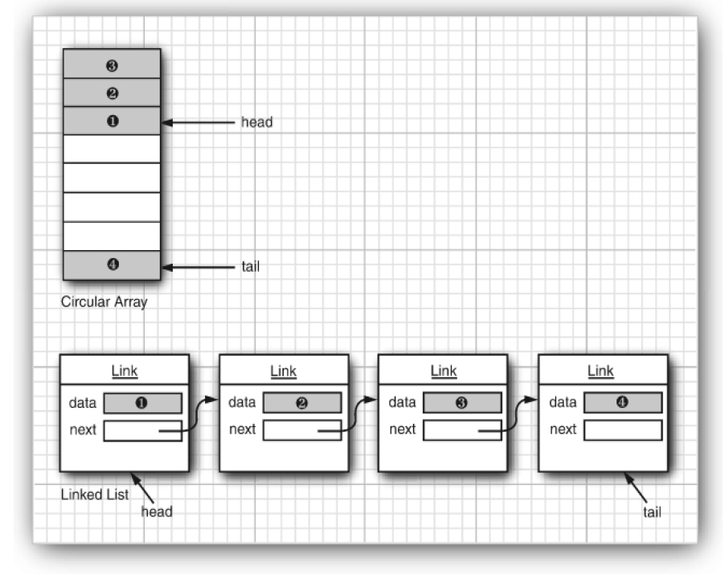
3. **循环数组队列使用ArrayDeque类，链表队列使用LinkedList类**。循环数组队列比链表队列更高效，但是**循环数组是一个有界（bounded）集合，容量/大小是固定的**。

### 9.1.2/3 Collection接口 和 迭代器Iterator

1. Java类库中所有集合都继承的Collection接口。迭代器的hasNext()方法。

```java
package java.util;

public interface List<E> extends Collection<E> {
  ListIterator<E> listIterator(); // 这个方法List接口中有，Collection接口没有，ListIterator专门支持有序集合
  ListIterator<E> listIterator(int n); // 返回固定位置的迭代器==》迭代器在index=n的元素的前面
  ... 
}

public interface Collection<E> extends Iterable<E> {
  boolean add(E e);

  Iterator<E> iterator(); // 返回一个实现了Iterator接口的对象
  ...
}

// 下面是迭代器接口的所有方法
public inteface Iterator<E> {
  E next(); // 后面没有元素了，还调用next()会抛出NoSuchElementException,所以再调用next()方法之前要先调用hasNext()。
  
  boolean hasNext();
  
  default void remove() { throw new UnsupportedOperationException("remove");}

  // 参数是lambda表达式，forEachRemaining方法对每一个元素执行一次这个lambda表达式
  default void forEachRemaining(Consumer<? super E> action) {
    Objects.requireNonNull(action);
    while(hasNext()) {
      action.accept(next());
    }
  }
}
```

2. for each循环可以遍历标准库类中的任何集合。编译器会把for each循环转换为一个带迭代器的循环。

```java
Collection<String> c = ...;
for(String e: c) {
  ...
}
```

编译器会把增强循环for-each循环转换为一个带迭代器的循环。

```java
Collection<String> c = ...;
Iterator<String> iter = c.iterator();
while(iter.hasNext()) {
  String e = iter.next();
}
```

3. 遍历ArrayList是按照index顺序的，HashSet这种是随机的顺序。

4. Java的迭代器Iterator里没有使用数组索引，不能根据index查找某个元素，**迭代器只能按照顺序访问，查找元素的唯一方法是next()方法**。==》Java迭代器位于两个元素中间，当调用next()时，迭代器跳过一个元素并返回刚刚越过的那个元素。
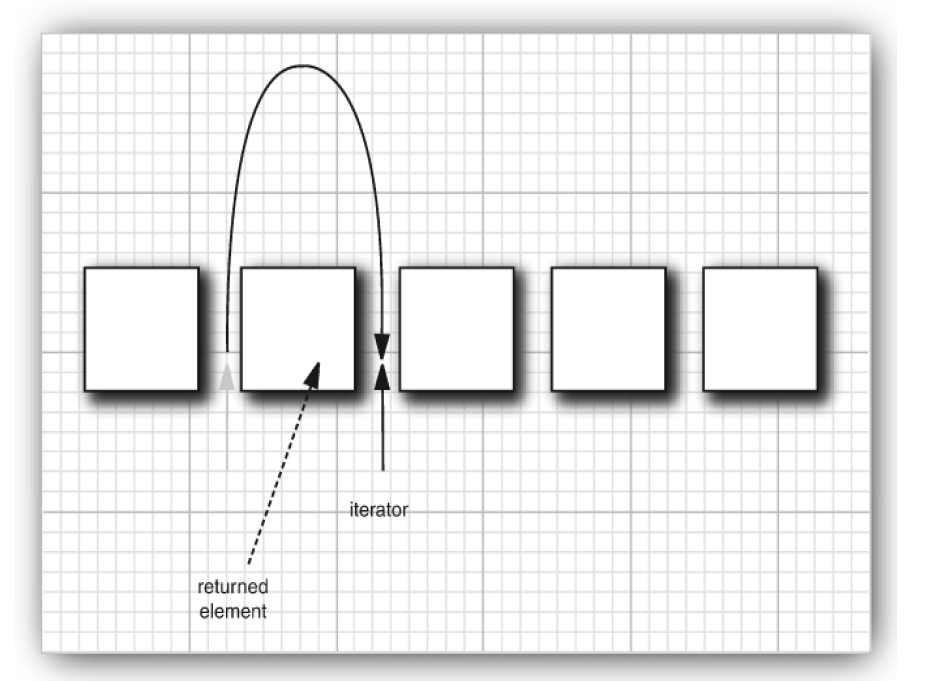

5. **Iterator接口**中的remove方法用来删除上一次调用next()方法时返回的元素==》**每次调用remove()方法之前都必须调用一次next()方法**，否则会IllegalStateException异常。

### 9.1.4 泛型实用方法Generic Utility Methods

1. Collection接口声明了很多方法==》所有Collection的实现类都要实现这些方法。

java.util.Collection\<E>

```java
int size()
boolean isEmpty()
boolean contains(Object obj) // 集合有没有某个对象==》集合内存不存在跟obj相同的对象==》具体判断方式取决于对象的equals方法是如何实现的！！！
boolean containsAll(Collection<?> c) // 同上
boolean add(E element);
boolean addAll(Collection<? extends E> other);
boolean remove(Object obj) // 删除元素
boolean removeAll(Collection<?> other)
void clear() // 清空集合

default boolean removeIf(Predicate<? super E> filter) // 过滤后删除
boolean retainAll(Collection<?> other) // 保留other之内的元素，其他全部删除
Object[] toArray(); // 返回这个集合中的对象的数组
<T> T[] toArray(IntFunction<T[]> generator) // 同上

```

2. 拓展回忆==》Predicate接口和Consumer接口都是函数式接口（有且仅有一个抽象方法的接口）。Predicate是判断元素符不符合条件，用于过滤；Consumer函数本身是让元素执行的内容。

```java
package java.util.function;

@FunctionalInterface
public interface Predicat<T> {
  boolean test(T t);
  ...
}
```

```java
package java.util.function

@FunctionalInterface 
public interface Consumer<T> {
  void accept(T t);
  ...
} 
```

## 9.2 集合框架中interface接口的体系

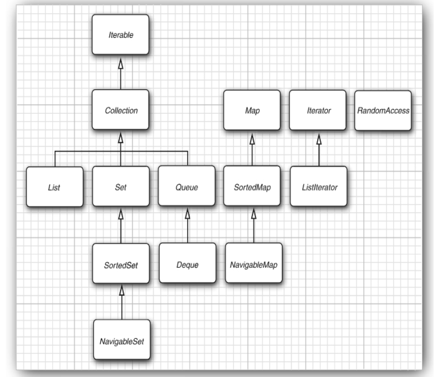

1. 可遍历的Iterable接口和迭代器Iterator是两个接口。
2. List是一个有序集合(ordered collection)。可以使用index **随机访问（random access）** 任意位置的元素，不用通过迭代器按顺序访问。
3. List随机访问的方法：

```java
package java.util;

void add(int index, E e); // 随机访问
E remove(int index); //随机访问
E get(int index); //随机访问
E set(int index, E element); //随机访问

void add();
boolean remove(Object o);
ListIterator<E> listIterator();
ListIterator<E> listIterator(int n);
int indexOf(Object e); // 没有返回-1
...
```

1. 数组支持的有序集合可以快速随机访问，链表不支持随机访问，虽然LinkedList类实现了List接口中看起来像随机访问的方法，如E get(int index)等，其实是假的随机访问，内部还是只能从头开始访问。

2. Set接口和Collection接口的区别：**Set和Collection接口中的方法声明完全一样，但是Set中不允许有重复的元素**，Collection可以==》不是所有Collection都是Set。

## 9.3 具体集合、集合框架中class类的体系

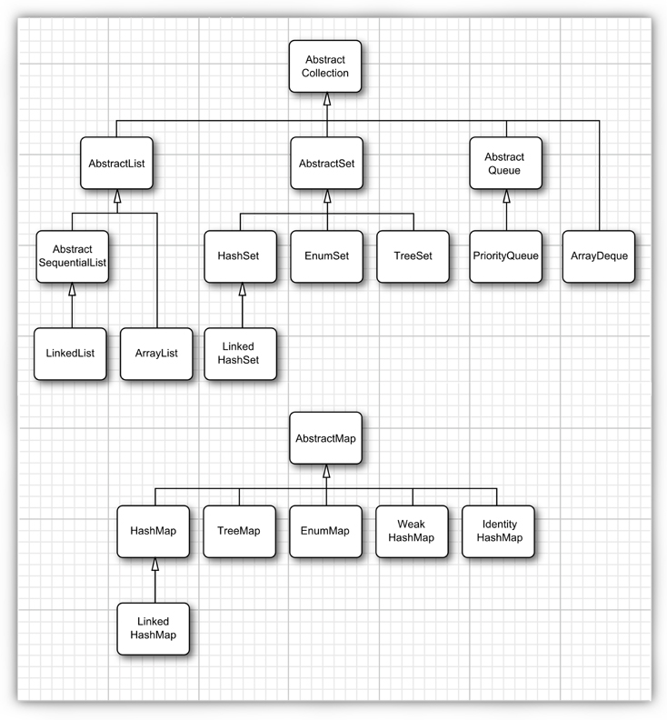

### 9.3.1 LinkedList链表和ListIterator接口

1. 从数组中间删除一个元素开销很大，链表只需要更新链接即可很轻松。
2. **Java程序设计语言中，所有链表实际上都有双向链接（doubly linked），即同时保存了前驱和后继。**
3. 链表是一个有序集合（有序集合LinkedList类是有序集合List接口的实现之一）
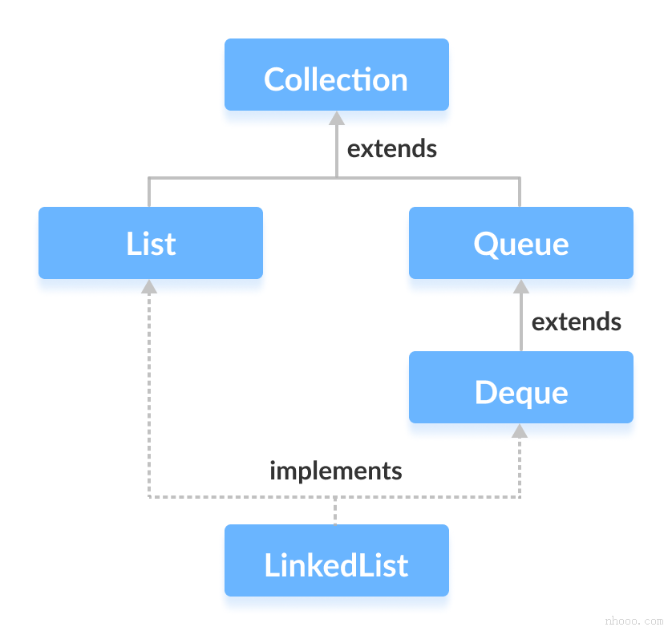

```java
package java.util;

public class LinkedList<E> extends AbstractSequentialList<E> implements List<E>, Deque<E>, Cloneable, java.io.Serializable {
  
}
```

#### ListIterator接口

1. 因为Iterator接口没有add方法，集合类库提供一个子接口ListIterator，有**add方法，每次把元素添加在迭代器所在位置的前面。**

```java
public interface ListIterator<E> extends Iterator<E> {
  boolean hasNext();
  E next();
  boolean hasPrevious();
  E previous();
  void add(E e); // 不返回布尔值，假定每次add都会改变链表
  void set(E e); // 用一个新元素替换next或previous访问的上一个元素
  int nextIndex(); // 返回下一次调用next方法时将返回的元素的index
  int previousIndex(); //返回下一次调用previous方法时将返回的元素的index
  ...
}
```

2. ListIterator接口的方法能**双向遍历链表**，hasNext()和next()是从前往后，previous()和hasPrevious()是从后往前。

3. Iterator和ListIterator迭代器在链表中的位置。假设链表一开始有ABC三个元素。调用迭代器时迭代器在链表第一个元素之前，每调用一次next()方法迭代器越过一个元素：

    |ABC

    A|BC

    AB|C

    ABC|

```java
var a = new LinkedList<String>();
      a.add("A");
      a.add("B");
      a.add("C");

ListIterator<String> aIter = a.listIterator();    // List接口中的方法ListIterator<E> listIterator();
aIter.add(D);
//链表此时是DABC，此时迭代器位置在D|ABC
aIter.add(E);
//链表此时是DEABC，此时迭代器位置在DE|ABC
// ListIterator的add方法，每次把元素添加在迭代器所在位置的前面

```

4. ListIterator迭代器的并发修改异常：如果在一个ListIterator迭代器A修改集合时，另一个ListIterator迭代器B在遍历集合，可能会混乱。
  
```java
List<String> list = . . .;
ListIterator<String> iter1 = list.listIterator();
ListIterator<String> iter2 = list.listIterator();
iter1.next();
iter1.remove();
iter2.next(); // throws ConcurrentModificationException
```

那么iter2是怎么检验出自己指向的位置已经被其他迭代器删掉了，从而报错呢？==》让集合跟踪添加/删除等编辑操作的次数，每个迭代器记录自己进行的编辑操作的次数，如果迭代器记录的次数跟集合的不相等，说明集合被其他迭代器修改了  

5. 链表不支持随机访问，数组支持。链表删、新增元素很轻松，数组则开销很大。
6. **LinkedList链表是双向链表。**

### 9.3.2 数组列表 ArrayList 和Vector

1. 有get(int i)和set(int i, E e)方法。
2. **ArrayList的方法不是同步的，Vector中所有方法都是同步synchronized的。** 如果创建一个动态数组，且会有多个线程访问它，用Vector，但是同步操作本身有开销，不需要同步时更推荐用ArrayList。

```java
package java.util;

//实现了RandomAccess接口，表示可以随机访问
public class Vector<E> extends AbstractList<E> implements List<E>, RandomAccess, Cloneable, java.io.Serializable {
  ...
}
```

```java
public class ArrayList<E> extends AbstractList<E>
        implements List<E>, RandomAccess, Cloneable, java.io.Serializable
{
  ...
}
```

### 9.3.3 散列集 Hash sets

1. 可以快速查找元素，但是不能控制元素出现的次序。
2. 自定义类的时候hashCode方法必须与equals方法兼容==》a.equals(b)为true，则a和b必须有相同的散列值。
3. **Java里的散列表实现为链表数组：每个链表被称为桶（bucket）**，同一个链表里的元素散列值相同，即产生散列冲突（hash collision）的元素。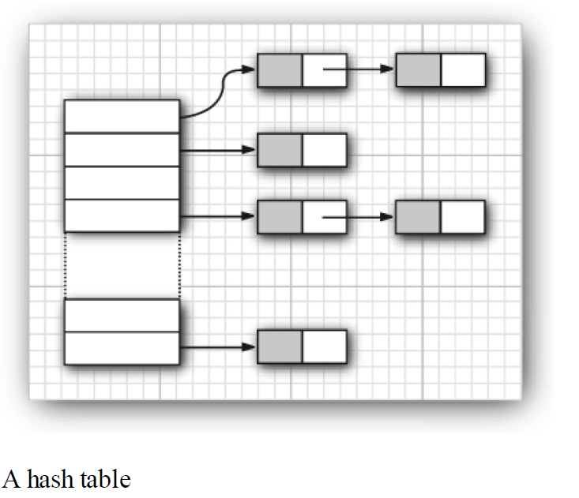==》**Java这里的散列值hash value和 散列码Hash code不等同，散列值 = 散列码 % 总桶数，如散列码76268，共128个桶，散列值为76268%128 = 108，放在第108个桶中。**
4. **Java8中，桶满时会从链表变成平衡二叉树/红黑树（红黑树是一种自平衡的二叉排序树），能提高性能。因此散列表的键要尽可能是一个实现了Comparable接口的类==》键是有序的，可以存在平衡二叉树中。**
5. 如果桶太慢（通常装填因子load factor大于0.75，**对于大多数应用来说装填因子0.75是合理的**），需要再散列（rehashed）==》新建一个散列表，桶数是原先的两倍（标准类库使用的桶数是2的幂），重新散列。
6. **set type，集类型，用散列表实现**的，没有重复元素的集合，Java中的HashSet类就是集。==》散列集迭代器也是按照顺序访问所有的桶，只是元素不按照顺着保存在桶中，所以看起来是随机访问元素。

```java
package java.util;

public class HashSet<E> 
        extends AbstractSet<E> 
        implements Set<E>, Cloneable, java.io.Serializable {
          ...
        }
```

```java
java.util.HashSet<E>
Set<Integer> set = new HashSet<>(); // 构造一个空散列集
Set<Integer> set = new HashSet<>(int initialCapacity); // 指定容量的空散列集。
Set<Integer> set = new HashSet<>(Collection<? extends E> c) // 新建散列集，把Collection中的元素都添加进去并自动去重。
Set<Integer> set = new HashSet<>(int initialCapacity, float loadFactor) // 指定初始容量和最大装填因子，超过装填因子会再散列。
```

```java
java.lang.Object

int hashCode =  obj.hashCode(); // 返回任一Object类实例对象的散列码，散列码是任意整数正负都可。
```

### 9.3.4 Tree Sets 树集 实现了SortedSet接口

1. **树集是一个有序集合（sorted collection）**，可以按任一顺序添加元素，会自动有序的保存在树集中，因此遍历集合时输出是有序的。==》通过**红黑树**实现元素插入/删除时的有序。因此元素**必须**实现Comparable接口或提供一个Comparator，树集中的元素必须是全序的（total ordering，任意两个元素都可以进行比较）。
2. 添加元素到树集中比散列集中要稍慢。
3. Comparable接口用于规定类首位的比较方式，Compararot接口中的Comparator<T> comparing方法返回一个Comparator<T>，用于定义多种比较器。

```java
package java.util;

public class TreeSet<E> extends AbstractSet<E>
    implements NavigableSet<E>, Cloneable, java.io.Serializable
{ 
  ...
}

public interface NavigableSet<E> extends SortedSet<E> {
  ...
}
```

```java
TreeSet<Integer>  treeSet= new TreeSet<>(); // 构造一个空树集；
TreeSet<Integer>  treeSet= new TreeSet<>(Comparator<? super E> comparator);  // 构造一个空树集并指定元素按什么排序
TreeSet<Integer>  treeSet= new TreeSet<>(Collection<? extends E> elements); // 构造一个树集并把collection里的元素添加进去
```

### 9.3.5 队列Queues 与双端队列Deques

1. 双端队列在队头和队尾都能高效地添加和删除元素。ArrayDeque和LinkedList都实现了Deque接口。
2. java.util.Queue接口的方法。add，remove，element失败抛异常，offer，poll，peek失败返回boolean或null。

```java
package java.util;

// 队列，队尾添加元素，队头删除元素
public interface Queue<E> extends Collection<E> {
  boolean add(E e);
  boolean offer(E e); // add和offer都是队尾添加一个元素，如果队列满了添加失败add抛出一个Exception，offer返回false；

  E remove();
  E poll(); // 都是删除并返回队头的元素，如果队列是空的返回失败remove抛出Exception，poll返回null;

  E element();
  E peek(); // 都是返回队头元素但是不删除，如果队列是空的element抛出异常，peek返回null。

  ...
}
```

3. Deque接口继承了Queue接口。add，remove，get失败抛出Exception，offer，poll，peek不抛。

```java
package java.util;

public interface Deque<E> extends Queue<E> {
  void addFirst(E e); // 在队头添加元素
  void addLast(E e);  // 在队尾添加元素，下面的都是这样。
  boolean offerFirst(E e);
  boolean offerLast(E e);

  E removeFirst();
  E removeLast();
  E pollFirst();
  E pollLast();

  E getFirst();
  E getLast();
  E peekFirst();
  E peekLast();

  ...
}
```

4. ArrayDeque类实现了Deque接口。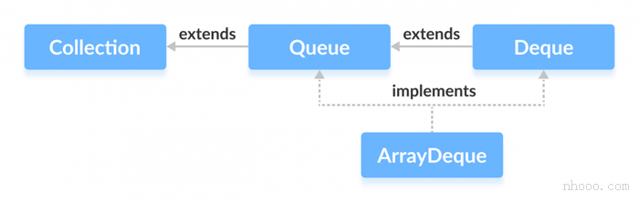 新建一个无限定双端队列。ArrayDeque<Type> animal = new ArrayDeque<>();
  
```java
public class ArrayDeque<E> extends AbstractCollection<E>
                           implements Deque<E>, Cloneable, Serializable
{... }
```

### 9.3.6 优先队列priority queue

1. **优先队列使用堆（heap）结构实现，是一个小根堆**。看作队头元素最小，即二叉树根结点最小，所以**每次remove方法都是获取并删除最小的元素**，add方法可以随便顺序的添加元素，但是调用后优先队列会自动成小根堆。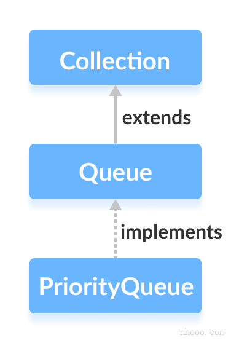
2. 但是从上到下从左到右遍历优先队列的时候不一定是有序序列，因为小根堆的二叉树可能左子树的孩子结点比右子树的根节点值要大。

```java
var pq = new PriorityQueue<LocalDate>();
    pq.add(LocalDate.of(1906, 12, 9)); // G. Hopper
    pq.add(LocalDate.of(1815, 12, 10)); // A. Lovelace
    pq.add(LocalDate.of(1903, 12, 3)); // J. von Neumann
    pq.add(LocalDate.of(1910, 6, 22)); // K. Zuse
    System.out.println("Iterating over elements . . .");
    for (LocalDate date : pq)
       System.out.println(date);
    System.out.println("Removing elements . . .");
    while (!pq.isEmpty())
         System.out.println(pq.remove());

// Iterating over elements . . . 遍历结果满足小根堆但是不是从小到大的有序序列
// 1815-12-10
// 1906-12-09
// 1903-12-03
// 1910-06-22
// Removing elements . . .  remove方法每次输出根节点，都是最小的值
// 1815-12-10
// 1903-12-03
// 1906-12-09
// 1910-06-22
```

3. 优先队列的应用：**任务调度**，可以以随机顺序添加（add方法）任务到队列中，每次执行优先级最高的任务（值越小优先级越高，remove方法每次输出最小的）。

## 9.4 映射 Maps

1. 映射用来存放键值对，提供键（只要跟值有关系即可）就能查找到值，而set只有知道值本身才能查找。
2. Java中的HashMap和TreeMap类都实现了Map接口，HashMap快一点。
3. **HashMap是对键进行散列，TreeMap是根据键的顺序把他们组成成一个搜索树**==》散列和比较函数都只应用于键key，**键必须是唯一的**。
4. **java中HashMap的键跟HashSet是同样的数据结构，都是用链表数组形成的散列表（java8之后当单链表和链表数组的长度达到一定程度，会用红黑树代替链表）；TreeMap里面的键和TreeSet是同样的数据结构，都是红黑树。**

```java
var staff = new HashMap<String, Employee>();
staff.put("144-25-5464", new Employee("Amy Lee"));
staff.forEach((k,v)-> System.out.println("key=" + k + ", value=" + v));
```

```java
package java.util;
public class HashMap<K,V> extends AbstractMap<K,V>
    implements Map<K,V>, Cloneable, Serializable { 
      V get(Object key);
      V getOrDefault(Object key, V defaultValue) // 没有就返回defaultValue
      V put(K key, V value)
      void putAll(Map<? extends K, ? extends V> m) // 把指定映射的所有元素添加到当前映射中
      boolean containsValue(Object value) // 是否有这个value
      boolean containsKey(Object key) // 是否有这个key
      void forEach(Consumer<? super K> action) // 对所有元素/条目/entries执行这个动作
    }

```

4. 如果要统计词汇出现的频率，查询map里有没有这个词，有的话频率加1，没有的话get方法返回null，不方便写，可以这样：

```java
if(counts.get(word) == null) {
  counts.put(word, counts.get(word) + 1);
}
// 改成下面的语句
counts.put(word, counts.getOrDefault(word, 0) + 1);
```

```java
// 使用morge方法
// merge(K key, V value,BiFunction<? super V, ? super V, ? extends V> remappingFunction) 如果map里没有这个key，则添加entry(key,value),如果已经有这个key，则 V oldValue = map.get(key);  V newValue = (oldValue == null) ? value :               remappingFunction.apply(oldValue, value);
Map<String, Integer> mapF = new HashMap<>();
      String[] words = {"apple", "banana", "apple", "orange", "banana", "apple"};
      for(String word : words) {
        mapF.merge(word, 1, Integer::sum); // Integer::sum是方法引用，就是调用Integer.sum(oldV,value)
         mapF.merge(word,1, (oldV, value)-> oldV + value);
      }
      System.out.println(mapF);
```

### 9.4.3 映射视图 Map Views

1. Java中Map不在Collections框架中（不认为Map是一个collection）。
2. Map views就是Map的键集set、值集合collection、键/值对集entries set,他们实现了Collection接口，属于集合框架。

```java
Map<String, Integer> mapF = new HashMap<>();
Set<String> keys = mapF.keySet(); // 键的集
Collection<Integer> values = mapF.values(); // 值的集合
Set<Map.Entry<String,Integer>> entries = mapF.entrySet(); // 键值对的集

for(var entry: mapF.entrySet()) { //写 Map.Entry<String,Integer> 太麻烦，可以用var
   String k = entry.getKey();
   Integer value = entry.getValue();
   entry.setValue(111);
}
```

3. **var只能用于声明方法中的局部变量！**

### 9.4.4 ~ 9.4.7 介绍几个专用的散列映射 弱散列映射 weak hash maps

1. 先了解一下java中的强引用和弱引用：

   (1). 强引用Strong Reference，写Java时一般创建的都是强引用。强引用影响对象的生命周期==》只要存在对一个对象的强引用，该对象就不会被垃圾收集器（garbage collector）回收。

   (2). 弱引用Weak Reference，**如果一个对象只有弱引用指向它，垃圾收集器会在下次回收时回收该对象**。创建弱引用需要特意声明java.lang.ref.WeakReference类。

   ```java

    import java.lang.ref.WeakReference;

    public class WeakReferenceExample {
        public static void main(String[] args) {
            Object obj = new Object(); // 强引用
            WeakReference<Object> weakRef = new WeakReference<>(obj);

            System.out.println("对象存在: " + weakRef.get());  

            obj = null; // 移除强引用

            System.gc(); // 请求垃圾收集器工作

            try {
                Thread.sleep(100); // 等待垃圾收集器
            } catch (InterruptedException e) {
                Thread.currentThread().interrupt();
            }

            System.out.println("对象是否被回收: " + (weakRef.get() == null));  
        }
    }
    
    // 输出结果如下
    //对象存在: java.lang.Object@15db9742
    //对象存在: java.lang.Object@15db9742

    // 可以理解为对象一开始被obj变量强引用，被weakRef 变量弱引用，obj = null强引用被移除，只剩一个弱引用了，因此对象下次就被回收了。
   ```

2. WeakHashMap这个类解决了什么问题：对于普通的HashMap，如果某个键不被任何其他部分引用了，但是因为**这个HashMap本身对这个键是强引用的**，只要这个HashMap本身存在且可达reachable（HashMap本身被引用了），**垃圾回收器就不能回收这个键值对**。==》一直存在可能会导致内存泄漏。
3. WeakHashMap的工作原理 ==> **WeakHashMap和垃圾回收器协作完成**：

   WeakHashMap使用弱引用WeakReference对象来保存键 ==>

   所以键不被其他部分引用时，垃圾回收器就可以回收该对象，并把对应的WeakReference放在一个队列Queue中 ==>

   WeakHashMap内部会定期检查这个队列，检查到某个键的WeakReference在这个队列中时，它就自动移除对应的键值对。

4. 适用于缓存中，当你需要一个缓存机制，并且希望缓存中的条目在不被使用时自动被回收。

### 9.4.5 LinkedHashSet和LinkedHashMap类

1. LinkedHashSet和LinkedHashMap类会记住插入元素项的顺序，实现方式==》**linked hash table是在普通hash table的基础上，按照元素的插入顺序维护一个双向链表**。
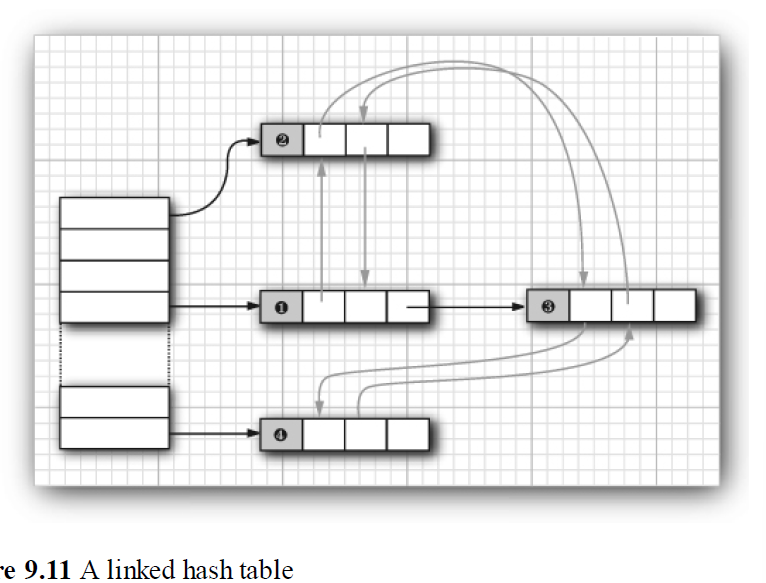

2. LinkedHashSet主要用于维护插入顺序，LinkedHashMap还可以用来维护访问顺序。每次调用get或put方法，即**访问LinkedHashMap中键值对**，就**把这个键值对**从原来的位置**移动到双向链表的末尾**，因此链表最前是“最近最少使用”的，后面是最常用的元素。==》**LinkedHashMap用于实现最近最少使用（Least Recently Used， LRU）缓存**。

```java
LinkedHashMap<Integer, Integer> linkedHashMap = new LinkedHashMap<>(10, 0.75F, true); // accessOrder选true新建按照访问顺序的LinkedHashMap
```

```java
package java.util; 

public class LinkedHashMap<K,V>
        extends HashMap<K,V>
        implements Map<K,V> {
          ...
          public LinkedHashMap(int initialCapacity, float loadFactor, boolean accessOrder) {
            ...
          }

          ...
        }
```

### 9.4.6 Enumeration Sets and Maps 枚举集和枚举映射

1.EnumSet的元素是枚举类型，EnumMap的键是枚举类型。

### 9.4.7 标识散列映射Identity Hash Maps

1. 在IdentityHashMap这个类中，键的hashcode不是通过散列函数计算出的，是通过System.identityHashCode(Object x)根据对象的内存地址计算的，即使==》即比较两个对象时IdentityHashMap认为内存地址相等才相等==》IdentityHashMap比较对象时使用 == 而不是 equals方法。
2. Object.hashCode()和System.identityHashCode(Object x)返回一样的结果。但是其他类一般会重写继承自Object的hashCode方法，所以对于其他类的实例对象obj，obj.hashCode()方法结果一般不等于System.identityHashCode(obj)。
3. == 和equals的区别：== 是引用同一个地址才相等，，equals方法的实现一般是内容相等就看作相等。

## 9.5 副本与视图 Copies and Views

1. 视图如keySet，value collection，entrySet，并不是一个独立的set或者collection，而是通过一种特定方法返回的对象，这个对象只是实现了set或collection接口，是原始map的一个“窗口”，底层操纵的还是原始map的键值对。

### 9.5.1 Java9引入真正的不可变集合ImmutableCollections类

1. List.of()方法、Set.of()方法、Map.ofEntries()方法都是静态static方法，都**返回一个不可变对象**，不可修改（unmodifiable）。
2. List、Set、Map的copyOf方法也是static方法，都返回一个不可变独立副本==》修改原集合，副本不变。  
3. 上面的of、ofEntries、copyOf方法返回的都是ImmutableCollections类的实例化对象，**都跟原件是独立的**。
4. 如果copyOf(obj)复制的原件本身就instanceof ImmutableCollections类，copyOf方法就直接返回原件本身==》不新建一个对象了，节约内存，视图的概念本身就是为了节约内存。

```java
String[] names = new String[]{"tsg","dghh"};
List<String> list = List.of(names);

String e = "peter";
List<String> immutableList = List.of(e, "tom", "dgg");
Set<String> immutableSet = Set.of("peter","tom", "dgg");
Map<String, Integer> immutableMap = Map.ofEntries(
        Map.entry("apple",3),
        Map.entry("banana", 5),
        Map.entry("cherry", 2)
); // 不能调用add，remove，set等修改方法。

List<String> nameList = Arrays.asList("peter","tom", "dgg"); // 之前List的这个静态方法生成的nameList元素可以改变，长度不能改变。

e = "change"; // 改变了e，但是immutableList还是{"peter", "tom", "dgg"};

List<String> copyList = List.copyOf(immutableList);
Set<String> copySet = Set.copyOf(immutableSet);
Map<String, Integer> copyMap = Map.copyOf(immutableMap);
boolean a = copyList == immutableList && copySet == immutableSet && copyMap == immutableMap; // true
```

### 9.5.2 不可修改视图 Unmodifiable Views==》UnmodifiableCollection类

1. Collections是一个类，不是Collection接口。**UnmodifiableCollection**、UnmodifiableList等都**是写在Collections类中的静态static内部类**，他们implement对应的接口，Collections.unmodifiableCollection(Collection<? extends T> c)等方法返回一个UnmodifiableCollection的实例，但是构造器this.c = c引用的就是传进来的参数。==》引用的就是原件对象本身，只不过重写了add等修改器方法（mutator methods），调用就抛错，实现对象的不可修改，称为**原集合的不可修改视图** ==> 引用的就是原件本身，所以原集合变了，视图也会变。

```java
public class Collections {
    // Suppresses default constructor, ensuring non-instantiability.
    private Collections() {
    } 
    
    ...
    // 方法
    public static <T> Collection<T> unmodifiableCollection(Collection<? extends T> c) {
        if (c.getClass() == UnmodifiableCollection.class) {
            return (Collection<T>) c;
        }
        return new UnmodifiableCollection<>(c);  
    }    

    // 静态类
    static class UnmodifiableCollection<E> implements Collection<E>, Serializable {
      ... 
      }
    static class UnmodifiableList<E> extends UnmodifiableCollection<E>
                                  implements List<E> 
      {
        //内部通过包装List实现不可修改结合
        ...
        final List<? extends E> list;

        UnmodifiableList(List<? extends E> list) { // 本质上还是List
            super(list);
            this.list = list; // 本质上就是传进来的参数list本身，引用一个对象，只不过重写了add等方法不让修改而已
        }

        ...
        public void add(int index, E element) {  // 重写add方法，调用就抛错。
            throw new UnsupportedOperationException();
        }
      }
}

```

Collections.unmodifiableCollection

Collections.unmodifiableList

Collections.unmodifiableSet

Collections.unmodifiableSortedSet

Collections.unmodifiableNavigableSet

Collections.unmodifiableMap

Collections.unmodifiableSortedMap

Collections.unmodifiableNavigableMap

### 9.5.3 子范围 subranges

1. List.subList(int from, int to), TreeSet.subSet(E from, E to), TreeMap.subMap(K from, K to),都是获得原件的子集，并且**操作子集会影响原件**。

```java
List<String> list = new ArrayList<>();
list.add("tom");
list.add("amy");
List<String> subList = list.subList(0,1); // 左闭右开
subList.clear(); // subList清空，list的第一个元素也被删除。

// SortedSet<E> subSet(E from, E to)
SortedSet<Integer> sortedSet = new TreeSet<>();
sortedSet.add(1);
sortedSet.add(456);
sortedSet.add(3);
SortedSet<Integer> subSet = sortedSet.subSet(3,456); // subSet里是3这个元素
subSet.remove(3); // sortedSet中的3也被清除了
```

### 9.5.4 Checked Views 检查型视图

1. 用来对泛型类型可能出现的问题提供调试支持。使用检查型视图，会正确进行类型检查。==》比较鸡肋

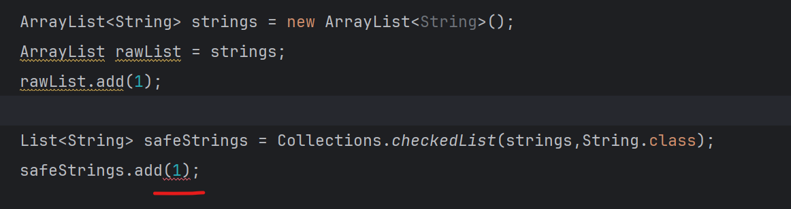
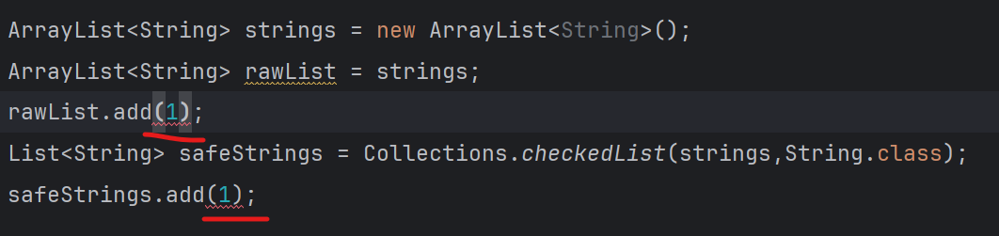

### 9.5.5 Synchronized Views 同步视图

1. Collections类的静态方法 List<T> Collections.synchronizedList(List<T> list) 返回有同步访问的list==》原理跟UnmodifiableCollection类一样，SynchronizedList类是Collections类的内部类，实现了List接口，包装List实现同步的List。

```java
ArrayList<String> strings = new ArrayList<String>();
List<String> synchronizedList = Collections.synchronizedList(strings);
```

2. 同步访问：每个方法调用必须完全结束，另一个线程才能调用另一个方法。

### 9.5.6 关于可选操作的说明

1. 如前面所述，视图通常有一些操作限制，如不能修改，不能改变大小。如果试图执行不当操作，就会跳出UnsupportedOperationException。

## 9.6 算法 Algorithms

1. 在泛型集合接口generic collection interfaces中实现算法，就只需要实现一次。

### 9.6.2 排序sorting与混排shuffling(打乱元素的顺序)

1. **集合类库中没用快速排序，因为快速排序不稳定。**
2. 如果一个list支持set方法，list是可修改的modifiable；如果一个list支持add和remove方法，list是可改变大小的resizable。

```java
public class ShuffleTest
{
   public static void main(String[] args)
   {
      var numbers = new ArrayList<Integer>();
      for (int i = 1; i <= 49; i++)
         numbers.add(i);
      Collections.shuffle(numbers); // 方法签名void shuffle(List<?> list)，打乱元素顺序
      List<Integer> list0 = numbers.subList(0, 6); // 取前六个元素
      List<Integer> list1 = numbers.subList(0, 6); // 取前六个元素
      List<Integer> list2 = numbers.subList(0, 6); // 取前六个元素
      List<Integer> list3 = numbers.subList(0, 6); // 取前六个元素

      // default void sort(Comparator<? super E> c) 传入比较器
      list1.sort(Comparator.comparingInt(Integer::intValue)); // 指定比较器,调用Integer.intValue()方法，相当于list1.sort(Comparator.comparingInt(item -> item))
      list2.sort(Comparator.comparingInt(Integer::intValue).reversed());  // 倒序
      list3.sort(Comparator.reverseOrder()); // 根据元素类型的compareTo()方法的倒叙 排序。
      list3.sort(null); // 使用元素的 compareTo() 方法排序
      list3.sort(Comparator.naturalOrder()); // 使用元素的 compareTo() 方法排序
      
      Collections.sort(list0); // 内部调用list0.sort(null)方法，使用元素的 compareTo() 方法排序
   }
}
```

### 9.6.3 Binary Search 二分查找

1. Collections.binarySearch()方法，二分查找key值，返回index，必须是有序List或者提供比较器。必须实现了RandomAccess接口能够随机访问，才能二分查找，否则该方法退化为线性查找。

```java
static <T extends Comparable<? super T>> int
binarySearch(List<T> elements, T key);

static <T> int binarySearch(List<T> elements, T key,
Comparator<? super T> c)
```

2. binarySearch方法返回负数，表示查找失败，并且该值key应该插入到数组中(-i - 1)的位置。

### 9.6.5 批操作Bulk Operations

```java
List<Integer> list0 = new ArrayList<>(); ...
List<Integer> list1 = new ArrayList<>(); ...

list0.removeAll(list1); // 在list0中删除list1中出现的所有元素
list0.retainAll(list1); // 把list0变成list0和list1的交集。
```

### 9.6.6 Converting between Collections and Arrays 集合和数组的转换

```java
//数组转换为集合。
      String[] names = new String[]{"tsg","dghh"};
      List<String> nameList0 = Arrays.asList(names); //返回一个只能修改元素值，不能添加、删除元素的List==》大小固定的原数组的视图，不是独立的副本、修改List会影响原数组。
      List<String> nameList1 = List.of(names); // 返回一个不可变对象

//集合转换为数组
      Object[] name = nameList1.toArray(); // toArray方法返回Object类型的数组
//      String[] name1 = (String[]) nameList1.toArray(); // 强制类型转换运行时会报错ERROR，因为Object[]不能保证元素都是String类型
      String[] name2 = nameList1.toArray(String[]::new); // 要传入一个数组构造器表达式，才能返回正确类型

```

1. 集合的toArray方法要指定数组正确类型的构造器，强制类型转换运行时会报错。
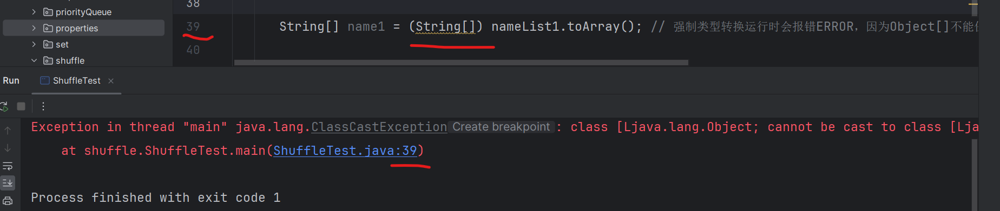

### 编写自己的算法要尽可能使用集合接口interface作为方法的参数和返回类型==》更通用

## 9.7 过时的集合，了解即可

1. 下图是集合框架中过时的类，如Hashtable class（作用基本与HashMap一样）,Enumeration interface,Properties类 extends Hashtable，BitSet类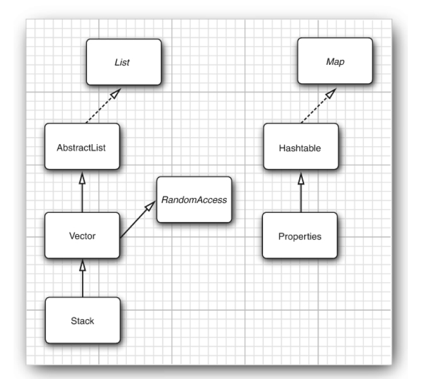

2. java.util.Properties类是一种特殊的map结构==》键和值都是字符串，可以很容易地保存到文件以及从文件加载，主要用于保存程序的配置选项。现代替代方案：Java Preferences API、JSON或XML配置。

3. BitSet类用来存储一个位序列，不是数学意义上的set，称为位数组bitarray更合适。因为BitSet将位包装在字节中，因此比Boolean对象的ArrayList要高效的多。==》现代替代方案Java 8中的IntStream和LongStream。

### 实现栈和队列

#### 栈（Stack）

可以使用 java.util.Stack 类，但推荐使用 Deque 接口的实现类（如 ArrayDeque）来模拟栈，因为 Stack 类的方法是同步的，效率较低。
Deque 提供了 push 和 pop 方法，完美模拟了栈的行为。

#### 队列（Queue）

使用 java.util.Queue 接口及其实现类（如 LinkedList, ArrayDeque）。
PriorityQueue 适用于需要优先级排序的队列。
ArrayDeque 是实现队列的高效选择。

## 线程不安全的集合

1. ArrayList,支持储存NULL值;
2. LinkedList;
3. HashSet;
4. HashMap;
5. LinkedHashSet;
6. TreeSet;
7. TreeMap;
8. PriorityQueue,不支持存储NULL和non-comparable的对象;
9. HashMap支持NULL key 和NULL value，只能有一个NULL key。

## 线程安全的集合

1. Vector;
2. HashTable， 不允许存储NULL key 和NULL value;

TODO ArrayList扩容机制

## ArrayDeque和LinkedList的区别

1. 两者都实现的Deque接口，但是ArrayDeque是基于可变长的数组和双指针来实现，LinkedList是双向链表。
2. ArrayDeque不能存储NULL数据，LinkedList可以。
3. ArrayDeque插入时可能存在扩容过程, 不过均摊后的插入操作依然为 O(1)。
4. ArrayDeque实现队列要比LinkedList性能好==>ArrayList实现List也比LinkedList好。

## 什么是BlockingQueue？

1. BlockingQueue是阻塞队列接口，常用于生产者-消费者模型，接口支持当队列中没有元素时一直阻塞，直到有元素；支持如果队列已满，一直等到队列可以放入新元素时再放入。
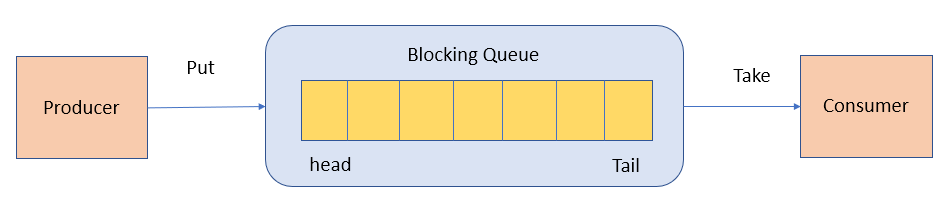

## HashMap 和 HashTable的区别

1. HashMap在Java8之后会把链表变成红黑树；HashTable没有这种机制；

## HashMap 和 HashSet 区别

1. HashSet底层是基于HashMap实现的，HashSet源码中会直接调用HashMap的方法。

## 红黑树的搜索操作的时间复杂度是O(logn)

1. 所以HashMap在Java8之后会把链表变成红黑树可以减少搜索时间：链表的查询效率是O(n),红黑树的查询效率是O(logn),所以当链表较短时，二者性能差异不大，链表变长时，查询性能会显著下降。
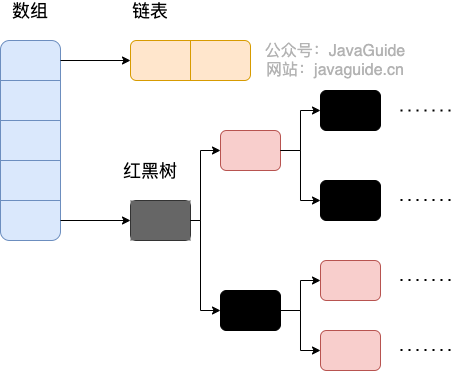

## 集合使用的注意事项

### 集合判空

1. 用isEmpty()方法而不是size() == 0,因为isEmpty()的可读性更好并且时间复杂度是O(1), size()方法的时间复杂度不总是O(1)。
