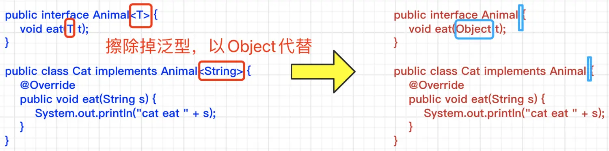
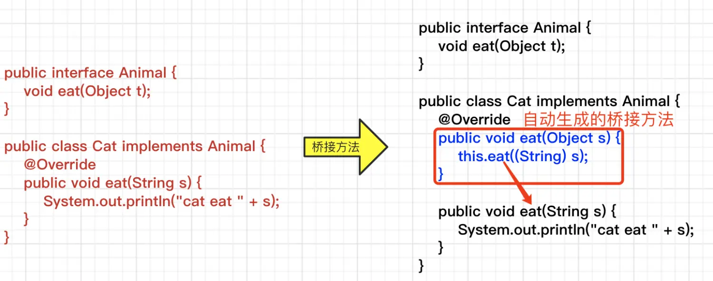
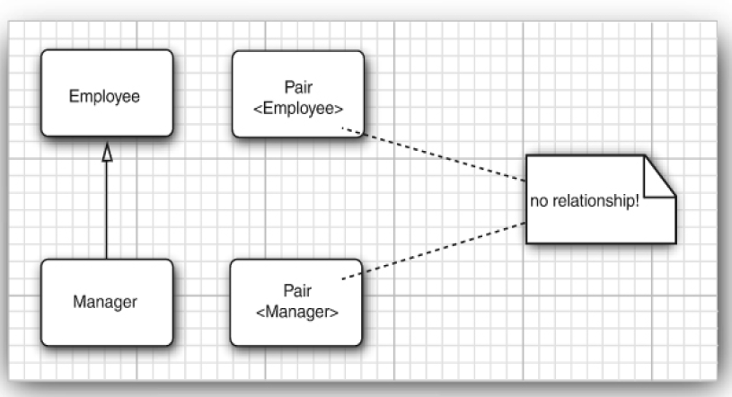
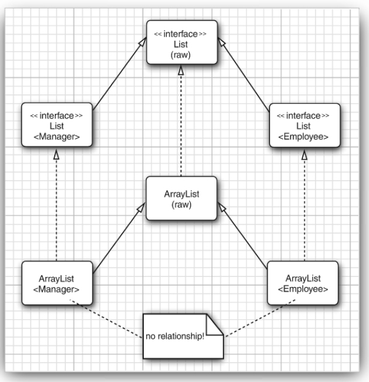
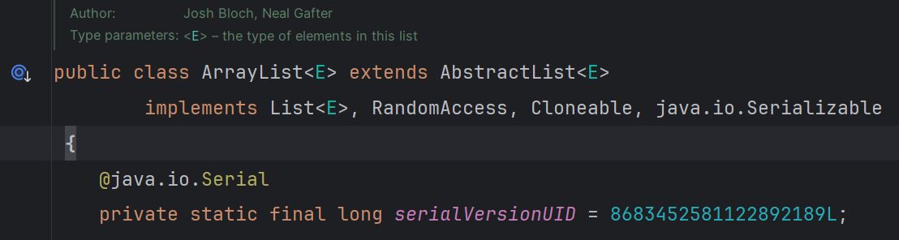
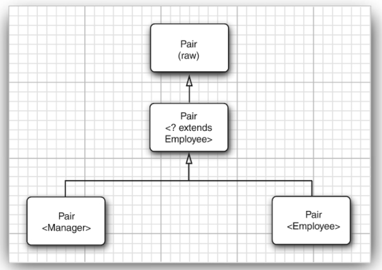
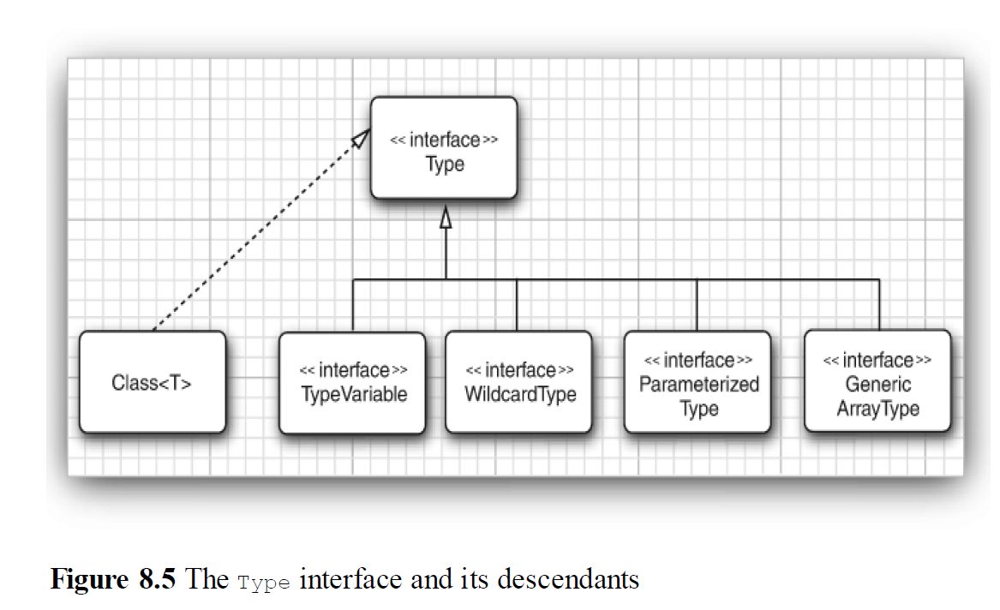

## 8.1 WHY Generic Programming

### 什么是泛型？

1. 泛型是一种类型参数，在定义类、接口或者方式时，使用类型参数\<T>来表示未知的具体类型。

### 泛型的主要作用和意义？或者说泛型解决了什么问题？

1. 让不同类型的对象能够使用同一个方法。==>代码的简洁和复用。
2. 让编译器进行类型检查，避免运行时异常==>Java类型安全。

### 8.1.1 The Advantage of Type Parameters (类型参数)

1. 类型参数（Type Paremeters）就是\<T>里面的T；
2. 泛型的使用方式：**泛型类、泛型接口、泛型方法**。

#### 定义泛型类Generic Class

1. 泛型类类似生成普通类的工厂,给定什么类型参数就能new出来对应的类。
  
```java
Public class Pair<T>{...};

Pair<String> stringPair = new Pair<String>(); // 生成一个处理 String 类型的 Pair 类
Pair<Integer> integerPair = new Pair<Integer>(); // 生成一个处理 Integer 类型的 Pair 类

stringPair.setFirst("Hello");
integerPair.setFirst(123);
```

2. 可以使用多个类型参数

```java
public class Pair<T, U>{...}
```

#### 定义泛型接口

#### 定义泛型方法 Generic Methods

1. 就是把对应的参数换成类型参数T，在方法返回值之前加一个\<T>.

```java
class ArrayAlg {
  public static<T> T getMiddle(T) {
    return ....;
  }
}
```

### 其他概念

1. 在泛型之前可以通过继承实现泛型程序设计，如ArrayList class, 定义参数是Object class，其他类都是Object的子类，能用但是需要cast。现在ArrayList class已经改成使用泛型了。

```java
var files = new ArrayList<String> ();

// 明确定义了类型而不是使用var，等式右边就可以省略类型参数。
ArrayList<String> files = new ArrayList<>(); 
```

2. 使用泛型的优点：**编译器能在编译时就进行类型检查**，而强制类型转换要等到运行时才能发现错误==》出现cast exception at runtime。

3. 涉及大量通用类型的强制类型转换的代码，更适合使用类型参数

4. TODO：通配符类型(wildcard type)

## 8.4 类型变量的限定 Bounds for type variables

1. 在泛型方法中，可能需要调用类型T的某个方法如compareTo方法，所以必须限制类型参数T一定存在该方法，不然会报错。

2. **\<T extends BoundingType>**：表示T是限定类型BoundingType的**子类型subtype**，所以用extends关键字。

```java
public static<T extends Comparable> T getMiddle(T) {
    return ....;
  }
```

3. T和BoundingType可以是类或者接口，**T只能extends一个类**，可以extends多个接口，**类放在BoundingType中的最前面**。

```java

public static<T extends Comparable & Serializable> T getMiddle(T) {
    return ....;
  }

```

## 8.5 泛型代码和虚拟机

1. 因为**虚拟机中没有泛型类型对象，只有普通类的对象**。==》所以编译器

   （1）需要做类型擦除获得原始类型；

   （2）把原始类型进行强制类型转换cast成表达式中需要的；

   （3）合成桥方法保持多态（子类重写父类方法）。

### （1）类型擦除 Type Erasure

1. 如何获得类型擦除后的原始类型（raw type）：用第一个bounding Type来替换类型变量，没有限定类型就用Object替换。
2. 如 \<T extends Comparable & Serializable> ，类型变量被Comparable替代。

### （2）泛型表达式强制类型转换

1.

```java

class ArrayAlg {
  public static<T> T getMiddle(T) {
    return ....;
  }
}
Employee buddy = pair.getMiddle();  // 泛型方法返回Object类型，然后编译器会自己进行cast
```

### （3）类型擦除后子类重写父类的方式时方法签名对不上、影响了多态，编译器通过合成桥方法（bridge method）来保持多态

1. 复习下多态性：**多态性**允许父类引用指向子类对象，并且**在调用方法时，实际执行的是子类中重写（override）的方法**，而不是父类的方法。
2. 下图本来Cat类重写父类中的eat方法，类型擦除后子类中重写的eat方法的参数类型是String，父类中eat方法的参数类型是Object，方法签名对不上（参数类型+方法名），造成代码错误影响了上述1.中的多态性。==》解决办法：编译器生成桥方法把Object强制转换成String，来保持多态。


<https://www.jianshu.com/p/431125f94121>

## Java语言层面和JVM层面方法签名的不同

1. Java语言层面 方法签名 = 方法名 + 参数类型 + 参数顺序。
2. JVM虚拟机层面 方法签名 = 方法名 + 参数类型 + 参数顺序 + 返回值类型。
3. 因为Java语言中允许子类中重写父类的方法时（重写要求方法签名一样），**返回值是可协变的**，**子类中重写的方法的返回值要是父类方法返回值的子类**。
4. 编译器编译后的字节码文件中允许同时存在两个方法：别的都相同，只有返回值不同。
5. Java代码中两个方法的方法名不同，参数不同，叫**重载overloading**；

## 8.6 泛型的限制和局限性==>基本是由类型擦除引起的

1. 类型参数T不能是基本类型，没有Pair\<double>,只有Pair\<Double>。因为类型擦除之后都会变成Object，基本类型不是Object。
2. **运行时的类型检查不适用于类型参数。因为运行前都编译过了，进行过类型擦除了，检查不出来了。**

```java
if(obj instanceof Pair<String>) //发生编译器错误

Pair<String> stringP = ...;
Pair<Emloyee> emloyeeP = ...;
if(stringP.getClass() == emloyeeP.getClass())  // equal，因为类型擦除后都返回Pair.class。
```

3. 不能实例化类型参数的数组，因为数组arr会检查自己内部的元素是不是定义的类型，类型不对则抛出ArrayStoreException。类型擦除后这种功能就对泛型无效了。
  
```
var table = new Pair<String> [10];//ERROR
```

4. 使用泛型作为方法的可变参数(...arg)时，会有警告。因为可变参数其实是一个数组，这就违反了上述第三条规则。如果程序员确定自己的方法或者构造器内部的代码是类型安全的，可以给方法主体加@SafeVarargs，这是一个**断言**，告诉编译器方法内部安全不用检查了不要给警告了。**@SafeVarargs只能用于声明static、final或（Java9中可用）private的构造器和方法**

<https://blog.51cto.com/u_296714/5590182>

5. 不能new一个类型参数T的变量，即 new T()这样写是**ERROR**的，类型擦除后变成Object。==>可以利用反射调用Constructor.newInstance方法来构造泛型对象。

6. 不能new一个类型参数的数组，那么如何得到一个泛型数组的实例化呢？

(1) 使用Array.newInstance方法,是一个反射方法，接受一个Class对象和数组长度作为参数，返回一个泛型数组。

```java
public class GenericArray<T> {
  private T[] array;

  // @SuppressWarnings和@SafeVarargs一样用来抑制编译器警告
  @SuppressWarnings("unchecked")
  public GenericArray(Class<T> clazz, int length) {

    // 由于类型擦除，Array.newInstance 返回的是Object类型，因此需要进行强制类型转换。
    array = (T[]) Array.newInstance(clazz,length);
  }

  public void set(int index, T value) {
    array[index] = value;
  } 

  public T get(int index) {
    return array[index];
  }

  public static void main(String[] args) {
    GenericArray<Integer> integerArray = new GenericArray<>(Integer.class, 10);
    integerArray.set(0,100);
    System.out.println(integerArray.get(0)); // 输出: 100
  }
}
```

(2) 使用List\<T>代替泛型数组，List\<T>本身就是泛型的。

7. 不能在static字段或方法中**引用**类型变量

```java
public class Singleton<T>
{
private static T singleInstance; // ERROR
public static T getSingleInstance() // ERROR
{
if (singleInstance == null) construct new instance of T
return singleInstance;
}
}
```

7. 不能抛出或捕获泛型类的示例，catch(T e) //ERROR
8. 通过使用泛型类、擦除和@SuppressWarnings注解，能消除Java类型系统的基本限制。

9. **同一个类或者类型变量不能同时成为同一个接口的不同参数化类型的子类型**。

    (1). Manager试图实现Comparable\<Manager>，因为Employee中已经实现Comparable\<Employee>,Manager继承Employee之后也试图实现Comparable\<Employee>。

    (2). 类型擦除后Comparable\<Emloyee>和Comparable\<Manager>都会被擦除为Comparable。

    (3). 所以Manager试图实现两个Comparable，不行，会导致冲突。

```java
class Employee implements Comparable<Emplyee> {
  //... 
}

class Manager extends Employee implements Comparable<Manager> {
  //...
} ERROR
```

## 8.7 泛型类型的继承规则

1. 无论S和T有什么关系，Pair\<S>和Pair\<T>都没有任何关系。==>List\<Number> 和List\<Integer>之间没有关系



2. 泛型列表类型之间的关系，implement实现是虚线，extends继承是实线。ArrayList\<E>implements List\<E>接口。





## 8.8 通配符类型Wildcard Types

### 8.8.1 通配符的概念

1. 通配符？允许类型参数变化。
Pair\<? extends Emloyee>,就限定类型参数一定是Emloyee的子类。上界通配符

2. Pair\<? extends Employee> 是Pair\<Manager>的父类，这样用起来更灵活，对应解决“ 无论S和T有什么关系，Pair\<S>和Pair\<T>都没有任何关系”这一条。


3. Pair\<? extends Emloyee>和Pair\<T extends Emloyee>的区别：

   (1).  **Pair\<? extends Emloyee>主要用于声明变量、作为方法的参数。** **声明之后只能get不能set**，只能读不能编辑变量，除非set方法的传入null参数。

   ```java

    public class GenericsTest {
    
     public static void main(String[] args) {
      // TODO Auto-generated method stub
     ArrayList<? extends Number> str ;//在声明类时使用，不清楚泛型的类型，可用？表示，再用  具体的类型实例化
     str = new ArrayList<Integer>();
     //str = new ArrayList<Double>();

     GenericsTest a = new GenericsTest();
     List<Double> list = new ArrayList<Double>();
     a.set(list);//在调用参数时直接使用具体的实参
     }
     public  void set(List<? extends Number> list) {//在定义时泛型参数不确定使用？表示

     }
    }

   ```

   (2). **Pair\<T extends Emloyee>主要用于定义泛型类和泛型方法**，T**可读可写**。

   ```Java

      //泛型类
    class Demo1<T extends ClassDemo>{
     ......
    }
    //泛型方法
    public <T extends ClassDemo> void set(T x) {
     ......
    }

   ```

### 8.8.2 通配符的超类型限定 /下界通配符

1. \<? super T>; 限定类都是T的超类；T是他们的子类。
2. TODO: 前提 Manager extends Employee。Pair<Employee> 是不是 Pair<? super Manager>的子类？Pair<Manager> 是不是 Pair<? extends Employee>的子类？

2. 对比\<? extend T> 和\<? super T>: <https://blog.csdn.net/u014513883/article/details/49820569>

  (1) **\<? extend T> 变量只能读，不能编辑。** 确定？类型的上限

  ```java
    List<? extend Employee> emloyees;
    emloyees.add(new Manager());  // 编译不通过，因为编译器不能确定变量emloyees中规定的到底是Emlployee中的哪个子类。
    emloyees.add(new Employee()); // 编译不通过，理由同上

    // **读操作时只能声明为Employee类或Employee类的父类！！！==》多态，父类引用子类的变量**
    Employee e = emloyees.get(0); // 编译通过，变量e的类型一定是Employee的子类，根据多态性通过编译。
  ```

  (2) **\<? super T> 变量只能编辑，不能读。** 确定？类型的下限；

  ```java
  List<? super Manager> managers;
  // 编辑时不能确定？到底是Manager的哪个父类，只能根据多态性确保类型安全，set的参数只能是Manager或Manager的子类。
  managers.add(new Manager());  // 编译通过
  managers.add(new Executive()); // Executive extends Manager，编译通过
  Manager m = (Manager) managers.get(0); // 读的时候不能确定是哪个父类，managers.get(0)取出来的只能确定是Object类型==》非要用则使用强制类型转换。
  ```

TODO: 生产者和消费者以及泛型的PECS原则（Product生产者使用\<? extends T>,Customer消费者使用\<? super T>）。

### 8.8.3 无限定通配符 unbounded wildcards 只有一个 ？

1. Pair\<?> 相当于Pair\<? extends Object>。只能get并赋值给Object类型的变量，不能set，除非set传入null参数。
2. 可以用任意Object对象调用原始类Pair的set方法，**因为使用原始类型时，编译器不做类型检查**==》类型不安全

```java
Pair rawPair = new Pair();
rawPair.setFirst(new Object()); // 合法
rawPair.setFirst("Hello"); // 合法
```

3. **数组 Pair\<? extends B>[] arr = new Pair[3]; 数组arr中可以有不同类型的元素，如Pair\<A>,Pair\<B>,Pair\<C>,只要类型A、C都是B的子类。**

### 8.8.4 Wildcard Capture 捕获通配符

1. 用类型参数T捕获到通配符？
  
```java
public static void swap(Pair<?> p) {
  swapHelper(p);  // 不知道p的类型
}

// 交换第一、第二个元素
public static <T> void swapHelper(Pair<T> p) {
  // 可以用类型参数T捕获到通配符？，虽然还是不知道是什么类型，但是下面的T是一个明确的类型
  T t = p.getFirst();
  p.setFirst(p.getSecond());
  p.setSecond(t);
}
```

2. ArrayList\<Pair\<T>>中的T捕获不到ArrayList\<Pair\<?>>中的？。因为数组中可以有多个类型的Pair。

## 8.9 reflection and generics 反射和泛型

### 8.9.1 Class类是泛型类

1. String.class是Class\<String>类的对象。
2. 所属的package==》java.lang.Class\<T>

```java
// !!!第一个<T>是泛型类型参数声明
// 第二个Pair<T>是返回类型
public static <T> Pair<T> makePair(Class<T> c) throws
InstantiationException,
IllegalAccessException
{
return new Pair<>(c.newInstance(), c.newInstance());
}

```

### 8.9.3 虚拟机中的类型信息 Generic type information in the virtual machine

1. 编译后也就是虚拟机中泛型信息都被类型擦除(Type Erasure)了,但是**可以利用反射API在程序运行时(已经进行过类型擦除了)获取一些泛型信息**。
2. 类型擦除后，字段fields和方法参数method parameters中的泛型类型仍残存在虚拟机中。利用java.lang.reflect包中的Type接口：

    (1). Class<T>类是Type接口的实现类。

    ```java
    public final class Class<T> implements Type {...}
    ```

    (2). TypeVariale接口，用来描述类型变量；

    WildcardType接口，用来描述通配符；

    ParameterizedType接口，用来描述泛型类generic class或接口类型 inteface types，如Comparable<? super T>;

    GenericArrayType接口用来描述泛型数组。

    ```java
    // 后四个都是extends Type接口的接口
    public interface GenericArrayType extends Type{...}
    ```



程序清单8-4利用就是利用上述API，主要通过Class<T>和Method类中的方法打印给定类的有关信息。

```java
package genericReflection;

import java.lang.reflect.*;
import java.util.*;

/**
 * @version 1.12 2021-05-30
 * @author Cay Horstmann
 */
public class GenericReflectionTest
{
   public static void main(String[] args)
   {
      // read class name from command line args or user input
      String name;
      if (args.length > 0) name = args[0];
      else
      {
         try (var in = new Scanner(System.in))
         {
            System.out.println("Enter class name (e.g., java.util.Collections): ");
            name = in.next();
         }
      }

      try
      {
         Class<?> cl = Class.forName(name); // 根据给出的名字如java.util.Collections 得到指定的类
         printClass(cl);
         for (Method m : cl.getDeclaredMethods()) // 获取类中声明的所有方法
            printMethod(m);
      }
      catch (ClassNotFoundException e)
      {
         e.printStackTrace();
      }
   }

   //printClass() 功能：打印类的名称、类型参数、父类和实现的接口。
   public static void printClass(Class<?> cl)
   {
      System.out.print(cl);
      // cl.getTypeParameters(),是Class<T>类的方法，返回TypeVariable类型的数组
      // public TypeVariable<Class<T>>[] getTypeParameters() {
      //        ClassRepository info = getGenericInfo();
      //        if (info != null)
      //            return (TypeVariable<Class<T>>[])info.getTypeParameters();
      //        else
      //            return (TypeVariable<Class<T>>[])new TypeVariable<?>[0];
      //    }
      printTypes(cl.getTypeParameters(), "<", ", ", ">", true);
      Type sc = cl.getGenericSuperclass(); // getGenericSuperclass()是Class<T>类的方法，获取类的泛型父类，返回Type类型数据
      if (sc != null)
      {
         System.out.print(" extends ");
         printType(sc, false);
      }
      //getGenericInterfaces()是Class<T>类的方法，获取类实现的泛型接口，返回Type[]类型的数据
      printTypes(cl.getGenericInterfaces(), " implements ", ", ", "", false);
      System.out.println();
   }

   //printMethod() 功能：打印方法的修饰符、返回类型、方法名和参数类型。
   public static void printMethod(Method m)
   {
      String name = m.getName();
      // m.getModifiers()：获取方法的修饰符（如 public, static）。
      System.out.print(Modifier.toString(m.getModifiers()));
      System.out.print(" ");
      // m.getTypeParameters()：获取方法声明的类型参数（如 <T>）。
      printTypes(m.getTypeParameters(), "<", ", ", "> ", true);
      // m.getGenericReturnType()：获取方法的泛型返回类型（如 T）。
      printType(m.getGenericReturnType(), false);
      System.out.print(" ");
      System.out.print(name);
      System.out.print("(");
      // m.getGenericParameterTypes()：获取方法的泛型参数类型（如 T[]）。
      printTypes(m.getGenericParameterTypes(), "", ", ", "", false);
      System.out.println(")");
   }

   public static void printTypes(Type[] types, String pre, String sep, String suf, 
         boolean isDefinition)
   {
      if (pre.equals(" extends ") && Arrays.equals(types, new Type[] { Object.class }))
         return;
      if (types.length > 0) System.out.print(pre);
      for (int i = 0; i < types.length; i++)
      {
         if (i > 0) System.out.print(sep);
         printType(types[i], isDefinition);
      }
      if (types.length > 0) System.out.print(suf);
   }

   public static void printType(Type type, boolean isDefinition)
   {
      if (type instanceof Class t)
      {
         System.out.print(t.getName());
      }
      else if (type instanceof TypeVariable t)
      {
         System.out.print(t.getName());
         if (isDefinition)
            printTypes(t.getBounds(), " extends ", " & ", "", false);
      }
      else if (type instanceof WildcardType t)
      {
         System.out.print("?");
         printTypes(t.getUpperBounds(), " extends ", " & ", "", false);
         printTypes(t.getLowerBounds(), " super ", " & ", "", false);
      }
      else if (type instanceof ParameterizedType t)
      {
         Type owner = t.getOwnerType();
         if (owner != null)
         {
            printType(owner, false);
            System.out.print(".");
         }
         printType(t.getRawType(), false);
         printTypes(t.getActualTypeArguments(), "<", ", ", ">", false);
      }
      else if (type instanceof GenericArrayType t)
      {
         System.out.print("");
         printType(t.getGenericComponentType(), isDefinition);
         System.out.print("[]");
      }
   }
}

```

### 8.9.4 类型字面量 Type Literals ==》这里指的是 匿名类

1. Java中的字面量指在程序中无需变量保存，用于表示固定的值，可直接表示为一个具体的数字或字符串。

```java
 a = b * 2; // 2就是一个字面量
```

2. Java中字面量literal的分类： 整型字面量、浮点字面量、字符和字符串字面量、特殊字面量（Null字面量、class literal字面量）。
<https://www.cnblogs.com/zzsuje/p/17751621.html>

3. 类型字面量在Java中表示类型，也可以是泛型类型如List\<String>、List\<Integer>等。

4. 下面代码中的两个**匿名类就是类型字面量**。通过实例化一个TypeLiteral类的匿名子类，如new TypeLiteral\<ArrayList\<Integer>>(){},捕获到Type接口的一个实例>。

```java
// 这是一个泛型类
class TypeLiteral<T>
{
   private Type type;

   /**
    * This constructor must be invoked from an anonymous subclass
    * as new TypeLiteral<. . .>(){}.
    */
   public TypeLiteral()
   {
      //捕获到Type接口的一个实例
      Type parentType = getClass().getGenericSuperclass();
      if (parentType instanceof ParameterizedType paramType) 
         type = paramType.getActualTypeArguments()[0];
      else
         throw new UnsupportedOperationException(
            "Construct as new TypeLiteral<. . .>(){}");            
   }
   
   private TypeLiteral(Type type)
   {
      this.type = type;
   }
   public static TypeLiteral<?> of(Type type)
   {
      return new TypeLiteral<Object>(type);
   }
  //  ...
}


public class TypeLiterals{
  //...
  public static void main(String[] args) throws Exception {
      var formatter = new Formatter();

      // "new TypeLiteral<ArrayList<Integer>>(){}"这句本身是一个匿名类，只不过{}里面是空的。他不是上面的泛型类TypeLiteral<T>的实例化，而是"new TypeLiteral<ArrayList<Integer>>(){}"这个匿名类是泛型类TypeLiteral<T>的匿名子类！
      // "new TypeLiteral<ArrayList<Integer>>(){}"这个匿名类是TypeLiterals的匿名内部类！
      formatter.forType(new TypeLiteral<ArrayList<Integer>>(){}, lst -> join(" ", lst));
      formatter.forType(new TypeLiteral<ArrayList<Character>>(){}, lst -> "\"" + join("", lst) + "\"");
      System.out.println(formatter.formatFields(new Sample()));
  }
}
```

5. 为什么只能用**匿名子类**。==》在普通类或方法中，泛型类型信息在运行时是不可直接访问的,下面代码getClass().getGeneriSuperClass()返回的是MyClass而不是MyClass<String>。

```java
public class MyClass<T> {
    public void printType() {
        Type type = getClass().getGenericSuperclass(); // 返回的是 MyClass<T> 的原始类型信息
        System.out.println(type); // 输出: MyClass<T>
    }
}
```

在匿名子类中，getClass().getGenericSuperclass() 可以获取到泛型父类的类型信息，从而提取出具体的类型参数（如 ArrayList\<Integer>）。**Java编译器会在编译时为匿名子类生成一个具体的类，并将其泛型类型参数固定下来。**

1. 依赖注入框架如CDI和Guice等利用类型字面量来控制泛型类型的注入。因为泛型会被类型擦除，通过类型字面量如上所属利用匿名内部类可以一定程度上保留和利用泛型类型的信息：

  (1). 精确匹配: 框架通过类型字面量精确匹配泛型的类型，从而实现更细粒度的控制。如可以为List\<String> 和 List\<Integer> 提供不同的注入实现。

  (2). 类型安全：类型字面量有助于在编译时保留类型信息，减少运行时错误的可能性。

  (3). 灵活性：框架可以根据不同的类型字面量应用不同的配置和策略，增强系统的灵活性和可扩展性。
