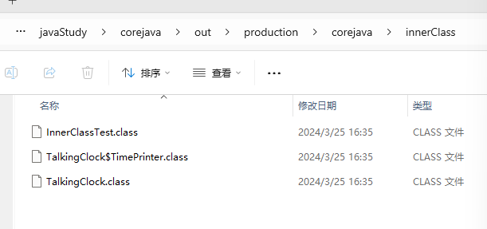
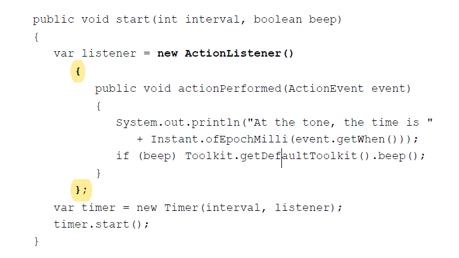
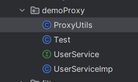

<!--
 * @Author: wyw 355432666@qq.com
 * @Date: 2024-02-27 18:25:33
 * @LastEditors: wyw 355432666@qq.com
 * @LastEditTime: 2024-04-02 16:02:06
 * @FilePath: \Java Core学习笔记\第六章 接口，Lambda和inner Classes.md
 * @Description: 这是默认设置,请设置`customMade`, 打开koroFileHeader查看配置 进行设置: https://github.com/OBKoro1/koro1FileHeader/wiki/%E9%85%8D%E7%BD%AE
-->
1. 接口 interfaces，是用来描述类应该做什么，不用描述类是如何实现具体做法的。describe **what** should do，not **how** should do.
2. **proxies** 代理==>用于实现任意接口的对象，**专门用于构造系统级别的工具**

## 6.1 Interfaces

1. 接口中的**用于规范类行为**的方法都必须是public的，Java9之后可以定义private方法给接口自己用；
2. 接口可以继承；

### 6.1.1 The Interface Concept

1. 接口不是类，是一组requirements（要求、规定），用于规范想要符合该接口的类。

    ```
    public interface Compareble<T>{
        int compareTo(T other)  //里面只有compareTo的概念，类似签名，但是没有具体实现
    }
    ```

2. **接口中的方法都自动public**，所以声明接口中的方法可以省略public关键字。
3. interface中可以**定义常量作为fields，必须是（public static final）的。**但是**没有instance fields 实例域**。
4. 接口中的方法都是概念，**但是Java8之后可以使用一些方法**,这些方法不能引用实例域。
5. 让类实现implements一个接口:  

   (1).用implements关键字  

   (2).类要定义接口中的所有方法，并且**都声明为public**，否则报错

    ```java
    public int compareTo(Object otherObject)
    {
    Employee other = (Employee) otherObject;  //强制转换
    return Double.compare(salary, other.salary);
    }


    //使用泛型
    class Employee implements Compareble<Employee> {
        public int compareTo(Employee other)
        {
        return Double.compare(salary, other.salary);
        }
    }
    ```

6. 在Java中，int类型的取值范围是从Integer.MIN_VALUE到Integer.MAX_VALUE，也就是从-2147483648到2147483647。**当两个大的正整数相减时，可能会导致溢出**，超出了int类型的表示范围，导致结果不再是预期的。**浮点数做减法不存在溢出情况**
7. **compareTo方法的结果要兼容equals方法**，相等的时候则compareTo方法返回0。**但是BigDecimal不行**，==>x = new BigDecimal("1.0") 和y = new BigDecimal("1.00")不相等，因为**精度不同**，但是compareTo方法返回0.
8. 为什么要给类实施接口，强类型语言编译器需要确定这个类中是否有这个方法。
9. 有继承的情况下，要像equals方法一样，不能让不同的类进行比较，因为涉及cast，不能满足对称性。

   ```
   if (getClass() != other.getClass()) {
    throw ClassCastException();
   }
   ```

### 6.1.2 接口的性质

1. 不可以new一个接口，但是**可以定义接口变量，接口变量必须是引用实现该接口的类的对象。**
2. **接口可以继承**
3. 一个类可以实现多个接口

    ```
    class Employee implements Cloneable, Comparable
    ```

4. Records 和enumeration类不能继承其他类，但是可以实现接口
5. 接口可以被封闭sealed，子接口必须在父接口中受用permits声明，或者在用一源文件中。

### 6.1.3 Interfaces and Abstract Classes 接口和抽象类

1. 类只能继承一个抽象类，但是可以实现很多接口。
2. c++中一个类可以有多个超类，太复杂了。

### 6.1.4 Static and Private Methods

1. Java 8之前接口方法只是概念,自动public===>Java 8 可以在接口中添加 静态方法static methods===>Java 9中接口内可以定义**private的static方法或者instance方法**,**只能给接口自己用**，作为其他方法的辅助。
2. 把工具方法放在接口中，就不必单独提供对应的工具类了。

### 6.1.5 Default Methods

1. 接口可以有**默认方法，default修饰符**，**不能只是方法签名，是默认的实现**！
2. **默认方法可以调用接口内部其他方法，抽象方法也可**。

    ```java
    public interface Collection
    {
        int size(); // 一个抽象方法。
        default boolean isEmpty() { 
            return size() ==    0; 
        }
    }
    ```

3. 默认方法的作用：接口演化 interface evolution。===>给接口添加新的方法，写好默认实现，不然所有实现过这个接口的方法都要添加这个方法，不符合源代码兼容source-compatible。

### 6.1.6 Resolving Default Method Conflicts

1. 默认实现和超类或者其他接口中冲突（方法签名一样）：

   （1）. 超类中的实现有限

   （2）. 接口和接口中的默认实现冲突，必须**在类中重写该方法**。**Person.super.getName()**

   ```java
    interface Person
    {
        default String getName() 
        { 
            return ""; 
        };
    }

    interface Named
    {
        default String getName() 
        { 
            return getClass().getName() + "_" + hashCode(); 
        }
    }

    class Student implements Person, Named
    {
        public String getName() 
        { 
            return Person.super.getName();   // 解决冲突的办法，必须选择用了哪个默认方法
        }
    }
   ```

   （3）接口中的默认方法和其他接口中的非默认方法冲突，也会报错

### 6.1.7 Interfaces and Callbacks

1. callback pattern 回调模式：指定在发生特定时间时候，执行某一动作、函数。
2. Java的回调模式传递对象而不是函数，对象能携带更多信息。
3. 定时器回调：**在 Timer 定时器每次触发时，会创建一个新的 ActionEvent 对象，并将其传递给 actionPerformed 方法。**

   ```java
   
    import javax.swing.Timer;
    import javax.swing.JOptionPane;
    import java.awt.*;
    import java.awt.event.*;
    import java.time.Instant;

    public class TimerTest
    {
        public static void main(String[] args)
        {
            var listenr = new TimePrinter();
            var timer = new Time(1000，listener);  //定时器
            timer.start(); // 开启定时器

            JOptionPane.shoeMessageDialog(null,"Quit program?");
            System.exit(0);  // 没有在对话框中主动退出的话，当main方法退出，定时器也会退出。 
        }
    }

    // TimerPrinter 是传给定时器的回调函数/对象
    class TimePrinter implements ActionListener
    {
        public void actionPerformed(ActionEvent event)
        {
            System.out.println("At the tone, the time is" + Instant.ofEpochMilli(event.getWhen()));
            Toolkit.getDefaultToolkit().beep();
        }
    }
   ```

### 6.1.8 The Comparator Interface

1. Array.sort()方法。  

   ```java

    String[] friends = { "Peter", "Paul", "Mary" }; 
    Arrays.sort(friends);
   ```

   （1）. Arrays.sort不传第二个参数，调用的sort方法如下：  
   调用链会调用friends的compareTo方法，默认的比较方法,因为String implements Comparable<String>所以String类型必须实现compareTo方法。  
   调用语句：**((Comparable) dest[j-1]).compareTo(dest[j])**，其中(Compareble)是强制类型转换，**因为String实现了Comparable接口中的所有方法，所以可以强制转换为Compareble类**。

   ```java

    public static void sort(Object[] a) {
        if (LegacyMergeSort.userRequested)
            legacyMergeSort(a);
        else
            ComparableTimSort.sort(a, 0, a.length, null, 0, 0);
    }

    private static void legacyMergeSort(Object[] a) {
        Object[] aux = a.clone();
        mergeSort(aux, a, 0, a.length, 0);
    }

        private static void mergeSort(Object[] src,
                                  Object[] dest,
                                  int low,
                                  int high,
                                  int off) {
        int length = high - low;

        // Insertion sort on smallest arrays
        if (length < INSERTIONSORT_THRESHOLD) {
            for (int i=low; i<high; i++)
                for (int j=i; j>low &&
                         ((Comparable) dest[j-1]).compareTo(dest[j])>0; j--)
                    swap(dest, j, j-1);
            return;
        }

        // Recursively sort halves of dest into src
        int destLow  = low;
        int destHigh = high;
        low  += off;
        high += off;
        int mid = (low + high) >>> 1;
        mergeSort(dest, src, low, mid, -off);
        mergeSort(dest, src, mid, high, -off);

        // If list is already sorted, just copy from src to dest.  This is an
        // optimization that results in faster sorts for nearly ordered lists.
        if (((Comparable)src[mid-1]).compareTo(src[mid]) <= 0) {
            System.arraycopy(src, low, dest, destLow, length);
            return;
        }

        // Merge sorted halves (now in src) into dest
        for(int i = destLow, p = low, q = mid; i < destHigh; i++) {
            if (q >= high || p < mid && ((Comparable)src[p]).compareTo(src[q])<=0)
                dest[i] = src[p++];
            else
                dest[i] = src[q++];
        }
    }
   ```

   ```java
    String[] friends = { "Peter", "Paul", "Mary" }; 
    Arrays.sort(friends, new LengthComparator());
   ```

    （2）. Arrays.sort()传第二个参数,第二个参数是自定义的比较器

    ```java
    class LengthComparator implements Comparator<String>
    {
        public int compare(String first, String second)
        {
            return first.length() - second.length();
        }
    }

    String[] friends = { "Peter", "Paul", "Mary" };
    Arrays.sort(friends, new LengthComparator());
    ```

    Arrays.sort(,)方法对应源码如下，比较时调用的是c.compare(dest[j-1], dest[j])比较器中的compare()方法。

    ```java

    public static <T> void sort(T[] a, Comparator<? super T> c) {
        if (c == null) {
            sort(a);
        } else {
            if (LegacyMergeSort.userRequested)
                legacyMergeSort(a, c);
            else
                TimSort.sort(a, 0, a.length, c, null, 0, 0);
        }
    }

    private static <T> void legacyMergeSort(T[] a, Comparator<? super T> c) {
        T[] aux = a.clone();
        if (c==null)
            mergeSort(aux, a, 0, a.length, 0);
        else
            mergeSort(aux, a, 0, a.length, 0, c);
    }

        private static void mergeSort(Object[] src,
                                  Object[] dest,
                                  int low, int high, int off,
                                  Comparator c) {
        int length = high - low;

        // Insertion sort on smallest arrays
        if (length < INSERTIONSORT_THRESHOLD) {
            for (int i=low; i<high; i++)
                for (int j=i; j>low && c.compare(dest[j-1], dest[j])>0; j--)
                    swap(dest, j, j-1);
            return;
        }

        // Recursively sort halves of dest into src
        int destLow  = low;
        int destHigh = high;
        low  += off;
        high += off;
        int mid = (low + high) >>> 1;
        mergeSort(dest, src, low, mid, -off, c);
        mergeSort(dest, src, mid, high, -off, c);

        // If list is already sorted, just copy from src to dest.  This is an
        // optimization that results in faster sorts for nearly ordered lists.
        if (c.compare(src[mid-1], src[mid]) <= 0) {
           System.arraycopy(src, low, dest, destLow, length);
           return;
        }

        // Merge sorted halves (now in src) into dest
        for(int i = destLow, p = low, q = mid; i < destHigh; i++) {
            if (q >= high || p < mid && c.compare(src[p], src[q]) <= 0)
                dest[i] = src[p++];
            else
                dest[i] = src[q++];
        }
    }
    ```

### 6.1.9 Object Cloning /Cloneable interface

1. copying 和 cloning的区别：copying两个对象引用同一个地址，相互影响，cloning是克隆出一个新对象。
   ；

2. **所有类都继承了Object类的clone方法，是一个protected方法**，只有Employee类可以克隆Employee对象。子类只能访问**子类本身的实例对象继承到的field**，而不是父类实例对象中的field。
3. **clone方法是浅拷贝**。
   
4. **对象中引用的subobject是immtable/final的，浅拷贝才不影响，比如String；不然就要手动实现深拷贝。**
5. 下面是Cloneable 接口的内容。接口中没有指定任何方法（clone方法是继承自Object类）==》这种接口称作**标记接口**，**tagging interfaces或者marker interfaces**。

    ```java
    package java.lang;
    public interface Cloneable {
    }
    ```

6. tagging interfaces能允许使用instanceof做类型确认==> obj instanceof Cloneable
7. **对象请求克隆但是没实现Cloneable接口，会报错。Cloneable 接口这个标记接口的作用就是标记某个对象允许被克隆**
8. 综上，每一个类实现克隆都要

   （1）实现Cloneable接口； 如果没有实现，就会抛出CloneNotSupportedException异常

   （2）重写一个public的clone方法，即使默认clone方法能满足要求

   ```java
   class Employee implements Cloneable
   {
    public Employee clone() throws CloneNotSupportedException  //Exception不能随便自定义
    {
        //调用超类的clone，调用自己的clone方法会循环调用、溢出
        return (Employee) super.clone();
    }
   }
   ```

9. 如果Employee类是final类，即不能被继承，可以在clone方法中try catch 捕获异常；如果不是final类建议不用try catch，把处理异常的自由度留给子类。
10. 为了更好的实现克隆方法在子类中正确运行，**克隆子类不要直接用父类的clone方法，要重写子类的clone方法**，fixed clone好深克隆子类中的对象。
11. clone并不普遍。标准库中只有不到5%的类实现了克隆。
12. TODO：对象的串行化特性也可以实现克隆，object serialization feature，但不怎么高效。

### 衍生内容：协变 covariant return type

**TODO:协变与逆变**

1. 协变convariance，根据组成类型之间的子类型关系，可以确定更复杂的类型之间的子类型关系：  
    如果 A、B 表示参数类型，f(⋅) 表示类型转换，≤ 表示继承关系（比如 A ≤ B 表示 A 是 B派生出来的子类）。

        (1). 协变，A≤ B则f(A)≤ f(B);

        (2). 逆变，A≤ B则f(B)≤ f(A)；

        (3). 不变，A≤ B但(1)、(2)都不成立，f(A)和f(B)之间没有继承关系。

    把Object[]理解为由Object构造出的一种新类型，这种构造类型称为f(Object),**数组是协变的**,Interger是Number的子类，所以Interger[]是Numeber[]的子类。

    ```java
    Number[] numbers = new Integer[0];
    ```

2. 不允许写入元素到一个协变系统中

    ```java
    public static void f() {
        String[] a = new String[2];
        Object[] b = a;
        a[0] = "hi";
        b[1] = Integer.valueOf(42);  // 这里尝试把Integer类型的元素写进协变的数组b中，编译通过但运行时报错！数组b实际上引用的是String类型的数组，不能写入Interger元素。
    }
    ```

3. covariant return type，可协变的返回类型： Object的clone方法默认返回object类型，但是子类重写的时候可以定义更具体的返回类型==>**原本返回类型的子类型**
4. convariant return type的背后思想是**里氏替换准则Liskov substitution**：里氏替换原则是面向对象设计的基本原则，在程序中可以安全地使用子类对象替换基类对象，不会导致程序出错或异常===>这个原则的核心是**子类可以扩展父类的功能，但不能改变父类原有的功能**。

## 6.2 Lambda Expressions

### 6.2.1 & 6.2.2

1. 用简洁的语法定义**可传递的代码块，可以在以后执行一次或者多次**==>以后就是**延迟执行** ***deferred execution***。
2. Lambda表达式的命名来源：很久很久以前，有一个逻辑学家Alonzo Church想要系统化的阐述/表达可以高效做数学计算的函数，他用希腊字母lambda “λ”要表示参数。从那时起，**有函数变量的表达式就被称为lambda表达式**。
3. Java中的lambda表达式：参数要写类型（类型在可以被推断的情况下可以省略），返回值不用写参数类型，一个参数可以省略括号,var和注解绑定也可以表示参数。

    ```java
   (String first, String second)->
   {
    if(first.length()<second.length()) return -1;
    else if (first.length() > second.length()) return 1;
    else return 0;
   }
    ```

    ```java
   (@NonNull var first, @NonNull var second)->first.length()-second.length()
    ```

### 6.2.3 Functional Interfaces 函数式接口

1. 当一个接口有且仅有一个抽象方法，它可以被转化为函数式接口。

    ```java
    class LengthComparator implements Comparator<String>
    {
        public int compare(String first, String second)
        {
            return first.length() - second.length();
        }
    }

    String[] friends = { "Peter", "Paul", "Mary" };
    Arrays.sort(friends, new LengthComparator());
    ```

    上面的例子中，接口Comparator<String>的内容如下,只有一个抽象方法，可以被转为函数式接口

    ```java
    public interface Comparable<String> {
        public int compareTo(String str1, String str2);
    }
    ```

    **因为只有一个抽象方法编译器才能通过上下文推断传递过来的lambda表达式是要给哪个方法去执行。**

    ```java
    Arrays.sort(friends, (first, second)->first.length()-second.length());
    ```

    上面的代码背后其实是，编译器生成一个实现了Comparator<String>接口的类的实例对象，把lambda表达式的内容作为这个实例对象的compare方法的实现，然后把实例对象作为参数传递给Arrays.sort()方法。===>**这个实现过程，不同的Java实现可能会采用不同的方式处理，能更灵活的提高lambda表达式的性能**，**相比较下传统的内部类（上面的 class LengthComparator）可能会引入额外的开销和性能损耗**，没有lambda表达式更高效易读。

2. **java中lambda表达式的唯一作用就是可以转化为函数接口**。不像其他语言中可以定义函数字面量function literal。 **应该不是唯一作用，是主要作用**

   ```java
    基本的函数声明
   function add (x, y) {
        return x+y
    };

    匿名函数赋值给变量
   const add =function(x, y) {
        return x+y;
   } 

    箭头函数
   const add = (x, y) => {
    return x+y;
   }
   ```

3. 与 Stream API 结合使用。TODO:Stream？跟第二点矛盾吗
4. Supplier<T>接口

   ```java
   public interface Supplier<T>
   {
    T get();
   }
   ```

   ```java
    public static <T> T requireNonNullElseGet(T obj, Supplier<? extends T> supplier) {
        return (obj != null) ? 
            obj
            : 
            requireNonNull(requireNonNull(supplier, "supplier").get(), "supplier.get()");
    }
   ```

   Objects.requireNonNullElse方法，只有day是null的时候才需要第二个值，但是下面的写法无论day是否是null，都会构造出一个LocalDate对象，day为null时则构成资源的浪费。

   ```java
   LocalDate hireDay = Objects.requireNonNullElse(day, new LocalDate.of(1970, 1, 1));
   ```

   使用Supplier,只有当day是null的时候，才执行Supplier方法中的get方法，return new LocalDate

   ```java
   LocalDate hirDay = Objects.requireNonNullElse(day, ()-> new LocalDate.of(1970, 1, 1));
   ```

### 6.2.4 Method References 方法引用，具体引用哪个方法取决于上下文

1. System.out::println 就是方法引用。指导编译器**制造一个函数接口的实例**，重写该实例唯一的抽象方法，让方法去执行System.out::println。

   ```java
   var timer = new Timer(1000, event -> System.out.println(event));

   var timer = new Timer(1000, System.out::println);
   ```

   ```java
   Arrays.sort(strings, String::compareToIgnoreCase);
   ```

   ```java
   list.removeIf(Objects::isNull);
   list.removeIf(e -> e == null);
   ```

   上面的removeIf接收Predicate类型的参数，Predicate是函数式接口。

   ```java
   separator::equals
   x -> separator.equals(x)
   ```

   当separator是null的时候，方法引用会立即报NullPointerException，Lambda表达式在被调用的时候才会报错。
2. 不是所有函数式接口都必须要有@FunctionalInterface注解
3. ::前是类或者对象，::后是方法，有三种形式

   ```java
    1. object::instanceMethod
    2. Class::instanceMethod
    3. Class::staticMethod
   ```

   其中this和super也合法，this::instanceMethod 、super::instanceMethod
4. 方法引用和lambda表达式一样，都是在被赋值给一个函数式接口类型的变量时，**在运行时动态生成一个对象，即该函数接口的实例**。
5. 当Lambda表达式**只调用了一个单一的方法**的情况才能被方法引用替换。  s -> s.length() ==0 这种单一方法不能满足的就不能替换
;

### 6.2.5 Constructor References 构造器引用，跟Method References一样，只不过方法的名称是new

1. 数组的构造器引用

    ```java
    Person::new;

    Person[]::new // 相当于Lambda表达式 n->new Person[n];

    Person[] people = stream.toArray(Person[]::new);
    ```

### 6.2.6 Variable Scope 变量作用域-闭包closure

1. Lambda表达式有三个部分：  
   （1）代码块；  
   （2）表达式自身的参数；  
   （3）***free*** variable 自由变量（不是参数且不在代码块中定义的变量），表达式需要把他保存下来-->闭包；  

    下面例子中的text就是自由变量，调用repeatMessage方法的时候，new Timer(delay, listener)生成listener对应的函数式接口的类的实例对象，**在生成对象实例的时候把text变量"Hello"保存在实例中**，lambda expression ***capture*** the variable in the enclosing scope ==> 形成闭包***closure***。

   ```java
    public static void repeatMessage(String text, int delay)
    {
        ActionListener listener = event ->
        {
            System.out.println(text);
            Tolkit.getDefaultToolkit().beep();
        }
        new Timer(delay, listener).start();
    }

    repeatMessage("Hello", 1000);
   ```

2. Any captured variable in a lambda expression must be ***effectively  final***. 被捕获的变量必须是最终变量，不能变。  
（1）  **自由变量被capture后，不能再在lambda表达式内部被更改**，如上文例子中如果更改text，会报错，

   ```java
        ActionListener listener = event ->
        {
            text = text + "!!"; //ERROR
            System.out.println(text);
            Tolkit.getDefaultToolkit().beep();
        }

   ```

   （2） 在lambda表达式中的自由变量也不能是会被外部更改的变量。

   ```java
   public static void repeat(String text, int count)
    {
        for (int i = 1; i <= count; i++)
        {
            ActionListener listener = event ->
                {
                    System.out.println(i + ": " + text); // ERROR: Cannot refer to changing i
                };
        new Timer(1000, listener).start();
        }
    }
   ```

3. lambda表达式的代码块的作用域和嵌套代码一样，**在嵌套代码中不能有同名的变量，即局部变量不能和上一层的外部变量重名！**  
   下面是错误代码！

   ```java
   package com.jpy.backend.modules.base.dao.entity;

    public class test {
        public static void main(String[] args) {
            int x = 10; 
            System.out.println("外部代码块中的 x：" + x);

            {
                int x = 20;  // ERROR!
                System.out.println("嵌套代码块中的 x：" + x);
            }

            System.out.println("外部代码块中的 x：" + x);
        }
    }

    Path first = Path.of("/usr/bin");
    Comparator<String> comp = (first, second) -> first.length() - second.length(); // ERROR

   ```

4. lambda表达式里的this跟lambda表达式所在的方法里的this是同一个this;

   ```java
   public class Application
    {
        public void init()
        {
            System.out.println(this.toString());  // 相同
            ActionListener listener = event ->
            {
                System.out.println(this.toString());  // 相同
                . . .
            }
        . . .
        }
    }
   ```

### 6.2.7 处理Lambda表达式——怎么写可以使用Lambda表达式的方法

1. 使用Lambda表达式是因为需要**延迟执行** ***deferred execution***，如几种情况下：  
   代码需要在另外的线程运行、  
   代码需要多次运行（数组的排序比较）、  
   在算法的适当位置运行（如排序比较）、
   当发生某事件时代码再运行、
   必要时才运行

   如Arrays.sort()方法，Lambda表达式的内容被延迟执行到了Arrays.sort()方法的内部，**只有当sort()方法被调用时才执行Lambda表达式并且会被执行多次**。

2. 常见的函数式接口
   

   基本类型的特殊化规范的函数式接口，比上面泛型的更高效（TODO:第八章介绍原因）  
   p, q is int, long, double; P, Q is Int, Long, Double
   

3. 大多数标准的函数接口有具体的已实现的combining functions，如:

   ```java
   Predicate.isEqual(a).or(Predicate.isEqual(b))
   //相当于
   x -> a.equals(x) || b.equals(x)
   ```

4. 设计interface的时候如果是函数式接口可以用 **@FunctionalInterface注解，不是必须要用** 。用了之后如果超过一个抽象方法，编译器会报错。

### 6.2.8 More about Comparators

1. Comparator接口中的静态方法comparing接收keyExtractor参数，返回一个根据这个key值提取出来的Comparator比较器，意思是根据这个键的比较器进行比较。

   ```java
   Arrays.sort(people, Comparator.comparing(Person::getName)); // 根据Person对象的name属性进行排序；
   ```

2. 连续比较 thenComparing

    ```java
    Arrays.sort(people, Comparator.comparing(Person::getLastName).thenComparing(Person::getFirstName));
    ```

3. 在keyExtractor的基础上指定比较器

   ```java
   import static java.util.Comparator

   Arrays.sort(people, Comparator.comparing(
    Person::getName, 
    (s, t) -> Integer.compare(s.length(), t.length())
    ));
   ```

   comparing的类型比较变体，包括int，long，double；

   ```java
   import static java.util.Comparator

   Arrays.sort(peopel, Comparator.comparingInt(
    p -> p.getName().length()
   ))
   ```

   null值也参与比较

   ```java
    Arrays.sort(people, Comparator.comparing(Person::getName, Comparator.nullsFirst(naturalOrder())));

    Arrays.sort(people, Comparator.comparing(Person::getName, Comparator.nullsLast(naturalOrder())));

    Arrays.sort(people, Comparator.comparing(Person::getMiddleName,Comparator.nullsFirst(reverseOrder())));
    Arrays.sort(people, Comparator.comparing(Person::getName, Comparator.nullsFirst(naturalOrder().reversed())));
   ```

## 6.3 Inner Classes 内部类

1. **内部类对于同包的其他类是隐藏的**；
2. 内部类有定义他的作用域的数据权限，包括private field;
3. 作用：  
   （1）执行会调用，已被lambda表达式取代；  
   （2）优化代码结构

### 6.3.1 Use of an Inner Class to Access Object State

1. **内部类引用了创造他的外部类的实例对象**。下面的TimePrinter是TalkingClock的内部类。
   相当于TalkingClock的start方法构建TimePrinter实例的时候，把this传进去了，即var listener = new TimePrinter(this);所以在TimePrinter中可以使用TalkingClock的实例域beep。==> **内部类可以访问创建它的外部类的对象的数据域**

   ```java
   class TalkingClock
    {
       private int interval;
       private boolean beep;

       /**
        * Constructs a talking clock
        * @param interval the interval between messages (in milliseconds)
        * @param beep true if the clock should beep
        */
       public TalkingClock(int interval, boolean beep)
       {
          this.interval = interval;
          this.beep = beep;
       }

       /**
        * Starts the clock.
        */
       public void start()
       {
          var listener = new TimePrinter();
          var timer = new Timer(interval, listener);
          timer.start();
       }

       public class TimePrinter implements ActionListener
       {
          public void actionPerformed(ActionEvent event)
          {
             System.out.println("At the tone, the time is " 
                + Instant.ofEpochMilli(event.getWhen()));
             if (beep) Toolkit.getDefaultToolkit().beep();
          }
       }
    }
   ```

2. 引用外部类域的规范语法:

   ```java
      public class TimePrinter implements ActionListener
   {
      public void actionPerformed(ActionEvent event)
      {
         System.out.println("At the tone, the time is " 
            + Instant.ofEpochMilli(event.getWhen()));

        // OuterClass.this
         if (TalkingClock.this.beep) Toolkit.getDefaultToolkit().beep();
      }
   }
   ```

3. 在外部类的外面引用内部类

   ```java
    TalkingClock jabberer = new TalkingClock(1000, true);
    TalkingClock.TimePrinter listener = jabberer.new TimePrinter();
   ```

4. 内部类中的static field静态域必须是final的==》让静态域有唯一的实例。
5. 内部类中不能有static methods。
6. 编译时，内部类被转为普通的类文件，文件名通过$改造。==> **TalkingClock类被编译会生成两个类文件**，TalkingClock.class和TalkingClock$TimePrinter.class
   
7. UNIX系统中的命令要转义$符。

   ```java
   javap -private innerClass.TalkingClock\$TimePrinter
   // javap 是 Java 反编译工具的命令。
   //-private 参数告诉 javap 命令输出所有访问级别为 private 的成员变量和方法。
   ```

8. .java文件被编译成.class文件，.class文件是字节码，记事本打开时乱码，反编译成源码，但是跟源码不完全一致。IDEA自带反编译，一般不需要自己反编译。
9. Java11之前，内部类只涉及到编译，与虚拟机无关，Java11之后虚拟机可以理解类之前的嵌套关系了。

### 6.3.4 Local Inner Classes 局部内部类：定义在某个类的某个方法中的内部类

1. TimePrinter类只在TalkingClock类的start方法中用到，所以内部类只定义在start方法中，内部类的作用域只在start方法的block中。

```java
   class TalkingClock
    {
       private int interval;
       private boolean beep;

       public TalkingClock(int interval, boolean beep)
       {
          this.interval = interval;
          this.beep = beep;
       }

       public void start()
       {
            public class TimePrinter implements ActionListener
            {
                public void actionPerformed(ActionEvent event)
                {
                    System.out.println("At the tone, the time is " 
                        + Instant.ofEpochMilli(event.getWhen()));
                    if (beep) Toolkit.getDefaultToolkit().beep();
                }
            }

            var listener = new TimePrinter();
            var timer = new Timer(interval, listener);
            timer.start();
       }

    }
```

2. **局部内部类仍然可以访问TalkingClock类的实例域和方法、引用TalkingClock对象，只是作用域和可见性仅在start()方法中了。**

### 6.3.5 Accessing Variables from Outer Methods

1. **局部内部类可以访问创建它的方法中的局部变量**，普通内部类不能访问其他方法中的局部变量。
2. 必须把Local inner class访问的方法中的**局部变量定义为final**。因为**局部内部类的生命周期可能会比外部方法的生命周期长**，如果**不final外部方法执行完毕后局部变量被销毁**，局部内部类就不能正常访问。
3. 下面的局部内部类TimePrinter 中引用了start方法中的局部变量beep和interval，**局部内部类会capture外部方法中的局部变量，形成闭包**，编译的时候在局部内部类中被保存为**final变量**，延长局部变量的生命周期。
4. Java11之后不用显式得把局部内部类引用的局部变量定义为final，它是事实final的，不可更改。

```java
  class TalkingClock
    {
       private int interval;
       private boolean beep;

       public TalkingClock(int interval, boolean beep)
       {
          this.interval = interval;
          this.beep = beep;
       }

    public void start(int interval, boolean beep)
    {
        class TimePrinter implements ActionListener
        {
            public void actionPerformed(ActionEvent event)
            {
                System.out.println("At the tone, the time is " + Instant.ofEpochMilli(event.getWhen()));
                if (beep) Toolkit.getDefaultToolkit().beep();
            }
        }
        var listener = new TimePrinter();
        var timer = new Timer(interval, listener);
        timer.start();
    }

    }
```

### 6.3.6 Anonymous Inner Classes 匿名内部类，也是匿名子类==>被Lambda表达式替代

1. 匿名内部类


1. 语法，看起像构造一个超类的对象，但是后面紧接着括号，他创建的是一个类，且创建的是new的这个接口或者类的子类。以下面代码为例，**new Comparator\<Integer>() {}实际上是一个实现了Comparator接口的类，所以是Comparator的子类**。

```java
        Integer[] arr = new Integer[10];
        Arrays.sort(arr, new Comparator<Integer>() {
            @Override
            public int compare(Integer o1, Integer o2) {
                return o1 - o2;
            }
        });
```

编译器会为匿名内部类new Comparator<Integer>() {}声明一个单独的类.class文件，文件内容如下, 所以生成的这个AnonymousComparator类是继承了Comparator接口的子类。**匿名内部类的超类也就是Compatator可以是类或者接口。** **如果超类是一个泛型类型的话，在JVM生成单独的匿名子类的过程中，就会把泛型信息固化下来，可以利用反射再去获取**。

```java
// 编译器生成的伪代码（仅示意）
final class AnonymousComparator implements Comparator<Integer> {
    @Override
    public int compare(Integer o1, Integer o2) {
        return o1 - o2;
    }
}

// 使用时
Arrays.sort(arr, new AnonymousComparator());
```

3. 类的构造器必须与类同名，但是匿名内部类没有名字，**所以匿名内部类没有构造器**。
4. 匿名内部类的作用：以前用作时间监听和其他回调，现在可以用Lambda 表达式替代：

```java
    public void start(int interval, boolean beep) {
        var timer = new Timer(interval, event ->{
            System.out.println("At the tone, the time is " + Instant.ofEpochMilli(event.getWhen()));
            if (beep) Toolkit.getDefaultToolkit().beep();
        })
        timer.start();
    }
```

5. 双花括号初始化 ***double brace initialization***，其实就是匿名内部类。第一个括号是匿名内部类，第二个是**初始化块**

```java
    invite(new ArrayList<String>() {
        { 
            add("Harry");
            add("Tony");
        }
    })
```

6. 补充第四章 ***initialization block*** 初始化块的内容
类初始化数据域的三种方法：  
（1）实例域中声明；
（2）构造器；
（3）初始化块中设置。
**先运行初始化块，再运行构造器主体**

### 6.3.7 Static Inner Classes 静态内部类

1. 内部类不需要引用外部的类的实例，只是把它隐藏在外部类中使用，可以**把内部类定义为static的，消除对外部对象的引用**。

## 6.4 Service Loaders 服务加载器？ TODO：看中文版

## 6.5 Proxies 代理

1. 什么是代理？代理是一种设计模式，可以在不修改原目标对象的前提下，控制对原对象的访问，**在执行原对象的方法之前、之后执行其他操作，进而扩展原对象的功能。**
2. 本来要调用原对象的方法，现在原对象交由代理对象控制，所以改成调用代理对象的对应方法 ==> **原对象有什么方法代理对象就要有什么方法，代理对象要跟原对象实现同样的接口**。
3. 代理的分类：

    (1). 静态代理，指的是在编译之前代理类就已经实现了==> 很少用、死板；

    (2). 动态代理，在运行的时候才动态的生成一个新的代理类，java.lang.reflect.Proxy类用来实现动态代理。

3. 为什么要使用代理，什么情况下使用动态代理？

   (1). **使用代理模式把核心业务逻辑与附加功能分离，实现解耦。**

   (2). **一个代理可以代理多个对象，给他们添加相同的附加功能。**

    如很多业务类都需要添加日志、进行方法的效率分析，这些与核心业务逻辑无关，可以写在代理中。

6. 动态代理的应用：

   (1). AOP面向切面编程；

   (2). Spring使用CGLIB动态代理管理Bean对象。

### 6.5.1 什么时候使用代理:在编译的时候无法确定要实现哪个接口==>在运行的时候创建

1. 代理类会在运行的时候创建全新的类，要求代理类包含以下方法：

   (1). Proxy类中要有Object 类中的全部方法；

   (2). Proxy类中要有指定接口所需要的全部方法。
2. 使用代理则必须提供一个调用处理器（实现了InvocationHandler interface的类的实例对象），InvocationHandler interface中的唯一方法：

```java
    Object invoke(Object proxy, Method method, Object[] args)
```

调用代理对象中的任意方法，都会调用这个调用处理器的invoke方法，需要提供Method object和方法原始需要的参数。

### 6.5.2 Creating Proxy Objects

1. 用Proxy类的newProxyInstance方法创建proxy对象。  
    三个参数：  
    （1）***class loader*** 类加载器；

    （2）一个Class objects 数组，内部的元素是需要实现的接口；

    （3）调用处理器 invocation handler

### 动态代理案例

1. ProxyUtils生成并返回代理对象，Test是主程序，代理用于计算方法的执行时间、分析方法的效率。

```java
package com.itheima.mybatisDemo.demoProxy;

import ch.qos.logback.core.encoder.EchoEncoder;

// 用户业务接口
public interface UserService {
    // 登录功能
    void login(String loginName, String passWord) throws Exception;

    // 删除用户
    void deleteUser() throws Exception;

    // 查询用户，返回数组形式的用户
    String[] selectUsers() throws Exception;
}

```

```java
package com.itheima.mybatisDemo.demoProxy;

// 用户业务的实现类(面向接口编程)
public class UserServiceImp implements UserService{
    @Override
    public void login(String loginName, String passWord) throws Exception {
        if("admin".equals(loginName) && "123456".equals(passWord)) {
            System.out.println("登录成功");
        } else {
            System.out.println("登录失败");
        }
        Thread.sleep(1000);
    }

    @Override
    public void deleteUser() throws Exception {
        System.out.println("成功删除用户");
        Thread.sleep(1500);
    }

    @Override
    public String[] selectUsers() throws Exception {
        System.out.println("查询出了三个用户");
        String[] names = {"张三", "李四", "牛爱花"};
        Thread.sleep(500);
        return names;
    }
}

```

```java
package com.itheima.mybatisDemo.demoProxy;

import java.util.Arrays;

public class Test {
    public static void main(String[] args) throws Exception{
//        UserService userService = ProxyUtils.createUserServiceProxy(new UserServiceImp());

        UserService userService = ProxyUtils.createRunTimeProxy(new UserServiceImp()); // 这里返回的是运行时生成的代理类对象。

        userService.login("admin","123456");
        userService.deleteUser();
        String[] names = userService.selectUsers();
        System.out.println("查询到的用户是" + Arrays.toString(names));
    }
}

```

```java
package com.itheima.mybatisDemo.demoProxy;

import java.lang.reflect.InvocationHandler;
import java.lang.reflect.Method;
import java.lang.reflect.Proxy;

public class ProxyUtils {
    public static UserService createUserServiceProxy(UserServiceImp obj) {
        // 生成的代理对象实现了原对象的UserService接口
        // 用java.lang.reflect.Proxy的newProxyInstance方法生成代理对象
        UserService proxy = (UserService) Proxy.newProxyInstance(
                // 参数一、类加载器，用于加载生成的代理类；
                ProxyUtils.class.getClassLoader(),
                // 参数二、用于指定代理类需要实现哪些接口，因此是数组格式Class<?>[] interfaces, 这里利用反射在运行时获取原对象实现的接口，就不用写死，在编译前不需要知道原对象到底实习了哪些接口，符合动态代理的情况。
                obj.getClass().getInterfaces(),
                // 参数三、调用处理器 invocation handler，用于拦截原对象的方法，里面写代理对象中的方法需要实现的内容。
                new InvocationHandler() {
                    @Override
                    public Object invoke(
                            // 参数一、代理对象本身
                            Object proxy,
                            // 参数二、method表示正在被代理的方法
                            Method method,
                            // 参数三、表示正在被代理的方法的参数。
                            Object[] args) throws Throwable 
                    {
                        long start = System.currentTimeMillis();
                        // --------------- 切面
                        Object result = method.invoke(obj, args); // 调用原对象的方法
                        // --------------- 切面
                        long end = System.currentTimeMillis();
                        System.out.println(method.getName() + "方法耗时:" + (end - start) / 1000 + "秒");
                        return result;
                    }
                }
        );

        return proxy;
    }

    // 改成泛型，就不止可以给UserService接口用了。
    public static <T>T createRunTimeProxy(T obj) {
        T proxy = (T) Proxy.newProxyInstance(
                ProxyUtils.class.getClassLoader(),
                obj.getClass().getInterfaces(),
                new InvocationHandler() {
                    @Override
                    public Object invoke(Object proxy, Method method, Object[] args) throws Throwable {
                        long start = System.currentTimeMillis();
                        // ---------------
                        Object result = method.invoke(obj, args);
                        // ---------------
                        long end = System.currentTimeMillis();
                        System.out.println(method.getName() + "方法耗时:" + (end - start) / 1000 + "秒");
                        return result;
                    }
                }
        );

        return proxy;
    }
}

```

---

**Java类加载机制**

1. class loader 类加载器：是JVM中的一个重要组件，负责在运行时动态的把class文件的字节码数据读取到JVM中，并映射为JVM认可的数据结构（Java.lang.class对象）来运行（根据程序需要动态加载，不是一开始全部加载进去）==>**类加载器就是实现"通过一个类的全限定名来获取描述此类的二进制字节流"这个动作的代码模块**
2. **加载类的类加载器和类本身确定类的唯一性。**  ==>同一个类，被不同的加载器加载，那这两个类不相等。
3. ClassLoader有以下几类：

    （1）BootstrapClassLoader,JVM虚拟机的一部分，是最顶层的类加载器，负责加载核心JavaClass（所有Java.*开头的类）

    （2）Extension ClassLoader负责加载扩展的Javaclass(如所有javax.*开头的类)

    （3）ApplicationClassLoader负责加载应用程序自身的类。
4. 运行一个程序的加载流程：JVM启动，运行bootstrapclassloader，该ClassLoader加载Java核心API，然后调用Extension ClassLoader加载扩展API，最后ApplicationClassLoader加载classpath目录下定义的class。
5. bootstrapclassloader是Extension classLoader的父加载器，Extension classLoader是ApplicationClassLoader的**父类加载器**。
6. **双亲委派类加载机制**：当一个java类需要被加载时，JVM先将加载请求传递给它的父类加载器，父类加载器加载过就直接用内存里的，一直向上委托，如果到顶层的类加载器都没加载过就让下一层类加载器加载，**如果所有的父类加载器都无法加载该类，则由最初接收到请求的类加载器自己尝试加载**。====>与上面类的唯一性确定有关，**防止重复加载**，保证Java程序的安全性和稳定性。
7. 类加载和初始化的其他细节参考：如链接（验证、准备、解析）<https://blog.csdn.net/is_Javaer/article/details/82773920>

---

2. proxy的用途：debugging时跟踪方法调用、作为客户端与远程服务器之间的中间层代理转发请求、在程序运行期间把用户接口时间和动作关联。

TODO: 下次再看
