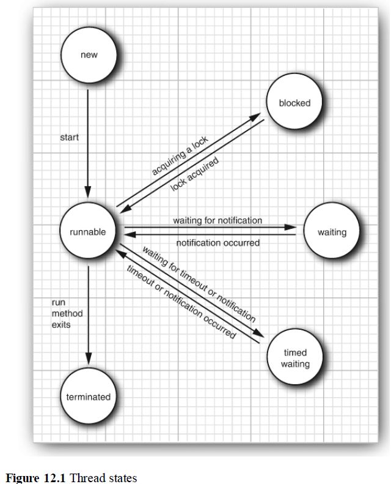

# 第十二章 并发 Concurrency

## 12.1 什么是线程

1. 启动一个main函数就是启动一个JVM进程，main函数所在的线程是这个进程的主线程。
2. 同一个进程的多个线程共享进程的堆和方法区资源，但是每个线程有自己的程序计数器、虚拟机栈和本地方法栈。
栈主要用来给方法调用，是线程私有的，保证线程中的局部变量不被别的线程访问到：方法调用的数据需要通过栈进行传递，每一次方法调用都会有一个对应的栈帧被压入栈中，每一个方法调用结束后，都会有一个栈帧被弹出。

   **堆用来存放实例对象==》Java 堆是垃圾收集器管理的主要区域**

3. 并发与并行的区别：并发是同一个时间段内执行，并行是真的同一时刻执行。
4. Java 使用的线程调度是抢占式的。也就是说，JVM 本身不负责线程的调度，而是将线程的调度委托给操作系统。操作系统通常会基于线程优先级和时间片来调度线程的执行，高优先级的线程通常获得 CPU 时间片的机会更多。

5. 每个进程拥有自己的一整套数据，而线程之间是共享数据的。
6. 能够同时运行多个线程的程序就是多线程程序(multithreaded)。
7. Java中如何创建一个线程:

   (1). 类task1实现了Runnable接口，把线程需要执行的任务放在task1的run方法中。

   ```java
    // Runnable接口是函数式接口，只有一个run方法
    package java.lang;

    @FunctionalInterface
    public interface Runnable {
      public abstract void run();
    }
   ```

   ```java
    //创建函数式接口的实例
    Runnable task1 = () ->{
      task code
    };
   ```

   (2). 根据这个类新建一个Thread对象，Thread的构造函数 public Thread(Runnable target) {...}

   ```java
    Thread t = new Thread(task1);
   ```

   (3). **start方法启动线程**。==> Thread类也实现了Runnable接口，所以Thread也有run方法。但是不要直接调用Thread类或Runnable类的run方法来运行run，这样只能在当前线程中运行run方法；调用Thread的start方法才会**创建一个新的线程去运行run方法**。

   ```java
    t.start();
   ```
  
```java
package threads;

/**
 * @version 1.30 2004-08-01
 * @author Cay Horstmann
 */
public class ThreadTest
{
   public static final int DELAY = 10;
   public static final int STEPS = 100;
   public static final double MAX_AMOUNT = 1000;

   public static void main(String[] args)
   {
      var bank = new Bank(4, 100000);
      Runnable task1 = () ->
         {
            try
            {
               for (int i = 0; i < STEPS; i++)
               {
                  double amount = MAX_AMOUNT * Math.random();
                  bank.transfer(0, 1, amount);

                  // sleep方法是静态方法只能类调用
                  // 让t1线程休眠
                  Thread.sleep((int) (DELAY * Math.random()));
               }
            }
            catch (InterruptedException e)
            {
            }
         };
      
      Runnable task2 = () ->
         {
            try
            {
               for (int i = 0; i < STEPS; i++)
               {
                  double amount = MAX_AMOUNT * Math.random();
                  bank.transfer(2, 3, amount);
                  //让t2线程休眠
                  Thread.sleep((int) (DELAY * Math.random()));
               }
            }
            catch (InterruptedException e)
            {
            }
         };
      
      Thread t1 = new Thread(task1);
      t1.start();  
      Thread t2 = new Thread(task2);
      t2.start();
   }
}

```

4. InterruptedException是Java中用来处理线程中断的异常。当一个线程处于wait、sleep状态或者其他被阻塞的状态、或者线程被中断，就会抛出这个异常，来通知线程终止当前操作 ==> **抛出InterruptedException之后run方法就退出**。

5. static void sleep(int millis) **sleep是静态方法只能类调用不能实例调用。Thread.sleep(int millis)的作用是让当前执行该行代码的线程休眠**。所以上述例子共有三个线程，主线程（执行main方法），t1线程，t2线程；两个sleep方法分别让t1和t2线程休眠。

## 12.2 Java中线程Thread类的6种状态

1. 6种状态以枚举形式定义在Thread类中，**getState方法可以获得该进程的当前状态**。

```java
package java.lang;

public class Thread implements Runnable {
  ...
  public enum State {
    NEW, //新建
    RUNNABLE, //可运行
    BLOCKED, //阻塞
    WAITING, //等待
    TIMED_WAITING, //计时等待
    TERMINATED; //终止
  }

  public State getState() {
    return jdk.internal.misc.VM.toThredState(threadStatus); 
  }
}
```

### 12.2.1 新建线程new threads

1. new Thread()之后处于新建状态；

### 12.2.2 可运行线程runnable threads

1. 调用start方法之后，线程处于可运行状态runnable。
2. **可运行状态下 线程可能正在运行也可能没有运行** ==> 抢占式调度系统（preemptive scheduling systems）下一个线程运行一个时间片之后，操作系统会剥夺该线程的运行权让其他线程运行。
3. 当前线程也可以主动让出运行权。static void yield()方法。跟sleep一样是静态方法，yield是屈服、让路的意思。

### 12.2.3 阻塞、等待和计时等待线程blocked、waiting and timed waiting threads

1. 阻塞：线程a试图获得一个已经被其他线程占有的内部对象锁，线程a会被阻塞，其他线程释放锁线程a才变成非阻塞状态。
2. 线程等待另一个线程通知调度器出现某个条件，线程进入等待状态。
3. 计时等待。

### 12.2.4 终止线程

1. run方法正常退出或者被为被捕获的异常终止，线程变成终止状态。



java.lang.Thread

void join() 方法 等待线程终止；
void join(long millis) 等待线程经过指定毫秒数后终止。

void stop() 方法 停止该线程==>已经被废弃，因为stop方法会立刻终止所有方法，立刻释放获得的所有对象的锁，这样会**破坏对象**，如取钱操作钱已经被取出，还没来得及存入就被终止了，银行Bank这个对象被破坏了！

## 12.3 线程属性

### 12.3.1 中断线程 interrupting threads

1. stop方法之外没有方法可以强制一个线程终止，stop方法已经被废弃了 ==> 可以使用interru方法来请求终止一个线程。

2. 在Thread类中有一个私有的布尔值属性 private volatile boolean interrupted, 用来描述线程的中断状态，true表示中断，false是未中断。

3.

java.lang.Thread

```java
package java.lang;

public class Thread implements Runnable {
   ...
   private volatile boolean interrupted;
   ...

   // 向线程发送中断请求，设置interrupted属性为true。
   public void interrupt() {
      ...
   }

   // 静态方法，返回当前线程的中断状态，并重置中断状态为false
   public static boolean interrupted() {
      ...
      return interrupted;
   }

   // 返回调用线程的中断状态，并且不改变线程的中断状态。
   public boolean isInterrupted() {
      return interrupted;
   }

   // 静态方法，返回当前正在执行的线程的Thread对象。
   public static native Thread currentThread();

}
```

4. 设置了中断状态之后调用sleep()方法阻塞线程，sleep()方法会在抛出InterruptedException之前清除线程的中断状态 ==>设置为false。==>因为sleep()方法已经处理过中断了。

```java
Runnalbe task = () -> {
   try {
      while(true) {
         System.out.println("线程运行中...");
         Thread.sleep(1000);  // 1. 线程进入睡眠
         // 如果线程被中断，sleep() 会抛出 InterruptedException
      }
   } catch (InterruptedException e) { // 捕获到异常
        System.out.println("线程在休眠时被中断"); 
        Thread.currentThread().interrupt(); // sleep已经清除中断状态了，这里重新恢复中断状态，方便上层代码或调用者检测到线程被中断并采取相应反对措施。

   } finally {
      //执行清理操作
      ...
       System.out.println("线程退出，进行清理");
   }
}
```

5. 注意上面代码捕获到InterruptedException 时，应决定如何相应中断，通常是恢复中断状态或执行清理操作cleanup。

### 12.3.2 守护线程 Daemon Threads

1. **在调用t.start()方法之前**调用t.setDaemon(true)；方法**将一个线程设置为守护线程** ==>为其他线程提供服务的线程，如计时器线程、清空过时缓存项线程。 ==>只剩下守护线程了，JVM会退出。
2. t.setDaemon(false0);设置为用户线程。

### 12.3.3 线程名

1. t.setName("web crawler"); 给线程设置名字

### 12.3.4 handlers for Uncaught exceptions 未被捕获的异常的处理器

1.

### 12.3.5 线程优先级

1. 每个线程都有一个优先级，线程调度器优先选择较高优先级的线程，所以早期java中可以用setPriority方法给线程设置优先级 ==> **现代Java版本中的JVM不再自己管理线程，而是依赖于操作系统的本地线程实现**，不同操作系统对线程优先级的控制粒度不同 ==> **现在不要再使用setPriority方法设置线程优先级了，因为不同操作系统的行为不同，程序有不可移植性。**
2. 默认情况下一个线程会继承构造它的那个线程的优先级。

## 12.4 同步  Synchronization
  
线程之间需要共享存取相同的数据 ==> 同时修改一个对象，会形成竞态条件race condition

### 12.4.1~2 竞态条件详解

1. 两个线程同时执行指令accounts[to] + = amount;指令可能如下处理：

   (1). 将accounts[to]加载到寄存器；

   (2). 在寄存器中给accounts[to]增加amount；

   (3). 将结果写回accounts[to]。

因为指令accounts[to] + = amount;**不是原子操作（上述一系列步骤要么不做要做就都完成）**==> 某一**线程执行上述指令的途中控制权被剥夺**给其他线程，它的计算结果就会被覆盖。

### 12.4.3 锁对象 Lock Objects

1. 用ReentrantLock（重入锁）来保护代码块，**确保任何时刻只有一个线程进入临界区** ==> 代码块中语句全部执行完之前，获得该锁的线程不会被剥夺控制权，**其他线程想要获取该锁**、在调用lock方法时**会被阻塞**，等待当前线程释放锁。

```java
myLock.lock(); // a ReentrantLock
 object

try{
   // 临界区
} 
finally {
   myLock.unlock();  // 释放锁
}
```

2. 下面示例代码，每个Bank类的实例对象都有自己的ReentrantLock对象（bankLock = new ReentrantLock();），不同线程试图访问同一个Bank对象时，这个锁可以保证线程的串行化访问；不同Bank对象的锁是不同的，不会相互影响。

```java
package synch;

import java.util.*;

// java.util.concurrent框架提供这些类
import java.util.concurrent.locks.Lock;

// 实现了Lock接口,下面ReentrantLock对象使用的lock、unlock、newCondition方法都是因为实现了Lock接口。
// public class ReentrantLock implements Lock, java.io.Serializable {...} 

import java.util.concurrent.locks.ReentrantLock; 
import java.util.concurrent.locks.Condition;

public class Bank
{
   private final double[] accounts;
   // 定义bankLock属性，也叫类的成员变量、类的字段。
   private Lock bankLock; 
   private Condition sufficientFunds;

   public Bank(int n, double initialBalance)
   {
      accounts = new double[n];
      Arrays.fill(accounts, initialBalance);

      // 构造器中初始化bankLock为ReentrantLock重入锁的实例对象。
      bankLock = new ReentrantLock(); 

      // java.util.concurrent.locks.Lock的newCondition方法，返回Condition对象。
      sufficientFunds = bankLock.newCondition();
   }

   public void transfer(int from, int to, double amount) throws InterruptedException
   {
      bankLock.lock(); // 获取锁
      try
      {
         // try{}里面是临界区


         while (accounts[from] < amount) {
            sufficientFunds.await();
         }
         System.out.print(Thread.currentThread());
         accounts[from] -= amount;
         System.out.printf(" %10.2f from %d to %d", amount, from, to);
         accounts[to] += amount;
         
         // 为什么叫重入锁，因为已经获取该锁的线程，在释放当前锁之前（在临界区中）可以重复地、嵌套的再次获取这个锁。
         // 如当前 transfer方法已经获取了该锁，transfer中又调用getTotalBalance方法再次获取该锁。
         //锁有一个持有计数（hold count）来跟踪对lock方法的嵌套盗用，获取一次计数加1，释放一次计数减1。
         System.out.printf(" Total Balance: %10.2f%n", getTotalBalance()); 
         sufficientFunds.signalAll();
      }
      finally
      {
         bankLock.unlock(); // 释放锁
      }
   }

   public double getTotalBalance()
   {
      bankLock.lock(); // 获取锁
      try
      {
         double sum = 0;

         for (double a : accounts)
            sum += a;

         return sum;
      }
      finally
      {
         bankLock.unlock(); // 释放锁
      }
   }

   public int size()
   {
      return accounts.length;
   }
}

```

3. new ReentrantLock(boolean fair)；fair是true时构造一个采用公平策略的锁 ==> 优先等待时间最长的线程 ==> 比常规锁慢得多 ==> 默认不用公平锁，有确切特定的理由时再用。

4. synchronized关键字会自动提供一个锁以及相关的条件condition ==> synchronized关键字会自动实现上述基础结构。

### 12.4.4 条件对象 condition objects

1. 线程进入临界区之后发现只有满足某个条件之后才能继续执行，比如转账行为账户余额不够，就不能继续执行，只能等待其他线程的转账行为给账户增加余额，但是当前线程获取了锁导致其他线程没有控制权无法增加余额 ==> **引入条件对象/条件变量来管理 那些已经获取了锁但是无法继续工作的线程**。

2. 不满足条件，则**调用condition对象的await方法，当前线程被阻塞并放弃锁**、进入条件的等待集中。==> **线程调用await方法之后无法自行激活，只能等待其他线程在同一condition对象上调用signalAll方法**，把条件集中所有线程释放出来，解除他们的阻塞状态 ==> **被释放的线程**重新获取到锁之后，线程**从自己的await调用中返回，然后从之前暂停的地方继续执行**。
3. void signalAll方法不表示当前一定满足条件，只是提示线程现在可能满足条件 ==> 因此线程需要再次检查条件 ==> 因此把await调用放在while循环中：

```java
while (accounts[from] < amount) 
{
      sufficientFunds.await();
}
```

```java
package synch;

import java.util.*;

// java.util.concurrent框架提供这些类
import java.util.concurrent.locks.Lock;

import java.util.concurrent.locks.ReentrantLock; 
import java.util.concurrent.locks.Condition;

public class Bank
{
   private final double[] accounts;
   private Lock bankLock; 
   // 定义sufficientFunds属性，是一个条件对象，表示账户资金充足时才能进行转账行为。
   private Condition sufficientFunds;

   public Bank(int n, double initialBalance)
   {
      accounts = new double[n];
      Arrays.fill(accounts, initialBalance);
      bankLock = new ReentrantLock(); 

      // java.util.concurrent.locks.Lock的newCondition方法，返回Condition对象。
      sufficientFunds = bankLock.newCondition();
   }

   public void transfer(int from, int to, double amount) throws InterruptedException
   {
      bankLock.lock();
      try
      {

         // 1. 检查是否满足条件
         while (accounts[from] < amount) {
            // 2. 不满足条件则java.util.concurrent.locks.Condition 调用await()方法进入等待集。
            sufficientFunds.await();
            // 4. 线程被激活并再次进入临界区之后，回到上次暂停的位置，因为要重新检查条件，所以使用while循环。
         }
         System.out.print(Thread.currentThread());
         accounts[from] -= amount;
         System.out.printf(" %10.2f from %d to %d", amount, from, to);
         accounts[to] += amount;
         
         System.out.printf(" Total Balance: %10.2f%n", getTotalBalance()); 

         //3. 其他符合条件的线程执行完转账行为之后，账户余额变多，可能满足条件了，因此其他线程上的同一对象sufficientFunds调用signalAll方法，解除等待集线程的阻塞。
         sufficientFunds.signalAll(); 
      }
      finally
      {
         bankLock.unlock(); 
      }
   }

   public double getTotalBalance()
   {
      bankLock.lock();
      {
         double sum = 0;

         for (double a : accounts)
            sum += a;

         return sum;
      }
      finally
      {
         bankLock.unlock();
      }
   }

   public int size()
   {
      return accounts.length;
   }
}

```

4. **一个锁可以有一个或多个关联的条件对象**；

5. signal()方法是随机给一个线程解除阻塞，但是被解除的线程可能还是不满足运行条件因而再次阻塞。


### 12.4.5 synchronized关键字

1. Java中每个对象都有一个内部锁（intrinsic lock），类也有一个内部锁。
2. **对象的监视器(object’s monitor)**是一个抽象概念，是**一种同步机制**，用于控制对共享资源的访问，**确保同一时间只有一个线程可以访问被监视的代码块。** ==> 其具体实现就是对象的内部锁，某线程获取了对象的内部锁，就是获取了该对象监视器的所有权。
3. 修饰**实例方法**，锁实例对象。
4. 修饰**静态方法**，锁这个类。
5. 修饰**代码块**，锁括号(this)里面的对象或者类，this是实例对象表示进入代码块之前要获得给定对象的锁；this是类.class，表示进入同步代码之前要获得给定Class的锁。

   ```java
   synchronized(this) {
      //业务代码

   }
   ```

6. java.lang.Object的

   void notifyAll()方法、

   void notify()方法、

   void wait()方法是Object类的final方法，

   对应Condition类的

   void signalAll()方法、

   void signal()方法、

   void await方法。

```java
package synch2;

import java.util.*;

public class Bank
{
   private final double[] accounts;

   public Bank(int n, double initialBalance)
   {
      accounts = new double[n];
      Arrays.fill(accounts, initialBalance);
   }

   // 方法声明中使用synchronized关键字
   public synchronized void transfer(int from, int to, double amount) 
         throws InterruptedException
   {
      while (accounts[from] < amount) {
         // 当前执行的线程被阻塞，进入对象的等待集
         wait(); 
      }
      System.out.print(Thread.currentThread());
      accounts[from] -= amount;
      System.out.printf(" %10.2f from %d to %d", amount, from, to);
      accounts[to] += amount;
      System.out.printf(" Total Balance: %10.2f%n", getTotalBalance());

      // 唤醒所有在当前对象监视器上等待的线程。==> 就是调用wait()方法后进入对象等待集的线程。
      notifyAll();
   }

   public synchronized double getTotalBalance()
   {
      double sum = 0;

      for (double a : accounts)
         sum += a;

      return sum;
   }

   public int size()
   {
      return accounts.length;
   }
}

```

6. 使用synchronized关键字不用像上述Lock/Condition那样显示地声明锁，代码更简洁，但是**每个内部锁只能有一个关联条件**，所以synchronized关键字只适合简单的同步，它Lock/Condition灵活。

7. 最好Lock/Condition 和 synchronized哪个都别用，用java.util.concurrent包中提供的机制如阻塞队列。

### 12.4.6 同步块 synchronized blocks

1. 同步块可以确保在同一时间只有一个线程能够执行特定的代码段。
2. 同步块使用synchronized关键字，并指定一个对象作为锁，线程进入同步块中时会获取到obj对象的锁==>**外部代码获取到了obj的内部锁，即内部锁对客户是可用的**。==> 被称为客户端锁定

```java
synchronized(obj)
{
   // 临界区
}
```

### 12.4.7 监视器monitor概念

1. Lock/Condition是实现线程同步的强大工具，但他们不是面向对象的，因为锁跟对象是分离的，锁通常作为类的字段存在而不与对象本身关联。==> 监视器是面向对象的，不使用显示锁。
2. 监视器的概念最早由Per Brinch Hansen 和 Tony Hoare 提出，经典的监视器模型中：

   监视器是只包含私有字段的类；

   监视器类的每个对象有一个关联的锁；

   所有方法由这个锁锁定；

   锁可以有任意多个关联的条件。
3. Java松散的借鉴了监视器的概念，**削弱了线程安全性**：Java中每一个对象都有一个内部锁和一个内部条件，使用synchronized关键字声明方法使其行为类似于监视器方法，但是：

   Java不要求对象字段是私有的（外部代码可以直接访问、修改字段，不需要通过同步方法）；

   Java方法不要求是同步的（程序员在编程时选择性的给方法添加synchronized关键字）；

   内部锁对客户是可用的（通过同步块实现）；

```java
public class BankAccount {
    private double balance;

    // 同步的存款方法
    public synchronized void deposit(double amount) {
        double temp = balance + amount;
        try {
            Thread.sleep(100);
        } catch (InterruptedException e) {
            Thread.currentThread().interrupt();
        }
        balance = temp;
    }

    // 同步的取款方法
    public synchronized void withdraw(double amount) {
        if (balance >= amount) {
            double temp = balance - amount;
            try {
                Thread.sleep(100);
            } catch (InterruptedException e) {
                Thread.currentThread().interrupt();
            }
            balance = temp;
        }
    }

    public synchronized double getBalance() {
        return balance;
    }
}
```

```java
public class BankAccountClient {
    private BankAccount account;

    public BankAccountClient(BankAccount account) {
        this.account = account;
    }

    public void performOperations() {
        // 在BankAccount的外部代码BankAccountClient类中，通过同步块显示地使用“ private BankAccount account; ”对象的内部锁。
        synchronized (account) {
            account.deposit(100);
            account.withdraw(50);
        }
    }
}
```

### 编译器指令重排

1. 编译器在生成字节码时，为了提高程序执行效率、提高缓存命中率，可能会改变指令的顺序，只要不影响单线程程序的行为，但是多线程环境中这会导致一个某线程对内存的修改对其他线程不可见。

```java
// 线程A，实际的执行顺序可能是先b = 2再a =1.
a = 1;
b = 2;

// 线程B
if (b == 2) {
    assert(a == 1); // 线程A执行完b = 2、执行a = 1之前，线程B执行 assert(a == 1);结果是失败的。
}
```

### 12.4.8 只需要变量赋值不做其他操作的同步，使用volatile字段

1. 只为了读写个别实例字段而使用同步，带来的开销不划算 ==> 给实例字段使用volatile关键字，实现字段field的免锁同步。==> 某一个线程对volatile字段做出的修改，编译器会确保这个修改对读取改变量的其他所有线程可见，因为**volatile变量不会被缓存在寄存器或缓存中，而是直接写回主内存，使用的时候也是直接去主存读取**。

```java
private volatile boolean done;
// 就不用对下面两个读写方法使用synchronized了
public boolean isDone() {return done;} 
public void setDone() {done = true};
```

2. **volatile能保证变量共享可见、不能提供复合操作的原子性**，如变量的自增、自减、取反等。synchronize关键字变量的可见性和原子性都能保证。
3. **volatile变量能够避免编译器指令重排**。

4. volatile关键字 + 双重检验 + synchronized 重写懒汉模式，保证线程安全：

   (1). 使用volatile是为了防止JVM进行指令重排：正常顺序是123，指令重排之后可能变成132，所以如果不用volatile关键字，线程A执行完13还没初始化对象，线程B就以为已经有这个实例了直接返回未初始化的对象。

   ```java
      // 伪代码
      memory = allocate();    // 1. 分配内存
      memory.init();          // 2. 初始化对象（调用构造函数）
      instance = memory;      // 3. 将引用指向内存
   ```

   (2). 第一次检查是为了快速过滤已经有实例的情况；

   (3). 第二次检查是为了 确保只有一个线程能够创建实例。

```java
   public class Singleton {
       private volatile static Singleton uniqueInstance; // 必须用volatile

       public static Singleton getUniqueInstance() {
           if (uniqueInstance == null) {          // 第一次检查：快速路径
               synchronized (Singleton.class) {   // 同步块
                   if (uniqueInstance == null) {  // 第二次检查：同步保护
                       uniqueInstance = new Singleton(); // 关键操作
                   }
               }
           }
           return uniqueInstance;
       }
   }
```

1. Java 中synchronized和ReentrantLock等独占锁就是悲观锁，即每次使用资源都要上锁，用完了之后释放锁。

### 12.4.9 变量赋值级别的同步 final变量

1. 把字段声明为final也可以安全的共享字段，其他线程看到的就是final字段声明完成之后的值。

### 12.4.10 对变量进行自增、自减、取反等复合操作时，使用java.util.concurrent.atomic原子性

1. java.util.concurrent.atomic包里的类如AtomicInteger提供方法以原子的形式对变量进行更新。

```java
   public static AtomicInteger nextNumber = new AtomicInteger();
   long id = nextNumber.incrementAndGet(); // 自增
   long id2 = nextNumber.decrementAndGet(); // 自减
   long id3 = nextNumber.getAndUpdate( x -> x*100); // lambda表达式  
```

### 12.4.13 按需初始化 todo，现在看不懂用不到

1. 虚拟机会在第一次使用类时执行一个静态初始化器，并且只执行一次。==> 想实现延迟初始化（Lazy initialization）并确保初始化仅执行一次，可以利用静态初始化块。

```java
public class MyClass {
    // 静态变量
    private static DataStructure data;

    // 静态初始化块
    static {
        data = initializeDataStructure();
    }

    // 初始化方法
    private static DataStructure initializeDataStructure() {
        // 初始化逻辑
        return new DataStructure();
    }

    // 使用数据结构的静态方法
    public static void useDataStructure() {
        // 使用 data
    }
}
```

### 12.4.14 线程局部变量

1. 有时不想共享变量，需要各个线程有各自的实例对象 ==> 用java.lang.ThreadLocal辅助类

```java

// ThreadLocal<S> withInitial(Supplier<? extends S> supplier)静态方法为每个线程创建一个局部变量
public static final ThreadLocal<SimpleDateFormat> dateFormat = 
            ThreadLocal.withInitial(() -> new SimpleDateFormat("yyyy-MM-dd"));

// ThreadLocal中的 public T get()方法得到这个线程的当前值。           
String dateStamp = dateFormat.get().format(new Date());
```

## 12.5 线程安全的集合

多个线程并发的修改某个实例，比起使用锁来保护共享的数据结构，直接使用线程安全的实现更好。

### 12.5.1 阻塞队列Blocking Queues

1. 生产者-消费者模式：生产者向队列插入元素，消费者从队列取出元素。优点：

   (1). 解耦：生产者和消费者通过队列进行通信，两者不需要直接交互，降低了耦合度；

   (2). 不用使用复杂的复杂的锁管理；

   (3). 队列作为缓冲区，平衡生产者消费者之间的处理速度差异 ==> 某线程试图向队列添加元素（put方法）而队列已满、从队列取出元素（take方法）但队列已空时，**阻塞队列会阻塞线程**。

2. 多线程下银行转账，传统模式下，多个线程直接调用Bank对象的transfer方法，需要锁、synchronized等同步机制。使用阻塞队列：

   生产者线程不直接调用Bank对象的transfer方法，而是创建一个转账指令对象（包含转账的详细信息），把这个指令对象插入到阻塞队列中；

   消费者线程有一个专门的线程用来从队列中取出转账指令对象、执行转账操作 ==> 只有这个线程可以访问Bank对象的内部，因此不需要进行同步。

3. java.util.concurrent.BlockingQueue<E>的方法

```java
package java.util.concurrent;
public interface BlockingQueue<E> extends Queue<E> {
   void put(E element) // 添加元素，必要时阻塞

   E take() // 移除并返回队头元素，必要时阻塞；

   boolean offer(E element, long time, TimeUnit unit) // 添加给定元素，成功返回true，必要时阻塞

   E poll(long time, TimeUnit unit) // 移除并返回队头元素，必要时阻塞，直至元素可用或时间已到。失败时返回null。
}
```

4. java.util.concurrent包中的阻塞队列实现类：

   (1). ArrayBlockingQueue,基于数组的有界阻塞队列；

   (2). LinkdBlockingQueue,基于链表的可选有界阻塞队列；

   (3). PriorityBlockingQueue,是一个优先队列，时基于堆的无界阻塞队列；

   (4). DelayQueue

```java
package blockingQueue;

import java.io.*;
import java.nio.charset.*;
import java.nio.file.*;
import java.util.*;
import java.util.concurrent.*;
import java.util.stream.*;

public class BlockingQueueTest
{
   private static final int FILE_QUEUE_SIZE = 10;
   private static final int SEARCH_THREADS = 100;
   private static final Path DUMMY = Path.of("");
   private static BlockingQueue<Path> queue = new ArrayBlockingQueue<>(FILE_QUEUE_SIZE);

   public static void main(String[] args)
   {
      try (var in = new Scanner(System.in)) 
      {
         System.out.print("Enter base directory (e.g. /opt/jdk-11-src): ");
         String directory = in.nextLine();
         System.out.print("Enter keyword (e.g. volatile): ");
         String keyword = in.nextLine();
          
         Runnable enumerator = () ->
            {
               try
               {
                  enumerate(Path.of(directory));
                  queue.put(DUMMY);
               }
               catch (IOException e)
               {
                  e.printStackTrace();
               }
               catch (InterruptedException e)
               {
               }            
            };
         
         new Thread(enumerator).start(); // 启动生产者线程
         for (int i = 1; i <= SEARCH_THREADS; i++)
         {
            Runnable searcher = () ->
               {
                  try
                  {
                     boolean done = false;
                     while (!done)
                     {
                        Path file = queue.take();
                        if (file == DUMMY)
                        {
                           queue.put(file);
                           done = true;
                        }
                        else search(file, keyword);
                     }
                  }
                  catch (IOException e)
                  {
                     e.printStackTrace();
                  }
                  catch (InterruptedException e)
                  {
                  }               
               };
            new Thread(searcher).start(); // 消费者线程
         }
      }
   }
   
   public static void enumerate(Path directory) throws IOException, InterruptedException
   {
      try (Stream<Path> children = Files.list(directory))
      {
         for (Path child : children.toList())
         {
            if (Files.isDirectory(child))
               enumerate(child);
            else
               queue.put(child);
         }
      }
   }
   
   public static void search(Path file, String keyword) throws IOException
   {
      try (var in = new Scanner(file, StandardCharsets.UTF_8))
      {
         int lineNumber = 0;
         while (in.hasNextLine())
         {
            lineNumber++;
            String line = in.nextLine();
            if (line.contains(keyword)) 
               System.out.printf("%s:%d:%s%n", file, lineNumber, line);
         }
      }
   }
}


```

### 12.5.2 并发的散列映射、集和队列

1. java.util.concurrent.ConcurrentLinkedQueue<E>可以由多个线程安全访问的无上限的非阻塞队列；
2. java.util.concurrent.ConcurrentSkipListSet<E>可以由多个线程安全访问的有序集；
3. java.util.concurrent.ConcurrentHashMap<K,V>可以由多个线程安全访问的散列映射；
4. 这些类的size方法不一定在常量时间内完成操作，确定这些集合的大小通常需要遍历。
5. 上述集合返回弱一致性（weakly cosistent）的迭代器。==> 迭代器被构造出之后，集合如果发生改变，迭代器不会抛出ConcurrentModificationException，即允许在遍历期间对集合做一些乐观修改，高并发访问场景下性能更好。==> java.util中的集合相反，返回强一致性的迭代器，会抛出ConcurrentModificationException。
6. 并发散列映射将桶组织为树，而不是列表，键类型实现Comparable，从而保证O(lng(n))的性能。

### 12.5.3 Atomic update of map entries 映射条目的原子更新

1. ConcurrentHashMap的merge、compute方法实现原子更新。

```java
package concurrentHashMap;

import java.io.*;
import java.nio.file.*;
import java.util.*;
import java.util.concurrent.*;
import java.util.stream.*;

public class CHMDemo
{
   public static ConcurrentHashMap<String, Long> map = new ConcurrentHashMap<>();

   public static void process(Path file)
   {
      // try-with-resources
      // ！！！ try(resources) {}, 专门用于使用后关闭资源，resources必须实现了AutoCloseable接口或者Closeable接口，在代码块{}中的内容执行完之后，resources会调用close方法关闭。
      try (var in = new Scanner(file))
      {
         while (in.hasNext())
         {
            String word = in.next();
            // 原子跟新，原来map里没有word这个键，就把1L和word作为新的键值对映射进去，否则就用表达式结果替代原值
            map.merge(word, 1L, Long::sum); // 遍历统计文件中每个单词出现的频率
         }
      }
      catch (IOException e)
      {
         e.printStackTrace();
      }
   }

   // 获取指定目录及其所有子目录下的所有文件路径
   public static Set<Path> descendants(Path rootDir) throws IOException
   {
      try (Stream<Path> entries = Files.walk(rootDir))
      {
         return entries.collect(Collectors.toSet());
      }
   }

   public static void main(String[] args)
         throws InterruptedException, ExecutionException, IOException
   {
      //设置并发环境：
      //获取当前机器的可用处理器数量，用于确定线程池的大小；
      int processors = Runtime.getRuntime().availableProcessors();
      //创建一个固定大小的线程池
      ExecutorService executor = Executors.newFixedThreadPool(processors);
      // 设置当前目录作为根目录
      Path pathToRoot = Path.of(".");
      for (Path p : descendants(pathToRoot))
      {
         //把目录下所有.java后缀的文件，生成任务交给线程池执行，任务内容是调用process()方法处理一个.java文件
         if (p.getFileName().toString().endsWith(".java"))
            executor.execute(() -> process(p));
      }
      //关闭线程池
      executor.shutdown();
      // 给10分钟时间等待线程池中的所有任务完成。
      executor.awaitTermination(10, TimeUnit.MINUTES);

      //输出统计结果中出现频率大于10次的单词
      map.forEach((k, v) -> 
         { 
            if (v >= 10) 
               System.out.println(k + " occurs " + v + " times");
         });
   }
}

```

### 12.5.4 Bulk Operations on Concurrent Hash Maps 并发散列映射的批操作

1. 就是上面代码中的map.forEach(),还有map.search()、map.reduce()方法。

### 12.5.5 并发集视图 Concurrent Set Views

1. ConcurrentHashMap类的静态方法newKeySet()，和普通方法KeySet方法，返回一个巨大的线程安全的集（因为没有ConcurrentHashSet类），就用value值都默认是true的映射假装是set。

```java
package java.util.concurrent;
public class ConcurrentHashMap<K,V> {
   ...
   public static<K> KeySetView<K, Boolean> newKeySet() {
   return new KeySetView<K, Boolean>(new ConcurrentHashMap<K, Boolean>(), Boolean.TRUE);
   }

   public KeySetView<K,V> keySet(V mappedValue) {
        if (mappedValue == null)
            throw new NullPointerException();
        return new KeySetView<K,V>(this, mappedValue);
    }
}

```

使用

```java
Set<String> set = ConcurrentHashMap.<String>newKeySet();
Set<String> set1 = map.keySet(1L);
```

### 12.5.6 写时拷贝Copy on write

1. CopyOnWriteArrayList线程安全的数组集合；
2. CopyOnWriteArraySet线程安全的集。
3. 二者都允许多线程同时对集合进行读取操作，读取操作不加锁；修改操作如add、set、remove等方法采用写时拷贝（Copy-On-Write）策略，不直接修改原数组，先创建底层数组的副本，对副本数组进行修改，修改完之后把副本赋值回去。==> 只在数据发生变化时进行复制操作，减少锁的使用，提高并发性能。

### 12.5.8

1. Vector和Hashtable是线程安全的，但是已经过时了；
2. ArrayList和HashMap不是线程安全的，但是任何集合类都可以通过使用同步包装器(Synchronization wrapper)变成线程安全的。

```java
List<Integer> synchronizedList = Collections.synchronizedList(new ArrayList<>());
Set<String> synchronizedSet = Collections.synchronizedSet(new HashSet<>());
Map<Integer, Integer> synchronizedMap = Collections.synchronizedMap(new HashMap<>());
```

3. Synchronization wrapper本质就是封装原先的集合，把他们的方法使用 客户端锁定(方法的内容写在synchronized块中) 改造成同步的。

```java
 public void add(int index, E element) {
         synchronized (mutex) 
            {list.add(index, element);}
        }

```

## 12.6 任务和线程池 tasks and thread pools

1. 线程池中包含很多准备运行的线程。为线程提供一个Runnable，当其中的run方法退出时，运行它的线程不会死亡，而是留在线程池中准备为下一个请求提供服务。

### 12.6.1 Callable 和 Future

#### Callable接口

1. Callable和Runnable类似，都是**封装了一个异步运行的任务**。
2. Callable和Runnable的区别：

   (1). Callable的call方法有返回值，Runnable的run方法没有；

   (2). Callable的call方法抛出Exception，Runnable的run方法不抛出。
3. Callable接口只有一个call方法，返回值的类型是接口的参数类型。

```java
package java.util.concurrent;

@FunctionalInterface
public interface Callable<V> {
   V call() throws Exception;
}
```

4. 什么情况下call方法抛出异常

#### Future接口

1. Future接口，用来保存**异步**计算的结果。

```java
package java.util.concurrent;

public interface Future<V> {
   //用来取消任务；任务还没开始则直接取消，任务已开始mayInterruptIfRunning是true，则中断任务
   boolean cancel(boolean mayInterruptIfRunning);

   boolean isCancelled();
   boolean isDone();

   // get方法在任务完成之前会阻塞。
   V get() 
   V get(long timeout, TimeUnit unit)
}
```

2. **Future接口的主要意义是异步处理任务，就是任务执行期间我可以去做其他事情，不用像同步那样等在这里，过一段时间之后来Future那里取出结果。**
3. 主线程调用Future的get()方法会阻塞等待，但是什么时候调用get()方法是程序员可以决定的，可以在提交任务之后、调用get()方法之前安排当前线程取做别的任务：

   ```java
      // 阶段1：任务提交（异步）
      Future<Result> future = executor.submit(task);
      
      // 阶段2：执行其他工作（无需等待）
      handleOtherTasks();
      
      // 阶段3：需要结果时获取（同步等待）
      Result result = future.get();
   ```

#### FutureTask类

1. FutureTask类同时实现了Runnable接口和Future接口。

```java
package java.util.concurrent;

public class FutureTask<V> implements RunnableFuture<V> {
   ...

   //FutureTask构造器，用来包装Callable对象把他作为任务提交给线程池或执行器。
   public FutureTask(Callable<V> callable) {
      ...
   }

   //FutureTask构造器，用来包装Runnable对象把他作为任务提交给线程池或执行器。
   public FutureTask(Runnable runnable, V result) {
      ...
   }
}
```

RunnableFuture接口就是继承了Runnable和Future。

```java
package java.util.concurrent;

public interface RunnableFuture<V> extends Runnable, Future<V> {
   void run();
}
```

#### 示例与分析

1. Future和FutureTask对比：

   (1). Future只是一个结果的持有者它本身没有执行任务的能力，因此通常需要通过执行器如ExecutorService来提交任务并获取到Future对象。

   (2). FutureTask实现了Future和Runnable接口，因此可以与Thread结合使用，独立于执行器来执行任务。

2. 例子 使用Future和ExcutorService

```java
package executors;

import java.util.concurrent.*;

public class FutureWithExecutorExample {
    public static void main(String[] args) {
        //创建只有一个线程的线程池，它顺序的执行所提交的任务
        ExecutorService executor = Executors.newSingleThreadExecutor();

        // 创建一个Callable任务
        Callable<Integer> task = () -> {
            System.out.println("Task is running...");
            Thread.sleep(2000); //模拟耗时操作
            return 100;
        };

        // 提交任务并通过submit方法获取Future对象
        Future<Integer> future = executor.submit(task);
        System.out.println("Task submitted, waiting for result...");

        try {
            // 获取任务结果，get方法阻塞直至任务完成
            Integer result = future.get();
            System.out.println("Task result: " + result);
        } catch (InterruptedException e) {
            System.out.println("Current thread was interrupted");
            Thread.currentThread().interrupt();
        } catch (ExecutionException e) {
            System.out.println("Task execution failed: " + e.getCause());
        } finally {
            //关闭线程池
            executor.shutdown();
        }
    }
}

```

3. 例子 使用FutureTask结合Thread获取结果

```java
package executors;

import java.util.concurrent.Callable;
import java.util.concurrent.ExecutionException;
import java.util.concurrent.FutureTask;

public class FutureTaskWithThreadExample {
    public static void main(String[] args) {
        //创建一个Callable任务
        Callable<Integer> task = () -> {
            System.out.println("Task is running...");
            Thread.sleep(3000); // 模拟耗时操作
            return 500;
        };

        // 使用FutureTask包装Callable
        FutureTask<Integer> futureTask = new FutureTask<>(task);

        //创建并启动线程
        Thread thread = new Thread(futureTask);
        thread.start();

        System.out.println("Task submitted, waiting for result...");

        try {
            //获取任务结果，阻塞直至任务完成
            Integer result = futureTask.get();
            System.out.println("Task result: " + result);
        } catch (InterruptedException e) {
            System.out.println("Current thread was interrupted");
            Thread.currentThread().interrupt(); //恢复中断状态，方便上层代码或调用者检测到线程被中断并采取相应反对措施。
        } catch (ExecutionException e) {
            System.out.println("Task execution failed: " + e.getCause());
        }
    }
}

```

### 12.6.2 执行器

1. Executors类有很多用来构造线程池的静态工厂方法：

   (1). ExecutorService executor = Executors.newSingleThreadExecutor();构造只有一个线程的线程池；可以用于性能分析，用来测量不使用并发的情况下运行速度会慢多少。

   (2). ExecutorService executor = Executors.newFixedThreadPool();构造一个固定大小的线程池；选择并发线程数等于处理器内核数最优。

   (3). ExecutorService executor = Executors.newCachedThreadPool();在必要时候即线程不够用的时候会新建一个线程的线程池。

   (4). ScheduledExecutorService scheduledExecutorService = Executors.newScheduledThreadPool(10);用于执行调度任务的固定线程池。

   (5). ScheduledExecutorService scheduledExecutorService = Executors.newSingleThreadScheduledExecutor(); 用于执行调度任务的只有一个线程的线程池。

   上面的(1)(2)(3)都是返回一个new ThreadPoolExecutor(),class ThreadPoolExecutor extends AbstractExecutorService , AbstractExecutorService implements ExecutorService接口。
2. ExecutorService的submit方法提交任务并返回一个Future对象作为结果。

3. 使用线程池的四大步骤：

```java
package executors;

import java.util.concurrent.*;

public class FutureWithExecutorExample {
    public static void main(String[] args) {
        //一、调用Executors类的静态方法构造一个线程池。
        ExecutorService executor = Executors.newSingleThreadExecutor();


        Callable<Integer> task = () -> {
            System.out.println("Task is running...");
            Thread.sleep(2000); //模拟耗时操作
            return 100;
        };

        // 二、调用执行器的submit方法提交Runnable或Calllable任务
        // 三、保留Future对象
        Future<Integer> future = executor.submit(task);

        System.out.println("Task submitted, waiting for result...");

        try {
            Integer result = future.get();
            System.out.println("Task result: " + result);
        } catch (InterruptedException e) {
            System.out.println("Current thread was interrupted");
            Thread.currentThread().interrupt();
        } catch (ExecutionException e) {
            System.out.println("Task execution failed: " + e.getCause());
        } finally {
            //四、用完之后调用shutdown方法关闭线程池
            executor.shutdown();
        }
    }
}

```

### 12.6.3 控制任务组group of tasks

1. 使用执行器控制一组相关任务, 利用ExecutorService接口定义的invokeAll方法和invokeAny方法。
2. invokeAll方法会阻塞，直至所有方法都完成；invokeAny方法一组任务任务中的任意一个完成，invokeAny方法就终止，并调用其他所有任务的cancel方法（mayInterruptIfRunning参数传true），取消其他任务。

```java
package executors;

import java.io.*;
import java.nio.file.*;
import java.time.*;
import java.util.*;
import java.util.concurrent.*;
import java.util.stream.*;

public class ExecutorDemo
{

   public static long occurrences(String word, Path path)
   {
      try (var in = new Scanner(path))
      {
         int count = 0;
         while (in.hasNext())
            if (in.next().equals(word)) count++;
         return count;
      }
      catch (IOException ex)
      {
         return 0;
      }
   }

   public static Set<Path> descendants(Path rootDir) throws IOException
   {
      try (Stream<Path> entries = Files.walk(rootDir))
      {
         return entries.filter(Files::isRegularFile)
            .collect(Collectors.toSet());
      }
   }

   public static Callable<Path> searchForTask(String word, Path path)
   {
      return () ->
         {
            try (var in = new Scanner(path))
            {
               while (in.hasNext())
               {
                  if (in.next().equals(word)) return path;
                  if (Thread.currentThread().isInterrupted()) // 监视中断状态
                  {
                     System.out.println("Search in " + path + " canceled.");
                     return null;
                  }
               }
               throw new NoSuchElementException();
            }
         };
   }

   public static void main(String[] args)
         throws InterruptedException, ExecutionException, IOException
   {
      try (var in = new Scanner(System.in))
      {
         System.out.print("Enter base directory (e.g. /opt/jdk-9-src): ");
         String start = in.nextLine();
         System.out.print("Enter keyword (e.g. volatile): ");
         String word = in.nextLine();
      
         // 第一部分，统计根目录下包含给定单词的文件数。
         Set<Path> files = descendants(Path.of(start));
         var tasks = new ArrayList<Callable<Long>>();
         for (Path file : files)
         {
            Callable<Long> task = () -> occurrences(word, file);          
            tasks.add(task);
         }
         ExecutorService executor = Executors.newCachedThreadPool();

         // use a single thread executor instead to see if multiple threads
         // speed up the search
         // ExecutorService executor = Executors.newSingleThreadExecutor();
         
         Instant startTime = Instant.now();
         List<Future<Long>> results = executor.invokeAll(tasks); // invokeAll方法会阻塞，直至所有方法都完成
         long total = 0;
         for (Future<Long> result : results)
            total += result.get(); // 这里会阻塞，直至所有方result.get()可用。
         Instant endTime = Instant.now();
         System.out.println("Occurrences of " + word + ": " + total);
         System.out.println("Time elapsed: "
            + Duration.between(startTime, endTime).toMillis() + " ms");

         //下面是第二部分，返回第一个被发现包含指定单词的文件
         var searchTasks = new ArrayList<Callable<Path>>();
         for (Path file : files)
            searchTasks.add(searchForTask(word, file)); // searchForTask 方法搜索Path下的文件里有没有word这个单词，如果有就返回对应路径
         Path found = executor.invokeAny(searchTasks); // invokeAny提交很多任务，其中任意一个任务计算完成，invokeAny方法就会终止。
         System.out.println(word + " occurs in: " + found);

         if (executor instanceof ThreadPoolExecutor tpExecutor) // 把executor强制类型转换成ThreadPoolExecutor并且把类型转换后的值赋值给tpExecutor变量 ==> 模式匹配Pattern Matching（5.1.9节）
            // 打印执行任务期间线程池的最大大小。
            System.out.println("Largest pool size: " 
               + tpExecutor.getLargestPoolSize());
         executor.shutdown();
      }
   }
}

```

### 12.6.4 fork-join框架-很复杂，了解即可，需要实践

1. fork拆分，join合并。
2. fork-join是一种分治思想，就是把一个大任务递归的拆分成若干个小任务且小任务之间没有关联，小任务们计算完成之后再使用递归把计算结果合并（join）并一层一层返回。
3. 可用过图像或视频处理，如处理一张图，把图片拆分成很多小块分别处理，处理完成之后再join结果。
4. ForkJoinPool（线程池/执行器）和ForkJoinTask（一个可执行的任务并保存其结果==> ForkJoinTask实现了Future接口）是fork-join框架的核心抽象类。
5. ForkJoinPool implements ExecutorService，ForkJoinPool的invoke方法提交一个ForkJoinTask类型的任务并等待它完成；
6. ForkJoinTask的核心方法是fork方法、join方法
7. ForkJoinTask的join方法类似于Future的get方法，用于获得结果，但是是join方法是fork-join框架专用的，且join方法利用了 fork-join 框架的工作窃取机制，可能会提高并行执行的效率。
8. fork-join框架使用的例子：

```java
package forkJoin;

import java.util.concurrent.*;
import java.util.function.*;

// fork-join框架的示例，用来计算一个大型数组中满足特定条件(x > 0.5)的元素。
public class ForkJoinTest
{
   public static void main(String[] args)
   {
      //定义一个大型数组并且每个元素随机分配0~1之间的值。
      final int SIZE = 10000000;
      var numbers = new double[SIZE];
      for (int i = 0; i < SIZE; i++) numbers[i] = Math.random();

      //创建Counter对象，这里的Counter对象就是包装过的递归任务对象RecursiveTask<T>
      var counter = new Counter(numbers, 0, numbers.length, x -> x > 0.5);

      //*** 创建一个ForkJoinPool实例，fork-join框架的核心。
      //ForkJoinPool implements ExecutorService，是执行器的一种
      var pool = new ForkJoinPool();
      //*** ForkJoinPool对象的invoke方法接收一个ForkJoinTask对象作为参数，ForkJoinTask是fork-join框架的核心抽象类，表示一个可执行的任务，它实现了Future接口。

      pool.invoke(counter); // 提交任务并等待其完成
      // counter.join() 得到计算的结果，类似future的get()方法。
      System.out.println(counter.join());
   }
}

// RecursiveTask<V> extends ForkJoinTask<V>，ForkJoinTask<V> implements Future<V>
class Counter extends RecursiveTask<Integer>
{
   public static final int THRESHOLD = 1000;
   private double[] values;
   private int from;
   private int to;
   private DoublePredicate filter;

   public Counter(double[] values, int from, int to, DoublePredicate filter)
   {
      this.values = values;
      this.from = from;
      this.to = to;
      this.filter = filter;
   }

   // 计算逻辑
   protected Integer compute()
   {
      if (to - from < THRESHOLD)
      {
         int count = 0;
         for (int i = from; i < to; i++)
         {
            if (filter.test(values[i])) count++;
         }
         return count;
      }
      else
      {
         int mid = from + (to - from) / 2;
         var first = new Counter(values, from, mid, filter);
         var second = new Counter(values, mid, to, filter);
         invokeAll(first, second);
         return first.join() + second.join();
      }
   }
}

```

9. **Fork-Join 框架的工作密取work stealing机制**：是一种负载均衡策略，用于在多线程环境中动态的分配任务：

   (1). fork-join框架把一个大任务分割成很多子任务，把他们推入当前线程的任务队列中；

   (2). 每个线程都有自己的任务队列，是一个**双端队列**。队列的头部是后进先出的，线程从自己的队列取任务执行；队列的尾部是先进先出的，当一个线程完成了自己的任务他就会从其他线程的任务队列的尾部窃取任务。==> 避免有些线程过载而有些空闲的不均衡现象。

   (3). 对队列的操作（push、pop、steal等）是线程安全的，通常通过原子操作或锁机制来实现。

## 12.7 异步计算 Asynchronous Computions

### 12.7.1 Completable Futures 可完成Future

1. **Future对象表示一个异步计算的结果**，可以在将来某个时间点获取，其局限性如下：

   (1). 不支持异步任务的组合排列；

   (2). 需要调用get方法阻塞当前线程以获取结果；

   (3). 缺乏回调机制，不能在Future完成时自动执行回调函数；

   (4). 没有内置的机制来处理异步计算中的异常。

2. Java8引入 CompletableFuture类

```java
package java.util.concurrent;

public class CompletableFuture<T> implements Future<T>, CompletionStage<T> {...}
```

3. CompletableFuture类对比Future的优势：

   (1). 可以通过链式调用组合异步操作；

   (2). 提供thenApply、thenAccept、thenCompose 等方法可以在CompletableFuture完成时自动执行回调函数；

   (3). 内置handleexceptionally等方法，处理异常；

   (4). 支持异步和同步操作：提供了 thenApply, thenCompose 的同步和异步版本，可以根据需要选择。

4. CompletableFuture.supplyAsync方法是CompletableFuture类的一个静态方法，用于**异步执行一个可能返回结果的任务** ==> supplier的get方法会在一个单独的线程中异步执行，不会阻塞调用线程、调用线程可以继续执行其他操作而不需要等待Supplier完成。**结果处理**：一旦Supplier的get方法计算完成，返回的CompletableFuture就会包含其返回值，然后可以通过thenApply、thenAccept、thenCompose等方法**链式调用**来进行**组合操作**，进一步处理结果。

```java
public static <U> CompletableFuture<U> supplyAsync(Supplier<U> supplier)
public static <U> CompletableFuture<U> supplyAsync(Supplier<U> supplier, Executor executor)
```

5. 在链式调用中，线程可能会在不同步骤之间切换，每个步骤内部也可以并发计算。CompletableFuture通过回调机制**避免了阻塞调用线程**，每个步骤在完成后自动触发下一个步骤的执行。

```java
package completableFutures;

import java.awt.image.*;
import java.io.*;
import java.net.*;
import java.nio.charset.*;
import java.util.*;
import java.util.concurrent.*;
import java.util.regex.*;

import javax.imageio.*;

public class CompletableFutureDemo
{
   // 正则表达式，匹配img标签及其属性，src属性的值被捕获。
   private static final Pattern IMG_PATTERN = Pattern.compile(
      "[<]\\s*[iI][mM][gG]\\s*[^>]*[sS][rR][cC]\\s*[=]\\s*['\"]([^'\"]*)['\"][^>]*[>]");

   // 声明线程池
   private ExecutorService executor = Executors.newCachedThreadPool();
   private URL urlToProcess;

   // reaPage方法返回一个CompletableFuture<String>对象
   public CompletableFuture<String> readPage(URL url)
   {
      //supplyAsync是类的静态方法，用于异步执行一个能返回结果的任务
      // public static <U> CompletableFuture<U> supplyAsync(Supplier<U> supplier)
      // public static <U> CompletableFuture<U> supplyAsync(Supplier<U> supplier, Executor executor)
      // 第二个参数如果不提供，就默认用ForkJoinPool.commonPool()执行任务。
      return CompletableFuture.supplyAsync(() -> 
         {
            try
            {
               var contents = new String(url.openStream().readAllBytes(),
                  StandardCharsets.UTF_8);
               System.out.println("Read page from " + url);
               return contents;
            }
            catch (IOException e)
            {
               throw new UncheckedIOException(e);
            }
         }, executor);
   }

   public List<URL> getImageURLs(String webpage) // not time consuming
   { 
      try
      {
         var result = new ArrayList<URL>();
         Matcher matcher = IMG_PATTERN.matcher(webpage);
         while (matcher.find())
         {
            var url = new URL(urlToProcess, matcher.group(1));
            result.add(url);
         }
         System.out.println("Found URLs: " + result);
         return result;
      }
      catch (IOException e)
      {
         throw new UncheckedIOException(e);
      }
   }

   public CompletableFuture<List<BufferedImage>> getImages(List<URL> urls)
   {
      return CompletableFuture.supplyAsync(() -> 
         {
            try
            {
               var result = new ArrayList<BufferedImage>();
               for (URL url : urls)
               {
                  //使用ImageIO.read加载图片，讲加载到的BufferedImage对象添加到结果列表中。
                  result.add(ImageIO.read(url));
                  System.out.println("Loaded " + url);
               }
               return result;
            }
            catch (IOException e)
            {
               throw new UncheckedIOException(e);
            }
         }, executor);
   }

   public void saveImages(List<BufferedImage> images)
   {
      System.out.println("Saving " + images.size() + " images");
      try
      {
         for (int i = 0; i < images.size(); i++)
         {
            String filename = "/tmp/image" + (i + 1) + ".png";
            //使用ImageIO.write方法把图片保存为PNG格式。
            ImageIO.write(images.get(i), "PNG", new File(filename));
         }
      }
      catch (IOException e)
      {
         throw new UncheckedIOException(e);
      }
      executor.shutdown();
   }

   public void run(URL url)
         throws IOException, InterruptedException
   {// 程序会读取一个web页面，扫描页面得到其中的图像，加载图像并保存在本地。
      urlToProcess = url;
      //使用 CompletableFuture.completedFuture 创建一个已完成的任务
      CompletableFuture.completedFuture(url)
         .thenComposeAsync(this::readPage, executor) // 在一个新线程中异步执行
         .thenApply(this::getImageURLs) // thenApply给结果应用一个函数，在同一个线程中同步执行不启动新的异步任务
         .thenCompose(this::getImages)// 对结果调用函数并执行返回的future，在同一个线程中同步执行不启动新的异步任务
         .thenAccept(this::saveImages); // 类似于thenApply，但是结果返回void，在同一个线程中同步执行不启动新的异步任务
         
      /*
      // or use the HTTP client:

      HttpClient client = HttpClient.newBuilder().build();
      HttpRequest request = HttpRequest.newBuilder(urlToProcess.toURI()).GET()
         .build();
      client.sendAsync(request, BodyProcessors.ofString())
         .thenApply(HttpResponse::body)
         .thenApply(this::getImageURLs)
         .thenCompose(this::getImages)
         .thenAccept(this::saveImages);
      */
   }

   public static void main(String[] args) 
         throws IOException, InterruptedException
   {
      new CompletableFutureDemo().run(new URL("http://horstmann.com/index.html"));
   }
}

```

如果用Future就是这样的

```java
package completableFutures;

import java.awt.image.*;
import java.io.*;
import java.net.*;
import java.nio.charset.*;
import java.util.*;
import java.util.concurrent.*;
import java.util.regex.*;

import javax.imageio.*;

public class FutureDemo {
    private static final Pattern IMG_PATTERN = Pattern.compile(
        "[<]\\s*[iI][mM][gG]\\s*[^>]*[sS][rR][cC]\\s*[=]\\s*['\"]([^'\"]*)['\"][^>]*[>]");
    private ExecutorService executor = Executors.newCachedThreadPool();
    private URL urlToProcess;

    public Future<String> readPage(URL url) {
        return executor.submit(() -> {
            try {
                var contents = new String(url.openStream().readAllBytes(),
                    StandardCharsets.UTF_8);
                System.out.println("Read page from " + url);
                return contents;
            } catch (IOException e) {
                throw new UncheckedIOException(e);
            }
        });
    }

    public List<URL> getImageURLs(String webpage) {
        try {
            var result = new ArrayList<URL>();
            Matcher matcher = IMG_PATTERN.matcher(webpage);
            while (matcher.find()) {
                var url = new URL(urlToProcess, matcher.group(1));
                result.add(url);
            }
            System.out.println("Found URLs: " + result);
            return result;
        } catch (IOException e) {
            throw new UncheckedIOException(e);
        }
    }

    public Future<List<BufferedImage>> getImages(List<URL> urls) {
        return executor.submit(() -> {
            try {
                var result = new ArrayList<BufferedImage>();
                for (URL url : urls) {
                    result.add(ImageIO.read(url));
                    System.out.println("Loaded " + url);
                }
                return result;
            } catch (IOException e) {
                throw new UncheckedIOException(e);
            }
        });
    }

    public void saveImages(List<BufferedImage> images) {
        System.out.println("Saving " + images.size() + " images");
        try {
            for (int i = 0; i < images.size(); i++) {
                String filename = "/tmp/image" + (i + 1) + ".png";
                ImageIO.write(images.get(i), "PNG", new File(filename));
            }
        } catch (IOException e) {
            throw new UncheckedIOException(e);
        } finally {
            executor.shutdown();
        }
    }

    public void run(URL url) throws InterruptedException, ExecutionException, IOException {
        urlToProcess = url;
        // 读取网页内容
        Future<String> pageFuture = readPage(url);
        String pageContent = pageFuture.get(); // 阻塞等待结果

        // 提取图片 URL
        List<URL> imageURLs = getImageURLs(pageContent);

        // 加载图片
        Future<List<BufferedImage>> imagesFuture = getImages(imageURLs);
        List<BufferedImage> images = imagesFuture.get(); // 阻塞等待结果

        // 保存图片
        saveImages(images);
    }

    public static void main(String[] args) throws IOException, InterruptedException, ExecutionException {
        new FutureDemo().run(new URL("http://example.com"));
    }
}
```


## 12.8 进程 processes

1. 线程是同一个程序中不同线程；进程是执行另外的程序。
2. ProcessBuilder类用来配置Process对象。
3. Process类在一个单独的操作系统进程(process)中执行一个命令。

### 12.8.1 建立和启动进程

1. ProcessBuilder的各个方法都返回它本身，因此配置的时候可以链式调用。
2. command是命令，directory方法改变工作目录,start方法启动进程。

```java
Process p = new ProcessBuilder(String command).directory()....start();
```

### 12.8.3 进程句柄 process handlers

1. 通过进程的句柄可以控制进程、查询进程信息。
2. 给定一个进程的句柄，可以得到它的进程ID，父进程、子进程和后代进程。

```java
ProcessHandle handle = ProcessHandle.current(); // 获取当前正在运行的进程的句柄

// Optional类表示可能存在或不存在的值，可能
Optional<ProcessHandle> parent = handle.parent(); //父进程
if (parent.isPresent()) {...};
Stream<ProcessHandle> children = handle.children(); // 子进程
Stream<ProcessHandle> descendants = handle.descendants(); // 后代进程；
ProcessHandle.Info info = handle.info(); // 获取进程的有关信息。
```

## Java线程和操作系统线程的区别

1. JDK1.2之前Java线程是用户级线程，现在Java线程的本质就是操作系统的线程。JVM直接使用操作系统原生的内核级线程来实现Java线程，由操作系统内核进行线程的调度和管理。**一个Java线程对应一个系统内核线程。**

### ThreadLocal

#### ThreadLocal的实现原理

1. 在ThreadLocal类中有一个静态内部类 ThreadLocalMap：

   (1). 这个Map的key就是ThreadLocal类型，value就是要存进当前ThreadLocal的值；

   (2). 这个Map的键是弱引用的；

   (3). 调用ThreadLocal的get和set方法其实就是调用这个TheadLocalMap的get和set方法，把数据存进这个Map里。


#### ThreadLocal内存泄漏

1. 内存泄漏的原因：ThreadLocalMap中的键是弱引用，当**ThreadLocal对象实例失去强引用之后，map里面的key只有一个弱引用了，就会被垃圾回收，但是map里面的值还被 ThreadLocalMap.Entry强引用，只要当前线程仍然存活value就无法被垃圾回收**（跟WeakHashMap不一样，WeakHashMap有特殊的回收机制），**造成内存泄漏**。

2. 解决内存泄漏的办法：使用完ThreadLocal之后，调用ThreadLocal的remove()方法。

### 如何跨线程传递ThreadLocal的值？

1. ThreadLocal变量是存放在Thread里的，父子线程是两个不同的Thread，因此异步场景下父子线程的ThreadLocal值无法进行传递。
2. **使用inheritableThreadLocal，在创建子线程时让子线程继承父线程中的ThreadLocal**，但是无法支持线程池下的ThreadLocal值传递。

### 线程池

#### 创建线程池

1. new new ThreadPoolExecutor()，传递的核心参数：

   (1). int corePoolSize 核心线程数，线程池中常驻的线程数量==>即使他们是空闲的也不会被回收。

   (2). int maximunPoolSize 最大线程数（核心线程数 + 非核心线程数），**当任务队列满了之后，才会触发增加线程的条件**，且线程数小于等于maximunPoolSize。

   (3). long keepAliveTime 非核心线程空闲之后的存活时间

   (4). TimeUnit unit 时间单位

   (5). BlockingQueue\<Runnable> workQueue 任务队列，当前在工作的线程数如果已经**达到核心线程数**，就把新来的任务放在任务队列中。

   (6). ThreadFactory threadFactory 线程工厂

   (7). RejectedExecutionHandler handler 拒接策略，当前在工作的线程数**达到最大线程数**且任务队列中已经满了，就要使用拒绝策略。

2. 通过package java.util.concurrent.Executor工具类创建线程池。**不推荐**这种方式，**因为这相当于是用的别人写好的执行器，开发者不能自己控制线程池的核心参数**，不能更好的避免资源浪费。

#### 线程池处理任务的流程


#### 线程池中线程异常之后，是销毁还是复用？

1. 如果是execute(Runnable task)方法，没有返回值，不能捕获异常，会导致当前线程终止；

2. 如果是submit(Callable task)方法，异常会被封装在返回的Future对象中，当调用Future.get()方法时就可以捕获到一个ExecutionException，此时线程不会被销毁是可以复用的。

#### 如何设置线程池的大小？

1. CPU密集型任务主要消耗CPU资源，可以设置(N+1)个线程，N是CPU核心数；
2. IO密集型用CPU比较少，可以设置成2N个线程数。
