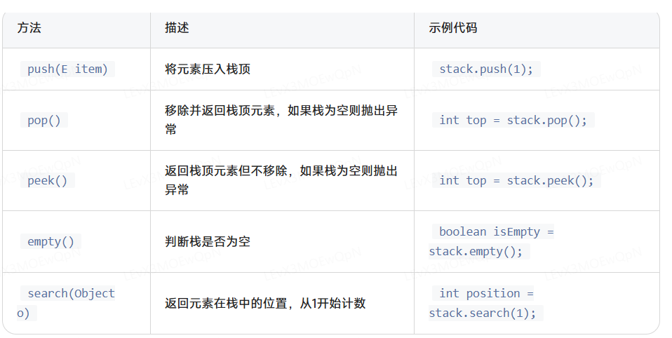
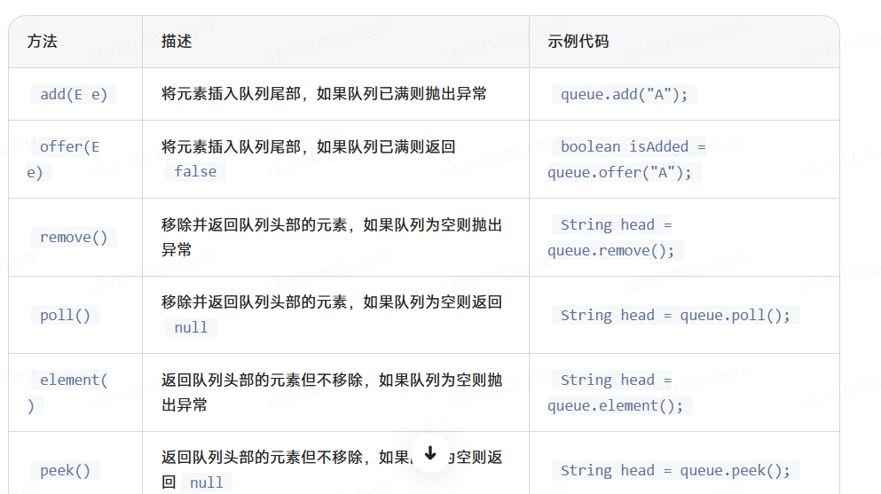

```java
import java.util.*;

public class Main {
  //main方法带参数
  public static void main(String[] args) {
    Scanner scanner = new Scanner(System.in);

    int n = scanner.nextInt();

    // <= 中间不能有空格，会编译不通过

    List<List<Integer>> t = new ArrayList<>(); //  S==》T
    for(int i = 0; i < N; i++) {
        t.add(new ArrayList<Integer>());
    }
    t.get(0).add(1); // List.get(index)方法，然后在里面放入Integer类型的元素
    System.out.println();
  }
}

```

```java
int[] T = new int[10]; // 初始化之后数组中元素的初始值是0；

// 引用类型如Integer、String，初始化后数组中元素的初始值是null；
Integer[] T = new Integer[10];
```

int[]数组的方法
List<Integer> list 数组的方法

```java
List<Integer> list = new ArrayList<>();
list.add();
list.get(int index);
list.set(int index, Integer value);
int[] a = new int[20];
int[] b = {0,1,2,3,4,5,6,7,8,9};

int[] c = Arrays.copyOfRange(int[] original, int from, int to); // from 和 to 左闭右开。

List<Integer> subList = list.subList(int fromIndex, int toIndex);
```

栈和队列的方法

```java
Stack<Integer> stack = new Stack<>();
Integer id = stack.pop();
stack.push(1);

Queue<TreeNode> queue = new LinkedList<TreeNode>();
queue.offer(firstL);
TreeNode currentL = queue.poll();

queue.add(firstL);
TreeNode currentL = queue.remove();
// add()在队列满时抛出异常，而offer()返回false。
// offer()更适用于需要避免异常的场景。
// remove()在队列为空时抛出异常，而poll()返回null。
// poll()更适用于需要避免异常的场景。
```

创建Stack

```java
import java.util.Stack;

public class StackExample {
    public static void main(String[] args) {
        Stack<Integer> stack = new Stack<>();
    }
}
```


方法示例代码

```java
import java.util.Stack;

public class StackExample {
    public static void main(String[] args) {
        Stack<Integer> stack = new Stack<>();

        // 压栈
        stack.push(10);
        stack.push(20);
        stack.push(30);
        System.out.println("Stack after push operations: " + stack); // 输出: [10, 20, 30]

        // 查看栈顶元素
        int top = stack.peek();
        System.out.println("Top element: " + top); // 输出: Top element: 30

        // 弹栈
        int popped = stack.pop();
        System.out.println("Popped element: " + popped); // 输出: Popped element: 30
        System.out.println("Stack after pop: " + stack); // 输出: [10, 20]

        // 判断栈是否为空
        boolean isEmpty = stack.empty();
        System.out.println("Is stack empty? " + isEmpty); // 输出: Is stack empty? false

        // 查找元素的位置
        int position = stack.search(10);
        System.out.println("Position of 10 in stack: " + position); // 输出: Position of 10 in stack: 2
    }
}
```

创建Deque作为栈

```java
import java.util.Deque;
import java.util.ArrayDeque;

public class DequeAsStackExample {
    public static void main(String[] args) {
        Deque<Integer> stack = new ArrayDeque<>();

        // 入栈
        stack.push(10);
        stack.push(20);
        stack.push(30);
        System.out.println("Deque as stack: " + stack); // 输出: [30, 20, 10]

        // 查看栈顶元素
        int top = stack.peek();
        System.out.println("Top element: " + top); // 输出: Top element: 30

        // 弹栈
        int popped = stack.pop();
        System.out.println("Popped element: " + popped); // 输出: Popped element: 30
        System.out.println("Deque after pop: " + stack); // 输出: [20, 10]

        // 判断栈是否为空
        boolean isEmpty = stack.isEmpty();
        System.out.println("Is stack empty? " + isEmpty); // 输出: Is stack empty? false
    }
}
```

Queue不能直接new，使用 LinkedList 实现 Queue

```java
import java.util.Queue;
import java.util.LinkedList;

public class QueueExample {
    public static void main(String[] args) {
        Queue<String> queue = new LinkedList<>();
    }
}
```

使用 ArrayDeque 实现 Queue

```java
import java.util.Queue;
import java.util.ArrayDeque;

public class ArrayDequeExample {
    public static void main(String[] args) {
        Queue<Integer> arrayDequeQueue = new ArrayDeque<>();
    }
}
```

方法的示例代码

```java
import java.util.Queue;
import java.util.LinkedList;

public class QueueExample {
    public static void main(String[] args) {
        Queue<String> queue = new LinkedList<>();

        // 入队
        queue.add("Apple");
        queue.offer("Banana");
        queue.add("Cherry");
        System.out.println("Queue after enqueue operations: " + queue); // 输出: [Apple, Banana, Cherry]

        // 查看队列头部的元素
        String head = queue.peek();
        System.out.println("Head element: " + head); // 输出: Head element: Apple

        // 出队
        String removed = queue.remove();
        System.out.println("Removed element: " + removed); // 输出: Removed element: Apple
        System.out.println("Queue after remove: " + queue); // 输出: [Banana, Cherry]

        // 查看队列头部的元素
        head = queue.peek();
        System.out.println("New head element: " + head); // 输出: New head element: Banana

        // 使用 poll 方法
        String polled = queue.poll();
        System.out.println("Polled element: " + polled); // 输出: Polled element: Banana
        System.out.println("Queue after poll: " + queue); // 输出: [Cherry]

        // 使用 element 方法
        head = queue.element();
        System.out.println("Element method head: " + head); // 输出: Element method head: Cherry

        // 使用 peek 方法
        head = queue.peek();
        System.out.println("Peek method head: " + head); // 输出: Peek method head: Cherry
    }
}
```


Set和Map的方法

```java
java.util.HashSet<E>
Set<Integer> set = new HashSet<>(); // 构造一个空散列集
Set<Integer> set = new HashSet<>(int initialCapacity); // 指定容量的空散列集。
Set<Integer> set = new HashSet<>(Collection<? extends E> c) // 新建散列集，把Collection中的元素都添加进去并自动去重。
Set<Integer> set = new HashSet<>(int initialCapacity, float loadFactor) // 指定初始容量和最大装填因子，超过装填因子会再散列。
```

```java
java.lang.Object

int hashCode =  obj.hashCode(); // 返回任一Object类实例对象的散列码，散列码是任意整数正负都可。
```

```
Map<Integer, Integer> map = new HashMap<>();
map.get(Integer key);
map.put(Integer key, Integer value);
```

不同类型的数组、set、map的循环方法

```java
List<Integer> list = new ArrayList<>();
list.add(0);
list.add(1);
list.add(2);

for(Integer e : list) {
    e = 100;
}
// list中的元素仍然是[0, 1, 2]。因为List.get()方法虽然返回的是对对象的引用，但是Integer、String等是不可变类型，不能get之后再改变他们的值。可以使用set(index,value)方法替换对应索引位置的对象。

for(int i = 0; i < list.size(); i++) {
    list.set(i,100);
}


// 因为里面的元素是基本类型，不是对象，所以可以，如果是Integer[]数组，就会报错
int[] inDegree = new int[N];
for(int i = 0; i< inDegree.length; i++) {
    inDegree[i]++; 
    //相当于inDegree[i] = inDegree[i] + 1;
}
```

```java
        List<List<Integer>> adjList = new ArrayList<>(); 
        for(int i = 0; i < N; i++) {
            adjList.add(new ArrayList<Integer>());
        }
        
         
        for(int i=0; i< M; i++) {
            int S = scanner.nextInt();
            int T = scanner.nextInt();

            // 构建邻接表adjList时可以先get后add，也是因为get方法返回的是对对象的引用。
            adjList.get(S).add(T); 
            
            inDegree[T]++; 
        }
```

String的方法

```java
String str = "sgh";
int length = str.length();
String[] list = str.split("");

// 正则表达式 
Scanner scanner = new Scanner(System.in);
String str = scanner.next();
String emailMatcher="[a-zA-Z0-9]+@[a-zA-Z0-9]+\\.[a-zA-Z0-9]+";
String result = "邮箱格式不合法";
if(str.matches(emailMatcher)) {  //返回boolean str.matches(String regex)
    result = "邮箱格式合法";
}
```

整除和求余

```java
int A = 9 / 2; // 4.5小叔位被截断，隐式的强制类型转换为int类型，A为4.

int B = 9 % 2; // B为1，9 除以 2 等于 4 余 1
```

int是32位的，算法题中超过这个值了要使用long型

生成随即数

```java
class {
    private final static Random random = new Randow(System.currentTimeMillis());

    public int getRandomInt (int low, int high) {
        // random.nextInt(int bound)：这是Random类的一个方法，用于生成一个在0（包括）到bound（不包括）之间的随机整数。
        return low + random.nextInt(high - low + 1);
    }
}
```

```java
char c = 'c';
char C = 'C';
int n = c - 'a' + 1;  // 3
int N = C - 'A' + 1; //3
```

加减乘除上的类型转换

```java
import java.util.Scanner;

public class Main {

    public static void main(String[] args) {
        Scanner scan = new Scanner(System.in);

        int n = 0;
        double ave = 0;
        int sum = 0;
        int number = scan.nextInt();
        while(number > 0) {
            n++;
            sum = sum + number;

            // sum和n都是int，直接除会得到整数
            ave = (double)(sum)/(n); // 先把sum转为double类型
            number = scan.nextInt();
        }
        scan.close(); // 停止输入,一定要写
        System.out.println(String.format("%.2f",ave));
        

    }
}
```

static静态方法

```java
import java.util.Scanner;

public class Main {

    public static void main(String[] args) throws Exception {
        Scanner scanner = new Scanner(System.in);
        while (scanner.hasNext()) {
            String className = scanner.next();
            // print就是需要你定义的方法
            print(Class.forName(className).newInstance()); // main方法是静态方法，静态方法里面只能直接调用静态方法，所以print要是静态的，只有静态方法才能不需要类的实例直接调用。
        }
    }

    //write your code here......
    
    private static void print(Object obj) {
        System.out.println(obj.toString());
    }

}

class First {
    public String toString() {
        return "First";
    }
}

class Second {
    public String toString() {
        return "Second";
    }
}

class Third {
    public String toString() {
        return "Third";
    }
}
```

Math函数

```java
    Scanner scanner = new Scanner(System.in);
    double num = scanner.nextDouble();

    double abs = Math.abs(num); // 绝对值
    double p = Math.sqrt(num); // 平方根
    double log = Math.log(num); // 对数
    double tan = Math.sin(num); // 正弦
```

Calendar类：Calendar是抽象类，不能new，只能用getInstance()方法获得一个实例，set方法中月份从0开始，0表示1月，日期0表示上个月的最后一天。

```java
import java.util.Calendar;
import java.util.Scanner;

public class Main {
    public static void main(String[] args) {
        Scanner console = new Scanner(System.in);
        int year = console.nextInt();

        //write your code here......
        Calendar cal = Calendar.getInstance();
        for (int month = 1; month <= 12; month++) {
            cal.set(year, month, 0); // month从1开始，即2月的上个月的最后一天，即1月的最后一天
            System.out.println(year + "年" + month + "月:" +
                               cal.get(cal.DAY_OF_MONTH) + "天"); // get获取当天是一个月的哪一天。
        }
    }
}
```

时间转换

```java
import java.text.ParseException;
import java.text.SimpleDateFormat;
import java.util.Date;
import java.util.Scanner;

public class Main {
    public static void main(String[] args) throws ParseException {
        SimpleDateFormat sdf = new SimpleDateFormat("yyyy-MM-dd HH:mm:ss");
        Scanner in = new Scanner(System.in);
        String str1 = in.nextLine();

        //write your code here......
        String[] list = str1.split(" ");
        if (list.length != 6 ) {
            System.out.println("您输入的数据不合理");
        } else {
            String str = list[0] + "-" + list[1] + "-" + list[2] + " " + list[3]  + ":" + list[4] + ":" + list[5];
            Date date = sdf.parse(str);

            System.out.println("北京时间为：" + sdf.format(date.getTime()));
            System.out.println("纽约时间为：" + sdf.format(date.getTime() - (long)12*60*60*1000));
        }


    }
}
```

异常捕获！！！

```java
import java.util.*;

public class Main {
    public static void main(String[] args) {
        Scanner scanner = new Scanner(System.in);
        int score = scanner.nextInt();

        //write your code here......
        try {
            if (score >= 0 && score <= 100) {
                System.out.println(score);
            } else {
                throw new ScoreException("分数不合法");
            }
        } catch (ScoreException e) {
            System.out.println(e.getMessage());
        }


    }
}

class ScoreException extends Exception {
    //write your code here......

    private String message;
    public ScoreException(String msg) {
        super(msg);
    };


    
}
```

char类型判断：Java中单引号''给基本类型数据char用，只能是单个字符；双引号""给引用类型String用，是字符串。

```java
import java.util.*;

public class Main {
    public static void main(String[] args) {
        int numbers = 0;
        int words = 0;
        int space = 0;
        int other = 0;
        Scanner scanner = new Scanner(System.in);
        String str = scanner.nextLine();

        //write your code here......
        for(int i = 0; i<str.length(); i++) {
            char c = str.charAt(i);
            if((c >= 'a' && c<= 'z') || (c >= 'A' && c<= 'Z') ) {
                words++;
            } else if(c >= '0' && c<= '9') {
                numbers++;
            } else if(c == ' ') {
                space++;
            } else {
                other++;
            }
        }

        System.out.println("英文字母"+words+"数字"+numbers+"空格"+space+"其他"+other);
    }
}

```

字符串和数组的转换及排序

```java
    private String getKey(String str) {
        // String的split和join方法。
        List<String> list = new ArrayList<>(List.of(str.split("")));
        list.sort(null);
        return String.join("", list);

        // char[]和String之间的转换
        char[] array = str.toCharArray();
        Arrays.sort(array); // 数组Array类也有sort方法，不必非要使用Collection中的sort方法。
        String key = new String(array);  // 生成字符串
        return key;
    }
```

二维数组排序int[][] intervals,Arrays.sort() + Lambda表达式。

```java
Arrays.sort(intervals, (a,b) -> Integer.compare(a[0], b[0]));
Arrays.sort(intervals, Comparator.comparingInt(a -> a[0]));
```
