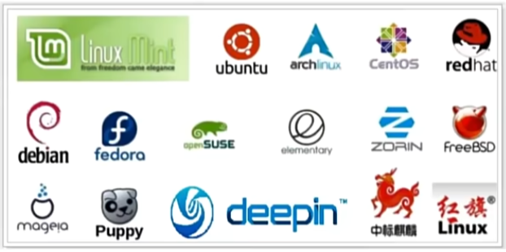

# Linux是什么

1. 操作系统的一种，是一种类Unix系统。

2. Linux系统的组成：Linux系统内核 + 系统级应用程序（如文件管理器、任务管理器、图片查看、音乐播放器等）
3. Linux系统的内核是开源的，不同厂家在Linux开源内核的基础上开发不同的系统级应用程序，就可以发行自己的Linux操作系统。

## 虚拟机

1. 什么是虚拟机：虚拟机是通过软件抽象、模拟出的“逻辑计算机”，虚拟机的主机、CPU、内存等都是软件虚拟出来的硬件，是运行在隔离环境中的完整计算机系统，与宿主机及其他虚拟机相互隔离。
2. 宿主机Host：运行虚拟机的物理计算机；
3. 客户机Guest：虚拟机中的操作系统及其运行环境，独立使用分配的虚拟资源。
