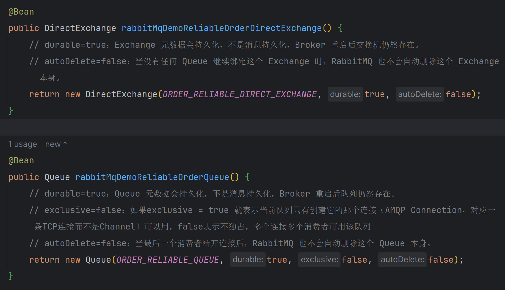
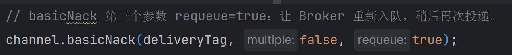

# 消息队列

## 消息队列的好处/对系统的用处

1. 异步处理：用户请求写入消息队列之后就可以立即返回给用户，后续业务逻辑异步执行，比如成功了再给用户发出票成功的短信通知。
2. 削峰/限流：短时间高并发的请求先放在消息队列中，后端服务慢慢消费。
3. 降低系统耦合性：**生产者和消费者之间没有直接耦合。而且发布订阅模式，还方便后续拓展，同一个消息增加消费者/订阅者即可**，比如订单消息本来是财务服务消费，后续库存服务也可以订阅。
4. 分布式事务解决方案：RocketMQ事务消息（半消息 + Broker回查事务是否成功）
5. 顺序保证：顺序保证是因为队列先进先出的数据结构，因此单消费者单队列就能保证；但是如果消息很多的话，就需要多消费者多队列，可以把消息分类到多个队列中，以IOT采集能源消费计算growth为例，按照设备id分队列，然后消费。

   ```
   采集网关 / 接入服务集群
           ↓
      deviceId hash 分区
           ↓
   RabbitMQ Cluster
    ┌──────────────┬──────────────┬──────────────┐
    │ Node A       │ Node B       │ Node C       │
    │ queue.00     │ queue.11     │ queue.22     │
    │ queue.01     │ queue.12     │ queue.23     │
    └──────┬───────┴──────┬───────┴──────┬───────┘
           ↓              ↓              ↓
    消费者组A         消费者组B         消费者组C
           ↓
   原始数据表 / 时序库 / Redis / 聚合表
   ```

   如果只是要求“最终数据按照采集时间查询时是有序的”，而不是严格要求“入库动作顺序发生”，可以先把电表累计值/原始值入库，然后安排异步任务按照采集时间进行计算，计算出growth。

6. 即时通讯 MQTT适合IOT等低带宽、高延迟网络环境下工作，又很轻量。
7. 数据流处理：使用消息队列作为实时数据总线，给各个服务使用，如Kafka适合高吞吐的分布式日志系统。

## 消息队列服务宕机了怎么避免消费丢失？

1. 把成功发送的消息存在生产者服务器上，等消息被消费后才删除。

## MQ的概念 消息队列

1. 异步通信

2. 异步调用的优劣势

## MQ 的技术选型

1.

## RabbitMQ的架构

1. exchange交换机只负责路由、分发消息，本身不储存消息，所有一个交换机如果没有bind绑定队列，发布给这个交换机的消息就会丢失
2. 一个交换机可以绑定多个队列。
3. Virtual-host虚拟主机，rabbitMQ吞吐量够，有些小公司，同一个公司所有项目用一套MQ就行了，但是为了**数据隔离**，不同的项目用不同的virtual-host，类似于MySQL分不同的database
   

### RabbitMQ和Kafka区别

1. Kafka 中“流式”的含义是指系统持续不断地产生实时数据流，例如日志流、IoT 设备采集流、用户行为流、监控指标流等。Kafka 更像一个分布式实时日志平台，用于持续接收、存储（**它接收之后会把数据存在本地，并且还能消息重放**）和传输**海量实时数据、大数据**。
2. Kafka吞吐量更大、消息保留7天以上、可重放，可用于比如实时点赞等场景。

## AMQP协议与Spring AMQP

1. RabbitMQ是基于AMQP,Advanced Message Queuing
   Protocol协议的,是用于在应用程序之间传递业务消息的开放标准。该协议与语言和平台无关，更符合微服务中独立性的要求。
2. Spring
   AMQP是基于AQMP协议定义的API规范，提供了模板来发送和接收消息。包含两部分：

   (1). spring-amqp是基础抽象；

   (2). spring-rabbit是底层的默认实现。

### Rabbit核心组件 = Producer + Exchange + Queue + Binding + RoutingKey + Consumer + Broker

1. 消息路径：

   ```
    Producer → Exchange → Queue → Consumer
   ```

#### Producer生产者 和Consumer消费者

1. 生产者生产的消息 = 消息头 + 消息体
2. 消息头MessageProperties里面存的不是RoutingKey，RoutingKey是发送的时候的参数。MessageProperties中包含（看一下前几个就行）：

| 字段                 | 类型               | 作用                                                                    | 是否常用   | 举例                  |
| -------------------- | ------------------ | ----------------------------------------------------------------------- | ---------- | --------------------- |
| `messageId`          | String             | **消息唯一ID，用于幂等、去重**                                          | ⭐⭐⭐⭐⭐ | `msg-10001`           |
| `deliveryMode`       | Integer            | **是否持久化**                                                          | ⭐⭐⭐⭐⭐ | `2=持久化`            |
| `expiration`         | String             | **TTL过期时间(ms)**                                                     | ⭐⭐⭐⭐   | `60000`               |
| `deliveryTag`        | long               | **RabbitMQ投递编号**                                                    | ⭐⭐⭐⭐⭐ | **ACK用**             |
| `headers`            | Map<String,Object> | **自定义Header**,可以用于用于保存 traceId、重试次数、来源服务等扩展信息 | ⭐⭐⭐⭐⭐ | retry-count/source    |
| `correlationId`      | String             | 请求/响应关联ID，链路追踪                                               | ⭐⭐⭐⭐   | RPC请求关联           |
| `contentType`        | String             | 消息内容类型                                                            | ⭐⭐⭐     | `application/json`    |
| `contentEncoding`    | String             | 编码格式                                                                | ⭐⭐       | `UTF-8`               |
| `timestamp`          | Date               | 消息发送时间                                                            | ⭐⭐⭐     | `2026-05-28 10:00:00` |
| `priority`           | Integer            | 消息优先级                                                              | ⭐⭐       | `0~255`               |
| `replyTo`            | String             | RPC回复队列                                                             | ⭐⭐       | `reply.queue`         |
| `type`               | String             | 消息类型标识                                                            | ⭐⭐       | `order.created`       |
| `userId`             | String             | 发送用户ID                                                              | ⭐         | `system-user`         |
| `appId`              | String             | 应用ID                                                                  | ⭐⭐       | `order-service`       |
| `clusterId`          | String             | 集群ID                                                                  | ⭐         | 很少用                |
| `receivedExchange`   | String             | 消费时收到的Exchange                                                    | ⭐⭐⭐     | `order.exchange`      |
| `receivedRoutingKey` | String             | 消费时收到的RoutingKey                                                  | ⭐⭐⭐     | `order.created`       |
| `consumerQueue`      | String             | 当前消费队列                                                            | ⭐⭐⭐     | `stock.queue`         |
| `redelivered`        | boolean            | 是否重复投递                                                            | ⭐⭐⭐⭐   | true/false            |
| `receivedDelay`      | Long               | 延迟消息时间                                                            | ⭐⭐       | 延迟插件使用          |

1. 消息头和消息体都可以被消费，比如用messageId做幂等

   ```java
   @RabbitListener(queues = "stock.queue")
   public void consume(Message message) {

    MessageProperties props =
            message.getMessageProperties();

    String messageId = props.getMessageId();

    String routingKey =
            props.getReceivedRoutingKey();

    Boolean redelivered =
            props.getRedelivered();

    Object traceId =
            props.getHeaders().get("traceId");

    System.out.println(messageId);
   }
   ```

#### Exchange

1. **Exchange交换器负责把消息分配到对应的Queue中。通过BindingKey把Exchange和Queue绑定Binding。Producer发送消息时会指定RoutingKey，RoutingKey跟BindingKey匹配上时消息就会被路由到对应队列中**。路由过程如下：

   ```
        Producer
            ↓
        发送：
        Exchange + RoutingKey + Message
                                    ├─ MessageProperties（消息头/属性）
                                    └─ Body（消息体）
        Exchange
            ↓
        遍历所有 Binding

        判断：
        RoutingKey 是否匹配 BindingKey

        匹配成功：
        投递 Queue
   ```

2. Exchange有四种类型，对应四种路由策略：

   (1). direct 直连模式：RoutingKey和BingdingKey精准匹配上才路由到对应队列

   (2).
   fanout 广播模式：把发送到该Exchange的所有消息**路由到所有绑定的队列中，不做筛选匹配，性能最高**

   (3). topic 主题模式：可以使用 \* 或 # 进行模糊匹配，匹配到的都可以路由。
   - `*`
     **必须匹配上一个单词才行**，例如 energy.\* 可以匹配 energy.water、energy.gas，但不能匹配 energy.electric.device001，因为energy.electric.device001有两个单词；

   - `#` 可以匹配
     **0 个**或多个单词，例如**energy.# 可以匹配 energy**、energy.electric、energy.electric.device001 等所有以 energy 开头的 RoutingKey。

   (4). headers,
   **不使用RoutingKey匹配，根据消息头中的headers中的键值对进行匹配**，支持两种模式，x-match
   = all全部键值对都匹配才行 和 x-match =
   any任意一个匹配上就行，**性能差、不能做层级路由、实际用得很少、不推荐**:

   ```
    // 生产者
   headers.put("type", "electric");
   headers.put("region", "cn");
   headers.put("level", "vip");
   ```

#### Queue 消息队列

1. 竞争消费：多个消费者绑定同一个队列，一条消息只会被一个消费者消费，不会重复消费。默认是轮询分摊消费，实际受到perfetch_count影响。
2. perfetch_count是允许RabbitMQ最多提前推送多少条“还没ACK”的消息给消费者。不设置的话RabbitMQ会尽量多的推送。一般设置的>=1。
3. 如果想重复消费，比如一个订单消息同时让财务服务、库存服务、物流服务消费，就同一个Exchange绑定多个不同队列，那同一条消息就会被复制给每个队列。这就是**发布订阅**模式。
4. 如果财务服务、库存服务、物流服务之间存在操作的先后顺序，比如完成财务扣费之后才能扣减库存，单纯的发布订阅不能满足，因为各个微服务之间是操作是解耦的。要使用**基于事件驱动的分布式事务链（**saga**思想），就是每个服务完成自己的本地事务之后通过MQ事件驱动下一步，并且每一个本地步骤都有补偿事件，达到最终一致**。

   ```
   订单服务创建订单成功
      ↓
   发布 order.created 事件(发送MQ消息到对应队列)
      ↓
   财务服务消费 order.created，生成账单/扣款
      ↓
   财务成功后发布 payment.success 事件 (发送MQ消息到对应队列)
      ↓
   库存服务消费 payment.success，扣减库存
      ↓
   库存成功后发布 stock.deduct.success 事件 (发送MQ消息到对应队列)
      ↓
   积分服务消费 stock.deduct.success，增加积分
   ```

   **事件驱动分布式事务链 = 本地事务 +
   MQ事件 + 下游消费 + 状态机维护+ 每个阶段的失败补偿 + 幂等重试，实现最终一致性。**

   如果链路很长，复杂业务流程用Seata
   Saga中间件（上面是手动实现的Saga，每个服务自己找下一个服务，用中间件就是加了一个协调器，中间件自己记录全局事务、做日志、补偿等）；强一致核心链路考虑 TCC/Seata；非核心通知继续用 MQ。

#### Broker

1. 一个Broker就是RabbitMQ服务实例。

### RabbitMQ的工作模式

1. 工作模式和Exchange路由策略是两个东西。

| 工作模式                   | Queue数量                                   | Consumer数量            | 一条消息会被几个Consumer处理 | 是否重复消费（广播）   | 默认/常用Exchange              | 其他可实现Exchange |
| -------------------------- | ------------------------------------------- | ----------------------- | ---------------------------- | ---------------------- | ------------------------------ | ------------------ |
| Simple Queue 简单模式      | **1**                                       | 1                       | 1个                          | 否                     | **Direct（因为只有一个队列）** | -                  |
| Work Queue 工作队列        | **1**                                       | **多个且竞争消费**      | 1个                          | 否                     | **Direct（因为只有一个队列）** | -                  |
| Publish/Subscribe 发布订阅 | 多个                                        | 每个Queue可多个Consumer | **每个Queue都会收到一份**    | 是                     | Fanout                         | Topic、Direct      |
| Routing 路由模式           | 多个，**多个Queue可以绑定同一个BindingKey** | 每个Queue可多个Consumer | 匹配上的的Queue收到          | 匹配给多个队列了就是   | Direct                         | -                  |
| Topic 主题模式             | 多个                                        | 每个Queue可多个Consumer | 匹配上的的Queue收到          | 是匹配给多个队列了就是 | Topic                          | -                  |

### RabbitMQ通过Channel传输数据

1. **RabbitMQ
   Channel信道是在一个TCP连接内部复用出来的逻辑通信通道(建立在TCP链接上的虚拟链接)**。因为每次发消息都新建TCP连接要消耗很多资源。

2. **一个TCP连接可以承载多个Channel。RabbitMQ的所有操作（发送消息、消费消息、ACK等）都是通过Channel完成**。

   ```
   Connection(TCP)
      ├── Channel1
      ├── Channel2
      ├── Channel3
      └── Channel4
   ```

   ```
    channel.basicPublish(...)
    channel.basicConsume(...)
    channel.basicAck(...)
   ```

3. **Channel线程不安全，使用时一个线程一个Channel。**

## Spring AMQP开发

### 基于@Bean 声明交换机、队列、绑定

1. 在java代码里声明队列、交换机及其绑定关系，而不是在RabbitMQ控制台里手动新建队列等。
   
2. 在配置类中声明交换机、队列、绑定。**多个交换机、多个队列、对应多个绑定关系，都可以在RabbitMqDemoConfig中对应写多个方法进行注册声明**。

   不同类型的Exchange有对应的类。

   ```java
   @EnableRabbit // 向 Spring 容器注册 RabbitMQ 注解处理器，让Spring能够识别@RabbitListener注解，跟下面的@Bean声明队列、交换机等没什么关系。
   @Configuration
   public class RabbitMqDemoConfig {

       public static final String EXCHANGE_NAME = "energy.exchange";
       public static final String QUEUE_NAME = "energy.collect.queue";
       public static final String ROUTING_KEY = "energy.collect";

       @Bean
       public DirectExchange energyExchange() {
           return new DirectExchange(EXCHANGE_NAME, true, false);
       }

       @Bean
       public Queue energyQueue() {
           return QueueBuilder.durable(QUEUE_NAME).build();
       }

       @Bean
       public Binding energyBinding() {
           return BindingBuilder
                   .bind(energyQueue())
                   .to(energyExchange())
                   .with(ROUTING_KEY);
       }

       ...

       @Bean
       public FanoutExchange rabbitMqDemoOrderFanoutExchange() {
           // Fanout Exchange 会把消息广播给所有绑定到它的队列。
           return new FanoutExchange(ORDER_FANOUT_EXCHANGE, false, false);
       }

       //此处忽略该交换机对应的队列和绑定关系的声明
       ...

       @Bean
       public TopicExchange rabbitMqDemoOrderTopicExchange() {
           // Topic Exchange 支持通配符路由：* 匹配一个单词，# 匹配零个或多个单词。
           return new TopicExchange(ORDER_TOPIC_EXCHANGE, false, false);
       }
       //此处忽略该交换机对应的队列和绑定关系的声明
       ...

       @Bean
       public HeadersExchange rabbitMqDemoOrderHeadersExchange() {
           // Headers Exchange 根据消息头匹配，RoutingKey 通常会被忽略。
           return new HeadersExchange(ORDER_HEADERS_EXCHANGE, false, false);
       }
       //此处忽略该交换机对应的队列和绑定关系的声明

       ...

       // 消息转换器
       /**
        * Jackson2JsonMessageConverter Bean：使用 jackson 序列化消息
        */
       @Bean
       public MessageConverter createMessageConverter() {
           return new Jackson2JsonMessageConverter();
       }
   }

   ```

3. 上述是在Java代码里定义好的，这些交换机、队列、绑定关系，统称为拓扑。真正创建这些对象的是Spring
   AMQP管理的RabbitAdmin客户端，RabbitAdmin客户端发现上述Bean的存在，然后去连接Rabbit
   Broker，让Broker创建上述对象。 所以对于队列声明时 有exclusive 这个属性



### 基于注解声明交换机、队列、绑定（了解即可）

1. 就是在@RabbitListener注册消费者时，通过@QueueBinding(...)把交换机、队列、绑定关系注册掉，就不需要像上面一样单独使用配置类声明交换机、队列、绑定关系了。 ==> 代码可读性不好，不方便集中管理，不推荐

   ```java
   package com.itheima.rabbitmq.consumer;

   import lombok.extern.slf4j.Slf4j;
   import org.springframework.amqp.core.ExchangeTypes;
   import org.springframework.amqp.rabbit.annotation.Exchange;
   import org.springframework.amqp.rabbit.annotation.Queue;
   import org.springframework.amqp.rabbit.annotation.QueueBinding;
   import org.springframework.amqp.rabbit.annotation.RabbitListener;
   import org.springframework.stereotype.Component;

   @Slf4j
   @Component
   public class SpringRabbitListener {
       @RabbitListener(bindings = @QueueBinding(
               value = @Queue(name = "direct.queue2", durable = "true"),
               exchange = @Exchange(name = "hmall.dirext", type = ExchangeTypes.DIRECT),
               key = {"red", "yellow"}

       ))
       public void listenDirectQueue(String message) {
           log.info("消费者监听到direct.queue的消息：【{}】", message);
       }
   }

   ```

### ok下面写的是已经通过RabbitMqDemoConfig注册完交换机、队列、绑定关系了

#### 生产者

1. 生产者 通过 import org.springframework.amqp.rabbit.core.RabbitTemplate
   **的rabbitTemplate.convertAndSend**(...)方法发送消息。

   ```java

   package com.xb.xsf.module.basic.rabbitmqdemo.producer;

   import com.xb.xsf.module.basic.rabbitmqdemo.config.RabbitMqDemoConfig;
   import com.xb.xsf.module.basic.rabbitmqdemo.message.OrderCreatedMessage;
   import org.slf4j.Logger;
   import org.slf4j.LoggerFactory;
   import org.springframework.amqp.rabbit.core.RabbitTemplate;
   import org.springframework.stereotype.Component;

   /**
    * V1：订单消息生产者。
    */
   @Component
   public class OrderProducer {

       // 创建日志对象，方便观察生产者发送行为。
       private static final Logger log = LoggerFactory.getLogger(OrderProducer.class);

       // RabbitTemplate 是 Spring AMQP 提供的消息发送核心 API。
       private final RabbitTemplate rabbitTemplate;

       public OrderProducer(RabbitTemplate rabbitTemplate) {
           // 通过构造方法注入 RabbitTemplate，便于测试，也避免字段注入。
           this.rabbitTemplate = rabbitTemplate;
       }

       public void sendOrderCreatedMessage(OrderCreatedMessage message) {
           // 记录即将发送的消息，便于本地验证和排查。
           log.info("准备发送订单创建消息: {}", message);
           // convertAndSend 会先用 MessageConverter 把 Java 对象转成 Message。
           // 第一个参数是 Exchange 名称，表示消息先进入哪个交换机。
           // 第二个参数是 RoutingKey，Direct Exchange 会用它精确匹配 Binding。
           // 第三个参数是消息体，V1 传入的是订单创建业务对象。
           rabbitTemplate.convertAndSend(
                   RabbitMqDemoConfig.ORDER_DIRECT_EXCHANGE,
                   RabbitMqDemoConfig.ORDER_CREATED_ROUTING_KEY,
                   message
           );
           // V1 没有 Publisher Confirm，所以这里只代表客户端调用完成，不代表 Broker 一定收到。
           log.info("RabbitTemplate 调用完成，V1 暂不确认消息是否真正到达 Broker");
       }

       // 生产消息时设置headers
       public void sendTopicOrderMessage(RabbitMqMessage<OrderCreatedMessage> message, String routingKey) {
           // 记录 Topic 消息和 RoutingKey，方便观察不同 BindingKey 的匹配结果。
           log.info("[Topic] 准备发送统一订单消息: routingKey={}, body={}", routingKey, message);
           // Topic Exchange 使用 routingKey 做通配符匹配，Header 只是辅助追踪和排查。
           rabbitTemplate.convertAndSend(
                   RabbitMqDemoConfig.ORDER_TOPIC_EXCHANGE,
                   routingKey,
                   message,

                   // MessagePostProcessor
                   amqpMessage -> {
                        MessageProperties properties = amqpMessage.getMessageProperties();

                        properties.setMessageId(body.getMessageId());
                        properties.setHeader("traceId", body.getTraceId());
                        properties.setHeader("eventType", body.getEventType());

                        return amqpMessage;
                    }
           );
           // V3 仍然不确认消息是否到达 Exchange，这会在 V4 处理。
           log.info("[Topic] RabbitTemplate 调用完成，messageId={}", message.getMessageId());
       }
   }

   ```

#### 消费者

1. 消费者通过@RabbitListener监听并消费消息

   ```java
   package com.xb.xsf.module.basic.rabbitmqdemo.consumer;

   import com.xb.xsf.module.basic.rabbitmqdemo.config.RabbitMqDemoConfig;
   import com.xb.xsf.module.basic.rabbitmqdemo.message.OrderCreatedMessage;
   import org.slf4j.Logger;
   import org.slf4j.LoggerFactory;
   import org.springframework.amqp.rabbit.annotation.RabbitListener;
   import org.springframework.stereotype.Component;

   /**
    * V1：订单消息消费者。
    */
   @Component
   public class OrderConsumer {

       // 创建日志对象，方便观察消费者消费行为。
       private static final Logger log = LoggerFactory.getLogger(OrderConsumer.class);

       @RabbitListener(queues = RabbitMqDemoConfig.ORDER_CREATED_QUEUE)
       public void onOrderCreated(OrderCreatedMessage message) {
           // @RabbitListener 会创建监听容器，持续监听指定队列。
           // 方法参数会由 MessageConverter 从 JSON 自动反序列化为 Java 对象。
           log.info("收到订单创建消息: {}", message);
           // V1 使用 acknowledge-mode=auto，方法正常返回后 Spring 会自动 ACK。
           // 如果这里抛出异常，自动 ACK 模式下的失败处理策略会在后续版本再深入讲解。
           log.info("模拟处理订单创建事件完成，orderId={}", message.getOrderId());
       }
   }

   ```

2. 多个生产者可以在一个生产者类中写多个发送消息的方法，也可以拆分成多个生产者类；
3. 多个消费者可以在一个消费者类中写多个带@RabbitListener的方法，也可以拆分成多个消费者类。

### 消息转换器

1. 为什么需要消息转换器：RabbitMQ只能传输byte[], 因此需要消息转换器实现Java对象和byte[]之间的序列化与反序列化。

   ```
   Java对象
       ↓
   MessageConverter
       ↓
   Message(byte[])
       ↓
   RabbitMQ
       ↓
   Message(byte[])
       ↓
   MessageConverter
       ↓
   Java对象
   ```

### 设置和消费消息头 headers

1. 生产消息的时候，在Java对象被转换成AMQP
   Message对象之后，才能使用AMQP的Message的getMessageProperties()方法，进行set
   headers。

   ```
   RabbitMqMessage Java对象
           ↓ convertAndSend 内部转换
   AMQP Message
           ↓ 才有 MessageProperties
   发送到 RabbitMQ
   ```

2. 所以生产者需要使用 rebbitTemplate.convertAndSend(String exchange, String
   routingKey, final Object message,final MessagePostProcessor
   messagePostProcessor) 方法，设置headers。其中 MessagePostProcessor 是一个函数式接口。

3. **不使用MessagePostProcessor是拿不到AMQP 的Message对象的**，你只有代码里自己写的java对象。

### 消息可靠性

#### 发送端

1. 发送端有两方面：

   (1). **确认消息是否到达Exchange**,配置文件里开启 Publisher
   Confirm ，并使用 ConfirmCallback ;

   (2). **确认消息是否从Exchange到达Queue**，配置文件里设置mandatory =
   true模式，让“不可路由的消息必须退回给生产者” + ReturnsCallback。

2. 具体实现：

   (1). 配置文件

   ```yml
      spring:
        rabbitmq:
          ......
          virtual-host: /
          # V4 开启 Publisher Confirm；correlated 表示回调里可以拿到 CorrelationData，用 messageId 关联发送记     录。
          publisher-confirm-type: correlated
          # V4 开启发布退回；消息到达 Exchange 但没有路由到 Queue 时，配合 mandatory=true 触发     ReturnsCallback。
          publisher-returns: true
          template:
            # mandatory=true 表示“不可路由消息必须退回给生产者”，否则 Broker 会直接丢弃不可路由消息。
            mandatory: true
   ```

   (2). 给RabbitTemplate 设置ConfirmCallback和ReturnsCallback。

   ```java
   // 生产者OrderProducer类的构造方法
    public OrderProducer(RabbitTemplate rabbitTemplate, MessageSendLogService messageSendLogService) {
        // 保存 Spring 容器中的 RabbitTemplate，后续所有发送都通过它完成。
        this.rabbitTemplate = rabbitTemplate;
        // 保存消息发送日志服务，用于在回调中记录成功或失败。
        this.messageSendLogService = messageSendLogService;

        // 注册 Publisher Confirm 回调，用来判断消息是否到达 Exchange。
        this.rabbitTemplate.setConfirmCallback(new RabbitTemplate.ConfirmCallback() {
            @Override
            public void confirm(CorrelationData correlationData, boolean ack, String cause) {
                // ack=true 表示 Exchange 已经接收消息；ack=false 表示消息没有到达 Exchange。
                if (ack) {
                    // 记录发送到 Exchange 成功，生产环境可把消息日志状态改为 EXCHANGE_ARRIVED。
                    OrderProducer.this.messageSendLogService.recordConfirmSuccess(correlationData);
                    // Confirm 只确认到 Exchange，不代表消息一定进入了 Queue。
                    return;
                }
                // 记录发送到 Exchange 失败，生产环境应触发重试或告警。
                OrderProducer.this.messageSendLogService.recordConfirmFailure(correlationData, cause);
            }
        });
        // 注册 ReturnsCallback，用来判断消息是否从 Exchange 成功路由到了 Queue。
        // ReturnsCallback 触发说明消息到了 Exchange，但是没有任何 Queue 接收它。
        this.rabbitTemplate.setReturnsCallback(new RabbitTemplate.ReturnsCallback() {
            @Override
            public void returnedMessage(ReturnedMessage returned) {
                // 取出原始 AMQP 消息属性，里面包含 messageId 和 Header。
                MessageProperties properties = returned.getMessage().getMessageProperties();
                // 读取 messageId，便于和业务消息、发送日志关联。
                String messageId = properties.getMessageId();
                // 记录路由失败详情，包含 Exchange、RoutingKey 和 Broker 返回原因。
                OrderProducer.this.messageSendLogService.recordReturnedMessage(
                        messageId,
                        returned.getExchange(),
                        returned.getRoutingKey(),
                        returned.getReplyCode(),
                        returned.getReplyText()
                );
            }
        });
    }
   ```

   (3). 发送消息时使用CorrelationData，CorrelationData 是自己绑定的关联数据，可以自己绑定关联数据，这样异步 Confirm 回调之后你就能知道这是哪条数据了。可以视为发送消息时附带的回执单。

   ```java
   // CorrelationData 可以让发送者自定义CorrelationData的id字段，ConfirmCallback 会原样带回来
           // CorrelationData还有ReturnedMessage字段，退回的时候自动填充，这样就能知道被退回的具体是什么消息了。
           CorrelationData correlationData = new CorrelationData(message.getMessageId());
           try {
               // convertAndSend 的最后一个参数传 CorrelationData，用于把异步 Confirm 和业务 messageId 对上。
               rabbitTemplate.convertAndSend(
                       exchange,
                       routingKey,
                       message,
                       buildMessagePropertiesProcessor(message, routeType),
                       correlationData
               );
               // 这里的“调用完成”只代表客户端把发送动作交给 RabbitTemplate，不代表 Broker 已经确认。
               log.info("{} RabbitTemplate 调用完成，等待 Confirm/Return 回调，messageId={}, exchange={}, routingKey={}",
                       logTag, message.getMessageId(), exchange, routingKey);
           } catch (AmqpException ex) {
               // RabbitTemplate 直接抛异常时，说明客户端侧发送调用失败，需要立即记录。
               messageSendLogService.recordImmediateSendException(message.getMessageId(), exchange, routingKey, ex);
               // 继续抛出异常，让 HTTP 调用方也能感知本次发送失败。
               throw ex;
           }
   ```

   (4). 对应在不同节点记录日志。在Confirm失败，可以按messageId进行重试（消费者幂等），重试多次失败可以告警；Return失败、到不了队列，可能是Binding等配置问题，重试一般没用，可以做消息表记录，按照messageId人工补偿。

#### 消费端

1. 定义交换器和队列的时候durable =
   true，**让交换机和队列本身持久化**，Broker重启后他们还在
   
2. **消息持久化deliveryMode=PERSISTENT，在生产者发送消息的时候设置**

   ```java
   rabbitTemplate.convertAndSend(
           exchange,
           routingKey,
           message,
           amqpMessage -> {
               MessageProperties properties = amqpMessage.getMessageProperties();
               ......
               // 设置消息持久化，配合 durable Exchange / durable Queue 使用。
               properties.setDeliveryMode(MessageDeliveryMode.PERSISTENT);
               ......
               return amqpMessage;
           },
           correlationData
   );

   ```

3. **消费者消费完成之后调用channel.basicACK方法手动ACK**。messageId是程序员自己设置的业务Id；**deliveryTag是RabbitMQ自动生成的投递编号，只在当前Channel内有意义，通常用于用于 basicAck、basicNack、basicReject**。

   ```java
      long deliveryTag = rawMessage.getMessageProperties().getDeliveryTag();
      // basicAck 表示消费者确认消息处理成功；multiple=false 表示只确认当前这一条消息，不批量确认。
      channel.basicAck(deliveryTag, false);
   ```

4. 设置合适的prefetch数量。

   ```yaml
   spring:
     rabbitmq:
       ...
       listener:
         simple:
           # V5 开启手动 ACK：消费者必须显式调用 basicAck，消息才会从队列中删除。
           acknowledge-mode: manual
           # V5 设置单个消费者最多同时拿 5 条未确认消息，避免消费者一次性压太多未处理消息。
           prefetch: 5
   ```

##### 消费失败时正确处理

1. 消息层面，选用正确方法决定消息是否重新入队。

   (1). **channel.basicNack**(deliveryTag, false, true); **消费失败了requeue =
   true把消息重新投递到队列中**；

   

   缺点：重复入队、重复消费失败**容易死循环，生产中一般不用**。因此对于网络超时类**可恢复异常可以重新入队**，参数错误、业务状态非法等不可恢复错误不值得重新入队。

   (2). **channel.basicNack**(deliveryTag, false, false); **消费失败了requeue =
   false，消息不重新入队，没有死信队列该消息被丢弃**；

   (3). channel.basicReject(deliveryTag, false); requeue =
   false，拒绝消息，没有死信队列该消息被丢弃。

2. 消息已经从队列中取出了，消费的时候异常，就使用Spring
   Retry 本地重复调用几次消费方法，看能否成功。**重试期间消费者线程被占，因此适合短重试。**

   ```yaml
   spring:
    rabbitmq:
      ...
      listener:
        simple:
          # 监听方法异常并且重试耗尽后，消息不重新入队
          default-requeue-rejected: false
          retry:
            # V6 开启 Spring Retry：监听方法抛异常时，先在消费者本地重试方法调用。
            enabled: true
            # 最多调用 3 次监听方法：第 1 次原始消费 + 后续 2 次重试。
            max-attempts: 3
            # 第一次失败后等待 1 秒再重试。
            initial-interval: 1s
            # 重试间隔倍率；1 表示每次间隔都保持 1 秒。
            multiplier: 1
            # 最大重试间隔；这里保持 1 秒，方便学习时快速观察。
            max-interval: 1s
   ```

   **Spring Retry触发的条件是上述配置开启 +
   @RabbitListener抛出没被catch的异常 + 消息还没被basicAck、basicNack、basicReject**，框架会自动判断是不是达到了最大重试次数,最后一次重试还是失败，根据配置default-requeue-rejected:
   false，消息重新入队的。

   ```java
    @RabbitListener(queues = RabbitMqDemoConfig.ORDER_SPRING_RETRY_QUEUE)
    public void onSpringRetryOrderCreated(@Payload RabbitMqMessage<OrderCreatedMessage> message,
                                          Message rawMessage,
                                          Channel channel) throws IOException {
        // deliveryTag 用于最终 ACK；如果方法抛异常，Spring Retry 会在本地重新调用监听方法。
        long deliveryTag = rawMessage.getMessageProperties().getDeliveryTag();

         try {
             doBusiness(message);
             channel.basicAck(deliveryTag, false);
         } catch (BusinessInvalidMessageException e) {
             channel.basicReject(deliveryTag, false);
         } catch (TemporaryConsumeException e) {
             throw e; // 交给 Spring Retry 做本地短重试
         } catch (Exception e) {
             throw new IllegalStateException("未知异常，交给 Spring Retry", e);
         }
    }

   ```

3. 生产常用方案：

   ```
   业务成功
     -> basicAck

   业务不可恢复失败
     -> basicReject(false) 或 basicNack(false) -> 进死信队列

   临时失败
     -> Spring Retry 本地短重 -> 仍失败则basicNack(false) -> 进死信队列或延迟重试队列
   ```

##### 幂等消费

1. messageId 和 businessId 怎么选，messageId是消息层面的，每个消息都不一样，businessId是业务层面的比如一个订单一个。看情况选择，唯一索引可以结合使用。
2. 具体的幂等解决方案一 ==> 分布式锁:

   (1). Redis SETNX幂等流程；使用两个Key，processing Key：处理中锁 和 consumed
   Key：已消费成功标记；**要设置过期时间**。具体流程如下:

   ```
   收到消息
     -> 看 consumed Key 是否存在
         存在：说明处理成功过，直接 ACK
     -> 不存在，再 SETNX processing Key
         成功：当前消费者执行业务
         失败：说明别人正在处理，直接 ACK 或按业务策略处理
     -> 业务成功
         写 consumed Key
         删除 processing Key
         ACK
     -> 业务失败
         删除 processing Key
         抛异常 / NACK / Reject
   ```

   ```java
    import org.springframework.data.redis.core.StringRedisTemplate;
    ...

    @Service
    @AllArgsConstructor
    public class RedisConsumeIdempotentService {
        // 注入 Spring 提供的 StringRedisTemplate，用于操作 Redis 字符串 Key。
        private final StringRedisTemplate stringRedisTemplate;

        ...

        // 最重要的抢占锁的那一步
        public ConsumeIdempotentResult tryStartConsume(String messageId) {
            // 校验 messageId；没有唯一 ID 就无法做幂等去重。
            checkMessageId(messageId);
            // 先构造“已消费成功”Key。
            String consumedKey = buildConsumedKey(messageId);
            // 如果已消费成功 Key 存在，说明这条消息之前已经完成过业务处理。
            if (Boolean.TRUE.equals(stringRedisTemplate.hasKey(consumedKey))) {
                // 返回已消费结果，消费者应该直接 ACK，避免重复执行业务。
                return ConsumeIdempotentResult.CONSUMED;
            }
            // 构造“正在处理中”Key。
            String processingKey = buildProcessingKey(messageId);
            // SETNX：只有 Key 不存在时才写入成功；这一步用于抢占当前消息的处理资格。
            Boolean locked = stringRedisTemplate.opsForValue().setIfAbsent(
                    processingKey,
                    "PROCESSING",
                    PROCESSING_TTL_MINUTES,
                    TimeUnit.MINUTES
            );
            // SETNX 成功表示当前消费者是第一个处理这条消息的人。
            if (Boolean.TRUE.equals(locked)) {
                // 返回首次消费结果，消费者可以继续执行业务逻辑。
                return ConsumeIdempotentResult.FIRST_CONSUME;
            }
            // SETNX 失败表示其他消费者正在处理同一个 messageId。
            return ConsumeIdempotentResult.CONSUMING;
        }
    }

   ```

   (2). 上述手动设置过期时间可能会有锁过期导致的锁误删问题:

   ```
    消费者 A 拿到 processingKey，TTL 10 分钟
    A 业务卡了超过 10 分钟
    Key 自动过期
    消费者 B 拿到同一个 Key
    A 终于执行完，删除 processingKey
    结果 A 可能删掉 B 的 Key
   ```

   解决方案：
   - Redission Lock
   - UUID +
     **Lua原子校验删除**：消费者占有锁的时候把value设置成唯一的UUID(Key是同一个)，删除锁之前看一下value是不是自己的UUID，是才删。

   (2). Redission可以优雅续期，具体看Redis部分的笔记
   **但是Redission也要记录是否被consumed过？没明白**。

3. 数据库唯一索引幂等兜底

   ```sql
        CREATE TABLE mq_consume_log (
            id BIGINT PRIMARY KEY AUTO_INCREMENT,
            message_id VARCHAR(64) NOT NULL,
            business_id VARCHAR(128) NOT NULL,
            event_type VARCHAR(64) NOT NULL,
            consumed_at DATETIME NOT NULL,
            UNIQUE KEY uk_message_id (message_id),
            UNIQUE KEY uk_business_event (business_id, event_type)
        );

   ```

### 死信队列

1. 死信交换机一般有明确的路由具体到某个，所以用DirectExchange。
2. 用法就是：

   (1). 声明死信交换机 + 死信队列 + Binding；

   (2). 声明业务交换机 + 业务队列 + Binding；

   (3). 声明业务队列时，**给业务队列配置deadLetterExchange 和 deadLetterRoutingKey（就是死心交换机的BindingKey）**。letter理解为信件

   ```java

   package com.example.rabbitmq.config;

   import org.springframework.amqp.core.Binding;
   import org.springframework.amqp.core.BindingBuilder;
   import org.springframework.amqp.core.DirectExchange;
   import org.springframework.amqp.core.Queue;
   import org.springframework.amqp.core.QueueBuilder;
   import org.springframework.context.annotation.Bean;
   import org.springframework.context.annotation.Configuration;

   @Configuration
   public class RabbitMqDeadLetterConfig {

       // 业务交换机：生产者正常发送业务消息到这里。
       public static final String ORDER_EXCHANGE = "order.direct.exchange";

       // 业务队列：消费者正常监听这个队列。
       public static final String ORDER_QUEUE = "order.created.queue";

       // 业务 RoutingKey：业务消息通过这个 key 路由到业务队列。
       public static final String ORDER_ROUTING_KEY = "order.created";

       // 死信交换机：业务队列中产生死信时，RabbitMQ 会把消息转发到这里。
       public static final String ORDER_DLX_EXCHANGE = "order.dlx.direct.exchange";

       // 死信队列：真正存放死信消息的队列。
       public static final String ORDER_DLX_QUEUE = "order.dead.queue";

       // 死信 RoutingKey：死信消息通过这个 key 从死信交换机路由到死信队列。
       public static final String ORDER_DLX_ROUTING_KEY = "order.dead";

       @Bean
       public DirectExchange orderDeadLetterExchange() {
           // 声明死信交换机。
           // 注意：死信交换机不是特殊类型，本质上还是普通 DirectExchange。
           return new DirectExchange(ORDER_DLX_EXCHANGE, true, false);
       }

       @Bean
       public Queue orderDeadLetterQueue() {
           // 声明死信队列。
           // 死信队列本身就是普通队列，只是用途是存放死信消息。
           return QueueBuilder.durable(ORDER_DLX_QUEUE)
                   .build();
       }

       @Bean
       public Binding orderDeadLetterBinding() {
           // 绑定死信队列到死信交换机。
           // RabbitMQ 把死信消息发送到 order.dlx.direct.exchange 后，
           // 会使用 routingKey=order.dead 路由到 order.dead.queue。
           return BindingBuilder.bind(orderDeadLetterQueue())
                   .to(orderDeadLetterExchange())
                   .with(ORDER_DLX_ROUTING_KEY);
       }

       @Bean
       public DirectExchange orderExchange() {
           // 声明业务交换机。
           // durable=true：交换机本身持久化，Broker 重启后交换机定义仍然存在。
           // autoDelete=false：没有队列绑定时，不自动删除交换机。
           return new DirectExchange(ORDER_EXCHANGE, true, false);
       }

       @Bean
       public Queue orderQueue() {
           // 声明业务队列。
           // durable(...)：队列持久化。
           // deadLetterExchange(...)：当前业务队列产生死信时，消息转发到哪个死信交换机。
           // deadLetterRoutingKey(...)：当前业务队列产生死信时，使用哪个 RoutingKey 路由死信消息。
           return QueueBuilder.durable(ORDER_QUEUE)
                   .deadLetterExchange(ORDER_DLX_EXCHANGE)
                   .deadLetterRoutingKey(ORDER_DLX_ROUTING_KEY) // 跟声明死信绑定的那个一致
                   .maxLength(3)
                   .ttl(5000)
                   .build();
       }

       @Bean
       public Binding orderBinding() {
           // 绑定业务队列到业务交换机。
           // 生产者发送 routingKey=order.created 的消息，会进入 order.created.queue。
           return BindingBuilder.bind(orderQueue())
                   .to(orderExchange())
                   .with(ORDER_ROUTING_KEY);
       }
   }
   ```

3. 队列声明方法的区别：

   ```
    简单队列适合new Queue(name, durable, exclusive, autoDelete)

    复杂队列适合QueueBuilder.durable(name)，已经默认durable=true、exclusive=false、autoDelete=false
   ```

4. 触发死信消息的条件：

   (1). 被消费者拒绝的消息，Nack或者Reject的；

   (2). TTL过期的消息（如果设置了）；

   (3). 队列超长的（如果设置了队列maxLength）。

5. RabbitMQ 会自动给死信加x-death，里面有以下信息：

   ```
    reason   死信原因，例如 rejected、expired、maxlen
    queue    原始队列
    exchange 原始交换机
    time     进入死信的时间
    count    死信次数(进入死信队列后可能修复了bug之类的，然后被人工再次投递到业务队列，又消费失败被拒绝再次进入死信队列)
   ```

6. 进入了死信队列的消息要怎么处理：打印日志、落库、不可恢复的错误人工补偿、可以恢复的错误比如代码bug修复之后再次投递到业务队列、对持续增长的DLQ触发告警。

7. 怎么做DLQ告警，用第三方监控中间件配合(Prometheus、Alertmanager、Grafana都是第三方中间件)：

   ```
    RabbitMQ 暴露队列指标
      -> Prometheus 定时拉取这些指标
      -> Prometheus 根据规则判断是否告警
      -> Alertmanager 接收告警
      -> Alertmanager 发到飞书 / 企业微信 / 钉钉 / 邮件

    Grafana用来做监控大盘
   ```

### 用 TTL + DLX 实现 延迟队列

1. **TTL指的是消息在当前队列中最多允许存活多久**
   ==> 如果一个消息在队列中的时间超过了TTL，就过期了，不能再被消费了，**如果没设置DLX该消息就会被RabbitMQ丢弃**。

2. TTL是计算在队列中的时间，start是消息进入队列的时间，end是离开队列的时间，消费者取出消息后就不归TTL管了。
3. 消息在队列中是ready状态；被Broker投递给消费者后是unacked状态；ready数量多说明消费能力不足，unacked数量多说明消费者消费的过程慢或者ACK逻辑有问题。
4. 用TTL + DLX就是
   **设置有TTL的队列，但是不设置对应的消费者！！！**等消息在队列超时过期之后被投递到死信队列中，消费死信队列中的数据，达到延迟消费的效果。

#### 两种TTL类型 Queue TTL 和 Message TTL

1. Queue TTL是队列级过期时间，所有该队列的消息都等待设置的的时间间隔，如下的5秒

   ```java
       @Bean
       public Queue orderQueue() {
           return QueueBuilder.durable(ORDER_QUEUE)
                   .deadLetterExchange(ORDER_DLX_EXCHANGE)
                   .deadLetterRoutingKey(ORDER_DLX_ROUTING_KEY) // 跟声明死信绑定的那个一致
                   .maxLength(3)
                   .ttl(5000) // 队列级时间间隔
                   .build();
       }
   ```

2. Message
   TTL是给某个消息设置过期时间，生产者发送消息的适合MessageProperties， properties.setExpiration("5000"); 可以每个消息都单独设置。

3. 同一个消息如果 Queue TTL 和 Message TTL都有，**RabbitMQ会以更短的为准**。

4. **Message TTL可能出现队头阻塞**，第 1 条消息 TTL = 60 秒，第 2 条消息 TTL =
   5 秒，5秒之后第二条消息已经过期了，但是被RabbitMQ按照顺序处理消息，要等第一条消息过期被送到DLX之后第二条消息才会被送到DLX。

### 用RabbitMQ插件 rabbitmq_delayed_message_exchange插件 实现 延迟队列

1. rabbitmq_delayed_message_exchange插件工作原理：生产者到达x-delayed-message
   Exchange之后，插件识别到headers里设置了"x-delay"，就不立刻路由到Queue中，而是存到插件中，到期之后取出消息按照BindingKey路由到对应队列。

   ```java
       @Configuration
       public class RabbitDelayPluginConfig {

           public static final String DELAY_EXCHANGE = "order.delay.plugin.exchange";
           public static final String DELAY_QUEUE = "order.delay.plugin.queue";
           public static final String DELAY_ROUTING_KEY = "order.delay";

           @Bean
           public CustomExchange delayExchange() {
               Map<String, Object> args = new HashMap<String, Object>();

               // 延迟结束后，让这个交换机按照"direct"规则路由消息
               args.put("x-delayed-type", "direct");

               return new CustomExchange(
                       DELAY_EXCHANGE,
                       "x-delayed-message",  // // x-delayed-message 是延迟插件提供的Exchange类型，所以    这个Exchange不是RabbitMQ拿四大交换机类型！
                       true,
                       false,
                       args
               );
           }

           @Bean
           public Queue delayQueue() {
               // 这是最终被消费者监听的业务队列，不是 TTL 延迟队列
               return QueueBuilder.durable(DELAY_QUEUE).build();
           }

           @Bean
           public Binding delayBinding() {
               return BindingBuilder.bind(delayQueue())
                       .to(delayExchange())
                       .with(DELAY_ROUTING_KEY) // 延迟结束后，Exchange 使用 routingKey 把消息路由到这个   队列
                       .noargs();
           }
       }
   ```

   **发送消息时setDelay,
   properties.setDelay(10000) 等于 properties.setHeader("x-delay", 10000)**;

   ```java
       @Component
       @AllArgsConstructor
       public class OrderDelayProducer {

           private final RabbitTemplate rabbitTemplate;

           public void sendDelayMessage(Object body, int delayMillis) {
               rabbitTemplate.convertAndSend(
                       RabbitDelayPluginConfig.DELAY_EXCHANGE,
                       RabbitDelayPluginConfig.DELAY_ROUTING_KEY,
                       body,
                       message - > {
                           // 核心：设置 x-delay，单位毫秒
                           message.getMessageProperties().setDelay(delayMillis);

                           // 推荐：持久化消息
                           message.getMessageProperties().setDeliveryMode(MessageDeliveryMode. PERSISTENT);

                           return message;
                       }
               );
           }
       }
   ```

2. 所以插件是消息在插件中等待，TTL+DLX是消息在队列中等待。

3. **这个插件为什么不会有队头阻塞：插件会计算消息的到期时间，然后按照到期时间排序、建立索引，按照这个顺序投递消息到Queue中**。
4. **插件存消息是存在Mnesia 内存表中，不能磁盘换页**，所以不能无限制使用延迟队列，单节点百万计消息会触发OOM或全局背压。==> 数量很多的话用外部定时任务系统如XXL-JOB

### 优先队列

```java
    @Bean
    public Queue rabbitMqDemoOrderPriorityQueue() {
        // x-max-priority=10: this queue accepts message priorities from 0 to 10.
        // Producer-side MessageProperties.priority only works when the target queue declares x-max-priority.
        return QueueBuilder.durable(ORDER_PRIORITY_QUEUE)
                .withArgument("x-max-priority", 10)
                .build();
    }
```

```java
// 生产者发送消息时通过MessagePostProcessor设置
properties.setPriority(priority);
```

1. 优先级高的消息在前面；
2. 维护优先队列要Broker额外的资源，而且消费很快的时候优先队列跟普通队列没什么区别。

### LazyQueue

```java
    @Bean
    public Queue rabbitMqDemoOrderLazyQueue() {
        // x-queue-mode=lazy: RabbitMQ tries to keep message bodies on disk to reduce memory pressure during backlog.
        // LazyQueue is not "zero memory"; queue metadata and indexes still consume memory and disk IO.
        return QueueBuilder.durable(ORDER_LAZY_QUEUE)
                .withArgument("x-queue-mode", "lazy")
                .build();
    }
```

1. LazyQueue会在消息堆积时尽量把消息主体落在磁盘，减少Broker内存压力，提高堆积场景下稳定性。
2. LazyQueue会牺牲一定的吞吐和延迟，不适合追求基极低延迟的情况。

### 高可用

#### x-queue-type有哪些

| 类型    | 说明            |
| ------- | --------------- |
| classic | 默认队列        |
| quorum  | Raft高可用队列  |
| stream  | 类Kafka流式队列 |

#### Rabbit集群部署的集中方式

1. 普通集群，x-queue-type默认是Classic
   Queue：队列消息只放在某一个节点上，其他节点仅同步Queue的元数据，通过集群内部通信代理请求，因此客户端不需要感知 Queue 实际在哪个节点。 ==>
   **一个Queue可以让多个节点服务，提高吞吐量**
2. 镜像集群（已经废弃），x-queue-type 还是 Classic
   Queue，但是RabbitMQ配置文件上配置每个节点上都又保存元数据又保存消息。缺点如下，**已经废弃**：

   (1). 所有节点都要同步，网络和存储开销大；

   (2). 节点恢复的成本高；

   (3). 网络分区时容易发生脑裂，不同分区都有自己的Master，数据不一致。

3. 普通集群 + Quorum Queue：x-queue-type 是 Quorum
   Queue，每个节点都保存完整数据。但是跟镜像集群不一样，是基于Raft协议日志复制，一个Leader节点其他Follower节点。数据保存到Leader节点和Raft日志之后，再复制给其他节点。**消费者默认只从Leader消费**。**发生网络分区时，遵从多数派原则，有一半以上的节点之间能通信才让这些节点继续工作并选出新的Leader节点，少数派停止工作防止脑裂**。 ==>
   **吞吐量低于Classic Queue，但是高可用，强数据一致性**。

   ```java

   // 单节点也可以这么声明，只是没意义而已
   @Bean
   public Queue orderQueue() {
       return QueueBuilder.durable("order.queue")
               .quorum()
               .build();
   }

   ```

4. **Quorum
   Queue的Leader自动选举是队列级别的，不是选举出新的RabbitMQ实例中的Leader！RabbitMQ 普通集群本身没有全局 Leader 概念，所有 Broker 节点是对等的。所以如下图，同一个RabbitMQ实例既是A队列的Leader，又是B队列的Follower，这样反而负载均衡。**

   ```
                Rabbit1
          ┌─────────────────┐
          │ order Leader    │
          │ stock Follower  │
          │ acc Follower    │
          └─────────────────┘

                Rabbit2
          ┌─────────────────┐
          │ order Follower  │
          │ stock Leader    │
          │ acc Follower    │
          └─────────────────┘

                Rabbit3
          ┌─────────────────┐
          │ order Follower  │
          │ stock Follower  │
          │ acc Leader      │
          └─────────────────┘
   ```

5. RabbitMQ配置服务的如下配置 cluster_partition_handling = pause_minority
   ==>**发生网络分区时少数派节点暂停服务**
   这是对于整个节点来说而不是Quorum的队列级别来说，所以**对普通集群、镜像集群、Quorum集群等都适用**。

   **但是这个配置能解决集群脑裂，不能解决消息提交一致性、故障恢复、Leader选举，所以普通集群加上这个配置 不能达到 Quorum集群的效果。**

### 消息可靠性综合方案

```
发送端：
Outbox + Confirm + ReturnsCallback + Outbox 定时扫描 （Outbox就是本地消息表定时扫描，只不过扫描的目的是看消息有没有可靠发送，避免Confirm和ReturnsCallback不能正常回调的情况）
解决“消息有没有可靠发到 MQ”。

消费端：
manual ack + Spring Retry + DLQ / 延迟重试队列 （Spring Retry本地短重试失败之后才启用死信队列/延迟重试队列）
解决“消息到了以后消费者处理失败怎么办”。

业务端：
业务补偿任务扫描业务状态
解决“最终业务结果是否正确”，比如定时扫描订单表。

所有层共同前提：
消费者和业务操作必须幂等 + 业务状态机 + 条件更新。
```

### 如何处理消息堆积

```
1. 先看指标
   ready、unacked、publish rate、consume rate、ack rate、consumer count、磁盘、内存。

2. 判断是哪类堆积
   ready 高：消费者数量不够、消费慢、没消费者。
   unacked 高：消费者处理卡住、ACK 逻辑异常、prefetch 过大。

3. 临时止血
   扩容消费者实例。
   临时提高消费者线程数。
   降低生产入口流量。
   暂停非核心生产任务。
   修复慢 SQL、慢接口、下游故障。

4. 消费侧优化
   批量处理。
   减少同步远程调用。
   加缓存。
   优化数据库索引。
   控制 prefetch。
   消费逻辑幂等，允许并发扩容。

5. 队列侧治理
   使用 LazyQueue 降低堆积时内存压力。
   核心队列考虑 QuorumQueue 提高可靠性。
   设置合理 TTL、max-length、DLQ，避免无限堆积。
   按业务拆分队列，避免慢业务拖累快业务。

6. 生产侧治理
   限流、降级、熔断。
   本地消息表控制重发频率。
   避免失败消息疯狂重试。
   对非核心消息允许丢弃或延后。

7. 长期架构治理
   如果是持续高吞吐日志/埋点/事件流，考虑 Kafka。
   如果是长期任务调度，考虑任务表、调度系统、Redis ZSET。
   如果消费者天然很慢，要重新设计业务链路，而不是只堆 MQ。
```
