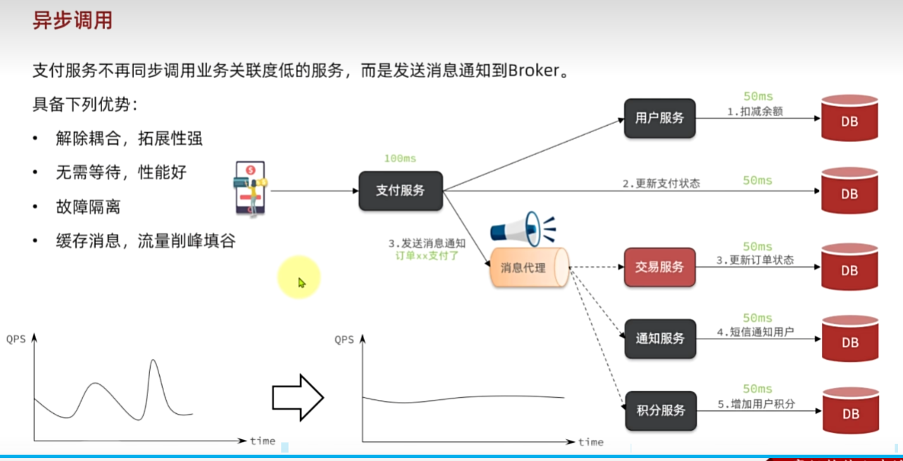
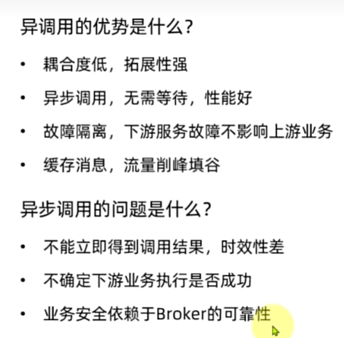
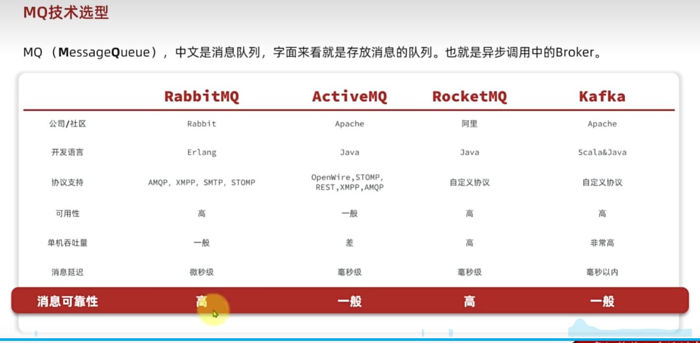
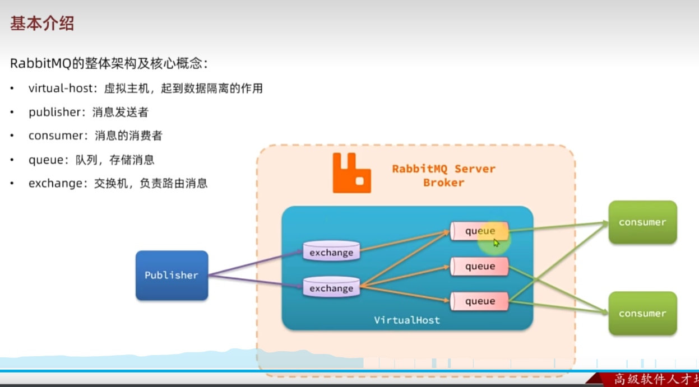
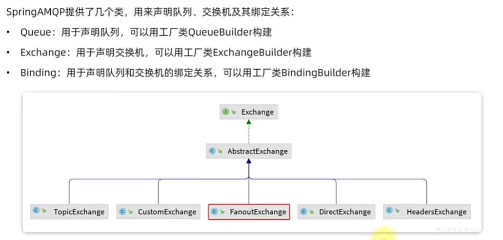

# 消息队列

## 消息队列的好处/对系统的用处

1. 异步处理：用户请求写入消息队列之后就可以立即返回给用户，后续业务逻辑异步执行，比如成功了再给用户发出票成功的短信通知。
2. 削峰/限流：短时间高并发的请求先放在消息队列中，后端服务慢慢消费。
3. 降低系统耦合性：**生产者和消费者之间没有直接耦合。而且发布订阅模式，还方便后续拓展，同一个消息增加消费者/订阅者即可**，比如订单消息本来是财务服务消费，后续库存服务也可以订阅。
4. 分布式事务解决方案：RocketMQ事务消息（半消息 + Broker回查事务是否成功）
5. 顺序保证：顺序保证是因为队列先进先出的数据结构，因此单消费者单队列就能保证；但是如果消息很多的话，就需要多消费者多队列，可以把消息分类到多个队列中，以IOT采集能源消费计算growth为例，按照设备id分队列，然后消费。

   ```
   采集网关 / 接入服务集群
           ↓
      deviceId hash 分区
           ↓
   RabbitMQ Cluster
    ┌──────────────┬──────────────┬──────────────┐
    │ Node A       │ Node B       │ Node C       │
    │ queue.00     │ queue.11     │ queue.22     │
    │ queue.01     │ queue.12     │ queue.23     │
    └──────┬───────┴──────┬───────┴──────┬───────┘
           ↓              ↓              ↓
    消费者组A         消费者组B         消费者组C
           ↓
   原始数据表 / 时序库 / Redis / 聚合表
   ```

   如果只是要求“最终数据按照采集时间查询时是有序的”，而不是严格要求“入库动作顺序发生”，可以先把电表累计值/原始值入库，然后安排异步任务按照采集时间进行计算，计算出growth。

6. 即时通讯 MQTT适合IOT等低带宽、高延迟网络环境下工作，又很轻量。
7. 数据流处理：使用消息队列作为实时数据总线，给各个服务使用，如Kafka适合高吞吐的分布式日志系统。

## 消息队列服务宕机了怎么避免消费丢失？

1. 把成功发送的消息存在生产者服务器上，等消息被消费后才删除。

## MQ的概念 消息队列

1. 异步通信

2. 异步调用的优劣势

## MQ 的技术选型

1.

## RabbitMQ的架构

1. exchange交换机只负责路由、分发消息，本身不储存消息，所有一个交换机如果没有bind绑定队列，发布给这个交换机的消息就会丢失
2. 一个交换机可以绑定多个队列。
3. Virtual-host虚拟主机，rabbitMQ吞吐量够，有些小公司，同一个公司所有项目用一套MQ就行了，但是为了**数据隔离**，不同的项目用不同的virtual-host，类似于MySQL分不同的database
   

### RabbitMQ和Kafka区别

1. Kafka 中“流式”的含义是指系统持续不断地产生实时数据流，例如日志流、IoT 设备采集流、用户行为流、监控指标流等。Kafka 更像一个分布式实时日志平台，用于持续接收、存储（**它接收之后会把数据存在本地，并且还能消息重放**）和传输**海量实时数据、大数据**。
2. Kafka吞吐量更大、消息保留7天以上、可重放，可用于比如实时点赞等场景。

## AMQP协议与Spring AMQP

1. RabbitMQ是基于AMQP,Advanced Message Queuing
   Protocol协议的,是用于在应用程序之间传递业务消息的开放标准。该协议与语言和平台无关，更符合微服务中独立性的要求。
2. Spring
   AMQP是基于AQMP协议定义的API规范，提供了模板来发送和接收消息。包含两部分：

   (1). spring-amqp是基础抽象；

   (2). spring-rabbit是底层的默认实现。

### Rabbit核心组件 = Producer + Exchange + Queue + Binding + RoutingKey + Consumer + Broker

1. 消息路径：

   ```
    Producer → Exchange → Queue → Consumer
   ```

#### Producer生产者 和Consumer消费者

1. 生产者生产的消息 = 消息头 + 消息体
2. 消息头MessageProperties里面存的不是RoutingKey，RoutingKey是发送的时候的参数。MessageProperties中包含（看一下前几个就行）：

| 字段                 | 类型               | 作用                                                                    | 是否常用   | 举例                  |
| -------------------- | ------------------ | ----------------------------------------------------------------------- | ---------- | --------------------- |
| `messageId`          | String             | **消息唯一ID，用于幂等、去重**                                          | ⭐⭐⭐⭐⭐ | `msg-10001`           |
| `deliveryMode`       | Integer            | **是否持久化**                                                          | ⭐⭐⭐⭐⭐ | `2=持久化`            |
| `expiration`         | String             | **TTL过期时间(ms)**                                                     | ⭐⭐⭐⭐   | `60000`               |
| `deliveryTag`        | long               | **RabbitMQ投递编号**                                                    | ⭐⭐⭐⭐⭐ | **ACK用**             |
| `headers`            | Map<String,Object> | **自定义Header**,可以用于用于保存 traceId、重试次数、来源服务等扩展信息 | ⭐⭐⭐⭐⭐ | retry-count/source    |
| `correlationId`      | String             | 请求/响应关联ID，链路追踪                                               | ⭐⭐⭐⭐   | RPC请求关联           |
| `contentType`        | String             | 消息内容类型                                                            | ⭐⭐⭐     | `application/json`    |
| `contentEncoding`    | String             | 编码格式                                                                | ⭐⭐       | `UTF-8`               |
| `timestamp`          | Date               | 消息发送时间                                                            | ⭐⭐⭐     | `2026-05-28 10:00:00` |
| `priority`           | Integer            | 消息优先级                                                              | ⭐⭐       | `0~255`               |
| `replyTo`            | String             | RPC回复队列                                                             | ⭐⭐       | `reply.queue`         |
| `type`               | String             | 消息类型标识                                                            | ⭐⭐       | `order.created`       |
| `userId`             | String             | 发送用户ID                                                              | ⭐         | `system-user`         |
| `appId`              | String             | 应用ID                                                                  | ⭐⭐       | `order-service`       |
| `clusterId`          | String             | 集群ID                                                                  | ⭐         | 很少用                |
| `receivedExchange`   | String             | 消费时收到的Exchange                                                    | ⭐⭐⭐     | `order.exchange`      |
| `receivedRoutingKey` | String             | 消费时收到的RoutingKey                                                  | ⭐⭐⭐     | `order.created`       |
| `consumerQueue`      | String             | 当前消费队列                                                            | ⭐⭐⭐     | `stock.queue`         |
| `redelivered`        | boolean            | 是否重复投递                                                            | ⭐⭐⭐⭐   | true/false            |
| `receivedDelay`      | Long               | 延迟消息时间                                                            | ⭐⭐       | 延迟插件使用          |

1. 消息头和消息体都可以被消费，比如用messageId做幂等

   ```java
   @RabbitListener(queues = "stock.queue")
   public void consume(Message message) {

    MessageProperties props =
            message.getMessageProperties();

    String messageId = props.getMessageId();

    String routingKey =
            props.getReceivedRoutingKey();

    Boolean redelivered =
            props.getRedelivered();

    Object traceId =
            props.getHeaders().get("traceId");

    System.out.println(messageId);
   }
   ```

#### Exchange

1. **Exchange交换器负责把消息分配到对应的Queue中。通过BindingKey把Exchange和Queue绑定Binding。Producer发送消息时会指定RoutingKey，RoutingKey跟BindingKey匹配上时消息就会被路由到对应队列中**。路由过程如下：

   ```
        Producer
            ↓
        发送：
        Exchange + RoutingKey + Message
                                    ├─ MessageProperties（消息头/属性）
                                    └─ Body（消息体）
        Exchange
            ↓
        遍历所有 Binding

        判断：
        RoutingKey 是否匹配 BindingKey

        匹配成功：
        投递 Queue
   ```

2. Exchange有四种类型，对应四种路由策略：

   (1). direct 直连模式：RoutingKey和BingdingKey精准匹配上才路由到对应队列

   (2).
   fanout 广播模式：把发送到该Exchange的所有消息**路由到所有绑定的队列中，不做筛选匹配，性能最高**

   (3). topic 主题模式：可以使用 \* 或 # 进行模糊匹配，匹配到的都可以路由。
   - `*`
     **必须匹配上一个单词才行**，例如 energy.\* 可以匹配 energy.water、energy.gas，但不能匹配 energy.electric.device001，因为energy.electric.device001有两个单词；

   - `#` 可以匹配
     **0 个**或多个单词，例如**energy.# 可以匹配 energy**、energy.electric、energy.electric.device001 等所有以 energy 开头的 RoutingKey。

   (4). headers,
   **不使用RoutingKey匹配，根据消息头中的headers中的键值对进行匹配**，支持两种模式，x-match
   = all全部键值对都匹配才行 和 x-match =
   any任意一个匹配上就行，**性能差、不能做层级路由、实际用得很少、不推荐**:

   ```
    // 生产者
   headers.put("type", "electric");
   headers.put("region", "cn");
   headers.put("level", "vip");
   ```

#### Queue 消息队列

1. 竞争消费：多个消费者绑定同一个队列，一条消息只会被一个消费者消费，不会重复消费。默认是轮询分摊消费，实际受到perfetch_count影响。
2. perfetch_count是允许RabbitMQ最多提前推送多少条“还没ACK”的消息给消费者。不设置的话RabbitMQ会尽量多的推送。一般设置的>=1。
3. 如果想重复消费，比如一个订单消息同时让财务服务、库存服务、物流服务消费，就同一个Exchange绑定多个不同队列，那同一条消息就会被复制给每个队列。这就是**发布订阅**模式。
4. 如果财务服务、库存服务、物流服务之间存在操作的先后顺序，比如完成财务扣费之后才能扣减库存，单纯的发布订阅不能满足，因为各个微服务之间是操作是解耦的。要使用**基于事件驱动的分布式事务链（**saga**思想），就是每个服务完成自己的本地事务之后通过MQ事件驱动下一步，并且每一个本地步骤都有补偿事件，达到最终一致**。

   ```
   订单服务创建订单成功
      ↓
   发布 order.created 事件(发送MQ消息到对应队列)
      ↓
   财务服务消费 order.created，生成账单/扣款
      ↓
   财务成功后发布 payment.success 事件 (发送MQ消息到对应队列)
      ↓
   库存服务消费 payment.success，扣减库存
      ↓
   库存成功后发布 stock.deduct.success 事件 (发送MQ消息到对应队列)
      ↓
   积分服务消费 stock.deduct.success，增加积分
   ```

   **事件驱动分布式事务链 = 本地事务 +
   MQ事件 + 下游消费 + 状态机维护+ 每个阶段的失败补偿 + 幂等重试，实现最终一致性。**

   如果链路很长，复杂业务流程用Seata
   Saga中间件（上面是手动实现的Saga，每个服务自己找下一个服务，用中间件就是加了一个协调器，中间件自己记录全局事务、做日志、补偿等）；强一致核心链路考虑 TCC/Seata；非核心通知继续用 MQ。

#### Broker

1. 一个Broker就是RabbitMQ服务实例。

### RabbitMQ的工作模式

1. 工作模式和Exchange路由策略是两个东西。

| 工作模式                   | Queue数量                                   | Consumer数量            | 一条消息会被几个Consumer处理 | 是否重复消费（广播）   | 默认/常用Exchange              | 其他可实现Exchange |
| -------------------------- | ------------------------------------------- | ----------------------- | ---------------------------- | ---------------------- | ------------------------------ | ------------------ |
| Simple Queue 简单模式      | **1**                                       | 1                       | 1个                          | 否                     | **Direct（因为只有一个队列）** | -                  |
| Work Queue 工作队列        | **1**                                       | **多个且竞争消费**      | 1个                          | 否                     | **Direct（因为只有一个队列）** | -                  |
| Publish/Subscribe 发布订阅 | 多个                                        | 每个Queue可多个Consumer | **每个Queue都会收到一份**    | 是                     | Fanout                         | Topic、Direct      |
| Routing 路由模式           | 多个，**多个Queue可以绑定同一个BindingKey** | 每个Queue可多个Consumer | 匹配上的的Queue收到          | 匹配给多个队列了就是   | Direct                         | -                  |
| Topic 主题模式             | 多个                                        | 每个Queue可多个Consumer | 匹配上的的Queue收到          | 是匹配给多个队列了就是 | Topic                          | -                  |

### RabbitMQ通过Channel传输数据

1. **RabbitMQ
   Channel信道是在一个TCP连接内部复用出来的逻辑通信通道(建立在TCP链接上的虚拟链接)**。因为每次发消息都新建TCP连接要消耗很多资源。

2. **一个TCP连接可以承载多个Channel。RabbitMQ的所有操作（发送消息、消费消息、ACK等）都是通过Channel完成**。

   ```
   Connection(TCP)
      ├── Channel1
      ├── Channel2
      ├── Channel3
      └── Channel4
   ```

   ```
    channel.basicPublish(...)
    channel.basicConsume(...)
    channel.basicAck(...)
   ```

3. **Channel线程不安全，使用时一个线程一个Channel。**

## Spring AMQP开发

### 基于@Bean 声明交换机、队列、绑定

1. 在java代码里声明队列、交换机及其绑定关系，而不是在RabbitMQ控制台里手动新建队列等。
   
2. 在配置类中声明交换机、队列、绑定。**多个交换机、多个队列、对应多个绑定关系，都可以在RabbitMqDemoConfig中对应写多个方法进行注册声明**。

   不同类型的Exchange有对应的类。

   ```java
   @EnableRabbit // 向 Spring 容器注册 RabbitMQ 注解处理器，让Spring能够识别@RabbitListener注解，跟下面的@Bean声明队列、交换机等没什么关系。
   @Configuration
   public class RabbitMqDemoConfig {

       public static final String EXCHANGE_NAME = "energy.exchange";
       public static final String QUEUE_NAME = "energy.collect.queue";
       public static final String ROUTING_KEY = "energy.collect";

       @Bean
       public DirectExchange energyExchange() {
           return new DirectExchange(EXCHANGE_NAME, true, false);
       }

       @Bean
       public Queue energyQueue() {
           return QueueBuilder.durable(QUEUE_NAME).build();
       }

       @Bean
       public Binding energyBinding() {
           return BindingBuilder
                   .bind(energyQueue())
                   .to(energyExchange())
                   .with(ROUTING_KEY);
       }

       ...

       @Bean
       public FanoutExchange rabbitMqDemoOrderFanoutExchange() {
           // Fanout Exchange 会把消息广播给所有绑定到它的队列。
           return new FanoutExchange(ORDER_FANOUT_EXCHANGE, false, false);
       }

       //此处忽略该交换机对应的队列和绑定关系的声明
       ...

       @Bean
       public TopicExchange rabbitMqDemoOrderTopicExchange() {
           // Topic Exchange 支持通配符路由：* 匹配一个单词，# 匹配零个或多个单词。
           return new TopicExchange(ORDER_TOPIC_EXCHANGE, false, false);
       }
       //此处忽略该交换机对应的队列和绑定关系的声明
       ...

       @Bean
       public HeadersExchange rabbitMqDemoOrderHeadersExchange() {
           // Headers Exchange 根据消息头匹配，RoutingKey 通常会被忽略。
           return new HeadersExchange(ORDER_HEADERS_EXCHANGE, false, false);
       }
       //此处忽略该交换机对应的队列和绑定关系的声明

       ...

       // 消息转换器
       /**
        * Jackson2JsonMessageConverter Bean：使用 jackson 序列化消息
        */
       @Bean
       public MessageConverter createMessageConverter() {
           return new Jackson2JsonMessageConverter();
       }
   }

   ```

### 基于注解声明交换机、队列、绑定（了解即可）

1. 就是在@RabbitListener注册消费者时，通过@QueueBinding(...)把交换机、队列、绑定关系注册掉，就不需要像上面一样单独使用配置类声明交换机、队列、绑定关系了。 ==> 代码可读性不好，不方便集中管理，不推荐

   ```java
   package com.itheima.rabbitmq.consumer;

   import lombok.extern.slf4j.Slf4j;
   import org.springframework.amqp.core.ExchangeTypes;
   import org.springframework.amqp.rabbit.annotation.Exchange;
   import org.springframework.amqp.rabbit.annotation.Queue;
   import org.springframework.amqp.rabbit.annotation.QueueBinding;
   import org.springframework.amqp.rabbit.annotation.RabbitListener;
   import org.springframework.stereotype.Component;

   @Slf4j
   @Component
   public class SpringRabbitListener {
       @RabbitListener(bindings = @QueueBinding(
               value = @Queue(name = "direct.queue2", durable = "true"),
               exchange = @Exchange(name = "hmall.dirext", type = ExchangeTypes.DIRECT),
               key = {"red", "yellow"}

       ))
       public void listenDirectQueue(String message) {
           log.info("消费者监听到direct.queue的消息：【{}】", message);
       }
   }

   ```

### ok下面写的是已经通过RabbitMqDemoConfig注册完交换机、队列、绑定关系了

#### 生产者

1. 生产者 通过 import org.springframework.amqp.rabbit.core.RabbitTemplate
   **的rabbitTemplate.convertAndSend**(...)方法发送消息。

   ```java

   package com.xb.xsf.module.basic.rabbitmqdemo.producer;

   import com.xb.xsf.module.basic.rabbitmqdemo.config.RabbitMqDemoConfig;
   import com.xb.xsf.module.basic.rabbitmqdemo.message.OrderCreatedMessage;
   import org.slf4j.Logger;
   import org.slf4j.LoggerFactory;
   import org.springframework.amqp.rabbit.core.RabbitTemplate;
   import org.springframework.stereotype.Component;

   /**
    * V1：订单消息生产者。
    */
   @Component
   public class OrderProducer {

       // 创建日志对象，方便观察生产者发送行为。
       private static final Logger log = LoggerFactory.getLogger(OrderProducer.class);

       // RabbitTemplate 是 Spring AMQP 提供的消息发送核心 API。
       private final RabbitTemplate rabbitTemplate;

       public OrderProducer(RabbitTemplate rabbitTemplate) {
           // 通过构造方法注入 RabbitTemplate，便于测试，也避免字段注入。
           this.rabbitTemplate = rabbitTemplate;
       }

       public void sendOrderCreatedMessage(OrderCreatedMessage message) {
           // 记录即将发送的消息，便于本地验证和排查。
           log.info("准备发送订单创建消息: {}", message);
           // convertAndSend 会先用 MessageConverter 把 Java 对象转成 Message。
           // 第一个参数是 Exchange 名称，表示消息先进入哪个交换机。
           // 第二个参数是 RoutingKey，Direct Exchange 会用它精确匹配 Binding。
           // 第三个参数是消息体，V1 传入的是订单创建业务对象。
           rabbitTemplate.convertAndSend(
                   RabbitMqDemoConfig.ORDER_DIRECT_EXCHANGE,
                   RabbitMqDemoConfig.ORDER_CREATED_ROUTING_KEY,
                   message
           );
           // V1 没有 Publisher Confirm，所以这里只代表客户端调用完成，不代表 Broker 一定收到。
           log.info("RabbitTemplate 调用完成，V1 暂不确认消息是否真正到达 Broker");
       }

       // 生产消息时设置headers
       public void sendTopicOrderMessage(RabbitMqMessage<OrderCreatedMessage> message, String routingKey) {
           // 记录 Topic 消息和 RoutingKey，方便观察不同 BindingKey 的匹配结果。
           log.info("[Topic] 准备发送统一订单消息: routingKey={}, body={}", routingKey, message);
           // Topic Exchange 使用 routingKey 做通配符匹配，Header 只是辅助追踪和排查。
           rabbitTemplate.convertAndSend(
                   RabbitMqDemoConfig.ORDER_TOPIC_EXCHANGE,
                   routingKey,
                   message,

                   // MessagePostProcessor
                   amqpMessage -> {
                        MessageProperties properties = amqpMessage.getMessageProperties();

                        properties.setMessageId(body.getMessageId());
                        properties.setHeader("traceId", body.getTraceId());
                        properties.setHeader("eventType", body.getEventType());

                        return amqpMessage;
                    }
           );
           // V3 仍然不确认消息是否到达 Exchange，这会在 V4 处理。
           log.info("[Topic] RabbitTemplate 调用完成，messageId={}", message.getMessageId());
       }
   }

   ```

#### 消费者

1. 消费者通过@RabbitListener监听并消费消息

   ```java
   package com.xb.xsf.module.basic.rabbitmqdemo.consumer;

   import com.xb.xsf.module.basic.rabbitmqdemo.config.RabbitMqDemoConfig;
   import com.xb.xsf.module.basic.rabbitmqdemo.message.OrderCreatedMessage;
   import org.slf4j.Logger;
   import org.slf4j.LoggerFactory;
   import org.springframework.amqp.rabbit.annotation.RabbitListener;
   import org.springframework.stereotype.Component;

   /**
    * V1：订单消息消费者。
    */
   @Component
   public class OrderConsumer {

       // 创建日志对象，方便观察消费者消费行为。
       private static final Logger log = LoggerFactory.getLogger(OrderConsumer.class);

       @RabbitListener(queues = RabbitMqDemoConfig.ORDER_CREATED_QUEUE)
       public void onOrderCreated(OrderCreatedMessage message) {
           // @RabbitListener 会创建监听容器，持续监听指定队列。
           // 方法参数会由 MessageConverter 从 JSON 自动反序列化为 Java 对象。
           log.info("收到订单创建消息: {}", message);
           // V1 使用 acknowledge-mode=auto，方法正常返回后 Spring 会自动 ACK。
           // 如果这里抛出异常，自动 ACK 模式下的失败处理策略会在后续版本再深入讲解。
           log.info("模拟处理订单创建事件完成，orderId={}", message.getOrderId());
       }
   }

   ```

2. 多个生产者可以在一个生产者类中写多个发送消息的方法，也可以拆分成多个生产者类；
3. 多个消费者可以在一个消费者类中写多个带@RabbitListener的方法，也可以拆分成多个消费者类。

### 消息转换器

1. 为什么需要消息转换器：RabbitMQ只能传输byte[], 因此需要消息转换器实现Java对象和byte[]之间的序列化与反序列化。

   ```
   Java对象
       ↓
   MessageConverter
       ↓
   Message(byte[])
       ↓
   RabbitMQ
       ↓
   Message(byte[])
       ↓
   MessageConverter
       ↓
   Java对象
   ```

### 设置和消费消息头 headers

1. 生产消息的时候，在Java对象被转换成AMQP
   Message对象之后，才能使用AMQP的Message的getMessageProperties()方法，进行set
   headers。

   ```
   RabbitMqMessage Java对象
           ↓ convertAndSend 内部转换
   AMQP Message
           ↓ 才有 MessageProperties
   发送到 RabbitMQ
   ```

2. 所以生产者需要使用 rebbitTemplate.convertAndSend(String exchange, String
   routingKey, final Object message,final MessagePostProcessor
   messagePostProcessor) 方法，设置headers。其中 MessagePostProcessor 是一个函数式接口。

3. **不使用MessagePostProcessor是拿不到AMQP 的Message对象的**，你只有代码里自己写的java对象。
