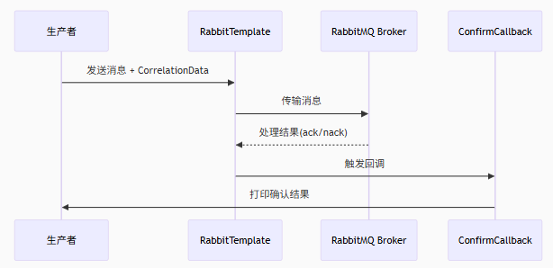

## MQ的概念 消息队列

1. 异步通信

2. 异步调用的优劣势

## MQ 的技术选型

1.

## RabbitMQ的架构

1. exchange交换机只负责路由、分发消息，本身不储存消息，所有一个交换机如果没有bind绑定队列，发布给这个交换机的消息就会丢失
2. 一个交换机可以绑定多个队列。
3. Virtual-host虚拟主机，rabbitMQ吞吐量够，有些小公司，同一个公司所有项目用一套MQ就行了，但是为了**数据隔离**，不同的项目用不同的virtual-host，类似于MySQL分不同的database
   

## AMQP协议与Spring AMQP

1. RabbitMQ是基于AMQP,Advanced Message Queuing Protocol协议的,是用于在应用程序之间传递业务消息的开放标准。该协议与语言和平台无关，更符合微服务中独立性的要求。
2. Spring AMQP是基于AQMP协议定义的API规范，提供了模板来发送和接收消息。包含两部分：

   (1). spring-amqp是基础抽象；

   (2). spring-rabbit是底层的默认实现。

## Spring AMQP注解开发

1. rabbitTemplate.convertAndSend();
2. @RabbitListener
3. 在java代码里声明队列、交换机及其绑定关系，而不是在RabbitMQ控制台里手动新建队列等。通常在消费者那一端声明。

4. 使用@Bean在配置类中声明

```java
package com.itheima.config;

import org.springframework.amqp.core.*;
import org.springframework.amqp.rabbit.connection.ConnectionFactory;
import org.springframework.amqp.rabbit.core.RabbitAdmin;
import org.springframework.context.annotation.Bean;
import org.springframework.context.annotation.Configuration;

@Configuration
public class FanoutConfiguration {

    @Bean
    public Declarables fanoutBindings() {
        FanoutExchange exchange = new FanoutExchange("test222.fanout", true, false);
        Queue queue1 = new Queue("fanout.queue1222", true);

        return new Declarables(
                exchange,
                queue1,
                BindingBuilder.bind(queue1).to(exchange)
        );
    }

    @Bean
    public RabbitAdmin rabbitAdmin(ConnectionFactory connectionFactory) {
        return new RabbitAdmin(connectionFactory);
    }
}

```

5. 在消费者类中使用注解声明绑定关系

```java
package com.itheima.rabbitmq.consumer;

import lombok.extern.slf4j.Slf4j;
import org.springframework.amqp.core.ExchangeTypes;
import org.springframework.amqp.rabbit.annotation.Exchange;
import org.springframework.amqp.rabbit.annotation.Queue;
import org.springframework.amqp.rabbit.annotation.QueueBinding;
import org.springframework.amqp.rabbit.annotation.RabbitListener;
import org.springframework.stereotype.Component;

@Slf4j
@Component
public class SpringRabbitListener {
    @RabbitListener(bindings = @QueueBinding(
            value = @Queue(name = "direct.queue2", durable = "true"),
            exchange = @Exchange(name = "hmall.dirext", type = ExchangeTypes.DIRECT),
            key = {"red", "yellow"}

    ))
    public void listenDirectQueue(String message) {
        log.info("消费者监听到direct.queue的消息：【{}】", message);
    }
}

```

## RabbitMQ的几种工作模式

## 消息转换器
