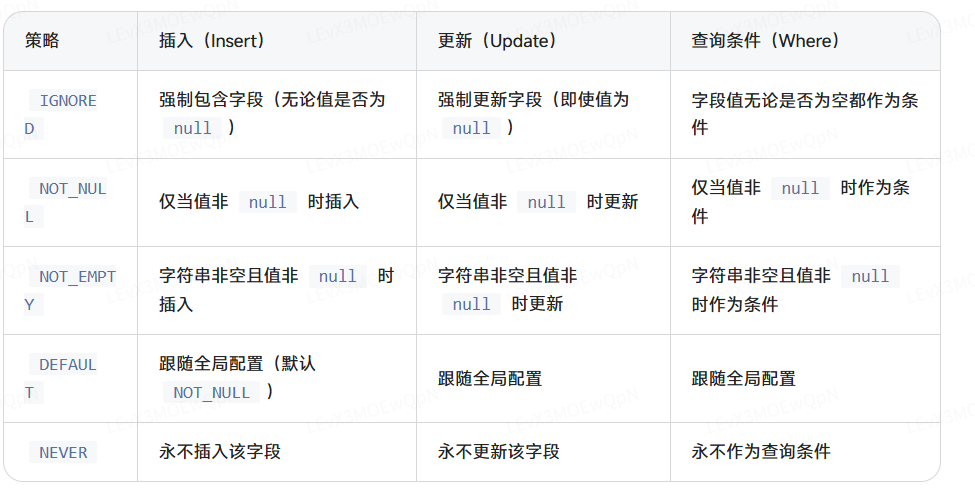
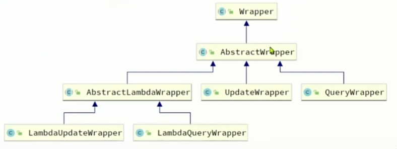
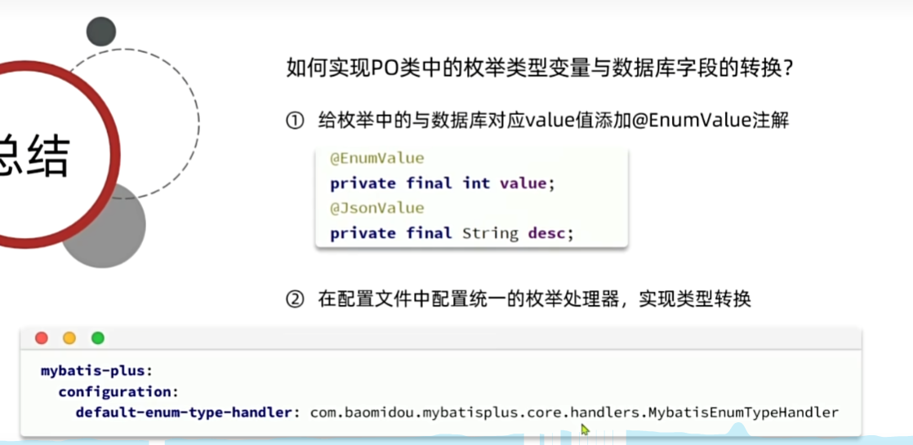
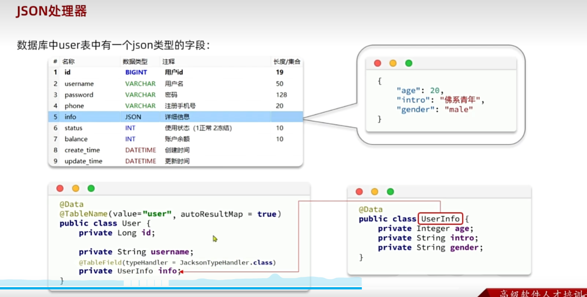

1. 官方文档<https://www.baomidou.com/reference/annotation/#insertstrategy>

## 入门使用

1. 与JPA类似，采用的是实体的映射：

   (1). 新建实体;

   ```java
    package com.itheima.Entity;
    
    import com.baomidou.mybatisplus.annotation.TableField;
    import com.baomidou.mybatisplus.annotation.TableId;
    import com.baomidou.mybatisplus.annotation.TableLogic;
    import com.baomidou.mybatisplus.annotation.TableName;
    import lombok.Data;
    
    @Data
    @TableName("`user1`")
    public class User {
        @TableId
        private Long id;
        @TableField
        private String name;
        @TableLogic
        private Integer age;
        private String email;
    }
   ```

   (2). 新建Mapper并且继承com.baomidou.mybatisplus.core.mapper.BaseMapper;

   ```java

    package com.itheima.mapper;

    import com.baomidou.mybatisplus.core.mapper.BaseMapper;
    import com.itheima.Entity.User;
    import org.apache.ibatis.annotations.Mapper;

    @Mapper
    public interface UserMapper extends BaseMapper<User> {
    
    }

   ```

   (3). 启动类使用@MapperScan注解，指明mapper所在的package

   ```java
    package com.itheima;
    
    import org.mybatis.spring.annotation.MapperScan;
    import org.springframework.boot.SpringApplication;
    import org.springframework.boot.autoconfigure.    SpringBootApplication;
    import org.springframework.boot.web.servlet.ServletComponentScan;
    
    @MapperScan("com.itheima.mapper")
    
    @ServletComponentScan // 开启了对servlet组件的支持。
    @SpringBootApplication // 启动类，用于启动spring工程
    public class SpringbootWebQuickstartApplication {
    
     public static void main(String[] args) {
      SpringApplication.run(SpringbootWebQuickstartApplication.   class, args);
     }
    
    }

   ```

2. MybatisPlus的实体上常用的注解@TableName指明数据库表名，@TableId指明主键id字段，@TableField指明普通字段，@TableField在以下情况下使用：

   (1). 实体字段名与数据库表字段名不一致；

   (2). 实体字段is开头且是布尔值 ==> 映射时会把is去掉，要手动指定数据库表字段；

   (3). 实体字段无需被映射到数据库表字段，@TableField(exist = false)

3. FieldStrategy 如果user表有name字段，本来一条数据的name值是张三，在跟新的时候set了实体的其他字段，对name字段没有set，那么这条数据的其他字段会被更新，name字段的值不变。

   ```java
    User user = userMapper.selectById(1); // name="张三"

    // 只更新其他字段，不处理 name
    user.setAge(25);
    user.setEmail("new@email.com");
    userMapper.updateById(user);
   ```

   对应生成的SQL语句如下：

   ```java
    UPDATE user SET age=25, email='new@email.com' WHERE id=1
   ```

## 条件构造器 ==> 用于构造查询条件



1. Wrapper类允许开发者以**链式调用**的方式构造查询条件。
2. AbstractWrapper抽象类，定义了where语句对应的条件；
3. QueryWrapper类在AbstractWrapper类的基础上构造select查询条件；
4. UpdateWrapper类在AbstractWrapper类的基础上构造set更新条件；
5. Lambda相关的Wrapper就是用Lambda表达式构造查询条件，**通过Lambda表达式来引用实体类的属性**，从而**避免了硬编码字段名**，提高代码的可读性和维护性。

   ```java
   //不用LambdaWrapper，要硬编码数据库字段"id"
    query().eq("id", value).one();

    // 用LambdaWrapper不需要硬编码
    lambdaQuery().eq(Entity::getId, value).one();
   ```

## 自定义SQL

## 逻辑删除

1. MP可以通过配置自动实现逻辑删除

## 枚举

1. @EnumValue注解，@JsonValue注解决定VO返回枚举类型时返回哪个值；
2. 配置

## JSON处理器，用于在数据库中保存JSON格式的字段



## 分页等插件

1. 基于拦截器拦截SQL，把SQL改成对应的分页语法。需要指定DbType.MYSQL数据源类型是mysql，因为不同的数据库分页的sql语法不一样。
2. **todo**:使用MybatisPlus时跨数据库兼容性跟JPA相比

```java
您观察得很准确，MyBatis-Plus 和 JPA（Hibernate）的分页机制在数据库兼容性上确实存在差异，但两者的设计哲学和实现方式不同。以下是详细对比分析：

一、MyBatis-Plus 分页插件的数据库兼容性
特点：
显式依赖数据库类型
需要明确指定 DbType（如 DbType.MYSQL），否则会生成错误的分页 SQL。

底层原理
通过拦截 SQL 并 重写分页语句，不同数据库的分页语法差异需要手动配置。

优缺点

✅ 灵活性高，可针对特定数据库优化

❌ 切换数据库需修改配置（或动态检测）

示例：
java
// 必须明确指定或动态检测数据库类型
new PaginationInnerInterceptor(DbType.MYSQL);
二、JPA（Hibernate）的分页兼容性
特点：
数据库方言（Dialect）自动适配
Hibernate 通过 Dialect 抽象不同数据库的 SQL 差异，开发者无需关心底层分页语法。

底层原理

根据连接的数据源自动选择对应的 Dialect

生成符合当前数据库的分页 SQL（如 MySQL 的 LIMIT、Oracle 的 ROWNUM）

优缺点

✅ 开箱即用的跨数据库兼容性

❌ 复杂分页场景可能不如 MyBatis-Plus 灵活

示例：
java
// Spring Data JPA 分页（无需指定数据库类型）
Page<User> page = userRepository.findAll(PageRequest.of(0, 10));
三、关键对比总结
特性 MyBatis-Plus JPA (Hibernate)
分页配置 需显式指定 DbType 自动通过 Dialect 适配
SQL 生成方式 拦截并重写原生 SQL 通过 HQL 抽象后转换
多数据库支持 需手动调整配置 开箱即用
复杂分页灵活性 更高（可自定义 SQL） 受限于 HQL 表达能力
典型使用场景 需要精细控制 SQL 的项目 快速开发、多数据库兼容需求高的项目
四、如何选择？
使用 MyBatis-Plus 时：
单数据库项目：直接配置对应的 DbType

java
new PaginationInnerInterceptor(DbType.MYSQL);
多数据库项目：动态检测数据库类型

java
new PaginationInnerInterceptor(DbType.getDbType(dataSource));
使用 JPA 时：
无需特殊配置，但需确保：

正确配置了数据源（如 spring.datasource.url=jdbc:mysql://...）

Hibernate 能自动检测到对应的 Dialect

五、进阶建议
MyBatis-Plus 多数据源场景
每个数据源单独配置分页插件：

java
@Bean
public MybatisPlusInterceptor ds1Interceptor() {
    MybatisPlusInterceptor interceptor = new MybatisPlusInterceptor();
    interceptor.addInnerInterceptor(new PaginationInnerInterceptor(DbType.MYSQL));
    return interceptor;
}

@Bean
public MybatisPlusInterceptor ds2Interceptor() {
    MybatisPlusInterceptor interceptor = new MybatisPlusInterceptor();
    interceptor.addInnerInterceptor(new PaginationInnerInterceptor(DbType.ORACLE));
    return interceptor;
}
JPA 的方言覆盖
如需强制指定方言（如使用小众数据库）：

yaml
spring:
  jpa:
    properties:
      hibernate.dialect: org.hibernate.dialect.MySQL8Dialect
六、最终结论
JPA 在分页的数据库兼容性上确实优于 MyBatis-Plus，这是 ORM 框架的天然优势。

MyBatis-Plus 更适合需要深度控制 SQL 的场景，但需付出兼容性配置的成本。

如果项目需要频繁切换数据库，JPA 是更省心的选择；如果需要复杂分页优化，MyBatis-Plus 更灵活。
```

3. **同一个项目想使用不同的数据库，比如读和写分数据库，Mybatis和JPA分别能怎么实现？**

```java
package com.itheima.config;

import com.baomidou.mybatisplus.annotation.DbType;
import com.baomidou.mybatisplus.extension.plugins.MybatisPlusInterceptor;
import com.baomidou.mybatisplus.extension.plugins.inner.PaginationInnerInterceptor;
import org.mybatis.spring.annotation.MapperScan;
import org.springframework.context.annotation.Bean;
import org.springframework.context.annotation.Configuration;

@Configuration
@MapperScan("scan.your.mapper.package")
public class MybatisPlusConfig {

    /**
     * 添加分页插件
     */
    @Bean
    public MybatisPlusInterceptor mybatisPlusInterceptor() {
      //拦截器
        MybatisPlusInterceptor interceptor = new MybatisPlusInterceptor();
        //添加分页拦截器，这里要指定DbType.MYSQL数据源类型是mysql，因为不同的数据库分页的sql语法不一样。
        interceptor.addInnerInterceptor(new PaginationInnerInterceptor(DbType.MYSQL));
        return interceptor;
    }
}

```
