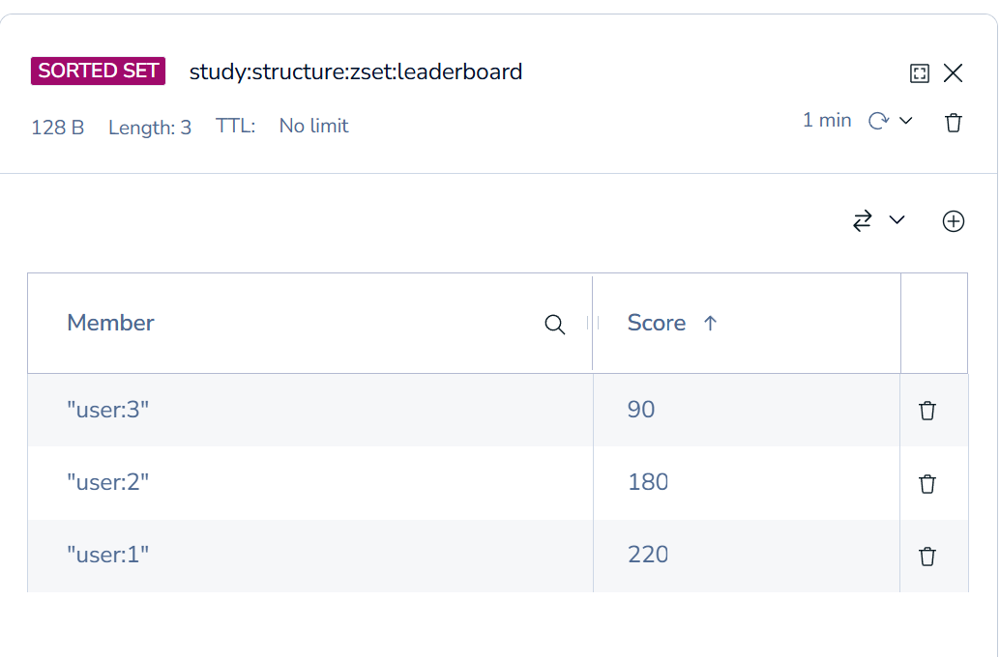
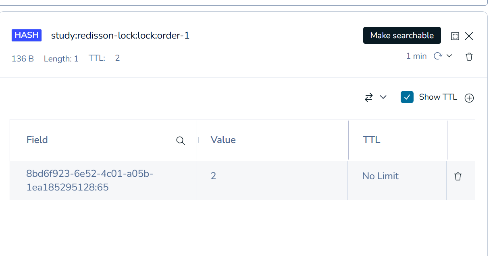
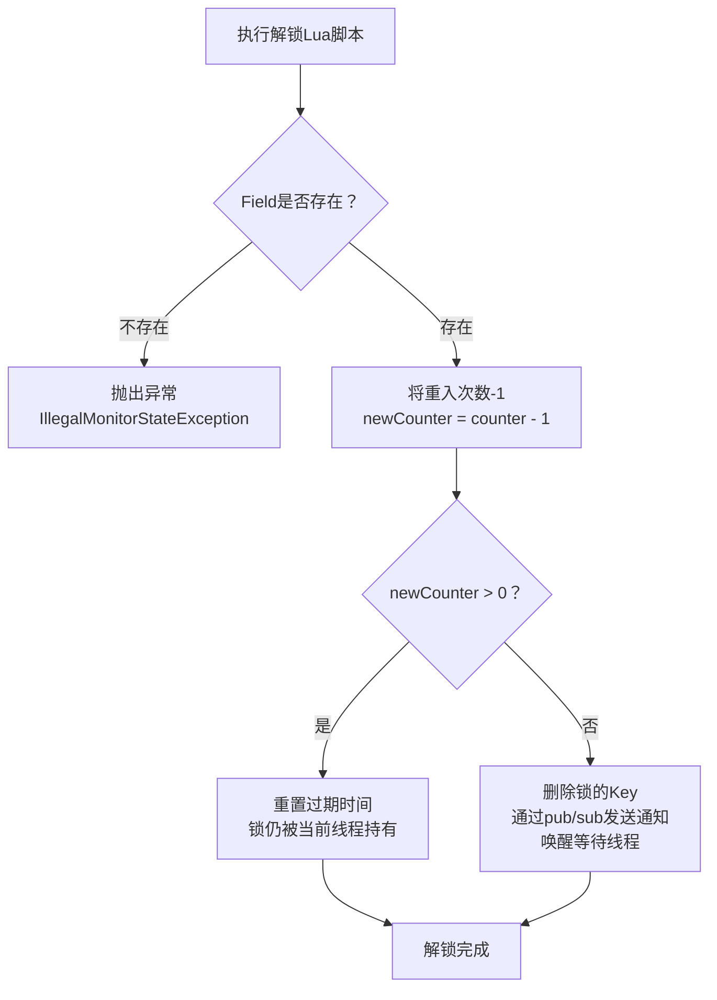
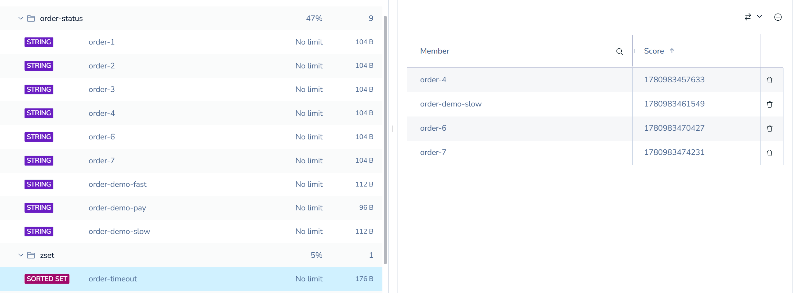
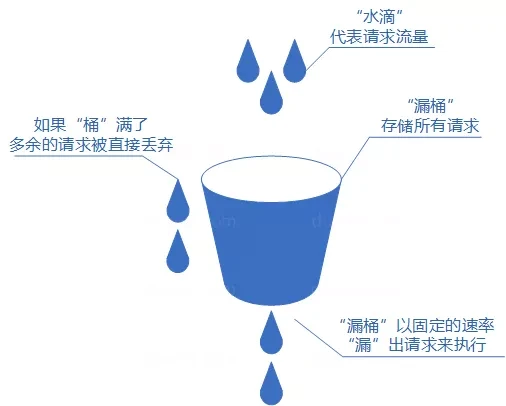
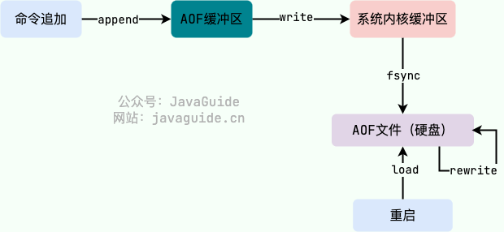

# 什么是Redis Remote Dictionary Server

1. Redis是NoSQL数据库 Not Only SQL
2. 使用键值对的形式存储数据。
3. Redis是为什么这么快？Redis是基于内存的，
4. 为什么不用Redis做主数据库？==》内存成本高、Redis提供的数据持久化有数据丢失的风险。

# NoSQL数据库和SQL数据库的关系

1. SQL是结构化、关系型数据库、使用SQL查询、支持ACID事务特性、磁盘存储、垂直扩展；
2. NoSQL是非结构化、非关系型数据库、非SQL查询、内存存储、水平扩展。

## NoSQL 对事务的支持

1. 并不是NoSQL就不支持事务，不同的NoSQL数据库对事务的支持不一样，不默认强调ACID而已：

   （1）.

2. redis key的分级存储 ==> 给key命名时用冒号分层，如heima:user:1, 就会形成文件夹
   

## Redis 中的数据类型

### String

1. String类型的value是字符串、int或者float类型。
2. 适合最基础的KV类型。
3. 如果是计数操作，比如点击增加网页浏览量，不要先get后set，高并发下可能会更新失败，应该使用INCR原子命令。

   ```java
    Long views = redisTemplate.opsForValue().increment(key);
   ```

   对应redis命令

   ```redis
    INCR study:structure:string:article:view:1
   ```

### Hash

1. Hash类型的key还是字符串，value是对象形式的，分为field和value，可以把对象中的每个字段独立存储。==> 在java中取出来是Map<String,Object>

   ```java
   // 修改key对应的value对象中的city属性值为Beijing。对应redis命令的HSET
   redisTemplate.opsForHash().put(key,"city","Beijing");
   ```

### List

1. List类型类似java中的LinkedList，是**双向链表**。List类型**插入顺序有序**、元素可以重复、插入和删除快、查询速度一般。
2. LPUSH在队头添加元素、RPUSH在队尾添加元素、LPOP移除并得到队头的元素、RPOP移除并得到队尾的元素； LSET
   key index value 设置指定索引index位置的值为value。

### Set

1. Set是**无序集合**，元素不能重复。
2. Set可以支持交集SINTER、并集SUNION、差集SDIFF(SDIFF key1
   key2 意思是属于key1但不属于key2)等功能，可以用来做好友列表等功能，或者用来打标签。

   ```java
   // SMEMBERS命令 获得集合中的所有元素
   Set<Object> members = redisTemplate.opsForSet().members(key);
   ```

   ```
    SINTER key1 key2 ...   # 交集
    SUNION key1 key2 ...   # 并集
    SDIFF key1 key2 ...    # 差集：key1 - key2 - ...
   ```

### ZSet/SortedSet

1. SortedSet是一个可排序的set集合，底层基于跳表SkipList加hash表，**每个元素都有score属性，可基于score属性对元素排序**。 ==> 可用来实现排行榜功能，查询速度快。
   

   ```java
   // ZINCRBY key increment member 给这个key的member成员的score增加increment大小的值
   Double currentScore = redisTemplate.opsForZSet().incrementScore(ZSET_LEADERBOARD_KEY, member, increment);

   // ZREVRANGE key start end 获取指定有序集合 start 和 end 之间的元素（score 从高到底）
   Set<ZSetOperations.TypedTuple<Object>> tuples = redisTemplate.opsForZSet()
                .reverseRangeWithScores(ZSET_LEADERBOARD_KEY, 0, limit - 1);
   ```

## Redis客户端

### Jedis

1. 缺点：线程不安全 多线程需要使用线程池，JedisPool
2. 优点：命令跟redis原生命令同名。

### lettuce

1. 线程安全，且支持同步、异步、响应式编程，支持redis哨兵模式、集群模式和管道模式。

### Redission

1. 基于Redis实现的分布式Java数据结构集合，有很多写好的支持分布式的方法和数据结构。

## redis集群和哨兵

1. 集群部署，在Redis配置文件里通过**slaveof**命令指定某个slave的master。
1. 哨兵是主从模式的，从都是主的备份而已。
1. 集群是把数据分配在多个redis的Master实例的哈希槽中，不是复制。同时每个master有自己的从复制版本slave，但是master和对应的slave不能放在同一个服务器，防止服务器崩溃之后这部分数据没有可用的了。
1. 哨兵是高可用；集群是高可用+分布式，方便横向扩展。
1. 哨兵模式的sentinel哨兵是跟redis服务实例不同的独立进行。如下一共6个进程，slave1和slave2都是master的副本。三个Sentinel用来自动完成：监控、故障检测、自动选主（failover）。

```
服务器A：Master + Sentinel
服务器B：Slave1 + Sentinel
服务器C：Slave2 + Sentinel
```

1. 集群模式

```
服务器A：Master1 + Slave3
服务器B：Master2 + Slave1
服务器C：Master3 + Slave2
```

### Redis Cluster 数据分片机制

1. 核心原理

```
slot = CRC16(key) % 16384
```

Redis 将数据映射到 16384 个 hash slot

1. 分配示例

```
Master1：0 - 5460
Master2：5461 - 10922
Master3：10923 - 16383
```

👉 数据只存在一个 Master 上

1. Slave 的作用

   不参与分片只负责复制 Master

```
Master1 ←→ Slave1
Master2 ←→ Slave2
Master3 ←→ Slave3
```

1. 写入流程

```
key → hash → slot
定位 master
写入 master
同步 slave
```

云服务的话买对应的服务即可 不用自己维护集群还是哨兵。

# StringRedisTemplate

1. 有get/set/delete/expire/ttl等命令。

   ```java
   ...import org.springframework.data.redis.core.  StringRedisTemplate;

   // 类里面
   private final StringRedisTemplate stringRedisTemplate;
   ...
   // 方法里面
   stringRedisTemplate.opsForValue().set(redisKey, value,   Duration.ofSeconds(ttlSeconds));

   private Long queryTtlSeconds(String redisKey) {
       // getExpire：查询 key 剩余过期时间。-1 表示永不过  期，-2 表示 key 不存在。
       return stringRedisTemplate.getExpire(redisKey,   TimeUnit.SECONDS);
   }
   ```

2. StringRedisTemplate = RedisTemplate<String,String>
3. RedisTemplate = RedisTemplate<K,V>
4. **StringRedisTemplate默认用new
   StringRedisSerializer()序列化，在Redis里 直接能读到字符串**；
5. **RedisTemplate默认时JDK的序列化，存在Redis里是乱码**（类似这种"\xac\xed\x00\x05sr..."），不可读还耗费空间，因此要用的话要设置序列化,key用StringRedisSerializer，value用Jackson2JsonRedisSerializer。

   ```java
   @Bean
   public RedisTemplate<String,Object> redisTemplate(
           RedisConnectionFactory factory){

       RedisTemplate<String,Object> template =
               new RedisTemplate<>();

       template.setConnectionFactory(factory);

       Jackson2JsonRedisSerializer<Object> serializer =
               new Jackson2JsonRedisSerializer<>(Object.class);

       template.setKeySerializer(
               new StringRedisSerializer());

       template.setValueSerializer(
               serializer);

       return template;
   }
   ```

6. Redis的key采用 项目名:模块名:业务名:ID 的层级结构，方便分类管理、批量删除、统计监控等。

# 缓存模式

## Cache Aside，以数据库为主

1. **Cache
   Aside 写的时候更新完数据库之后，直接删除Redis中的值**。为什么要删除而不是更新缓存？

   (1). 因为如果是更新完数据库之后更新缓存，网络问题导致更新失败，线程B会查询到旧缓存 ==> 数据不一致

   ```
   线程A
   更新数据库
       ↓
   更新缓存

   线程B
   查询缓存
   ```

   删除缓存失败的话可以 TTL、延迟双删。

   (2). 如果缓存里面有多种数据来自不同的表，那么更新缓存的话还要重新查询、组装数据，消耗和失败率更高；

   ```
   {
     "deviceId":1001,
     "deviceName":"电表1",
     "areaName":"车间A",
     "status":"在线"
   }
   ```

   (3). 如果多级缓存，每一级的缓存都要变，更新更容易失败，不如全部删除。

2. 读的时候如果缓存里没有，就读数据库，先更新缓存再返回。

## Read/Write Through Pattern（读写穿透）

1. 就是服务直接依赖缓存，缓存自己去处理跟数据库之间的更新；

## Write Behind Pattern（异步缓存写入）

1. 跟Read/Write Through Pattern（读写穿透）一样，只不过是缓存异步写数据库。
2. 如**MySQL InnoDB Buffer Pool**、操作系统的页缓存。

# 布隆过滤器 Bloom Filter，BF

1. 作用：判断某个key是否一定不存在，一定不存在就没必要再查缓存和数据库了。
2. 布隆过滤器的原理：一个很大的**bit数组** + **多个hash()哈希函数**组成。

   (1). **bit数组中只保存0或者1**，1表示存在，0表示不存在，不存真正的值 ==>
   **省空间**。

   (2). 往布隆过滤器中存入一个数据的时候，用多个hash()函数映射到bit数组中的不同位置，把他们都设置为1，表示该数据存进去了是存在的。判断的时候把该数据再通过hash()函数映射出位置，**如果都是1就可能存在，存在0就一定不存在**。

   (3). bit数组中同一个位置会被不同的数据共享。

   (4).
   **布隆过滤器中的数据不能被安全删除，因为bit数组中每个位置都是多数据共享的**，假设删除数据A的时候要把index
   = 8位置设置为0，那有可能有其他数据用到位置8了。

3. 布隆过滤器的核心参数：数据量越大，bit数组长度就要越大，允许的误判率越低，bit数组长度越大；**布隆过滤器中保存的数据量超过一定程度之后，误判率会升高 ==>
   bit数组都被放满了**。

   ```
    n：预计放入多少个元素
    p：允许的误判率
    m：bit 数组长度
    k：hash 函数个数
   ```

4. 一般会设置通用布隆过滤器服务。boolean tryInit(long expectedInsertions, double
   falseProbability);方法初始化布隆过滤器的容量和误判率（会根据误判率扩大BitMap和Hash函数的数量）。

   ```java
   import org.redisson.api.RBloomFilter;
   import org.redisson.api.RedissonClient;
   import org.springframework.stereotype.Service;

   import java.util.Collection;

   @Service
   public class BloomFilterService {

       private final RedissonClient redissonClient;

       public BloomFilterService(RedissonClient redissonClient) {
           this.redissonClient = redissonClient;
       }

       public <T> void initIfAbsent(String filterName, long expectedInsertions, double falseProbability) {
           RBloomFilter<T> bloomFilter = redissonClient.getBloomFilter(filterName);

           if (!bloomFilter.isExists()) {
               bloomFilter.tryInit(expectedInsertions, falseProbability);
           }
       }

       public <T> boolean mightContain(String filterName, T value) {
           RBloomFilter<T> bloomFilter = redissonClient.getBloomFilter(filterName);
           return bloomFilter.contains(value);
       }

       public <T> boolean add(String filterName, T value) {
           RBloomFilter<T> bloomFilter = redissonClient.getBloomFilter(filterName);
           return bloomFilter.add(value);
       }

       public <T> void rebuild(String filterName,
                               long expectedInsertions,
                               double falseProbability,
                               Collection<T> values) {
           RBloomFilter<T> bloomFilter = redissonClient.getBloomFilter(filterName);

           bloomFilter.delete();
           bloomFilter.tryInit(expectedInsertions, falseProbability);

           for (T value : values) {
               bloomFilter.add(value);
           }
       }

      public void setStatus(String statusKey, String status) {
          stringRedisTemplate.opsForValue().set(statusKey, status);
      }

      public boolean isReady(String filterName) {
          String statusKey = filterName + ":status";
          String status = stringRedisTemplate.opsForValue().get(statusKey);
          return "READY".equals(status);
      }
   }
   ```

   **应用启动时初始化布隆过滤器，只初始化结构**，起始各个布隆过滤器里还没有东西。因此要设置status字段（如bloom:product:id:v1:status

   READY），**判断该布隆过滤器是否可用**，因为结构初始化完成之后布隆过滤器还是空的，所有数据都会被判断为一定不存在。**如果不可用的话就不用布隆过滤器判断，正常查询缓存**。

   ```java
   import org.springframework.boot.ApplicationArguments;
   import org.springframework.boot.ApplicationRunner;
   import org.springframework.stereotype.Component;

   @Component
   public class BloomFilterInitializer implements ApplicationRunner {

       private final BloomFilterService bloomFilterService;

       public BloomFilterInitializer(BloomFilterService bloomFilterService) {
           this.bloomFilterService = bloomFilterService;
       }

       @Override
       public void run(ApplicationArguments args) {
           bloomFilterService.initIfAbsent(BloomFilterNames.PRODUCT_ID, 10_000_000L, 0.01D);
           bloomFilterService.initIfAbsent(BloomFilterNames.USER_ID, 100_000_000L, 0.001D);
           bloomFilterService.initIfAbsent(BloomFilterNames.COUPON_ID, 1_000_000L, 0.01D);
       }
   }
   ```

   使用后台任务往里加数据，加好之后改变布隆过滤器的status。

   ```java
   import org.springframework.stereotype.Service;

   import java.util.List;

   @Service
   public class ProductBloomRebuildService {

       private static final String STATUS_BUILDING = "BUILDING";
       private static final String STATUS_READY = "READY";
       private static final String STATUS_FAILED = "FAILED";

       private final BloomFilterService bloomFilterService;
       private final ProductRepository productRepository;

       public ProductBloomRebuildService(BloomFilterService bloomFilterService,
                                         ProductRepository productRepository) {
           this.bloomFilterService = bloomFilterService;
           this.productRepository = productRepository;
       }

       public void rebuildProductIdBloomFilter() {
           String filterName = BloomFilterNames.PRODUCT_ID;
           String statusKey = filterName + ":status";

           bloomFilterService.setStatus(statusKey, STATUS_BUILDING);

           try {
               List<Long> productIds = productRepository.listAllProductIds();

               bloomFilterService.rebuild(
                       filterName,
                       10_000_000L,
                       0.01D,
                       productIds
               );

               bloomFilterService.setStatus(statusKey, STATUS_READY);
           } catch (Exception exception) {
               bloomFilterService.setStatus(statusKey, STATUS_FAILED);
               throw exception;
           }
       }
   }
   ```

5. **Redis原生并没有 BloomFilter 数据结构。Redisson 的 RBloomFilter，是基于Redis的Bitmap 和多个 Hash 函数实现的**；Redis提供了RedisBloom模块，安装之后就有BF.ADD、BF.EXISTS 等命令，不常用，要另外安装部署。

# 缓存穿透

1. 请求查询的数据缓存中没有、**数据库中也没有**。==> 比如黑客攻击。
2. 措施一 **设置空置缓存**：

   (1). 查询到缓存和数据库中都没有，就把这个Key存在redis中，值为空值，下次缓存就会命中了。

   (2). 适合缓存穿透的Key变化不频繁的情况，否则**Redis中会缓存大量无用key，因此TTL要设置很短如60s**。

3. 措施二**布隆过滤器**：查询缓存之前先用布隆过滤器（系统启动的时候要把所有已经存在的数据加入布隆过滤器才行）判断，**可能存在**的话再继续后续流程。

   ```
   参数校验
   -> 布隆过滤器判断
   -> false：直接返回不存在
   -> true：继续查缓存
   -> 缓存未命中：查数据库
   -> 数据库不存在：可写短 TTL 空值缓存兜底  （布隆过滤器判断可能存在实际也会不存在）
   ```

# 缓存击穿

1. 请求的数据缓存中没有、数据库中有，可能是热点数据的缓存失效了。==> 大量瞬时请求走到数据库
2. 措施：

   (1). 互斥锁；

   ```
   缓存失效查询不到
       ↓
   抢锁

   抢到锁
       ↓
   查DB → 回写缓存 → 释放锁

   没抢到锁
       ↓
   等待 → 线程sleep之后重试读缓存，看看能否读到其他线程回写的缓存
   ```

   ```java
    public ProductCacheProblemResponse queryHotProductWithMutex(Long productId) {
        validateProductId(productId);
        String cacheKey = buildCacheProblemProductKey(productId);
        String lockKey = buildCacheProblemLockKey(productId);

        Product cachedProduct = readProductFromCache(cacheKey);
        if (cachedProduct != null) {
            Long ttlSeconds = queryTtlSeconds(cacheKey);
            log.info("V3 互斥锁示例：热点商品缓存命中，productId={}, cacheKey={}, ttlSeconds={}",
                    productId, cacheKey, ttlSeconds);
            return new ProductCacheProblemResponse(productId, cachedProduct, cacheKey, ttlSeconds,
                    true, false, false, "CACHE", "缓存击穿", "互斥锁",
                    "热点 key 缓存命中，直接返回缓存数据");
        }

        String lockToken = UUID.randomUUID().toString();
        Boolean locked = redisTemplate.opsForValue().setIfAbsent(lockKey, lockToken, MUTEX_LOCK_TTL);
        if (!Boolean.TRUE.equals(locked)) {
            // 未获得锁之后 让线程sleep之后再次尝试一次试直接查询业务缓存、看能否读到别人回写好的缓存
            Product productAfterWait = sleepAndReadProduct(cacheKey);
            if (productAfterWait != null) {
                Long ttlSeconds = queryTtlSeconds(cacheKey);
                log.info("V3 互斥锁示例：未获得锁，等待后命中缓存，productId={}, cacheKey={}, ttlSeconds={}",
                        productId, cacheKey, ttlSeconds);
                return new ProductCacheProblemResponse(productId, productAfterWait, cacheKey, ttlSeconds,
                        true, false, false, "CACHE_AFTER_WAIT", "缓存击穿", "互斥锁",
                        "未获得互斥锁，短暂等待后读取到其他请求回写的缓存");
            }

            Long ttlSeconds = queryTtlSeconds(cacheKey);
            log.warn("V3 互斥锁示例：未获得锁且等待后仍未命中缓存，productId={}, cacheKey={}",
                    productId, cacheKey);
            return new ProductCacheProblemResponse(productId, null, cacheKey, ttlSeconds,
                    false, false, false, "LOCK_WAIT_RETRY", "缓存击穿", "互斥锁",
                    "未获得互斥锁，等待后缓存仍未就绪；真实项目可短暂重试或返回降级结果");
        }

        try {
            // 第一次缓存未命中、获得互斥锁之后，再次查询缓存
            Product doubleCheckedProduct = readProductFromCache(cacheKey);
            if (doubleCheckedProduct != null) {
                Long ttlSeconds = queryTtlSeconds(cacheKey);
                log.info("V3 互斥锁示例：获得锁后再次检查命中缓存，productId={}, cacheKey={}, ttlSeconds={}",
                        productId, cacheKey, ttlSeconds);
                return new ProductCacheProblemResponse(productId, doubleCheckedProduct, cacheKey, ttlSeconds,
                        true, false, true, "CACHE_DOUBLE_CHECK", "缓存击穿", "互斥锁",
                        "获得互斥锁后再次检查缓存，发现已有其他请求完成回写");
            }

            Product databaseProduct = queryMockDatabase(productId);
            if (databaseProduct == null) {
                Long ttlSeconds = queryTtlSeconds(cacheKey);
                log.warn("V3 互斥锁示例：数据库不存在热点商品，productId={}", productId);
                return new ProductCacheProblemResponse(productId, null, cacheKey, ttlSeconds,
                        false, true, true, "DATABASE_MISS_WITH_MUTEX", "缓存击穿", "互斥锁",
                        "已获得互斥锁，但数据库不存在该商品；不存在数据更适合用空值缓存处理");
            }

            //拿数据库里的数据回写到缓存中
            redisTemplate.opsForValue().set(cacheKey, databaseProduct, HOT_PRODUCT_CACHE_TTL);
            Long ttlSeconds = queryTtlSeconds(cacheKey);
            log.info("V3 互斥锁示例：获得锁后查询数据库并回写热点缓存，productId={}, cacheKey={}, ttlSeconds={}",
                    productId, cacheKey, ttlSeconds);
            return new ProductCacheProblemResponse(productId, databaseProduct, cacheKey, ttlSeconds,
                    false, true, true, "DATABASE_WITH_MUTEX", "缓存击穿", "互斥锁",
                    "缓存失效时只有拿到互斥锁的请求查询数据库并回写缓存，其他请求等待或重试");
        } finally {
            // 释放互斥锁
            releaseMutexLock(lockKey, lockToken);
        }
    }
   ```

   (2). 提前预热；**比如 秒杀活动、直播活动，开始之前通过定时任务或者后台接口触发（设置配置化）**，把热点key预热加载到redis中，并**设置合理过期时间长度，比如活动结束之前不过期，且要加随机过期时间**。**大量数据要分页、限速、分批执行**。

   ```java
    public List<ProductCacheProblemResponse> warmUpProductsWithRandomTtl() {
        List<ProductCacheProblemResponse> responses = new ArrayList<>();
        List<Product> products = listDatabaseProducts();

        // 得查数据库然后一个个的加进去，全量重建布隆过滤器也是一样。
        for (Product product : products) {
            String cacheKey = buildCacheProblemProductKey(product.getId());
            int ttlSeconds = nextRandomProductTtlSeconds();
            redisTemplate.opsForValue().set(cacheKey, product.copy(), ttlSeconds, TimeUnit.SECONDS);
            Long realTtlSeconds = queryTtlSeconds(cacheKey);
            log.info("V3 随机 TTL 预热：productId={}, cacheKey={}, ttlSeconds={}",
                    product.getId(), cacheKey, realTtlSeconds);
            responses.add(new ProductCacheProblemResponse(product.getId(), product.copy(), cacheKey, realTtlSeconds,
                    false, true, false, "WARM_UP_RANDOM_TTL", "缓存雪崩", "随机 TTL",
                    "预热商品缓存，并为每个 key 设置不同 TTL"));
        }
        return responses;
    }
   ```

   (3). 永不过期（不推荐）

# 缓存雪崩

1. 大量Key同时过期，导致大量请求集中查询数据库。
2. 措施：

   (1). **设置随机过期时间**

   ThreadLocalRandom 给每个线程维护自己的随机状态，减少线程竞争。==> 因为new
   Random().nextInt(...) 是使用CAS的原子更新，多线程竞争会导致大量CAS的失败自旋重试，CPU开销增大。

   ```java
       private int nextRandomProductTtlSeconds() {
           return RANDOM_TTL_BASE_SECONDS + ThreadLocalRandom.current().nextInt(RANDOM_TTL_MAX_EXTRA_SECONDS + 1);
       }
   ```

   (2). 提前预热；

   (3). Redis集群。

# 缓存穿透、击穿、雪崩都可以配合接口限流

# Redis应用

## 分布式锁

### 手动实现分布式锁

1. 核心命令: 要设置token，**删除锁的时候token对上才能删除**，防止误删其他线程的锁。NX 是Not
   Exists；EX 是设置过期时间

   ```redis
    SET study:lock:manual:order-1 {token} NX EX 30
   ```

   对应java代码

   ```java
    Boolean acquired = stringRedisTemplate.opsForValue()
                .setIfAbsent(lockKey, token, normalizedLeaseSeconds, TimeUnit.SECONDS);
   ```

2. 删除锁的时候**使用LUA脚本，实现原子操作**，**必须校验token确定是自己的锁才能删除**：

   (1). 在java类中定义LUA脚本变量

   ```java
   import org.springframework.data.redis.core.script.DefaultRedisScript;

   @Service
    public class DistributedLockService {
        private static final DefaultRedisScript<Long> RELEASE_LOCK_SCRIPT = new DefaultRedisScript<>(
                       "if redis.call('get', KEYS[1]) == ARGV[1] then " +
                               "return redis.call('del', KEYS[1]) " +
                               "else return 0 end",
                       Long.class);

        private Long releaseLockByLua(String lockKey, String token) {
            // execute方法执行RedisScript
            return stringRedisTemplate.execute(RELEASE_LOCK_SCRIPT, Collections.singletonList(lockKey), token);
        }
   }
   ```

3. 应用的时候，比如扣减库存的场景，库存数量在redis中有缓存。如果使用**方案一、分布式锁扣减库存**：先获得对应货物的lockKey，拿到了说明抢占到了资源，然后再去进行库存扣减；如果没拿到lockKey说明有其他线程正在扣减库存，可以线程sleep
   50
   ms之后重试，限制重试次数不能无限重试；**数据库事务作为主链路，redis只做分布式锁 + 缓存**

   ```
   请求进来
     ↓
   Java 生成唯一 token
     ↓
   Redis 执行 SET lockKey token NX EX ttl
     ↓
   进入数据库事务
     ↓
   Java查数据库库存
     ↓
   Java判断库存是否足够
     ↓
   Java扣数据库库存
     ↓
   Java创建订单
     ↓
   Java提交事务
     ↓
   Java删除Redis 缓存
     ↓
   Redis 执行 Lua：判断 token 相等才 DEL lockKey，即释放锁
   ```

   **方案二、Redis Lua原子预扣库存 +
   MQ异步落库**。不需要额外的分布式锁，直接把java判断库存是否足够然后扣减库存的逻辑写在LUA脚本中，**redis先预扣库存，且所有请求串行排队让redis单线程一个一个执行**。LUA成功之后创建MQ异步任务，用于对应修改数据库库存数据，失败的话要有失败补偿、补偿redis库存回去 + 幂等 + 数据库唯一约束。**更适合简单高并发原子扣减，吞吐更高但是有短期不一致，是最终一致方案**。

   Redis
   Lua脚本实现库存扣减时，多个请求按照到达Redis服务器的顺序串行执行（到达顺序不一定和请求发出顺序一样，因为有网络延迟），因此不属于公平锁或非公平锁的范畴，因为它就不是锁机制，是**单线程事件循环模型**。

   ```
   请求进来
     ↓
   Java 调用 Redis Lua 脚本
     ↓
   Redis 读取库存
     ↓
   Redis 判断库存是否足够
     ├─ 不足：返回 -1
     ↓ 足够
   Redis 扣减库存
     ↓
   返回扣减后的库存
     ↓
   Java 根据结果继续处理，如果Lua 扣 Redis 库存成功
     ↓
   创建 MQ 异步任务
     ↓
   消费者修改数据库库存 / 创建订单
     ↓
   如果最终失败
     ↓
   补偿 Redis 库存
   ```

   ```java
   // LUA脚本如下
    private static final DefaultRedisScript<Long> DEDUCT_STOCK_SCRIPT =
            new DefaultRedisScript<>(
                    "local stock = tonumber(redis.call('get', KEYS[1]) or '0') " +
                    "local quantity = tonumber(ARGV[1]) " +
                    "if stock < quantity then return -1 end " +
                    "return redis.call('decrby', KEYS[1], quantity)",
                    Long.class
            );

    Long result = stringRedisTemplate.execute(
            DEDUCT_STOCK_SCRIPT,
            Collections.singletonList("study:seckill:stock:course-1"),
            "1"
    );

   ```

### Redisson分布式锁

1. **Redisson的RLock支持tryLock超时获取，本身是可重入锁**；调用的时候如果指定 leaseTime即锁的TTL，Redisson 不会启用 watchdog 自动续期。**如果没有指定TTL，Redisson会使用watchdog自动续期**。Redisson看门狗默认设置的TTL是30s。

   ```java
    //leaseTime就是锁的TTL
    boolean tryLock(long waitTime, long leaseTime, TimeUnit unit) throws InterruptedException;

    // watchdog看门狗自动续期
    boolean tryLock(long waitTime, TimeUnit unit) throws InterruptedException;
   ```

1. 下面是redisson锁在redis中的key和结构。

   ```
   key: study:redisson-lock:lock:order-1
   type: hash
   field: 客户端ID:线程ID
   value: 重入次数
   ```

   

   ```java
    package com.example.redisdemo.service;

    ...
    import org.redisson.api.RLock;
    import org.redisson.api.RedissonClient;

    @Service
    public class RedissonLockService {
        private final RedissonClient redissonClient;
        private final StringRedisTemplate stringRedisTemplate;

        public RedissonLockResponse tryLockWithWatchdog(String resource, Long waitSeconds, Long workMillis) {
            ...

            RLock lock = redissonClient.getLock(lockName);
            try{
                // tryLock超时获取
                acquired = lock.tryLock(normalizedWaitSeconds, TimeUnit.SECONDS);
            }  catch (InterruptedException exception) {
                Thread.currentThread().interrupt();
                response.setAcquired(acquired);
                response.setMessage("等待锁时线程被中断");
            } finally {
                // 如果当前线程还持有锁就释放锁
                if (lock.isHeldByCurrentThread()) {
                    lock.unlock();
                    response.setReleased(true);
                }
            }

        }
    }
   ```

#### Redisson怎么实现可重入

1. 使用Field字段记录持有锁的线程，用Value记录锁的重入次数。

   ```mermaid
   flowchart TD
       A[执行加锁Lua脚本] --> B{锁是否存在？}

       B -->|不存在| C[创建Hash<br>field=线程标识<br>value=1<br>设置过期时间]
       C --> Z[加锁成功<br>返回null]

       B -->|已存在| D{检查field<br>是否是当前线程？}

       D -->|是| E[重入次数+1<br>value = value + 1<br>重置过期时间]
       E --> Z

       D -->|否| F[锁被其他线程占用<br>返回锁的剩余过期时间]
       F --> G[加锁失败<br>进入等待或直接返回]
   ```

---



#### 看门狗工作原理：LUA + Redisson内部定时任务

1. 看门狗作用是**只要业务线程还存活并且还持有锁，Redisson 看门狗就会自动延长锁的过期时间**。

2. **Redisson底层依赖Netty**，加锁时会在Redisson内部注册生成**定时续期任务**，**由Netty**时间轮（HashedWheelTimer）**去调度定时任务的执行**。看门狗每隔固定时间（通常每隔 lockWatchdogTimeout
   / 3 执行一次，也就是默认约 10 秒续期一次，lockWatchdogTimeout =
   30s，看门狗的默认TTL时间）执行一次续期任务。
3. **续期任务的具体内容由LUA脚本执行，先检查锁是否属于当前线程，然后再给锁续期**。

```java
protected CompletionStage<Boolean> renewExpirationAsync(long threadId) {
    return evalWriteAsync(getRawName(), LongCodec.INSTANCE, RedisCommands.EVAL_BOOLEAN,
            "if (redis.call('hexists', KEYS[1], ARGV[2]) == 1) then " +
                    "redis.call('pexpire', KEYS[1], ARGV[1]); " +
                    "return 1; " +
                    "end; " +
                    "return 0;",
            Collections.singletonList(getRawName()),
            internalLockLeaseTime, getLockName(threadId));
}
```

```
 业务线程
 例如 Tomcat-Thread-1
         │
         │ 调用 lock.lock()
         ↓
 Redisson API 层
         │
         │ 构造加锁命令
         ↓
 Netty I/O 线程
         │
         │ 发送 Lua 到 Redis
         ↓
 Redis


 Redisson 内部调度线程 / Timer
         │
         │ 定时触发 WatchDog 续期任务
         ↓
 Redisson 续期逻辑
         │
         │ 构造续期命令
         ↓
 Netty I/O 线程
         │
         │ 发送 PEXPIRE / Lua 到 Redis
         ↓
 Redis


 业务线程
 例如 Tomcat-Thread-1
         │
         │ 调用 lock.unlock()
         ↓
 Redisson API 层
         │
         │ 构造释放锁 Lua
         ↓
 Netty I/O 线程
         │
         │ 发送 Lua 到 Redis
         ↓
 Redis
```

#### Redis集群下分布式锁的可靠性

##### Redlock算法

1. Redlock算法过程 ==>Redis客户端 **依次**向N个相互独立的Redis master（不是Redis
   Cluster分片）节点，用相同的key、value、TTL加锁（每次请求设置较短超时，避免单个节点拖慢整体加锁），只有当 >
   N/2 个节点成功且总的加锁耗时小于TTL，才算加锁成功。

2. 锁的实际有效时间约为 TTL - 加锁耗时 - 时钟漂移余量
3. 失败时要向所有节点发起释放，包括加锁失败或请求超时的节点。==> 因为**节点可能已经加锁了**，但是**因为网络问题可能返回超时或者失败**，导致**客户端不知道加上锁了**
   ==> 如果不释放则节点被占用，后续请求可能拿不到N/2 个节点的锁。

4. 学术的Redlock算法要求必须依次、串行的向各个Redis节点发送加锁请求，是为了精准计算锁的有效时间，并发发送请求的话有时间窗口不一致的风险。

## 延时任务

1. 用ZSET结构实现，ZSET里的member是任务id，score是任务执行时间的时间戳。
2. 建立定时任务定时扫描ZSET，取出小于当前时间的任务，先从ZSET删除再执行任务（防止多个后端服务都读到ZSET、执行了同一个任务） ==> 业务处理幂等 + 失败补偿。
3. 可以用StringRedisTemplate自己写，也可以用Redisson的延时队列RDelayedQueue实现，Redisson的延时队列RDelayedQueue就是基于ZSort实现的。**DelayedQueue 中的消息会被持久化，Redis宕机不会丢数据。**



## 限流

### 限流算法

#### 固定窗口

1. 固定时间窗口内限制请求的数量或者速率，比如每分钟不超过60次请求。
2. 缺点：

   (1). 限流不平滑，比如前30s来了60次请求，那后30秒就一个请求都不能处理了。

   (2). **窗口边界不平滑**：前一个窗口末尾和下一个窗口开头可能连续放过两倍流量。

3. 普通的Redis
   key 实现即可。**固定窗口长度就是key的TTL**，只在第一个请求进来的时候设置TTL。value记录已经进来了多少请求，超过limit就拒绝，**没超过就使用INCR命令让value值加1**。

#### 滑动窗口

1. 把一个固定窗口划分为N多个小窗口，比如每分钟不超过60次请求，一分钟划分为60个小窗口，每个小窗口只能处理60次/60个窗口 数的请求；滑动窗口每秒往前移动一格。
2. 流量控制更精确、比固定窗口平滑。
3. 用Redis ZSET实现，member是请求id（由客户端id +
   api组成），score是请求时间的时间戳格式。**使用LUA脚本执行**，流程如下

   ```
    请求进来
      ↓
    计算窗口起点：now - windowMillis (windowMillis是窗口长度)
      ↓
    删除窗口外的旧请求记录
      ↓
    统计当前窗口内剩余请求的数量
      ↓
    如果 current < limit
          允许请求
          把当前请求写入 ZSet
          返回允许
      ↓
    否则
          拒绝请求
          找到最早的请求时间
          计算多久之后可以重试
          返回拒绝
   ```

4. 限流 key 要包含限流维度，比如：

   ```
   rate-limit:login:user:{userId}
   rate-limit:sms:phone:{phone}
   rate-limit:api:{apiName}:ip:{ip}
   rate-limit:tenant:{tenantId}:api:{apiName}
   ```

#### 漏桶算法

1. 漏桶算法:

   (1). 请求像水一样流进桶里等待被处理，桶有固定容积；

   (2). 漏桶底部以固定速度出水 ==> **以固定速度处理请求**；

   (3). 桶慢了多余的请求就会被拒绝。

2. 类似等待队列，服务从队列头以固定速度取任务执行。
3. **没办法应对短期激增的流量**。



#### 令牌桶算法

1. 令牌桶算法：

   (1). 系统以固定速度生成令牌，比如每秒生成10个令牌，放进令牌桶里；

   (2). 请求必须去桶里拿到令牌才能被处理，桶有固定容积，如果桶里的令牌被取光了请求就被丢弃；

   (3).
   **如果之前几秒系统比较空闲没什么请求进来，桶里就会积攒一些令牌，可用于处理短期激增的请求**。比如前5秒积攒了50个令牌，下一秒一下来了50个请求，这50个请求就都能被处理掉；

   (4).
   **能控制服务处理请求的长期平均速度，因为桶有固定容积，且生成令牌的速度是确定的，还可以配置化动态更改**。

2. Redisson的RRateLimiter 和 Spring Cloud
   Gateway 自己的 RedisRateLimiter 都是令牌桶算法。

##### Redisson的RRateLimiter

1. Redisson的RRateLimiter是写在程序内部的，可以用AOP的模式给想要的方法限流

   ```java
    @Target(ElementType.METHOD)
    @Retention(RetentionPolicy.RUNTIME)
    public @interface RateLimit {

        String key(); // 不同的key就是不同的桶

        long rate();

        long intervalSeconds();
    }
   ```

   ```java
    @Aspect
    @Component
    public class RateLimitAspect {

        @Autowired
        private RedissonClient redissonClient;

        @Around("@annotation(rateLimit)")
        public Object around(ProceedingJoinPoint joinPoint, RateLimit rateLimit) throws Throwable {
            String key = "rate:" + rateLimit.key();

            // 获取限流对象
            RRateLimiter limiter = redissonClient.getRateLimiter(key);

            // 设置限流速率，RateType.OVERALL是所有集群，RateType.PER_CLIENT是每个Redisson实例单独应用限额
            limiter.trySetRate(
                    RateType.OVERALL,
                    rateLimit.rate(), // 没设置固定容量，但是这意思就是: 每 intervalSeconds 时间周期内，最多有 rate 个 permit 可用。
                    rateLimit.intervalSeconds(),
                    RateIntervalUnit.SECONDS
            );

            // 尝试获取令牌，获取失败就放弃，线程不会阻塞等待
            boolean allowed = limiter.tryAcquire();

            if (!allowed) {
                throw new RuntimeException("请求太频繁");
            }

            return joinPoint.proceed();
        }
    }
   ```

##### SpringCloud Gateway限流，在配置文件中设置filters

    ```yaml
    spring:
      cloud:
        gateway:
          routes:
            - id: order-service
              uri: lb://order-service
              predicates:
                - Path=/api/order/**
              filters:
                - name: RequestRateLimiter
                  args:
                    key-resolver: "#{@userKeyResolver}"
                    redis-rate-limiter.replenishRate: 10  // 令牌生成速度
                    redis-rate-limiter.burstCapacity: 20  // 桶容量

    ```

### 实际工程中各层分层限流

    ```
    第一层：Nginx
      ↓
    入口粗限流
    主要按 IP、URI 做限流
    防恶意请求、防爬虫、防止流量直接打爆网关

    第二层：Spring Cloud Gateway
      ↓
    网关 API 级限流
    按用户、租户、AppKey、Token、路径、IP 做限流
    请求还没进入微服务，就可以直接返回 429

    第三层：微服务内部限流 / 隔离 / 熔断
      ↓
    使用 Sentinel / AOP + Redisson / Resilience4j / Semaphore / 线程池隔离 / 异步任务 / 任务队列等
    对核心业务方法、下游调用、异步消费、重资源操作做细粒度保护

    第三层的具体保护对象：
      ↓
    短信、支付、报表导出、第三方接口、MQ 消费、数据库写入、ES 写入、设备控制指令等资源

    ```

## 复杂业务场景

## 做缓存

### 多级缓存缓存一致性

1. 写的时候删除缓存，且用延迟双删！TTL兜底。

```
多级缓存一致性一般不做强一致，而是做最终一致。

读流程采用 Cache Aside：
先查本地缓存，再查 Redis，再查数据库，查到后回写 Redis 和本地缓存。

写流程采用“先更新数据库，再删除缓存”：
数据库更新成功后删除 Redis，并通过 MQ 广播缓存失效消息，让其他服务实例删除自己的本地缓存。

为了避免删除失败或并发读写导致旧数据回写缓存，还要加兜底机制：
本地缓存和 Redis 设置 TTL；
TTL 加随机值防止雪崩；
必要时做**延迟双删**；
MQ 开启可靠投递、手动 ack、失败重试和死信队列；
更复杂场景可以用 Canal 监听 binlog 统一做缓存失效。
业务写 DB -> MySQL binlog -> Canal 订阅变更 -> MQ/消费者 -> 删除或刷新 Redis 缓存
```

## Redis持久化机制

1. Redis是内存数据化，持久化就**把内存数据保存到磁盘**，**防止Redis重启或服务器宕机后数据丢失**。

### snapshotting RDB 快照持久化

1. RDB默认把数据保存成.rdb后缀的快照文件。redis可以重新读取文件内容，因此数据恢复快。
2. 适合做**全量数据备份**。**没来得及备份成.rdb文件的数据可能会丢失**。

#### 触发RDB的方式

1. 配置文件中的配置自动触发
2. 手动执行SAVE命令，主线程会去生成RDB ==> 阻塞主线程。
3. 手动执行BGSAVE命令，流程如下：
   **子线程生成RDB就不会阻塞住线程了，但是fork命令本身是主线程执行的，fork命令的执行会阻塞主线程，因此也有开销影响**。

   ```
    Redis 主进程 fork 一个子进程
      ↓
    子进程负责把内存数据写成 RDB 文件
      ↓
    主进程继续处理客户端请求
   ```

### append-only file AOF 只追加文件持久化

1. 类似于MySQL的binlog。通过追加日志的方式，记录Redis的写操作，Redis重启时就重放这些命令来恢复内存数据。



1. AOF工作流程如下:

   (1). 命令传播与追加：客户端发出写命令，命令被成功执行。

   (2). 写入 AOF 缓冲区：命令被追加到 server.aof_buf 内存缓冲区末尾。

   (3). 同步到磁盘：根据 appendfsync 策略，将缓冲区内容写入并同步到磁盘的 AOF 文件。

   (4). AOF 重写：当文件过大时，自动触发后台重写，创建一个精简的 AOF 文件。

   (5). 加载与恢复：Redis 启动时，通过回放 AOF 文件来重建内存数据库。

2. 有三种刷盘策略: appendfsync always（每条命令都刷盘）、**appendfsync
   everysec（默认的模式）**、appendfsync no（操作系统决定什么时候刷盘）
3. 为什么AOF需要重写：时间长了日志很大了，如某个key的value被从1依次改到5，就要记录5条命令，重写AOF时候就可以把他压缩成一条直接改成5的命令。

   ```
   SET count 1
   SET count 2
   SET count 3
   SET count 4
   SET count 5
   ```

   变成

   ```
   SET count 5
   ```

4. 重写AOF时不是基于旧的AOF文件进行压缩，**BGREWRITEAOF命令会fork出一个子进程**，让子进程**基于内存里最新的数据重写**一份更小的AOF文件。

5. **AOF跟RDB相比数据安全性更高，但是数据恢复速度没有RDB快**。

### RDB+AOF 混合持久化

### Copy-on-Write (COW)写时复制 与 THP

1. Redis 在执行 BGSAVE 或 AOF
   rewrite 时，会 fork 出一个子进程。子进程和主进程共享内存页，系统采用写时复制机制Copy-on-Write。如果在此期间有大量写请求，内核就要复制对应的Page让主进程修改，子进程继续读之前的旧Page。极端情况下Redis实际内存可能是平时的两倍，机器内存如果没有预留 ==>
   OOM。

2. Linux发行版默认开启THP（Transparent Huge
   Pages 透明大页），因为写时复制Copy-on-write机制是以Page为单位的，THP大小2MB，即使修改一点东西都要复制2M的页面，就更容易OOM导致Redis被强杀 ==> 启动Redis脚本时关闭THP，不过这会让整个服务器都不能用THP。

## redis事务

1. redis事务就是可以把多个命令打包执行，比较鸡肋，用LUA脚本代替Redis事务比较好。
2. redis事务不满足原子性，也不支持回滚，但是支持回滚（因为有RDB和AOF）。
3. **LUA脚本执行期间不会被其他并发的Redis命令打断**，但是LUA脚本执行**过程中出错/失败，已经成功执行的redis命令不会回滚，未执行的命令也不会被执行**
   ==> **LUA脚本也不能保证原子性**。

## redis线程模型

1. Redis执行核心命令的主线程是单线程的，但是还有AOF刷盘、BGSAVE\BGREWRITEAOF
   fork的子线程、lazyfree异步释放线程等**后台线程**在工作。
2. lazyfree异步释放线程，指的是对于占用内存比较多的大key，删除的时候可能会阻塞主线程，因此可以开启lazyfree配置 ==> 主线程把key从字典中去掉之后，由后台线程异步的释放内存 ==> 减少对主线程的阻塞。
3. **采用Reactor模式，采用I/O多路复用监听多个客户端连接，Redis主线程事件循环去处理请求**。
4. **Redis
   6 引入I/O多线程，主要用于网络I/O读写**，核心命令解析、执行还是主线程一个线程串行处理。

### Redis快的原因

1. Redis在**内存**中使用比较快，且Redis命令本身就很短小 ==> 执行起来更快；
2. Redis线程模型决定的：

   (1). Redis主线程是单线程的，**不存在锁竞争和线程上下文切换**；

   (2). **Redis采用I/O多路复用**；

## redis性能优化

1. 批量操作减少网络传输 有哪些批量操作 Redis切片集群模式下的影响
2. 大量key集中过期的情况 ： 随机TTL + lazyfree异步线程释放内存
3. bigkey hotkey 慢查询命令
4. 路径 看gpt
