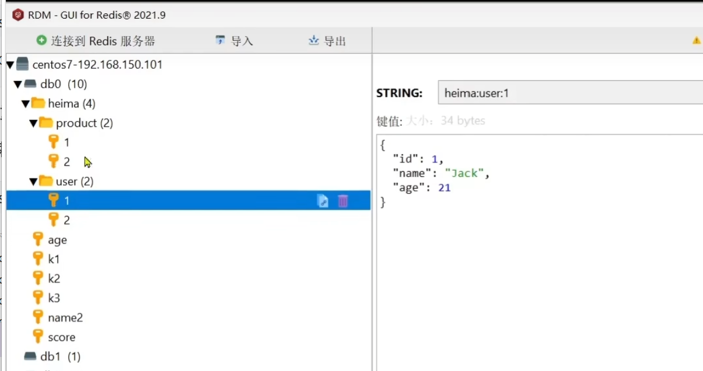

# 什么是Redis Remote Dictionary Server

1. Redis是NoSQL数据库 Not Only SQL
2. 使用键值对的形式存储数据。
3. Redis是为什么这么快？Redis是基于内存的，
4. 为什么不用Redis做主数据库？==》内存成本高、Redis提供的数据持久化有数据丢失的风险。

# NoSQL数据库和SQL数据库的关系

1. SQL是结构化、关系型数据库、使用SQL查询、支持ACID事务特性、磁盘存储、垂直扩展；
2. NoSQL是非结构化、非关系型数据库、非SQL查询、内存存储、水平扩展。

## NoSQL 对事务的支持

1. 并不是NoSQL就不支持事务，不同的NoSQL数据库对事务的支持不一样，不默认强调ACID而已：

   （1）.

2. redis key的分级存储 ==> 给key命名时用冒号分层，如heima:user:1, 就会形成文件夹
   

## Redis 中的数据类型

1. String类型的value是字符串、int或者float类型
2. Hash类型的key还是字符串，value是对象形式的，分为field和value，可以把对象中的每个字段独立存储。==> 在java中取出来是Map<String,
   String>
3. List类型类似java中的LinkedList，是双向链表。List类型插入顺序有序、元素可以重复、插入和删除快、查询速度一般。
4. Set可以支持交集SINTER、并集SUNION、差集SDIFF(SDIFF key1
   key2 意思是属于key1但不属于key2)等功能，可以用来做好友列表等功能。
5. SortedSet是一个可排序的set集合，底层基于跳表SkipList加hash表，每个元素都有score属性，可基于score属性对元素排序。 ==> 可用来实现排行榜功能，查询速度快。

## Redis客户端

### Jedis

1. 缺点：线程不安全 多线程需要使用线程池，JedisPool
2. 优点：命令跟redis原生命令同名。

### lettuce

1. 线程安全，且支持同步、异步、响应式编程，支持redis哨兵模式、集群模式和管道模式。

### Redission

1. 基于Redis实现的分布式Java数据结构集合，有很多写好的支持分布式的方法和数据结构。

## redis集群和哨兵

1. 哨兵是主从模式的，从都是主的备份而已。
2. 集群是把数据分配在多个redis的Master实例的哈希槽中，不是复制。同时每个master有自己的从复制版本slave，但是master和对应的slave不能放在同一个服务器，防止服务器崩溃之后这部分数据没有可用的了。
3. 哨兵是高可用；集群是高可用+分布式，方便横向扩展。
4. 哨兵模式的sentinel哨兵是跟redis服务实例不同的独立进行。如下一共6个进程，slave1和slave2都是master的副本。三个Sentinel用来自动完成：监控、故障检测、自动选主（failover）。

```
服务器A：Master + Sentinel
服务器B：Slave1 + Sentinel
服务器C：Slave2 + Sentinel
```

1. 集群模式

```
服务器A：Master1 + Slave3
服务器B：Master2 + Slave1
服务器C：Master3 + Slave2
```

### Redis Cluster 数据分片机制

1. 核心原理

```
slot = CRC16(key) % 16384
```

Redis 将数据映射到 16384 个 hash slot

1. 分配示例

```
Master1：0 - 5460
Master2：5461 - 10922
Master3：10923 - 16383
```

👉 数据只存在一个 Master 上

1. Slave 的作用

   不参与分片只负责复制 Master

```
Master1 ←→ Slave1
Master2 ←→ Slave2
Master3 ←→ Slave3
```

1. 写入流程

```
key → hash → slot
定位 master
写入 master
同步 slave
```

云服务的话买对应的服务即可 不用自己维护集群还是哨兵。
