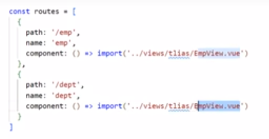

# web开发

1. Web网站的工作流程：有前端服务器返回前端页面，后端服务器返回数据，前后端分离。

# Web前端开发

1. 浏览器对前端代码进行解析和渲染，生成用户看到的网页。
2. Web标准，大部分由W3C，world wide web consortium定制。
3. HTML超文本标记语言，页面元素和结构；CSS层叠样式表，样式；JS，动态交互。

## HTML

1. html标签不分大小写；
2. table表格标签 tr表格的行 td单元格

### 表单form标签

1. 表单form标签，form的action属性只当提交表单时向何处发送表单数据，URL；method属性规定http方法如get还是post。
2. get方法没有请求体，是在url后面拼接数据
3. post有请求体，表单数据在请求体中携带。
4. 表单项标签

## css

1. html中引入css的方式：(1). 行内样式；(2). 内嵌样式，写在style标签内,style标签一般放在head标签内；(3). 外联样式:，写在一个单独的.css文件中通过link标签在网页中引入，link标签跟style标签一样也放在head中。
2. css选择器，用来选择需要的元素：

1. 选择器优先级 .id > #class > 元素选择器；行内样式比上述选择器都优先。
2. 盒子模型==> div标签
3. div一行一个，span一行可以显示多个，span的宽度和高度由内容撑开、不可以设置宽度和高度。

## JavaScript

1. js是一门跨平台、面向对象的脚本语言。脚本语言指的是不需要编译直接经过浏览器的解析就可以运行的语言。
2. ES6是最新的js版本。

### html引入js的方式

1. 方式一、内部脚本。script标签对写在head标签里面。
2. 方式二、外部脚本。\<script src="">\</script>也是写在head标签里面。**script标签不能自闭合**，即\<script src=""/>这种一个的就是自闭和的。

### js基本语法

1. 输出语句：console.log()写入浏览器控制台；window.alert()写入警告框；document.write()直接写到HTML页面中

2. 定义变量 var，let，const。
3. **var不论在哪里定义都是全局变量，且能够重复声明**；let只在代码块内有效，且不允许重复声明；const定义常量。

```js
{
  var x = 1;
  var x = 'a'; // 重复声明x，不报错
}
x = 'b'; // x是全局变量，因此括号外部可以得到。
```

4. 数据类型
5. typeof
6. typeof null 结果是object
7. 比较运算符 ==和===，==对于不一样的类型进行类型转换后再进行比较，===不同类型直接返回false。
8. 类型转换:

   (1). 字符串转整型 parseInt(string)；

   (2). null、undefined、NaN转布尔值是false，0转布尔值是false，其他非零数字**包括负数**都是true。

### js函数

1. 通过function关键字定义函数/方法。
2. ES6的箭头函数()=> {}。

### js对象

#### 数组对象

1. Array数组对象
2. js中的数组长度可变，同一个数组中可以保存不同类型的元素。
3. 数组的forEach方法只遍历数组中有值的元素，undefined元素不遍历。
4. arr.push("dg"); 添加元素。

#### String字符串对象

1. 

```js
arr.forEach(function(e) {
  console.log(e);
});
```

#### 自定义对象

1. 

#### JSON对象

1. javaScript Object Notation，javaScript对象标记法。
2. JSON是通过javaScript对象标记法书写的文本。
3. JSON中key和value都是字符串，本身是一个文本。
4. JSON多用于数据载体==>后端传递给前端的数据，前端通过JSON.parse()方法把他变成JS对象。
5.

```js
var user ='{"name" = "tom", "age" = 18}';

// JSON字符串转成JS对象
var obj = JSON.parse(user);

// js对象转成JSON字符串
var jsonStr = JSON.stringify(obj);
```

#### BOM对象

1. Browser Object Model 浏览器对象模型，允许js与浏览器对话。
2. 主要对象：Window浏览器窗口对象；Navigator浏览器对象; Screen屏幕对象;History历史记录对象；Location地址栏对象。
3. Window对象的属性：

   history属性，对于History对象的只读引用；

   location属性，用于窗口或框架的Location对象；

   navigator属性，对Navigator对象的只读引用。
4. Window对象的方法：alert()、confirm()、setInterval()、setTimeout()。
5. Location对象的获取 window.location,其中window可以省略。
6. Location对象的属性，href属性用来设置或者返回浏览器地址栏完整的URL。

```js
alert(location.href); // 获取地址栏的URL
// 设置地址栏的URL
location.href("https://www.it.com");

```

#### DOM对象

1. Document Object Model,文档对象模型，就是把html的各个组成部分封装为对应的对象。
2. Document整个文档对象；Element元素对象；Attribute是html标签的属性对象；Text文本对象（<p>文本<p>）；Comment代码注释对象。
3. 每一个html文件根据其标签的嵌套结构都会生成对应的DOM树。
4. 作用：JS通过DOM对象对HTML进行操作，改变元素内容、样式、事件监听、添加和删除html元素。

### js事件监听

1. 事件指的是发生在HTML元素上的事件。

#### 事件绑定


#### 常见事件

1. onclick，onblur，onfocus，onload，onsubmit，onmouseout，onmouseover等。

## VUE

1. 基于MVVM，model-view-viewModel，实现**数据的双向绑定**。
 ViewModel就是Vue，作为DOM和原生JS中间的桥梁，js通过vue监听DOM中数据的变化，一旦有变化就同步给js对应的变量，dom通过vue绑定js给定的数据值。

### VUE生命周期

1.

## 前端工程化

1. vue-cli 是VUE官方提供的一个脚手架用于快速生成一个VUE的项目模板。依赖环境Nodejs。
2.vue工程化项目的目录结构 
3. element组件库直接复制布局。
4. vue项目中使用Axios，npm install axios。
5. slot插槽。

### 路由

1. 前端路由就是URL中的hash(#号)与组件之间的对应关系。
2. Vue Router是Vue的官方路由，由三个部分组成：

  (1). VueRouter: 路由器类，在vue项目中就是router文件夹下的index.js文件，主要用于维护一个路由表，用于记录组件和URL中hash的对应关系。；

  (2). <router-link>标签，请求连接组件，把菜单栏对应的标签内容包裹住，浏览器会把他解析成一个超链接标签。

  (3). <router-view> 想把路由对应的组件展示在哪里，就在哪里加入这个标签。

### 打包部署

1. 前后端分离，项目完成后要前后端要分别打包部署。
2. 打包：npm run build，打包完成后生成dist文件夹。
3. 部署：Nginx，轻量级的Web服务器/反向代理服务器及电子邮件代理服务器。先在Nginx官网下载Nginx
