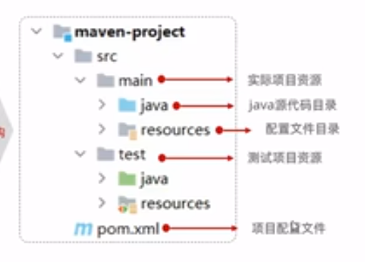
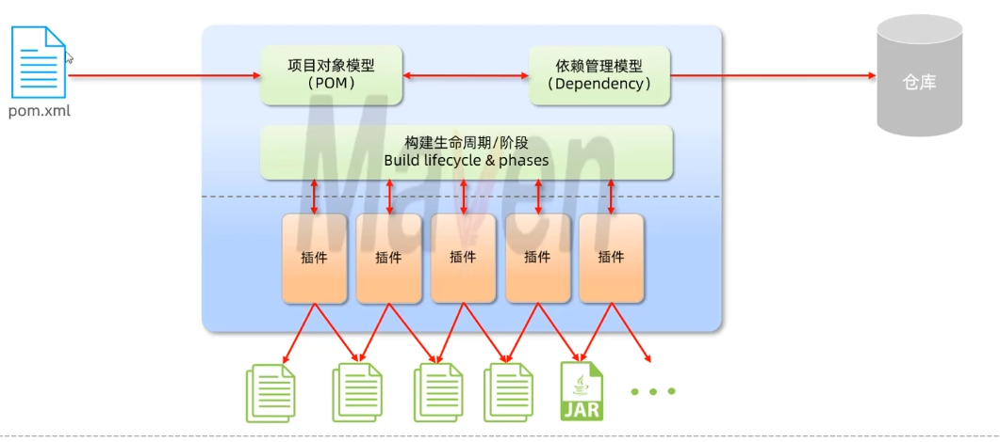
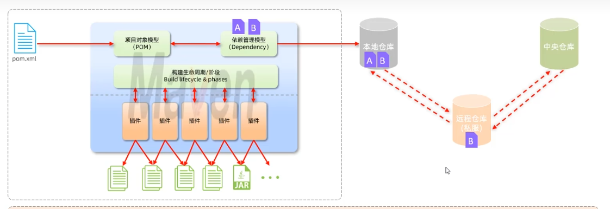
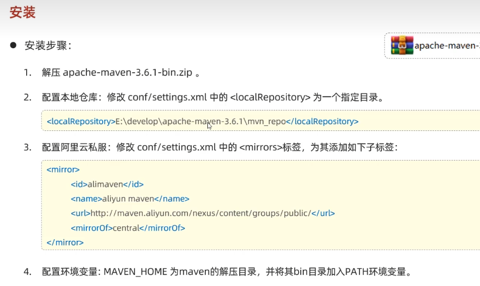
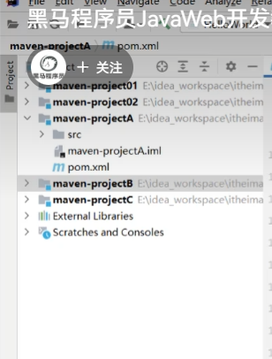
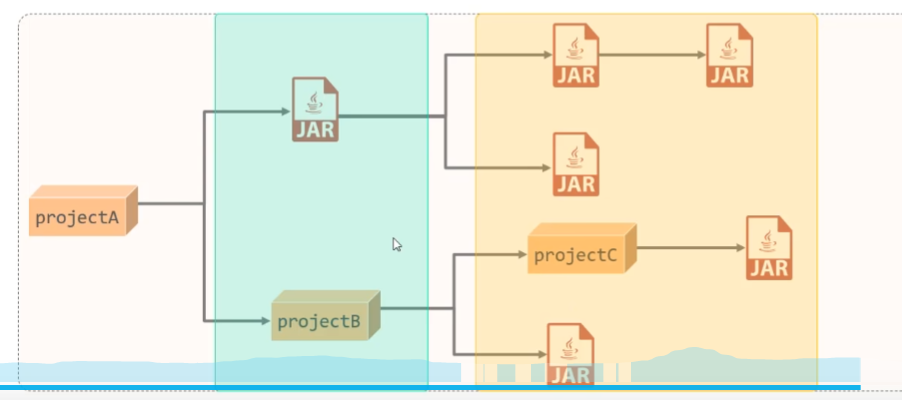
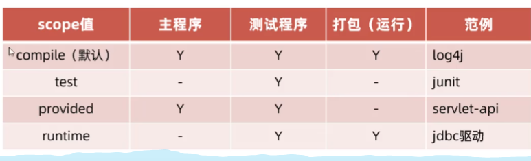
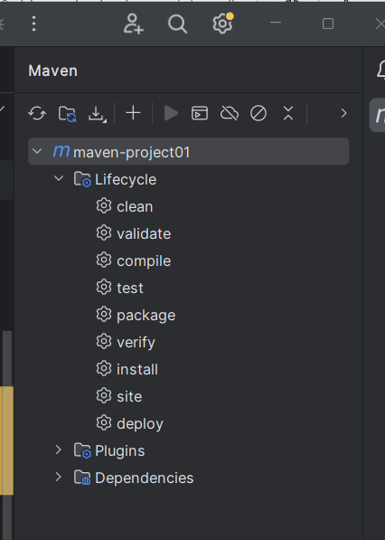

# Maven

1. Maven是apache旗下的一个开源项目，用于管理和构建java项目。
2. apache是一个开源软件基金会，非盈利性质的。
2. Maven的作用：

   (1). 管理依赖(jar包),在pom.xml文件中配置需要的依赖，Maven就会自动下载这些依赖；

   (1-1). Maven基于**项目对象模型**Project Object Model，POM，来管理、构建项目。

   (2). 提供标准、统一的项目结构：用不同的IDE如eclipse和IDEA开发的项目目录结构不同，导致不互通，使用Maven之后不论使用什么开发工具生成的项目目录结构都是一样的；

   (3). 构建项目：可以基于Maven提供的命令快速进行清理、编译、测试、打包、发布等。

3. Maven模型：构建生命周期就是清理、编译、打包这些，每个阶段由不同的插件plugin控制，会生成不同的文件。

Maven仓库，用于存储和管理jar包：

   (1). 本地仓库;

   (2). 中央仓库：Maven团队维护的全球统一的、唯一的仓库。

   (3). 私服远程仓库：公司团队自己搭建的私有仓库。

4. Maven的安装和配置
5. Maven坐标是资源的唯一标识，通过该坐标可以唯一定位资源位置：

   (1). groupId:当前项目隶属的组织名称，一般是域名的反写；

   (2). artifactId:当前项目的名称,通常是模块名称；

   (3). version:当前项目的版本号。

```xml
    <groupId>org.example</groupId>

    <artifactId>maven-project01</artifactId>
    <version>1.0-SNAPSHOT</version>
```

6. idea中允许在一个项目Project中以模块的形式导入多个Maven项目，而且这些项目之间还可能有依赖关系。

## Maven依赖管理

### 依赖配置

#### 依赖配置

1. 在pom.xml文件中的dependencies标签下新增dependency，并且引入依赖的坐标，刷新加载依赖。

```xml
 <dependencies>
  <dependency>
   <groupId>org.springframework.boot</groupId>
   <artifactId>spring-boot-starter-web</artifactId>
  </dependency>
   </dependencies>
```

#### 依赖传递

1. 依赖具有传递性。就是某个项目a的依赖本身其实也是一个项目b，项目a直接依赖项目b；项目b直接依赖项目c；则项目a间接依赖了项目c。
2. 如果想阻止a间接依赖c，可以在项目a的pom文件引入项目b的时候使用exclusion标签**排除依赖**。

```xml

    <dependencies>
        <dependency>
            <groupId>ch.qos.logback</groupId>
            <artifactId>logback-classic</artifactId>
            <version>1.4.12</version>
            <!-- 排除依赖 -->
            <exclusions>
                <exclusion>
                     <!-- 依赖排除的时候不需要指定版本 ==> 只要是这个依赖就都排除 -->
                    <groupId>org.slf4j</groupId>
                    <artifactId>jul-to-slf4j</artifactId>
                </exclusion>
            </exclusions>
        </dependency>
    </dependencies>
```

#### 依赖使用范围

1. scope标签指定依赖的使用范围，规定有三个范围：主程序mian文件夹内、测试程序test文件夹内、打包运行期间package指令范围内。

```xml
        <dependency>
        <!-- junit这个依赖就是专门用于单元测试的 -->
            <groupId>junit</groupId>
            <artifactId>junit</artifactId>
            <version>4.12</version>
            <!-- 规定这个依赖只能在测试范围内使用。 -->
            <scope>test</scope>
        </dependency>        
```

2. 不指定scope则默认都能用。test指定测试使用，provided运行时不能用；runtime主程序不能用。



#### 生命周期

1. Maven的生命周期是为了对所有的maven项目构建过程进程抽象和统一。
2. Maven中有3套**相互独立**的生命周期，**每套**生命周期**的内部有先后顺序**、后面的生命周期运行时必须把它前面的生命周期运行一遍。

   (1). clean: 清理工作，pre-clean -> clean -> post-clean；

   (2). **default:核心工作，编译compile -> 测试test -> 打包package -> 安装install**, install阶段是安装项目到本地仓库；

   (3). site:为这个项目生成一个网站，有项目的报告等相关信息, pre-site -> site -> post-site -> site-deploy。


3. 打包的时候命令行输入mvn clean package，是因为clean和package是属于两套生命周期，必须要都写出来，也可以分开写mvn clean、mvn package。
