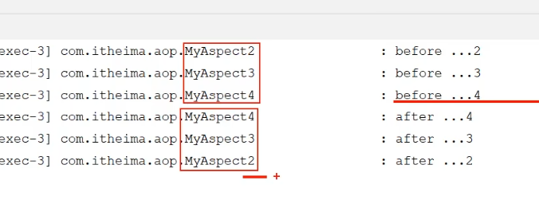
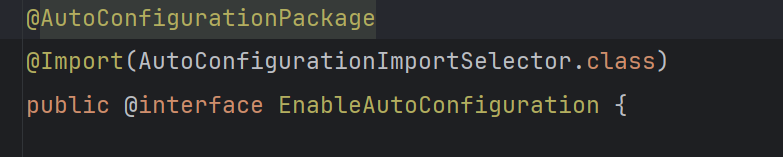

# SpringBoot

1. Spring initializr官网<https://start.spring.io/>选择Maven，JDK版本，springweb依赖之后生成项目包，在idea上的打开。
2. 最外层的Application类是项目的启动类，要加上@SpringBootApplication注解，@SpringBootApplication是一个组合注解、集成了多个注解，用于快速启动项目。
3. Controller文件夹下放请求处理类，请求处理类要加@RestController 注解，作用：让方法发的返回值自动序列化为JSON或其他格式(取决于配置)。
4. 请求处理类或者方法上都可以加@RequestMapping("/hello")注解，把请求映射到方法上。

# HTTP协议

1. HTTP协议的特点：

   (1). 是基于TCP的协议;

   (2). HTTP协议是基于请求-响应模型的；

   (3). HTTP协议是无状态的协议：每次请求-响应都是独立的，速度快。

## HTTP请求的请求方法

1. get请求 = 请求行 + 请求头；没有请求体，请求数据放在请求行中，拼在url后面，且**get请求的大小有限制。==> HTTP协议本身没有限制get请求的大小，但是服务器和浏览器可能有限制**。
2. post请求 = 请求行 + 请求头 + 请求体，请求数据放在请求体中，没有大小限制。
3. POST请求一般用于新建；PUT请求用于更新。
4. DELETE请求不返回任何东西。

## HTTP响应协议

1. 响应协议的组成
2. HTTP状态码：

   1XX响应中的临时状态码，告诉客户端继续请求，在websocket中常用；

   2XX成功；

   3XX重定向，如304表示资源自上次请求未被修改，让客户端使用缓存的资源；

   4XX,客户端错误如400 Bad Request、没有权限403、资源不存在404；

   5XX，服务器错误如500服务器出错、503服务器暂时不可用，维护中或者没准备好.

## HTTP协议解析

1. Apache Tomcat是一个Web应用服务器，它作为一个中间件，用来解析用户发送的http请求然后访问后端应用，后端返回的数据经过tomcat再返回给用户。
2. 把web应用部署在tomcat服务器上之后，实现上述功能。

# Web服务器 - Tomcat

## Tomcat和Servlet的相关概念

1. JavaSE是java的标准版；JavaME是java小型版；JavaEE是java企业版。
2. JavaEE包含13项技术规范，如Servlet、JSP、XML等，**Tomcat只支持JavaEE中的少量规范如Servlet、JSP，所以Tomcat是一个轻量级的Web服务器。**
3. **Servlet是一个接口，也就是一个规范**，就是一个java程序，主要用于处理客户端的HTTP请求并生成相应的HTTP响应，Servlet是Java Web应用程序开发的核心技术。
4. 当Tomcat作为Servlet容器时，主要负责解析Request，生成ServletRequest和ServletResponse，将其传给相应的Servlet，再架构Servlet的响应结果塞进ServletResponse中返回给客户端。
5. 所以**Tomcat被称为Servlet容器，Servlet程序需要依赖于Tomcat才能运行。==>写的代码要实现Servlet接口，Tomcat服务器才能认识**。
6. Tomcat也可以作为单独的Web服务器。
7. Servlet运行原理：


   (1). 类加载与实例化：**反射**，Web容器(如Tomcat)在启动时或首次接收到请求时，利用**反射机制**通过Servlet类的全类名加载ServletDemo.class，并调用其**无参构造方法**创建对应的实例对象。

   (2). Tomcat接收到请求之后，会解析http请求的url，根据url匹配xml中对应的Servlet类，获取到xml文件中的Servlet类的全类名，Tomcat将全类名对应的字节码文件加载进内存，Class.forName()，利用反射的newInstance()方法==>调用对应的service()方法。

   (3). 生命周期方法调用==>Web容器(Tomcat)负责管理Servlet对象的生命周期：

        实例化之后Web容器调用init()方法进行初始化，init()方法仅会被调用一次==>Servlet的实例对象是单例的。   
        
        每次请求到达时，容器会调用service(ServletRequest, ServletResponse)方法，根据请求类型分发到doGet()或doPost()等具体方法。   

        服务关闭之前容器调用destory()方法。

```java
    package com.ithema.Servlet;

    import javax.servlet.*;
    import java.io.IOException;

    //在xml文件中配置servlet和对应的url
    //Servlet运行原理：反射，通过全类名获取到ServletDemo.class，创建对应的实例对象，然后调用相应的init()方法、service()方法。Servlet的实例对象是单例的。
    //Servlet对象的生命周期
    public class ServletDemo implements Servlet {
        @Override
        public void init(ServletConfig servletConfig) throws ServletException {
            //反复的访问，init方法只会执行一次，说明Servlet对象是单例的
        }

        @Override
        public ServletConfig getServletConfig() {
            return null;
        }

        @Override
        public void service(ServletRequest servletRequest, ServletResponse  servletResponse) throws ServletException, IOException {
        }

        @Override
        public String getServletInfo() {
            return null;
        }

        @Override
        public void destroy() {

        }
    }

```

1. Servlet不是线程安全的，所以如果Servlet类中定义了可变属性，在多线程并发读写的情况下会导致数据不同步。==>解决办法，**不在Servlet类中定义可变属性字段，把需要的字段定义为doGet()或者doPost()方法中的局部变量，因为Java中方法内的局部变量存储在线程私有的栈内存中**，每个线程操作的是自己的副本，不会有线程安全问题。

```java
package com.ithema.Servlet;

import javax.servlet.ServletException;
import javax.servlet.http.HttpServlet;
import javax.servlet.http.HttpServletRequest;
import javax.servlet.http.HttpServletResponse;
import java.io.IOException;

// 继承 HttpServlet
public class ServletDemo extends HttpServlet {

    // ❌ 避免在类中定义实例变量（线程不安全）
    // private String name; 

    @Override
    protected void doGet(HttpServletRequest req, HttpServletResponse resp) throws ServletException, IOException {
        // ✅ 线程安全：局部变量（每个线程独立）
        String name = req.getParameter("name"); 
        System.out.println("处理GET请求: " + name);
    }

    @Override
    protected void doPost(HttpServletRequest req, HttpServletResponse resp) throws ServletException, IOException {
        // ✅ 同样使用局部变量
        String name = req.getParameter("name"); 
        System.out.println("处理POST请求: " + name);
    }
}
```

9. 上述两种实现Servlet类的方法：implements Servlet 和extends HttpServlet的区别如下，推荐使用extends HttpServlet的方式。


## Tomcat的基本使用

1. 官网下载最新版本，解压缩就是安装完成；双击bin目录下的startup.bat就是运行tomcat，把配置文件中的日志汉字码改成GBK之后汉字就不会乱码。
2. 更改Tomcat服务器的端口号
3. HTTP协议默认端口号是80，即localhost:80等于localhost。
4. 部署项目到Tomcat中：把项目放置到Tomcat下的webapps目录下

## JSP和Servlet的关系

1. JSP是一种Servlet。

## springboot项目中pom.xml讲解

1. 这种带starter的都是起步依赖，集成了很多依赖用于快速构建springboot项目。其中spring web这个依赖下面就包含了tomcat依赖==>**springboot内嵌了tomcat**。
2. 初始化项目的时候生成的起步依赖的版本与项目父工程的版本相匹配。

```xml
<?xml version="1.0" encoding="UTF-8"?>
<project xmlns="http://maven.apache.org/POM/4.0.0" xmlns:xsi="http://www.w3.org/2001/XMLSchema-instance"
 xsi:schemaLocation="http://maven.apache.org/POM/4.0.0 https://maven.apache.org/xsd/maven-4.0.0.xsd">
 <modelVersion>4.0.0</modelVersion>

 <!-- 项目的父工程 -->
 <parent>
  <groupId>org.springframework.boot</groupId>
  <artifactId>spring-boot-starter-parent</artifactId>
  <version>3.4.3</version>
  <relativePath/> <!-- lookup parent from repository -->
 </parent>
 <groupId>com.itheima</groupId>
 <artifactId>springboot-web-quickstart</artifactId>
 <version>0.0.1-SNAPSHOT</version>
 <name>springboot-web-quickstart</name>
 <description>Demo project for Spring Boot</description>
 <url/>
 <licenses>
  <license/>
 </licenses>
 <developers>
  <developer/>
 </developers>
 <scm>
  <connection/>
  <developerConnection/>
  <tag/>
  <url/>
 </scm>
 <properties>
  <java.version>17</java.version>
 </properties>
 <dependencies>
  <dependency>
   <groupId>org.springframework.boot</groupId>
   <artifactId>spring-boot-starter-web</artifactId>
   <!-- 起步依赖这里不带版本号，因为是父工程那里指定了版本 -->
  </dependency>

  <dependency>
   <groupId>org.springframework.boot</groupId>
   <artifactId>spring-boot-starter-test</artifactId>
   <!-- 这也是起步依赖 -->
   <scope>test</scope>
  </dependency>
 </dependencies>

 <build>
  <plugins>
   <plugin>
    <groupId>org.springframework.boot</groupId>
    <artifactId>spring-boot-maven-plugin</artifactId>
   </plugin>
  </plugins>
 </build>

</project>

```

# 请求响应

1. BS架构（浏览器/服务器架构模式）和CS架构（客户端/服务器架构模式）

## 请求

1. 原始方法解析参数；springboot自动给解析参数；
2. @RequestParam注解绑定请求中的参数和方法的形参；
3. 参数类型：简单参数、实体参数(是一个类)、数组参数(String[] hobby,和@RequestParam List\<String> hobby)、日期时间类型的参数、JSON参数。
4. springboot项目下的resources/static文件夹下用来放置静态资源，也可以防止前端文件。

## 响应

1. @RestController 用在请求处理类上，@RestController = @Controller + @ResponseBody。

2. @ResponseBody注解把方法的返回值都绑定到web响应的响应体上,通常是JSON格式。==> 所以@RestController的方法返回值都会被绑定到响应体中。

3. 设置统一响应格式{"code":200,msg:"","data":}.

## 分层解耦

### 三层架构-方便维护、复用性高

1. controller：控制层，接收前端发送的请求，对请求进行处理并响应数据。
2. service：业务逻辑层。
3. dao：数据访问层（Data Access Object），负责数据访问操作，包括数据的增删改查，又叫持久层，因为他负责把程序中的数据持久化存储到数据库中。

### 为什么要用IOC和DI

1. 程序设计的原则：高内聚、低耦合。
2. 高内聚：同一模块内部的功能联系尽量紧密；
3. 低耦合：各个层次、模块之间的依赖和联系尽量少。

4. 为什么需要IOC和DI，因为分层之后，Controller中需要使用Service对象的方法，因此需要在Controller中new一个Service对象出来 ==> Controller层和Service层之间出现了耦合，如果Service类重命名为ServiceB，Controller中的代码就要重写 new Service()改成new ServiceB()。
5. 为了解决4的问题：

   (1). 把创建对象的控制权由程序自身（这里指Controller类）转移到**外部容器**中，这种思想称为**控制反转，Inversion of Control，IOC**；

   (2).在应用程序需要时，容器为程序提供运行时所需要的资源/对象，这就是**依赖注入Dependency Injection，DI**;

   (3). **IOC容器**中创建、管理的对象，称之为**Bean**。


6. 控制反转怎么理解呢? 举个例子："对象 a 依赖了对象 b，当对象 a 需要使用 对象 b 的时候必须自己去创建。但是当系统引入了 IOC 容器后， 对象 a 和对象 b 之间就失去了直接的联系。这个时候，当对象 a 需要使用 对象 b 的时候， 我们可以指定 IOC 容器去创建一个对象 b 注入到对象 a 中"。 对象 a 获得依赖对象 b 的过程,由主动行为变为了被动行为，控制权反转，这就是控制反转名字的由来。
7. 控制反转是一种思想一种编程概念。

### IOC和DI入门-注解实现

1. 给类添加@Component注解，表示把该类交给IOC容器管理，实现控制反转==>把类变成Bean组件。
2. 注入Bean有三种方式：

   (1). 通过类的构造函数，项目里是这种

   (2). setter方法上注入

   ```java
        @Service
        public class UserService {
        
            private UserRepository userRepository;
        
            // 在 Spring 4.3 及以后的版本，特定情况下 @Autowired 可以省略       不写
            @Autowired
            public void setUserRepository(UserRepository        userRepository) {
                this.userRepository = userRepository;
            }
        
            //...
        }
   ```

   (3). 字段Field使用@Autowired注入。在类里新建对象属性时，给属性添加@Autowired注解，实现依赖注入DI。

    ```java
    @Service
    public class UserService {

        @Autowired
        private UserRepository userRepository;

        //...
    }
    ```

## IOC详解

1. @Controller、@Service、@Repository注解都是@Component的衍生注解，一样能实现控制反转
2. Bean组件要想被springboot管理，需要被组件扫面注解@ComponentScan给扫描到 ==> 组件扫描注解@ComponentScan是启动类声明注解@SpringBootApplication的一部分 ==> Bean组件只要放在启动类所在的包及其子包下面就能被扫描到。==>@Component通常是通过类路径扫描来自动侦测以及自动装配到Spring容器中。
3. 在Spring框架中，IOC容器实际上是个Map，Map里面存放各种对象。

## DI详解

```java
@Autowired
private EmpService empService;
```

1. @Autowired注解默认按照类型实现依赖注入，所以它会去找所有EmpService类型的Bean组件；如果由多个Bean组件都实现了EmpService接口，比如EmpServiceA和EmpServiceB都实现EmpService接口，依赖注入应该用哪一个呢？

方法一、@Primary注解表示有多个候选人的情况下首选这个Bean组件。

```java
@Primary 
@Service
public class EmpServiceA implements EmpService {
  ...
}
```

方法二、在注入的地方用@Qualifier注解指定使用的Bean组件的名字

```java
@RestController
public class EmpController {
  @Autowired
  @Qualifier("empServiceA") // 参数是Bean的名字，Bean的名字默认是类命的首字母换成小写。
  private EmpService empService;
}

```

方法三、 在注入的地方用@Resource替代@Autowired注解

```java
@RestController
public class EmpController {
  @Resource(name = "empServiceA")
  private EmpService empService;
}
```

2. @Autowired和@Resource的区别：Autowired是spring框架提供的，@Resource是JDK提供的注解；@Autowired默认按照类型注入，@Resource默认按照Bean的名字注入。

# RESTful API

1. Rest 全程 resource representational state transfer，**表现层状态转化**，即“资源”在网络传输中以"某种形式"进行“状态转移”：

  (1). 资源resource，与URI(统一资源标识符)一一对应，如/classes/12 表示id为12的班级。接口一般**使用名词表示资源**，服务器数据库中的资源一般都是集合形式存在所以一般用**名词的复数**。

  (2). 表现形式representational，资源的表现形式，如json，xml，image，txt等。

  (3). 状态转移state transfer，因为HTTP协议是一个无状态协议，资源的状态都保存在服务器端，这里理解为使用不同的http方法（增删改查），改变服务器端资源的状态。

# 配置文件

1. 常见的配置文件有XML，properties，yml

2. yml的层级清晰，简洁，建议使用，**yml文件**语法**区分大小写，层级之间缩进，定义数组和Set要在元素之前加-**

   ```yml

    # 定义对象/Map
    user:
      name:Tom
      age:20
      address:beijing

    # 定义数组/List/Set

    hobby:

    - java
    - c++
    - python

   ```

# @Bean @Component @Configuration

1. **@Component作用于类，用于把类注册为Spring容器中的Bean**，适用于大多数需要被@Spring管理的自定义类。
2. **@Bean作用于类中的方法，把这个方法的返回值注册为Spring容器中的Bean**。这个类本身要有@Component注解Spring才能扫描到类中的@Bean方法。
3. @Bean方法的返回类型就是Bean 的类型，@Bean方法的名称就是Bean的名称，或者通过name属性自定义Bean的名称。

## @Bean的常见用法

1. **@Bean通常和@Configuration注解配合使用**，把@Configuration标注的配置类中的方法的返回值注册为Bean，替代复杂的xml配置方式。
2. 使用@Bean方法所在的类本身也要被@Component注解称为Bean，@Bean才能起作用。 ==> 因为@Configuration本身被@Component标注了，所以@Configuration本身也是一个Bean，满足条件。

```java
import org.springframework.context.annotation.Bean;
import org.springframework.context.annotation.Configuration;

@Configuration // 表示这是一个配置类，@Configuration本身集成了@Component注解，所以里面能用@Bean
public class AppConfig {

    @Bean  // 定义了一个MyService的Bean，Bean的名称是方法名myService
    public MyService myService() {
        return new MyService();
    }

    @Bean(name = "userRepository")  // 定义了一个UserRepository类型的Bean，Bean的名称是userRepository
    public UserRepository userRepository() {
        return new UserRepositoryImpl();
    }
}

```

3. 当想**把第三方库注册为一个Bean**，由于无法改变第三方库的源码、无法给源码的类加上@Componnet注解，所以就定义一个@Bean注解的方法，该方法返回第三方库类将他作为Bean：

```java
@Configuration
public class AppConfig {

    @Bean // ThirdPartyService是第三方库的类
    public ThirdPartyService thirdPartyService() {
        return new ThirdPartyService();
    }
}
```

## @Bean和@Configuration的详细工作流程

1. @Bean和@Configuration的详细工作流程：

   (1). 类扫描：Spring扫描所有被@Configuration注解标注的类，并将其注册为Spring容器中的Bean。

   (2). 创建代理对象：对于每个@Configuration类，Spring使用CGLIB为其创建一个代理对象，这个代理对象会拦截对@Bean方法的调用。

   (3). 处理@Bean方法：当调用@Bean方法时，代理对象会检查对应的Bean是否已经存在，如果存在就返回已经存在的Bean实例，不存在就新建一个Bean实例并保存在Spring容器中 ==> **确保Bean的单例性和依赖的正确注入**。

   (4). @Bean方法的参数由Spring自动注入相应的Bean，确保Bean之间的依赖关系得到满足。

```java
public class UserService {
    private UserRepository userRepository;

    // 构造方法注入
    public UserService(UserRepository userRepository) {
        this.userRepository = userRepository;
    }

    public void printUser(Long userId) {
        User user = userRepository.findUserById(userId);
        System.out.println("User: " + user);
    }
}
```

```java
import org.springframework.context.annotation.Bean;
import org.springframework.context.annotation.Configuration;

@Configuration
public class AppConfig {

    @Bean
    public UserRepository userRepository() {
        return new UserRepository();
    }

    @Bean
    public UserService userService(UserRepository userRepository) {
        return new UserService(userRepository);
    }
}
```

## Spring容器中的Bean都是单例模式

1. 在Spring框架中，默认情况下Bean是以单例模式管理的，即Spring容器中每个Bean只有一个实例，所有对该Bean的请求都返回同一个实例，优点：

  (1). 避免重复创造对象，节约资源，提高程序性能；

  (2). 在多个地方共享同一个Bean实例，可以共享状态；

## Bean是线程安全的吗？

1. prototype的作用域下，每次获取Bean都会创建一个新的Bean实例，这种情况下不是单例模式，不存在资源竞争和线程安全的问题。
2. singleton的作用域下是单例模式，单例模式饿汉式是线程安全的，懒汉式不是线程安全的，饿汉式里面如果有可变field，也不是线程安全的，如

   ```java
        public class Singleton {
            private static final Singleton INSTANCE = new Singleton();
            private int counter = 0; // 可变字段
        
            private Singleton() {}
        
            public static Singleton getInstance() { return INSTANCE; }
        
            // 非同步修改方法
            public void increment() {
                counter++;
            }
        
            public int getCounter() { return counter; }
        }
   ```

   解决办法：

   (1). 不用可变成员变量，如项目中的Controller、Service里面的变量都是final的；

   (2). 把可变的成员变量保存在ThreadLocal中；

   (3). 用synchronized或者ReentrantLock控制可变成员变量的访问，如：

   ```java

    public class Singleton {
        private static final Singleton INSTANCE = new Singleton();
        private int counter = 0; // 可变字段

        private Singleton() {}

        public static Singleton getInstance() { return INSTANCE; }

        // 非同步修改方法
        public void increment() {
            counter++;
        }

        public int getCounter() { return counter; }
    }

   ```

# Spring的事务管理

1. 可以在方法上、类上加@Transactional注解，这样在方法运行前spring自动开启事务，方法运行后spring自动提交事务。

```java
    @Transactional(
            rollbackFor = Exception.class, // 指定什么情况下回滚
            noRollbackFor = NoSuchFieldError.class,  // 指定什么情况下不回滚
            isolation = Isolation.DEFAULT, // 用数据库默认的隔离级别
            propagation = Propagation.REQUIRED // 事务的传播行为，不填就默认是required
    )
    public void createPlanTask(InboundPlanTaskCreationBO bo) { 
      ...
     }
```

2. @Transactional的属性如上，其中isolation属性定义事务的隔离级别：

   (1). DEFAULT使用后端数据库默认的隔离级别，MySQL默认的是Repeatable_read;

   (2). READ_UNCOMMITTED;

   (3). READ_COMMITTED;

   (4). REPEATABLE_READ;

   (5). SERIALIZABLE,最高隔离界别，完全服从ACID的隔离级别，串行的。

3. @Transactional的propagation属性定义事务的传播级别，就是**当一个事务方法内部调用的方法也是事务方法时**，要指定内部那个方法的事务应该如何传播：

   (1). required:如果当前存在事务则加入该事务，如果没有事务则新建一个事务；

   (2). required_new:不管当前存不存在，总是新建一个事务，且新建的事务和当前事务**相互独立、互不影响**(当前存在事务会把当前事务挂起，再新建事务)；

   (3). nested：当前没有则新建一个事务，当前有事务则新建一个**嵌套**在当前事务里面的事务；

   (4). mandatory强制性的：当前已有事务则加入该事务，没有则抛出异常；

   (5). supports：如果当前存在事务则加入该事务，如果不存在则以非事务的方式运行。
   

4. required_new中挂起当前事务A指的是保存事务A运行的上下文，暂停执行事务A，新建一个事务B并执行，不管事务B顺利运行后被提交还是发生异常后被回滚，做完这些之后都要恢复事务A、重新加载事务A的上下文，继续执行事务A，两个事务相关独立互不影响。

# AOP 面向切面编程

1. Aspect oriented programming。

## AOP基础

1. 动态代理是AOP的最主流实现，Spring AOP使用的就是动态代理。
2. 如果要代理的对象**实现了某个接口，Spring AOP就会使用JDK Proxy动态代理去创建代理对象**；**如果目标对象没有实现什么接口，就用CGlib生成一个被代理对象的子类来作为代理**。

### AOP概念

### AOP快速入门

1. 用的话要加AOP的相关依赖

```xml
  <dependency>
   <groupId>org.springframework.boot</groupId>
   <artifactId>spring-boot-starter-aop</artifactId>
  </dependency>
```

2. AOP的应用：记录操作日志，@Transaction事务管理
3. AOP的优点：在不改变原对象的情况下（无代码侵入），把日志记录、事务管理等横切关注点从核心业务逻辑中分离出来，实现代码的复用和解耦。
4. OOP面向对象编程时把业务逻辑按照对象的属性和行为进行封装，通过类、对象、继承、多态等概念，实现代码的模块化和层次化，提高代码的可读性和可维护性。

### AOP核心概念

1. 横切关注点cross-cutting concerns: 多个类或对象中的公共行为，如日志记录、事务管理等。
2. 切面和切面类Aspect：封装横切关注点的类，一个切面类可以定义多个通知。
3. 切入点PointCut：通过表达式指定哪些方法要被切面增强。
4. 连接点JoinPoint：方法调用或者方法执行时的某个特定时刻，如方法执行前、抛出异常后，对应不同的通知类型。
5. 通知Advice：切面在某个连接点需要执行的操作

#### 通知Advice的类型 / 有哪些切入点？

1. Before：方法调用之前触发；
2. After：方法调用之后触发，且不管方法是正常返回还是抛出异常After都会执行；
3. AfterReturing：方法正常执行并返回结果之后触发；
4. AfterThrowing：方法排除异常后触发，与AfterReturing二者互斥，同一个方法运行后二者只能有一个被触发。
5. Around环绕通知：

   (1). 环绕通知中方法调用之前和之后都可以写横切点相关操作；

   (2). 必须对方法进行放行（ProceedingJoinPoint对象的proceed()方法）**且要返回原始方法的返回值,且返回值是Object类型**;


#### 具体使用

1. 切面类加@Aspect 和 @Component，表明是切面类且交给Spring管理。
2. 在每个通知的注解属性中注明切入点，有两种方式：

   (1). excution表达式，在通知中使用excution表达式指明是给哪些方法使用;

   (2). @annotation表达式，给切入的方法使用自定义注解，并在通知中使用@annotation表明自定义注解的全类名。
3. 如果切面类的很多方法用到同一个切入点，可以定义@Pointcut的字段，把公共的切入点表达式抽取出来，重复使用。


@PointCut公共切入点的使用

```java
@Aspect
@Component
public class CommonLogAspect {

    // 1. 定义公共切入点：匹配 com.example.service 包下的所有类的所有方法
    @Pointcut("execution(* com.example.service..*(..))")
    public void logPointcut() {}  // 空方法，仅用于声明切入点

    // 2. 多个通知方法引用同一个切入点
    @Before("logPointcut()")  // 前置通知
    public void beforeLog(JoinPoint joinPoint) {
        System.out.println("Before: " + joinPoint.getSignature().getName());
    }

    @After("logPointcut()")  // 后置通知
    public void afterLog(JoinPoint joinPoint) {
        System.out.println("After: " + joinPoint.getSignature().getName());
    }

    @Around("logPointcut()")  // 环绕通知
    public Object aroundLog(ProceedingJoinPoint pjp) throws Throwable {
        System.out.println("Around Before: " + pjp.getSignature().getName());
        Object result = pjp.proceed();
        System.out.println("Around After: " + pjp.getSignature().getName());
        return result;
    }
}
```

#### 同一个方法有多个切面类时，通知的执行顺序

1. 同一个方法有多个切面类时，**默认按照切面类的类名字母排序**，对于目标方法前的通知如@Before通知，类名字母排序靠前的先执行；对于目标方法后的通知如@After通知，类名字母排序靠后的先执行。整体跟过滤器一样

2. 或者**给切面类使用@Order(int)注解来排序，数字小的@Before通知先执行，@After通知后执行**。

#### 连接点

1. @Around通知要用ProceedingJoinPoint类拿到连接点，其他四种通知要用JoinPoint类，ProceedingJoinPoint extends JoinPoint。

# 注解 Annotation

## 注解的概念

1. 注解是一种特殊注释，能用来修饰类、方法、变量等，来提供信息来决定怎么执行被注解的程序。
2. 注解的本质：

   (1). 注解本质上是一个接口，所有注解都是继承了public interface Annotation {}这个接口的接口。

   (2). 注解内部看起来像对象和属性，其实是抽象方法。

   (3). **使用注解，其实就是创建这个接口的实现类对象。**


## 元注解 meta-annotation

1. 元注解是 只能作用在注解上的注解，把元注解作用在注解之外的东西上如类、方法等是没用的。

2. 元注解，最重要的有两个@Target和@Retention。
3. @Target用于声明该注解可以用在哪些位置
4. @Retention决定注解的声明周期，决定注解能保存到哪个阶段：

   (1). RetentionPolicy.SOURCE,只能保留在源代码中，用于在编译时进行代码检查或生成辅助代码，如@Override，编译之后就没了;

   (2). RetentionPolicy.CLASS，会保留到编译后生成的字节码文件中，;

   (3). RetentionPolicy.RUNTIME，会保留到编译后生成的字节码文件中，并且在运行时可以通过反射机制获取，如@Component,@Autowired;

## 自定义注解

```java
package com.itheima.mybatisDemo.ano;

import java.lang.annotation.ElementType;
import java.lang.annotation.Retention;
import java.lang.annotation.RetentionPolicy;
import java.lang.annotation.Target;

// 指定这个注解能用在什么地方
@Target({ElementType.METHOD, ElementType.CONSTRUCTOR})
// 注解能保留到什么时候
@Retention(RetentionPolicy.RUNTIME)
public @interface A {
    String value(); // 使用时如果只有一个value属性那用的时候value=''的value可以省略。
    String name(); // 要加括号
    String dataSource() default "parameter";
}

```

## 解析注解

1. 判断类、方法、成员变量上是否用了注解，并把用的时候给注解里传的内容解析出来。
2. 如何解析：利用反射，获取类的Class对象或则和Method对象、Field对象、Constructor对象，他们都实习了AnnotatedElement这个接口，AnnotatedElement接口提供获取注解的方法。

# 配置优先级

1. 

# Spring Bean管理

## Bean的生命周期

### 五步骤版本

Bean的生命周期 -五步骤版本

    1. 实例化   
   
    2. 依赖注入   
   
    3. 初始化    
   
    4. 使用    
   
    5. 销毁Bean

### 七步骤版本

1. 如果有实现了BeanPostProcessor的Bean，里面的逻辑与当前Bean有关，就会在初始化之前和之后执行对应before和after方法。**BeanPostProcessor接口能让开发者在不修改Bean类的前提下，对Bean的初始化过程进行干预，修改Bean的属性。**Spring的很多功能如处理@Autowired注解、处理@Resoure注解、实现@Configuration类的代理都是使用了BeanPostProcessor接口。

2. Bean的生命周期 -七步骤版本

    1. 实例化

    2. 依赖注入

    3. 初始化前BeanPostProcessor before方法

    4. 初始化

    5. 初始化后BeanPostProcessor after方法

    6. 使用

    7. 销毁Bean

```java
    package com.ithema.Bean;

    import org.springframework.beans.BeansException;
    import org.springframework.beans.factory.config.    BeanPostProcessor;

    public class MyProcessor implements BeanPostProcessor {
        @Override
        public Object postProcessBeforeInitialization(Object bean,  String beanName) throws BeansException {
            if("dog".equals(beanName)) {
                System.out.println("3. 初始化前BeanPostProcessor    before方法");
            }
            return bean;
        }

        @Override
        public Object postProcessAfterInitialization(Object bean,   String beanName) throws BeansException {
            if("dog".equals(beanName)) {
                System.out.println("5. 初始化后BeanPostProcessor    after方法");
            }
            return bean;
        }
    }

```

```java
    package com.ithema.Bean;

    public class Dog {

        private  String name;

        public Dog(){
            System.out.println("1. 实例化");
        };

        public Dog(String name) {
            this.name = name;
        }

        public  String getName() {
            return name;
        }

        public void setName(String name) {
            System.out.println("2. 属性填充");
            this.name = name;
        }

        public void myInit() {
            System.out.println("4. 初始化");
        }

        public void myDestory(){
            System.out.println("7. 销毁");
        }
    }


```

spring.xml文件中注册Bean

```xml
<?xml version="1.0" encoding="UTF-8"?>
<beans xmlns="http://www.springframework.org/schema/beans"
       xmlns:xsi="http://www.w3.org/2001/XMLSchema-instance"
       xsi:schemaLocation="http://www.springframework.org/schema/beans http://www.springframework.org/schema/beans/spring-beans.xsd
      http://www.springframework.org/schema/util
      http://www.springframework.org/schema/util/spring-util-4.0.xsd"
>

<!-- 注册dog和processor这两个bean -->
    <bean id="dog" class="com.ithema.Bean.Dog" init-method="myInit" destroy-method="myDestory">
        <property name="name" value="张三"></property>
    </bean>

    <bean id="processor" class="com.ithema.Bean.MyProcessor"></bean>

</beans>


```

test中使用bean

```java

    package com.itheima.test;
    
    import com.ithema.Bean.Dog;
    import org.junit.Test;
    import org.springframework.context.ApplicationContext;
    import org.springframework.context.support.ClassPathXmlApplicationContext;
    
    public class DemoTest {
        @Test
        public void test1() {
            ApplicationContext context = new ClassPathXmlApplicationContext("spring.xml");
            context.getBean(Dog.class);
    
            System.out.println("6. 使用Bean");
    
            ((ClassPathXmlApplicationContext) context).close();
        }
    
    }

```

### 十一步骤版本

1. 在七步骤版本的基础上Bean实现了三个接口:

   (1). Aware接口，让Bean获取到对象的信息；

   (2). InitializingBean接口，在Bean对象的属性全部设置完之后、在初始化之前调用afterPropertiesSet()方法；

   (3). DisposableBean接口

2. Bean生命周期中初始化和销毁阶段有很多地方可以实现逻辑，如销毁阶段就有三个：

   (1). 在Bean中使用@PreDestory注解

   (2). 使用DisposableBean接口

   (3). 在xml配置文件中使用destory-method属性。

使用接口的都是与Spring强耦合的，适用于框架代码，能进行强制初始化检查；xml配置文件的适用于业务代码，可以保持业务代码的纯净、让代码跟Spring解耦；@PreDestory注解和@PostConstruct注解都是JavaEE的规范，也不依赖于Spring。==>**优先使用JavaEE规范注解和xml配置，与Spring解耦**。

3. Bean的生命周期 -十步骤版本

    1. 实例化

    2. 依赖注入

    3. 实现了Aware接口，如BeanNameAware接口中的setBeanName()方法

    4. 初始化前BeanPostProcessor before方法

    5. InitializingBean接口中的afterPropertiesSet()方法

    6. 初始化

    7. 初始化后BeanPostProcessor after方法

    8. 使用

    9. 调用Bean中使用了@PreDestroy注解的方法

    10. DisposableBean接口的destory()方法

    11. 销毁Bean

```java
package com.ithema.Bean;

import org.springframework.beans.BeansException;
import org.springframework.beans.factory.*;

public class Dog implements BeanNameAware, BeanFactoryAware,InitializingBean, DisposableBean {

    private  String name;

    public Dog(){
        System.out.println("1. 实例化");
    };

    public Dog(String name) {
        this.name = name;
    }

    public  String getName() {
        return name;
    }

    public void setName(String name) {
        System.out.println("2. 属性填充、依赖注入");
        this.name = name;
    }

    @Override
    public void setBeanName(String s) {
        System.out.println("3. 实现了Aware接口如BeanNameAware接口，执行setBeanName()方法");
    }

    @Override
    public void setBeanFactory(BeanFactory beanFactory) throws BeansException {
        System.out.println("3. 实现了Aware接口如BeanFactoryAware接口，执行setBeanFactory()方法");
    }

    // 4. 初始化前BeanPostProcessor before方法
    @Override
    public void afterPropertiesSet() throws Exception {
        System.out.println("5. InitializingBean接口中的afterPropertiesSet()方法");
    }
    public void myInit() {
        System.out.println("6. 初始化");
    }

    //7. 初始化后BeanPostProcessor after方法
    //8. test使用

    @PreDestroy
    public void preDestroy() {
        System.out.println("9. 注解 @PreDestroy");
    }
    @Override
    public void destroy() throws Exception {
        System.out.println("10. DisposableBean接口的destory()方法");
    }

    public void myDestory(){
        System.out.println("11. 销毁");
    }

}

```

## Spring的BeanDefinition接口

1. Spring容器在启动时，会把XML文件中有关bean对象（还有注解、Java配置等bean对象有关的信息）的配置信息 解析为BeanDefinition对象，存储在BeanDefinitionRegistry中。
2. BeanDefinition接口中的属性有beanClassName、scope作用域、initMethod、destroyMethod、lazyInit是否延迟初始化等。

## Spring循环依赖

1. Spring循环依赖值得就是 两个或多个Bean之间相互引用，对象A内部引用了对象B，对象B内部引用了对象A。

2. 正常想要获取到某个bean，是到Bean工厂即IoC容器里面取，容器里面有则直接用，没有则创建一个对应的bean对象。创建过程是利用反射实例化、填充属性、初始化等，参考bean的生命周期。


1. 如果发生循环引用，在创建对象A的过程中要把B对象填充为A的属性==>需要创建一个B对象==>B对象又引用了A对象==>又要去创建A对象，发生死循环。

2. 解决办法：把实例化之后、还没填充完属性的**半成品对象**放在**二级缓存半成品池**中，循环引用的时候**一级缓存单例池**中找不到，就去二级缓存中找。

3. 但是当存在AOP代理的循环引用时，就需要用到三级缓存。**三级缓存是一个工厂池，里面放的是ObjectFactory ==> 用来生成对象的工厂，调用ObjectFactory的getObject()方法创建原始Bean对象或者被代理的Bean对象。** **生成成功之后，从工厂池中删除对应的ObjectFactory，并把结果放在二级缓存中方便下一次使用。**

4. 为什么Spring的二级缓存解决不了AOP循环引用？假设仅使用二级缓存，过程如下：

   (1). Bean A实例化之后放进二级缓存(这里放入的是Bean A的**原始对象**)；

   (2) Bean B依赖Bean A， **B从二级缓存获取原始对象A并引用**；

   (3). Bean A完成初始化生成AOP代理对象，并把完成的AOP代理对象A放入一级缓存；

   (4). **Bean B引用的是原始对象A而不是代理之后的A**。

5. 上述**Spring的三级缓存其实就是三个Map**：

```java
    // 一级缓存
    /** Cache of singleton objects: bean name to bean instance. */
    private final Map<String, Object> singletonObjects = new ConcurrentHashMap<>(256);

    // 二级缓存
    /** Cache of early singleton objects: bean name to bean instance. */
    private final Map<String, Object> earlySingletonObjects = new HashMap<>(16);

    // 三级缓存
    /** Cache of singleton factories: bean name to ObjectFactory. */
    private final Map<String, ObjectFactory<?>> singletonFactories = new HashMap<>(16);
```

6. 解决循环依赖的办法 ==> 使用@Lazy注解，延迟依赖的初始化时机。

## Aware接口

1. Aware接口通常用于获取一些信息，如：

   (1). ApplicationContextAware接口，用于手动获取ApplicationContext上下文对象；

   (2). BeanNameAware接口，让Bean获取到自己在容器中的名称；

    ```java
        public class MyBean implements BeanNameAware {
            private String beanName;

            @Override
            public void setBeanName(String name) {
                this.beanName = name; // 获取 Bean 的 ID
            }

            public void printName() {
                System.out.println("Bean name: " + beanName);
            }
        }
    ```

   (3). BeanClassLoaderAware接口，让Bean获取到类加载器；

   ```java

        public class MyBean implements BeanClassLoaderAware {
            private ClassLoader classLoader;

            @Override
            public void setBeanClassLoader(ClassLoader classLoader) {
                this.classLoader = classLoader; // 获取类加载器
            }

            public void loadClass(String className) throws ClassNotFoundException {
                Class<?> clazz = classLoader.loadClass(className);
                System.out.println("Loaded class: " + clazz.getName());
            }
        }

   ```

   (4). BeanFactoryAware接口，让Bean获取到BeanFactory容器实例。

   ```java
        public class MyBean implements BeanFactoryAware {
            private BeanFactory beanFactory;

            @Override
            public void setBeanFactory(BeanFactory beanFactory) {
                this.beanFactory = beanFactory; // 获取容器
            }

            public void getOtherBean() {
                MyOtherBean otherBean = beanFactory.getBean(MyOtherBean.class);
                // 使用 otherBean
            }
        }
   ```

## 手动获取Bean

1. Bean是Spring管理的，但是可以手动获取Bean对象，**ApplicaitionContext接口表示Spring的IOC容器，该容器包含应用程序创建的所有Bean，getBean方法可以通过Bean的类型和名称获取Bean。** 使用ApplicationContext的两种方式：

    (1). 直接在需要使用ApplicationContext的地方依赖注入ApplicationContext。

    ```java
    @Component
    public class MyBean {  // 需要直接使用的地方

        @Autowired  // 依赖注入
        private ApplicationContext applicationContext;

    }
    ```

    (2). 对于静态方法中或第三方库，无法直接使用依赖注入ApplicationContext。**因为静态方法是类的方法，Spring的IOC容器管理的是类的实例对象，管理不到类，所以不能依赖注入**；Spring无法控制第三方库的内部实现和生命周期，所以不能使用依赖注入(使用@Bean也是这个原因)。可以**实现ApplicationContextAware接口，因为该接口包含了setApplicationContext方法，Spring会在创建ApplicationContext之后调用该方法**。

        (2-1). 可以在全局任何地方通过静态方法ApplicationContextProvider.getContext()获取ApplicationContext，但是这违背了IOC/DI的原则，能用第一种方法的地方优先用第一种方法。

        像JPA监听类的实例就是Hibernate管理，不被Spring管理，所以DictCodeListener使用第二种方法。

    ```java
    package com.jpy.backend.config;

    import org.springframework.context.ApplicationContext;
    import org.springframework.context.ApplicationContextAware;
    import org.springframework.stereotype.Component;

    // 用于手动获取Bean对象
    @Component
    public class ApplicationContextProvider implements ApplicationContextAware {

        // ApplicationContext是Spring IOC容器
        private static ApplicationContext context;

        @Override  // ApplicationContextAware的方法，Spring创建ApplicationContext之后马上调用该方法
        public void setApplicationContext(ApplicationContext context) {
            this.context = context;
        }

        public static ApplicationContext getContext() {
            return context;
        }

        public Object getBean(Class bean) {
            // 根据类型获取Bean。
            return this.context.getBean(bean);
        }

        public Object getBean(String name) {
            // 根据Bean名称获取Bean。
            return this.context.getBean(name);
        }

        public Object getBean(String name, Class bean) {
            // 根据Bean名称和类型获取Bean。
            return this.context.getBean(name, bean);
        }
    }

    ```

## Bean的作用域

1. 默认是单例的，即singleton；prototype表示每次使用该bean式都创建新的实例。
2. 单例情况下，默认Bean是在容器启动时初始化，在Spring Bean类上添加@Lazy注解延迟Bean的初始化==>到首次使用该Bean的时候再初始化。
3. @Scope注解修改作用域

```java
package com.jpy.backend.modules.wms.service;

...
import org.springframework.context.annotation.Lazy;
import org.springframework.context.annotation.Scope;

@RequiredArgsConstructor
@Service
@Slf4j
@Lazy // 延迟Bean的初始化
@Scope("prototype") //非单例的，每次新建一个Bean对象
public class InboundMobileService {
        ...
}

```

# Spring启动过程 TODO

1. Spring启动过程简略版：

   (1). 创建BeanFactory，加载xml等配置文件；

   (2). 解析配置文件转化为BeanDefinition，获取到bean的所有属性、依赖以及初始化用到的各类处理器等；

   (3). 刷新BeanFactory容器，初始化所有单例bean；

   (4). 注册所有的单例bean并返回可用的容器，一般为扩展的ApplicaitonContext。

# Spring框架中用到的设计模式

## 设计模式需要遵循的原则

1. 开闭原则：软件实体（类、模块、函数等）应对扩展开放，对修改关闭：

   (1). 对扩展开放：当需求变化时可以通过添加新代码来扩展功能，而无需修改现有代码；

   (2). 对修改关闭：现有代码一旦完成并通过测试，要避免因为需求变更而频繁修改。

## 工厂模式

1. 工厂模式是为了解耦，当对象a中要用到对象b时，对象a只跟工厂打交道获取到对象b然后使用即可，**避免在内部直接使用new**创建对象b ==> **将对象的创建逻辑与使用逻辑解耦**。

### 简单工厂模式

1. 简单工厂的三个重要角色：

   抽象产品如Coffee；

   具体产品就是Coffee的子类，如美式咖啡和拿铁咖啡；

   具体的工厂类，接收类型参数创建具体产品并返回给调用者


2. 下面是简单工厂的代码，工厂内部的**创建方法接收咖啡类型这个参数**，返回具体的咖啡实例对象。

```java
    /**
     * 咖啡工厂类
     */
    public class SimpleCoffeeFactory {
        
        
        public Coffee createCoffee(String type) {
            Coffee coffee = null;
            if("americano".equals(type)) {
                coffee = new AmericanoCoffee();
            } else if("latte".equals(type)) {
                coffee = new LatteCoffee();
            }
            return coffee;
        }
    }

```

使用时还是要new一个工厂对象出来，但是具体咖啡的类型、数量等需要修改，可以直接在工厂类中修改。==> **简单工厂和静态工厂还是违背了开闭原则**。

```java
//新的咖啡屋类
public class CoffeeStore {

    public Coffee orderCoffee(String type) {
        SimpleCoffeeFactory factory = new SimpleCoffeeFactory();
        Coffee coffee =  factory.createCoffee(type); //传类型参数
        //加配料
        coffee.addMilk();
        coffee.addsugar();
        return coffee;
    }
}

```

### 静态工厂

1. 就是把简单工厂的创建方法改成静态方法static的，使用的时候不需要new一个工厂实例出来了。

```java
public class SimpleCoffeeFactory {
 
    //静态方法
    public static Coffee createCoffee(String type) {
        Coffee coffee = null;
        if("americano".equals(type)) {
            coffee = new AmericanoCoffee();
        } else if("latte".equals(type)) {
            coffee = new LatteCoffee();
        }
        return coffe;
    }
}

```

### 工厂方法模式

1. 工厂方法的四个角色：

    抽象产品如Coffee；

    具体产品就是Coffee的子类，如美式咖啡和拿铁咖啡；

    抽象工厂，即**工厂接口**，定义抽象的创建方法；

    具体的工厂类，实现了抽象工厂接口的类，完成具体产品的创建。
 

2. 不同的具体工厂类用来生产不同的具体产品

```java
//抽象工厂接口
public interface CoffeeFactory {

 Coffee createCoffee();   //生产咖啡对象
 
}

```

```java
//不同的具体工厂类用来生产不同的具体产品

//美式咖啡工厂，专门用来生产美式咖啡
public class LatteCoffeeFactory implements CoffeeFactory {

    public Coffee createCoffee() {
        return new LatteCoffee();
    }
    
}

//拿铁咖啡工厂，专门用来生产拿铁咖啡
public class AmericanCoffeeFactory implements CoffeeFactory {

    public Coffee createCoffee() {
        return new AmericanCoffee();
    }
    
}

```

使用时，在类的内部使用set方法设置具体工厂，然后直接调用工厂的创建方法来创建产品。

```java
public class CoffeeStore {

    private CoffeeFactory factory;
 
    //set
    public void setFactory(CoffeeFactory factory) {
     this.factory = factory;
    }
 
    public Coffee orderCoffee() {
        Coffee coffee = factory.createCoffee();   //直接调抽象类的方法，到时是哪个子工厂，就能创建出哪种咖啡
        //加配料
        coffee.addMilk();
        coffee.addsugar();
        return coffee;
    }
}

```

```java
public class Client {

    public static void main(Stirng[] args) {
    
     //创建咖啡店对象
     CoffeeStore store = new CoffeeStore();
     //创建具体的咖啡工厂
     CoffeeFactory factory = new AmericanCoffeeFactory();
     store.setFactory(factory);
     //点咖啡
     Coffee coffee = store.orderCoffee();
     //获取咖啡名称
     System.out.println(coffee.getName());
    }
}

```

3. 工厂方法模式的优点：符合开闭原则，有新产品的时候不需要更改已经写好的具体工厂类；
4. 工厂方法模式的缺点：每新增一个具体产品就要定义一个新的具体工厂类，让系统变得复杂。

### 抽象工厂模式

1. 上述一个工厂接口都是只生产一种类型的产品，抽象工厂的工厂接口中有多个方法，可以生成多种类型的产品。==>每一个具体工厂用来生产不同产品族的产品。
2. 工厂方法的四个角色：

    抽象产品如Coffee、Dessert甜品；

    具体产品就是Coffee和Dessert的子类，如美式咖啡和拿铁咖啡，甜品1，甜品2；

    抽象工厂，即**工厂接口**，提供创建多种产品的接口；

    具体的工厂类，实现了抽象工厂接口的多个方法，完成具体产品的创建==>如华为品牌的工厂可以生产华为平板、华为手机；小米品牌的工厂可以生产小米平板、小米手机。


```java
public interface DessertFactory {

    Coffee createCoffee();

    Dessert createDessert();
}

```

```java
//美式甜点工厂
public class AmericanDessertFactory implements DessertFactory {

    public Coffee createCoffee() {
        return new AmericanCoffee();   //美式甜点工厂生产美式
    }

    public Dessert createDessert() {
        return new MatchaMousse();  //美式甜点工厂生产
    }
}

```

```java
//意大利风味甜点工厂
public class ItalyDessertFactory implements DessertFactory {

    public Coffee createCoffee() {
        return new LatteCoffee();
    }

    public Dessert createDessert() {
        return new Tiramisu();
    }
}

```

```java
public class Client {

 public static void main(Stirng[] args) {
  
  //创建工厂对象
  DessertFactory store = new AmericanDessertFactory();
  //生产咖啡
  Coffee coffee = store.createCoffee();
  //生产甜品
  Dessert dessert = store.createDessert();
 }
}

```

3. 适用于每次使用同一品牌/同一产品族的产品的场景，比工厂方法模式定义的具体工厂类能少一点==>不容易类爆炸；
4. 缺点：产品族中新加一种产品时，即抽象工厂接口中每增加一个新的方法，就要修改所有的具体工厂。==>这种情况不符合开闭原则。

### Spring中工厂模式的使用

1. **Spring中的工厂模式主要用来创建Bean，这些工厂就是IoC容器，Spring中用的是简单工厂模式。**
2. **BeanFactory接口，是Spring IoC容器的核心接口**，是最顶层的接口，定义了Ioc容器的基本功能，里面我们主要关心**getBean()方法**。
3. BeanFactory的三个重要的子接口主要是为了区分在Spring内部操作过程中对象的传递和转化。
4. ApplicationContext接口是BeanFactory的子接口。二者的区别：

   (1). **BeanFactory是延迟注入的**，用到某个bean的时候才注入，更节约内存、**程序启动更快**;

   (2). **ApplicationContext是对BeanFactory接口的扩展，是非延迟的，在容器启动的时候一次性创建所有bean。**

5. ApplicationContext的三个实现类：

   (1). ClassPathXmlApplication:根据类路径加载xml配置文件，并创建IoC容器对象；

   (2). FileSystemXmlApplication: 根据系统路径加载xml配置文件，并创建IoC容器对象；

   (3). AnnotationConfigApplicationContext：加载注解类配置，并创建IoC容器。

## 单例模式

1. Spring 中的 Bean 默认都是单例的。

## 代理模式

1. Spring AOP

# Java Bean和Spring Bean

1. 在Spring中提到的bean默认都是Spring管理的Bean，上述提到的都是Spring bean。下面讲一下Java Bean和Spring Bean的区别和联系。

<https://blog.csdn.net/qq_62262918/article/details/135360526>

2. 什么是JavaBean？JavaBean对象的特征：

   (1). 类必须是具有无参构造函数的公共类；

   (2). 私有属性应该使用标准的getter和setter方法进行访问；

   (3). 可选地，可以实现序列化接口以支持对象的持久化和网络传输；

   (4). 可选地，可以提供其他方法来实现业务逻辑。
3. JavaBean的应用，比如各种RO,VO,BO，DTO
4. Java Bean和Spring Bean的区别和联系：所有对象都可以用过SpringBean，满足JavaBean规范的对象才能用作JavaBean，因此不符合JavaBean规范的对象仍然可以作为SpringBean。

# SpringBoot的原理

## Maven依赖传递

## SpringBoot的自动配置

1. SpringBoot的自动配置就是当Spring容器启动后，一些配置类、bean对象就自动存入到了IOC容器中，不需要我们手动声明，从而简化了开发。

### SpringBoot自动配置的原理

1. 如何把第三方依赖中声明的类和对象，注册为Spring容器的Bean对象：

   (1). @Bean注解用在方法上，方法的返回值是new好的第三方依赖中类的对象；

   (2). Application类上使用@ComponentScan注解，指定要扫面的第三方类。因为@SpringBootApplication注解只扫描当前包及其子包，第三方类包扫面不到

   ```java

    package com.jpy.backend;

    import org.springframework.boot.SpringApplication;
    import org.springframework.boot.autoconfigure.SpringBootApplication;
    import org.springframework.boot.web.servlet.support.SpringBootServletInitializer;
    import org.springframework.cloud.openfeign.EnableFeignClients;
    import org.springframework.context.annotation.ComponentScan;
    import org.springframework.context.annotation.EnableLoadTimeWeaving;
    import org.springframework.scheduling.annotation.EnableScheduling;

    @SpringBootApplication // 只扫描当前包及其子包
    @ComponentScan({"com.example", "com.itheima"})
    public class Application {

     public static void main(String[] args) {

      try {
       SpringApplication.run(Application.class, args);
      } catch (Exception e) {
       e.printStackTrace();
      }

     }

    }

   ```

   (3). @Import注解，参数是是一个类，可以是要作为Bean对象的类本身，或者ImportSelector接口的实现类（ImportSelector接口的selectImports方法返回String[]数组，内容是需要被扫描的第三方类）。

    ```java

    package com.jpy.backend;

    import com.jpy.backend.modules.system.dao.entity.Dict;
    import org.springframework.boot.SpringApplication;
    import org.springframework.boot.autoconfigure.SpringBootApplication;
    import org.springframework.boot.web.servlet.support.SpringBootServletInitializer;
    import org.springframework.cloud.openfeign.EnableFeignClients;
    import org.springframework.context.annotation.ComponentScan;
    import org.springframework.context.annotation.EnableLoadTimeWeaving;
    import org.springframework.context.annotation.Import;
    import org.springframework.scheduling.annotation.EnableScheduling;

    @SpringBootApplication // 只扫描当前包及其子包
    @Import(Dict.class) // 需要交给IOC容器管理的类本身
    @Import(MyImportSelector.class) // ImportSelector接口的实现类
    public class Application {

     public static void main(String[] args) {

      try {
       SpringApplication.run(Application.class, args);
      } catch (Exception e) {
       e.printStackTrace();
      }

     }

    }

    ```

    (4). 使用第三方依赖提供的@EnableXxxx注解，是对@Import注解的封装，即第三方依赖写好了需要导入的类。**SpringBoot使用这种方式**

    ```java
    package com.jpy.backend;
    
    import org.springframework.boot.SpringApplication;
    import org.springframework.boot.autoconfigure.SpringBootApplication;
    import org.springframework.cloud.openfeign.EnableFeignClients;
    import org.springframework.scheduling.annotation.EnableScheduling;


    @SpringBootApplication // 只扫描当前包及其子包
    @EnableFeignClients
    @EnableScheduling // 第三方依赖的包提供的
    public class Application {

     public static void main(String[] args) {

      try {
       SpringApplication.run(Application.class, args);
      } catch (Exception e) {
       e.printStackTrace();
      }

     }

    }

    ```

2. 如何实现自动配置：应用入口类的@SpringBootApplication注解封装了三个注解：

    (1). @SpringBootConfiguration表明这是一个配置类。

    (2). ComponentScan组件扫描，默认扫描当前引导类所在包以其子包，扫面哪些类用了@Component注解。  

    (3). **@EnableAutoConfiguration，SpringBoot实现自动化配置的核心注解，是封装过的@Import注解** **AutoConfigurationImportSelector类**里的selectImports方法会返回需要自动配置的全类名String[] 数组,返回的就是下图两个文件中的**全类名**

3. 条件装配：上图依赖中的两个文件中不会无条件的装配所有类中的Bean，在注册Bean对象时会使用@Conditional注解，SpringBoot把满足条件的才注册为IOC容器的Bean。
4. @Conditional是一个父注解，他有很多子注解

### 自定义Starter

1. 在实际开发中并不是需要的所有依赖都写好了starter。经常会定义一些公共组件提供给各个项目团队使用，一般把这些公共组件封装为SpringBoot的starter。
2. 案例：

   (1). 需求：自定义aliyun-oss-spring-boot-starter，完成阿里云OSS操作工具类的自动配置AliyunOSSUtils

   (2). 目标：引入起步依赖之后，要想使用阿里云OSS，注入AliyunOSSUtils直接使用即可

3. 自定义上述案例starter的步骤：

    (1). 创建对应的**starter模块**用于依赖管理，如aliyun-oss-spring-boot-starter模块；

    (2). 给每个需要的依赖创建对应的**autoconfigure模块**，用于该依赖中Bean的自动配置，如aliyun-oss-spring-boot-autoconfigure模块；  

    (3). 在autoconfigure模块中定义自动配置功能：具体就是定义一个AliOSSAutoConfiguration类，给类使用@Configuration注解，在类中写好需要的Bean对象；在resources下面的META-INF.spring文件夹下新建.imports文件，文件中写入需要自动配置的类的全类名，如AliOSSAutoConfiguration类的全类名。

    (4). **在starter模块中把autoconfigure模块作为依赖引入**；

    (5). 在项目中把starter模块作为依赖引入即可。

## Spring MVC

1. MVC是模型Model、视图View、控制器Controller的简写，**核心思想是通过把业务逻辑、数据、显示分离来组织代码**。

## Spring中的统一异常处理

1. @ControllerAdvice和@ExceptionHandler
2. 给负责进行就统一异常处理的类加上@ControllerAdvice注解，内部的方法用@ExceptionHandler来处理不同类型的异常。

```java
package com.jpy.backend.config;

import com.jpy.backend.commons.BusinessException;
import com.jpy.backend.commons.ErrorCodes;
import com.jpy.backend.commons.ErrorResponse;
import lombok.extern.slf4j.Slf4j;
import org.hibernate.exception.SQLGrammarException;
import org.springframework.beans.factory.annotation.Autowired;
import org.springframework.beans.factory.annotation.Value;
import org.springframework.context.MessageSource;
import org.springframework.dao.DataIntegrityViolationException;
import org.springframework.dao.EmptyResultDataAccessException;
import org.springframework.dao.InvalidDataAccessResourceUsageException;
import org.springframework.validation.BindException;
import org.springframework.validation.BindingResult;
import org.springframework.validation.FieldError;
import org.springframework.web.bind.MethodArgumentNotValidException;
import org.springframework.web.bind.annotation.ControllerAdvice;
import org.springframework.web.bind.annotation.ExceptionHandler;
import org.springframework.web.bind.annotation.ResponseBody;
import org.springframework.web.bind.annotation.RestControllerAdvice;
import org.springframework.web.multipart.MaxUploadSizeExceededException;

import javax.servlet.http.HttpServletResponse;
import java.util.HashMap;
import java.util.List;
import java.util.Locale;
import java.util.Map;

@ControllerAdvice
@ResponseBody
@Slf4j
public class ApiExceptionHandler {
    ...
    @ExceptionHandler(value = {BindException.class, MethodArgumentNotValidException.class})
    public ErrorResponse handeBindException(HttpServletResponse response, BindException ex) {
        ErrorResponse errorResponse = new ErrorResponse();
        if (ex instanceof MethodArgumentNotValidException) {
            response.setStatus(HttpServletResponse.SC_BAD_REQUEST);
            BindingResult result = ex.getBindingResult();
            List<FieldError> fieldErrors = result.getFieldErrors();
            fieldErrors.stream().forEach(e -> errorResponse.addFieldError(e.getField(), e.getDefaultMessage()));
        }
        return errorResponse;
    }

    @ExceptionHandler(value = BusinessException.class)
    public ErrorResponse handleBusinessException(HttpServletResponse response, BusinessException ex) {

        String msg = messageSource.getMessage(ex.getCode(), null, Locale.CHINA);

        ErrorResponse errorResponse = new ErrorResponse();
        errorResponse.setError(msg);

        int status = HttpServletResponse.SC_INTERNAL_SERVER_ERROR;
        if (error2StatusCodeMapping.containsKey(ex.getCode())) {
            status = error2StatusCodeMapping.get(ex.getCode());
        }
        response.setStatus(status);

        return errorResponse;
    }
}
```
