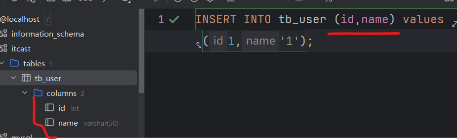
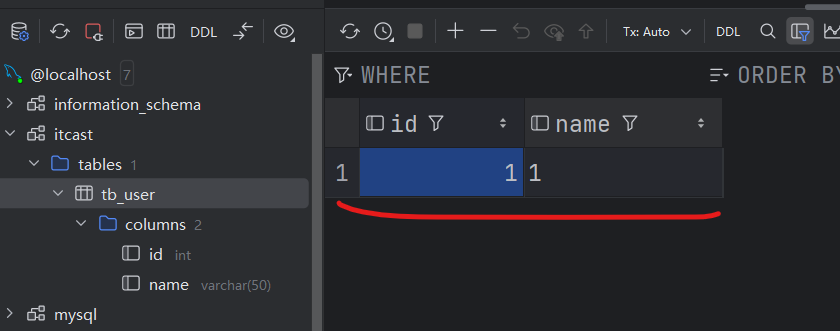
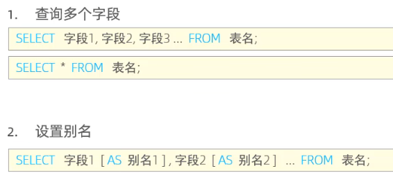
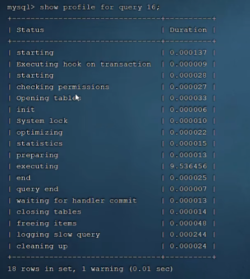

# MySQL数据库

## MySQL概述

1. **数据库**是数据存储的仓库。
2. **数据库管理系统**是操作和管理数据库的大型软件。
3. SQL，Structured Query Language是操作 **关系型数据库（RDBMS）** 的编程语言，定义了一套操作关系型数据库的统一标准。
4. 关系型数据库（RDBMS）的概念：是建立在关系模型基础上，由多张**相互连接**的**二维表**组成的数据库。

   关系型数据库的特点：

   (1). 使用表存储数据，格式统一，便于维护；

   (2). 使用SQL语言操作，标准统一，使用方便。


5. MySQL社区版免费、商业版收费，SQL Server收费。

6. 命令行命令net start mysql80 启动数据库；net stop mysql80停止数据库。

7. MySQL客户端连接，cmd输入命令

8. MySQL数据库的数据模型：客户端发送SQL语句到数据库服务器，服务器内部是DBMS这个软件来管理数据库，可以同时管理多个数据库，每个数据库中可以有多张表。

## MySQL数据库的数据类型 todo

1. 分为三类：数值类型、字符串类型、日期类型。

2. TINYINT(对应java中的byte)，

   SMALLINT(对应java中的short)，

   INT（java中的int）,

   BIGINT（对应java中的long类型）,

   FLOAT（java中的float）,

   DOUBLE(java中的double),

   DECIMAL（java中的BigDecimal）,

   CHAR(java中的String),

   VARCHAR(java中的String),

   TEXT(java中的String),

   DATE（java中的java.sql.Date），

   TIME（java中的java.sql.Time），

   DATETIME，

   TIMESTAMP 时间戳

3. DECIMAL是依赖于M(精度，共有几位数字)和D（标度，小数点后保留几位）的值，**要规定DECIMAL共有几位，小数点后保留几位**。
4. DECIMAL和FLOAT/DOUBLE的区别是什么？答：DECIMAL是定点数，FLOAT/DOUBLE是浮点数，**DECIMAL适用于有精度要求的小数，存储跟银行、金钱相关的数据，避免浮点数带来的精度损失**。
5. 什么是定点数和浮点数？答案：定点数的小数点位置是固定的，不随数值变化而变化，浮点数的小数点位置是浮动变化的。定点数计算效率更高。
6. CHAR 和VARCHAR的区别：**CHAR是定长字符串，VARCHAR是变长字符串**。CHAR在存储时会在右边填充空格以达到指定的长度，检索时会去掉空格；VARCHAR数据多大就占用几个空间，但是要根据内容去计算字符串长度，然后用一两个额外的字节把长度存储下来，检索时不需要处理。因此VARCHAR的性能比CHAR差。
7. CHAR(10)和VARCHAR(10)都表示最大能存的字符数，**字母、数字和中文都只占用一个字符**。
8. TEXT长文本。
9. 带BLOB的是用来存储二进制数据的字符串，如音视频流。
10. MySQL中的Boolean类型用TINYINT的0和1表示，**MySQL没有专门的布尔类型**。

11. unsigned属性表示不包含负数的无符号的整数 ==> unsigned属性可以将正整数的上限提高一倍，因为它不需要存储负数。

```SQL
create table emp (
  id int,
  workno varchar(10),
  age tinyint unsigned comment '年龄',  -- 年龄没有负数
  idcard char(18) comment '身份证号',
  entrydate date comment '入职时间'
) comment '员工表';
```

## SQL

1. SQL通用语法：不区分大小写，关键字建议使用大写；
2. 单行注释--或#；多行注释/**/。
3. SQL语句的分为四类，DDL定义数据库对象；DML增删改; DQL查询；DCL控制语言，用来创建数据库用户、控制数据库访问权限。
4. DDL是编辑数据库和表，DML是添加数据。
5. **SQL语句末尾要加分号';'，否则无效**。

### DDL

#### DDL进行数据库操作

1. 查询所有数据库 show databases;
2. 查询当前在使用哪个数据库 select database();
3. 创建新数据库 create database "databaseName"; create database if not exists "databaseName";
4. 删除数据库 drop database "databaseName"; drop database if exists "databaseName";
5. 使用/切换到某个数据库 use "databaseName";

#### DDL进行表操作

1. 显示当前数据库所有表 show tables;
2. 创建表,下图[]中的内容表示可选语句，可写可不写
3. 查询表结构 desc 表名;
4. 查询某个表的建表语句 show create table 表名;  tb_user是表名。
5. 某个表添加字段
6. 修改字段的数据类型/修改字段的名称和数据类型
7. 删除字段
8. 修改表名
9. 删除表
10. 删除原表，新建一个一样的空表

11. DDL语句总结 

### DML 增删改数据

1. 添加数据INSERT INTO


添加多条数据

2. 修改数据内容
把id是1的那条数据的id改为100。


3. 删除数据 DELETE FROM 表明
删除表中如何条件的数据

### DQL 查询数据

1. **DQL查询语句编写的语法顺序！！！** ==> 编写时的语法顺序不等于执行顺序
2. DQL语句的执行顺序

   FROM -> JOIN ON -> WHERE -> GROUP BY -> 聚合函数 -> HAVING  -> SELECT选择返回具体哪些字段 -> DISTINCT去重 -> ORDER BY -> LIMIT。
3. **SELECT中的聚合函数是逻辑上的引用**：虽然 SELECT 写在前面，但实际执行时聚合函数的值已在 GROUP BY 阶段计算完成。

#### DQL 基本查询 SELECT * FROM

1. 查询多个字段以及用as设置别名；
2. DISTINCT去重：

   (1). 指定返回单个字段的唯一值==> 这个字段重复值的只返回一条；

   ```sql
   SELECT DISTINCT id FROM tb_user;
   ```

   (2). 指定返回多个字段的唯一组合，字段组合的值都一样的数据只返回一条；

   ```sql
   SELECT DISTINCT id,name FROM tb_user;
   ```

#### DQL 条件查询 SELECT * FROM  WHERE

1. 多个查询条件
2. LIKE的两种占位符，_表示占位一个字符，%表示占位任意个字符。

例子：查询姓名为两个字的员工信息

```sql
-- 下面两个下划线_表示长度为2
select * from emp where name like '__';
```

例子：查询身份证号最后一个位是X的员工信息

```sql
-- 前面任意位，最后一位是X
select * from emp where name like '%X';
```

3. IN条件，查询年龄为20，21，25，26的女员工信息：

```sql
SELECT *FROM emp WHERE gender = '女' AND age IN(20,21,25,26);
```

#### DQL 聚合函数 函数纵向作用于某一列数据

1. 
2. 使用聚合函数时，那一列的NULL值不参与运算！count不算null，avg平均时null值也不参与分子分母。

#### DQL 分组查询 GROUP BY

1. 
2. WHERE 和 HAVING的区别：

   (1). WHERE是分组之前进行过滤，HAVING是对分组的结果进行过滤；

   (2). 执行顺序 WHERE -> 聚合函数 -> HAVING,所以WHERE语句中不能使用聚合函数的结果，HAVING语句中可以用。如下语句

   ```sql
   SELECT workaddress, count(*) as address_count FROM emp WHERE age < 45 GROUP BY workaddress HAVING address_count >=3;
   ```

3. 多字段分组：

```sql
select 
   class_id, 
   exam_num, 
   count(*) as total_num 
from student 
group by class_id, exam_num; --多字段分组，先按照class_id分组再按照exam_num分组。
```

#### DQL 排序查询 ORDER BY

1. 
2. ASC升序排序或者DESC降序排序，没写排序方式则默认按照升序排序；可以多字段排序。

#### DQL 截断和偏移/分页查询 LIMIT

1. 
2. 截断和偏移这个概念比分页更广义：数据的索引从0开始，LIMIT后面跟从哪个索引的数据开始返回，一共要返回几条数据。
3. LIMIT如果用在分页上就是**LIMIT offset,pageSize;**

```sql
-- 从索引是10的数据开始返回十条数据
-- 分页大小是10，返回第二页。
SELECT * FROM emp LIMIT 10,10;
```

3. 返回首页数据的时候，LIMIT后面可以只跟分页大小：

```sql
SELECT * FROM emp LIMIT 0,10;
-- 等同于
SELECT * FROM emp LIMIT 10;
```

#### 总结


### DCL 权限控制-数据库管理员用

1. MYSQL用户权限相关的数据都放在系统数据库 mysql数据库 的 user表中 Host列的数据表示该用于能在哪些主机上访问数据库。
2. 
3. 
4. 

## 函数

### 字符串函数

1. 
2. substring(str, start, len); start填写的index从1开始，len是要返回的字符串长度。
3. LPAD,RPAD填充。

### 数值函数

1. 
2. MOD求模，就是整除之后的余数；
3. ROUND四舍五入保留几位小数

### 日期函数

1. 

### 流程函数

1. 
2. IFNULL(v1,v2); v1不为空就是v1，v1为空就取v2。
3. 在select里面用，例子统计班级各个学员的成绩，>=85展示优秀，>=60展示及格，否则展示不及格。

```sql
SELECT 
   id,
   name,
   (CASE  WHEN math >=85 THEN '优秀' WHEN math >= 60 THEN '及格' ELSE '不及格' END) as '数学成绩' 
FROM score;
```

3. 例子，北京上海是一线城市，其他是二线城市

```sql
SELECT 
   name,
   (CASE workaddress WHEN '北京' THEN '一线城市' WHEN '上海' THEN '一线城市' ELSE '二线城市' END ) as '工作地址'
FROM emp;
```

### 开窗函数- MySQL 8.0 版本引入

<https://javaguide.cn/database/sql/sql-questions-04.html#%E4%B8%93%E7%94%A8%E7%AA%97%E5%8F%A3%E5%87%BD%E6%95%B0>

1. 

语法

```sql
RANK() OVER (
  PARTITION BY 列名1, 列名2, ... -- 可选，用于指定分组列
  ORDER BY 列名3 [ASC|DESC], 列名4 [ASC|DESC], ... -- 用于指定排序列及排序方式
) AS rank_column
```

```sql
select id,
name,
age,
score,
class_id,
rank() over (partition by class_id order by score desc) as ranking from student;
```

## 约束 constraint

1. 约束是**作用于字段**上的规则，用于限制存储在表中的数据，保证数据的正确、有效和完整。
2. 约束的种类
3. 案例

```sql
create table user (
    id int primary key auto_increment comment '主键',
    name varchar(10) not null unique comment '姓名',
    age int check(age>0 and age <=120) comment '年龄',
    status char(1) default '1' comment '状态',
    gender char(1) comment '性别'
);

-- 插入数据
insert into user(name, age, status, gender) values ('tom',11,1,'男');

insert into user(name, age, gender) values ('tomje',11,'男');
```

### 外键约束 foreign key

1. 像表中那样只添加字段，不声明外键的，只是建立的了逻辑上的关系，两者的数据不相互影响==>无法保证数据的一致性和完整性。如果把员工表中的dept_id设置为外键，**外键字段所在的原表是父表/主表，用外键的表是子表/从表**，此时不能随便删除主表的数据，因为主表的数据被其他表用了。

2. 外键的概念：外键用来让两张表的数据之间建立连接，从而保证数据的一致性和完整性。

3. 添加外键的语法。

如果外键是后加的，从表中要先有要设置为外键的这个字段并且数据与主表中数据对应，下面语句才能执行成功。

```sql
--把tb_user表中的company_id字段设置为外键，引用主表tb_company表中的id字段，外键约束的名称是fk_tb_user_company_id
alter table tb_user add constraint fk_tb_user_company_id foreign key (company_id) references tb_company(id);
```

4. **外键约束的删除/更新行为** 在声明外键的时候指定主表数据更新或者删除的时候外键应该怎么做。CASCADE就是级联，删除或更新主表,外键数据也被删除或更新；NO ACTION = RESTRICT

```SQL
alter table tb_user add constraint fk_tb_user_company_id foreign key (company_id) references tb_company(id) on update cascade on delete cascade;
```

todo Hibernate项目中没有设置外键，因为甲方对数据的权限要求较高；==>@OnetoMany中的cascade选项的类型

## 多表查询

### 多表关系

1. 多表关系分为三种：一对多，多对多，一对一。

#### 一对多

1. 一个部门有多个员工，员工表是从表，部门表是主表。

#### 多对多

1. 一个学生上多个课程，每个课程有多个学生上。建立中间表，中间表是学生表和课程表的从表。

#### 一对一

1. 常用于**单表拆分**，比如用户表有很多信息，可以拆分成两张表，基本信息一张表，其他信息另一个张表，**哪个表做为主表都可以，外键要约束为UNIQUE(一对一！与一对多区分)**。

### 多表查询概述

1. 笛卡尔积：集合A和集合B中所有可能的组合情况，多表查询的时候要消除无效的笛卡尔积，保留A.id = B.id（假设id是关联AB表的字段） 的情况。

2. 连接查询的分类：

   (1). 内连接，表A和表B的交集；

   (2). 外连接，分为左外连接（左表所有数据以及两张表的交集部分）和右外连接（右表所有数据以及两张表的交集部分）；

   (3). 自连接，自身与自身连接，用的使用**两张表都必须使用别名**，当作两张不同的表来查询。

### 内连接

1. [INNER] JOIN ... ON。INNER可以省略；

```SQL
select e.name, d.name from emp e inner join dept d on e.dept_id = d.id;

select e.name, d.name from emp e, dept d where e.dept_id = d.id;
```

### 外连接

1. LEFT [OUTER] JOIN ON;
2. RIGHT [OUTER] JOIN ON;

### 自连接

1. **起别名！**，可以用内连接也可以用外连接。
2. 例子员工信息表，managerId是员工的领导id，领导也在员工信息这张表中 查询所有员工emp及其领导的名字，没有领导的员工也要显示。

```sql
select a.name as '员工', b.name as '领导' from emp as a left join emp as b on a.managerid = b.id;
```

### 联合查询 UNION [ALL]

1. 联合查询就是把多次查询的结果合并返回，UNION ALL不去重、直接返回；UNION去重返回。
2. 要求返回的字段一致才能联合。

```sql
-- 可以联合多张表
select * from tb_user
union all
select * from tb_user
union all
select * from tb_user
union all
select * from tb_user;
```

### 子查询

1. 就是嵌套查询。
2. 子查询外部的语句可以是INSERT/UPDATE/DELETE/SELECT的任何一个。

#### 标量子查询 -子查询（就是嵌套在里面的部分）返回的结果是一个单个值

1. 下图 查询东方白的入职日期那部分就是子查询，返回一个单个的值，一个具体的日期。

#### 列子查询 - 子查询返回的结果是一列

1. 


#### 行子查询 - 子查询返回的结果是一行


#### 表子查询 -子查询返回的结果是一个张表（多行多列）


1. 可以给子查询的结果起别名。

练习：

1. 

exists关键字也用于子查询

```sql
-- 查询不存在在子查询返回结果中的记录
select name, age, class_id from student s where not exists (
    select * from class c where c.id = s.class_id
);
```

## 事务

### 事务简介

1. 事务是一组操作的集合，要么同时成功要么同时失败。
2. **一组事务中间失败抛异常，会回滚事务**。

### 事务操作

1. MySQL默认自动提交事务，即把每一条以分号结尾的DML语句都作为一个独立的事务，执行完之后自动提交。@@autocommit的值是1表示自动提交，set为0则关闭MySQL的自动提交。
2. 多行DML语句开启事务的两种方式：

   (1). 关闭MySQL自动提交，执行成功之后执行COMMIT提交事务，如果报错则直接执行ROLLBACK回滚事务。

   ```sql
   set @@autocommit = 0;
   --下面三行从张三的账户转账1000给李四
   select * from account where name = '张三';
   update account set money = money - 1000 where name = '张三';
   update account set money = money + 1000 where name = '四类';

   --先选中上面三句DML语言执行，不报错则执行COMMIT，报错则执行ROLLBACK.
   commit;

   rollback;
   ```

   (2). 可以不关闭MySQL自动提交，start transaction开启事务。

   ```sql
   start transaction;
   --开启事务后选中下面三句DML语句执行
   select * from account where name = '张三';
   update account set money = money - 1000 where name = '张三';
   update account set money = money + 1000 where name = '四类'; 

   --不报错则执行COMMIT，报错则执行ROLLBACK
   commit;

   rollback;
   ```

### 事务四大特性 ACID特性


1. 原子性atomicity：事务是不可分割的**最小操作单元**，要么全部成功，要么全部失败。
2. 一致性consistency：事务完成时，必须使所有的数据都保持一致状态 ==>**转账之前a、b账户总额4000元，转账之后总额还是4000**.
3. 隔离性isolation：数据库系统提供的隔离机制，保证**并发执行的多个事务之间不相互影响**。
4. 持久性durability：**事务一旦提交或者回滚**，会永久的改变数据库中的数据。

### 并发事务会引发的问题

1. 以下都是不应该的情况，事务1和事务2在不并发执行时会产生跟以下情况不一样的结果

#### 脏读 dirty read

1. 事务2读到了事务1还没提交的数据，事务1又回滚了取消提交。

#### 丢失修改 lost to modify

1. 两个事务同时给数据A减少1，然后提交，最后A只减少了1，如果不并发的话应该A应该减2.

#### 不可重复读 unrepeatable read

1. 事务1先后读取同一条记录，得到的结果不同，因为有并发事务2在此期间更改了这条记录的数据 ==> 不并发的话读取两次的结果应该一样。


#### 幻读

1. 事务按照条件查询数据时如查询id为1的数据，没有查到对应的数据行，但是在插入数据时如插入id为1的数据，发现数据库中又有了这条数据导致插入失败,像幻觉一样 ==> 因为在此期间有并发事务插入id为1的数据

### SQL标准定义了四个事务隔离级别

1. read uncommitted，可以读取未提交的数据；
2. read committed，可以读取并发事务已经提交的数据，能阻止脏读。
3. repeatable read可重复读，**对同一个字段多次读取的结果一致，除非数据被本身事务自己所修改**，能阻止脏读和不可重复读。
4. serializable可串行化，完全服从ACID原子性、一致性、隔离性、持久性；**所有事务只能按照顺序依次执行**，可以防止脏读、不可重复度、幻读。
5. 事务的隔离级别越高越安全，但是性能越低。


6. MySQL的默认隔离级别是**可重复读repeatable-read**。
7. MySQL查看和设置隔离级别：

```sql
--查看事务的隔离级别
select @@transaction_isolation;

--session是在当前窗口设置事务的隔离级别
set session transaction isolation level repeatable read;

-- global是在全局设置事务的隔离级别
set global transaction isolation level repeatable read;
```

# MySQL和SQL server的异同 todo

1. MySQL免费，SQL server收费。

2. 设置主键自增的属性关键字不一样，MySQL是auto_increment, SQL server是identity(1,1),表示从1开始每次自增一个。

```sql
-- MySQL
create table user (
    id int primary key auto_increment comment '主键',
   --  name varchar(10) not null unique comment '姓名',
   --  age int check(age>0 and age <=120) comment '年龄',
   --  status char(1) default '1' comment '状态',
   --  gender char(1) comment '性别'
);

-- SQL server
create table user (
    id int identity(1,1) primary key ,
    pallet_category_id int,
    product_id int,
    created_at datetime,
    created_by int
)
```

3. 两者给主键用了primary key约束之后，不用写明not null，因为primary key默认就是not null的。
4. MySQL可以在创建表的时候用comment关键字给字段加注释，SQL server没有comment关键字，但是可以通过执行sys.sp_addextendedproperty这个存储过程添加扩展属性来实现相同的功能。<https://blog.csdn.net/qq_53655497/article/details/136247623?ops_request_misc=&request_id=&biz_id=102&utm_term=sql%20server%E4%B8%AD%E7%9A%84comment&utm_medium=distribute.pc_search_result.none-task-blog-2~all~sobaiduweb~default-0-136247623.142^v101^pc_search_result_base1&spm=1018.2226.3001.4187>

```sql
-- MySQL
create table user (
    id int primary key auto_increment comment '主键',
    name varchar(10) not null unique comment '姓名',
    age int check(age>0 and age <=120) comment '年龄',
    status char(1) default '1' comment '状态',
    gender char(1) comment '性别'
);

-- SQL server
exec sys.sp_addextendedproperty
    @name, @value,  -- @value：要备注的内容
    @level0type, @level0name, -- @level0name：建表时指定的架构名。如果没有指定架构，填：dbo。
    @level1type, @level1name, -- @level1name：表名。
    @level2type, @level2name -- @level2name：列名。
go

-- 示例
create table student
(
    id   bigint       not null primary key,
    name nvarchar(255),
)

exec sp_addextendedproperty 
 'MS_Description', N'名称', 
 'SCHEMA', 'dbo', 
 'TABLE', 'student', 
 'COLUMN', 'name'
go

```

3. TODO MySQL和sqlServer数据类型的区别：

# MySQL索引

## 索引的分类

1. 主键索引：针对表的主键创建的索引 Primary
2. 唯一索引：索引的值是唯一的不能跟其他的重复 Unique
3. 常规索引
4. 全文索引：用于查找文本中的关键词，而不是比较索引中的值 FullText

### 聚集索引和二级索引

1. 在InnoDB索引引擎中，根据索引的存储形式把索引分为：

   (1). 聚集索引(Clustered Index)：索引的叶子节点中保存了行数据。

   (2). 二级索引(Secondary Index)：索引的叶子节点中指向的是对应数据的主键。


2. 一张表中必须有聚集索引，且只能有一个聚集索引，通常是主键索引，如果该表没有主键就会把第一个唯一索引作为聚集索引，如果这也没有InnoDB会自动生成一个rowid作为隐藏的聚集索引。

3. 一张表中可以有多个二级索引。

4. **回表查询**：因为二级索引只能匹配到行数据的id，拿到id之后还要再根据聚集索引再查一遍才能获取到行数据，这个过程就是回表查询 ==> **二级索引的效率比聚集索引的效率低**。

5.  很明显上图中第一行语句比第二行快，因为第二行需要回表查询。

6. CREATE INDEX创建索引。

### 覆盖索引

1. 上述二级索引会发生回表查询的情况，但是**当索引里的字段包含了需要查询的字段**，就可以**直接根据该索引查到数据、无需进行回表查询**，这种情况就叫**覆盖索引**。

## SQL性能分析

### 查询SQL语句执行频次

1. 通过 SHOW GLOBAL STATUS LIKE 'Com_______' 命令查询当前数据库增删改查各个命令的执行频次 ==> 查询命令比较多的话值得做性能优化。

### 慢查询日志

1. 慢查询日志记录所有执行时间超过指定时间（默认10秒）的语句。
2. MySQL的慢查询日志默认关闭，要在MySQL配置文件中进行配置。

```sql
//开启慢查询日志
show_query_log = 1 

//超时时间设置为2秒
long_query_time = 2
```

### show profile

1. show profile命令输出当前会话中所有执行过的sql命令的耗时时间

2. show profile for query 'id',输出指定id的query命令在各个阶段的耗时

### EXPLAIN命令

1. 在要执行的SQL语句前面加上EXPLAIN命令能够查看SQL语句的执行计划，返回各个执行阶段的一些性能指标，根据这些性能指标进行分析：

   

2. 比如type表示表的访问方法，如是全文检索还是...。性能由好到差的连接类型为NULL、system、const、eq_ref、ref、range、index、all。

## SQL性能分析流程和优化方法

1. 分析流程：慢查询日志 -> EXPLAIN执行计划 ->定位问题。

### 优化手段

1. 索引优化、表结构优化、SQL优化（避免使用SELECT *, 合理使用分页查询）
2. 为什么要避免使用SELECT * :

   (1). SELECT * 会消耗更多的CPU；

   (2). SELECT *无用字段会增加网络带宽消耗资源、增加数据传输时间，尤其是text varchar等大字段；

   (3). SELECT * 通常无法满足**覆盖索引**的条件，造成回表查询、降低性能；

   (4). SELECT选择具体字段可以避免表结构更改带来的影响。

TODO: 为什么用join比用子查询好？
