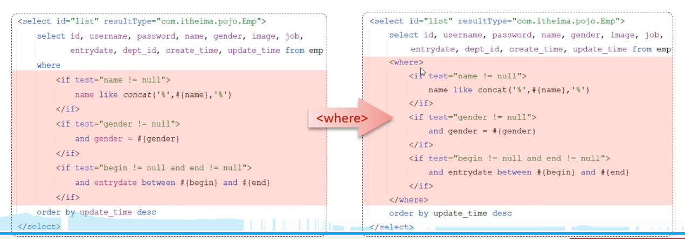
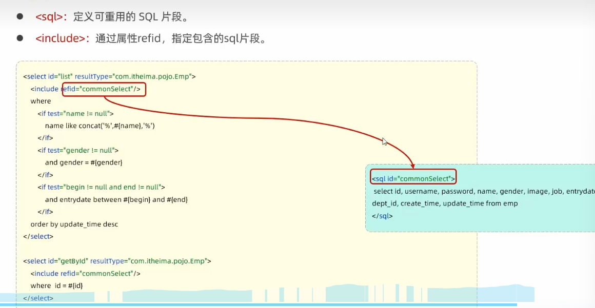

# Mybatis

## Mybatis入门

1. Mybatis是持久层（DAO层、用于操作数据库）的框架，用于简化JDBC的开发。

### JDBC和数据库连接池

1. JDBC是Java DataBase Connectivity，Java数据库连接，是一种用于执行SQL语句的Java API，有了JDBC就可以用统一的语法对多种关系数据库进行访问（MySQL、sqlServer等），不用担心因为MySQL和sqlServer的语法差异而写不同的程序。

2. JDBC代码，

上述图片中对比直接使用JDBC和Mybatis等持久层框架：JDBC每次执行一次查询语句都要先连接数据库，用完之后关闭连接，这个过程会降低程序响应速度造成资源的浪费，且需要大量繁琐代码逐个解析返回的数据。Mybatis等持久层框架帮我们解析好数据，并且使用**数据库连接池**的方式处理资源。

3. 数据库连接池是一个负责分配、管理数据库连接的容器，使用的时候从连接池中拿资源，用完放回连接池，因此**可以实现连接资源的复用，不用像JDBC那样频繁关闭、启用连接**。数据库连接池都要**实现DataSource这个标准接口**，常用的是Druid和Hikari追光者，springboot默认使用Hikari，每次查询数据库的时候能看到下图

### lombok

1. 是一个java类库，用的时候加到依赖里。用于给实体类自动生成getter，setter方法等，简化代码。常用的是下面三个：

```java
@Data // 等于@Getter + @Setter + @ToString + @EqualsAndHashCode
@NoArgsConstructor // 为实体类生成无参构造器
@AllArgsConstructor // 生成除了static字段之外的有参数的构造器
```

## Mybatis基础操作

1. Mybatis把查询语句写在mapper里，注解里面传原生的sql语句。如果需要传递参数，用#{}占位符，如#{id}。

```java
package com.itheima.mybatisDemo.mapper;

import com.itheima.mybatisDemo.pojo.User;
import org.apache.ibatis.annotations.Mapper;
import org.apache.ibatis.annotations.Select;

import java.util.List;

@Mapper  // @Mapper注解使得在运行时会自动生成该接口的实现类对象（代理对象），并将该对象交给IOC容器管理
public interface UserMapper {

  // 下面""里面写原生sql语句
    @Select("select * from user")
    public List<User> list();
}

```

2. sql预编译以及为什么要用#{}占位符

   (1). 预编译SQL会把#{}编译成问号?，执行的时候再传参，这样当仅仅是参数变化的时候就能重复使用缓存里的之前编译过的预编译sql, 多次查询只编译1次，提高效率。

   (2). 防止SQL注入（利用输入的数据修改原来的sql语句，如登录输入密码），如果不预编译成？，而是直接把参数拼进来形成sql语句，会发生sql注入。这样的话执行结果永远是true。

{}占位符是与编译成？然后传参；$()占位符是直接把参数拼接进SQL，不好。

3. 参数是对象的时候，#{}占位符里直接写对象的属性

4. MyBatis可以用两种方式执行sql，一是Mapper文件里使用注解@Insert,@Delete，@Update,@Select增删改查，二是为每个Mapper文件配置一个XML文件，把sql语句写在对应的标签里。

## XML和Mybatis动态SQL

1. XML映射文件的名字要与Mapper接口一致且同包同名；xml文件的namespace属性要与Mapper接口的全类命一致；xml文件中sql语句的id要与Mapper接口中的方法名一致。
1. 动态SQL就是根据查询条件的改变而改变的SQL语句 ==>就是JPA中的criteria... is NULL OR ..

### \<if>

1. if标签进行条件判断结果为true则拼接内部sql，同时把外层的where换成\<where>标签，\<where>标签只在内部有内容的时候才插入where子句，并自动去除子句开头的AND或OR。
2. 配合使用的有\<set>标签和\<where>标签

### \<foreach>

1. 循环用于参数是集合类型List\<Integer>的情况，如delete from tb_user where id in(1,2,3)。

foreach标签的属性collection是遍历的集合，item是元素，separator是拼接元素时用什么分隔符，open是遍历开始前拼接的sql片段，close是遍历结束后拼接的sql片段。

### \<sql> \<include>

1. 对于重复出现的sql代码可以抽取以便复用和维护，抽取出来的sql语句放在\<sql>标签中，在想用的地方使用\<include>标签完成引用。


Mybatis分页查询使用PageHelper分页插件
