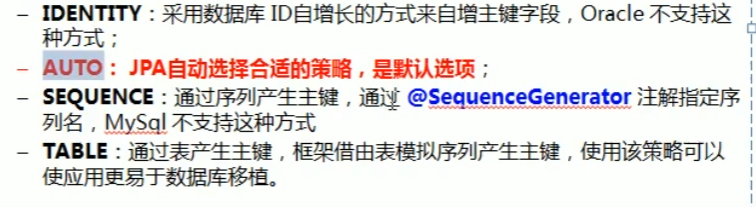
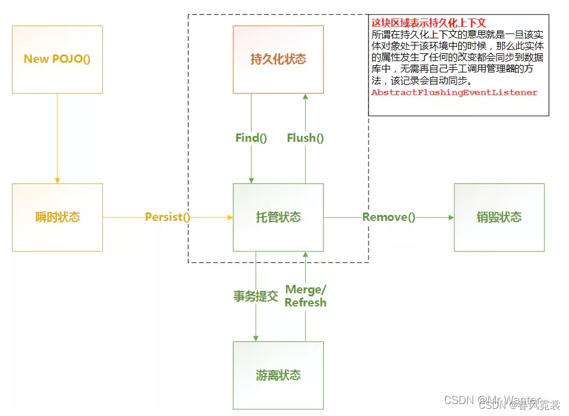
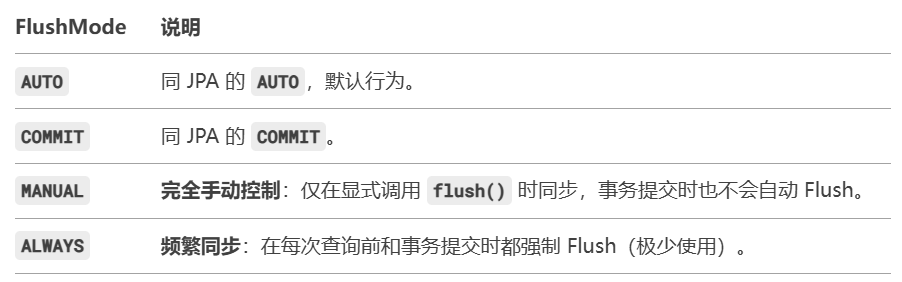

# JPA_Hibernate

## 概念

### 什么是ORM

1. ORM，Object relational mapping，对象关系映射的思想：把数据库中的表映射为java中的实体类，表中的字段映射为类的属性，表中具体数据映射为实体类的对象。

### JPA是什么，和Hibernate的关系

1. JPA全称Java Persistence API，是用于对象持久化的API，是java官方提供的用于对象关系映射(ORM)和数据持久化的**标准规范**。
2. JPA定义了一组标准和接口，如@Entity、@Table、@Column都是package javax.persistence包提供的。**Hibernate是对JPA的具体实现**。

### JPA常用注解

1. @Entity、@Table、@Id、@GeneratedValue、@Column（表的列名和entity字段不一样时使用@Column指定）
2. 其中GeneratedValue中GenerationType有四种值，其中Table是根据另外的数据表生成主键，SEQUENCE是通过序列产生主键，要指定是什么序列。

```java
package com.jpy.backend.modules.system.dao.entity;

import lombok.AllArgsConstructor;
import lombok.Builder;
import lombok.Data;
import lombok.NoArgsConstructor;
import lombok.ToString;

import javax.persistence.Column;
import javax.persistence.Entity;
import javax.persistence.GeneratedValue;
import javax.persistence.GenerationType;
import javax.persistence.Id;
import javax.persistence.OneToMany;
import javax.persistence.Table;
import java.util.List;

@Entity
@Data
@Table(name="sys_menu")
@NoArgsConstructor
@AllArgsConstructor
@Builder
@ToString(exclude = {"roleMenuList", "resources"})
public class Menu {

    @Id
    @GeneratedValue(strategy = GenerationType.IDENTITY)
    private Integer id;

    private String name;
    private String title;
    private String path;
    private String icon;
    private String component;
    private String module;

    @Column(name = "`order`")
    private Integer order;
    private Integer level;
    private Boolean noKeepAlive;
    private Integer parentId;
    private String redirect;
    private Boolean hidden;

    @OneToMany(mappedBy = "menu")
    private List<RoleMenu> roleMenuList;

    @OneToMany(mappedBy = "menu")
    private List<Resource> resources;

}

```

3. @Transient注解，entity中的属性不映射到数据表中。
4. @Temporal指定时间相关属性的精度，精确到到日还是时分秒。

### EntityManager的常用方法

1. 在JPA中EntityManager是操作持久化对象Entity的核心接口，负责管理实体对象的生命周期（如保存、更新、删除）以及与数据库的同步。

#### 实体类的生命周期



1. 瞬时状态transient，就是对象刚new出来，跟持久化上下文还没有关联，数据库中也没有数据与之对应。
2. **托管状态Managed**，new出来之后使用EntityManager的persist(Object entity)方法将实体对象变成托管状态。托管状态下的对象已经处于持久化上下文中，**对该实体对象的任何更新都会自动同步到数据库中**==> **对实体对象进行set但是不save，数据库也能自动更新**。
3. 删除状态Removed，EntityManager的remove(Object entity)方法，对象变为Removed状态，此时数据库马上会删除对应数据。
4. 游离状态detached，事务提交之后处于托管状态的对象转变为游离状态，或者EntityManager的detach，clear等方法，此时持久化上下文中没有该状态，**修改对象不会同步到数据库中**。

生命周期示意图

```java
  [New] → (persist) → [Managed] → (remove) → [Removed]
              ↑           |
              |           | (detach/clear/close)
              |           ↓
              +-------- [Detached] ← (merge)
```

1. 状态转换与关键操作：

   (1). 新建态 调用EntityManager.persist(entity) 方法后转为Managed托管态。

```java
User user = new User(); // 新建态（New）
user.setName("Alice");
entityManager.persist(user); // 转换为托管态（Managed）
```

   (2). 托管态（Managed） → 游离态（Detached），调用 EntityManager.detach(entity)或调用 EntityManager.clear()

```java
User user = entityManager.find(User.class, 1L); // 托管态
entityManager.detach(user); // 转换为游离态
user.setName("Bob"); // 修改不会同步到数据库
```

   (3). 游离态（Detached） → 托管态（Managed），调用 EntityManager.merge(entity)。

```java
User detachedUser = ...; // 游离态对象
User managedUser = entityManager.merge(detachedUser); // 重新关联为托管态
managedUser.setName("Charlie"); // 修改会同步到数据库
```

  (4).  托管态（Managed） → 删除态（Removed）,调用 EntityManager.remove(entity)。对象被标记为删除在数据库中马上被删除，但仍在内存中,实际删除操作在事务提交或 flush() 时执行。

#### EntityManager的常用方法

##### flush方法

1. 当程序修改了实体对象的时候，这些变更默认不会立即同步到数据库中，而是缓存在持久化上下文中，在需要更新到数据库的时候自动更新。
2. 那么具体什么时候会自动更新呢？EntityManager的setFlushMode()方法可以控制自动更新的条件，以下是**JPA中的flushMode**：

   (1). FlushModeType.AUTO,默认配置，自动同步，在执行查询和事务提交时更新；

   (2). FlushModeType.COMMIT,仅在事务提交时触发flush，查询前不会自动同步。
3. **Hibernate中的flushMode**基于JPA做了扩展，有MANUAL完全手动控制这个选项。
4. **如何设置flush mode**：

   (1). 全局更改flushMode，配置文件application。properties中设置spring.jpa.properties.org.hibernate.flushMode=COMMIT；

   (2). 局部更改flushMode，通过EntityManager的方法动态设置。因为在Spring中EntityManager通常是事务作用域或者请求作用域，**每个事务或请求会创建新的EntityManager实例**，在某个Service类中修改flushMode只会对当前线程关联的EntityManager/Session生效。

   ```java

    // 设置 JPA 规范的 Flush Mode
    entityManager.setFlushMode(FlushModeType. COMMIT);
  
     // 设置 Hibernate 扩展的 Flush Mode（需转换 为 Hibernate 的 EntityManager）
    Session session = entityManager.unwrap  (Session.class);
    session.setHibernateFlushMode(FlushMode.  COMMIT);

   ```

1. **手动flush**，EntityManager的flush()方法，调用flush()方法手动触发同步，强制将当前持久化上下文(Entity的状态)立即同步到数据库。但是**flush()仅同步数据，不提交事务**。

2. **项目中什么时候用到了flush方法**，InboundPlan和InboundPlanDetail是一对多的关系，更新一个InboundPlan的时候为了方便，是直接删除所有旧的InboundPlanDetail，然后生成新的InboundPlanDetail，再把新的InboundPlanDetail更新到InboundPlan上，方法如下：

```java
    @Transactional
    public void updateIP(Integer id, InboundPlanUpdateBO bo) {

      // 1. 查询InboundPlan（托管态）
        InboundPlan entity = inboundPlanProvider.findById(id);
        if(entity.getStatus() != InboundPlanStatus.PLAN || entity.getIwa() != null) {
            throw new BusinessException("CAN_NOT_EDIT_INBOUND_PLAN_WITH_IWA");
        }

        InboundPlan newEntity = inboundPlanProvider.updateIP(entity, bo);

        // 2. 删除旧的 InboundPlanDetail（会生成DELETE语句，但未立即执行）
        inboundPlanProvider.deleteAllDetails(entity.getInboundPlanDetails());
        List<InboundPlanDetail> details = generateDetails(newEntity, bo.getInboundPlanDetails());

        //3. 插入新的InboundPlanDetail（生成INSERT语句）
        inboundPlanProvider.saveAllPlanDetails(details);

    }
```

在deleteAllDetails中，删除旧的details时使用了flush方法手动同步上下文状态到数据库中：

```java
    public void deleteAllDetails(List<InboundPlanDetail> inboundPlanDetails) {
        detailRepository.deleteAllInBatch(inboundPlanDetails);
        entityManager.flush();
    }
```

上述事务中需要执行DELETE和INSERT语句，但**JPA的持久化上下文（Persistence Context）会缓存所有待执行的SQL语句，不会立即执行他们，会在事务提交的时候一次性发送到数据库**，而Hibernate可能会优化这些SQL的执行顺序，如上本来是先DELETE再INSERT，Hibernate可能会优化成先INSERT再DELETE，然后**数据库是按照接收顺序执行SQL语句的**。因此需要在delete时手动调用flush方法：

  (1). 保证最后业务逻辑的正确性，不然改成先INSERT后DELETE会把所有details删除；

  (2). 如果 InboundPlanDetail 表定义了 唯一约束Unique Constraint（例如 (plan_id, sku) 组合唯一），则 INSERT → DELETE 的执行顺序会导致唯一约束冲突：

  ```sql
    CREATE TABLE dbo.base_product_family (
        id int not null identity(1,1) primary key,
        name nvarchar(64),
        customer_id int,
        created_at datetime,
        created_by int,
        CONSTRAINT UQ_name_product_family UNIQUE(name, customer_id)
    )
    GO
  ```

  ```java
  -- 假设旧数据中存在 (plan_id=1, sku=100)
  INSERT INTO inbound_plan_detail (plan_id, sku) VALUES (1, 100);  -- 新数据插入
  DELETE FROM inbound_plan_detail WHERE plan_id = 1 AND sku = 100; -- 删除旧数据
  ```

  旧的details没删除就插入新的，二者的唯一约束冲突，导致SQL执行失败。

这里如果给deleteAllDetails方法使用@Transactional注解，事务传播性质时required_new也不行，因为required_new会单独开一个事务，如果整个更新操作失败的话deleteAllDetails方法无法回滚；嵌套事务也不行，嵌套事务的提交最终依赖于父事务，无法强制 DELETE 在 INSERT 前执行，仍需手动 flush() 或调整操作顺序。

##### 其他方法

1. clear()方法清空当前持久化上下文中的所有Entity对象，将其变为游离状态（detached），释放内存。
2. refresh()方法从数据库重新加载最近数据到实体中。

##### 如何得到Hibernate的Session对象

1. JPA的EntityManager是标准接口，底层可能由Hibernate的Session实现，通过EntityManager的unwrap方法可以得到Hibernate的Session对象。

```java
package com.jpy.backend.modules.wms.provider;

import com.jpy.backend.commons.BusinessException;
import com.jpy.backend.modules.wms.controller.ro.IPAndIWACriteria;
import com.jpy.backend.modules.wms.controller.ro.IPAndIWAStatusRO;
import com.jpy.backend.modules.wms.controller.ro.InboundPlanCriteria;
import com.jpy.backend.modules.wms.dao.dto.IPAndIWADTO;
import com.jpy.backend.modules.wms.dao.entity.InboundPlan;
import com.jpy.backend.modules.wms.dao.entity.InboundPlanDetail;
import com.jpy.backend.modules.wms.dao.entity.IntoWarehouseAppointment;
import com.jpy.backend.modules.wms.dao.repository.InboundPlanDetailRepository;
import com.jpy.backend.modules.wms.dao.repository.InboundPlanRepository;
import com.jpy.backend.modules.wms.service.bo.InboundPlanUpdateBO;
import com.jpy.backend.modules.wms.support.AppointmentStatus;
import com.jpy.backend.modules.wms.support.InboundPlanStatus;
import com.jpy.backend.util.PageUtils;
import lombok.RequiredArgsConstructor;
import org.hibernate.Session;
import org.springframework.data.domain.Page;
import org.springframework.stereotype.Component;

import javax.persistence.EntityManager;
import java.io.IOException;
import java.util.ArrayList;
import java.util.Arrays;
import java.util.List;
import java.util.Optional;

@Component
@RequiredArgsConstructor
public class InboundPlanProvider { 
  private final EntityManager entityManager;

  public void saveAllPlan(List<InboundPlan> plans) {

    // try with resource
    try (Session session = entityManager.unwrap(Session.class);) {
    } catch () {
    }
  }
}
```

### 领域驱动设计DDD

<https://blog.csdn.net/u010020088/article/details/143212173?ops_request_misc=&request_id=&biz_id=102&utm_term=%E9%A2%86%E5%9F%9F%E9%A9%B1%E5%8A%A8&utm_medium=distribute.pc_search_result.none-task-blog-2~all~sobaiduweb~default-1-143212173.142^v102^pc_search_result_base1&spm=1018.2226.3001.4187>

1. 领域驱动设计，DDD，全称Domain-Drived-Design。是一种以业务领域为核心的软件开发方法论，它由 Eric Evans 在《领域驱动设计》一书中提出，核心目标是将复杂的业务逻辑映射到代码中，确保软件模型与业务领域一致。
2. DDD设计的核心思想：

   (1). 领域模型Domain Model ：领域是业务问题本身，是软件要解决的核心问题如电商领域的订单、库存、支付等。模型是对领域的抽象，通过代码和设计表达业务规则。

   (2). 统一语言：开发团队与业务团队使用同一的业务语言进行沟通，防止歧义。

   (3). 限界上下文：同样的概念或语义在不同的上下文中可能会产生歧义，因此要明确语义所在的领域边界。

   (4). 分层架构：DDD架构通常包括领域层、应用层和基础设施层。领域层是核心，负责定义和实现领域模型和业务逻辑；应用层负责协调和组织领域层的操作；基础设施层负责与外部资源的交互。

3. DDD设计的步骤：

   (1). 需求分析

   (2). 领域分析

   (3). 领域建模

   (4). 核心业务逻辑实现

   (5). 技术细节实现

### Repository仓库

1. Spirng Data JPA的Repository遵循领域驱动设计的理念，实体类Entity对应的就是domain领域。
2. 使用org.springframework.data.jpa.repository的时候，需要领域(实体)类型和标识符类型(主键的类型)作为参数。

```java
public interface InboundPlanRepository extends JpaRepository<InboundPlan, Integer> { }
```

3. JpaRepository接口继承了PagingAndSortingRepository接口和QueryByExampleExecutor接口，PagingAndSortingRepository继承了CrudRepository接口，CrudRepository继承了Repository接口，因此JpaRepository内置了CRUD、分页、排序等功能。

4. 可以在项目中定义基础Repository，其他业务领域的Repository继承它：

```java
@NoRepositoryBean
interface MyBaseRepository<T, ID> extends Repository<T, ID> {

  Optional<T> findById(ID id);

  <S extends T> S save(S entity);
}

interface UserRepository extends MyBaseRepository<User, Long> {
  User findByEmailAddress(EmailAddress emailAddress);
}
```

5. **CrudRepository.save(Object entity)方法的底层是EntityManager的persist(Object entity)方法和merge(Object entity)方法**。

#### 查询

1. 原生sql和JPQL，Java Persistence Query Language的区别：

   (1). 原生sql是面向数据库表，JPQL是面向对象;

   (2). 查询时原生sql基于数据库表名和列名，JPQL是基于实体类名和属性名，上述查询中wms_inbound_info是数据库表名，InboundInfo是实体类名；

   (3). 关联查询原生sql要join，JPQL可以通过属性隐式关联，如:

   ```java
   -- 查询用户及其部门名称（User 实体关联 Department 实体）
    SELECT u.name, u.department.name FROM User u
   ```

   ```java
    -- 查询用户及其部门名称（需手动关联表）
    SELECT u.name, d.name 
    FROM users u 
    LEFT JOIN departments d ON u.department_id = d.id
   ```

2. 简单查询可以直接用方法名创建查询

```java
interface PersonRepository extends Repository<Person, Long> {

  List<Person> findByEmailAddressAndLastname(EmailAddress emailAddress, String lastname);

  // Enables the distinct flag for the query
  List<Person> findDistinctPeopleByLastnameOrFirstname(String lastname, String firstname);
  List<Person> findPeopleDistinctByLastnameOrFirstname(String lastname, String firstname);

  // Enabling ignoring case for an individual property
  List<Person> findByLastnameIgnoreCase(String lastname);
  // Enabling ignoring case for all suitable properties
  List<Person> findByLastnameAndFirstnameAllIgnoreCase(String lastname, String firstname);

  // Enabling static ORDER BY for a query
  List<Person> findByLastnameOrderByFirstnameAsc(String lastname);
  List<Person> findByLastnameOrderByFirstnameDesc(String lastname);
}
```

3. 复杂的查询使用@Query注解：

   (1). 使用@Query注解的nativeQuery = true属性可以使用原生sql；

   (2). **@Param()注解通过命名参数**绑定方法的形参和查询中的参数，**命名参数要用冒号:占位符**

   ```java
    @Query("SELECT n FROM InboundInfo n WHERE n.contractNo = :contractNo")
    List<InboundInfo> findByContractNo(@Param("contractNo") String contractNo);   
   ```

   (3). 对于下方的:#{#criteria.inboundId}语法，其中**第一个冒号:是@param命名参数占位符**，后面的#{}是SpEL，Spring Expression Language，Spring表达式语言，**SpEL遵循Template样式，表达式要写在#{...}里面**,**第二个#criteria是SpEL的引用参数，表示引用**方法参数@Param("criteria")中标记的**criteria对象**。

```java
package com.jpy.backend.modules.wms.dao.repository;

import com.jpy.backend.modules.wms.dao.criteria.InboundInfoCriteria;
import com.jpy.backend.modules.wms.dao.dto.InboundInfoDTO;
import com.jpy.backend.modules.wms.dao.entity.AvailableOrderNumber;
import com.jpy.backend.modules.wms.dao.entity.InboundInfo;
import com.jpy.backend.modules.wms.service.bo.OrderNumberCriteria;
import java.util.List;

import org.springframework.data.jpa.repository.JpaRepository;
import org.springframework.data.jpa.repository.Query;
import org.springframework.data.repository.query.Param;

public interface InboundInfoRepository extends JpaRepository<InboundInfo, Integer> {

    @Query(value = "select n from InboundInfo n where " +
            "n.factory.id = :#{#criteria.factoryId} and " +
            "(:#{#criteria.inboundId} is null or n.inboundId = :#{#criteria.inboundId}) and " +
            "(:#{#criteria.inboundType} is null or n.inboundType = :#{#criteria.inboundType}) and " +
            "(:#{#criteria.inboundDetailId} is null or n.inboundDetailId = :#{#criteria.inboundDetailId}) and " +
            "(:#{#criteria.customerId} is null or n.customer.id = :#{#criteria.customerId}) and " +
            "(:#{#criteria.isPalletCodeListEmpty} = 1 or n.palletCode in :#{#criteria.palletCodeList}) and " +
            "(:#{#criteria.warehouseLocationCode} is null or n.warehouseLocationCode = :#{#criteria.warehouseLocationCode}) and " +
            "(:#{#criteria.contractNo} is null or n.contractNo like :#{#criteria.contractNo}) and " +
            "(:#{#criteria.processStatus} is null or n.processStatus = :#{#criteria.processStatus}) and " +
            "(:#{#criteria.contractTypeCode} is null or n.contractTypeCode = :#{#criteria.contractTypeCode})"
    )
    List<InboundInfo> query(@Param("criteria") InboundInfoCriteria criteria);

    @Query(value = "select n.id as inboundInfoId, n.warehouse_location_code as warehouseLocationCode, n.quantity as quantity, c.id as cargosScheduledForProduceId from wms_inbound_info n left join produce_cargos_scheduled_for_produce c on (n.id = c.inbound_info_id) where " +
            "n.factory_id = :#{#criteria.factoryId} and " +
            "(:#{#criteria.inboundId} is null or n.inbound_id = :#{#criteria.inboundId}) and " +
            "(:#{#criteria.inboundType} is null or n.inbound_type = :#{#criteria.stringInboundType}) and " +
            "(:#{#criteria.inboundDetailId} is null or n.inbound_detail_id= :#{#criteria.inboundDetailId}) and " +
            "(:#{#criteria.customerId} is null or n.customer_id = :#{#criteria.customerId}) and " +
            "(:#{#criteria.isPalletCodeListEmpty} = 1 or n.pallet_code in :#{#criteria.palletCodeList}) and " +
            "(:#{#criteria.warehouseLocationCode} is null or n.warehouse_location_code = :#{#criteria.warehouseLocationCode}) and " +
            "(:#{#criteria.contractNo} is null or n.contract_no like :#{#criteria.contractNo}) and " +
            "(:#{#criteria.processStatus} is null or n.process_status = :#{#criteria.stringProcessStatus}) and " +
            "(:#{#criteria.contractTypeCode} is null or n.contract_type_code = :#{#criteria.contractTypeCode}) and " +
            "not (exists (select 1 from produce_cargos_scheduled_for_produce c1 inner join wms_inbound_info i1 on (c1.inbound_info_id = i1.id) " +
            "where " +
            "(i1.id = n.id) and " +
            "(i1.quantity = c1.scheduled_amount)))", nativeQuery = true)
    List<InboundInfoDTO> findToBeScheduledForProduce(@Param("criteria")InboundInfoCriteria criteria);


}

```

##### 分页查询

1. 实现分页查询的功能步骤：

   (1). 在对应的Repository中定义查询方法，Page和Pageable都是Spring data提供的接口。Page<T>接口extends Slice<T>接口，Slice接口提供方法获取查询的具体结果，如getContent()方法。

   ```java
   // Page接口，给出的一个页面是一个对象列表的子列表，CrudRepository的count方法计算共有多少条
   import org.springframework.data.domain.Page;
   // Pageable接口，用于提供分页信息。
   import org.springframework.data.domain.Pageable;

   Page<User> findByLastname(String lastname, Pageable pageable);
   ```

   (2). 定义公用的PageRequestInfo对象用于接收请求中分页查询的参数，InboundDetailCriteria extends PageRequestInfo用于接收分页查询其他参数。

```java
package com.jpy.backend.commons;

import com.jpy.backend.modules.support.SortOrder;
import io.swagger.v3.oas.annotations.media.Schema;
import lombok.Data;
import lombok.experimental.SuperBuilder;

@Data
public class PageRequestInfo {

    @Schema(description = "每页记录数", implementation = Integer.class)
    private int pageSize = 10; // 设置默认值

    @Schema(description = "页数，基于0", implementation = Integer.class)
    private int pageNum = 0;

    @Schema(description = "排序字段")
    private String sortColumn;

    @Schema(description = "排序方式", implementation = SortOrder.class)
    private SortOrder sortOrder;
}

```

   (2). 根据请求中的分页信息即对应的criteria生成package org.springframework.data.domain.PageRequset类的实例，PageRequest实现了Pageable接口。主要是根据分页信息调用**package org.springframework.data.domain.PageRequset类的静态方法of(int page, int size, Sort sort)**

   ```java
   package org.springframework.data.domain;
   import org.springframework.data.domain.Sort.Direction;

   public static PageRequest of(int page, int size, Sort sort) {
    return new PageRequest(page, size, sort);
   }
   ```

   ```java

   import org.springframework.data.domain.PageRequest;
   import org.springframework.data.domain.Sort;

    public static PageRequest buildPageRequest(PageRequestInfo info) {
        PageRequest page;
        if (info == null) {
            return null;
        }

        if (info.getSortOrder() != null && StringUtils.isNotEmpty(info.getSortColumn())) {
         // Sort.by()方法返回Sort类型
            Sort sort = info.getSortOrder().equals(SortOrder.ASC) ?
                    Sort.by(info.getSortColumn()).ascending()
                    :
                    Sort.by(info.getSortColumn()).descending();
            page = PageRequest.of(info.getPageNum(), info.getPageSize(), sort);
        } else {
            page = PageRequest.of(info.getPageNum(), info.getPageSize());
        }
        return page;
    }
   ```

#### JPQL 出现N+1问题

1. <https://blog.csdn.net/zkn_CS_DN_2013/article/details/17114497>
2. CUSTOMERS中@OneToMany关联了ORDERS，查询CUSTOMERS的时候JPA会以下代码，会执行N+1次查询，导致查询速度很慢。

```sql
select * from CUSTOMERS; //这条是1，下面是N，查出几个客户N就是几
select * from ORDERS where CUSTOMER_ID=1;
select * from ORDERS where CUSTOMER_ID=2;
select * from ORDERS where CUSTOMER_ID=3;
select * from ORDERS where CUSTOMER_ID=4;
```

3. 解决办法：

   (1). 不需要关联对象的时候把关联对象的fetchType设置为lazy;

   (2). 需要关联对象的时候，可以使用JOIN FETCH迫切左连接，或者写原生SQL左连接，这样的话就只执行一次查询。

    ```java
    @Query("SELECT u FROM User u LEFT JOIN FETCH u. orders")
    List<User> findAllWithOrders();
    ```

    ```sql
    SELECT u.*, o.*
    FROM User u
    LEFT JOIN Order o ON u.id = o.user_id;
    ```

    (3). 通过使用DTO，可以精确控制返回的数据结构，避免加载不必要的数据

#### 审计 Auditing

1. Spring Data JPA中的Auditing审计就是跟踪创建、修改实体对象的人员和发生的时间，主要是四个注解@CreatedDate、@CreatedBy、@LastModifiedDate、@LastModifiedBy。

2. 具体使用，一般建立BaseEntity作为公共基础映射，给其他实体类继承，配合@MappedSuperclass注解和@EntityListeners注解使用。

   (1). @MappedSuperclass注解表明该类是用于给其他entity继承的，是一个映射的超类，他不会单独被映射到数据库表中。

   (2). @EntityListeners注解用于监听实体类，它可以将一个或多个监听器与实体类关联，当实体类发生特定事件时，这些监听器会被触发执行相应的逻辑。

```java
package com.jpy.backend.commons;

import lombok.Data;
import org.springframework.data.annotation.LastModifiedBy;
import org.springframework.data.annotation.LastModifiedDate;

import javax.persistence.MappedSuperclass;
import java.time.Instant;

@Data
@MappedSuperclass // 表明是用于给其他entity继承的，是一个映射的超类，他不会单独被映射到数据库表中。
public class UpdatableEntity extends BaseEntity {

    @LastModifiedDate
    private Instant updatedAt;

    @LastModifiedBy
    private Integer updatedBy;
}

```

```java
package com.jpy.backend.commons;

import com.jpy.backend.auditor.jpa.DictCodeListener;
import lombok.Data;
import org.springframework.data.annotation.CreatedBy;
import org.springframework.data.annotation.CreatedDate;
import org.springframework.data.jpa.domain.support.AuditingEntityListener;

import javax.persistence.Column;
import javax.persistence.EntityListeners;
import javax.persistence.MappedSuperclass;
import java.time.Instant;

@Data
@MappedSuperclass // 表明是用于给其他entity继承的，是一个映射的超类，他不会单独被映射到数据库表中。

// @EntityListeners用于监听实体类。
@EntityListeners({AuditingEntityListener.class, DictCodeListener.class})
public class BaseEntity {
    @CreatedDate
    @Column(updatable = false)
    private Instant createdAt;

    @CreatedBy
    @Column(updatable = false)
    private Integer createdBy;
}

```

#### @EntityListeners实体类的监听

1. @EntityListeners用在实体类上，给实体类绑定一个或多个监听器，当实体类发生创建、更新、删除等事件时，监听器中使用了@PrePersist、@PreUpdate、@PreRemove等注解的对应回调方法就会执行。
2. 以@DictCode为例，实体类的属性加上自定义注解@DictCode的字段，通过DictCodeListener类监听实体类，在创建和更新的时候自动根据字典code填充字段值。

   (1). 自定义注解

   ```java
   package com.jpy.backend.commons.annotation;

   import java.lang.annotation.ElementType;
   import java.lang.annotation.Retention;
   import java.lang.annotation.RetentionPolicy;
   import java.lang.annotation.Target;

   @Target(ElementType.FIELD)
   @Retention(RetentionPolicy.RUNTIME)
   public @interface DictCode {
   }

   ```  

   (2). 业务实体都继承了BaseEntity，@EntityListeners添加监听器

   ```java
   package com.jpy.backend.commons;

   @Data
   @MappedSuperclass // 表明是用于给其他entity继承的，数据库中没有单独的对应表
   @EntityListeners({AuditingEntityListener.class, DictCodeListener.class})
   public class BaseEntity {}
   ```

   (3). 监听器中在对应的回调方法添加@PrePersist，@PreUpdate注解，利用反射筛选标注了@DictCode的field，使用org.apache.commons.beanutils.BeanUtils工具类修改实体类的属性值，给对应的dictname字段赋值。

   ```java

    package com.jpy.backend.auditor.jpa;

    import com.jpy.backend.commons.annotation.DictCode;
    import com.jpy.backend.config.ApplicationContextProvider;
    import com.jpy.backend.modules.system.dao.entity.Dict;
    import com.jpy.backend.modules.system.provider.DictProvider;
    import lombok.extern.slf4j.Slf4j;
    import org.apache.commons.beanutils.BeanUtils;
    import org.apache.commons.lang3.StringUtils;

    import javax.persistence.PrePersist;
    import javax.persistence.PreUpdate;
    import java.lang.reflect.Field;
    import java.util.Arrays;
    import java.util.List;
    import java.util.stream.Collectors;

    @Slf4j
    public class DictCodeListener {

        @PrePersist  // 在创建之前（这个是JPA实体的生命周期）
        private void prePersist(Object entity) {
            fillDictCode(entity);
        }

        @PreUpdate // 在更新之前（这个是JPA实体的生命周期）
        private void preUpdate(Object entity) {
            fillDictCode(entity);
        }

        private void fillDictCode(Object entity) {
            //获得实体对象的所有属性
            Field[] fields = entity.getClass().getDeclaredFields();  // declared只获取该类自己声明的属性。
            //f.isAnnotationPresent(DictCode.class) 找到标注了@DictCode注解的字段
            List<Field> dictCodeFields = Arrays.stream(fields).filter(f -> f.isAnnotationPresent(DictCode.class)).collect(Collectors.toList());

            for (Field field: dictCodeFields) {
                String codeFieldName = field.getName();
                String valueFieldName = codeFieldName.substring(0, codeFieldName.length() - 4);

                String code = null;
                try {
                    // 返回entity的codeFieldName属性的值。
                    // BeanUtils是通过反射填充JavaBean对象属性的工具类
                    code = BeanUtils.getProperty(entity, codeFieldName);
                } catch (Exception ex) {
                    log.error("Error --> ", ex);
                }

                if (StringUtils.isNotEmpty(code)) {
                    // 手动获取dictProvider的Bean对象
                    DictProvider dictProvider = ApplicationContextProvider.getContext().getBean(DictProvider.class);
                    Dict dict = dictProvider.findByCode(code).orElse(null);
                    if (dict != null) {
                        String codeValue = dict.getName();
                        try {
                            // 给entity设置valueFieldName的值为codeValue
                            BeanUtils.setProperty(entity, valueFieldName, codeValue);
                        } catch (Exception ex) {
                            log.error("Error -->", ex);
                        }
                    }
                }
            }
        }
    }

   ```

3. JPA监听器不能注册为SpringBean，因为JPA的监听器类的实例化由JPA提供商(如Hibernate)负责，而非Spring管理，即new监听器实例的过程不是Spring管理的，所以不能用@Component注册为SpringBean，解决办法：

   (1). 像上述代码中使用ApplicationContext手动获取Spring bean对象。

   (2). 其他办法参考<https://blog.csdn.net/changqing5818/article/details/131344180?ops_request_misc=&request_id=&biz_id=102&utm_term=EntityListeners%20ApplicationCon&utm_medium=distribute.pc_search_result.none-task-blog-2~all~sobaiduweb~default-0-131344180.142^v102^pc_search_result_base1&spm=1018.2226.3001.4187>
