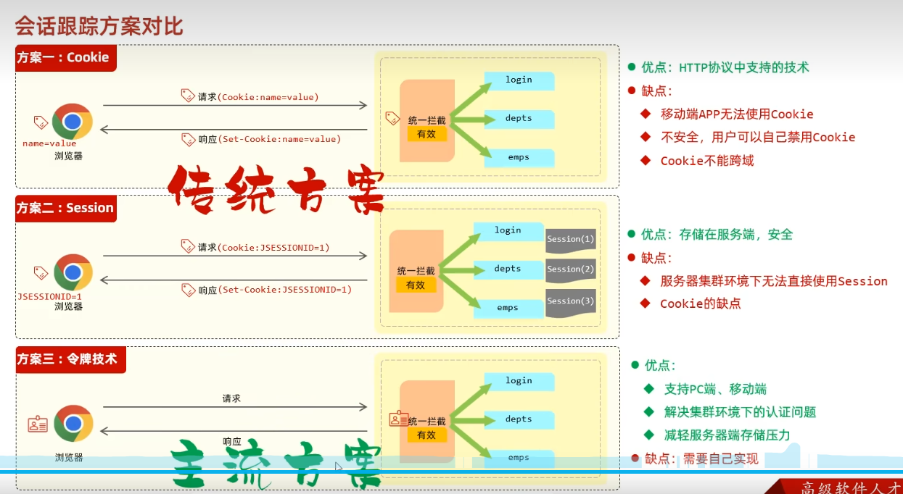
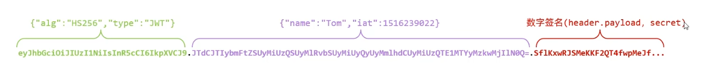
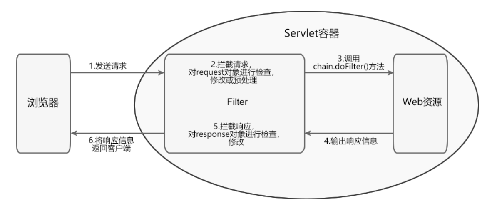
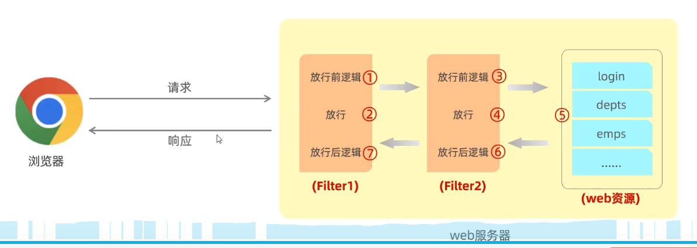
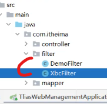
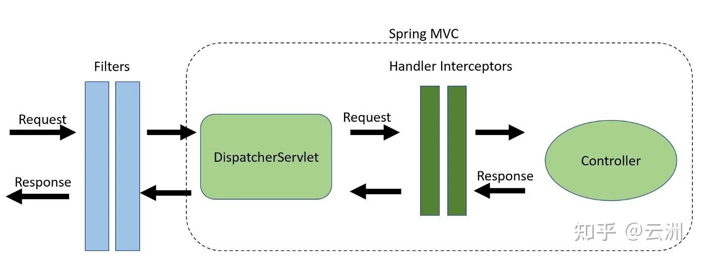
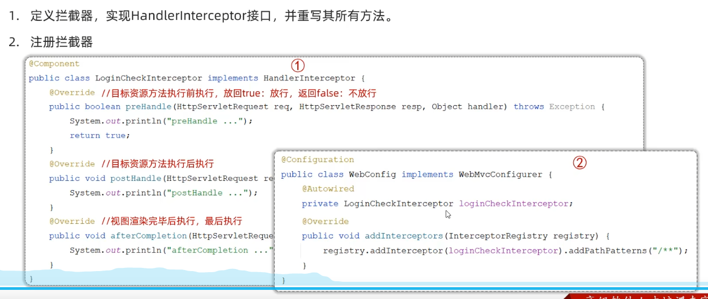
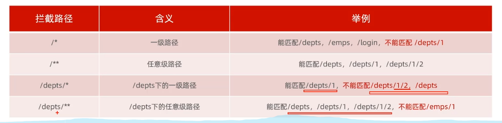

# 登录认证

## 登录功能

1. 去数据库匹配用户名和密码，是否正确，正确则返回token。

2. JPY项目的登录实现: 前端请求中的密码是base64编码过的，后端拿到后经过base64解码得到raw密码(下面的plainText)。后端根据用户名查询到数据库中的用户名和密码，跟raw密码做对比，一致则登录成功。细节：

   (1). 数据库表中保存的密码是使用passwordEncoder.encode(plainText)方法加密过的，不是raw密码。

   (2). 验证/匹配密码的时候使用passwordEncoder.matches(plainText, encodedPassword)方法对比两者是否一致。

```java
package com.jpy.backend.modules.system.provider;

import com.auth0.jwt.JWT;
import com.auth0.jwt.algorithms.Algorithm;
import com.jpy.backend.modules.system.dao.entity.User;
import com.jpy.backend.modules.system.dao.entity.UserFactory;
import com.jpy.backend.modules.system.dao.entity.UserRole;
import com.jpy.backend.modules.system.dao.repository.RoleRepository;
import com.jpy.backend.modules.system.service.support.LoginType;
import lombok.RequiredArgsConstructor;
import org.apache.commons.collections.CollectionUtils;
import org.springframework.beans.factory.annotation.Value;

//SpringSecurity框架提供的接口，使用BCrypt算法加密密码。
// BCrypt算法是一种基于Blowfish加密算法的密码哈希算法，专门为密码加密而设计，安全性高。
import org.springframework.security.crypto.password.PasswordEncoder; 
import org.springframework.stereotype.Component;

import java.time.Instant;
import java.time.temporal.ChronoUnit;
import java.util.Arrays;
import java.util.List;
import java.util.stream.Collectors;

import static com.jpy.backend.modules.system.support.SystemConstants.SUPER_ADMIN_ROLE_NAME;
import static com.jpy.backend.modules.system.support.SystemConstants.SUPER_ADMIN_USER_NAME;

@Component
@RequiredArgsConstructor
public class SecurityProvider {

    private final PasswordEncoder passwordEncoder;
    private final RoleRepository roleRepository;

    @Value("${security.jwt.secret}")
    private String jwt_secretKey;

    @Value("${security.jwt.token.valid.duration}")
    private Integer jwt_valid_duration;

    public String encodePassword(String plainText) {
        return passwordEncoder.encode(plainText);
    }

    public boolean verifyPassword(String plainText, String encodedPassword) {
        return passwordEncoder.matches(plainText, encodedPassword);
    }

}

```

密码匹配成功后userLogin这张表（记录了userId，token，登陆类型和时间等）中删除该用户之前的登录信息，新建这次登录信息，然后生成新的JWT令牌并返回。

```java
    public String generateToken_mobile(User user, Integer factoryId, Integer roleId, LoginType type) {
        return JWT.create()  //新建一个JWT
                .withSubject(user.getId().toString()) // 用用户id设置JWT的主题
                .withClaim("roleId", roleId) //一下根据用户角色id，工厂id，登陆类型添加声明
                .withClaim("factoryIds", Arrays.asList(factoryId))
                .withClaim("type", type.name())
                .withExpiresAt(Instant.now().plus(jwt_valid_duration, ChronoUnit.SECONDS)) // 设置过期时间
                .sign(Algorithm.HMAC512(jwt_secretKey)); // 使用HMAC512算法和jwt_secretKey密钥对JWT进行签名，密钥(jwt_secretKey)是保存在application.properties文件中的一个字符串。
    }
```

3. base64编码不是一种加密方式，不提供任何安全性，为了保证密码在传输过程中的安全性，应该使用HTTPS协议。

### 会话跟踪方案

1. 会话就是：用户打开浏览器，访问web服务器的资源，建立会话，直到有一方断开连接会话结束。==> 一次会话中会包含多次请求和响应，同一个浏览器中打开多个窗口都属于同一个会话。
2. 既然同一会话会包含多次请求，但是HTTP是无状态的，服务端无法识别不同请求是不是来自同一会话，无法共享数据（如判断请求来自的会话是否已经经过登陆验证），因此提出以下会话跟踪方案：

   (1). Cookie,客户端会话跟踪技术。用户访问网站时**服务器生成Cookie内容**并设置在响应头的Set-Cookie字段然后发送给客户端，但是服务器自己不保存这个Cookie的内容。客户端接收到之后把Cookie保存下来，客户端保存并管理自己的Cookie，在后续的请求中通过请求头中的Cookie字段把Cookie内容发给服务器。服务器根据Cookie内容识别用户。

   (2). Session,服务端会话跟踪技术。当用户首次访问网站时，**服务器**会为该用户**创建**一个唯一的会话ID(**Session ID**), 并通过**响应头中的Set-Cookie字段将Session ID发送给客户端**。客户端接收并把Session ID保存在本地Cookie中，在后续的请求中在请求头的Cookie字段携带Session ID， 服务器就知道这个请求来自哪个会话。

   (3). JWT令牌技术。登录成功之后服务端返回令牌给客户端，客户端之后的请求都要带上令牌，服务端根据请求中的令牌信息来识别用户和授权访问。

3. 上面的**服务器不保存Cookie的具体内容**和服务器根据Cookie内容识别用户不矛盾，如Session的应用就是基于Cookie，**服务器保存会话相关的信息**，如果Cookie的内容是Session ID，服务器拿到之后会根据Session ID查找相关会话信息。
4. 上述方案的优缺点分析：

   (1). Cookie不能跨域，即服务器和浏览器不跨域才能使用；

   (2). 移动端无法使用Cookie，**只有浏览器能使用Cookie**。
  
   (3). Session是基于Cookie使用的所以通常Session也不能跨域使用，要想跨域使用Session需要额外的配置（如CORS跨域资源共享、代理服务器等）.

   (4). 服务器集群环境(大型项目会使用多台服务器，请求来了会被分发给他们)下不知道请求会被分配给具体哪个服务器，不知道Session ID具体存在哪个服务器，所以无法使用Session。

   (5). JWT令牌没有以上缺点，但是需要自己代码实现。

5. 令牌里面还可以存储数据，达到请求之间的共享数据。

### JWT令牌

#### JWT的概念和生成

1. JWT全程JSON WEB TOKEN。是一种简洁的，能自定义payload内容的，基于JSON数据格式的，经过数字签名加密的安全通信方式。 为什么说JWT是基于JSON数据格式的，因为他是基于JSON数据编码或加密的。
2. JWT的组成, Header和Payload是base64编码，签名是加密过的，三者用"."拼成一个字符串形成JWT：

  (1). Header部分，记录签名的算法和令牌的类型

  ```json
    {
      "alg": "HS256",
      "typ": "JWT"
    }
  ```

  (2). Payload部分，自定义的Claims声明，包括subject主题（通常是用户id），过期时间，签发方接收方以及其他自定义内容。

  ```json
  {
  "sub": "1234567890",
  "name": "John Doe",
  "exp": 15323232,
  "roleId": 111,
  }
  ```

  (3). Signature签名，生成签名需要使用**签名算法**对**Header** + **Payload** + **存放在服务端的密钥**三部分进行签名，签名的计算公式如下：

  ```
  HMACSHA256(
  base64UrlEncode(header) + "." +
  base64UrlEncode(payload),
  secret)
  ```

3. 项目中如何生成JWT：

   ```java
   import com.auth0.jwt.JWT;
    import com.auth0.jwt.algorithms.Algorithm;
    ...

    public String generateToken_mobile(User user, Integer factoryId, Integer roleId, LoginType type) {
        return JWT.create()
                .withSubject(user.getId().toString())  // 主题，payload的一种
                .withClaim("roleId", roleId)  // 其他自定义payload
                .withClaim("factoryIds", Arrays.asList(factoryId)) // 其他自定义payload
                .withClaim("type", type.name()) // 其他自定义payload
                .withExpiresAt(Instant.now().plus(jwt_valid_duration, ChronoUnit.SECONDS))  // 过期时间，payload的一种
                .sign(Algorithm.HMAC512(jwt_secretKey));  // HMAC512算法，jwt_secretKey变量是保存在配置文件中的密钥，是一个字符串。
    }
   ```

使用的是Auth0实现的JWT类库

```xml
  <dependency>
   <groupId>com.auth0</groupId>
   <artifactId>java-jwt</artifactId>
   <version>4.4.0</version>
  </dependency>
```

#### JWT的解析

1. 解析JWT令牌时使用的密钥要和生成JWT令牌时用的一致，才能成功解析。

## 登录校验

1. 服务器需要校验请求中的JWT令牌是否有效，对请求进行统一拦截，统一拦截有两个方案 过滤器Filter和拦截器Interceptor。

### Filter

#### Filter概念

<https://c.biancheng.net/servlet2/filter.html>

1. javax.servlet.Filter接口是Servlet规范里的，Filter的功能：

   (1). 在Web资源被访问前，检查request对象，修改请求头和请求正文，或对请求进行预处理操作；

   (2). 将请求放行给下一个过滤器或者目标资源；

   (3). 在Web资源被访问后，检查response对象，修改响应头和响应正文。

2. Filter接口主要有三个方法：

   (1). void init(FilterConfig filterConfig) 用于初始化过滤器；

   (2). void doFilter(ServletRequest request,SeivletResponse response, FilterChain chain) 该方法里面写实际的过滤操作；参数chain代表当前Filter链对象，在该方法内部调用chain.doFilter()对象，才能进行请求的放行；

   (3). void destory() 在销毁Filter对象之前被调用，用于释放被Filter对象占用的资源。

3. Filter的工作流程

#### Filter使用的入门

1. 在类上**使用@WebFilter注解**(类包package jakarta.servlet.annotation提供的注解)，用于**将这个类声明为Servlet过滤器并将它交给springboot容器管理**，并指定过滤器过滤哪些URL。

   (1). 其中init方法在过滤器的生命周期中只执行一次，就是在服务器启动的时候执行，用于初始化过滤器、执行一次性的设置；

   (2). destroy方法在服务器关闭的时候执行一次，用于销毁过滤器，通常执行资源清理工作；

   (3). doFilter用于写登录校验逻辑。这三个方法都是重写的package jakarta.servlet.Filter接口的方法;

```java
package com.itheima.mybatisDemo.filter;

import ch.qos.logback.core.util.StringUtil;
import jakarta.servlet.*;
import jakarta.servlet.annotation.WebFilter;
import jakarta.servlet.http.HttpServletRequest;
import jakarta.servlet.http.HttpServletResponse;
import lombok.extern.slf4j.Slf4j;
import org.springframework.util.StringUtils;

import java.io.IOException;

@Slf4j
@WebFilter(urlPatterns = "/*") // 表示这是一个Servlet组件：filter，并且把他交给容器处理，urlPatterns是拦截路径。
public class DemoFilter implements Filter {
    @Override  // init是初始化方法只调用一次
    public void init(FilterConfig filterConfig) throws ServletException {
//        Filter.super.init(filterConfig);
        System.out.println("init初始化方法执行了");
    }


    @Override // 每次拦截请求都会执行
    public void doFilter(ServletRequest servletRequest, ServletResponse servletResponse, FilterChain filterChain) throws IOException, ServletException {
//        一、获取请求的url
        HttpServletRequest req = (HttpServletRequest) servletRequest;
        HttpServletResponse res = (HttpServletResponse) servletResponse;
        String url = req.getRequestURL().toString();
// login请求可以放行
        if(url.contains("login")) {
            filterChain.doFilter(servletRequest,servletResponse);
            return;
        }

//        其他请求要解析token是否合法有效，无效则返回失败信息，有效则放行该请求
        String jwt = req.getHeader("token");
        if(!StringUtils.hasLength(jwt)) {
            log.info("请求头token为空，返回未登录的信息");
            res.getWriter().write("请求头token为空，返回未登录的信息");
        } else {
            ...
            filterChain.doFilter(servletRequest,servletResponse);
        }
    }

    @Override // 销毁方法，只调用一次
    public void destroy() {
        System.out.println("destroy方法执行了");
        Filter.super.destroy();
    }
}

```

2. Filter是Servlet组件的一种，Servlet是Java编写的服务器端组件，用于处理客户端的HTTP请求并生成动态的Web内容，Tomcat就是Servlet容器。
3. Servlet组件有：

   (1). 简单Servlet主要用于处理请求；

   (2). Filter过滤器,用于拦截和预处理进入Servlet容器的请求以及响应结果的组件；

   (3). Listener监听器,用于监听Servlet容器中特定事件并作出响应的组件
4. springboot默认情况下不会扫描Servlet组件，因此**使用Filter要在主应用类上使用@ServletComponentScan来启动这种扫描**。这是springboot提供的注解。

```java
package com.itheima.mybatisDemo;

import org.springframework.boot.SpringApplication;
import org.springframework.boot.autoconfigure.SpringBootApplication;
import org.springframework.boot.web.servlet.ServletComponentScan;

@ServletComponentScan // 启动扫描Servlet组件
@SpringBootApplication
public class MybatisDemoApplication {

 public static void main(String[] args) {
  SpringApplication.run(MybatisDemoApplication.class, args);
 }

}

```

#### Filter的执行流程

1. filterChain.doFilter(request,response)表示放行当前请求，通常放行前面写一些其他验证操作，如果放行请求执行完毕之后会回到过滤器中，继续执行放行操作之后的操作：

```java
...

    protected void doFilterInternal(HttpServletRequest request, HttpServletResponse response, FilterChain filterChain) throws ServletException, IOException {

        if (!anonymousPath.contains(request.getRequestURI())) {
            String header = request.getHeader("Authorization");
            if (header == null || !header.startsWith("Bearer ")) {
                _401_result(response);
                return;
            }

            // check if token valid
            UserLogin userLogin = userProvider.queryToken(header);
            if (userLogin == null) {
                _401_result(response);
                return;
            }

            // token是否过期
            Duration duration = Duration.between(userLogin.getLastUpdatedAt(),Instant.now());
            if(duration.toSeconds() > inactiveExpiredTime) {
                _401_result(response);
                return;
            }

            String token = header.replace("Bearer ", "");
            DecodedJWT decodedJWT;
            try {
                decodedJWT = JWT.require(Algorithm.HMAC512(secret)).build().verify(token);
            } catch (Exception ex) {
                _401_result(response);
                return;
            }

            if (decodedJWT != null) {
                Instant now=Instant.now();
                userProvider.updateUserLogin(header,now);
                UserInfo userInfo = new UserInfo();
                userInfo.setUserId(Integer.valueOf(decodedJWT.getSubject()));

                Claim roleIdClaim = decodedJWT.getClaim("roleId");
                if(roleIdClaim != null && !roleIdClaim.isMissing() && !roleIdClaim.isNull()) {
                    userInfo.setRoleId(roleIdClaim.asInt());
                }

                LoginType type = null;
                Claim typeClaim = decodedJWT.getClaim("type");
                if(typeClaim != null && !typeClaim.isMissing() && !typeClaim.isNull()) {
                    type = LoginType.valueOf(typeClaim.asString());
                }

                if (type == LoginType.PC) {
                    if (userInfo.getRoleId() != null && roleProvider.checkPermission(userInfo.getRoleId(), request.getRequestURI(), request.getMethod())) {

                    } else {
                        _403_result(response);
                        return;
                    }
                }

                Claim factoryIdsClaim = decodedJWT.getClaim("factoryIds");
                if(factoryIdsClaim != null && !factoryIdsClaim.isMissing() && !factoryIdsClaim.isNull()) {
                    userInfo.setFactoryIds(factoryIdsClaim.asList(Integer.class));
                }

                userContext.setUser(userInfo);
            }
        }
        filterChain.doFilter(request, response);  // 放行

        userContext.removeUser(); // 请求执行完之后回到过滤其中继续执行下面的程序。
    }
```

#### 过滤器链

1. 一个web应用中可以匹配多个多滤器，他们形成一个过滤器链，前面的放行之后请求进入下一个过滤器。
2. 多个过滤器都放在filter文件夹下，他们的优先级（哪个过滤器在前哪个在后）是按照类名的自然顺序排列的。下图DemoFilter在前，XbcFilter在后

#### jpy项目中的过滤器是怎么写的

1. 用@Bean在@Configuration配置类中注册过滤器。JWTAuthorizationFilter类中有doFilter方法，包括验证token，从token中取到用户的userId，roleId等，根据roleId查询角色拥有的权限，看看当前请求的接口是不是在权限范围内，不在就不通过。

```java
package com.jpy.backend.config;

import com.jpy.backend.commons.UserContext;
import com.jpy.backend.filter.JWTAuthorizationFilter;
import com.jpy.backend.modules.system.dao.dto.RoleResourceDTO;
import com.jpy.backend.modules.system.provider.RoleProvider;
import com.jpy.backend.modules.system.provider.UserProvider;
import lombok.RequiredArgsConstructor;
import org.apache.commons.collections.CollectionUtils;
import org.springframework.beans.factory.annotation.Value;
import org.springframework.boot.context.event.ApplicationReadyEvent;
import org.springframework.boot.web.servlet.FilterRegistrationBean;
import org.springframework.context.MessageSource;
import org.springframework.context.annotation.Bean;
import org.springframework.context.annotation.Configuration;
import org.springframework.context.event.EventListener;
import org.springframework.security.crypto.bcrypt.BCryptPasswordEncoder;
import org.springframework.security.crypto.password.PasswordEncoder;

import java.util.List;
import java.util.Map;
import java.util.stream.Collectors;

@Configuration
@RequiredArgsConstructor
public class SecurityConfiguration {

    @Value("${security.jwt.secret}")
    private String jwtSecret;
    @Value("${security.inactive.expired.duration}")
    private Integer inactiveExpiredTime;

    private final UserContext userContext;

    private final UserProvider userProvider;

    private final RoleProvider roleProvider;

    private final MessageSource messageSource;

    @Bean
    public PasswordEncoder passwordEncoder() {
        return new BCryptPasswordEncoder();
    }

    @Bean // 注册拦截器
    public FilterRegistrationBean jwtFilter() {

        FilterRegistrationBean registrationBean = new FilterRegistrationBean();
        registrationBean.setFilter(
                new JWTAuthorizationFilter(
                        jwtSecret,
                        userContext,
                        userProvider,
                        roleProvider,
                        messageSource,
                        inactiveExpiredTime
                )
        );
        registrationBean.addUrlPatterns("/api/backend/*");

        return registrationBean;
    }

    @EventListener
    public void initRoleResource(ApplicationReadyEvent event) {
        roleProvider.reloadRoleResources();
    }

}

```

### Interceptor

#### Filter和Interceptor的区别

1. Filter是Servlet组件，只能在web程序中使用；Interceptor拦截器是spring的组件，由Spring容器管理，并不依赖于Tomcat等Servlet容器，因此不仅能在web程序中使用也可以在Application、Swing等其他程序中使用。
2. Filter和Interceptor的区别，触发时机不同，Filter是在进入容器后但在进入servlet之前；Interceptor是在进入servlet之后，但在进入controller之前<https://blog.csdn.net/qq_43869106/article/details/132672248?ops_request_misc=%257B%2522request%255Fid%2522%253A%25222e9360d8a7653163ea6ab6d7f4d03061%2522%252C%2522scm%2522%253A%252220140713.130102334..%2522%257D&request_id=2e9360d8a7653163ea6ab6d7f4d03061&biz_id=0&utm_medium=distribute.pc_search_result.none-task-blog-2~all~sobaiduend~default-2-132672248-null-null.142^v101^pc_search_result_base1&utm_term=filter%E5%92%8Cinterceptor%E7%9A%84%E5%8C%BA%E5%88%AB&spm=1018.2226.3001.4187>

#### Interceptor的入门使用



1. 定义拦截器类实现HandlerInterceptor接口，重写preHandle等方法，并使用@Component把拦截器类注册为一个Bean。

```java
package com.itheima.mybatisDemo.interceptor;

import jakarta.servlet.http.HttpServletRequest;
import jakarta.servlet.http.HttpServletResponse;
import org.springframework.stereotype.Component;
import org.springframework.web.servlet.HandlerInterceptor;
import org.springframework.web.servlet.ModelAndView;

@Component // 把这个类交给IOC容器管理
public class LoginCheckInterceptor implements HandlerInterceptor { // 实现HandlerInterceptor接口，spring框架的拦截器组件
    @Override // 目标资源方法运行前运行，返回true则放行，返回false不放行
    public boolean preHandle(HttpServletRequest request, HttpServletResponse response, Object handler) throws Exception {
        System.out.println("preHandle运行了");
        return true;
    }

    @Override // 目标资源方法运行后运行postHandle方法
    public void postHandle(HttpServletRequest request, HttpServletResponse response, Object handler, ModelAndView modelAndView) throws Exception {
        System.out.println("postHandle运行了");
    }

    @Override // 视图渲染完毕后运行，最后运行
    public void afterCompletion(HttpServletRequest request, HttpServletResponse response, Object handler, Exception ex) throws Exception {
        System.out.println("afterCompletion运行了");
    }
}

```

2. 第二步配置拦截器，给配置类使用@Configuration注解，@Configuration注解是一个特殊的@Component，因此配置类也会被Spring作为Bean管理。

```java
package com.itheima.mybatisDemo.config;

import com.itheima.mybatisDemo.interceptor.LoginCheckInterceptor;
import org.springframework.beans.factory.annotation.Autowired;
import org.springframework.context.annotation.Configuration;
import org.springframework.web.servlet.config.annotation.InterceptorRegistry;
import org.springframework.web.servlet.config.annotation.WebMvcConfigurer;

@Configuration // 注解表示当前类是一个配置类，Spring会扫描并处理其中的Bean定义和配置，使其能够通过实现WebMvcConfigurer接口来配置Spring MVC的各个方面
public class WebConfig implements WebMvcConfigurer {
    @Autowired // 注入拦截器
    private LoginCheckInterceptor loginCheckInterceptor;

    @Override // 重写WebMvcConfigurer中的方法，配置拦截器
    public void addInterceptors(InterceptorRegistry registry) {
        registry.addInterceptor(loginCheckInterceptor).addPathPatterns("/**");

    }

}

```

3. 拦截器的拦截路径，/*表示拦截一级路由， /**表示拦截任意级路由。

## 异常处理-全局异常处理器

1. 定义一个类加上@RestControllerAdvice注解，或者@ControllerAdvice + @ResponseBody注解。里面的异常处理方法加@ExceptionHandler注解，注明要处理的异常类型

```java
package com.jpy.backend.config;
// @RestControllerAdvice = @ControllerAdvice + @ResponseBody
@ControllerAdvice 
@ResponseBody // 方法的返回值处理成Json
@Slf4j
public class ApiExceptionHandler {
    @Autowired
    private MessageSource messageSource;

    // 处理DataIntegrityViolationException类型的异常
    @ExceptionHandler(value = DataIntegrityViolationException.class)
    public ErrorResponse handleDateIntegrityViolationException(HttpServletResponse response, DataIntegrityViolationException ex) {
        log.error("Error --> ", ex);

        String errMsg = ex.getRootCause().getMessage();
        String uqViolationStr = getUQViolationStr(errMsg);

        ErrorResponse errorResponse = new ErrorResponse();
        errorResponse.setError(messageSource.getMessage(uqErrorcode2MessageMapping.get(uqViolationStr), null, Locale.CHINA));
        response.setStatus(HttpServletResponse.SC_INTERNAL_SERVER_ERROR);

        return errorResponse;
    }

    // 处理Exception类型的异常
    @ExceptionHandler(value = Exception.class)
    public ErrorResponse handleBusinessException(HttpServletResponse response, Exception ex) {
        log.error("Error --> ", ex);

        ErrorResponse errorResponse = new ErrorResponse();
        if (ex instanceof InvalidDataAccessResourceUsageException) {
            errorResponse.setError("数据库操作异常");
            Throwable cause = ex.getCause();
            if (cause instanceof SQLGrammarException) {
                SQLGrammarException sqlGrammarException = (SQLGrammarException) cause;
                String sqlErrorMessage = sqlGrammarException.getMessage();
                log.error("SQL Grammar Exception: {}", sqlErrorMessage);
                errorResponse.setError("数据库操作异常：" + sqlErrorMessage);
            }
        } else {
            errorResponse.setError("系统异常");
        }

        response.setStatus(HttpServletResponse.SC_INTERNAL_SERVER_ERROR);

        return errorResponse;
    }
 }

```
