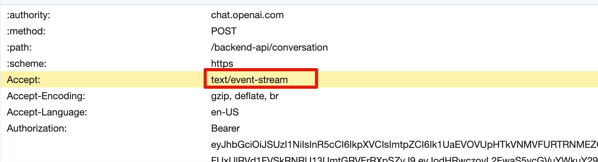

# 消息推送的常见方案

https://javaguide.cn/system-design/web-real-time-message-push.html#sse-%E6%8E%A8%E8%8D%90

## 轮询

## 长轮询

## WebSocket

## Server-Sent Event，SSE 服务器发送事件

1. 一种服务器端到客户端的单向消息推送。

2. ChatGPT用的就是SSE。对于需要长时间等待响应的对话场景，ChatGPT 采用了一种巧妙的策略：它会将已经计算出的数据“推送”给用户，并利用 SSE 技术在计算过程中持续返回数据。这样做的好处是可以避免用户因等待时间过长而选择关闭页面。

3. 原理是在线视频播放，视频流会连续不断的推送到浏览器，理解成客户端在完成一次用时很长的下载。
4. SSE是基于HTTP协议的，是服务器向客户端的单向通信，相比WebSocket无需引入其他组件，开发成本低。

## MQTT
1. rabbitMQ支持MQTT，要在rabbitMQ中安装MQTT插件。