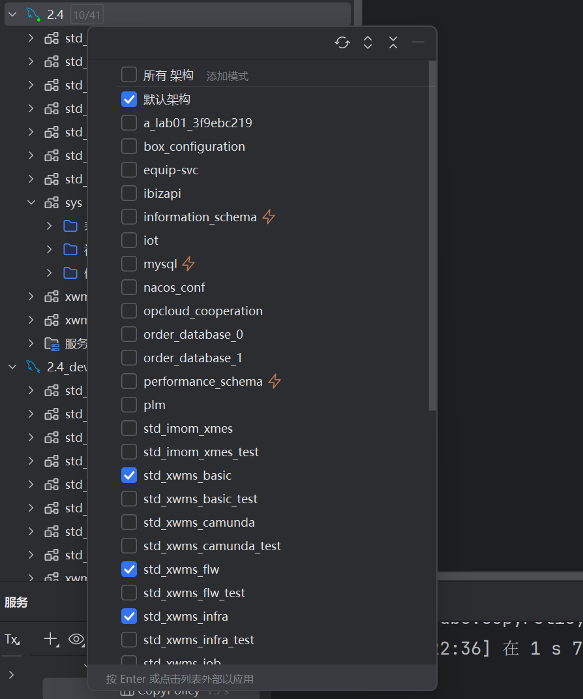

## 场景

1. 分包交付的新版本的能源项目，在公司环境运行，需要新建一个能源数据库，把当前的数据库复制一个。
2. 源数据库是 ems2，新数据库是ems3，二者在同一个连接下

## 问题

1. 但是里面有些表数据量过大，有些表不需要完全拷贝，直接全库拷贝会很卡，不确定能不能弄好。
2. 数据库中一共230张表，目前不清楚每个表的数据量，不完全清楚哪些表的数据需要全部拷贝，哪些表的数据可以不拷贝或者只拷贝几条示例数据。

## 解决方案

### 第一步 结构同步

1. 根据ems2先复制出一个ems3，只复制结构不复制数据。

### 第二步 按照数据量大小排名出源数据库所有表
分析看不同表的数据量

```sql
USE [ems2];
-- 源库执行：表体量与主键信息清单（不含 CROSS APPLY）
WITH cte_size AS (
    SELECT
        s.name AS schema_name,
        t.name AS table_name,
        -- 仅堆/聚集索引计入行数
        SUM(CASE WHEN i.index_id IN (0,1) THEN p.rows ELSE 0 END) AS row_count,
        CAST(SUM(a.total_pages) * 8.0 / 1024 AS DECIMAL(18,2)) AS size_mb
    FROM sys.tables t
    JOIN sys.schemas s   ON s.schema_id = t.schema_id
    JOIN sys.indexes i   ON i.object_id = t.object_id
    JOIN sys.partitions p ON p.object_id = t.object_id AND p.index_id = i.index_id
    JOIN sys.allocation_units a ON a.container_id = p.partition_id  -- 关键：不要在 ON 里做聚合
    WHERE t.is_ms_shipped = 0
    GROUP BY s.name, t.name
),
cte_pk AS (
    SELECT
        s.name  AS schema_name,
        t.name  AS table_name,
        1 AS has_pk,
        STUFF((
            SELECT ',' + c.name
            FROM sys.index_columns ic
            JOIN sys.columns c ON c.object_id = ic.object_id AND c.column_id = ic.column_id
            WHERE ic.object_id = t.object_id
              AND ic.index_id = i.index_id
            ORDER BY ic.key_ordinal
            FOR XML PATH(''), TYPE).value('.', 'nvarchar(max)'),1,1,'') AS pk_cols
    FROM sys.tables t
    JOIN sys.schemas s ON s.schema_id = t.schema_id
    JOIN sys.indexes i ON i.object_id = t.object_id AND i.is_primary_key = 1
)
SELECT 
    sz.schema_name,
    sz.table_name,
    sz.row_count,
    sz.size_mb,
    ISNULL(pk.has_pk,0)  AS has_pk,
    ISNULL(pk.pk_cols,'') AS pk_cols
FROM cte_size sz
LEFT JOIN cte_pk pk
  ON pk.schema_name = sz.schema_name AND pk.table_name = sz.table_name
ORDER BY sz.size_mb DESC, sz.row_count DESC;


```
### 第三步根据表的大小制定拷贝策略

10MB以下的表全部拷贝拷贝策略为'FULL'，大于10MB的前16个大的表拷贝策略设置为'NONE'

```sql

/* 1) 在源库统计体量到 #size */
USE [ems2];  -- 源库
IF OBJECT_ID('tempdb..#size') IS NOT NULL DROP TABLE #size;

SELECT
    s.name  AS schema_name,
    t.name  AS table_name,
    SUM(CASE WHEN ps.index_id IN (0,1) THEN ps.row_count ELSE 0 END) AS row_count,
    CAST(SUM(ps.reserved_page_count) * 8.0 / 1024 AS DECIMAL(18,2))  AS size_mb
INTO #size
FROM sys.tables t
JOIN sys.schemas s                ON s.schema_id = t.schema_id
JOIN sys.dm_db_partition_stats ps ON ps.object_id = t.object_id
WHERE t.is_ms_shipped = 0
GROUP BY s.name, t.name;

/* 2) 切到目标库，创建并填充策略表 */
DECLARE @TopN int = 16;      -- 暂时跳过的最大表数量
USE [ems3];               -- ← 改成你的目标库名

IF OBJECT_ID('dbo.CopyPolicy') IS NOT NULL DROP TABLE dbo.CopyPolicy;
CREATE TABLE dbo.CopyPolicy(
    schema_name      sysname       NOT NULL,
    table_name       sysname       NOT NULL,
    mode             varchar(10)   NOT NULL CHECK (mode IN ('FULL','NONE','SAMPLE','FILTER')),
    sample_rows      int           NULL,
    filter_predicate nvarchar(4000) NULL,
    priority         int           NOT NULL DEFAULT(50),
    CONSTRAINT PK_CopyPolicy PRIMARY KEY (schema_name, table_name)
);

-- 用临时表保存排名结果，便于多次引用
IF OBJECT_ID('tempdb..#ranked') IS NOT NULL DROP TABLE #ranked;
SELECT *, ROW_NUMBER() OVER (ORDER BY size_mb DESC, row_count DESC) AS rn
INTO #ranked
FROM #size;

-- 其余表：FULL
INSERT dbo.CopyPolicy(schema_name, table_name, mode, priority)
SELECT schema_name, table_name, 'FULL', 50
FROM #ranked
WHERE rn > @TopN;

-- 前 @TopN 大表：先标记 NONE（后续你再改成 FILTER/SAMPLE）
INSERT dbo.CopyPolicy(schema_name, table_name, mode, priority)
SELECT schema_name, table_name, 'NONE', 99
FROM #ranked
WHERE rn <= @TopN;

-- 查看被跳过的前 @TopN 大表
SELECT TOP (@TopN) schema_name, table_name, row_count, size_mb
FROM #ranked
ORDER BY rn;

```

### 第四步 执行拷贝，循环把拷贝策略为'FULL'的先全部拷贝出去

并且使用try catch，当某个表复制失败的时候就把dbo.CopyRunLog表中的success字段设置为0，成功就设置为1，某个表失败的时候执行不会中断，不会影响下一个表。
```sql
USE ems3;
GO

DECLARE @SourceDb sysname = N'ems2';   -- 源库名
DECLARE @TargetDb sysname = DB_NAME();
DECLARE @BatchRows int = 100000;       -- 批大小
DECLARE @ReenableConstraints bit = 0;  -- 先设 0：本轮不强制启回外键校验；等大表也拷完再设 1 重跑“收尾”

-- 收集列
IF OBJECT_ID('tempdb..#Cols') IS NOT NULL DROP TABLE #Cols;
CREATE TABLE #Cols(schema_name sysname, table_name sysname, col_list nvarchar(max), identity_col sysname NULL);

WITH cols AS (
    SELECT s.name AS schema_name, t.name AS table_name,
           c.name AS col_name, c.is_identity, c.column_id, c.is_computed
    FROM sys.tables t
    JOIN sys.schemas s ON s.schema_id=t.schema_id
    JOIN sys.columns c ON c.object_id=t.object_id
    WHERE t.is_ms_shipped=0 AND c.is_computed=0
)
SELECT c.schema_name, c.table_name,
       col_list = STUFF((
           SELECT N',' + QUOTENAME(c2.col_name)
           FROM cols c2
           WHERE c2.schema_name=c.schema_name AND c2.table_name=c.table_name
           ORDER BY c2.column_id
           FOR XML PATH(''), TYPE).value('.','nvarchar(max)'),1,1,''),
       identity_col = MAX(CASE WHEN c.is_identity=1 THEN c.col_name END)
INTO #tmp
FROM cols c
GROUP BY c.schema_name,c.table_name;

INSERT #Cols(schema_name,table_name,col_list,identity_col)
SELECT * FROM #tmp; DROP TABLE #tmp;

-- 禁触发器/外键
EXEC sp_msforeachtable 'ALTER TABLE ? DISABLE TRIGGER ALL';
DECLARE @sql NVARCHAR(MAX)=N'';
SELECT @sql = @sql + 'ALTER TABLE ' + QUOTENAME(s.name)+'.'+QUOTENAME(t.name) + ' NOCHECK CONSTRAINT ALL;'+CHAR(10)
FROM sys.tables t JOIN sys.schemas s ON s.schema_id=t.schema_id
WHERE t.is_ms_shipped=0;
EXEC(@sql);

-- 主循环
/* 建日志表（如不存在） */
IF OBJECT_ID('dbo.CopyRunLog') IS NULL
BEGIN
  CREATE TABLE dbo.CopyRunLog(
      run_id        bigint IDENTITY(1,1) PRIMARY KEY,
      schema_name   sysname,
      table_name    sysname,
      mode          varchar(10),
      start_time    datetime2(0),
      end_time      datetime2(0),
      success       bit,
      rows_inserted bigint,
      error_number  int         NULL,
      error_message nvarchar(max) NULL
  );
END

SET NOCOUNT ON;
SET XACT_ABORT OFF;  -- 避免某表失败导致整个批次终止

-- ========= 主循环（带 TRY...CATCH，成功/失败回写 sample_rows） =========
DECLARE @schema sysname,@table sysname,@mode varchar(10),
        @sample_rows int,@filter nvarchar(4000),
        @col_list nvarchar(max),@identity sysname;

DECLARE cur CURSOR LOCAL FAST_FORWARD FOR
    SELECT p.schema_name,p.table_name,p.mode,p.sample_rows,p.filter_predicate,c.col_list,c.identity_col
    FROM dbo.CopyPolicy p
    JOIN #Cols c
      ON c.schema_name=p.schema_name AND c.table_name=p.table_name
    WHERE p.mode <> 'NONE'
    ORDER BY p.priority,p.schema_name,p.table_name;

OPEN cur;
FETCH NEXT FROM cur INTO @schema,@table,@mode,@sample_rows,@filter,@col_list,@identity;

WHILE @@FETCH_STATUS = 0
BEGIN
    DECLARE @src  nvarchar(400) = QUOTENAME(@SourceDb)+N'.'+QUOTENAME(@schema)+N'.'+QUOTENAME(@table);
    DECLARE @dst  nvarchar(400) = QUOTENAME(@TargetDb)+N'.'+QUOTENAME(@schema)+N'.'+QUOTENAME(@table);
    DECLARE @exec nvarchar(MAX) = N'';
    DECLARE @sel  nvarchar(MAX) = N'';
    DECLARE @rowsThis int, @rowsTotal bigint = 0;
    DECLARE @ok bit = 0;
    DECLARE @started datetime2(0) = SYSUTCDATETIME();

    PRINT '==> Copy ' + @schema + '.' + @table + ' Mode=' + @mode;

    BEGIN TRY
        BEGIN TRAN;

        -- 准备 SELECT 源
        SET @sel = N'SELECT '+@col_list+N' FROM '+@src;
        IF @mode='FILTER' AND @filter IS NOT NULL SET @sel = @sel + N' WITH (NOLOCK) WHERE ' + @filter;
        ELSE IF @mode='SAMPLE' SET @sel = @sel + N' WITH (NOLOCK)';

        -- 清空目标
        SET @exec = N'TRUNCATE TABLE ' + @dst + N';';
        EXEC(@exec);

        -- 身份列开
        IF @identity IS NOT NULL EXEC(N'SET IDENTITY_INSERT ' + @dst + N' ON;');

        IF @mode IN ('FULL','FILTER')
        BEGIN
                        -- 一次性插入；若想更快，可把目标库恢复模式设为 SIMPLE/BULK_LOGGED
                    SET @exec = N'INSERT ' + @dst + N' ('+@col_list+N') ' + @sel + N';';
                    EXEC(@exec);
                    SET @rowsTotal = @@ROWCOUNT;
                END

        ELSE IF @mode='SAMPLE'
        BEGIN
            SET @exec = N'INSERT ' + @dst + N' ('+@col_list+N') ' + @sel +
                        N' ORDER BY (SELECT NULL) ' +
                        N' OFFSET 0 ROWS FETCH NEXT ' + CAST(ISNULL(@sample_rows,1000) AS nvarchar(20)) + N' ROWS ONLY;';
            EXEC(@exec);
            SET @rowsTotal = @@ROWCOUNT;
        END

        -- 身份列关
        IF @identity IS NOT NULL EXEC(N'SET IDENTITY_INSERT ' + @dst + N' OFF;');

        COMMIT TRAN;
        SET @ok = 1;
    END TRY
    BEGIN CATCH
        IF XACT_STATE() <> 0 ROLLBACK TRAN;
        -- 若因异常导致 IDENTITY_INSERT 未关，尽量关掉（避免阻塞后续表）
        IF @identity IS NOT NULL
        BEGIN TRY
            EXEC(N'SET IDENTITY_INSERT ' + @dst + N' OFF;');
        END TRY
        BEGIN CATCH
            -- 忽略这里的二次错误
        END CATCH;

        -- 记录失败并继续
        INSERT dbo.CopyRunLog(schema_name,table_name,mode,start_time,end_time,success,rows_inserted,error_number,error_message)
        VALUES(@schema,@table,@mode,@started,SYSUTCDATETIME(),0,ISNULL(@rowsTotal,0),ERROR_NUMBER(),ERROR_MESSAGE());

        UPDATE dbo.CopyPolicy
           SET sample_rows = 0
         WHERE schema_name=@schema AND table_name=@table;

        PRINT '!! Failed: ' + @schema + '.' + @table + ' -> ' + CAST(ERROR_NUMBER() AS nvarchar(10)) + ': ' + ERROR_MESSAGE();

        -- 继续下一个表
        FETCH NEXT FROM cur INTO @schema,@table,@mode,@sample_rows,@filter,@col_list,@identity;
        CONTINUE;
    END CATCH;

    -- 成功回写 & 记录日志
    INSERT dbo.CopyRunLog(schema_name,table_name,mode,start_time,end_time,success,rows_inserted,error_number,error_message)
    VALUES(@schema,@table,@mode,@started,SYSUTCDATETIME(),1,ISNULL(@rowsTotal,0),NULL,NULL);

    UPDATE dbo.CopyPolicy
       SET sample_rows = 1
     WHERE schema_name=@schema AND table_name=@table;

    FETCH NEXT FROM cur INTO @schema,@table,@mode,@sample_rows,@filter,@col_list,@identity;
END

CLOSE cur; DEALLOCATE cur;

PRINT '⚠ 当前批次未启回外键/触发器（@ReenableConstraints=0）。等大表也拷完后再统一启用并校验。';


-- 收尾：是否启回并校验外键/触发器
IF @ReenableConstraints=1
BEGIN
    DECLARE @sql2 NVARCHAR(MAX)=N'';
    SELECT @sql2 = @sql2 + 'ALTER TABLE ' + QUOTENAME(s.name)+'.'+QUOTENAME(t.name) + ' WITH CHECK CHECK CONSTRAINT ALL;'+CHAR(10)
    FROM sys.tables t JOIN sys.schemas s ON s.schema_id=t.schema_id
    WHERE t.is_ms_shipped=0;
    EXEC(@sql2);
    EXEC sp_msforeachtable 'ALTER TABLE ? ENABLE TRIGGER ALL';
END
ELSE
BEGIN
    PRINT '⚠ 已保留外键为 NOCHECK、触发器为 DISABLE（等把大表也拷完再统一启用并校验）。';
END

EXEC sp_updatestats;

```

### 第五步 对前16名的表手动选择拷贝

1. biz_alarm                                    报警相关的，不拷贝
2. biz_energy_consumption                       按照时间降序 拷贝前5000条数据
3. biz_energy_consumption_copy1                 备份表，不拷贝
4. biz_energy_consumption_day                   按照时间降序 拷贝前5000条数据
5. biz_energy_consumption_hour                  按照时间降序 拷贝前5000条数据
6. biz_energy_consumption_hour1                 备份表，不拷贝
7. biz_energy_consumption_month_copy1           备份表，不拷贝
8. biz_energy_consumption_month_prod1           备份表，不拷贝
9. biz_energy_consumption_prod                  备份表，不拷贝
10.  dev_log                                    操作日志表，不拷贝
11.  dev_message                                信息表，不拷贝
12. iot_data_1705018290663550977                按照时间降序 拷贝前5000条数据
13. iot_data_1705018290663550977_prod 备份表，不拷贝
14. iot_data_1754373876286029826                按照时间降序 拷贝前5000条数据
15. iot_data_1780125440141037570_copy1 备份表，不拷贝
16. iot_data_1892048393367158785                按照时间降序 拷贝前5000条数据

**跨库拷贝需要使用完整的三部分名称**
```sql
INSERT INTO [ems3].[dbo].[iot_data_1892048393367158785] 
SELECT TOP 5000 * 
FROM [ems2].[dbo].[iot_data_1892048393367158785]
ORDER BY record_time DESC;
```

1. 完整的三部分名称指的是[数据库名].[架构名].[对象名]

```sql
[ems2].[dbo].[biz_energy_consumption]
[ems3].[dbo].[biz_energy_consumption]

```

2. dbo一般是默认架构(Schema)，还有系统架构[sys].[tables],自定义业务架构。

