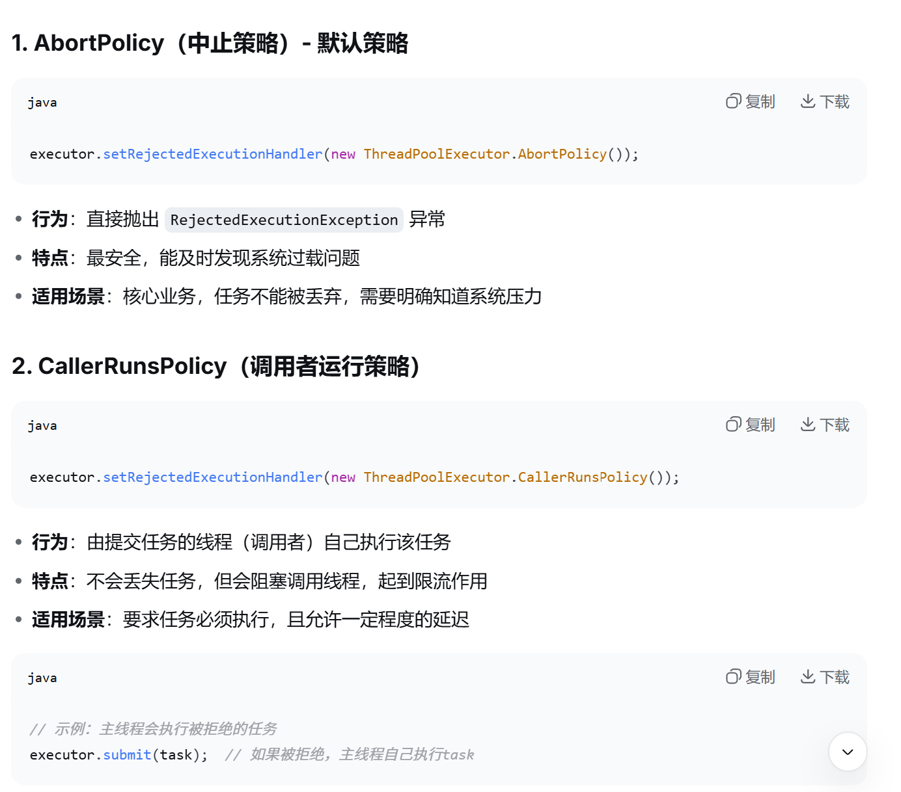
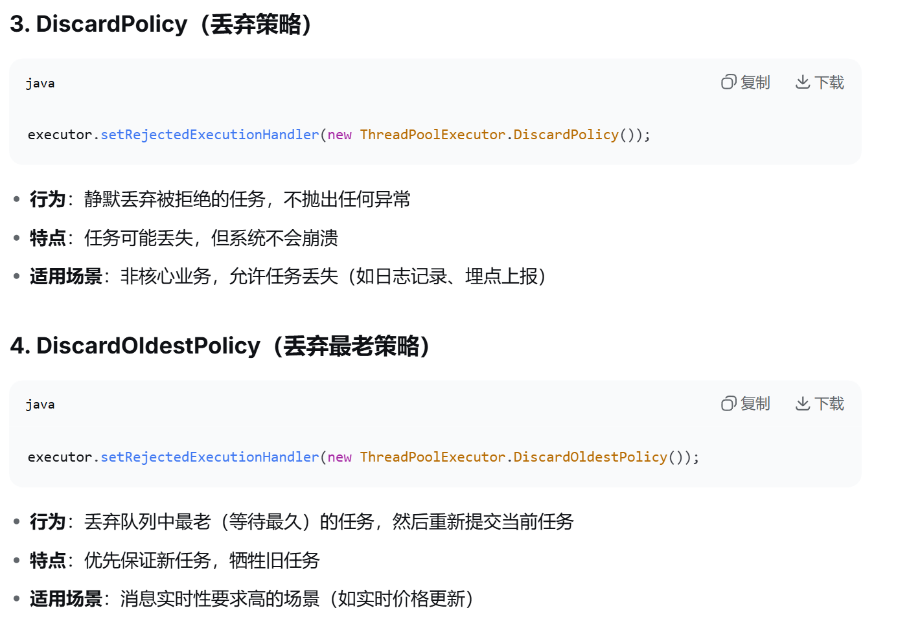

# 项目中用过多线程吗？

## Netty中的长连接，业务线程池负责具体的心跳上报等业务处理

1. 用过。我们 AGV 模块是 Netty
    TCP 长连接，Netty 的 EventLoop 线程不能被数据库操作和业务状态机阻塞。Netty 的 EventLoop 线程主要负责网络 IO、拆包解码、心跳检测。所以我单独配置了一个 ThreadPoolTaskExecutor，核心线程 4、最大线程 8、队列 1000，Handler 收到 AGV 报文后只做协议校验和注册校验，然后把业务分发到线程池。业务线程池负责注册、心跳、状态上报、ACK、RESULT 处理。这样 IO 线程只负责网络收发，业务耗时不会影响其他设备连接。并且状态缓存用了 ConcurrentHashMap，避免并发更新时普通 HashMap 出问题。

2. Spring的ThreadPoolTaskExecutor封装了java.util.concurrent的ThreadPoolExecutor，因此设置线程池参数的时候，不需要自定义队列，只需要设置阻塞队列的容量即可。

         ```java
         package com.xb.xsf.module.infra.config;

         import org.springframework.boot.context.properties.EnableConfigurationProperties;
         import org.springframework.context.annotation.Bean;
         import org.springframework.context.annotation.Configuration;
         import org.springframework.scheduling.concurrent.ThreadPoolTaskExecutor;

         import java.util.concurrent.Executor;
         import java.util.concurrent.ThreadPoolExecutor;

         /**
          * Excel 任务线程池。
          *
          * <p>导入导出是长耗时、IO 密集任务，必须和普通 Web 请求线程隔离。</p>
          */
         @Configuration
         @EnableConfigurationProperties(ExcelTaskProperties.class)
         public class ExcelTaskExecutorConfig {

             public static final String EXCEL_TASK_EXECUTOR = "excelTaskExecutor";

             @Bean(EXCEL_TASK_EXECUTOR)
             public Executor excelTaskExecutor(ExcelTaskProperties properties) {
                 ThreadPoolTaskExecutor executor = new ThreadPoolTaskExecutor();
                 executor.setCorePoolSize(properties.getCorePoolSize());
                 executor.setMaxPoolSize(properties.getMaxPoolSize());
                 executor.setQueueCapacity(properties.getQueueCapacity());
                 executor.setKeepAliveSeconds(properties.getKeepAliveSeconds());
                 executor.setThreadNamePrefix("excel-task-");
                 executor.setRejectedExecutionHandler(new ThreadPoolExecutor.AbortPolicy());
                 executor.initialize();
                 return executor;
             }

         }


         ```

3. 线程池的拒绝策略有哪些：  
     

# 百万级别导入导出接口怎么设计

1. EasyExcel流式读取。

| 对比项         | 普通读取 `doReadSync()`            | 流式读取 `AnalysisEventListener`          |
| -------------- | ---------------------------------- | ----------------------------------------- |
| 数据返回方式   | 一次性读完所有数据都存在List中返回 | 一行一行回调 ，调用写好的invoke方法去处理 |
| 内存占用       | 高                                 | 低                                        |
| 适合场景       | 小 Excel                           | 大 Excel / 百万级                         |
| 处理方式       | 读完再处理                         | 边读边处理                                |
| 是否适合百万级 | 不适合                             | 适合                                      |

```java
public class UserImportListener extends AnalysisEventListener<UserImportDTO> {

    private static final int BATCH_SIZE = 1000;

    private final List<UserImportDTO> batchList = new ArrayList<>(BATCH_SIZE);

    @Override
    public void invoke(UserImportDTO data, AnalysisContext context) {
        batchList.add(data);

        if (batchList.size() >= BATCH_SIZE) {
            saveBatch();
            batchList.clear();
        }
    }

    @Override
    public void doAfterAllAnalysed(AnalysisContext context) {
        if (!batchList.isEmpty()) {
            saveBatch();
            batchList.clear();
        }
    }

    private void saveBatch() {
        // 校验、转换、批量入库
    }
}

```

1. 系统设计层面：

   (1). 导入/导出创建异步任务，不在http请求中处理百万数据；

   (2). 异步任务用线程池处理；

   (3). 控制每个用户同一类型任务的并发任务数量；

   (4). 读取excel文件的时候分批处理；

   (5). 数据库层面使用导入时使用临时表，都处理完之后再经过SQL的校验、去重、合并进最终业务表；

   (6). 导入失败的数据返回错误文件供客户下载；

   (7). 导出也是批量导出；EasyExcel流式写入；可以拆分sheet，限制每个sheet比如50万条数据，必要时生成多个Excel再压缩成ZIP让用户下载；

   (8). 导出的时候可以读写分离，只走读库；

   (9). 供下载的文件可以设置有效期，定期删除处理。

# 遇到过死锁吗？

1. 数据库层面的死锁，高频读写
