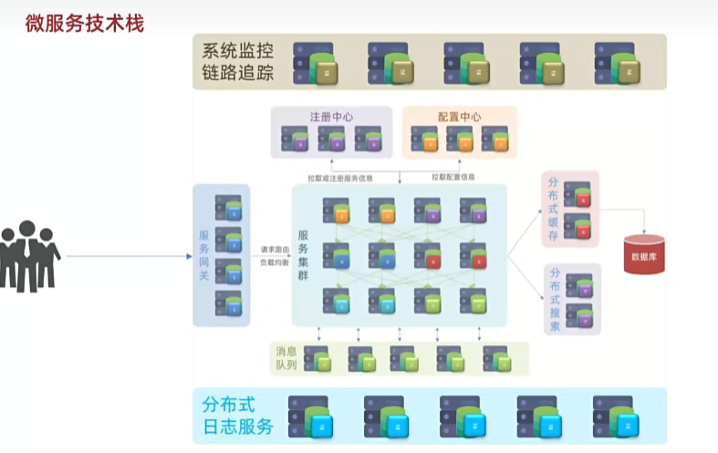
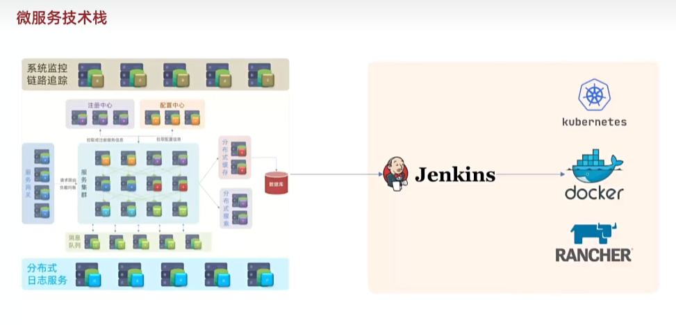
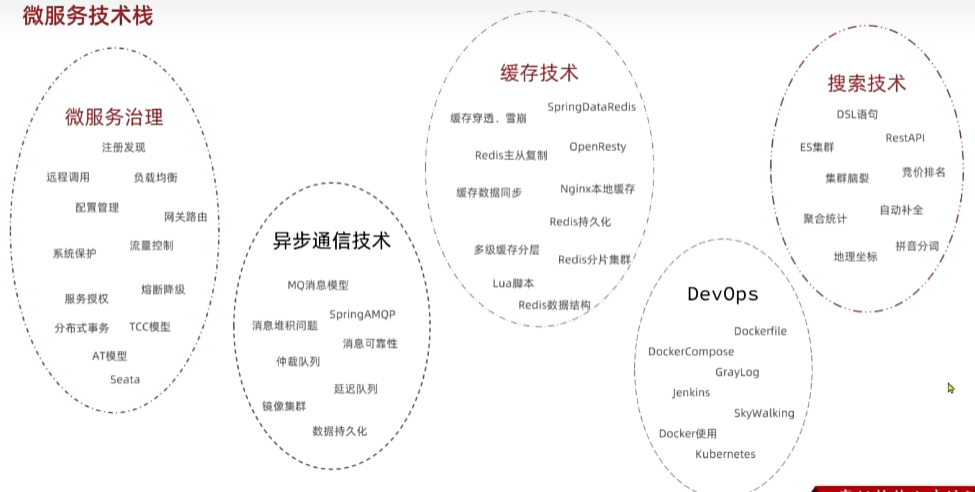

1. 微服务就是把大型项目**拆分**成多个小的服务。
2. 微服务有**注册中心+配置中心+服务网关（网关会把请求路由到正确的服务集群）**。下图是微服务的技术栈
3. 右边的Jenkins等用于部署、持续集成。
4. 微服务相关的技术栈
5. 微服务解决了什么问题：

   （1）. 系统可用性差 ==>
   **单体架构时所有接口共享一套资源（Tomcat线程池数据库连接池、JVM内存等）**。如果某个接口高并发，会占用这些资源，其他接口的响应会受到影响。

   （2）. 其他点：降低系统耦合、提高研发协作效率、支持持续交付（一个服务一个服务的部署交付）、支持独立扩容（哪个服务压力大就做扩容优化）

6. 微服务的工程结构有两种：不同的微服务是独立的project，代码可能都不是一个仓库；Maven聚合，不同的微服务是同一个project下的Module（XMOM项目就是用的这个）。

7. 微服务之间远程调用API
   ==> 使用RestTemplate 类 在某个服务里面向其他服务发送Http请求。

   （1）. 在Springboot配置类里面创建 RestTemplate Bean；

   ```java
     @Configuration
     public class RestTemplateConfig {

         @Bean
         public RestTemplate restTemplate(){
             return new RestTemplate();
         }

     }
   ```

   (2). 使用RestTemplateConfig Bean 的方法

   ```java
    @Service
    public class OrderService {

        @Autowired
        private RestTemplate restTemplate;

        public User getUser(Long userId){

            String url=
                "http://localhost:8081/user/"+userId;

            User user=
                    restTemplate.getForObject(
                            url,
                            User.class
                    );

            return user;
        }
    }
   ```

   | 方法                | HTTP方式 | 返回值              | 用途                                   | 示例                                                                    |
   | ------------------- | -------: | ------------------- | -------------------------------------- | ----------------------------------------------------------------------- |
   | `getForObject()`    |      GET | 对象                | 获取响应体并自动反序列化               | `User u=restTemplate.getForObject(url,User.class)`                      |
   | `getForEntity()`    |      GET | `ResponseEntity<T>` | 获取完整响应（状态码、响应头、响应体） | `ResponseEntity<User> r=restTemplate.getForEntity(url,User.class)`      |
   | `postForObject()`   |     POST | 对象                | 提交数据并返回响应对象                 | `User u=restTemplate.postForObject(url,obj,User.class)`                 |
   | `postForEntity()`   |     POST | `ResponseEntity<T>` | POST并获取完整响应                     | `ResponseEntity<User> r=restTemplate.postForEntity(url,obj,User.class)` |
   | `postForLocation()` |     POST | URI                 | 创建资源后获取资源地址                 | `URI uri=restTemplate.postForLocation(url,obj)`                         |
   | `put()`             |      PUT | void                | 更新资源                               | `restTemplate.put(url,obj)`                                             |
   | `delete()`          |   DELETE | void                | 删除资源                               | `restTemplate.delete(url)`                                              |
   | **`exchange()`**    |     任意 | `ResponseEntity<T>` | 通用方法，**可指定方法**、请求头、参数 | `restTemplate.exchange(...)`                                            |
   | `execute()`         |     任意 | 自定义              | 最底层接口，自定义程度最高             | 较少直接使用                                                            |
