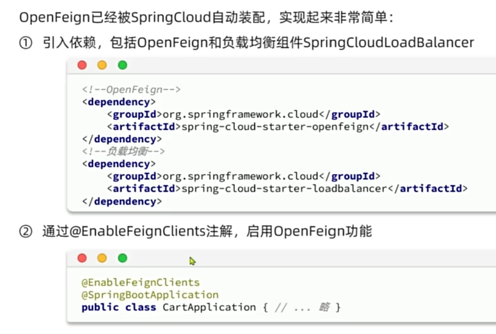
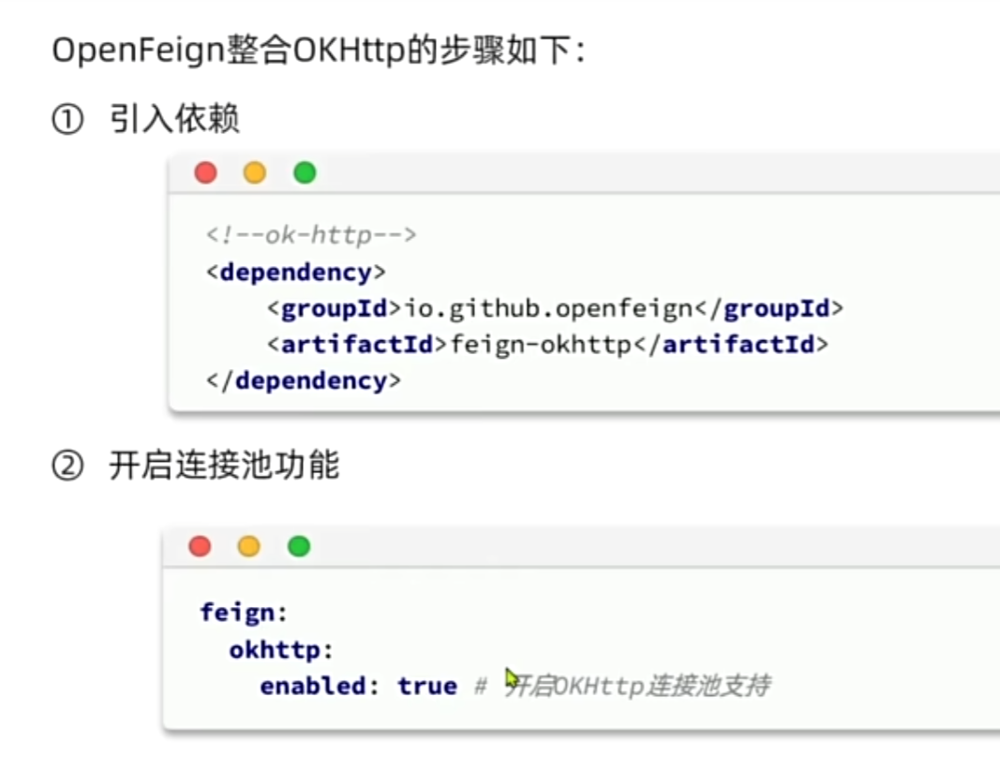

# 服务治理

## 配置中心的作用 ==> 配置中心 + 服务注册中心

1. 配置中心： 统一配置管理、动态配置刷新、配置版本管理
1. 服务注册中心：

   (1). 服务注册：服务启动后会上报Nacos自己启动了，并启动**心跳机制**，服务周期发送心跳信息给Nacos。

   (2). 服务发现：某个服务想要调用其他服务的接口，如果用RestTemplate需要在代码里自己拼ip调用url，有了Nacos可以直接问Nacos让Nacos返回可用实例列表。

   (3). Nacos返回多个可用实例同一个服务如订单服务部署多个实例实现负载均衡

   ```
     order-service
       ├── 192.168.1.10:8081
       ├── 192.168.1.11:8081
       └── 192.168.1.12:8081
   ```

   (4). 健康检查：Nacos通过心跳发现有服务挂掉了就会把它从可用列表剔除。但是不会直接删除实例而是标记为不健康实例。

## 负载均衡

### 负载均衡的相关概念

1. 负载均衡概念：把用户请求分摊到不同的服务器上，提高系统整体的高并发处理能力和可靠性。
2. 负载均衡常见算法：随机法、轮询法、最小链接法、最少活跃链接法、最快响应时间法。

### 四层负载均衡和七层负载均衡

```
OSI七层模型

7 应用层
6 表示层
5 会话层
4 传输层
3 网络层
2 数据链路层
1 物理层
```

1. 四层负载：工作在 TCP 传输层，看不到url路径和请求头这些，是根据 IP+端口进行转发，不解析业务内容，性能高但灵活性低。
2. 七层负载：工作在 HTTP 应用层，可根据 URL、Header、Cookie 等请求内容进行转发，灵活性高但开销更大。

### Spring Cloud中的负载均衡

1. 可以**在Nacos控制台手动设置不同实例的权重**（运维根据不同实例所在的服务器配置和经验自己设） ==> 权重会被Nacos给到调用服务用于负载均衡。
2. 服务调用的时候，会借助**Spring Cloud
   LoadBalancer组件**接管Feign/WebClient/Gateway 的服务名调用如xsf-basic，然后通过Nacos
   Discovery提供的可用实例列表和权重，自定义对应的LoadBalancer类，调用NacosBalancer的权重方法做负载均衡，挑选最后要用的那个实例。
3. Spring Cloud LoadBalancer默认是轮询，支持多种负载均衡的算法：

   ```
    1. RoundRobinLoadBalancer轮询，默认常见策略A -> B -> C -> A -> B -> C

    2. RandomLoadBalancer 随机选择一个实例 A / B / C 随机命中

    3. NacosBalancer Nacos 提供的加权随机根据 nacos.weight 决定概率

    4. 自定义 LoadBalancer 实现 ReactorServiceInstanceLoadBalancer 或 ReactiveLoadBalancer
   ```

## CAP理论 AP和CP

1. Nacos可以AP：Nacos集群节点之间阿生网络通信异常时，优先保证服务可用，允许Nacos节点之间出现数据不一致的情况。Nacos也支持CP。

## 其他

1. Nacos中配置中心数据（DataId配置、命名空间、权限等）会持久化到MySQL；服务注册发现中的实例信息（IP、端口、权重、健康状态、心跳等）默认保存在内存，通过Distro或Raft在集群节点间同步，以支持高频动态变化。

## 灰度发布 了解即可

1. 灰度发布：配置先推送到部分实例，验证后全量发布。
2. 要做请求的流量分流给老版本和新版本。
3. 新版本如果有问题要回滚。
4. Spring Cloud GateWay网关配合Spring Cloud
   LoadBalancer实现简单的灰度发布，在阿里云可以直接买服务。

   ```
    Gateway（决定谁走灰度 ==> 部署的时候通过配置文件带上版本标签，决定哪个实例是旧版本还是新版本）
         ↓
    LoadBalancer（决定选哪个实例）
         ↓
    Nacos（提供实例信息）
   ```

### OpenFeign和SpringCloudLoadBalancer实现微服务之间的调用和负载均衡

1. 在启动来添加@EnableFeignClients注解启用OpenFeign功能。
   
2. OpenFeign底层依赖其他框架发起http请求，如使用OKHttp依赖，可以在配置文件中开启连接池功能，就不用每次请求都新建连接了。
   

3. 把供其他服务使用的api写在统一的地方，使用@FeignClient就不需要用RestTemplate自己拼ip调用url、获取服务实例列表了。

```java
package com.xb.xsf.module.basic.api.deviceInfo;

import com.xb.xsf.framework.common.pojo.CommonResult;
import com.xb.xsf.module.basic.api.deviceInfo.dto.DeviceInfoVO;
import io.swagger.v3.oas.annotations.Operation;
import io.swagger.v3.oas.annotations.Parameter;
import org.springframework.cloud.openfeign.FeignClient;
import org.springframework.web.bind.annotation.GetMapping;
import org.springframework.web.bind.annotation.RequestParam;

import java.util.List;
import java.util.Map;

@FeignClient(name = "xsf-basic")
public interface DeviceInfoApi {
    @GetMapping("/admin-api/basic/deviceInfo/list")
    @Operation(summary = "获得设备信息")
    @Parameter(name = "id", description = "部门编号", example = "1024", required = true)
    CommonResult<List<DeviceInfoVO>> getListByIds(@RequestParam("ids") List<Long> ids);

    @GetMapping("/admin-api/basic/deviceInfo/map")
    @Operation(summary = "获得设备信息")
    @Parameter(name = "id", description = "部门编号", example = "1024", required = true)
    Map<String, Long> getALlCodeIdMap();
}

```

```
// 启动时 @EnableFeignClients会扫描@FeignClient然后生成对应的动态代理对象，去转发这个请求
@EnableFeignClients
        ↓
扫描 @FeignClient
        ↓
FeignClientFactoryBean
        ↓
JDK动态代理生成实现类
        ↓
注册到Spring容器

@Autowired UserClient
        ↓
调用 userClient.getUser()

        ↓
代理对象拦截方法调用
        ↓
解析@GetMapping、参数等注解

        ↓

xsf-basic:

10.1.1.11
10.1.1.12
10.1.1.13

↓
Spring Cloud LoadBalancer

↓
挑一个实例

10.1.1.12

↓
发送HTTP请求

http://10.1.1.12/admin-api/basic/deviceInfo/list/
```

## 网关

1. 网关的作用：

   (1). 请求的转发：动态路由、负载均衡、协议转换

   (2). 请求的过滤：身份认证、权限校验、限流熔断、日志记录 （过滤有前和后两种）

2. 高并发系统网关架构：

   (1).
   Gateway集群，Nginx可以部署主从，然后告诉客户端一个虚拟IP，正常时VIP→Nginx1，如果Keepalived 检测到Nginx1挂了，VIP自动漂移到Nginx2
   ==> 解决Nginx的单点故障问题。

   ```
               VIP(虚拟IP)
                    ↓
         ┌─────────────────┐
         │ Keepalived      │
         └─────────────────┘
              ↓      ↓

         Nginx1   Nginx2
              ↓      ↓
         Gateway集群
              ↓
          微服务集群
   ```

   (2). 后购买云上服务,SLB/ALB是阿里云等提供的负载均衡服务，用于替代手搓的方案（1）的Keepalived +
   VIP漂移 + 部分Nginx入口负载能力

   ```
   用户
   ↓
   SLB/ALB（云负载均衡）
   ↓
   Nginx集群
   ↓
   Gateway集群
   ↓
   微服务
   ```

| 层                              | 核心职责                  | 主要功能                                                                                                                                                                                                                                           |
| ------------------------------- | ------------------------- | -------------------------------------------------------------------------------------------------------------------------------------------------------------------------------------------------------------------------------------------------- |
| **SLB / ALB（云负载均衡层）**   | 系统统一入口 + 高可用负载 | **1. 负载均衡多个 Gateway 实例**<br>**2. 健康检查 + 自动摘除故障节点**<br>**3. 提供统一域名/IP入口（api.xxx.com）**<br>**4. HTTPS证书管理 / SSL卸载**<br>5. 四层(TCP)/七层(HTTP)转发<br>6. 跨可用区容灾、高可用部署                                |
| **Nginx集群（流量治理层）**     | 请求预处理与安全控制      | **1. 静态资源处理（JS/CSS/图片）**<br>**2. 限流、防刷、防CC攻击**<br>**3. URL重写 / 请求转发**<br>**4. 黑白名单、IP访问控制**<br>5. 大文件上传/下载优化<br>6. Gzip压缩、缓存<br>7. WAF规则（SQL注入/XSS拦截）                                      |
| **Gateway集群（微服务治理层）** | 微服务统一入口与治理      | **1. 动态路由（Path→微服务）**<br>**2. 服务发现 + 微服务负载均衡（Nacos）**<br>**3. JWT解析、统一鉴权**<br>**4. 请求日志、链路追踪**<br>**5. Header增强（传用户ID等）**<br>6. 灰度发布（Header/版本）<br>7. 限流、熔断、降级<br>8. Redis登录态校验 |

### Spring Cloud Gateway

1. Spring Cloud Gateway的核心组件有哪些：

   ```
   Route 路由 // 请求被转发到哪里哪个服务
   Predicate 断言 // 判断满足什么要求可以进入这条路由，比如Path路径匹配 路径里包含什么字符
   Filter 过滤器 // 在请求转发前后做处理
   ```

   ```
      server:
        port:  gateway

      spring:
        application:
          name: gateway-service

        cloud:
          nacos:
            discovery:
              server-addr: localhost:8848

          gateway:
            routes:
              - id: user-route
                uri: lb://user-service
                predicates:
                  - Path=/user/**
                filters:
                  - StripPrefix=1

              - id: order-route
                uri: lb://order-service
                predicates:
                  - Path=/order/**
                filters:
                  - StripPrefix=1
   ```

2. 一个路由里面可以包含多个断言，同时满足这些断言才能进入当前路由。某个请求可以匹配上多个路由则进入写在前面的那个。
3. Spring Cloud Gateway的过滤器分类：

   （1）. Pre类型（请求被转发到微服务之间）和Post类型（微服务处理完成之后）

   （2）. 全局过滤器GlobalFilter（可以写token校验的逻辑）和局部过滤器GatewayFilter

4. **Spring Cloud Gateway的 工作原理** ：

   Spring Cloud Gateway基于Spring WebFlux框架。Spring
   WebFlux内部基于Reactor（一个JAVA的**响应式编程**库）提供的Mono/Flux编程模型，默认使用Netty作为运行容器处理网络通信。从而用少量线程处理大量连接，更适合Gateway这种高并发场景。

5. 响应式编程是一种基于数据流和事件驱动的异步编程模型，通过非阻塞方式处理数据变化和事件传递。

   ```
      传统：拿结果 → 等待

      响应式：注册处理逻辑 → 结果来了自动通知
   ```

6. Spring WebFlux和Spring MVC的区别：Spring MVC基于Servlet +
   Tomcat，采用“一个请求一个线程”的同步阻塞模型，高并发场景下大量线程切换的开销很大。

7. 动态路由怎么实现的：Gateway 动态路由 =  
   Gateway 的路由规则存放到 Nacos 配置中心，通过配置监听实现路由热更新。
8. bootstrap.yml和application.yml的区别：bootstrap.yml 用来加载“启动前必须知道”的配置，比如Nacos用户名密码，告诉程序如何连接配置中心；application.yml放业务配置，比如mysql和redis地址和密码等。

9. Spring Cloud Gateway 异常处理 和Spring MVC不同

   ```java
   @ExceptionHandler / @RestControllerAdvice
   = Spring MVC / Controller 层的异常处理

   请求
   ↓
   DispatcherServlet
   ↓
   Controller
   ↓
   Service
   ↓
   异常
   ↓
   @RestControllerAdvice + @ExceptionHandler 捕获

   ErrorWebExceptionHandler
   = Spring WebFlux / Gateway 整条响应式链路的异常处理

   @Order(-1)
   @Component
   @RequiredArgsConstructor
   public class GlobalErrorWebExceptionHandler implements ErrorWebExceptionHandler {
       private final ObjectMapper objectMapper;

       @Override
       public Mono<Void> handle(ServerWebExchange exchange, Throwable ex) {
       // 用来处理gateway会发生异常如Filter链的鉴权、限流、路由、服务发现等，而不是业务服务的异常
       }
   }
   ```

## RPC

1. RPC 的全称是 Remote Procedure
   Call，远程过程调用。它的核心思想是让开发者像调用本地方法一样调用远程服务，底层由 RPC 框架负责网络通信、序列化、服务发现等细节。
2. Spring Cloud 中的 OpenFeign 本质上就是一种基于 HTTP 的 RPC。
3. RPC是一种调用模式不是一个具体的框架，常用的有Dubbo、gRPC 这类高性能二进制 RPC。
4. RPC过程：

   ```
   1 服务消费端（client）以本地调用的方式调用远程服务；
   2 客户端 Stub（client stub） 接收到调用后负责将方法、参数等组装成能够进行网络传输的消息体（序列化）：RpcRequest；
   3 客户端 Stub（client stub） 找到远程服务的地址，并将消息发送到服务提供端；
   4 服务端 Stub（桩）收到消息将消息反序列化为 Java 对象: RpcRequest；
   5 服务端 Stub（桩）根据RpcRequest中的类、方法、方法参数等信息调用本地的方法；
   6 服务端 Stub（桩）得到方法执行结果并将组装成能够进行网络传输的消息体：RpcResponse（序列化）发送至消费方；
   7 客户端 Stub（client stub）接收到消息并将消息反序列化为 Java 对象:RpcResponse ，这样也就得到了最终结果。
   ```
