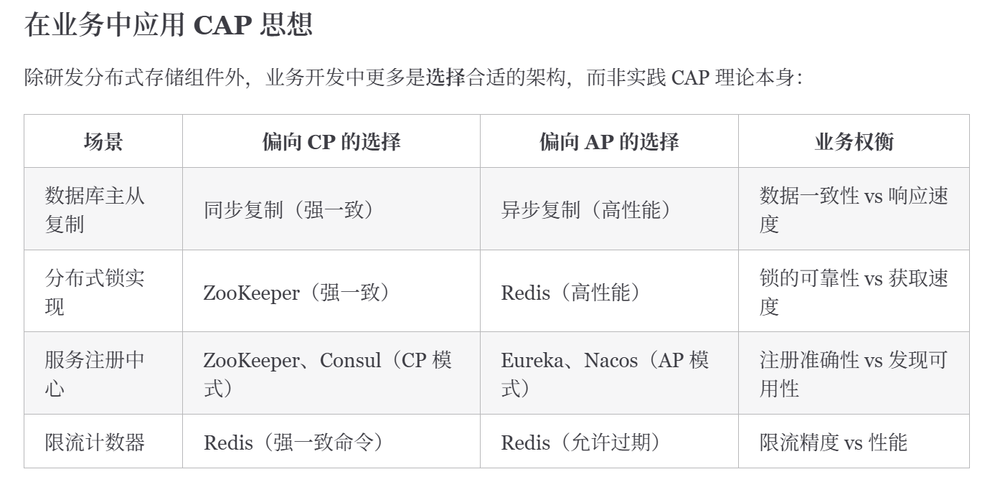
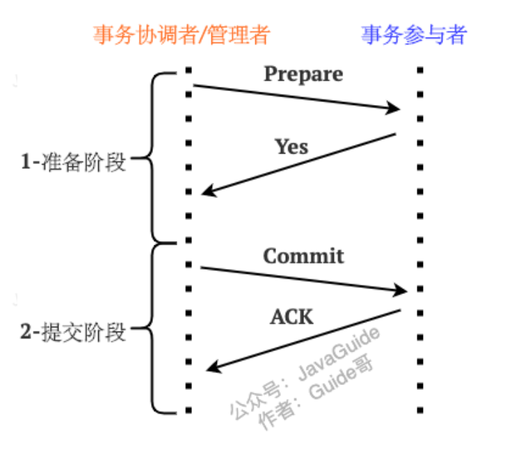
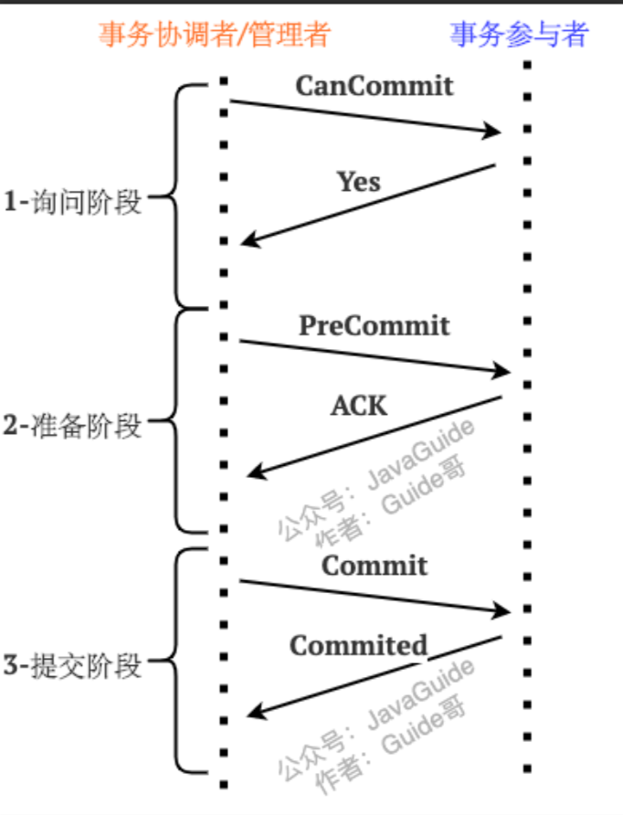
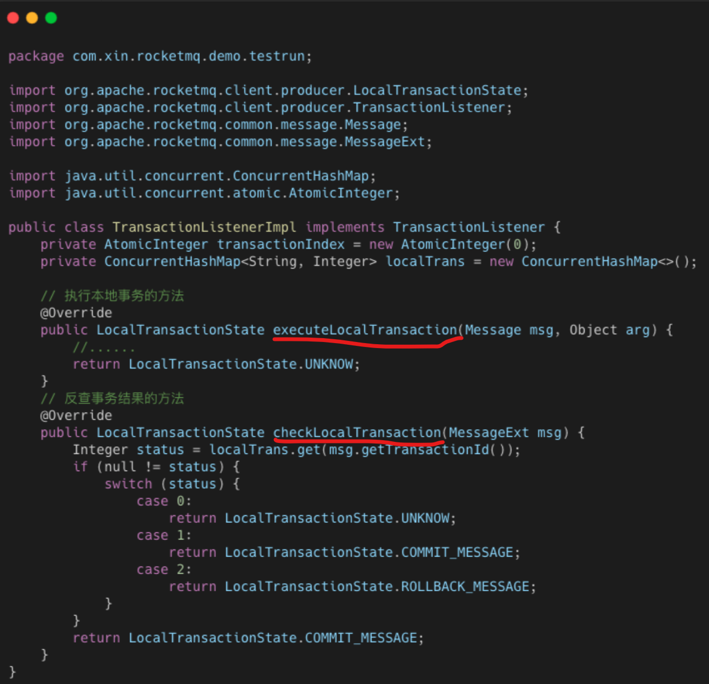
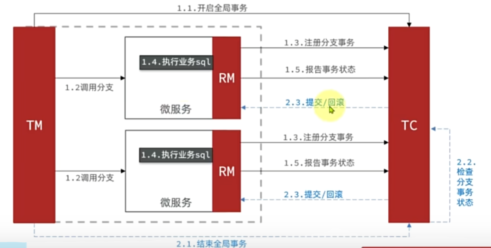
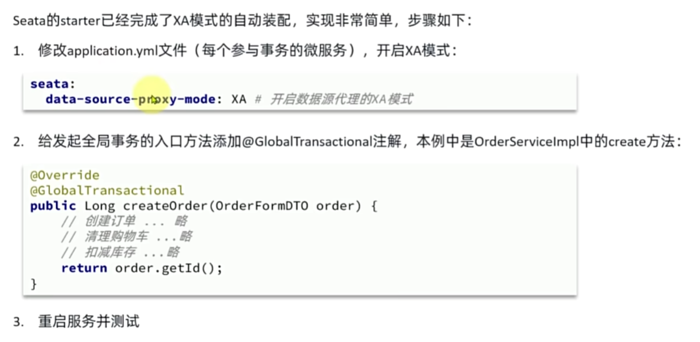
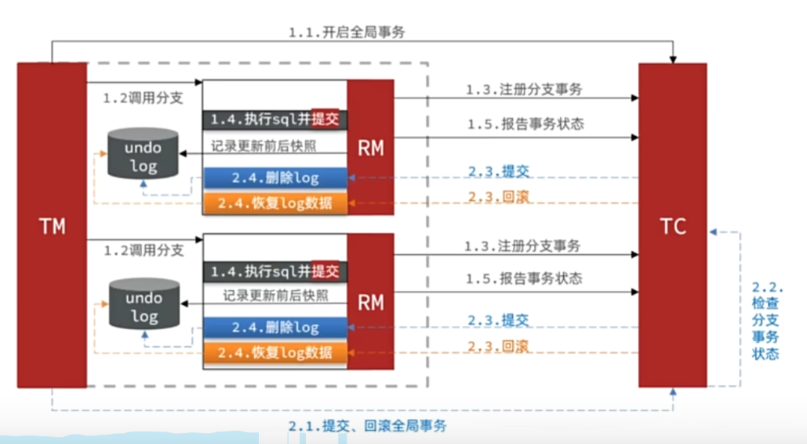

# 分布式

## 分布式事务

1. 分布式事务是从数据库事务ACID演变来的，就是随着应用和网络的发展，单体架构变成分布式架构，不同服务有自己的数据库如订单服务和库存服务，但是一个下单操作会涉及到多个微服务和多个数据库，此时要保证这组操作的原子性并且执行完之后各个数据库的一致性，这就是分布式事务。

## CAP理论

1. **C
   Consistency是线性一致性Linearizability**，要求系统任何一次读操作都必须读到最近一次成功写入的数据，所有操作按照时间顺序线性执行，达到用户访问分布式系统像访问单机系统一样的效果。
2. A 是 Availability 可用性。
3. P 是Partition Tolerance **分区容错性**。
4. CAP理论就是当发生**网络分区**的时候，一致性(C)、可用性(A)和分区容错(P)三者不能同时满足，必须在C和A之间做取舍，要么CP要么AP。
5. 网络分区 就是 分布式系统中部分节点的网络出了问题，无法与其他节点通信了，网络被分成了几块 ==> 节点之间数据不一致。

### CP

1. CP就是保证一致性牺牲可用性。节点A和B的数据都是100，网络发生问题AB不通信了。用掉50块钱，A变成100-50
   = 50，但是B不知道。B为了保证数据一致性停止服务，他不能提供错误的数据。

2. AP就是上述情况，B继续服务告诉用户还有100块钱，允许暂时的不一致。
   

## PACELC理论

    ```
    if P: // 如果出现网络分区 要在A和C之间做取舍

    A or C

    else:

    L or C  //PACELC 不存在网络分区的情况是要在低延迟L和一致性C之间做取舍
    ```

1. 优先C一致性，就是一个请求要把所有节点数据都同步之后才返回响应 ==> 请求结束之后所有节点的数据都一致

   ```
   用户下单
      ↓

   A写99

      ↓

   同步B

      ↓

   同步C

      ↓

   全部成功

      ↓

   返回成功
   ```

2. 优先L低延时，一个请求改变当前节点A之后马上返回，后台负责异步的更新其他节点B、C的数据 ==> 如果B、C节点还没同步 就有新请求访问B、C节点的对应数据 会造成和A节点数据的不一致

   ```
   用户下单

       ↓

   A写99

       ↓

   立即返回成功

       ↓

   后台同步B、C
   ```

## BASE理论

1. CAP是理论概念，实际上很难做到强一致、代价很大（立刻马上线性一致了），工程上可以接受短暂的不一致，最终数据一致就行 ==> 这就是BASE
2. B 是Basically
   Available 基本可用（可以损失部分可用性，如系统访问量激增，系统非核心功能可以无法使用，如淘宝聊天，但是下订单扣款等主要功能要可用）；
3. S 是 Soft State 软状态（短时间不一致的中间状态）；
4. E 是 Eventually
   Consistent 最终一致（通过MQ重试、延迟队列、补偿任务等实现最终一致）。

5. BASE 是在分布式场景下，对 ACID 强一致性的工程妥协。BASE是AP架构的实践指南（允许短期不一致但是最终还是要一致）。

## 分布式事务解决方案

```
分布式事务方案

强一致/刚性事务
│
├─2PC
│   └─XA = 2PC的工业标准协议,是2PC理论的一种实现
│
├─3PC
│
│
└─Seata XA （2PC 和 3PC 是分布式事务思想，Seata是框架支持XA模式）


柔性事务
│
├─TCC
│
├─本地消息表
│
├─MQ事务消息
│
├─Saga
│
└─Seata AT （Seata是框架 支持AT模式,Seata也支持 TCC、Saga模式）
```

### 2PC 和 3PC

#### 2PC

1. TC Transaction Coordinator 事务协调者；RM Resource
   Manager 具体的资源管理者(如数据库资源管理者)，后续称其为事务参与者 Transaction
   Participant。
2. 2PC（Two-Phase Commit），分为Prepare准备阶段和Commit提交阶段。
   

   (1)
   . 准备阶段TC发消息确认RM是否可以执行事务操作，**RM收到消息之后就占有资源了**，执行本地数据库事务预操作但是不提交事务（执行成功/失败回复Yes/No）；

   (2). TC告诉所有RM可以提交事务了。

3. **2PC解决了分布式原子性的问题，让多个数据库节点像同一个数据库一样一组操作要么都成功要么都失败**。
4. 2PC存在的问题：

   (1).
   **同步阻塞**,RM在Prepare阶段就开始占有资源，而且如果Prepare之后RM一直收不到Commit就会一直占有资源==> 更多的阻塞；

   (2). TC是单点的，TC一旦挂了RM们就不知道该怎么办，情况同(1);

   (3). 数据不一致，TC给不同RM发消息，但是因为网络问题有的RM收不到Commit/Rollback消息 ==> 收到的Commit了没收到的不Commit，导致数据不一致。

5. 这里的2PC和MySQL InnoDB redo log
   binlog的两阶段提交不是一个东西，只是思想一致而已； InnoDB那个是解决MySQL实例内部redo
   log 和 binlog的一致性问题。

#### 3PC

1. 3PC 三阶段提交，准备阶段分为CanCommit阶段和PreCommit阶段。

   

2. CanCommit阶段 TC会问RM你能不能提交，但是RM此时不锁资源也不执行SQL
   ==> 只要通过了该阶段，大部分RM就知道“事务大概率会成功，大家都准备好了”，**让RM们更多的获取到全局状态**。
3. PreCommit阶段RM才开始占有资源。

4. 3PC相比2PC，引入了超时机制，**并且TC和RM都有超时机制（2PC中只有TC有超时机制）**，如果超时没有收到应收到的回应，就行做出放弃事务或者RM认为事务大概率会成功因此提交事务（RM自主选择权）。==>
   **避免2PC中存在的RM事务参与者一直阻塞占用资源**。

5. 但是3PC还是没解决分布式事务可能的不一致问题，并且流程更复杂，工程上一般不用。

### TCC Try Confirm Cancel

1. 2PC和3PC都依赖**数据库事务锁**，且都要**长事务持锁，未完成前不让别人动数据**。**TCC则不依赖数据库事务锁，而是通过业务代码实现“资源预留”，不需要长时间占有数据库锁**。三个阶段都是通过代码实现。==> 开发成本高。

   ```
              TRYING
                 │
          ┌──────┴──────┐
          │             │

          │ 全部Try成功  │ 任意Try失败

          ▼             ▼

      CONFIRMING    CANCELLING
          │             │

          │ Confirm成功 │ Cancel成功

          ▼             ▼

      CONFIRMED     CANCELLED
   ```

2. Try：通过业务代码预留资源，比如下单买一个商品，就冻结一个库存用于后续出售frozen_stock
   +1。
3. Confirm：Try成功之后 在Confirm阶段完成库存 - 1 的操作；
4. Cancel: Try失败之后就释放之前冻结的库存。
5. 上面三个阶段都是短事务（比如冻结一个库存就是在已冻结数量 +
   1）不会长事务占有资源，所以能实现高并发。
6. TCC通过Confirm和Cancel这样的业务补偿实现最终一致并且会对Confirm和Cancel进行失败的重试。==> 所以TCC必须幂等，防止Confirm或Cancel多次。
7. TCC里Confirm/Cancel重试的具体实现方式：

   (1).
   TC服务定时重试，如Seata；**事务状态管理是核心**，TC服务要把事务日志、事务状态、分支状态进行持久化（Mysql等）。

   (2). MQ异步重试；

   (3). 本地任务表重试；

   (4). 一直失败就人工补偿；

8. **TCC是一种基于业务状态机和补偿机制的柔性事务方案**。

#### 空回滚 和 悬挂 问题 本质上是任务状态管理的问题

1. **在进行Try操作和Cancel操作之前 先检查任务当前处在什么状态，是否已经被Cancel或者Try过了**。==>
   **任务状态管理表必须全局共享**，在相关的实例/微服务都可以访问的一个数据库或者redis服务中。

   ```
   初始：
   available=100
   frozen=0


   TC 发起 Try(xid=1001)
           │
           ▼
   Try 请求网络延迟，没有及时到库存服务
           │
           ▼
   TC 等待 Try 响应超时
           │
           ▼
   TC 认为 Try 失败
           │
           ▼
   TC 决定全局事务失败
           │
           ▼
   TC 发送 Cancel(xid=1001)
           │
           ▼
   库存服务先收到 Cancel
           │
           ▼
   【问题1：空回滚】
   Cancel 到了，但 Try 没执行过，没有冻结库存
           │
           ▼
   正确处理：
   不把available + 1 因为冻结操作还没执行！只记录：
   xid=1001, status=CANCELLED
           │
           ▼
   稍后，延迟的 Try 到达库存服务
           │
           ▼
   【问题2：悬挂】
   如果此时执行 Try，就会冻结库存：
   available=99
   frozen=1
   但全局事务已经取消，后面不会再 Confirm/Cancel
           │
           ▼
   正确处理：
   Try 执行前检查 xid 状态
   发现 xid=1001 已经 CANCELLED
           │
           ▼
   拒绝 Try，不冻结库存


   最终：
   available=100
   frozen=0
   ```

### Saga（了解即可）

1. Saga思想是把长事务拆分成短事务，每一步都立刻提交不占资源，但是每一步都有对应的失败补偿动作，适合长链路的事务，但是中间状态会长期存在，一致性比TCC更弱。
2. 以下单为例：第一步库存直接扣减、第二步余额直接扣减、第三步订单创建失败了，则把第一步和第二步回滚回去。

### RocketMQ事务消息 ==> 最终一致

1. **RocketMQ事务消息 是为了保证本地事务和MQ消息的最终一致**，解决下列问题:

   (1). 可能出现 本地事务成功，MQ消息发送失败的情况；

   (2). 或者 MQ消息已经发送成功了，但是本地事务执行失败了。

2. RocketMQ事务消息流程如下,核心就是**半消息在本地事务执行成功之后才能被消费**：

   ```
   生产者 Producer
         │
         │ 1.发送半消息（Half Message）
         ▼
   RocketMQ Broker
   （消息暂不可消费）
         │
         │ 2.返回发送成功
         ▼

   Producer执行本地事务
   （订单入库等）

         │
    ┌────┴────┐
    │         │
   成功       失败
    │         │
    │         │
    ▼         ▼

   3.commit   3.rollback
   事务消息     事务消息

    │
    ▼

   Broker将消息标记可消费

    │
    ▼

   Consumer消费消息
   （扣库存等）
   ```

3. 如果Producer执行完本地事务之后挂了，没能commit/rollback，Broker就不知道这个半消息到底能消费不 ==>
   **RocketMQ事务回查机制，Broker会调用Producer程序里的回调方法回查Producer的本地事务是否执行成功。**
   如下图的两个核心方法是程序员自己写的，比如查询某订单是否成功。

   

4. 消费失败的话RocketMQ会自动消费重试，超过最大重试次数则放到死信队列中。

### RabbitMQ不原生支持RocketeMQ那样的事务消息，RabbitMQ不负责事务协调

1. 因此RabbitMQ一般用**业务自己实现本地消息表 +
   MQ重试**。本地消费表和本地业务事务在同一个数据库中，可以作为同一个事务一起提交要么都成功要么都失败。

   ```
   订单服务

   begin transaction
       │
       ├── 写订单表
       │
       └── 写消息表
   commit
       │
       ▼

   后台任务扫描消息表

       │
       ├── 发送RabbitMQ成功
       │         │
       │         ▼
       │     更新消息状态
       │
       └── 失败
                 │
                 ▼
              定时重试
   ```

2. 这个方案一般中等业务量够用了。

### Seata 阿里系的开源分布式事务解决方案

1. Seata中对TC和TM有自己的抽象：

   (1).
   TC 事务协调者：维护全局和分支**事务的状态（事务成功还是失败，准备阶段还是取消等事务状态机的维护）**，协调全局事务提交或回滚；

   (2). TM Transaction
   Manager: 事务管理器，**告诉TC它要发起全局事务、告诉TC该全局事务是成功了要提交还是要回滚**；

   ```java
      @GlobalTransactional // 开启全局事务
      public void createOrder() {

          orderService.create();

          stockFeign.deduct();

          accountFeign.pay();
      }

   ```

   (3). RM Resource
   Manager：资源管理器，管理分支事务，与TC交谈以及**注册分支事务**和报告分支事务的状态，**负责管理微服务对应的数据库资源、执行SQL等**。

   ```
                   Seata TC Server
                        ↑
                  (全局事务中心)

   ------------------------------------------------

   订单服务
   │
   ├─ TM（开启全局事务，上面的@GlobalTransactional所在方法就在订单服务中）
   ├─ RM（管理orderDB）
   └─ orderDB

   ------------------------------------------------

   库存服务
   │
   ├─ RM（管理stockDB）
   └─ stockDB

   ------------------------------------------------

   账户服务
   │
   ├─ RM（管理accountDB）
   └─ accountDB

   ```

2. 用的时候Seata中间件单独docker部署，并且可以注册到nacos中；微服务中引入Seata相关依赖。

#### Seate XA 模式

      ```
      2PC
       │
       ▼

      XA协议（规范）
       │
       ├── MySQL XA实现
       ├── Oracle XA实现
       ├── JTA
       └── Seata XA模式
      ```

1. XA（eXtended Architecture）是标准2PC协议，描述了TM
   RM 之间的接口，**主流关系型数据库都支持XA协议**。所以XA模式是强一致事务。

2. Seata XA模式是对XA协议的封装

   io.seata.spring.annotation.GlobalTransactional 

   

3. **Seata 主要做事务协调、RM管理等，它自己没有实现XA事务，Seata
   XA模式的底层是让RM调用数据库的XA接口，即真正实现prepare、commit两阶段提交的是数据库（MySQL
   XA）**。

#### Seata AT模式

1. AT Automatic Transaction，自动补偿型分布式事务。意思是**Seata
   AT模式中在第一阶段会先直接提交本地事务，释放数据库锁，同时Seata记录undo
   log（这里的undo log是Seata自己的undo log）、负责后续自动回滚和恢复数据**。

   

2. 不像XA模式那样占用长锁，但是在一阶段有失败时不同节点会出现数据不一致，所以是**最终一致的方案**
   ==> 二阶段会回滚成一致。

3. AT和TCC的区别：

   (1). AT是框架自动补偿，无业务侵入；TCC靠业务手写Try / Confirm /
   Cancel进行补偿；

   (2).
   AT开发维护简单，但是**TCC更适合复杂业务，AT适合“数据库行数据”的自动回滚**，是简单的crud操作通过undo
   log恢复。
