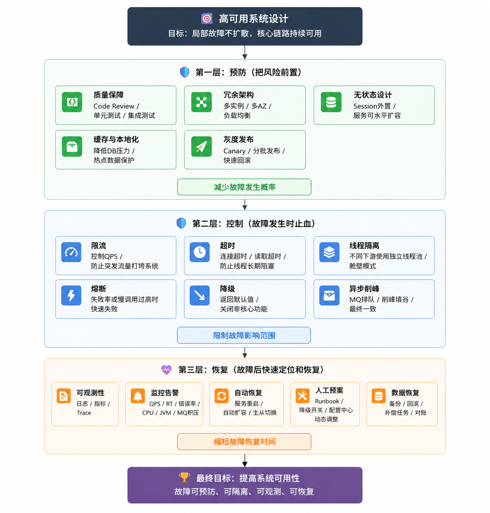
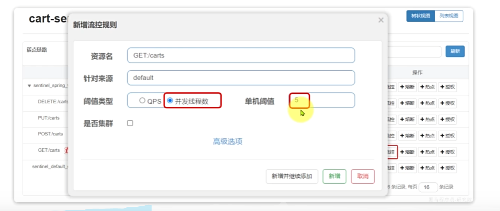
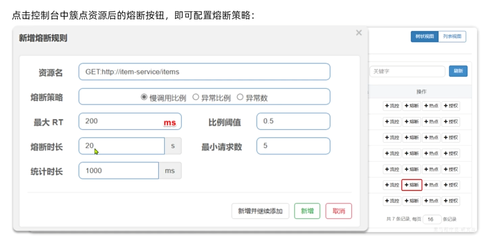

# 高可用 High Availability 简称HA

1. 高可用系统指一个系统在大部分事件都是可用的，核心目标就是在系统某个节点故障时，业务仍能持续提供服务，并尽量减少停机时间。
2. 雪崩效应：某个服务如支付服务突然变慢从50ms变成10s，订单线程调用支付服务都需要等待10s，tomcat线程资源被用尽，虽然系统各个服务没挂但是已经不可用了。
3. 高可用手段主要分为两层：基础设施层防机器挂、服务治理层防止雪崩事件服务被拖死。

   ```
   高可用（HA）

   ├── 基础设施层
   │   ├── 主从复制
   │   ├── 集群
   │   ├── 自动故障转移
   │   └── 冗余部署

   ↓

   ├── 服务治理层
   │   ├── 限流
   │   ├── 熔断
   │   ├── 降级
   │   ├── 隔离
   │   └── 超时重试
   ```

4. 高可用系统设计整体思路



1. 上图中无状态设计指的是Session不存JVM（不适用于分布式），存在Redis中，多个服务实例都能使用。

2. 第一层是预防，把风险前置，比如通过代码质量、自动化测试、无状态服务、多实例部署、缓存、灰度发布，尽量减少故障发生。第二层是控制，也就是故障发生时要能止血，比如通过 Sentinel 做限流、熔断、降级，通过超时控制和线程池隔离避免下游慢服务拖垮上游，通过 MQ 做削峰填谷。第三层是恢复，也就是故障发生后要能快速发现、定位和恢复，所以需要日志、指标、链路追踪、监控告警、降级开关、回滚机制和数据补偿机制。所以高可用的核心不是保证系统永远不出问题，而是做到：故障可预防、可隔离、可观测、可恢复。也就是让局部故障不扩散，保障核心链路持续可用。

## Sentinel中间件

1. 它可以限制到每一个api接口级别。
2. Sentinel的部署使用方式：

   (1). **单独部署Sentinel Dashboard仅用于实时监控和动态配置规则**。

   (2). 在需要的微服务中引入spring-cloud-starter-alibaba-sentinel依赖，真正执行限流、熔断（如何执行？通过实时监测+计数器+规则判断等判断是否达到条件）等的是各服务JVM内引入的这个Sentinel
   SDK。

   ```
     VIP
      ↓
     Keepalived
      ↓
     Nginx集群
      ↓
     Gateway集群
      ↓
     订单服务(内嵌Sentinel)
      ↓
     商品服务(内嵌Sentinel)
      ↓
     支付服务(内嵌Sentinel)
   ```

### 请求限流

1. QPS （Queries Per Second）每秒的请求数量。

### 线程隔离

1. 限制某个请求的并发线程数（超出的请求会失败，可以给Fallback）
   

### Fallback

1. fallback 对于请求限流、线程隔离、服务熔断等情况都适用。

2. Feign接口,@FeignClient注解中使用fallback参数

```java
@FeignClient(
        name = "product-service",
        fallback = ProductFeignFallback.class
)
public interface ProductFeignClient {

    @GetMapping("/product/{id}")
    ProductDTO getProduct(@PathVariable("id") Long id);
}
```

```java
@Component
public class ProductFeignFallback implements ProductFeignClient {

    @Override
    public ProductDTO getProduct(Long id) {
        ProductDTO dto = new ProductDTO();
        dto.setId(id);
        dto.setName("默认商品");
        dto.setAvailable(false);
        return dto;
    }
}
```

1. **@FeignClient注解中使用fallbackFactory参数 ==> 跟fallback相比能通过Throwable参数拿到异常原因**

```java
@FeignClient(
    name="product-service",
    fallbackFactory=
    ProductFallbackFactory.class
)
public interface ProductFeignClient {

    @GetMapping("/product/{id}")
    ProductDTO getProduct(
            @PathVariable Long id);
}
```

```java
import lombok.extern.slf4j.Slf4j;
import org.springframework.cloud.openfeign.FallbackFactory;
import org.springframework.stereotype.Component;
...

@Component
public class ProductFallbackFactory
      implements FallbackFactory<ProductFeignClient>{

    @Override
    public ProductFeignClient create(Throwable cause){

        return new ProductFeignClient(){

            @Override
            public ProductDTO getProduct(Long id){

                log.error("远程调用异常",cause);

                ProductDTO dto=new ProductDTO();

                dto.setName("默认商品");

                return dto;
            }

        };
    }
}
```

1. 订单服务调用商品服务失败时，ProductFallbackFactory实际在订单服务的JVM中生效，因为订单服务会在pom文件中引入商品服务的api包依赖。

### 服务熔断 ==> 类比电路中的保险丝

1. Sentinel统计接口的异常率，如果之前的大部分请求都失败了，就直接触发熔断，后续请求直接返回fallback，防止占用资源。

2. 熔断器状态机

   ```
           正常

         CLOSED
             |
   异常率过高
             ↓

         OPEN

   直接拒绝
             ↓

       时间窗口结束（设置熔断时长）

             ↓

        HALF OPEN
         /      \

   成功      失败
    |         |
    ↓         ↓

   关闭      再打开
   ```



## 超时机制

1. 给请求设置超时时间，超时直接被取消或抛出异常 ==> 避免服务端连接爆炸和大量请求堆积的情况。

## 重试机制

1. 如果是服务器瞬态故障和偶然性故障，可以通过重试机制来避免。
2. 设置重试次数限制和退避策略（固定间隔、线性退避间隔、指数退避间隔、指数退避+抖动（加一个随机时间））。

### 重试幂等 或 接口幂等性 的方法

1. 请求带唯一ID过来，如requestId或任务id；

   （1）.
   requestId 要有地方记录，这样新请求来的时候才能查到是否有被执行过；常见记录方式：

   ```
   数据库去重表
   Redis
   本地缓存
   ES
   ```

   (2). 工程中常见方式是 requestId +
   **redis去重**。在redis中记录已经处理过的请求id和处理状态，重点是**设置过期时间 + 重复请求下次可以直接返回请求的执行结果"orderId":
   "10001"，去查询订单信息直接返回**。

   ```
    收到请求
       ↓
    取 requestId = 123
       ↓
    执行 Redis 原子写入：

    SET request:123
    '{
      "status": "processing",
      "result": null
    }'
    EX 3600
    NX

       ↓
    写入成功？

    ├─ 否
    │    ↓
    │  说明 key 已存在
    │    ↓
    │  GET request:123
    │    ↓
    │  判断 status
    │
    │  ├─ status = processing
    │  │      → 请求正在处理中，返回“请勿重复提交”或稍后查询
    │  │
    │  └─ status = done
    │         → 直接返回 result就是请求123首次执行成功的结果
    │
    └─ 是
         ↓
       执行业务逻辑
         ↓
       生成结果：
       {
         "orderId": "10001"
       }
         ↓
       更新 Redis：

       SET request:123
       '{
         "status": "done",
         "result": {
           "orderId": "10001"
         }
       }'
       EX 3600
         ↓
       返回 result
   ```

2. 数据库唯一约束（适用于插入新数据的场景）；
3. 乐观锁：CAS机制 ==> 通过版本号实现；
4. 悲观锁（synchronized关键字）/分布式锁 ==> 这里的分布式锁是为了保护共享资源，比如防止多个请求同时修改库存。跟第一种唯一ID中使用到的redis用法不一样。
