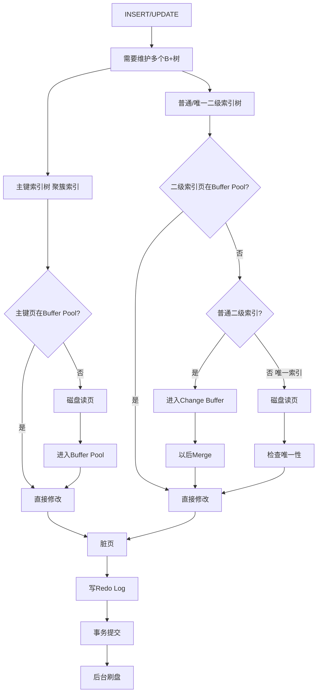

# MySQL有很多缓存

| 项目           |       Query Cache（查询缓存） |       Buffer Pool（缓冲池） |                Change Buffer（变更缓冲） |
| -------------- | ----------------------------: | --------------------------: | ---------------------------------------: |
| 所属层         |            **MySQL Server层** |                **InnoDB层** |                             **InnoDB层** |
| 存储什么       | 已经执行过的SQL 的 查询结果集 | 数据页、索引页（16KB Page） | **索引页，且只是普通二级索引待修改记录** |
| 核心作用       |       **避免重复执行同一SQL** |                  减少磁盘IO |                         减少写入时随机IO |
| 在什么阶段使用 |                     SQL执行前 |               SQL执行过程中 |                           **更新索引时** |
| 典型场景       |                      `SELECT` |                    所有CRUD |                   `INSERT/UPDATE/DELETE` |
| 是否与B+树相关 |                            否 |                          是 |                                       是 |
| 唯一索引支持   |                          无关 |                        支持 |                                 ❌不支持 |
| 原因           |                             — |                           — |                       必须立即检查唯一性 |
| MySQL8状态     |                      ❌已删除 |                      ✅保留 |                                   ✅保留 |
| 关键配置       |    `query_cache_size`（废弃） |   `innodb_buffer_pool_size` |                `innodb_change_buffering` |

1. **Query Cache用来缓存之前执行的SQL查询结果，位于MySQL Server层，已被废弃**。
2. Buffer
   Pool：MySQL如果每次从磁盘读取数据非常慢，因此InnoDB中增加一块内存区域（物理存在的）作为数据库缓存区，称为Buffer
   Pool。它存数据库的数据页和索引页。

3. **MySQL**不是按照数据库里的行数据读取，它的**最小IO单位是Page（页）**。

## 增删改时涉及普通索引和唯一索引的区别

1. 如果是普通索引，需要修改索引页，但是如果索引页此时不在BufferPool中，为了减少随机IO，不立刻去磁盘中读取数据，而是将需要修改内容先记在Change
   Buffer中，等下一次需要读对应的Page的时候，把修改操作执行进去（称这个为merge操作）。

2. 如果时唯一索引就无法使用Change
   Buffer，因为唯一索引必须读取到索引数据去确定索引是否已经存在了 ==> 是否会有索引冲突等，因此如果索引页此时不在BufferPool中，就必须磁盘读取对应Page。

## 主键索引和查询数据

1. 如果查询数据时数据也不在Buffer Pool中 要读磁盘Page。

2. 如果是修改主键索引，**因为主键索引的叶子节点上有完整行数据，所以主键索引页 ≈ 数据页 ==> 也不能用Change
   Buffer**，如果BufferPool中没有也要读磁盘对应Page。

