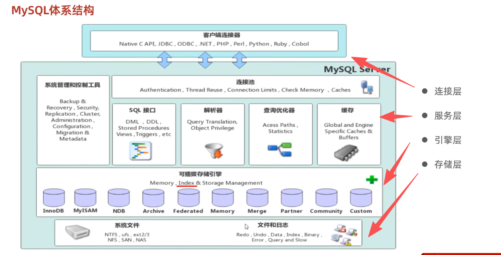
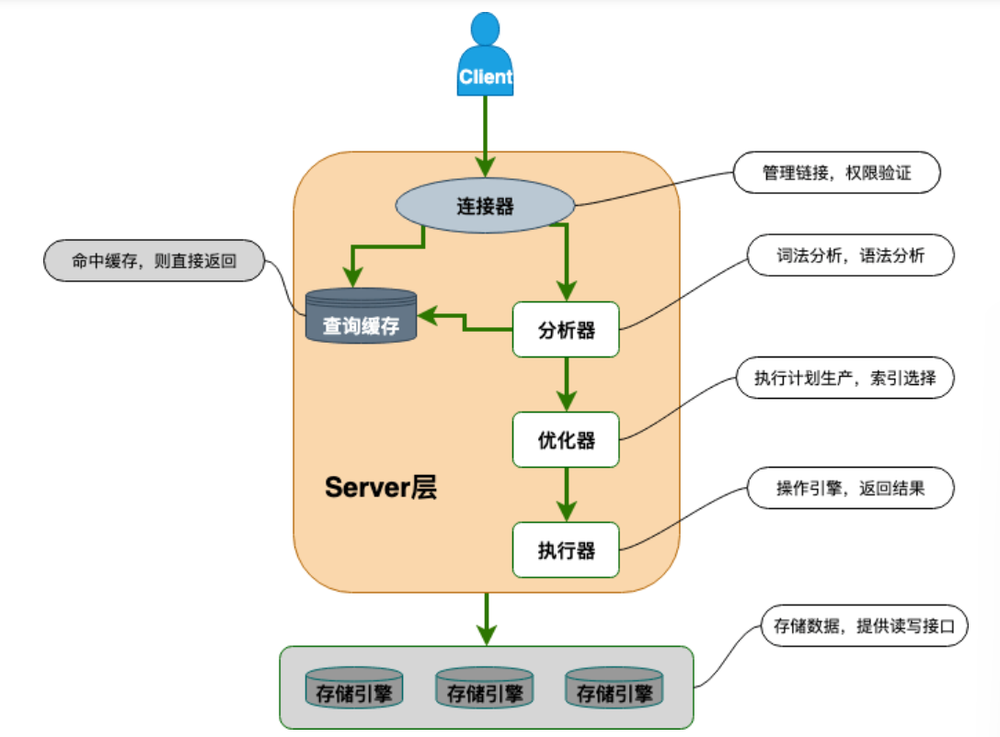
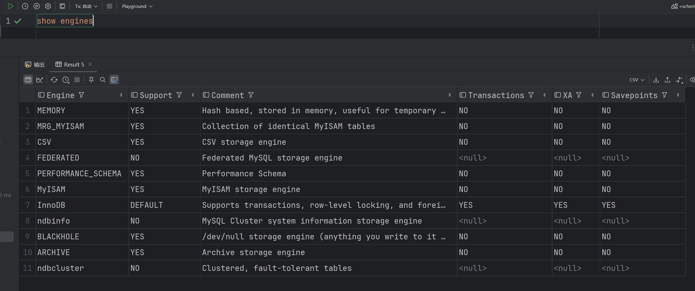
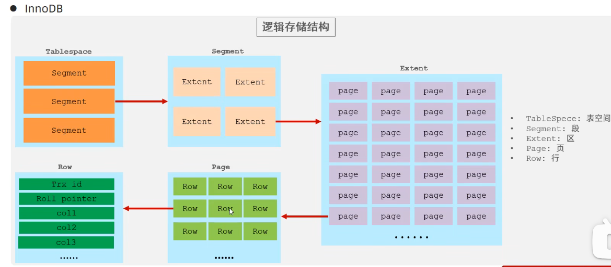
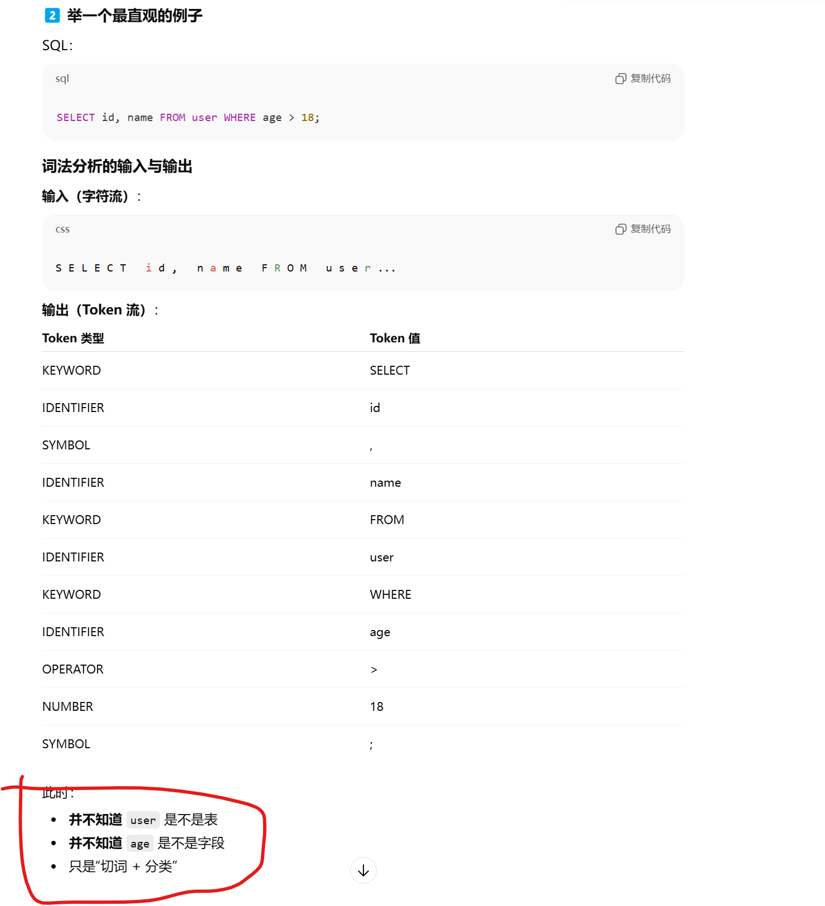
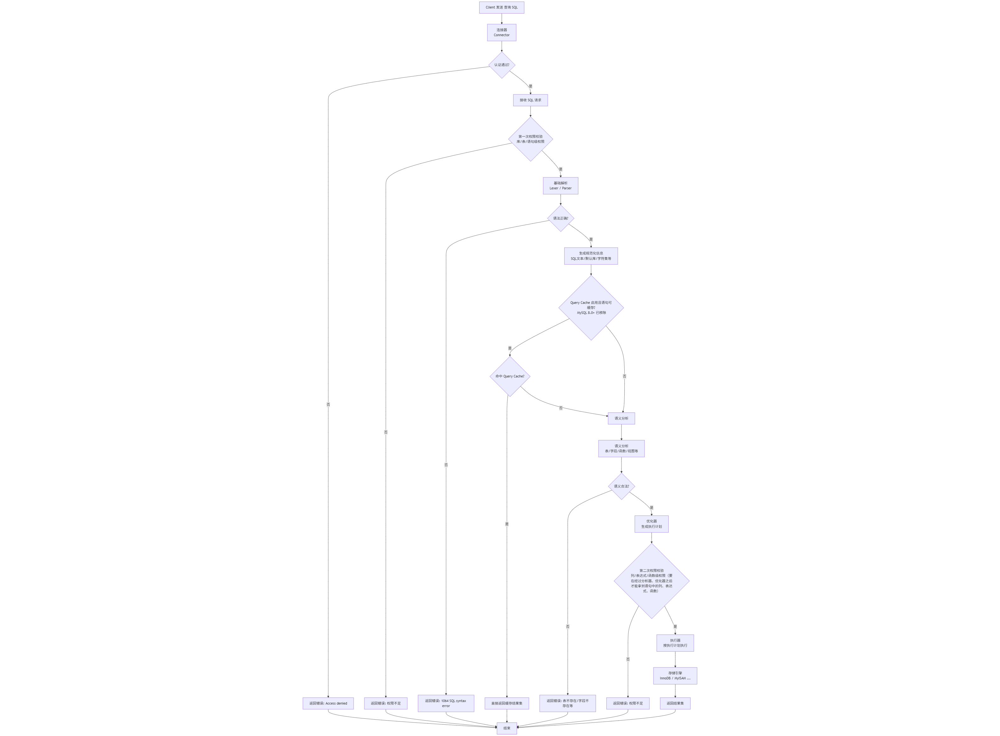
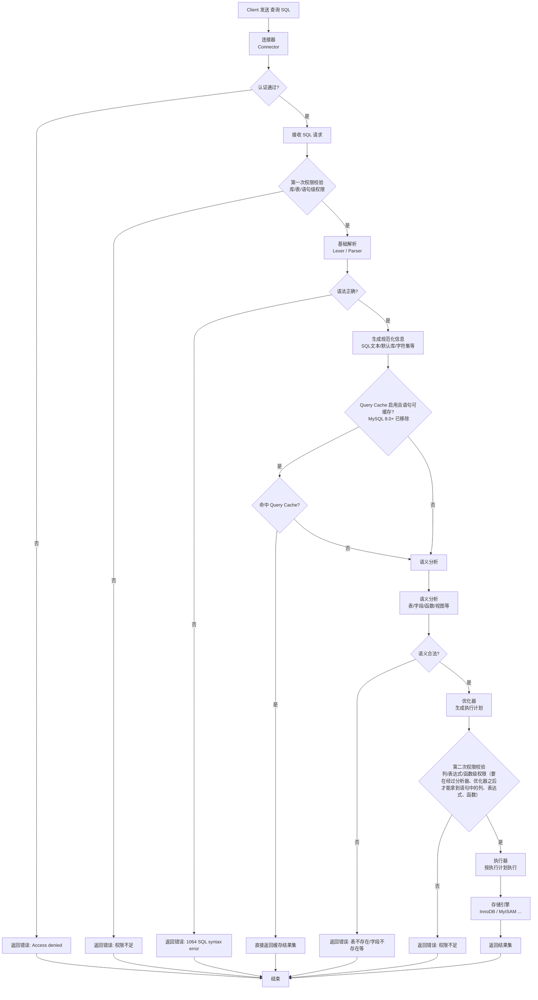

# MySQL基础架构

1. MySQL主要分为Server层和存储引擎层。


2. 连接层完成连接处理、授权认证、安全相关的。

# Server 层

1. Server层主要包括连接连接器、查询缓存、分析器、优化器、执行器、binlog日志模块。**存储过程、触发器、视图、函数等功能都在Server层实现**

# 存储引擎层

1. 存储引擎主要负责数据的存储和读取，采用可替换的**插件式架构**，支持多个存储引擎 ==> **redolog模块是InnoDB引擎自带的日志模块，在存储引擎中**。

2. **index索引是在引擎层实现的** ==> **不同的引擎有不同的索引结构**

3. **存储引擎是基于**数据库**表**，不是基于数据库 ==> **同一个数据库下不同的表可以有不同的存储引擎** ==> 存储引擎又被称为**表类型**。

4. 创建表时可以指定存储引擎，不指定就是默认的存储引擎。

```sql
CREEATE TABLE table_name (

) ENGINE=InnoDB --指定存储引擎
```

```sql
CREATE TABLE `wms_inventory_move_records` (
  `id` bigint NOT NULL AUTO_INCREMENT COMMENT '主键ID',
  `code` varchar(20) COLLATE utf8mb4_unicode_ci NOT NULL COMMENT '库存转移单号',
  `type` tinyint NOT NULL COMMENT '单据类型',
  `source` tinyint NOT NULL COMMENT '单据来源，来源1-ERP，0-WMS',
  `creator` varchar(64) COLLATE utf8mb4_unicode_ci DEFAULT '' COMMENT '创建者',
  `create_time` datetime NOT NULL DEFAULT CURRENT_TIMESTAMP COMMENT '创建时间',
  PRIMARY KEY (`id`),
  UNIQUE KEY `wms_imr_code_tenant_id` (`code`,`tenant_id`,`active_fui`) COMMENT '库存转移记录唯一索引'
) ENGINE=InnoDB AUTO_INCREMENT=29 DEFAULT CHARSET=utf8mb4 COLLATE=utf8mb4_unicode_ci ROW_FORMAT=DYNAMIC COMMENT='库存转移记录'
```

5. MySQL5.5版本之后，默认存储引擎是InnoDB，5.5版本之前默认存储引擎是MyISAM。

## SHOW ENGINES命令查看MySQL支持的存储引擎



1. **MEMORY引擎**表示数据存储在**内存**中，通常用作**临时表及缓存**。

## 查看数据库系统变量

```sql
    show variables like '%innodb_file%'
```
## 不同存储引擎的特点

### InnoDB

1. InnoDB是一种兼顾高可靠性和高性能的通用存储引擎。

#### InnoDB的特点

1. **支持事务**，实现了SQL标准定义的四个隔离级别，且有提交和回滚事务的能力。
2. **支持行级锁（row-level locking）**和表级锁（默认选择行级锁），MyISAM只支持表级锁 ==> InnoDB对并发性能有更好的支持。
3. 支持外键约束foreign key。==> 实际应用中不建议在数据库层面使用外键。

#### xxx.ibd文件

1. xxx是表名。使用InnoDB引擎的表都会有对应的这个表空间文件，存储了表结构、数据、索引。
#### InnoDB的逻辑存储结构


1. Extent区和Page的大小是固定的，一个Extent固定1M，一个Page固定16K；

### MyISAM

1. 特点：**不支持事务、不支持行级锁，只支持表锁(一下锁整张表)、不支持外键**。**访问速度比InnoDB快 ？？？ todo javaguide中对性能有不同的分析，让gpt分析一下**，因为InnoDB要维护更多东西。 https://www.cnblogs.com/chingho/p/14798021.html 

### Memory存储引擎

1. 使用memory引擎的表数据是存储在内存中的，由于会受到硬件问题或断电问题的影响==>**通常用于临时表和缓存**.

## 存储引擎的选择

1. InnoDB是MySQL默认的存储引擎，支持事务和外键，**对事务完整性和并发性能要求高的，选择InnoDB引擎**。
2. MyISAM，如果应用以读操作、插入操作为主，更新和删除较少，对事务完整性和并发性不高，而要求查询速度快，可以考虑MyISAM，用来存非核心业务的数据，如日志。
3. MEMORY存储引擎，存在内存中，速度快。   
  （1）. **作为缓存用途，已经被redis替代**，redis解决了Memory引擎数据易失的问题，有更好的分布式能力。   

  （2）. 作为MySQL内部操作的临时表，或者必须使用关系型数据库的情况，redis是无法替代的，redis是NoSQL型数据库。

4. **MyISAM 和 InnoDB 有什么区别？** ：   

  (1). InnoDB支持行锁，MyISAM 不支持；   

  (2). InnoDB支持事务，MyISAM 不支持；   

  (3). InnoDB支持外键，MyISAM 不支持；   

  (4). InnoDB的redo log支持数据库异常崩溃，MyISAM 不支持；    

  (5). InnoDB支持MVCC，MyISAM不支持；   

  (6). 性能不一样 todo

# SQL语句在MySQL中的执行过程

## 查询SQL

1. 执行顺序：   

  （1）. 客户端发送查询接口   
  
  （2）. 连接器判断是否通过认证   
  
  （3）. **第一次权限校验**：**库、表、语句级权限**，如sqlServer也一样苏虹能源甲方那里非admin账户没有查询数据库内存配置、使用情况等的权限；   

   (4). 词法分析：把SQL语句的字符流切分成词法单元（不同的Token），做简单分类

   (5). **语法分析**：在查询缓存之前就看**SQL语句的基础语法是否正确，即判断Token的组合是否符合SQL语法规则，语法正确就查询缓存**;==> 此时不去判断某个词代表的对象是否真的存在，如name列是否在user表中。  

  （6）. 未命中缓存就分析器，进行**语义分析，判断表、字段所代表的对象是否存在**；   

  （7）. 优化器：确定SQL的最有执行方案；   

  （8）. **第二次权限校验**：**列、表达式、函数级别的权限**，因为分析器完全分析完之后，去校验列等对象权限才有意义。   

   (9). 执行器：**调用存储引擎接口**、返回接口执行结果。 

2. 查询缓存：查询缓存是根据 SQL语句 + 当前是否的数据库 + 字符集 等生成 cache key，拿cache key去缓存里老value ==> **一旦有新数据插入缓存里的结果就会失效，所以缓存的命中率低 ==> MySQL8.0已经把查询缓存删掉不用了**。

3. **词法分析 + 语法分析 称为Parser; 语义分析 称为 Resolver； 三者都在分析器中完成。**





## 更新SQL todo ==> 先了解三大日志