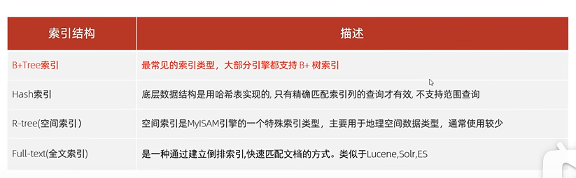
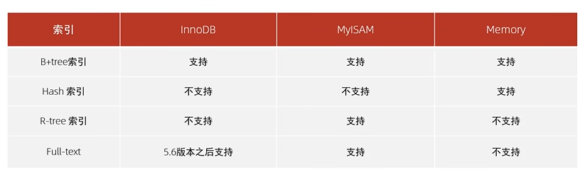
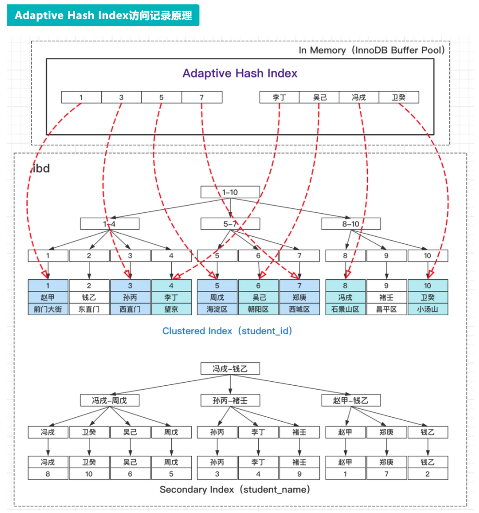
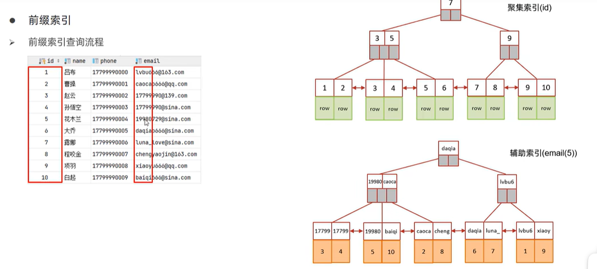
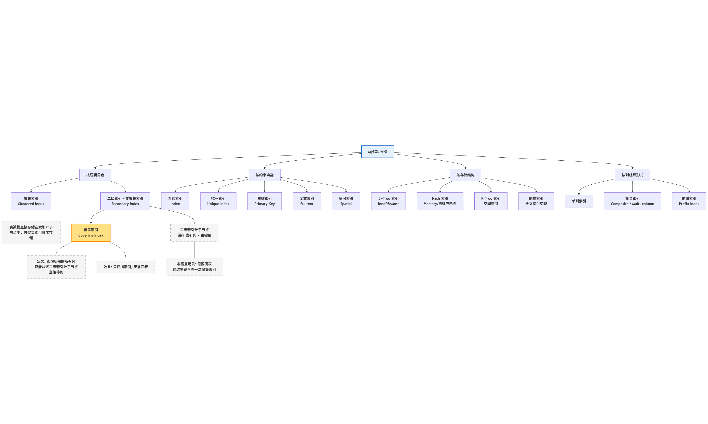
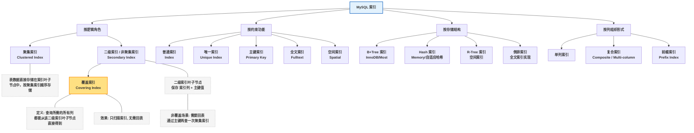
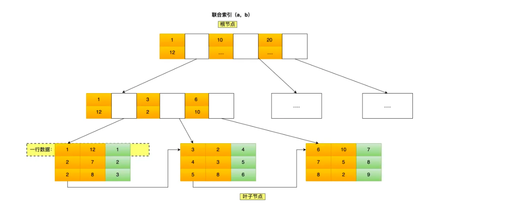
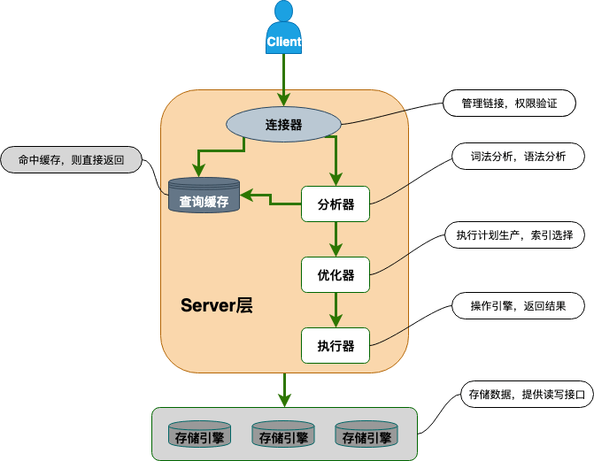

# 索引概述

1. 索引优点：提高查询效率，降低数据排序成本，通过创建唯一索引可以保证数据唯一性；
2. 索引缺点：索引本身要占数据库空间；增删改操作时，也要维护索引 ==> 会降低增删改操作的效率；索引设计不当或查询语句不够好，数据库优化器可能不会选择使用索引。

# 索引结构类型



## Hash 哈希表


1. 拉链法解决hash碰撞。

### Hash索引的特点

1. 只能用于对等比较，不支持范围查询；
2. 无法利用索引完成排序操作 ==> 不支持顺序查询；
3. 查询效率通常高于B+tree索引，因为通常只需要一次检索

### 存储引擎对Hash索引的支持

1. MySQL中的Memory引擎支持Hash索引；InnoDB引擎不支持常规的哈希索引。

### MySQL的 自适应哈希索引 Adaptive Hash Index

1. InnoDB的存储引擎中存在一种特殊的“自适应哈希索引 Adaptive Hash Index”；
2. Adaptive Hash Index是**内存结构，是非持久化的**，是MySQL InnoDB自己维护创建的自己用的，**无法人为干预**。
3. 可以将Adaptive Hash Index理解为索引的索引，是InnoDB在B+树索引之上自动建立的一层哈希索引。因为InnoDB对于范围查询效率很高，对于等值查询，如果从根节点到叶子节点的路径很长的话，效率不算高。InnoDB就会动态监测访问模式，把频繁命中的查询条件和对应的B+树页创建成哈希索引，key是（index_id,search_key）,value是对应的B+树页，并动态维护这个哈希索引。


## 可能的面试题

1. 为什么InnoDB存储引擎选择B+tree索引结构：   
    （1）. 相对于二叉树层级更少，搜索效率高；   
    （2）. B+树只有叶子节点保存数据，B-tree所有节点都保存数据，B+树用的空间更少、同样的空间能指引更多的数据。   
    （3）. B+树底层叶子节点之间的链表，方便进行范围查询，哈希索引不支持范围查询。

# 索引分类

## 主键索引 PRIMARY

## 唯一索引 UNIQUE 唯一索引 = 普通索引 + 唯一性约束

1. 唯一联合索引 create unique index idx_phone_name on tb_user(phone,name) ==> 相当于create index idx_phone_name on tb_user(phone,name)并且phone和name的组合不能重复。

2. constraint只是对字段进行唯一性约束

```sql
alter table xamp_asset_book
    add constraint uk_equipment_no unique (equipment_no);
```

## 常规索引

## 全文索引 FULLTEXT

## 按照索引存储形式分：聚集索引和二级索引

1. 聚集索引：**索引结构的叶子节点保存的是这行的数据**
2. 二级索引：**索引结构的叶子节点保存的是行数据的主键id**


3. 聚集索引的选取规则：   
    (1). 主键索引就是聚集索引；   
    (2). 没有主键，第一个唯一索引作为聚集索引；   
    (3). 都没有，InnoDB会自动生成一个rowId作为隐藏的聚集索引。

4. 如果查询的时候使用的二级索引，因为不能直接取到数据，会**拿主键id再根据聚集索引那里查一次** ==> 肯定没有直接使用聚集索引快。

## 覆盖索引 

1. 非聚集索引中的字段如果包含了查询需要的字段，就不需要再回表查询了,称为覆盖索引。

## 前缀索引 ==> 仅限于字符串类型

1. 对于字符串尤其是长文本，把整个字段设置为索引太大了，查询时会浪费大量磁盘IO，因此**可以把字符串的一部分前缀建立为索引**。
2. 如果查询的时候 查询字段仅包含「前缀索引字段 + 主键」，但是是需要完整的字段长度而不仅仅是前缀部分，也会回表查询。 ==> **前缀索引只包含前缀部分**


3. 语法：就是字段名后面加括号定义前缀长度，下面是取username字段的前3个字符作为索引。

```sql
create index idx_sub_name on table_name(username(3))
```

### 如何选取前缀长度？==> 索引长度尽可能短、索引性能尽可能高

1. 根据**索引的选择性**判断， 索引选择性定义如下==>**索引中的唯一值数量越多、索引的性能越好，如主键id索引的Selectivity = 1**。


2. **通过count函数测试不同前缀长度的选择性**，大于0.9才考虑。

```sql
select count(distinct substring(equipment_no, 2)) / count(*) AS prefix2_selectivity
from xamp_asset_book
```

## 组合索引/联合索引/复合索引

1. 因为最左前缀法则，在创建组合索引的时候要考虑一下哪个字段放在前面。

2. 联合索引比单列索引好，联合索引可能会形成覆盖索引，减少回表查询。




# SQL性能分析 参考Java/SpringBoot D4部分

# 索引使用

## 最左前缀法则 和 范围查询

1. 使用联合索引时，MySQL会根据索引中的字段顺序，**从左到右依次匹配查询条件中的子段，如果漏了某字段的话该字段右边的索引字段就失效了**。

2. 因为联合索引的B+Tree是从按照从左到右的字段给数据排序的。如联合索引(product_no, name)，先按照product_no给数据排序，然后按照name字段给数据排序（product_no相同的情况下，name字段是有序的，name字段全局是无序的，**联合索引是按照字段逐层排序的**）。==> **利用索引的前提是索引里的key是有序的，然后基于有序性MySQL通过二分查找快速定位目标值**，如果跳过了某些字段，右侧的key就是无序的了，就用不了。

3. 使用联合索引时，对某些key使用了大于号>或者小于号<这种范围查询，其右侧的key也会失效，**因为对于(a,b)这种联合索引，>a筛选出的数据中b是无序的**。

4. 对于>= 或 <=，BETWEEN,以及前缀匹配LIKE的范围查询，右侧的key还能生效。以联合索引(a,b)为例，where a >= 8 中还有a = 8的情况，当a = 8时, b还是有序的可以作为索引的key用。 

5. BETWEEN如果被翻译成>= and <=原理同上；

6. 前缀匹配LIKE的范围查询 如 where a LIKE 'J%'， 对于a = 'J'的部分，右侧的索引字段还是有序的，所以未生效。**重点是要有等于的部分 让右侧的key值存在有序的情况，索引才会生效**。

## 索引失效

### 在索引列上使用函数、做运算、做隐式类型转换 ==> 计算之后的结果没办法跟原始值进行对比，因此即使原始的索引列是有序的索引也会失效

1. 使用函数

```sql
-- 索引列：create_time (datetime类型，已建索引)
-- 失效：对索引列用函数
SELECT * FROM t_order WHERE DATE(create_time) = '2025-12-04';
-- 优化：改写为范围查询（保留索引列原始值）
SELECT * FROM t_order WHERE create_time >= '2025-12-04 00:00:00' AND create_time < '2025-12-05 00:00:00';
```

2. 做算数运算

```sql
-- 索引列：price (int类型，已建索引)
-- 失效：索引列参与加减乘除
SELECT * FROM t_goods WHERE price + 10 = 100;
-- 优化：运算移到右侧
SELECT * FROM t_goods WHERE price = 90;
```

3. 隐式类型转换 ==> 索引列的类型跟查询条件的值不匹配，MySQL自动转换了类型，等价于对索引列使用函数。

```sql
-- 索引列：mobile (varchar类型，已建索引)
-- 失效：用数字查询字符串列（隐式转换：CAST(mobile AS int) = 13800138000）
SELECT * FROM t_user WHERE mobile = 13800138000;
-- 优化：加引号，匹配类型
SELECT * FROM t_user WHERE mobile = '13800138000';
```

### 模糊查询以%开头 ===> 最前面的等号都没了 

### 联合索引的最左匹配原则被破坏

### OR 条件 左右两边任意一个列无索引，整个查询的索引失效

### 优化器“成本判断”导致索引失效

1. in条件的范围过大，或者 使用 not in、not exists、is null、is not null 等，视数据分布情况，如果mysql优化器判断全表扫描比走索引成本更低（**表本身很小、或索引列的区分度低**），会主动放弃索引。

## sql提示 ==> 在sql语句中告诉优化器要用什么索引、不用什么索引

1. use index：建议优化器使用，最终是否使用还是看优化器自己选择。

```sql
explain select * from table1 use index(idx_user_pro) where profession = '软件工程';
```

2. ignore index：告诉优化器不要用这个索引。

```sql
explain select * from table1 ignore index(idx_user_pro) where profession = '软件工程';
```

3. force index： 强制优化器必须使用这个索引。

```sql
explain select * from table1 force index(idx_user_pro) where profession = '软件工程';
```

todo 索引和null值的关系；索引下推

## 索引下推 Index Condition Pushdown，ICP ==> 大大减少需要回表查询的数据行数，进而提高查询效率


1. MySQL5.6中的优化内容，并且默认开启。

2. 队医InnoDB表，**只对二级索引/非聚集索引有意义，用于减少需要回表查询的数据量，进而提高查询效率。** ==> **因为聚集索引不需要回表查询**

3. 举例，某个表有联合索引（first_name,last_name）,查询语句如下

```sql
select * from employees where first_name = 'Mary' and last_name LIKE '%man';
```
4. 索引下推的原理：   

    （1）. 由于%用在开头导致last_name的字段失效。MySQL的**存储引擎层**筛选出first_name = 'Mary'的所有数据假设有100条，就需要把这100条全部回表查询，然后把查出的数据全部交给**Server层**让Server层去筛选出last_name LIKE '%man'的数据。   

    （2）. 用了索引下推之后，**存储引擎层**筛选出first_name = 'Mary'的所有数据之后，自己筛选出last_name LIKE '%man'的数据（组合索引中有last_name数据），筛选后可能只剩10条数据了，把这10条数据回表查询，查到的结果返回给Server层。   

    （3）. 综上，**应该在Server层完成的筛选（筛选出last_name LIKE '%man'的数据）被交给存储引擎层去做了，这就是索引下推**。

5. **使用了索引下推的话，Explain命令中的Extra列会显示Using index condition**。

6. 注意事项：子查询不能使用索引下推，因为子查询通常会创建临时表，临时表是没有索引的。