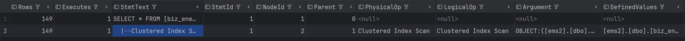
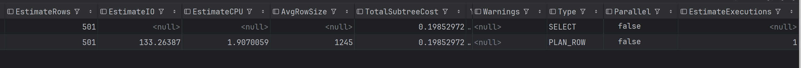
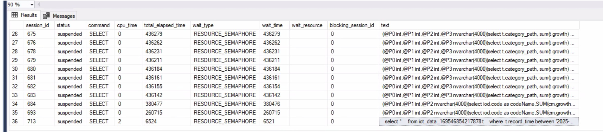
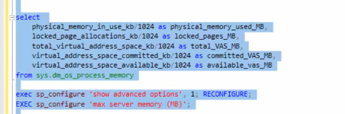
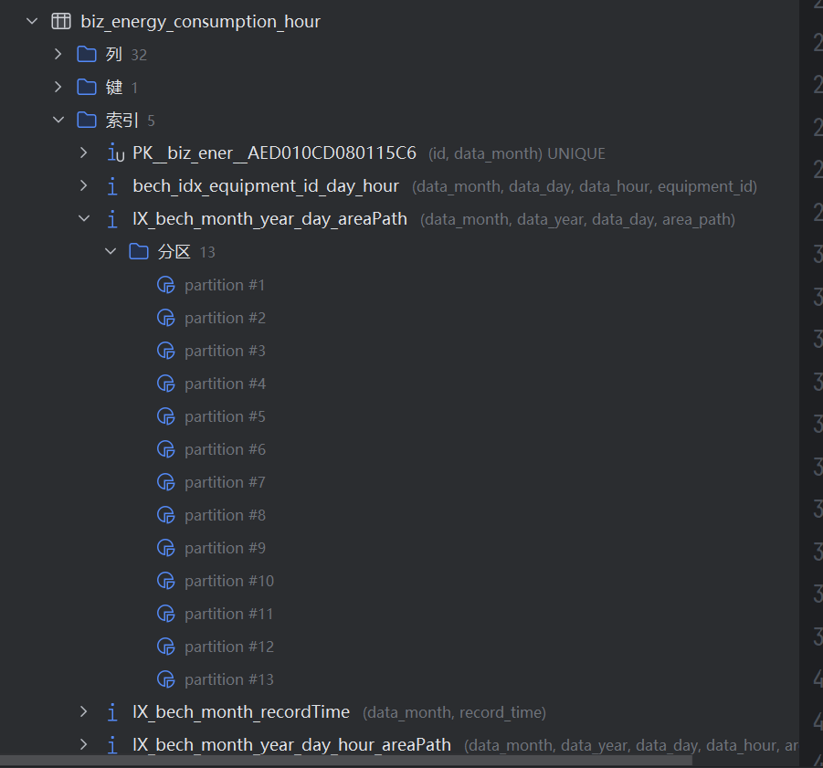

# SQLServer执行计划分析

## 分析SQL写的好不好

1. SQLServer中对应MySQL EXPLAIN命令的语句如下：

```sql
SET STATISTICS PROFILE ON;
GO
SELECT * FROM biz_energy_consumption WHERE data_month = 12 and data_year = 2025
GO
SET STATISTICS PROFILE OFF;
```

输出字段如下：



其中的**PhysicalOP物理执行算子**比较重要，常见值及含义如下

| PhysicalOp     | 含义           |
| -------------- | ------------ |
| Index Seek     | 索引精准查找       |
| Index Scan     | 扫描索引         |
| Table Scan     | 全表扫描         |
| Nested Loops   | 嵌套循环 JOIN    |
| Hash Match     | 哈希 JOIN / 聚合 |
| Sort           | 排序           |
| Compute Scalar | 计算列          |
| Filter         | 条件过滤         |

## 查看运行时资源 --> SQL写的好但是运行时资源不足，也会导致查询很慢才返回结果 --> 偏向于运维（苏虹能源）

1. 查询请求运行情况
```sql
SELECT *
FROM sys.dm_exec_requests;
```


wait_type可以看出来SQL Server是在等锁、等IO还是等可用查询内存；

2. 查询内存使用情况和内存配置


3. 查询当前的内存请求情况


## SQLServer分区裁剪 partition elimination

1. **SQLServer中分区键要放在索引的最左侧，分区才能有效**。比如能源系统用 data_month字段分区，建立非聚集组合索引（data_year,data_month），即使sql语句中用了 where data_year = ? and data_month = ? 也不能达成分区裁剪的效果 ==> SQLServer仍然会扫描全部分区。

2. MySql不存在上述这种情况，只要where中用了分区键就行。

## SQLServer 和MySQL中分区的区别

1. SQLServer中的分区是物理索引层的 ==> 每个索引在每个分区都有一份独立的B-Tree ==> 13个分区就有13个索引,每个索引在每个分区都是物理独立对象。



```sql
biz_energy_consumption_hour
│
├─ Partition 1 (Jan)
│   ├─ Clustered Index B-Tree
│   ├─ Nonclustered Index A B-Tree
│   └─ Nonclustered Index B B-Tree
│
├─ Partition 2 (Feb)
│   ├─ Clustered Index B-Tree
│   ├─ Nonclustered Index A B-Tree
│   └─ Nonclustered Index B B-Tree
│
├─ Partition 3 (Mar)
│   └─ ...


```

2. MySQL中每个分区是一个独立的子表（分区子表化，SQLServer没有），当然每个子表也有自己的独立索引。

```sql
Partition p202401
 └── B+Tree (idx_month_area)

Partition p202402
 └── B+Tree (idx_month_area)

Partition p202403
 └── B+Tree (idx_month_area)
```

3. MySQL和SQLServer的索引物理树数量都是 = 分区数 ✖ 索引数。 看起来一样但是不一样的是：**执行分区裁剪的阶段不同**   

    （1）. **SQLServer中分区是索引的一部分，要基于索引进行分区裁剪，所以分区键必须要在索引的最左侧**   
    ```
    生成执行计划
      ↓
    索引选择
      ↓
    基于索引的分区裁剪
    ```   

    (2). **MySQL中分区裁剪发生在索引引用之前**，所以不依赖索引结构，**只要 WHERE 条件里能明确约束分区表达式，就可以裁剪分区**。   

    ```
    SQL 解析
      ↓
    WHERE 条件分析
      ↓
    Partition Pruning（分区裁剪）
      ↓
    选择要访问的分区
      ↓
    在“每个命中的分区内”选择索引 / 扫描
    ```

## SqlServer中的include ==> 减少回表查询

1. INCLUDE可以把growth和cost保存在索引树的叶子节点上，这样就不用为了这两个字段回表查询。

```sql
CREATE NONCLUSTERED INDEX IX_becm_year_areaPath
ON dbo.biz_energy_consumption_month (data_year, area_path)
INCLUDE (growth, cost)
GO
```

2. **MySQL中没有INCLUDE字段**，不回表查询**只能用覆盖索引**，上述索引在MySQL中就要都写进索引列中。更占空间。

```sql
CREATE NONCLUSTERED INDEX IX_becm_year_areaPath
ON dbo.biz_energy_consumption_month (data_year, area_path,growth, cost)
GO
```

3. SQLServer的INCLUDE中字段只在叶子节点上有，中间的节点没有，root和中间的节点只有索引定义的字段，所以include字段不能参与排序；MySQL InnoDB的覆盖索引在所有节点上都有。 

```sql
SQL Server Index B-Tree

Root
 └─ [data_month, area_path]
     └─ Intermediate // 中间节点
         └─ Leaf
             ├─ data_month, area_path, growth, cost
             ├─ data_month, area_path, growth, cost


MySQL Index B-Tree

Root
 └─ [data_month, area_path, growth, cost]
     └─ Intermediate // 中间节点
         └─ Leaf
             ├─ data_month, area_path, growth, cost, PK
             ├─ data_month, area_path, growth, cost, PK

```

4. SQLServer INCLUDE的优点、特点：   

    (1). 减少回表；    

    (2). 突破SQLServer对非聚集索引的键列数量限制（最多16个），INCLUDE包含列数量无限制。 

    (3). SQLServer**自由度更高**，可以选择用Include还是覆盖索引；   

    (4). 使用Include能让索引更“瘦”，内存能存更多B+树 ==> **提高内存命中率**   

    (5). include包含列维护成本比全放在覆盖索引上低，写入性能更高。   

## SQLServer 和MySQL InnoDB的B+树的不同

1. SQLServer的索引也是B+树。

2. SQLServer**聚集索引**Clustered Index和InnoDB的聚集索引几乎一致，叶子节点都保存了整张表的数据行。但是**SQLServer允许表是堆表（Heap），堆表就是没有聚集索引的表，因此不存在B+树结构，数据页无顺序，见缝插针的插入，通过行标识符Row ID，RID定位**。

3. Row ID = 数据页 + 页内偏移量，用于定位数据行。

4. **SQLServer非聚集索引**Nonclustered Index**和InnoDB的不同，主要区别在叶子节点上**   

    (1). SQLServer非堆表的 Leaf Page = 索引Key列 + 聚集索引键值 + Include列(如有)   

    (2). SQLServer堆表的 Leaf Page = 索引Key列 + 叶子节点的数据对应的Row ID + Include列(如有)   

    (3). InnoDB Leaf Page = 索引Key列 + 聚集索引键值

## OLTP OLAP SLA 系统和对应数据库的选择 

### OLTP

1. OLTP, Online Transaction Processing，在线事务处理。

2. OLTP系统**面向业务操作**，特征是：    

  (1). 操作频发、高并发；   

  (2). 每次操作很小，简单的crud SQL较多；  

  (3). 强一致性，要确保事务的AICD； 

### OLAP

1. OLAP，Online Analytical Processing，在线分析处理。

2. OLAP系统**面向分析决策**，特征是：   

  (1). 读多写少；      

  (2). 聚合计算复杂；   

  (3). 并发不一定高，但是**单次查询很重**，要扫描大量数据   

  (4). 多余分析、报表、看板

### 有哪些OLTP/OLAP系统或场景？

1. 京东/淘宝的 下单、支付、库存扣减、订单状态变更属于OLTP，对于GMV报表、销售排行、用户画像、推荐算法等属于OLAP；微信/支付宝的即时消息、转账、红包属于OLTP，对于风控模型、资金流分析属于OLAP；B端系统如ERP的业务操作如入库出库时OLTP，管理报表如成本、利润分析是OLAP。

2. 即**用户感知层是OLTP，后台决策层是OLAP**。==> 后台不同的功能分系统，前台聚合在一起而已。淘宝 / 京东这类核心是 “交易层（OLTP）+ 数据同步层 + 分析层（OLAP）”，既隔离负载，又保证数据最终一致。