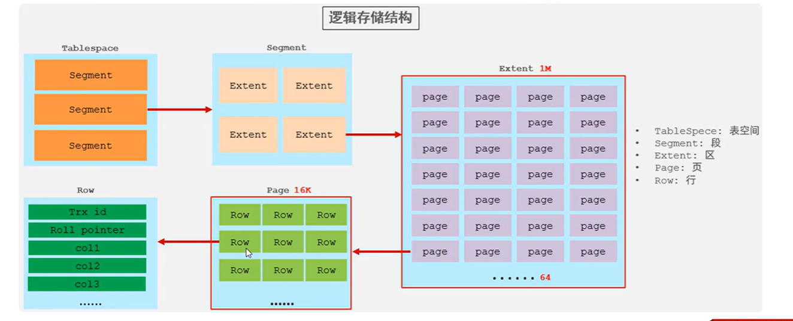
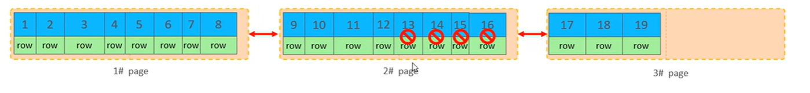

# SQL优化

## 主键优化

1. 不要用会频繁更新的列、数据太复杂的列作为主键，UUID、HASH、字符串列这些也不推荐；==> **因为要让主键顺序增长**
2. 选择自增ID，AUTO_INCREMENT;
3. 尽量降低主键的长度；
4. 因为MySQL的数据是按照主键的顺序排序组织的，如果主键不是顺序增长的，新增时就需要往页Page中间插入数据，造成页分裂、页合并等。


## Order by排序

1. 排序字段要加索引，不然会Using filesort。
2. 索引可以加asc desc顺序

```sql
create index idx_user_age_pho_ad on tb_user(age asc, phone desc);
```
## limit优化 ==> 覆盖索引加子查询

1. limit 取很远的数字，如取第900万到900万零10共11条数据

优化,id字段有索引
```sql
select t.* from tb_sku t, (select id from tb_sku order by id limit 9000000,10) a where t.id = a.id
```


## Count优化

1. 用count(*) 效率大于count(字段名称)、count(1)那些，因为数据库为count(*)做了优化。

## Update优化 和行锁

1. InnoDB的行锁不是直接加在数据行上的锁，而是**加在索引上的锁**。

2. update时如果age字段设置了索引，就根据索引锁对应的行，如果没设置索引，就只能只用表锁、锁全表了，造成阻塞其他事务。

```sql
BEGIN;  // 开启事务
UPDATE user SET name = 'Tom' WHERE age = 18;
```