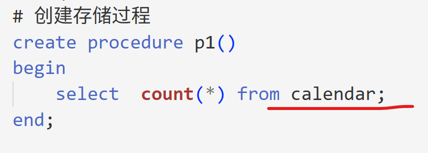
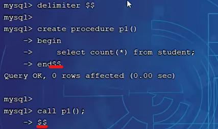
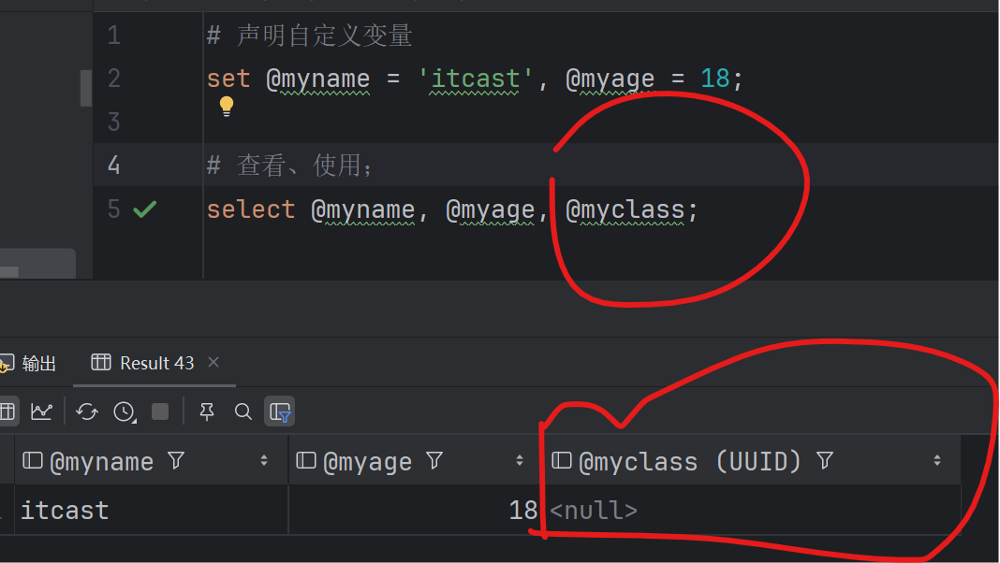

# 视图 View

1. **视图是基于SQL语句返回的结果创建的虚拟的表 ==> 它本身不包含数据 ==> 也就不能创建、拥有索引，但是查询视图时可以使用到原表中的索引**，视图中的数据都是原表中的数据，可以理解为一种映射。

2. 创建视图的语句

```sql
create view view1 as select 语句
```
3. **视图中的数据会实时跟着原始表中的数据变**，只要符合select语句。
3. 对视图的其他操作和普通的表一样。**对视图执行insert操作，实际上是插入数据到原始表中。**

```sql
create view v_cal as select id, year, code from calendar where year > 2020;

insert into v_cal values(100,2019, 'code11111');
```

## check option（对insert/update条件都有效）

1. 上述视图明明条件是大于2020，但是也能成功插入的年份为2025的数据，因为视图没有check option。==> **check option 的作用是检查通过view插入的数据符不符合视图创建的条件，不符合则不能插入数据到原始表中**。

2. 如果没有check option，可以通过视图随意插数据到原始表中，但是该视图不会显示（1. 中year = 2025的数据不会在视图中显示）。

### **可以基于视图创建视图**

1. 通过任意一个视图插入的数据都会逐层检查它所依赖的视图、数据库表的条件，如果任意一层不符合check option就不能插入数据。

### cascaded check option

1. cascaded表示给它所依赖的所有视图都加上check option选项。

### local check option

2. local表示只给当前视图添加check option。

# 存储过程、存储函数、触发器等都了解即可 ==> 不推荐使用数据库侧的逻辑

原因：    

    1. 逻辑不可见、bug难排查；   

    2. 跨库、跨平台可移植性差，不同数据库如MySQL
    和sqlServer的触发器等语法又不一样

# 存储过程


1. 存储过程是数据库SQL语言层面的**代码封装与重用**。是**事先编译好**并存储在数据库中的一段SQL语句的集合。

```sql
# 创建存储过程, p1()括号里面可以传参
create procedure p1()
begin
    select  count(*) from calendar;
end;

# 调用存储过程
call p1();

# 查看存储过程
select * from information_schema.ROUTINES WHERE ROUTINE_SCHEMA = 'std_imom_xmes';
show create procedure p1;

# 删除存储过程

drop procedure if exists p1;
```

2. 在**命令行**执行创建存储过程的语句时，**要通过delimiter自定义结束符，不然在执行完select语句看见分号就会以为命令到此为止了**。



## 存储过程难以调试和扩展，更没有移植性，不要使用

1. 存储过程也有优点：代码封装、服用，预先编译的性能高。

## 系统变量 @@variablename

1. 分为全局变量GLOBAL，会话变量SESSION(只在当前会话有效的变量)。系统变量是系统自带的。

不加前缀都默认查询会话变量
```sql
# 查看系统变量, show variables = show session variables
show variables ;
show global variables ;
show session variables ;

show session variables like 'auto%';

# 查看某个系统变量的值，select @@autocommit = select @@session.autocommit
select @@autocommit;
select @@session.autocommit;
select @@global.autocommit;
# 设置系统变量

set session autocommit = 1;

```

2. **通过 set 修改的全局变量在MySQL服务重启之后会被重置**，除非修改/etc/my.cnf配置。

## 用户自定义变量 @variablename

1. 直接查看没被声明过的自定义变量不会报错，返回null；

```sql
# 声明自定义变量
set @myname = 'itcast', @myage = 18;

# 查看、使用；
select @myname, @myage, @myclass;
```



## 局部变量 declare

1. 局部变量要明确定义类型，只用于存储过程中；
2. 用户自定义变量是弱类型的，是会话级别的变量。

```sql
create procedure p1()
begin
    declare cal_count int default 0;
    select count(*) into cal_count from calendar;
    select cal_count;
end;

call p1();
```

## 传参（三种类型：IN OUT INOUT） 

```sql
DELIMITER $$

CREATE PROCEDURE p_count_by_year_out(
    IN  p_year INT,
    OUT p_cnt  INT
)
BEGIN
    SELECT COUNT(*)
    INTO p_cnt
    FROM calendar
    WHERE year = p_year;
END$$

DELIMITER ;

# 调用
CALL p_count_by_year_out(2025, @cnt);
SELECT @cnt;

```

INOUT类型是既是输入、修改后被返回的参数

```sql
DELIMITER $$

CREATE PROCEDURE p_add_10(
    INOUT p_num INT
)
BEGIN
    SET p_num = p_num + 10;
END$$

DELIMITER ;

# 调用
SET @x = 5;
CALL p_add_10(@x);
SELECT @x;   -- 15
```

## if 和 case 

1. ENF IF
```sql
DELIMITER $$

CREATE PROCEDURE p_stock_status(
    IN p_qty INT
)
BEGIN
    IF p_qty <= 0 THEN
        SELECT '无库存' AS status;
    ELSEIF p_qty < 10 THEN
        SELECT '库存紧张' AS status;
    ELSE
        SELECT '库存充足' AS status;
    END IF;
END$$

DELIMITER ;

```

2. END CASE

```SQL

DELIMITER $$

CREATE PROCEDURE p_month_to_quarter(
    IN p_month INT
)
BEGIN
    CASE
        WHEN p_month BETWEEN 1 AND 3 THEN
            SELECT 'Q1' AS quarter;
        WHEN p_month BETWEEN 4 AND 6 THEN
            SELECT 'Q2' AS quarter;
        WHEN p_month BETWEEN 7 AND 9 THEN
            SELECT 'Q3' AS quarter;
        WHEN p_month BETWEEN 10 AND 12 THEN
            SELECT 'Q4' AS quarter;
        ELSE
            SELECT '非法月份' AS quarter;
    END CASE;
END$$

DELIMITER ;

```

## while repeat loop 循环

1. END WHILE

```SQL
DELIMITER $$

CREATE PROCEDURE p_while_demo()
BEGIN
    DECLARE i INT DEFAULT 1;
    DECLARE total INT DEFAULT 0;

    WHILE i <= 5 DO
        SET total = total + i;
        SET i = i + 1;
    END WHILE;

    SELECT total AS result;  -- 15
END$$

DELIMITER ;

```

2. UNTIL ...  END REPEAT **repeat是满足条件的时候退出循环**

```SQL
DELIMITER $$

CREATE PROCEDURE p_repeat_demo()
BEGIN
    DECLARE i INT DEFAULT 1;
    DECLARE total INT DEFAULT 0;

    REPEAT
        SET total = total + i;
        SET i = i + 1;
    UNTIL i > 5
    END REPEAT;

    SELECT total AS result;  -- 15
END$$

DELIMITER ;

```

3. 开始的时候 lable：LOOP     

   结束的时候 END LOOP    
   
   离开循环时LEAVE lable   

   跳过本次循环时 ITERATE lable

```sql
DELIMITER $$

CREATE PROCEDURE p_loop_all_syntax_demo()
BEGIN
    DECLARE batch INT DEFAULT 1;
    DECLARE i INT;
    DECLARE total INT DEFAULT 0;

    outer_loop: LOOP
        -- 批次控制
        IF batch > 3 THEN
            LEAVE outer_loop;   -- 结束所有批次
        END IF;

        SET i = 1;

        inner_loop: LOOP
            -- 内层循环退出条件
            IF i > 5 THEN
                LEAVE inner_loop;
            END IF;

            -- 跳过某次处理
            IF i = 2 THEN
                SET i = i + 1;
                ITERATE inner_loop;   -- 跳到下一轮 inner_loop
            END IF;

            -- 提前结束当前批次
            IF i = 4 THEN
                LEAVE inner_loop;     -- 跳出 inner_loop
            END IF;

            -- 正常业务处理
            SET total = total + (batch * 10 + i);

            SET i = i + 1;
        END LOOP;

        -- 进入下一个批次
        SET batch = batch + 1;
    END LOOP;

    SELECT total AS result;
END$$

DELIMITER ;

```

## 游标cursor

1. **游标是存储过程中的一种数据类型 cursor**

```sql
declare u_cursor cursor for select calendar.year, calendar.code from calendar
        where year <= uyear;
```

2. 如下 calendar有多个字段，select * 会把他们都取出来，当想遍历的把这些结果都赋值给变量stu_count时，会报错 ==> 变量类型不一样 ==> **游标就是可在在存储过程中对一个结果集进行移动遍历**

```sql
create procedure p1(in uyear int)
begin 
    declare stu_count int default 0;
    select * into stu_count from calendar;
end;
```

```sql
create procedure p1(in uyear int)
begin
#     声明游标
    declare uyear int;
    declare ucode varchar(100);
    declare u_cursor cursor for select calendar.year, calendar.code from calendar
        where year <= uyear;

    drop table if exists cursor_cal;
    create table if not exists cursor_cal(
        id int primary key auto_increment,
        year int,
        code varchar(64)
    );

# 开启游标
    open u_cursor;
    while true do
#         取出游标中的数据
            fetch u_cursor into uyear, ucode;
            insert into cursor_cal values (null, uyear, ucode);
        end while;

# 关闭游标
    close u_cursor;
end;
```

## 存储函数 

1. 存储函数必须要有返回值 ==> 能够使用存储函数的地方都能用存储过程替代。

```sql
create function fun1(n int)
returns int deterministic
begin
    declare total int default 0;
    while n > 0 do
        set total := total + n;
        set n := n - 1;
    end while;

    return total;
end;

# 使用存储函数并直接select展示结果
select fun1(10);
```

## 触发器 trigger

1. 当触发器所在表上出现指定时间是，就触发触发器中定义的内容。
2. 作用：**用于进行审计跟踪** ==> 如某个表中数据被更改了，就把修改前的数据添加到历史记录表中。
3. 触发器的类型：

    BEFORE INSERT - 在将数据插入表格之前激活。   

    AFTER INSERT - 将数据插入表格后激活。   

    BEFORE UPDATE - 在更新表中的数据之前激活。   

    AFTER UPDATE - 更新表中的数据后激活。   

    BEFORE DELETE - 在从表中删除数据之前激活。   

    AFTER DELETE - 从表中删除数据后激活。

    NEW 和 OLD：MySQL 中定义了 NEW 和 OLD 关键字，用来表示触发器的所在表中，触发了触发器的那一行数据。   
    
    在 INSERT 型触发器中，NEW 用来表示将要（BEFORE）或已经（AFTER）插入的新数据；   
    
    在 UPDATE 型触发器中，OLD 用来表示将要或已经被修改的原数据，NEW 用来表示将要或已经修改为的新数据；   
    
    在 DELETE 型触发器中，OLD 用来表示将要或已经被删除的原数据；   
    
    使用方法：NEW.columnName （columnName 为相应数据表某一列名）

```sql
DELIMITER $
CREATE TRIGGER `trigger_insert_user`
AFTER INSERT ON `user`
FOR EACH ROW
BEGIN
    INSERT INTO `user_history`(user_id, operate_type, operate_time)
    VALUES (NEW.id, 'add a user',  now());
END $
DELIMITER ;
```
