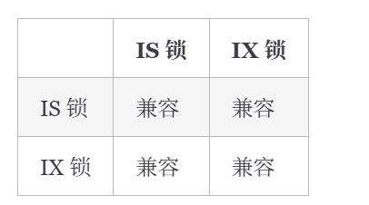
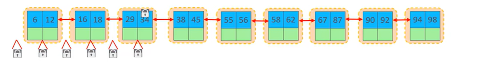

# 全局锁

1. 全局锁是对整个数据库实例加锁，加锁后数据只读，其他操作会被阻塞。
2. 在做全库的逻辑备份之前，需要加全局锁 ==> 保证数据的一致性(不然a表和b表之间有关联，数据会对不上)。 ==> 属于运维内容，了解即可。
3. mysqldump是用于备份和导出的mysql官方工具

# 表级锁

表级锁分为 表锁、元数据锁、意向锁三类。
## 表锁

1. 表锁分为两类：   

    （1）. read lock 共享读锁：加锁之后所有人都可以共享读表，但是都不能写表。

    ```sql
    lock tables tb_user read;
    ```   

    （2）. write lock 独占写锁：**写锁是一个独占锁**，拥有锁的人既可以读又可以写，其他人读和写都不行。

    ```sql
    lock tables tb_user write;
    ```   

## 元数据锁（meta data locl, MDL）

1. 元数据是描述数据库对象“结构与定义”的信息集合，比如**表结构信息** ==> **元数据不是表数据**

2. **元数据锁锁的对象是元数据不是表数据**，是为了维护元数据的数据一致性。

3. 元数据锁MDL是MySQL Server层控制的锁，不是给用户使用的锁。**一个会话对某个表进行增删改查的时候，防止其他会话对表结构进行变更**

4. 元数据锁的分类：   

    （1）. MDL_SHARED 共享读锁：增删改（DML语句）查（DQL语句）时获取，占有锁之后自己和其他会话都只能读不能写元数据；   

    （2）. MDL_EXCLUSIVE 独占写锁：DDL语句（ALTER TABLE）占有锁之后自己可读写，其他会话不能读也不能写。**拿到MDL_EXCLUSIVE的前提是没有任何其他MDL_SHARED、MDL_EXCLUSIVE被占有**

5. 为什么“一个慢事务”能拖垮整个表？ ==> MDL的队头阻塞        

     (1). 慢事务持有MDL_SHARED迟迟不提交事务；   

     (2). DDL语句申请MDL_EXCLUSIVE被阻塞；   

     (3). 新的DML/DQL请求来了，MySQL为了避免DDL饥饿不再给新的MDL_SHARED读锁 ==> 被阻塞   

     (4). 整个表的读写卡死。

## 意向锁 InnoDB引擎

1. 当表中某行已经有了行锁，另一个会话想给表加表锁 ==> 这个表锁可能会跟行锁冲突，因此加表锁之前如果逐行遍历所有数据看有没有行锁性能很差 ==> 在事务有意向给表中加行锁的同时给这个表加上对应的意向锁 ==> 这样就不用逐行遍历了（**意向锁相当于用来记录当前表的行锁的东西**）
2. 意向共享锁IS（）：如执行select...lock in share mode 语句，数据库会对应加IS；==> 与表锁共享读锁兼容，与表锁独占写锁互斥；   
3. 意向排他锁IX：由insert、update、delete、select...for update添加。==> 与表锁共享读锁、表锁独占写锁都互斥。 

3. **意向锁与意向锁之间是兼容的**

4. **意向锁是由数据引擎自己维护的，用户无法手动操作意向锁，在为数据行加共享/排他锁之前，InnoDB 会先占有该数据行所在在数据表的对应意向锁**。

# InnoDB行级锁

1. 锁住对应的行数据，锁定粒度最小，发生锁冲突的概率最低，并发性能最高。InnoDB引擎才有。

2. InnoDB行级锁分为三类：    

    （1）. 行锁record lock：锁定单个行记录，ReadCommit、RepeatableRead隔离级别下都支持；   

    （2）. 间隙锁 gap lock：锁定索引记录间隙，不是锁数据记录，是**保证索引记录的间隙不变、防止其他事务插入数据进来**，RepeatableRead隔离级别下支持；   

    （3）. 临键锁 next-key lock：行锁+间隙锁，**同时锁住命中的索引记录以及该记录前面的索引间隙 ==> 防止幻读**，RepeatableRead隔离级别下支持

3. 由于MVCC的存在，对于一般的select语句，InnoDB不会加任何锁，但是可以通过LOCK IN SHARE MODE等语句显式加锁

```sql
# 共享锁 可以在 MySQL 5.7 和 MySQL 8.0 中使用
SELECT ... LOCK IN SHARE MODE;
# 共享锁 可以在 MySQL 8.0 中使用
SELECT ... FOR SHARE;
# 排他锁
SELECT ... FOR UPDATE;
```


## 行锁

1. 行锁分为 共享读锁S 和 独占写锁 X


2. **行锁锁的是索引项，不是表数据**，因此如果**不使用索引检索数据**，如name字段没加索引，**就用不了行锁 ==> 升级成表锁**。

```sql
select * from tb_user where name = 'Tom'
```


## 临键锁

1. **什么情况下不会有临键锁**（重要）？   

    **使用唯一索引 + 等值查询 并且存在对应记录 ==> 因为可以唯一命中一行，只加行锁record lock就行。** 不需要锁定索引间隙。

2. 什么情况下会有间隙锁？   

    在唯一索引 + 等值查询 但是查询的是一个不存在的记录，如where id = 100，此时表中还没有id等于100的数据 ==> 就会变成范围包含id = 100的间隙锁，防止其他事务更改这个间隙。   

3. 对于select * ... where id > 10 或者其他字段（可能是普通索引可能是唯一索引），用间隙锁还是临键锁都是为了满足不幻读的要求，**间隙锁相当于锁一个左开右开区间（a,b），临键锁相当于锁一个左开右闭的区间（a，b]**, 具体用哪个只要拼起来满足查询要求即可。

4. 通过下列语句可以查询当前实例中，所有数据库、所有表上，正在持有或等待的 InnoDB 数据锁，包括行锁、间隙锁、临键锁、表级意向锁。

```sql
select object_schema, object_name, index_name,lock_type,lock_mode,lock_data
    from performance_schema.data_locks;
```

# 当前读 和 快照读 ？ todo 先了解MVCC