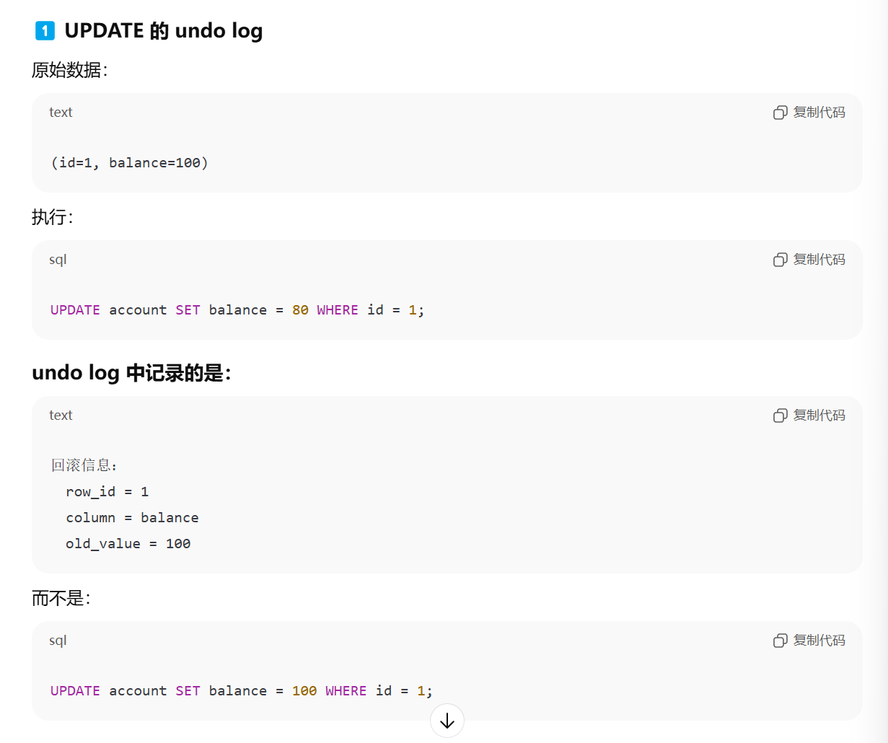
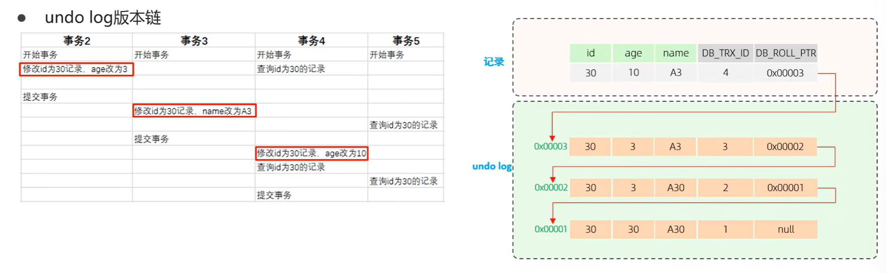
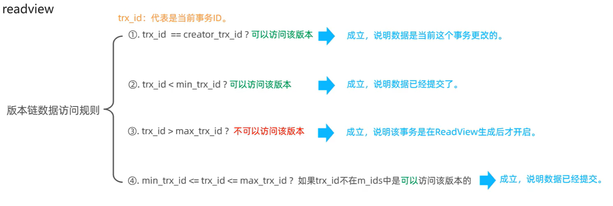
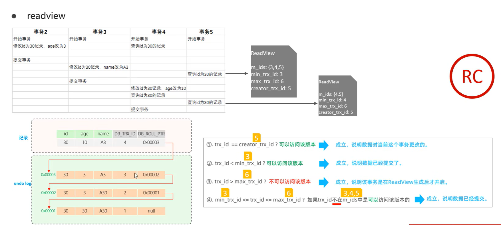
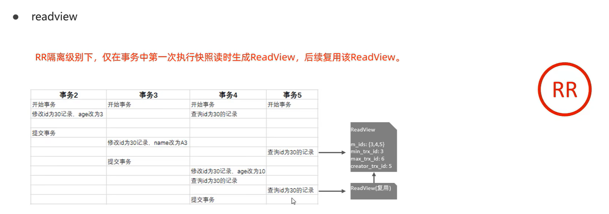
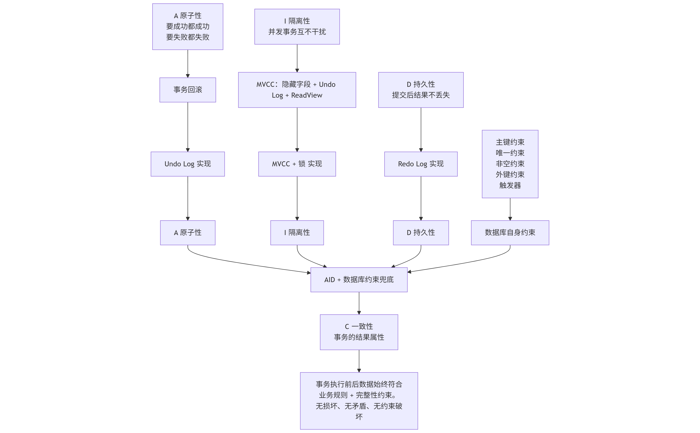

# InnoDB引擎

## 逻辑存储结构


1. 表空间（ibd文件） -> 段Segment -> Extent区 -> Page页 ->Row行。

2. InnoDB是索引组织表，段就是索引树上的节点:数据段是B+树的叶子节点，索引段是B+树的非叶子节点。

## 架构

1. InnoDB引擎分为内存结构(In-Memory Structures) + 磁盘结构(On-Disk Structures)


2. 内存中有各种缓冲区，每次查询都先去Buffer中找，找不到再去磁盘加载 ==> 减少硬盘IO开销，提升性能。**对数据页做了修改，也会把修改内容更新在Buffer中。**

## 事务原理

1. 事务是一组操作的集合，是一个不可分割的工作单位，这组操作要么都成功要么都失败。

2. InnoDB实现事务（ACDI）：   

    (1). 通过redo log 和 undo log实现原子性、一致性、持久性；   

    (2). 通过锁和MVCC实现隔离性。

3. **InnoDB是怎么实现事务的**


### InnoDB redo log 重做日志 ==> 用于已提交事务的崩溃恢复 ==> 保证事务的持久性

1. redo log由两部分组成，一部分是内存中的重做日志缓冲redo log buffer，另一个部分是磁盘中的重做日志文件redo log file。


2. **脏页**就是被修改但尚未刷盘的数据页。

3. 当MySQL实例挂了或宕机，重启之后InnoDB引擎会读取磁盘中的redo file，用来恢复数据 ==> **保证数据的持久性**

4. InnoDB引擎什么时候把redo log buffer中的内容更新到磁盘中的redo.file文件呢（以下简称刷盘）？ 

    4.1. 不管什么时候刷盘，**刷盘路径**都如下：    
  
        修改数据页    （MySQL内存）   

                  ↓ 生成 
        InnoDB redo log buffer  （MySQL内存）      

                  ↓ write()   

        OS page cache  （操作系统内核维护的一块内存区域）   
        
                  ↓ fsync()   

        磁盘（生成redo.file）    

                  ↓    
        数据页刷新（Write-Ahead Logging， WAL原则）    

                  ↓ 
        Checkpoint 前移（标记 redo 可回收边界）
    
    4.2. **InnoDB存储引擎有一个后台线程，每隔1s**，就会把redo log buffer中的内容写到操作系统内存的page cache然后调用fsync刷盘。

    4.3. **innodb_flush_log_at_trx_commit**参数，不同参数值刷盘时机不同
        
    （1）. innodb_flush_log_at_trx_commit = 0; **每次提交事务时不刷盘**，只依靠InnoDB后台现成刷盘 ==> MySQL挂了或宕机可能会丢失最近1s内的事务。 
         

    （2）. innodb_flush_log_at_trx_commit = 1; **每次提交事务的时候都刷盘** ==> 只要事务提交成功就不会丢失数据。    

    （3）. innodb_flush_log_at_trx_commit = 2;**每次事务提交时不刷盘，只是把redo log buffer里的内容写入文件系统缓存page cache** ==> MySQL挂了不会丢数据，因为已经存到**操作系统page cache**了，宕机可能会丢最近1s的数据，因为page cache的数据还没来得及刷盘进磁盘。    

    4.4. CheckPoint需要被推进时（见下面第5、6条内容）

5. Checkpoint 和 Write-Ahead Logging (WAL) ：   

    (1). **Write-Ahead Logging，WAL预写入日志原则**就是 **任何对数据页的修改，在对应的数据页写回磁盘之前，必须先把redo log写入磁盘的对应日志文件中**   

    (2). CheckPoint是一个“位置指针”，表示在此之前的数据页已经完成刷盘，**遇到崩溃时就从CheckPoint开始恢复数据**。**当系统需要推进 Checkpoint时，InnoDB需要对CheckPoint之前的所有脏页进行刷盘操作** ==> 根据 WAL 原则，数据页刷盘之前，其对应的 redo log 必须已经写入并持久化到日志文件。

6. CheckPoint什么时候需要被推进呢？   

    **由 redo 日志空间压力、脏页比例、内存回收需求以及后台周期性任务等因素驱动**；其目标是在满足 WAL 原则的前提下，持续推进可恢复边界，从而限制崩溃恢复时间并回收 redo 空间。 ==> CheckPoint需要被推进的本质是 不能再拖了，必须要把一部分脏页刷盘、推进redo可回收边界。

7. **为什么非要用redo log，为什么不每次修改后直接刷新数据页到磁盘中**？   

    (1). 写进磁盘的redo.file文件是顺序写，使用连续的磁盘空间，数据页在磁盘上是随机分布的，因此每次事务提交都直接写数据页**性能很差**。 ==>(**4中的刷盘指的是写redolog到磁盘的redo.file文件中，不是写数据页到磁盘中，即使innodb_flush_log_at_trx_commit = 1，数据页也是由InnoDB引擎的后台线程调度、合并多次事务写一次数据页**)   

    (2). 使用redolog**并发性能更高**，基于（1）==> 写redo比修改数据页快，锁可以更快是方法，数据页让InnoDB引擎的后台线程慢慢刷，不影响并发性能。

8. redo日志文件组：硬盘上存储的redo log日志文件不止一个，**是以日志文件组的形式出现，每个大小都一样，环形数组循环写**。

### InnoDB undo log 回滚日志 ==> 用于支持事务回滚和MVCC多版本并发控制 ==> 事务原子性要么全不做要么全做，这就需要事务回滚 ==> undo log用来保证事务的原子性

1. **undo log是为了支持事务回滚（撤销事务、把数据恢复到事务开始前的状态） 和MVCC 多版本并发控制**。
2. undo log是逻辑日志，记录的是行变更日志，undo log的内容不等价于SQL语句。


3. undo log的两种类型：   

    (1). Insert undo log,因为insert操作只对当前事务可见，所以事务提交之后可以直接丢弃insert undo log、不参与MVCC；   

    (2). Update undo log，用于update、delete操作，因为是对已有数据的操作，可能会影响其他事务的一致性读（Consistent Read），所以事务提交之后不能马上删除update undo log。

4. undo log与MVCC的配合流程 ==> 当执行一条select语句，InnoDB会取当前行版本判断该版本是否对事务可见，如果可见就直接返回；不可见就找undo log，根据undo log构造历史版本，直到找到第一个当前事务的可见版本然后返回。==> 这就是 **一致性读 Consistent Read**。

5. undolog什么时候会被清理？InnoDB的purge线程会定期扫描，当没有任何事务需要用到这个版本的undo log时，purge线程会回收掉。 ==> 有长事务一直不提交，undo log就会堆积，因此要避免大事务和长事务。

### undo log、 redo log对比

1. undo log发生在数据修改前，redo log发生在数据修改后； undo log是逻辑日志， redo log是物理日志。


### binlog

1. **binlog是MySQL Server层的日志**，不是InnoDB引擎独有的。==> **不管用的什么存储引擎只要表数据更新都会产生binlog日志**。

2. **binlog主要用于数据备份、主备、主主、主从 ==> 保证MySQL集群架构的数据一致性**。   

    （1）. 以主从复制为例，主库写binlog，从库拉取binlog并重现用来复制数据。
    

3. binlog是逻辑日志，记录做了什么操作。**binlog的三种格式**：   

    (1). **statement(语句模式)，记录原始sql语句** ==> 日志量小但是对于 now() rand()这种 在不同时间执行结果会不一样，即**数据不一致** ==> **生产不用这种。**   

    (2). **row(行模式)**，记录sql语句+数据内容 ==> 准确、不会主从不一致，缺点是binlog体积大 ==> **生产默认**   

    (3). **mixed(混合模式)**，默认用statement，遇到会数据不一致的sql用row模式

### redo log和binlog有什么不同

1. **undo log和binlog都是逻辑日志，redo log是物理页修改。**

2. redo log是InnoDB引擎独有的日志，binlog是所有引擎通用。

3. redo log是循环写，binlog是追加写，不会覆盖旧日志。

4. **记录时机不同：redo log是事务执行过程中持续写入，binlog只在事务提交时一次性写入**。

### 两阶段提交

1. 为了避免redolog和binlog不一致（因为写入时机不同，如果数据库在不同时机发生异常，可能会导致两个日志不一致），MySQL采用**两阶段提交** ==> **把redo log的写入拆成了prepare和commit两个阶段**。

2. MySQL提交顺序：   

    (1). 第一阶段：Prepare预提交：   

        a. 执行SQL
        b. InnoDB写Undo Log
        c. InnoDB写Redo Log(prepare状态)

    (2). 第二阶段：Commit提交：

        d. MySQL Server写Binlog
        e. InnoDB写Redo Log(commit状态)    
    
    事务完成    

3. MySQL在任何阶段发生异常，**判断事务是回滚还是提交，应该以binlog为准**：   

    (1). 未生成binlog，判断事务未完成 ==> 回滚： 

        如 崩溃发生在redo prepare之前，或者redo prepare之后但是binlog之前，此时回滚事务 主从都是一致的。  

    (2). 生成binlog，判断事务应当成功 ==> 提交事务:

        如 崩溃发生在binlog之后、redo commit之前，因为有redo prepare存在，可以根据redo prepare补写redo commit，提交事务 主从也一致。

4. **为什么要以binlog为准：**   

    (1). binlog是“业务事实”，redo log是物理页修改不是业务层面的，不可迁移；   
    
    

    (2). 主从复制只认binlog；   

    (3). **redo log是InnoDB引擎私有的实现细节，不是整个MySQL层面的**。

## InnoDB对MVCC的实现

### 当前读依赖锁

1. 当前读current read：**读取的是最新的已提交版本的记录，并在读取时对记录加锁，不允许其他事务修改锁定的数据，用锁而不是MVCC来保证并发一致性。** ==> **所有会加锁的操作都是当前读**，因此又叫锁定读Locking Reads： 

    ```sql
    select ... for update;
    select ... lock in share mode;
    update ...
    delete ...
    insert ...
    ```

2. Repeatable Read时，如果是当前读，要配合next-key lock 临键锁来防止幻读，不让其他事务在间隙插入数据：  

    ```sql
    -- RR
    BEGIN;
    SELECT * FROM t WHERE age BETWEEN 10 AND 20;  
    
    锁住了age = 10， 12 ，18 的三行，但是其他事务可以往间隙插入数据如age = 15的数据，那么下一次select * FROM t WHERE age BETWEEN 10 AND 20; 就会多一行age = 15的数据 ==> 导致幻读 ==> 因此要使用临键锁。
    ```

### 快照读依赖MVCC

1. 快照读是基于事务开始时数据库中的状态创建的。**事务不会读取其他事务尚未提交的修改**。快照读在不同的事务隔离级别下有不同的表现：   

    (1). Read Uncommitted，能读取其他事务未提交的修改 ==> 不是快照读；   

    (2). Read Committed，每条select都会创建一个新的ReadView、生成一个快照读；==> 因此会话1的事务未提交，也能读到其他事务已提交的数据。

    (3). Repeatable Read, 开启事务后第一个select创建快照读和ReadView，后续每个select都服用第一个的ReadView。==> 实现可重复读。   

    (4). Serializable 快照读退化为当前读，所有select都等价于select ... lock in share mode。

2. **快照读实现了非阻塞读**

### MVCC概念

1. MVCC的概念：Multi-Version Concurrency Control，多版本并发控制。用于在多个并发事务同时读写数据库时保持数据的一致性和隔离性。通过维护一个数据行的多个版本来实现的。

### MVCC的实现原理：隐藏字段 + ReadView + undo log ==> InnoDB特有的

#### 表结构的隐藏字段 ==> InnoDB特有的，InnoDB内部实现的

1. DB_TRX_ID， 最近修改数据的事务ID；

2. DB_ROLL_PTR， 回滚指针，**配合undo log**指向这条记录的上一个版本；

3. DB_ROW_ID，隐藏主键，如果表结构没有指定主键才会有这个字段，**如果指定了主键就不存在这个字段**


#### undo log日志

1. undo log版本链 ==> 不同事务或同一事务对某条记录进行修改，会导致该记录的undolog生成一条记录版本链表。


#### ReadView

1. ReadView是InnoDB在进行快照读时创建的一份“事务可见性规则表”，用于判断某条记录对当前事务是否可见。包含四个字段：    

| 字段                 | 含义                                |
| ------------------ | --------------------------------- |
| **creator_trx_id** | 创建该 ReadView 的事务 ID（当前事务）         |
| **m_ids**          | 创建 ReadView 时，**活跃（未提交）事务 ID 列表** |
| **min_trx_id**     | m_ids 中最小的事务 ID                   |
| **max_trx_id**     | 创建 ReadView 时，**系统即将分配的下一个事务 ID，不在m_ids中** |


2. RR情况下，ReadView是在事务内第一次select时才创建的，**不是事务刚开始之后立即创建的**。

3. ReadView和undo log合作，判断快照读应该读哪个版本，规则如下




过程就是：

```sql
SELECT
  ↓
创建 / 获取 ReadView
  ↓
扫描记录
  ↓
判断记录版本是否可见
  ↓
不可见 → 沿 undo log 回溯旧版本
  ↓
直到找到可见版本

```

## InnoDB是怎么实现事务的ACID的

1. A 原子性 :    

    要成功都成功，要失败都失败 ==> 事务的回滚 ==> undo log

2. I隔离性 :   

    MVCC（隐藏字段 + undo log + ReadView） + 锁 ==> 事务的隔离性

3. D持久性 ： redo log实现

4. C一致性 :    
    
    一致性指的是：事务执行前，数据库的数据是符合「业务规则 + 完整性约束」的合法状态；事务结束之后，数据库的数据仍然是合法的完整状态，不会出现数据损坏、约束破坏、逻辑矛盾的情况。

    **一致性**是事务的目标，**是结果属性**，**A/I/D + 数据库自身约束**（主键约束、唯一约束、非空约束、外键约束、触发器等） **提供实现一致性的基础**。 



```sql
flowchart TD
    %% ======================
    %% 上层：A / I / D 各自的完整实现机制（最详细展开）
    %% ======================
    A1["A 原子性
要成功都成功
要失败都失败"]
    A2["事务回滚"]
    A3["Undo Log 实现"]
    A1 --> A2 --> A3

    I1["I 隔离性
并发事务互不干扰"]
    I3["MVCC + 锁 实现"]
    I2["MVCC：隐藏字段 + Undo Log + ReadView"]
    I1 --> I2 --> I3

    D1["D 持久性
提交后结果不丢失"]
    D2["Redo Log 实现"]
    D1 --> D2

    %% ======================
    %% 中层：A / I / D 三大核心特性 聚合节点
    %% ======================
    A["A 原子性"]
    I["I 隔离性"]
    D["D 持久性"]
    A3 --> A
    I3 --> I
    D2 --> D

    %% ======================
    %% 下层：一致性 终极目标（完整定义+保障来源+约束兜底）
    %% ======================
    C["AID + 数据库约束兜底"]
    C1["事务执行前后数据始终符合业务规则 + 完整性约束。
    无损坏、无矛盾、无约束破坏"]
    C2["C 一致性
事务的结果属性"]
    C3["数据库自身约束"]
    C4["主键约束
唯一约束
非空约束
外键约束
触发器"]

    %% ======================
    %% 所有关联关系 精准连接
    %% ======================
    A --> C
    I --> C
    D --> C
    C2 --> C1
    C --> C2
    C3 --> C
    C4 --> C3
```