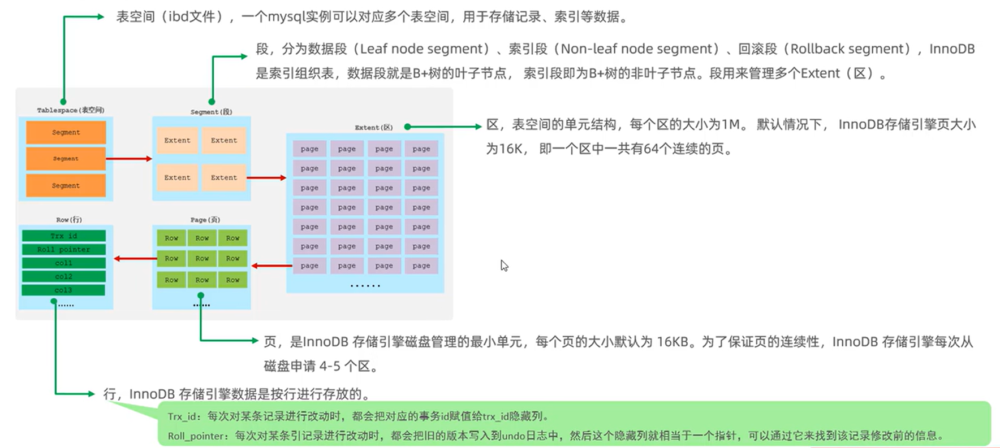
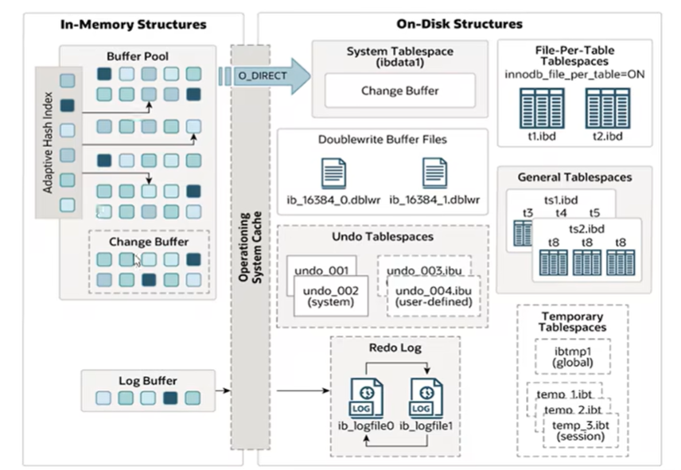
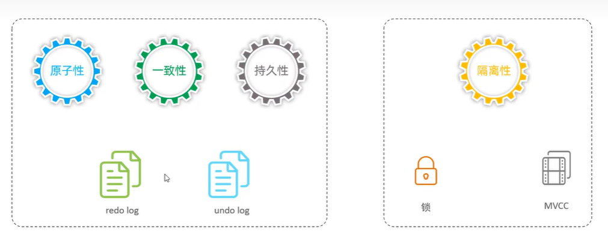
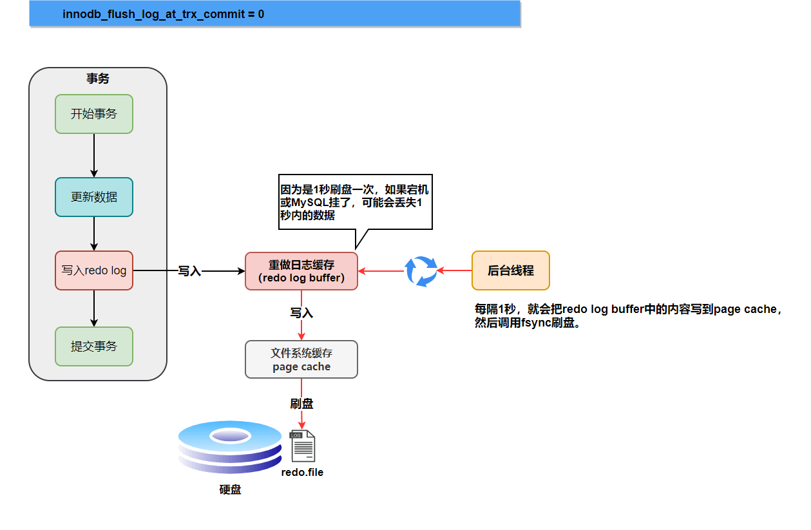
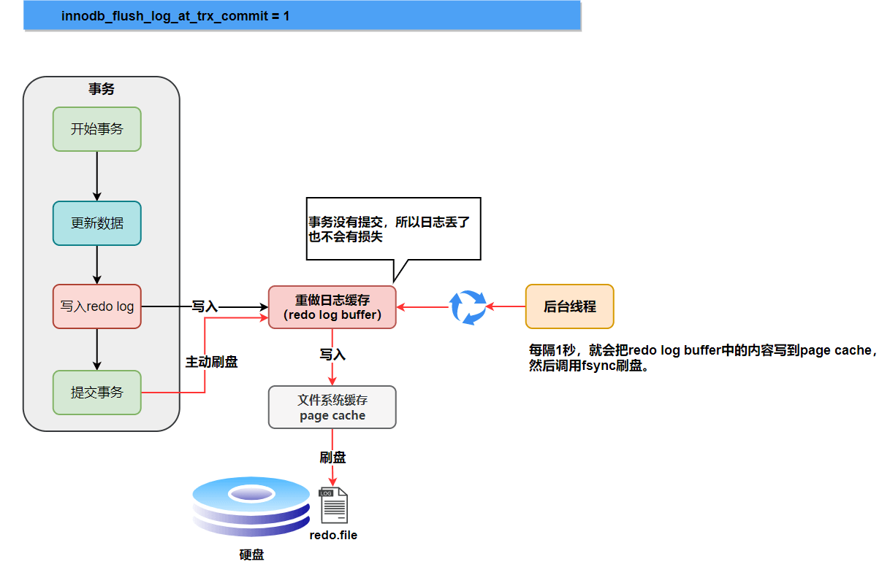
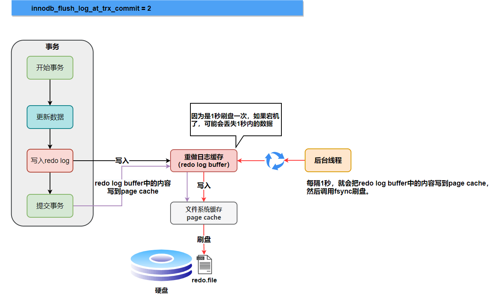
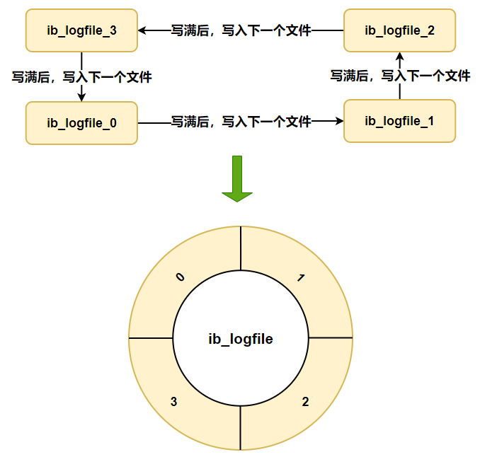

# InnoDB引擎

## 逻辑存储结构

1. 表空间（ibd文件） -> 段Segment -> Extent区 -> Page页 ->Row行。

2. InnoDB是索引组织表，段就是索引树上的节点:数据段是B+树的叶子节点，索引段是B+树的非叶子节点。

## 架构

1. InnoDB引擎分为内存结构(In-Memory Structures) + 磁盘结构(On-Disk Structures)

2. 内存中有各种缓冲区，每次查询都先去Buffer中找，找不到再去磁盘加载 ==> 减少硬盘IO开销，提升性能。**对数据页做了修改，也会把修改内容更新在Buffer中。**

## 事务原理

1. 事务是一组操作的集合，是一个不可分割的工作单位，这组操作要么都成功要么都失败。

2. InnoDB实现事务（ACDI）：   

    (1). 通过redo log 和 undo log实现原子性、一致性、持久性；   

    (2). 通过锁和MVCC实现隔离性。

3. **InnoDB是怎么实现事务的**

### InnoDB redo log 重做日志 ==> 事务的持久性

1. redo log由两部分组成，一部分是内存中的重做日志缓冲redo log buffer，另一个部分是磁盘中的重做日志文件redo log file。

2. **脏页**就是被修改但尚未刷盘的数据页。

3. 当MySQL实例挂了或宕机，重启之后InnoDB引擎会读取磁盘中的redo file，用来恢复数据 ==> **保证数据的持久性**

4. InnoDB引擎什么时候把redo log buffer中的内容更新到磁盘中的redo.file文件呢（以下简称刷盘）？ 

    4.1. 不管什么时候刷盘，**刷盘路径**都如下：    
  
        修改数据页    （MySQL内存）   

                  ↓ 生成 
        InnoDB redo log buffer  （MySQL内存）      

                  ↓ write()   

        OS page cache  （操作系统内核维护的一块内存区域）   
        
                  ↓ fsync()   

        磁盘（生成redo.file）    

                  ↓    
        数据页刷新（Write-Ahead Logging， WAL原则）    

                  ↓ 
        Checkpoint 前移（标记 redo 可回收边界）
    
    4.2. **InnoDB存储引擎有一个后台线程，每隔1s**，就会把redo log buffer中的内容写到操作系统内存的page cache然后调用fsync刷盘。

    4.3. **innodb_flush_log_at_trx_commit**参数，不同参数值刷盘时机不同
        
    （1）. innodb_flush_log_at_trx_commit = 0; **每次提交事务时不刷盘**，只依靠InnoDB后台现成刷盘 ==> MySQL挂了或宕机可能会丢失最近1s内的事务。 
         

    （2）. innodb_flush_log_at_trx_commit = 1; **每次提交事务的时候都刷盘** ==> 只要事务提交成功就不会丢失数据。    

    （3）. innodb_flush_log_at_trx_commit = 2;**每次事务提交时不刷盘，只是把redo log buffer里的内容写入文件系统缓存page cache** ==> MySQL挂了不会丢数据，因为已经存到**操作系统page cache**了，宕机可能会丢最近1s的数据，因为page cache的数据还没来得及刷盘进磁盘。    

    4.4. CheckPoint需要被推进时（见下面第5、6条内容）

5. Checkpoint 和 Write-Ahead Logging (WAL) ：   

    (1). **Write-Ahead Logging，WAL预写入日志原则**就是 **任何对数据页的修改，在对应的数据页写回磁盘之前，必须先把redo log写入磁盘的对应日志文件中**   

    (2). CheckPoint是一个“位置指针”，表示在此之前的数据页已经完成刷盘，**遇到崩溃时就从CheckPoint开始恢复数据**。**当系统需要推进 Checkpoint时，InnoDB需要对CheckPoint之前的所有脏页进行刷盘操作** ==> 根据 WAL 原则，数据页刷盘之前，其对应的 redo log 必须已经写入并持久化到日志文件。

6. CheckPoint什么时候需要被推进呢？   

    **由 redo 日志空间压力、脏页比例、内存回收需求以及后台周期性任务等因素驱动**；其目标是在满足 WAL 原则的前提下，持续推进可恢复边界，从而限制崩溃恢复时间并回收 redo 空间。 ==> CheckPoint需要被推进的本质是 不能再拖了，必须要把一部分脏页刷盘、推进redo可回收边界。

7. **为什么非要用redo log，为什么不每次修改后直接刷新数据页到磁盘中**？   

    (1). 写进磁盘的redo.file文件是顺序写，使用连续的磁盘空间，数据页在磁盘上是随机分布的，因此每次事务提交都直接写数据页**性能很差**。 ==>(**4中的刷盘指的是写redolog到磁盘的redo.file文件中，不是写数据页到磁盘中，即使innodb_flush_log_at_trx_commit = 1，数据页也是由InnoDB引擎的后台线程调度、合并多次事务写一次数据页**)   

    (2). 使用redolog**并发性能更高**，基于（1）==> 写redo比修改数据页快，锁可以更快是方法，数据页让InnoDB引擎的后台线程慢慢刷，不影响并发性能。

8. redo日志文件组：硬盘上存储的redo log日志文件不止一个，**是以日志文件组的形式出现，每个大小都一样，环形数组循环写**。

### undo log ==> 事务的原子性

## MVCC