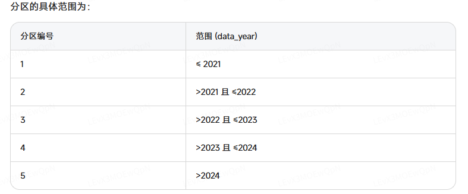

以下是基于现有表中的年份字段(如YYYY格式的整数或字符型)创建年分区的完整步骤：

1. 准备工作：检查年份字段
sql
-- 查看年份字段的数据分布

```SQL
SELECT 
    MIN(YearColumn) AS MinYear,
    MAX(YearColumn) AS MaxYear,
    COUNT(*) AS TotalRows
FROM YourTableName;
```

-- 检查年份字段的数据类型

```SQL
SELECT COLUMN_NAME, DATA_TYPE 
FROM INFORMATION_SCHEMA.COLUMNS 
WHERE TABLE_NAME = 'YourTableName' 
AND COLUMN_NAME = 'YearColumn';

```
2. 创建分区函数（根据年份字段类型）
情况1：年份是INT类型
sql
```SQL
-- 假设年份范围从2020到2024
CREATE PARTITION FUNCTION YearIntPartitionPF (int)
AS RANGE RIGHT FOR VALUES (
    2021,  -- 2020年及之前
    2022,  -- 2021年
    2023,  -- 2022年
    2024   -- 2023年
    -- 2024年及以后进入下一个分区
);

```
上述sql代码会把表分为5个区间

有几个区间，分区方案中就要有几个[PRIMARY]参数，或者使用简化语法ALL TO ([PRIMARY]), 这里的PRIMARY指的是主文件组。

```sql
CREATE PARTITION SCHEME YearIntPartitionPS
AS PARTITION YearIntPartitionPF
ALL TO ([PRIMARY]);  -- 等价于 TO ([PRIMARY], [PRIMARY], ..., [PRIMARY])
```

情况2：年份是CHAR(4)或VARCHAR类型
```sql
-- 需要确保所有值都是有效的4位年份
CREATE PARTITION FUNCTION YearCharPartitionPF (char(4))
AS RANGE RIGHT FOR VALUES (
    '2021',  -- 2020年及之前
    '2022',  -- 2021年
    '2023',  -- 2022年
    '2024'   -- 2023年
);
```
3. 创建分区方案
```sql
-- 为INT类型年份创建方案
CREATE PARTITION SCHEME YearIntPartitionPS
AS PARTITION YearIntPartitionPF
TO ([PRIMARY], [PRIMARY], [PRIMARY], [PRIMARY], [PRIMARY]);

-- 或为CHAR类型年份创建方案
CREATE PARTITION SCHEME YearCharPartitionPS
AS PARTITION YearCharPartitionPF
TO ([PRIMARY], [PRIMARY], [PRIMARY], [PRIMARY], [PRIMARY]);
```
4. 为现有表创建分区索引
方案A：重建聚集索引
```sql
-- 1. 删除现有聚集索引
DROP INDEX IX_YourTableName ON dbo.YourTableName;

-- 2. 重建聚集索引并应用分区方案
CREATE CLUSTERED INDEX IX_YourTableName 
ON dbo.YourTableName(YearColumn)
ON YearIntPartitionPS(YearColumn);  -- 或YearCharPartitionPS
```
方案B：处理主键约束
```sql
-- 1. 删除主键
ALTER TABLE dbo.YourTableName DROP CONSTRAINT PK_YourTableName;

-- 2. 重建非聚集主键
ALTER TABLE dbo.YourTableName 
ADD CONSTRAINT PK_YourTableName PRIMARY KEY NONCLUSTERED (IDColumn);

-- 3. 创建分区聚集索引
CREATE CLUSTERED INDEX IX_YourTableName 
ON dbo.YourTableName(YearColumn)
ON YearIntPartitionPS(YearColumn);
```
5. 验证分区结果
```sql
-- 查看分区分布情况
SELECT 
    $PARTITION.YearIntPartitionPF(YearColumn) AS PartitionNumber,
    COUNT(*) AS RowCount,
    MIN(YearColumn) AS MinYear,
    MAX(YearColumn) AS MaxYear
FROM dbo.YourTableName
GROUP BY $PARTITION.YearIntPartitionPF(YearColumn)
ORDER BY PartitionNumber;
```
6. 分区维护操作
添加新年分区
```sql
-- 对于INT类型年份
ALTER PARTITION SCHEME YearIntPartitionPS
NEXT USED [PRIMARY];

ALTER PARTITION FUNCTION YearIntPartitionPF()
SPLIT RANGE (2025);  -- 添加2024年分区

-- 对于CHAR类型年份
ALTER PARTITION SCHEME YearCharPartitionPS
NEXT USED [PRIMARY];

ALTER PARTITION FUNCTION YearCharPartitionPF()
SPLIT RANGE ('2025');
```
合并旧分区
```sql
-- 合并2020和2021年分区(INT)
ALTER PARTITION FUNCTION YearIntPartitionPF()
MERGE RANGE (2021);

-- CHAR类型
ALTER PARTITION FUNCTION YearCharPartitionPF()
MERGE RANGE ('2021');
```
7. 动态分区管理脚本
```sql
-- 自动添加当年和下一年的分区
DECLARE @CurrentYear INT = YEAR(GETDATE());
DECLARE @NextYear INT = @CurrentYear + 1;
DECLARE @SQL NVARCHAR(MAX);

-- 检查分区是否已存在
IF NOT EXISTS (
    SELECT * FROM sys.partition_range_values 
    WHERE function_id = FUNCTION_ID('YearIntPartitionPF')
    AND value = @NextYear
)
BEGIN
    SET @SQL = N'
    ALTER PARTITION SCHEME YearIntPartitionPS
    NEXT USED [PRIMARY];
    
    ALTER PARTITION FUNCTION YearIntPartitionPF()
    SPLIT RANGE (' + CAST(@NextYear AS VARCHAR) + ');';
    
    EXEC sp_executesql @SQL;
    PRINT 'Added partition for year ' + CAST(@NextYear AS VARCHAR);
END
ELSE
BEGIN
    PRINT 'Partition already exists for year ' + CAST(@NextYear AS VARCHAR);
END
```
注意事项
数据类型一致：确保分区函数参数类型与年份字段类型完全匹配

数据验证：确保年份字段值有效且完整

性能考虑：大表分区操作可能耗时，建议在低峰期执行

备份：操作前备份数据库

文件组规划：生产环境建议为不同分区使用不同文件组

最佳实践
为年份字段创建检查约束确保数据质量：

```sql
ALTER TABLE YourTableName
ADD CONSTRAINT CK_ValidYear 
CHECK (YearColumn BETWEEN 2000 AND YEAR(GETDATE()) + 1);
```
考虑使用计算列规范化年份格式：

```sql
ALTER TABLE YourTableName
ADD YearNormalized AS (CASE 
    WHEN ISNUMERIC(YearColumn) = 1 THEN CAST(YearColumn AS INT)
    ELSE NULL 
END) PERSISTED;
```
建立定期维护作业检查和管理分区。


问题todo：

1. id类型为什么用nvarchar,join时会不会影响查询效率？
2. area_path、category_path字段实现树形结构存储，什么是树形结构存储
3. PRIMARY指的是主文件组，什么是主文件组？

## 实际的做法dbo.biz_energy_consumption表按年添加分区

```sql
--删除所有使用了data_year的索引
DROP INDEX idx_bec_year ON dbo.biz_energy_consumption;
DROP INDEX idx_bec_ym ON dbo.biz_energy_consumption;
DROP INDEX idx_bec_ymd ON dbo.biz_energy_consumption;

--data_year设置为not null
alter table dbo.biz_energy_consumption
    alter column data_year int not null
go

SELECT
    MIN(data_year) AS MinYear,
    MAX(data_year) AS MaxYear,
    COUNT(*) AS TotalRows
FROM biz_energy_consumption;

SELECT COLUMN_NAME, DATA_TYPE
FROM INFORMATION_SCHEMA.COLUMNS
WHERE TABLE_NAME = 'biz_energy_consumption'
AND COLUMN_NAME = 'data_year';

--创建分区函数
CREATE PARTITION FUNCTION biz_energy_consumption_YearIntPartitionPF (int)
AS RANGE RIGHT FOR VALUES (
    2020,
    2021,
    2022,
    2023,
    2024,
    2025,
    ...当前加到2035年
);


--创建分区方案 分区名字跟表相关
CREATE PARTITION SCHEME biz_energy_consumption_YearIntPartitionPS
AS PARTITION biz_energy_consumption_YearIntPartitionPF
ALL TO ([PRIMARY]);

--测试用的分区函数和方案要删除
-- DROP PARTITION SCHEME YearIntPartitionPS;
-- DROP PARTITION SCHEME SUB1YearIntPartitionPS1;
-- DROP PARTITION FUNCTION YearIntPartitionPF;
-- DROP PARTITION FUNCTION SUB1YearIntPartitionPF;

-- 删除主键
ALTER TABLE dbo.biz_energy_consumption DROP CONSTRAINT biz_energy_consumption_pkey;

--重建非聚集主键
ALTER TABLE dbo.biz_energy_consumption
ADD CONSTRAINT biz_energy_consumption_pkey PRIMARY KEY NONCLUSTERED (id, data_year);

-- 创建分区聚集索引
CREATE CLUSTERED INDEX index_biz_energy_consumption
ON dbo.biz_energy_consumption(id,data_year)
WITH (
    PAD_INDEX = OFF,
    STATISTICS_NORECOMPUTE = OFF,
    IGNORE_DUP_KEY = OFF,
    ALLOW_ROW_LOCKS = ON,
    ALLOW_PAGE_LOCKS = ON
)
ON biz_energy_consumption_YearIntPartitionPS(data_year);

-- 查看分区分布情况-验证
SELECT
    $PARTITION.biz_energy_consumption_YearIntPartitionPF(data_year) AS PartitionNumber,
    COUNT(*) AS NUMBER,
    MIN(data_year) AS MinYear,
    MAX(data_year) AS MaxYear
FROM dbo.biz_energy_consumption
GROUP BY $PARTITION.biz_energy_consumption_YearIntPartitionPF(data_year)
ORDER BY PartitionNumber;

--创建之前删除的索引
create index idx_bec_year
    on dbo.biz_energy_consumption (data_year)
go

create index idx_bec_ym
    on dbo.biz_energy_consumption (data_year, data_month)
go

create index idx_bec_ymd
    on dbo.biz_energy_consumption (data_year, data_month, data_day)
go
```

1. 分区的数量最好是2的幂次方；
2. SQL动态添加分区未实现，因此当前分区加到2035年，后续需要添加分区时执行下面语句：

```sql
ALTER PARTITION SCHEME biz_energy_consumption_YearIntPartitionPS
NEXT USED [PRIMARY]; -- 使用PRIMARY文件组作为下一个分区的存储

-- 然后再执行SPLIT RANGE
ALTER PARTITION FUNCTION biz_energy_consumption_YearIntPartitionPF()
SPLIT RANGE (2036);
```

3. --查询分区函数当前的边界值

```sql

SELECT
    pf.name AS PartitionFunctionName,
    prv.value AS BoundaryValue,
    prv.boundary_id AS BoundaryID
FROM sys.partition_functions pf
JOIN sys.partition_range_values prv ON pf.function_id = prv.function_id
WHERE pf.name = 'biz_energy_consumption_YearIntPartitionPF'
ORDER BY prv.boundary_id;

```