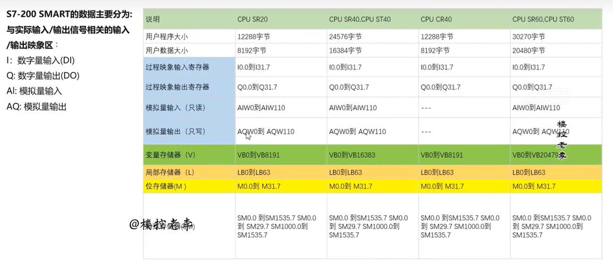

1. 控制器西门子S7-200-smart
2. 回风和新风阀门是模拟信号。TODO模拟信号意味着什么？
3. 送风是用送风的压力控制送风的变频，这里是PID控制。

4. **控制点表**是什么？控制点表在PLC(可编程逻辑控制器)中是一种用于**记录和管理**PLC程序中的**所有输入输出点位、内部变量和功能模块**的文档。
5. DI、DO是数字量输入和输出，数字量是离散信号；AI、AO是模拟量输入和输出，模拟量是连续的、随时间平滑变化的信号。

下图中的冷水阀冬天走热水、夏天走冷水。


5. 楼宇自控的控制器名称一般都是SR，其中的R表示继电器输出。
6. 开关量是**二值状态**的信号，不是开就是关，属于数字量的一种。
7. PLC编程的时候要根据控制点表在软件上把设备和输入输出信号一一对应的设置好、**一一映射**。


## 新风阀 + 送分阀 + 送风机 的 顺序启停

1. 新风阀和回风阀的开度之和一般等于100%，如新风阀开度30%、回风阀开度70% ==> 两个加起来给送风。
2. **顺序启停** ==> 风阀和风机之间的启停有顺序关系，正确的启停顺序可以降低延长设备寿命、降低能耗，在开启之前都要检查风阀和风机能正常运行、没出故障：   
    (1). 启动流程：先开风阀，等风阀启动完毕之后启动风机，**如果风机在一定时间内（10s~30s）没打开，就关闭已经打开的风阀**；   

    (2). 停机流程：先停风机，后关闭风阀。   

    (3). 如果有人手动开风机，控制风阀打开。


风阀风机的顺序启停PLC编程示例

```ST
// 启动逻辑
IF Start_Command THEN
    Open_Damper := TRUE;
    IF Damper_Open_Feedback THEN
        Ton_Timer(IN := TRUE, PT := T#5S);
        IF Ton_Timer.Q THEN
            Start_Fan := TRUE;
        END_IF;
    END_IF;
END_IF;

// 停机逻辑
IF Stop_Command THEN
    Start_Fan := FALSE;
    Toff_Timer(IN := TRUE, PT := T#20S);
    IF Toff_Timer.Q THEN
        Open_Damper := FALSE;
    END_IF;
END_IF;
```

3. 风机会立刻停掉、风阀会一点点关闭（风阀关闭大约需要90s至120s的时间）。

4. 风阀的控制策略：**焓值**，比较室内外空气焓值，根据制冷还是制热，选择节能的新风/回风比例 ==> 需要配合高精度的温湿度传感器，计算焓值。

## 送风阀 + 送风机 + 排风机 + 排风阀

1. 正压系统如洁净室：启动时先开送风阀，再开送风机；停机时先关送风机，再关送风阀，避免憋压、过载。
2. 负压系统：启动时先开排风阀，再开排风机；停机时先关排风机，再关排风阀，避免真空、负压冲击。

## 变频风机的控制

1. 变频风机一般用送风压力控制，先规定一个设定送风压力，通过PID进行反馈控制实际的送风压力。==> **静压控制，压力传感器垂直于风道**测出的值。
2. 送风压力高于设定值，风机降频；送风压力低于设定值，风机升频。
3. 设定最大频率和最小频率，频率太大风道噪音大、长期的话风道承受不住。


# DDC（直接数字控制器）和 PLC（可编程逻辑控制器）

1. DDC以模拟量为主，PLC以开关量为主；
2. DDC是毫秒级，PLC是微秒级，所以DDC适合慢控制、连续调节，适用于楼宇自动化如空调调节；PLC适用于工业自动化的快速响应。
3. 协议不同：   

    1. DDC主要支持楼宇自控协议：如 BACnet（楼宇自动化与控制网络）、Modbus（通用串行协议），侧重与空调、照明等设备的本地通信，联网规模较小。   
    
    2. PLC支持工业总线与工业以太网：如 PROFINET（西门子）、EtherCAT（倍福）、Modbus TCP 等，侧重与工业机器人、传感器、SCADA 系统的高速实时通信，支持大规模工厂级联网。

# DDC暖通控制策略

1. 重点是主机负荷预测控制模块：   

    1. 功能：基于历史数据和天气预报预测未来负荷，提前调整主机运行策略。   
    
    2. 逻辑：机器学习或统计学模型预测负荷，动态优化主机启停和容量输出。


# PID

1. PID的输出范围是0~27648，所有被控制的模拟量都要给转换成这个范围内。