# ~~ 符号表示阅读即可

# **表示重点

1. 现代计算机系统由一个或多个处理器processors、主存main memory、磁盘disk、打印机、键盘、鼠标、显示器、**网络接口**和多个输入输出设备组成。

2. operating system**操作系统是为了更好的管理以上设备**而安装的一层软件。

3. shell是基于文本的text based；GUI(Graphical User Interface) 图形用户界面是基于图标icons的。==》他们都是**用户接口程序**，是用户态软件的最底层，**都不是操作系统的一部分，尽管他们使用操作系统来完成工作。**

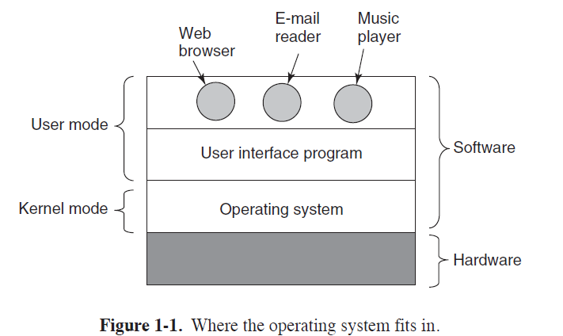
4. 操作系统属于软件，在硬件的上面。  
计算机的两种运行模式Kernel mode内核态/supervisor mode管态和User mode 用户态。  
操作系统运行在内核态kernel mode中，**在内核态中操作系统对硬件有完全访问权，为其他程序提供基础**；用户态只有一部分访问权，尤其是一些输入输出操作。

5. 用户接口程序shell和GUI是用户态软件的最低层次。
6. 操作系统和其他软件的区别：用户不能修改操作系统中的程序，它是由硬件保护的。==》**在嵌入式系统embedded systems（嵌入式系统没有内核态）和解释系统interpreted systems（比如基于Java的操作系统，它采用解释方式而非硬件方式区分组件）中，这个区别是模糊的。**
7. 有些系统中用户态中运行的某些程序也与操作系统密切相关===》边界比较模糊。
8. 操作系统的代码很多、寿命很长。
9. **如何从用户态切换到内核态？**

      (1). 系统调用Trap：用户态进程主动要求切换到内核态，如为了读取磁盘资源；

      (2). 中断Interrupt：**外围设备完成用户请求的操作之后**，会向CPU发送相应的中断信号，**CPU**就暂停执行下一条即将要执行的指令转而去**执行中断处理程序来处理这个中断信号**，如果之前执行的指令是用户态，就完成了从用户态到内核态的切换，**如硬盘的读写操作完成**，系统会切换到对应的中断处理程序；

      (3). 异常Exception：CPU在执行用户态下的程序时发生异常，就会切换到处理此异常的内核相关程序中，即从用户态切换为内核态，如缺页异常。

中断和异常都是**通过中断向量表来找到相应的处理程序**进行处理。区别在于中断是来自处理器外部，异常是处理器当前执行的指令造成的结果。

## 1.1 what is an operating system 什么是操作系统

1. 操作系统的两个独立的功能：

      （1）管理计算机的硬件资源（什么时候应该谁用，如分配磁盘空间）；

      （2）**为上层的应用程序提供资源集合的清晰抽象**，而不仅是硬件。

### 1.1.1 The Operating system as an Extended Machine 操作系统作为一个扩展机器

1. 为了不直接和硬件打交道，需要创造很多抽象概念abstractions如files，操纵系统的任务就是创建很多好的抽象，并且实现他们，然后管理创建出的这些抽象对象abstract objects。==》操作系统的主要任务是隐藏硬件，把清晰优雅的抽象呈现给应用程序==》应用程序application programs是操作系统的customer。

### 1.1.2 The Operating System as a Resource Manager 操作系统作为资源管理者

1. 实现multiplexing（sharing）resources多路复用/共享资源的两种方式：时间复用和空间复用。==》**什么时候应该谁用**、分配磁盘空间都是操作系统的任务。

## 1.2 操作系统的历史、与计算机发展历史结合（读读就行）

1. 批处理系统batch system（简单的计算机批次输入输出，高级的计算机用来集中解决计算）。
2. 第二代计算机主要用于科学与工程计算==》解方程，FORTRAN语言和汇编语言，操作系统是FORTRAN Monitor System FORTRAN监控系统.
3. 第三代 使用集成电路Integrated Circuits，ICs;通过内存分区实现multiprogramming多道程序设计。
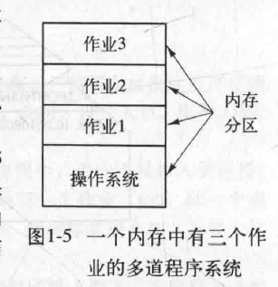  
4. 第三代实现了 兼容分时系统Compatible Time Sharing System，CTSS。==》多个用户同时登陆计算机，每个用户都有一个联机终端，Central Processing Unit，CPU可以把资源分配给需要的用户。
5. MULTICS一种公用计算服务系统，概念类似现在的云计算cloud computing。
6. IEEE提出POSIX标准，为了使编写的程序能在任何版本的UNIX上运行。
7. Linus是从UNIX派生的，是开源的。
8. 第四代：LSI，Large Scale Integration大规模集成电路的发展，开始有个人计算机/微型计算机microcomputers
9. Windows基于GUI的系统。
10. x86代表所有基于指令集体系结构家族的现代处理器（use the term x86 to refer to all modern processors based on the family of instruction-set architectures）。x86-32和x86-64指32位和64位的变种。
11. 第四代期间 网络操作系统network operating systems和分布式操作系统distributed operating systems开始增长。
12. 第五代 移动计算机/智能手机smartphone。操作系统有Blackberry OS，IOS,基于Linux的Android系统（开源）。

## 1.3 Computer hardware review 计算机硬件简介

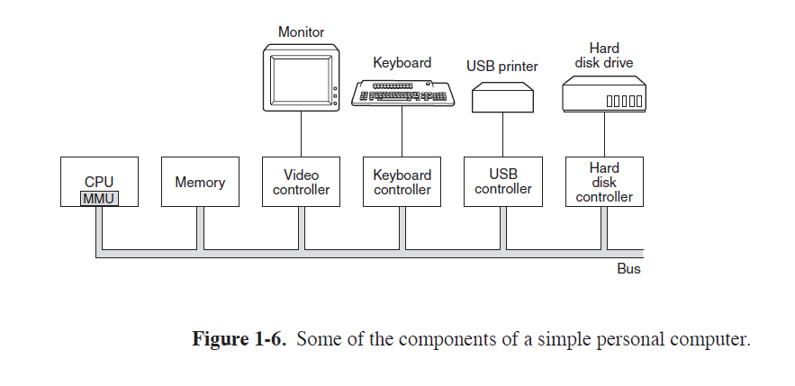
简单硬件操作系统的组成==》各个设备都由一条系统总线system bus连接起来并且通过总线与其他设备通信。

### 1.3.1 处理器 Processors

1. CPU从内存中取出指令，decode解码以确定指令的类型和操作数operands，然后执行指令。
2. CPU有自己的专门指令集用来处理对应的程序，x86处理器不能处理ARM程序。
3. **所有CPU内部都有registers寄存器用来保存关键变量和临时数据**。
4. **program counter程序计数器是对程序员可见的特殊寄存器，保存了将要取出的下一条指令的内存地址。**
5. stack pointer堆栈指针，指向内存中当前栈的顶端。
6. **Program Status Word ,PSW 程序状态字寄存器**，包含了一些control bits条件码位，如CPU优先级，**用户态还是内核态**等。
7. **操作系统必须知晓所有寄存器，方便暂停程序之后再启动的时候把寄存器重新装入。**
8. CPU可以有独立的fetch，decode和execute 单元，同时对不同的指令进行操作。下图（a）是流水线pipeline。（b）是更先进的设计：超标量CPU superscalar CPU。在superscalar CPU中多个指令被同时取出、解码然后放入保持缓冲区holding buffer中，有任一执行单元空闲就从buffer中取出指令来执行==》指令可能不按照顺序执行。
   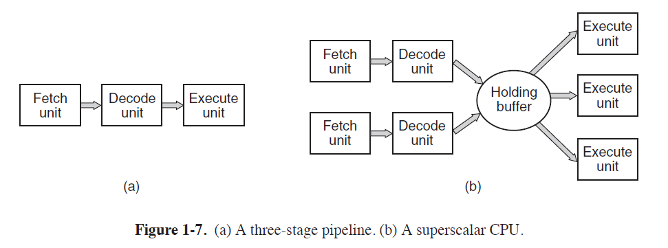
9. 可以用TRAP把用户态切换成内核态。

#### multithreading多线程和multicore chips多核芯片

1. 线程是一种轻量级的进程process
2. **多线程不是真正的parallelism并行处理，只是能在多个线程中快速切换而已**。
3. ~~ GPU Graphics Processing Unit指由成千上万个微核组成的处理器，擅长处理大量并行的简单计算，不胜任串行任务，很难编程，不适合运行操作系统。

### 1.3.2 存储器 memory

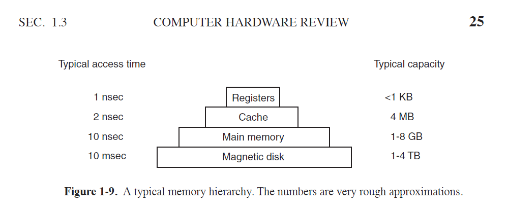

1. 上图 **越往上速度越快，成本越高**。 **registers 寄存器；cache高速缓存；main memory 主存；magnetic disk 磁盘。**
2. cache被分割成高速缓存行cache line。读取数据的时候，cache会检查所需要的cache line是否在cache中，如果在就是高速缓存命中cache hit==》就很快，不命中就必须花时间访问内存memory。
3. 操作系统在内存中保留频繁使用的文件部分==》使用缓存，性能改善，不用每次都去磁盘中取。通常通过所引用内存地址的高位来计算应该使用哪个缓存行。
4. 现代CPU中的两个缓存：（1）L1 cache缓存，在CPU中，访问不存在任何延时，用来将已解码的指令调入CPU的执行引擎。（2）L2 缓存，存频繁使用的数据字，访问延时1到两个时钟周期clock cycles。
5. **主存main memory就是RAM(Random Access Memory)随机访问存储器，是存储器系统的主力。**
6. **只读存储器Read Only Memory，ROM断电后不会丢失内容**，出厂后就不能被修改。
7. EEPROM(Electrially Erasable PROM,电可擦除可编程ROM)和闪存flash memory断电后也不丢失内容，但是可以擦除和重写。
8. CMOS存储器，易失性的，耗电很少，可以用电池单独驱动来保存时间和配置参数。

### 1.3.3 磁盘 Disks

1. 速度慢，因为**是一种机械装置**。
2. **固态硬盘solid state disk不属于磁盘。**
3. 虚拟内存机制virtual memory，通过把程序放在磁盘中，并且使用主存作为缓存cache来保存最频繁执行的程序部分。==》这种机制需要快速地映像内存地址，这种映像由CPU的Memory Management Unit, MMU存储器管理单元来完成。
4. 程序切换需要context switch 上下文切换。

### 1.3.4 I/O 设备 devices

1. **I/O设备包含两部分：设备控制器controller和设备本身。**
2. 控制器是插在电路板上的芯片=》物理控制设备。
3. **控制器为操作系统提供接口**，为了顺利提供接口控制器中经常安装小的嵌入式计算机里面有编好的程序。
4. 每类设备的控制器不同==》需要不同的软件进行控制==》这些软件就是设备驱动程序device driver。
5. 驱动程序要装入操作系统中，让他在内核运行。**大部分驱动程序都在内核态运行。**
6. 每个设备控制器都有少量用于通信的寄存器registers，所有设备寄存器的集合组成I/O port space 端口空间。
7. ~~ 启动设备实现输入输出的过程：完成后take a interrupt 发出一个中断高速CPU。

### 1.3.5 总线 Buses

1. 现在的计算机单总线不够，都是多总线的。
   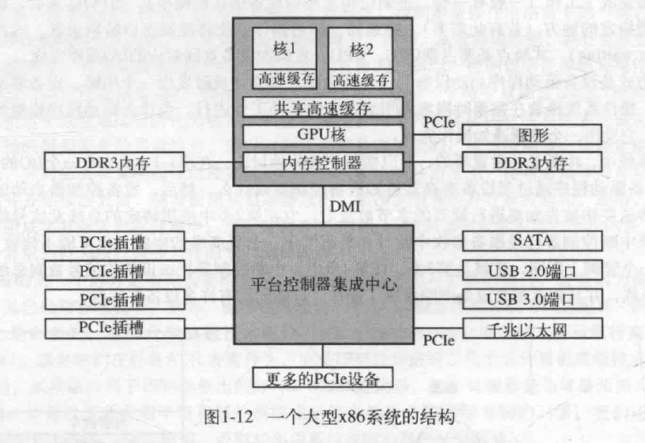  
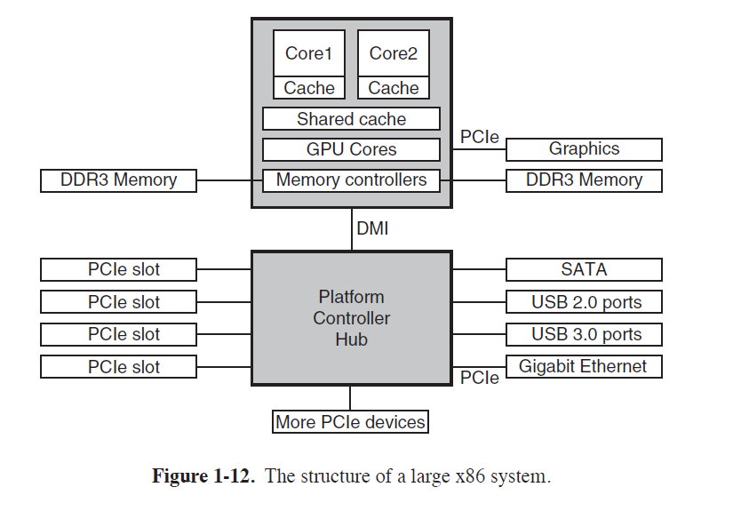  

2. 高速缓存、内存、USB、PCIe等都有总线。操作系统必须了解所有总线的配置和管理。
3. PCIe（Peripheral Component Interconnet Express）是最主要的总线，它使用串行总线架构（serial bus architecture），通过一条被称为数据通路的链路传递一条消息的所有bits，很像packet。
4. 上图的每个核不仅有独立的高速缓存，还共享一个大的高速缓存。
5. 即插即用（plug and play）的I/O系统：系统自动的收集有关I/O设备的信息，集中赋予中断级别interrupt levels和I/O addresses地址。==》此前每个I/O卡的终端级别和I/O地址是固定的，不同设备之间会冲突导致不能使用。

### 1.3.6 启动计算机 booting the computer

1. **每个计算机上都有**一个双亲板parentboard，板上有一个程序**BIOS, Basic Input Output System 基本输入输出系统**，BIOS里面有底层I/O软件。BIOS存放在闪存RAM中。
2. ** 计算机的启动过程  

   （1）**计算机启动时，BIOS开始运行**；  

   （2）**BIOS检查RAM数量**，所有设备是否正常响应，扫描PCIe总线并**找出所有设备**。  

   （3）然后**BIOS通过存储器中的设备清单决定设备的启动**。

   （4）操作系统询问BIOS可以获得设备配置信息；

   （5）**操作系统检查每种设备的驱动程序是否存在**；  

   （6）全部驱动都有了之后，**操作系统将驱动调入内核**，并初始化有关表格，创建背景进程，在每个终端上启动登录程序或者GUI。

## 1.4 ~~ the operating system zoo；各种操作系统

1. 大型机操作系统 Mainframe Operating Systems。主要面向多个作业的同时处理，需要巨大的I/O能力。
2. 服务器操作系统 Server Operating Systems， 通过网络同时为若干用户提供服务，允许用户共享硬件和软件资源。
3. 多处理器操作系统 Multiprocessor Operating Systems。多个CPU,多核==》并行计算机。
4. 个人计算机操作系统 Personal Computer Operating Systems。如Windows 98， Linux。
5. 掌上计算机操作系统 Handheld Computer Operating Systems。PDA(个人数字助理 Personal Digital Assistant)。
6. 嵌入式操作系统 Embedded Operating Systems。软件是在ROM中安装保存好的。
7. 传感器节点操作系统 Sensor-Node Operating Systems。传感器是一种内建有无线电的电池驱动的小型计算机，程序也是预先装载的。
8. 实时操作系统 Real-Time Operating Systems。特征是把时间作为关键参数。分为hard real-time system和soft real-time system。
9. 智能卡操作系统 Smart Card Operating Systems。如一种包含一块CPU芯片的银行卡。有些智能卡是面向Java的，ROM中有一个Java虚拟机（Java Virtual Machine， JVM）解释器。

## 1.5 操作系统概念 concepts

进程、地址空间、文件等

### 1.5.1 进程 Processes

1. **进程**基本上是容纳运行一个程序所需要所有信息的容器，**是一个程序的实例**。
2. 一个挂起的进程包括 进程的**地址空间address space**和对应的进程表process table项，即**PCB（Process Control Block）进程控制块**。除了该进程自身地址空间的内容外，**与某个进程相关的所有信息都存在PCB进程控制块中**。
3. 进程的地址空间是操作系统为每个进程分配的一个虚拟内存区域，它包含了进程可以访问的所有内存地址。
4. **进程创建子进程，子进程也创建子进程==》形成进程树，也被称为一个进程组**
5. 合作完成某些作业的相关进程要通信以便同步行为==》进程间通信interprocess communiaction。
6. 系统管理器授权每个进程一个给定的UID（User IDentificaion），**子进程的UID和父进程的一样**。还有GID（Group IDentification），即一个进程组的UID都一样，跟root进程相同。
7. UNIX的superUser和Windows的管理员administrator有能违背一些保护规则的特殊权利。

### 1.5.2 地址空间

1. 管理进程的地址空间。如果进程的地址空间比计算机主存还大==》使用虚拟内存，操作系统把部分地址空间装入主存，部分留在磁盘上，在需要时来回交换它们。==》把地址空间和机器的物理内存解耦。
2. 对地址空间和物理空间的管理组成操作系统功能的重要部分之一。

### 1.5.3 文件files

1. 隐藏硬件特性，为程序提供清晰的独立于设备的抽象文件模型是操作系统的主要功能之一。
2. 为了保存文件==》支持目录directory的概念。
3. 目录下可以是文件或者目录==》生成文件系统，组织成树状结构。
4. UNIX进程树一般不超过三层，且是暂时存在几分钟，且**只有父进程能控制和访问子进程**。目录树很多层、可能长时间存在。
5. 每个进程有一个工作目录working directory。
6. 打开文件需要有权限，有权限的话系统返回一个小整数==》文件描述符file descriptor，供后续操作使用。
7. UNIX中的两类特殊文件special file：  
    （1）块特殊文件block special file。指由可随机存取的块组成的设备，如磁盘等。  
    （2）字符特殊文件character special file。用于打印机等将接收/输出字符流的设备。
8. 管道pipe是一种用于连接两个进程的虚文件。让两个进程通过管道对话、传输数据，需要提前设置好管道==》对话方法：A写入数据到管道上，B读取A写在管道上的数据。

### 1.5.4 输入/输出

1. 每个操作系统都有管理其I/O设备的I/O子系统。

### 1.5.5 保护 protection

1. 系统的安全性完全依靠操作系统管理。
2. UNIX给每个文件一个9位的二进制保护代码，三个一组依次是所有者、与所有者同组的成员、其他人。RWX位（读访问、写访问、执行访问）。 rwxr-x--x的意思是所有者rwx，同组r和x，其他人x。

### 1.5.6 shell

1. shell是UNIX的命令解释器，shell和GUI都不是操作系统的一部分。是终端用户与操作系统之间的接口。==》可以体现操作系统的特性。

## 1.6 系统调用 system calls

1. 操作系统是进行系统调用的代码。
2. 操作系统的两个功能：为用户程序提供抽象（如文件）、管理计算机资源。
3. 任何单CPU计算机一次只能执行一条指令。
4. 只有系统调用可以进入内核，过程调用不能。
5. POSIX系统调用指令
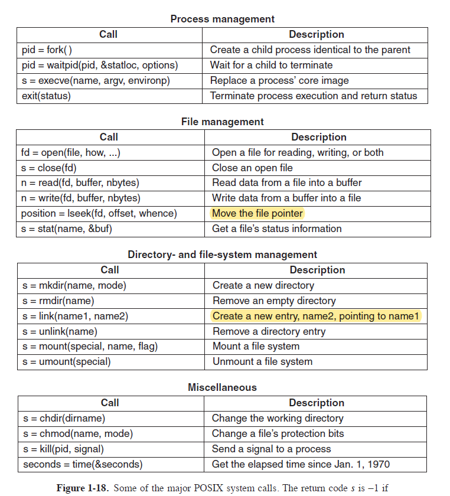

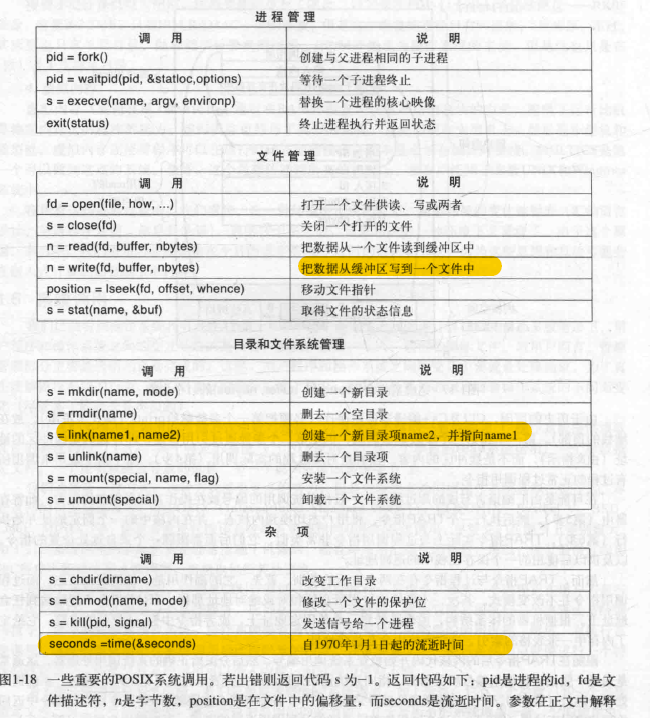

### 1.6.1 用于进程管理的系统调用

1. UNIX中，fork是唯一可以在POSIX中创建进程的途径，**创建**一个**原有进程**的精确**副本**。原有的是父进程，副本是子进程。
2. fork调用返回一个值，在子进程中是0，在父进程中是子进程的进程标识符 PID，Process IDentifier。
3. execve系统调用命令，替换一个进程的核心映像。waitpid调用：等待一个子进程终止。exit调用：终止进程执行并返回状态。
4. UNIX总的进程将他的存储空间划分为三段segments：text segment 正文段（如program code），data segment 数据段（如变量），stack segment 堆栈段。data segment向上增长，stack向下增长，中间gap是未使用的地址空间。
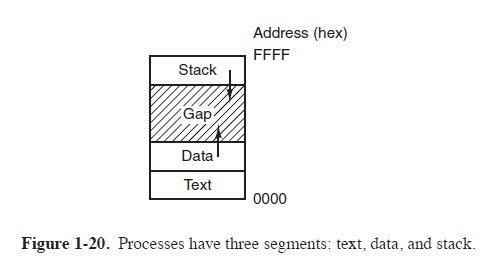

### 1.6.2 文件管理的系统调用

1. Iseek调用改变读取文件的指针在文件的哪个位置==》从哪里开始读取。

### 1.6.2 用于目录管理的系统调用

1. link调用，允许同一个文件以两个或多个名称出现。UNIX中，每个文件都有唯一的编号， i-编号。目录就是一个包含了（i-编号，ASCII文件名称）对的集合文件。下午70是这个文件的编号，说明在两个用户的目录下都能访问这个文件，两个都是私有副本不相互映像，两个副本都被删除，该文件才会从磁盘中被删除。
2. mount安装一个文件系统，就是把一个文件树移动到任意文件树节点下面。
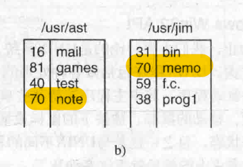

### 1.6.4

1. kill调用是让用户给进程发送信号。如果进程没准备好捕捉信号、运行一个信号处理程序，就是杀死该进程。

### 1.6.5 Windows Win32API

1. windows和UNNIX编程方式的不同：  
（1）. win程序通常是事件驱动程序event driven，主程序等待某些事件发生，然后调用一个过程处理该事件，如移动鼠标。  
（2）. UNXI程序是由通过系统调用来完成特定任务的代码组成的。

2. Win32 Application Program Interface, API 里面系统调用和用户空间的库调用都有。
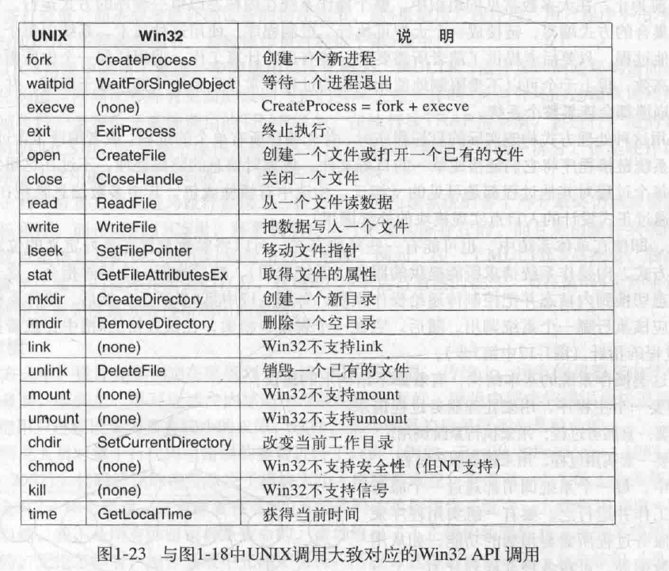

## 1.7 操作系统结构 structure

不同的操作系统设计：单体系统、层次式系统、微内核系统、客户端-服务器系统、虚拟机系统、外核系统。  

1. 单体系统 Monolithic Systems：整个操作系统在内核态以单一程序的方式运行。
 主程序 Main procedure 用来处理服务过程请求；一套服务过程service procedures，用来执行系统调用；一套实用过程Utility peocedures，用来辅助服务过程。
2. 很多操作系统支持可装载的扩展，可以按需载入，UNIX中的是共享库shared library，Windows中是动态链接库Dynamic Link Library, DLL,文件类型.dll
3. 层次式系统 Layered Systems。最下层CPU-》内存-》通信进程-》I/O-》用户程序-》操作员。上层软件实在下层软件的基础上构建的。一种设计思维，最终还是形成单一的程序。
4. 微内核 Microkernels：内核中的错误会快速拖累系统==》把操作系统划分成小的、良好定义的模块，只有一个模块放在内核态中，其他功能模块放在用户态。
5. 与微内核相关的思想：在内核态中放如何完成功能的机制mechanism，把policy策略如哪个进程更优先放在用户态。
6. 客户端-服务器模式 Client-Server Model。把进程分为客户端进程（使用服务的进程）和服务器进程（提供服务的进程）。两者通过message passing 通信。这种抽象可以用在单机或网络机器上。
7. 虚拟机 virtual Machines。可以在一台机器上运行多个系统。
todo: 见截图
第一类虚拟机管理程序（type 1 hypervisor），核心是虚拟机监控程序virtual machine monitor，该系统向上层提供了若干台虚拟机，这些虚拟机是裸机硬件的精确复制品。  
第二类虚拟机管理程序不仿真硬件，可以利用宿主操作系统（host operating system）的文件系统创建进程、存储文件等，第一类不行，没有底层支持，只能自行实现所有功能。  
第二类就是可以从CD里安装客户操作系统guest operating system。  
Java虚拟机：JVM。Java编译器生成代码，JVM解释器执行。

### 1.7.6 外核 exokernel

1. 外核是一种程序，在内核态运行，为多个虚拟机分配资源==》对机器进行分区，划分好每个虚拟机使用磁盘的哪一部分，就不需要虚拟机模拟硬件了==》减少了虚拟机模拟硬件的映像层。
2. 相当于 外核用于计算机的硬件资源管理，让多程序多线程multiprogramming不相互冲突。==》实现把multiprogramming和用户空间的用户操作系统代码分离。

## 1.8 C语言==》编写操作系统的环境

1. C语言有显示指针explicit pointer，java没有。**指针是一种用来保存其他变量的内存地址的变量。**
2. C语言中没有类型安全、垃圾回收garbage collection等，所以由于程序员控制所有内存==》适合编写操作系统。
3. C语言中的宏macros是一种预处理指令，就是在编译之前展开的代码。

TODO： 关于操作系统的中断机制 interrupt
