# 第三章 内存管理 memory management

1. Main memory，RAM，主存、内存。
2. 人们希望内存又便宜又量大速度又快==》难搞==》提出 分层存储系体系 memory hierarchy。就是一点很贵很快的，中间性能的适中，大量便宜的。
3. 操作系统中负责管理分层存储器体系的部分是 存储管理器memory manager, 要把他们抽象成一个模型来管理。
4. 磁盘disk，是永久性存储器permanetn storage。

## 3.1 无存储器抽象 no memory abstraction

1. 没有抽象就是 **每个程序都直接访问绝对物理内存地址**。
2. 缺点==》操作系统容易被破坏；想并发运行多个程序会出现以下问题：  
程序编写的时候程序b的JMP 28是让跳转到自己的28位置执行CMP命令。但是并发运行这两个程序时，程序被连续的装在到内存中，程序b的CMP命令所在的内存地址已经变了，此时JMP28会跳到程序a中执行ADD命令，发生错误。==》 总结就是 **程序在编写时写的是内存的绝对地址，但是多程序装在在内存中时，程序所在的内存地址变化了，应该用相对地址**==》即 IBM 360公司的**静态重定位技术static relocation**修复（就是程序被装载到地址N的时候，把N加到每个程序命令出现的地址上==》相对地址重定位）。
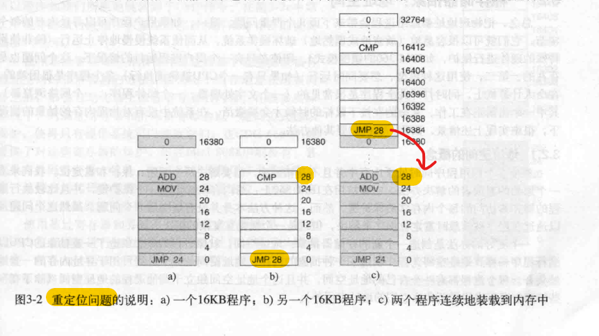
3. 两个缺点对应的需要对内存的**保护**（控制程序访问内存的权限，IBM办法：给内存块标记 保护键，和程序拥有的保护键的值对上才让访问该内存块）和**重定位**。
4. 很多嵌入式系统还是没有寄存器抽象的，只不过微波炉这种程序都是写好的不会变动，测好了就行。

## 3.2 一种寄存器抽象：地址空间 address spaces

### 3.2.1 地址空间的概念

1. **地址空间是**一个寄存器的抽象：**是一个进程可用于寻址内存的一套地址集合**。每个进程都有一个自己的地址空间，并且独立于其他进程的地址空间（物理地址不同）。

#### 使用 基址寄存器和界限寄存器 Base and Limit Registers 实现 动态重定位 dynamic relocation

1. 给该每个CPU配置一个基址寄存器和一个界限寄存器。**基址寄存器**用于保存**程序在物理内存地址中的起始位置**，**界限寄存器**用来保存**程序的长度**。
2. 每次访问内存的时候根据两个寄存器中的值计算出程序真正要访问的物理内存地址。3. 缺点：每次访问都要算，比较慢。
4. 老技术，不用了

### 3.2.2 交换技术 Swapping

1. 事实上是 通常不能把计算机的所有程序都保存在内存中，现代计算机会启动几十个进程，内存存不下所有进程。
2. **应对内存超载memory overload的两种方法：swaping交换技术 和 virtual memory虚拟内存**。

3. 交换策略就是把空闲的进程存到磁盘上，不占用内存，进程被重新调入内存的时候需要对地址进行重定位。
4. 堆heap和栈stack的区别：<https://blog.csdn.net/K346K346/article/details/80849966> ：
 heap是二叉树，堆用于动态内存分配，如通过new等函数动态创建的对象或者数组，堆内存的大小在程序运行时会动态变化，由程序员管理；
 stack是后进先出的队列，用于存储函数调用时的上下文，如局部变量、函数参数、返回地址等，由操作系统管理。
5. 因为堆栈的存在，进程的数据段会增长==》每个进程占用的内存长度可能会随时间变化。==》再分配的时候要为增长预留空间。
6. 图(b)上的”Data“是作为堆heap使用的data segment数据段,stack是栈。stack向下增长，Data向上增长，用完之后只能把进程移动到有足够大空闲区的内存上或者关闭进程。
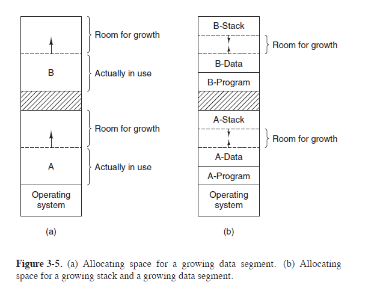

### 3.2.3 空闲内存管理

1. 要知道内存的使用情况==》跟踪内存的两种方法: 位图bitmaps 和 空闲区链表free lists。

#### Memory Management with Bitmaps 使用位图的存储管理

1. 把内存划分成固定大小的分配单元，如4个字节（一个字节8位）作为一个单元，每个分配空间对应位图中的一位，0表示空闲，1表示占用。
2. 如果决定把K大小的进程调入内存，存储管理器memory management必须在位图中搜索出K个连续的0==>缺点：耗时。

#### Memory Management with Linked Lists 使用链表的存储管理

1. 链表是按照地址顺序排列的。链表中的每个节点表示一个进程process 或者两个进程中间的一块空闲区hole，并且指针指向下一个节点。
2. 下图中a是内存，阴影是空闲hole，图b是位图bitmaps，图c是链表。
3. 链表的每个节点组成：P或者H，表示process或者hole + 内存开始位置 + 长度 + 指向下一节点。
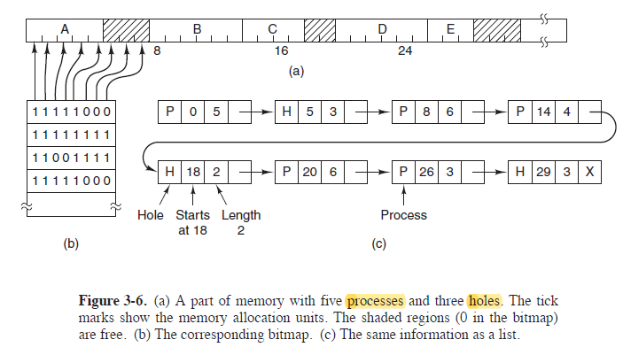

#### ~~给进程分配内存的算法

1. 首次适配算法first fit：每次都从头开始查找，查找到的第一个大小合适的。
2. 下次适配算法next fit：每次不是从头开始查，是从上次查找到结果的位置开始找。
3. 最佳适配算法best fit：每次都搜索整个链表，找到能容纳进程的最小hole==》慢，而且比first和next浪费更多内存==》因为会产生很小的空闲区，这些空闲区太小了也没办法给别人用。
4. 最差适配算法worst fit:分配最大的hole，让剩下的空间尽量大能被再利用==》也不好。
5. 可以不像上图b中那样，可以把进程表和空闲表分两张表维护，而且还可以排序。

## 3.3 程序大于内存 ==》 虚拟内存 virtual memory

1. 虚拟内存的基本思想：**每个程序有自己的地址空间，即虚拟地址virtual address**，这个空间被分成很多**页page**，每个页有连续的地址范围，并被映射到物理内存中。**不用全部同时在内存中**，一部分地址空间在物理内存中，一部分不在，**在内存中的那部分虚拟地址和物理地址才有映射关系**，不在的没有，**当程序引用到不在物理空间的地址空间时，操作系统要把他们（以页面为单元进行交换）装入物理内存并重新执行失败的指令**。
2. 从1.中可得**每个进程都有属于自己的页表PageTable**.
3. 所以才会有进程和线程中==》在程序等待他的部分page被读入内存的时候，或者其他I/O操作时，可以把CPU交给其他进程使用。
4. 程序要在磁盘上有完整副本，才能在需要的时候调入物理内存。
5. 虚拟地址由两部分组成：页号page number(虚拟地址在第几个页面) + 页内偏移offset(虚拟地址在页面的具体哪个位置)。

### 3.3.1 分页Paging

1. 没有虚拟内存的计算机，系统直接把程序需要的地址送到内存总线上。
2. **使用虚拟内存后，CPU把虚拟地址发送给内存管理单元Memory Management Unit，MMU，MMU负责把虚拟地址映射成物理内存地址，然后发送物理地址给内存总线**。
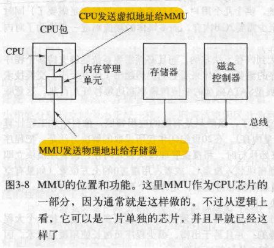
3. 映射相关：

    （1）虚拟地址被分成若干页面page，物理内存中对应的单元是页框page frame，页面和页框通常一样大。

    （2）在实际硬件中，用 Present/absent bit 位来记录页面是否在内存中。

    （3）**如果MMU查到当前虚拟地址不在物理空间上，即映射不存在，就让CPU陷入到操作系统（这个TRAP就是 缺页中断/缺页错误 page fault，MMU发送中断信号给CPU）**。操作系统负责找一个页框，**把页框中原本的内容写入磁盘**，原本映射的虚拟地址标记为未映射，然后把需要的页面从磁盘读入页框中，并标记为映射。

### 3.3.2 页表 page table

1. 页表是用来把虚拟页面映射为页框的，**MMU通过页表来查询虚拟地址是否在物理空间上**，在的话查到对应的页框号。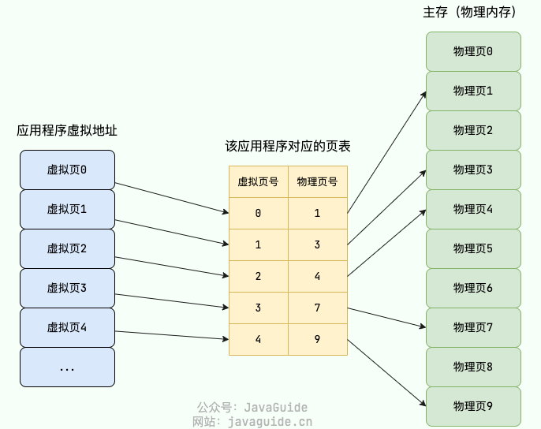
2. 把页表看作函数，参数是虚拟页号，内部查找到页表项Page Table Entry，返回值页表项上的页框号。
3. **有几个虚拟地址就有几个页表项**，页表项的结构（~~了解）：

    （1）page frame 页框号；

    （2）在/不在， 虚拟地址在内存上有没有映射；

    （3）Protection保护位，该页允许什么类型的访问，读、写、执行？

    （4）Modified修改位，true的话，换页框映射内容的时候要把原内容保存进磁盘；

    （5）Referenced访问位，如果该虚拟内存正在被引用的话，发生缺页中断时不能选择该页面进行替换；

    （6）Disable Caching缓存禁用：某些情况下操作系统需要确保数据是最新的，不能从缓存中取。

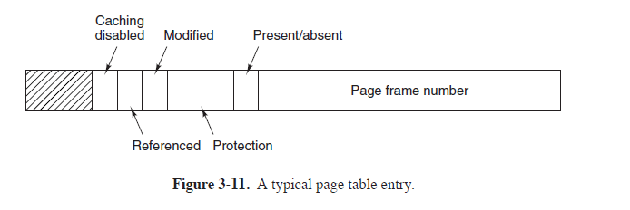

1. 物理地址 = 页框号 + 页内偏移量（和对应的虚拟地址的页内偏移量值一样）。
2. 页表项的结构和硬件有关。
3. 在页表结构中查找相应的映射mapping被称为页表遍历page table walk。

### 3.3.3 加速分页过程 speeding up paging

地址空间很大，会有很多很多分页，要**加速**这个过程。没有分页机制的时候直接访问内存一次取数，有了分页机制之后，会因为要访问页表而引起更多次的内存访问，效率降低==》要加速访问页表的过程。

#### Translation Lookaside Buffers 转换检测缓冲区/快表==》加快虚拟地址到物理地址的转换

1. 在MMU中加设一种**硬件设备**（现在有虚拟内存的机器都会看设置），即 转换检测缓冲区Translation Lookaside Buffer，**TLB**， 又称 相联存储器associate memory 或**快表，可以将其简单看成是存储着键（虚拟页号）值（物理页号）对的哈希表**。
2. **TLB的表项很少，只存储最常用的表项**，而且查询的时候 虚拟页号是同时跟所有表项匹配（并行查询），所以很快。
3. **工作过程：MMU需要转换虚拟地址时，先去TLB中查询，没有的话（TLB失效）再去页表中查询，查到之后从TLB淘汰一个表项把查到的结果存进去。**

#### software TLB management 软件TLB管理

1. 以前TLB可能由硬件直接管理，**现代机器TLB工作的过程都是操作系统负责管理**，TLB表项被操作系统显式的装载，发生TLB失效时会生成一个TLB失效问题交给操作系统解决，操作系统去找到页面表项而不是由MMU查找页表。
2. TLB足够大（如64个表项）的时候，失效会减少。
3. TLB失效分为几种：软失效soft miss，指页面不在TLB中但是在内存中；硬失效hard miss，页面不在TLB中也不在内存中，要去磁盘中取==》严重缺页错误major page fault。硬失效处理时间往往是软失效的百万倍。
4. 次要缺页错误minor page fault是 软失效的一种，指页面已经被其他进程装载进内存中了，但是当前进程的页表中没有，把页面正确映射到当前进程的页表中即可。

### 3.3.4 针对大内存的页表 Page tables for large memories==》如何处理巨大的虚拟地址空间

#### 多级页表 Multilevel Page Tables

1. 避免把全部页表一直保存在内存中。==》一个进程的内存包含 程序正文段、数据段、堆栈段、中间还有预留空白段，会有很多很多页表。
2. 分级页表中，虚拟地址由下图a中的不同级别页表的索引 + offset偏移量组成。PT1用于查找顶级页表找到是哪个二级页表，PT2用于查找二级页表中具体哪个页框，依次类推多于二级的页表。
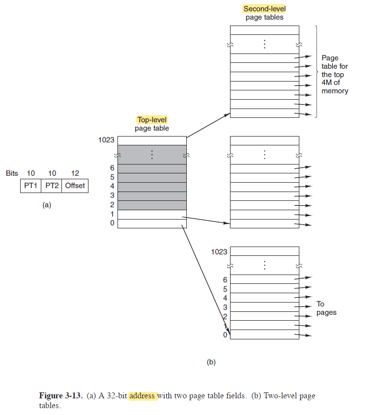
3. 4级页表可寻址空间有2^48字节,共256TB很大了。

#### 倒排页表 inverted page tables

1. 这种页表中的每一个表项对应一个页框，而不是对应一个虚拟页面==》倒排页表的表项数量就变小了，但是进程通过虚拟地址访问物理内存的过程变难了==》需要搜索整个倒排页表来找到虚拟页面所在的表项==》需要配合TLB会更快。
2. 如果TLB失效，仍然需要搜索整个倒排页表，所以 建立散列表（hash table），hash table中虚拟地址和物理内存key value对应，查找更快。
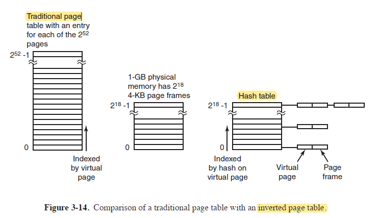

### 3.3.3 和3.3.4一个是解决加速访问分页的过程，一个解决页表表项数量过多的问题

## 3.4 页面置换算法 page replacement algorithms

1. 发生缺页中断时，操作系统要在内存中选择一个页面将其换出内存来空出空间。
2. 要换出的页面如果被修改过，就要把内容存回磁盘再修改映射，如果没被修改过就直接覆盖，修改映射关系。
3. 选择的被换出的页面如果是频繁使用的页面，那么很快可能被再次存进内存==》不必要的开销。

### 3.4.1 最优页面置换算法 the optimal page replacement algorithm

1. 假设可以知道每个page在自己被首次访问之前需要执行的指令数量，如从当前到访问abc三个页面依次需要执行10、100、1000条指令，当然是**选择c页面最晚会被用到的页面去置换**。==》但是**该算法不可能实现**==》因为不能预见会执行什么指令。
2. 后续介绍的是实际能使用的算法。

### 3.4.2 最近未使用页面置换算法 the not recently used page replacement algorithm，NRU

1. 当启动一个进程时，它的所有页面的两个位R只读位/M修改位都被操作系统设置成0，R位被定期地（如在每次时钟中断时）清零==》当发生缺页中断的时候，就**可以知道在最近一个时钟滴答中页面被访问和修改的状态**。
2. 分为4类 ：
  Class 0 未被引用且未被修改（Not Referenced, Not Modified）；
  Class 1 未被引用但被修改（Not Referenced, Modified）；
  Class 2 被引用且未被修改（Referenced, Not Modified）；
  Class 3 被引用且被修改（Referenced, Modified）.
3. NRU算法从数字小的类开始，随机选一个页面淘汰。==》选择一个没被访问的已修改页面Class1比被频繁引用的Class2好。

### 3.4.3 先进先出页面置换法 The first-in，first-out（FIFO）page replacement algorithm

1. 页面链表，新调入的页面放在表尾，最早进入的在表头。发生缺页中断时淘汰表头的页面，把新页面加入表尾。

### 3.4.4 第二次机会页面置换算法 The Second-Chance Page Replacement Algorithm

1. 在FIFO的基础上，如果最老的页面R位是0就淘汰，如果是1就清零放在表头。===》寻找最近的时钟间隔内没被访问过的页面。

### 3.4.5 时钟页面置换算法 the clock page replacement algorithm

1. 类似于第二次机会页面置换算法，但是是类似钟面的环形链表，表针始终指向最老的页面。
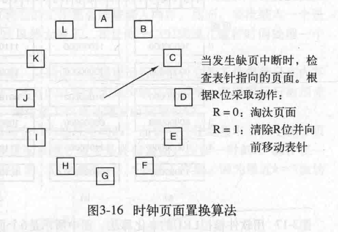

### 3.4.6 最近最少使用页面置换算法 The least recently used(LRU) page replacement algorithm

1. 类似最优算法的思想==》应该替换最晚被使用的页面==》之前一段时间没被使用的页面接下来大概率也不会被使用==》淘汰未使用时间最长的页面==》优秀但是很难实现。

### 3.4.8 the working set page replacement algorithm 工作集页面置换算法

1. 单纯的分页系统里，进程刚启动时内存中没有页面，一条条按照需要被调入==》请求调页demand paging。
2. 大部分进程是**局部性访问locality of reference**的，运行的任何阶段都不会访问全部页面，只访问较少的一部分。==》当前正在使用的页面的集合是它的**工作集working set**。
3. 工作集的正式定义：工作集是最近K次内存访问所使用过的页面的集合。 基于时间：在过去t秒（t秒这个时间被称为工作集窗口）实际运行时间中它所访问过的页面的集合。
4. ~~ 如果每执行几条指令程序就发生一次缺页中断，就称程序发生了颠簸thrashing。
5. 预先调页prepaging就是在进程运行前预先装入其工作集页面。==》减少缺页中断。
6. **发生缺页中断时，淘汰一个不在工作集中的页面**。
7. 页面的生存时间，指页面从上次被访问的时间距离当前时间过了多久。如果R位是1，更新上次使用时间为当前时刻，R位重置为0；R位是0，且如果生存时间大于工作集窗口时间t，表示上次被访问的时刻在当前工作集之前，页面可以被淘汰；R位是0，如果生存时间小于工作集窗口时间t，表明上次被访问的时刻在当前工作集之内。如果所有页面都在工作集内，就淘汰生存时间最长的==》上一次访问页面距离现在最久的。
8. 上面7这种方法需要扫面整个页表才能确定被淘汰的页面。

3.4.9 工作集时钟页面置换算法 the WSClock page replacement algorithm

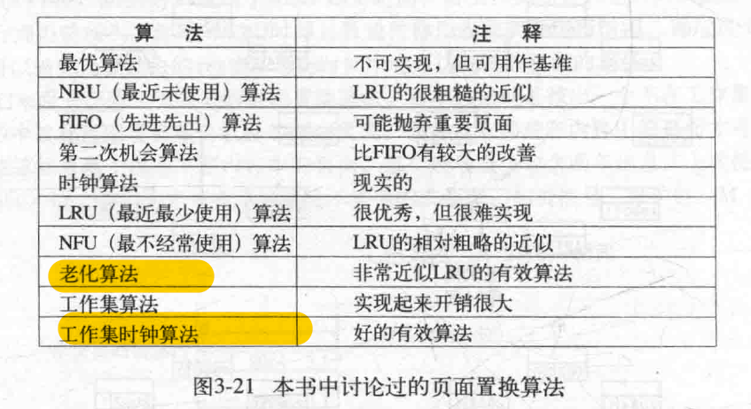
老化算法和工作集时钟算法是最好的

## 3.5 分页系统中的设计问题 design issues for paging sysytems

### 3.5.1 局部分配策略与全局分配策略 local versus global allocation policies ==》怎样在互相竞争的可运行进程之间分配内存

1. 局部页面置换算法：页面置换算法只考虑分配给当前进程的页面==》每个进程的页框数是固定的。
2. 全局页面置换算法：某个进程需要置换页面时，在可运行的所有进程的页面之间考虑==》导致每个进程的页面数是随时间变化的，因为本来a进程8个页框下一时刻可能分了一个给b进程用，a进程只剩下7个了。
3. 全局算法通常比局部好，但是全局算法应该给每个进程分配多少页框呢？几种方法：

    （1）等额分配，不合理进程大小不一样；

    （2）按照进程大小的比例分类，大的页框数量多；

    （3）规定进程的最小页框数==》即使进程很小，也要保证基本运行。

1. 而且3中全局算法分配页框的结果在进程运行时是动态更新的==》管理内存动态分配的一种犯法PFF，page fault frequency缺页中断率算法（不是用于选择哪个页面置换，用于分配页框数），能指出可是增加/减少给进程的页框。
2. 很多页面置换算法如LRU的缺页中断率会随着页框数量的增加而降低。下图达到B线以下的进程可能会剥夺它的页框分给别人，因为够用了。
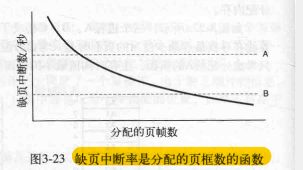
1. 某些页面算法只对局部策略有意义，如工作集相关的算法，因为工作集这个概念就是属于某个进程的，要配合进程上下文应用。

### 3.5.2 负载控制 load control

1. 所有进程的工作集加起来超出了内存容量，就可能会发生颠簸==》暂时从内存中去掉一些进程，把他们交换到磁盘。具体交换出哪个要考虑进程的大小、分页率、CPU密集型还是I/O密集型及其他特性。

### 3.5.3 页面大小 page size多大最有最节约内存

1. 页面大小是操作系统可以选择的一个参数。
2. 平均每个进程的最后一个页面有一半是空的，形成**内部碎片internal fragmentation**==》页面太大浪费的越多。
3. 页面越小需要的数量越多，整个页表就越大。存在以下问题：

    （1）**内存与磁盘之间的传输**一般是一次一页，**CPU切换进程式也要把新进程的页表装入硬件寄存器**，传输小页面和大页面需要的时间差不多==》页面越小数量越多，费时越久；

    （2）页面小则需要使用更多的TLB表项，TLB表项很少很稀缺；

    （3）页表太大存储页表本身也要空间。

1. 最优页面大小的公式 P是页面大小，单位字节；s是进程大小，单位字节；e是页表项大小单位字节，开销= （s/p）*e + p/2。
s/p是页面数量，乘以每个页表项大小等于储存一个进程所有的页表所需要的大小，开销最小时的P如下：

### 3.5.4 分离的指令空间和数据空间 separate instruction and data spaces

1. 早期计算机地址空间太小了不够用，分两个地址空间，I空间存指令（程序正文），D空间存数据，相互独立有自己的页表。==》尽管现代处理器不再将指令和数据缓存空间分开，但L1缓存（是计算机处理器（CPU）中的一种高速缓存）仍然是CPU性能的关键因素之一。

### 3.5.5 共享页面 shared pages

1. 多个不同的用户同时运行同一个程序。==》共享页面效率更高，不然内存中会有一个页面的多个副本。
2. 分离I空间和D空间的情况下，通常是共享I空间，D空间各自不同。
3. 不分离I空间和D空间，进程也可以共享页面但是比较复杂。==》UNIX中共享数据，fork系统调用之后父进程和子进程要共享程序文本和数据
4. 某个进程结束的时候，需要知道他的页面是否被其他进程共享==》否了释放了之后其他进程会缺页中断。==》需要专门的数据结构记录共享页面。
5. 共享数据涉及读和写操作，都是只读好说，写操作是**写时复制copy on write**（触发只读保护，引发操作系统陷阱，先生成副本再在自己的专有副本上写）。

### 3.5.6 共享库 shared libraries

1. 很多进程会使用到同样的大型库，可以使用 **共享库shared libraries** 技术。**Windows中的共享库被称作DLL或动态链接库Dynamic Link Libraries。**
2. 链接一个程序的过程：任何在目标文件中被调用了但是没被定义的函数，都被称作**未定义外部函数undefined externals**。链接器linker在库中寻找这些未定义外部函数，找到之后在可执行二进制文件中加载存根历程（stub routine），用来引用共享库里的外部函数（这个过程就是they are included in the executable binary）。全部链接完成之后，一个可执行而二进制文件被写进磁盘（里面引用了所有需要的函数，不需要的不会加载）。
3. 共享库跟程序一起被装载（根据需要以页面为单位装载），或者在他内部的函数第一次被调用的时候装载==》如果其他程序已经装载了这个共享库，就不需要再次装载了。
4. 共享库的优点：

    （1）可执行文件更小，因为静态的直接复制代码，动态链接的存根历程很小；

    （2）库函数更新之后不需要重新编译调用了这个函数的进程==》引用函数的代码又没有变，仍然会找到更新后的函数。
  
1. **共享库不能通过动态重定位（relocation on the fly）使用绝对地址**，因为共享库在物理内存中只有一份，但是不同进程会在不同位置使用他们，进程a在36K的位置引用，进程b在12K的位置引用，某跳转指令跳转16，a需要36K+16，b需要12K+16，不同的绝对地址，代码只有一份，满足不了。===》解决办法：**共享库代码中不能有使用绝对地址的指令，只能使用相对地址**，告诉程序是往前/后跳几步。
2. 只使用相对地址（relative offsets）的代码被称作**位置无关代码positon-independent code**。

### 3.5.7 内存映射文件 mapped files

1. 内存映射文件允许程序将文件内容直接映射到其虚拟地址空间中，使文件操作像访问内存一样简单。==》对比传统的磁盘文件I/O操作，共享内存不需要调用read()和write()函数。
2. 共享内存按需加载页面，不需要的不加载。进程退出或者显示地解除文件映射时，所有被改动的页面会被写回到磁盘文件中。
3. 多个进程映射了同一文件时，进程之间可以通过共享内存来通信==》一个进程完成了写操作之后，其他进程读的时候会看到。==》**给进程之间提供了一个高带宽通道**，共享内存的常被用作此处。传统的磁盘文件I/O，进程之间通信需要管道、消息队列等机制。
4. 共享库是内存映射文件memory-mapped file的一个特例。

### 3.5.8 清除策略 cleaning policy

1. 很多分页系统有一个 分页守护进程paging daemon的后台进程，定期被唤醒检查内存状态==》空闲页框过少，就通过页面置换算法选择页面换出内存，有修改的话就写回磁盘==》不用在空闲页框被分配的时候才急着写回磁盘了。

### 3.5.9 虚拟内存接口 virtual memory interface

1. **虚拟内存接口就是让程序员可以对内存的映射进行控制**。==》可以让程序员**实现指定的共享内存**：让进程a把一篇内存区域的名称通知给进程b，进程b就把这片内存区域映射到自己的虚拟地址空间中。
2. 让进程能控制自己的页面映射，这种页面共享**能实现高性能的消息传递系统**：不用发送消息数据了，在进程之间传递消息内容开销很大，发送消息的进程编辑好消息之后不发送，取消自己跟消息内容的映射，让接收消息的进程跟消息内容创建映射，开销很小。
3. 分布式共享内存distributed shared memory，DSM，允许网络上的多个进程共享一个页面集合。让进程以为他们共享一个连续的内存空间地址，实际上这些内存分布在不同机器上：当网络中的某台机器上的进程访问没有的页面时发生**缺页中断**==》缺页中断处理程序定位所需的页面正在被哪台机器映射，**发送页面请求**到这台机器上==》远程机器响应请求，**取消映射**，**通过网络传输页面给本地机器**==》本地机器接收后创建映射。
4. 上面为什么要让远程机器取消映射==》为了保持数据的一致性，减少潜在冲突。

## 3.6 有关实现的问题implementation issues

### 3.6.1 操作系统中与分页相关的工作 operating system involvement with paging

1. 操作系统要在下面四个时段做分页相关的工作：

    （1）进程创建时:创建页表，对程序本地、数据、页表进行初始化；在磁盘交换区中分配空间，以便进程换出时磁盘上有空间；把有关页表和磁盘交换区的信息存储在进程表中；

    （2）进程执行时：为新进程重置MMU，刷新TLB；

    （3）缺页中断时：操作系统必须通过硬件寄存器确定是哪个虚拟内存造成的缺页中断，完成置换页面过程之后要回退程序计数器，来重新执行造成缺页中断的指令；

    （4）进程终止时：没有别的进程使用页表时，操作系统要释放进程的页表、页面和页面在硬盘上占用的空间。

### 3.6.3 指令备份instruction backup

1. 发生缺页中断，置换完页面之后，需要重启引起陷阱的指令==》怎么确定到底是哪个指令导致的缺页中断，并且要重启指令==》在CPU中使用一个隐藏的内部寄存器，在每条指令执行之前，把程序计数器的内容复制到该寄存器，可能有第二个寄存器来指示其他寄存器被自增/自减的信息（某些指令具有副作用，例如自动递增（autoincrement）或自动递减（autodecrement）寄存器的值。）。

### 3.6.4 锁定内存中的页面 Locking Pages in Memory==》pinning pages

1. 进程在等待I/O操作完成时会被挂起，I/O操作在进行时就是对内存中对应的I/O缓冲区进行读写操作。此时因为进程被挂起了其他进程可以运行，如果其他进程采用全局算法置换页面时选到了I/O缓冲区的页面，会造成数据的破坏==》要在内存中**pinning钉住页面**，不能让它被选中置换走。

### 3.6.5 后备存储backing store==》磁盘管理相关的问题

1. 在磁盘上设置特殊的**交换分区**用于分配页面空间。
2. 传统的文件系统中，磁盘被以块block/chunks为基本单位划分，访问某个文件的具体位置时需要知道它的文件偏移量file offset，然后操作系统把文件偏移量转换成块地址==》转换过程有一定开销。
3. 交换分区跟常规文件系统不同，操作系统可以直接使用block address块地址访问数据，没有上述转换开销。
4. 交换分区作为list of free chunks空闲块组成的列表来管理。
5. **静态交换区分页**就是进程启动时把交换区全部初始化，有多大的虚拟地址空间就初始化多大的交换区，然后按照需要更新。**动态备份页面**就是有页面被置换出来的时候再分配交换区。
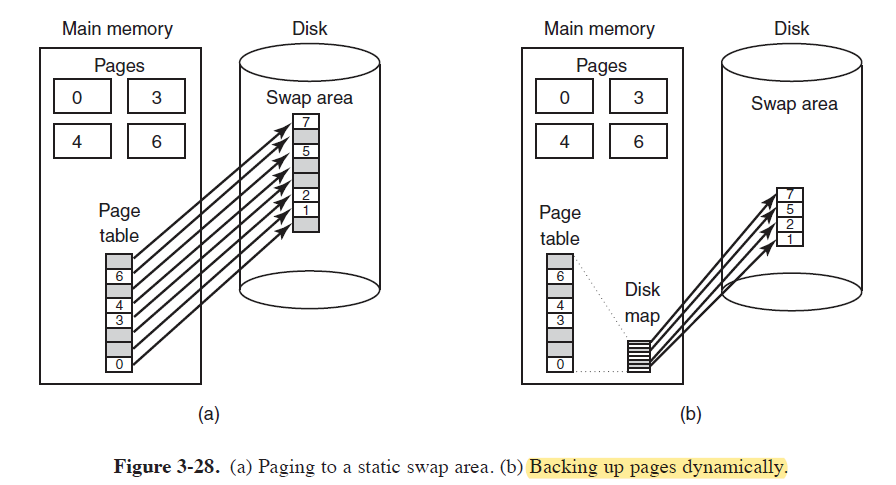
6. 没有固定的交换分区使用时，使用常规文件系统中创建一个大文件，预先分配给他足够的空间用作交换区，（windows使用该方法，文件是pagefile.sys），下面是该方法的优化：
  （1）程序正文是只读的，内存紧张时可以从内存中丢弃程序正文，需要时再从原始的可执行文件中读取（共享库采用本方法）==》相当于磁盘中的可执行文件本身充作只存储程序正文的交换区。

### 3.6.6 策略和机制的分离 separation of policy and mechanism==》任何控制系统中降低系统复杂度的重要方法

1. 在存储管理中也可以使用策略和机制分离，把大部分内存管理进程放在用户级空间运行。
2. 存储管理系统的三个部分：MMU handler；在内核中的缺页中断处理程序fault handler；在用户空间运行的外部页面调度程序external page。
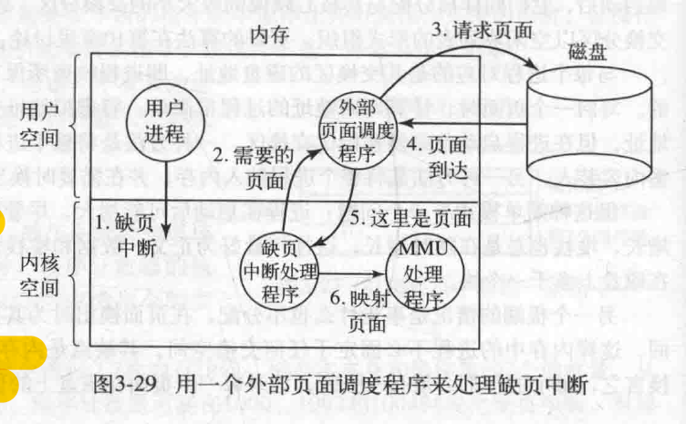
3. 缺页中断处理程序包含大多数分页机制，外部页面调度程序决定主要的策略（涉及磁盘空间分配、页面置换等），之前讲的页面置换都是操作系统来决定，这里放在用户空间就是策略和机制分离的体现。
3. 发生缺页中断后，缺页中断处理程序找到对应的虚拟页面，发送消息告诉外部页面调度程序，外部页面调度程序从磁盘中读取页面并高速缺页中断处理程序，缺页中断处理程序请求MMU处理清楚把页面放到正确位置并且更新映射。
4. 优点：更多模块化代码；缺点：多次在“用户-内核”之间进行上下文切换（跨越用户-内核边界）引起额外的开销，不同系统模块之间传递消息也有开销。

## 3.7 分段 segmentation

1. 所谓一维的虚拟地址指的是从0到最大地址连续的一整个地址。在一维地址空间中肯定会存多张表，当他们动态增加时表与表之间可能会发生碰撞。
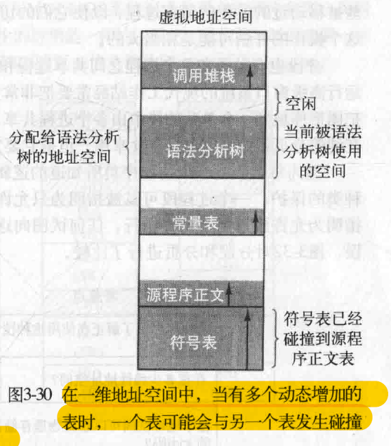
2. 通常段都很大，填满段的可能性很小，**每段的大小是不一样、不固定的**。
3. 分段后地址是两部分（n, s）,n是段号，s是段内地址，所以是二维的。
4. 段是一个逻辑实体logical entity，一般一个段中不会包含不同类型的内容。
5. 分段优点：

    （1）提供多个**相互独立**的地址空间，**段的长度在运行期间也可以动态改变**，但是不会影响到其他段。

    （2）可以很简单的把单独编译好的过程链接起来==》每个段的入口地址都是（n,0）。

    （3）能更方便的实现共享内存：可以把数据放在一个单独的段中，多个进程直接引用这个段，分页系统中的共享需要操作系统介入（通过内存映射或者共享页表条目来实现）。

### 3.7.1 纯分段的实现 implementation of pure segmentation

1. 页面是定长的而段是动态改变的
2. **内部碎片**：分页系统中平均每个进程的最后一个页面有一半是空的，形成内部碎片internal fragmentation。
3. **外部碎片**：分段系统运行一段时间后，可能会因为大段被小段替代，在不同位置产生很多空闲区，被称为棋盘形碎片checkerboarding/外部碎片external fragmentation。
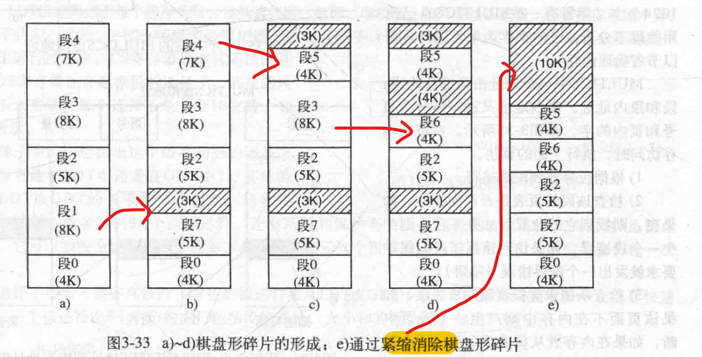
4. 通过段号+段的起始地址 加上虚拟地址的偏移量得到 物理地址。

### 3.7.2 分段和分页结合：MULTICS

1. **段比较大的时候对他进行分页**，只把真正需要的页面调入内存。
2. MULTICS是一个很有名的操作系统，他虚拟存储架构结合了分段和分页：

    （1）每个MULTICS程序都有一个段表；

    （2）MULTICS把每个段都看做一个虚拟内存，并给段分页，分页之后每个段会有自己的页表；

    （3）段表可能很大，因此段表本身也作为一个段会被分页；

    （4）段表中的每个段有一个描述符descriptor，描述符的结构如下图b中所示，**如果这个段在内存中，描述符中就会有一个18位的指针指向段的页表**；

    （5）只要一个段的任一部分在内存中，这个段就被视为在内存中。

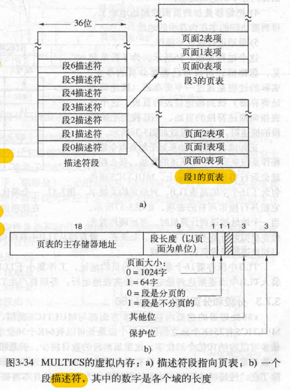

    （5）虚拟地址的组成 = 段号 + 段内地址（页号+ 页内偏移量）；   

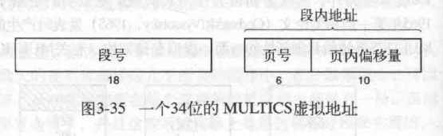

    （6）MULTICS硬件配置了TLB快表；   

    （7）**访问内存的过程**： 查找虚拟地址在不在TLB中==》TLB命中则生成物理地址，未命中则根据以下步骤映射物理地址： 根据段号找到段的描述符==》判断段的页表是否在内存中==》不在则产生段错误，在则根据指针找到页表在哪里==》根据段内地址查找页表在不在内存中==》不在则缺页中断，在则映射物理地址成功访问。

### 3.7.3 分段和分页的结合：Intel x86

1.
