Processes and Threads

1. 进程processes是操作系统最重要的抽象之一。

### 2.1.1 进程模型

1. 计算机上会同时运行多个程序，他们被组织成若干 顺序进程 sequential process，简称进程process。 **一个进程就是一个正在执行的程序的实例。**
2. 伪并行-》一个CPU快速在不同进程之间切换，看起来好像同时并行多个程序。和多处理器系统不一样。
3. **进程 不等于 程序。** 程序就是那个代码，进程是代码执行输入输出的活动activity的总和，包括程序、输入、输出和状态。

### 2.1.2 进程的创建

1. windows 任务管理器查看进程；UNIX中的ps程序查看进程。
2. 停留在后台处理邮件等的进程是 守护进程 daemon。
3. 进程创建的几种方式：

   （1） 系统初始化；

   （2）正在运行的程序执行了创建进程的**系统调用**（包括 一个批处理作业的初始化、用户通过鼠标、键盘等启动的系统进程创建一个新进程）。
4. 第三点中的 批处理情景：批处理系统中，用户提交批处理作业，操作系统认为有资源可运行另一个作业时，就创建一个新的进程，并运行其输入队列中的下一个作业。
5. **UNIX系统中只有 fork系统调用 可以新建进程**。windows 中是 createProcess
6. 父进程创建出的子进程和父进程拥有相同的内存映像memory image、同样的环境字符串和同样的打开文件，但是地址空间不同。子进程和父进程不可写的内存区是共享的，可写的内存是不共享的==》UNIX中内存可能通过写时复制（copy-on-write）共享，就是当想修改这个内存的时候，就复制一个新的一人一份。
7. 子进程是父进程的副本，然后子进程再执行execve。

### 2.1.3 进程的终止 Process Termination

1. 进程终止的几种情况：  
 voluntary自愿的：  
  （1）正常退出  
  （2）出错退出  
 involuntary非自愿的：  
  （1）严重错误

    （2）被其他进程杀死，UNIX中是kill，Win32中是TerminateProcess

### 2.1.4 进程的层次结构 Hierarchies

1. UNIX 每个父进程可以有很多子进程，最高层的父进程为root形成进程树一样的结构，被称为一个进程组，**只有父进程能够控制和访问子进程**。
2. kill操作发送一个信号时，会发送给进程组中的每个进程，**忽略该信号或采取默认动作的进程会被杀死**。
3. **windows中没有**上述**进程层次的概念**。 父进程在创建进程的时候会得到一个特殊的token，被称为**handle句柄，用来控制子进程**。但是handle**句柄可以被传递给其他进程**==》没有继承结构、**所有进程都是平等的**。

### 2.1.5 进程的状态 states

1. 进程的三种状态：

   (1). 就绪态ready：进程已经获得了除CPU之外的一切资源，一旦等到CPU分配给自己的时间片就可以运行；

   (2). running运行态：进程正在CPU上运行;

   (3). blocked阻塞态：**进程逻辑上不能运行**，即使CPU空闲也不能。进程正在等待某一事件而暂停运行，**如等待某资源可用或等待IO操作完成**。

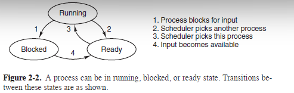

1. Scheduler调度程序的主要工作就是决定应当运行哪个进程、何时运行及运行多长时间，这些进程有的是系统的一部分。所有关于终端处理、启动进程和停止进程的具体细节都隐藏在调度程序中。

### 2.1.6 进程的实现 implementation of Processes

1. **操作系统维护一张表-->进程表process table，每个进程在这个表里有一个对应项**、称为**进程控制块process control blocks，PCB**。**进程控制块里保存了进程状态**的重要信息**，如程序计数器、stack pointer栈指针、内存分配、文件打开状态**所有在切换进程状态时需要保存的信息**。系统会根据不同的阻塞原因，把进程PCB挂到不同的阻塞队列中。
2. interrupt vector中断向量，和每个I/O class类关联的内存位置被称为中断向量。
3. **当中断发生后操作系统最底层的操作顺序**：  
 （1）. Hardware把进程相关的状态（如程序计数器）pushed onto stack压入堆栈。 ==》中断处理完成后系统能返回原状态执行原进程。

    （2）. 硬件根据中断向量interrupt vector查询到对应的中断处理程序的入口位置，把程序计数器设置为该地址。
   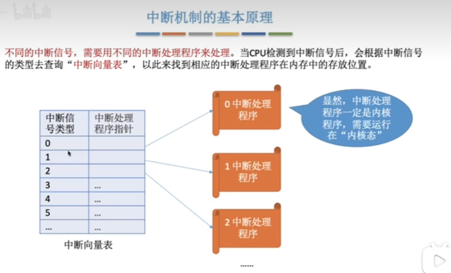
 （3）. 汇编语言程序（assembly-language routine）保存寄存器registers==》为了保证中断处理完之后执行原程序。  
 （4）. 汇编语言程序设置新的堆栈==》中断处理程序产生的数据和原程序的堆栈内容不相互干扰。  
 （5）. 上述环境都设置好之后，C语言中断服务例程运行。  
 （6）. 调度决定下一个运行的进程（多数是重启引起缺页中断的指令）。  
 （7）. C语言程序返回到汇编语言。  
 （8）. 汇编语言中断处理程序恢复之前保存的寄存器的状态，把控制权转交给调度器选择的新进程，启动新的进程。

### 2.1.7 多道程序设计模型

1. CPU利用率 = 1-P^n  (p是进程等待时间与停留在内存中的时间的比值，停留在内存中表示进程在运行)，n是内存中进程的个数。
2. 下图可见，同样的进程数，等待时间越小，CPU利用率越高。同一条线上进程数越大、CPU利用率越大。因为进程会占用内存，所以增加进程数量要提高内存，但是提高内存带来的CPU利用率的上升是边际递减的。
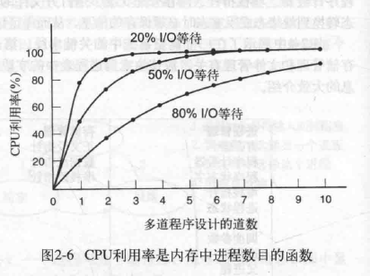

## 2.2 线程THREADS

1. 传统操作系统中，每个进程有一个地址空间和一个单独的控制线程。
2. 存在在**同一个地址空间**中有多个控制线程处在**类并行**（quasi-parallel）的运行状态中==>仿佛分离的进程一样。

### 2.2.1 线程的使用 Thread Usage

1. **多线程概念：并行实体拥有共享同一个地址空间和所有可用数据的能力。**
2. **为什么需要多线程？**  
 （1）. 线程切换时不用考虑中断、定时器和上下文切换，只需要考察并行进程。  
 （2）. 线程比进程更轻量级lighter weight，更容易创建和撤销。创建一个线程比进程快10-100倍。  
 （3）. 对于CPU密集型的情况，需要大量计算、持续占用CPU，多线程不会增强性能。对于多个计算和I/O处理，多线程能让CPU在多个活动中切换，提高性能。
3. **多线程就是，可以把一个进程分成并行的多个线程**，如一个文字处理软件，一个线程负责处理用户交互，第二个线程负责后台计算，第三个线程负责磁盘备份。==》这三个线程可以共享公共内存==》同时处理同一个文件的内容，不同进程不能这样工作。
4. 多线程可以用来改善Web服务器性能：一个线程用于分发dispatcher网络请求,dispatcher线程挑选一个空转（被阻塞）的工作线程worker thread提交网络请求，工作线程被唤醒，拿到请求结果（检查是否在cache高速缓存中，不在就去磁盘上取，**在该工作线程去磁盘上操作的时候，该线程是阻塞在磁盘操作的，dispatcher可能挑选另一个工作线程工作**）并返回，然后该线程阻塞以便等待一个新请求。==》 多线程模型：并行性、阻塞系统调用。
5. 单线程进行，逐个处理请求，在线程阻塞在磁盘操作上的时候CPU是空转的。==》无并行性、阻塞系统调用。
6. 有限状态机finite-state machine：需要进程磁盘操作，就开启一个非阻塞的磁盘操作后，记录请求状态，然后去处理下一个事件，非阻塞磁盘的回答以信号或者中断的形式出现。有限状态机主要是状态之间的切换。==》并行性、非阻塞系统调用、中断。非顺序进程。
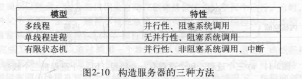

### 2.2.2 经典的线程模型

1. 线程有时被称为**轻量级进程 lightweight process**。
2. 多线程进程在单CPU系统中运行时，线程就像进程一样轮流运行，假如3个线程，每个线程在一个CPU上得到真实CPU速度的三分之一。
3. 同一个进程的所有线程都有完全一样的地址空间--》能访问内存中同样的区域--》共享同样的全局变量。**同一个进程下的线程可以读、写、清除另一个线程的堆栈**==》**线程之间没有保护**，他们本来就是用来相互合作的。

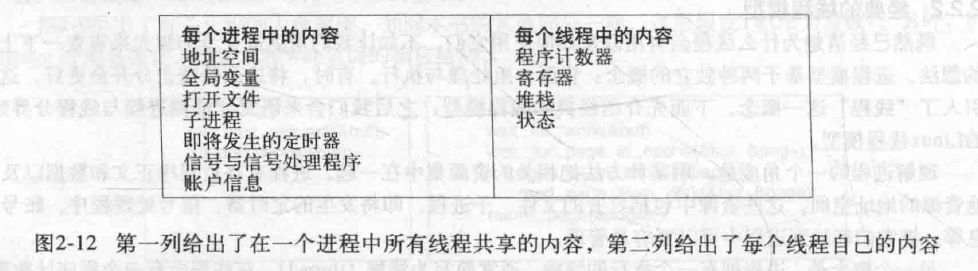
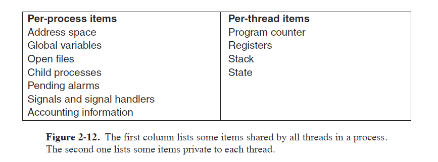

4. 线程的状态：running运行、blocked阻塞、就绪ready、终止terminated，状态之间的转换和进程的一样。
5. **每个线程都有自己的stack堆栈**，堆栈里的每个帧frame用来给每个被调用但是还没返回结果的过程procedure**保存局部变量**和调用完成之后使用的**返回地址**redurn address。
6. 多线程的进程通常从当前的单个线程开始，当前线程调用库函数library procedure: thread_create，函数返回线程标识符thread identifier作为新线程的名称。**通常所有线程之间是平等的**。
7. thread_exit退出线程。thread_join让一个线程等待某个特性的线程退出。thread_yield允许线程自动放弃CPU从而让另一个线程运行。

### 2.2.3 POSIX线程(POSIX可移植性系统操作接口)

1. IEEE定义了线程的标准。定义的线程包叫做Pthreads。

### 2.2.4 在用户空间中实现线程

1. lmplement threads的两个主要位置：用户空间和内核kernel。
2. **在用户空间中实现线程**：把整个线程包放在用户空间中，**内核对线程包一无所知**。==》**内核按照单线程进程的方式去管理。**
3. 优点：

    (1). 用户级线程包可以在不支持线程的操作系统上实现（因为内核不知道），使用库函数实现线程。

    (2). 线程切换、调度程序等只是本地过程，不需要trap陷入内核，不需要上下文切换、不需要对内存cache高速缓存刷新==》更快。

    (3). 运行每个进程process有自己定制的调度算法。==》**如每些应用程序自带垃圾线程收集机制**。
1. 线程在一个运行时系统run-time sysytem的上层运行。
2. 运行时系统指 一个管理线程的过程的集合（如phread_create,pthread_exit等这些库函数里的过程）。==》线程在这些库函数的上层运行。
3. 每个进程有专用的线程表thread table，**线程表由运行时系统管理**。进程表在内核中，线程表在用户空间中。
4. 使用线程的主要目标是：首先要允许每个线程使用阻塞调用blocking calls，但是不能让阻塞的线程妨碍到其他线程。
5. 由7引出用户级线程的问题：**如何实现阻塞系统调用**how blocking sysytem calls are implemented。因为用户级线程不由内核管理，当用户级线程出现一个线程被阻塞的时候，无法通知操作系统切换线程==》导致所有线程被阻塞。
6. 8的处理方案之一：多数UNIX系统中**存在一个system call系统调用select**，可以**提前检查read procedure是否会阻塞**，不阻塞就执行，会阻塞就不执行这个read。这些check代码被称作包装器jacket或者wrapper。==》**需要重写系统调用库**，低效且不优雅。
7. 用户级线程包其他缺点：  
 (1). page faults 缺页中断问题，本质跟8一样，无法处理阻塞操作。当程序在内存上查找不到数据，需要去磁盘读取，读取过程中整个进程会被阻塞，因为操作系统看不到用户级线程，只能看到整个进程。=》**只要一个线程触发了page faults，整个进程就会阻塞。**  
  (2). 一个线程运行时，除非他自动放弃CPU，其他线程不能运行，因为单独进程的内部没有时钟中断。

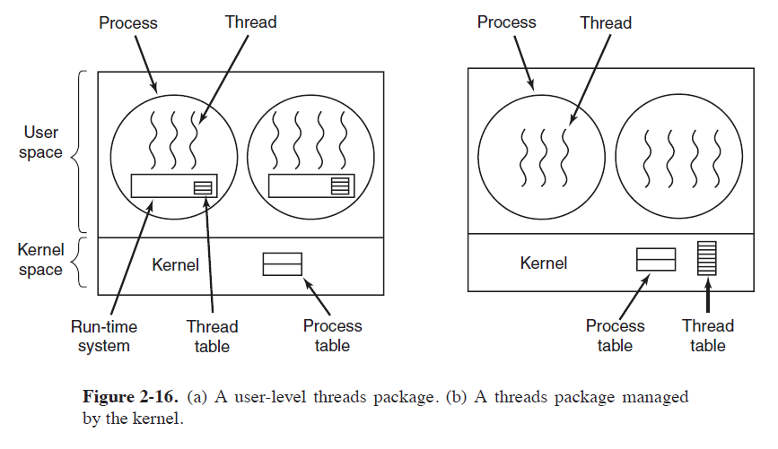

### 2.2.5 在内核中实现线程

1. 进程中不再有线程表了，**内核中的线程表**统一记录线程，保存每个线程的寄存器、状态和其他信息。
2. 某个进程想创建、撤销其他线程时，直接进程system call**系统调用**，**系统调用会更新线程表**。
3. 内核中管理线程开销大：**回收线程recycle threads**。**把需要销毁的线程标志为不可用**，但是内部数据结构没受印象，**需要新建线程的时候就重启这个线程**。
4. **内核级线程的开销大、速度慢**。
5. fork一个多线程的进程时，新进程拥有几个线程？**新进程只会复制调用fork()的那个线程**，新词新进程只有一个线程，它的状态与调用fork()时的状态相同。
6. todo: 进程收到信号的时候，让哪个线程来处理呢？

### 2.2.6 Hybrid Implementations 混合实现

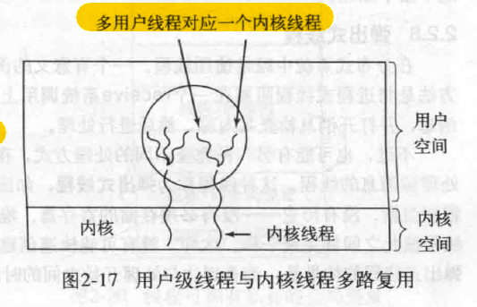

### 2.2.7 调度程序激活机制Scheduler Activations和上行调用Upcalls

1. 用于改善用户级线程的性能==》解决阻塞调用和page faults问题。
2. 前提： 内核为每个进程分配一定数量的虚拟处理器，并允许运行时系统将线程分配给这些处理器。
2. 当一个线程阻塞或者阻塞结束时，内核通过上行调用Upcalls来通知运行时系统，运行时系统就可以去调度线程。
3. 违反分层次系统内在结构的概念==》n层是向上层提供服务，但是不能调用上层中的过程。

### 2.2.8 弹出式线程 Pop-Up Threads

1. 分布式系统中处理进入的消息：  
 （1）. 传统方法：一个阻塞的进程或者线程在receive system那里等待消息进入。  
 （2）. 弹出式线程：消息进入之后新建一个线程用来处理这个消息。
2. 优点：新建的线程很新、没有历史，从创建到开始处理的时间间隔很断。

### ~~2.2.9 使单线程代码多线程化

很难

1. 如全局变量，线程1设置了全局变量的值之后，线程2重新设置了这个全局变量，线程1设置的值就丢失了。==》办法：为每个线程赋予全局变量的私有副本、即私有的全局变量。
2. 多线程堆栈的管理也很困难，所以给已有系统引入线程最好冲洗进程系统设计。

## 2.3 进程间通信 inter process communication, IPC

1. 需要解决的三个问题，一是进程间传递数据；二是多个进程不要相互交叉如订票系统中进程A和B都抢夺同一个座位；三是进程间有数据依赖时保证他们按照正确的顺序执行。
2. 对于线程来说问题一不需要解决，因为他们共享，问题二、三同样适用于线程。

### 2.3.1 竞争条件 Race conditions: 指的是多个进程读写某些共享数据，最后的结果取决于进程运行的时序。如2.2.9 的1中的例子，谁是最后一个保存的

### 2.3.2 critical region/criticalk section临界区：把对共享内存进程访问的程序片段称作临界区

1. 不能让多个进程同时读写共享的数据==》让他们互斥mutual exclusion ==》不能让两个进程同时处于临界区中才能避免竞争条件。

### 2.3.3 忙等待的互斥 mutual exclusion with busy waiting

0. 连续测试一个变量（不停while循环）直到某个值出现为止，被称为**忙等待busy waiting**==》浪费CPU时间。**用于忙等待的锁被称为自旋锁spin lock**。==》适合预计很快会释放锁的场景。

1. disabling interrupts 把中断屏蔽掉：**single-processor system单处理器系统中适用**。具体是每个进程进入临界区之后屏蔽所有中断，中断被屏蔽之后，时钟中断clock interrupts也被屏蔽==》CPU不能再进行进程切换，只有时钟中断或其他中断发生CPU才会切换进程。  
 缺点：如果进入临界区的是用户进程，就相当于把屏蔽中断的权力交给用户进程，不好。  
只对执行disable命令的那个CPU有效，多处理器的话其他cpu不受影响==》只适用于单处理器系统。

2. 锁变量Lock Variables：软件解决方案。设置一个变量值为0表示临界区没有进程，1标识卡有进程。但是如果两个进程同时读到变量0的话，还是能同时进入临界区。

3. 严格轮换法 Strict Alternation：在一个进程比另一个慢很多的情况下，不是好办法。比如进程b离开临界区把turn值设置为0，然后去非临界区操作，进程a进入临界区很快完成操作turn值设置为1，也完成了非临界区的操作，只能等待进程b把turn再改成0，但是进程b很慢。  
下面就是自旋锁，对于进程a来说turn=0等于锁被释放，turn=1表示锁定。

```
// 进程a
while(true) {
 while(turn !=0);// 循环等待其他进程离开临界区
 critical_region();// 临界区
 turn = 1; // 离开临界区，允许进程b进入
 noncritical_region(); 
}

// 进程b
while(true) {
 while(turn !=1);// 循环等待其他进程离开临界区
 critical_region();// 临界区
 turn = 0; // 离开临界区，允许进程b进入
 noncritical_region(); 
}

```

4. Peterson解法:经典的软件实现的同步算法，适用于两个进程之间的。

```C
#define N 2 // 进程数为2
int turn; // 现在轮到哪个进程？
int interested[N]；// 记录对进入临界区感兴趣的进程，初始化都是false。

void enter_region(int process) // 进程调用进入临界区
{
 int other = 1 - turn; // 另一进程号
 interested[process]=true; // 记录当前进程想进入临界区 
 turn = process; // 轮到当前进程，谁后调用enter_region方法turn就会被覆盖，所以最终turn记录的是最新想进入临界区的进程号。
 while(turn == process && interested[other] == true); // 如果当前进程是后调用enter_region的并且其他进程也想进入临界区，当前进程就要一直while循环等待其他进程从临界区退出。
}

void leave_region(int process)
{
 interested[process] = false;  // 记录当前进程离开临界区
}

```  

考虑一个极端情况，Process 0和Process 1几乎同时调用了enter_region, 最终肯定有个线程把另外一个线程的数据给覆盖了，假定process 1覆盖了 process 0，那么这个时候turn是1。interested[0]=interested[1]=true.

process 0 会马上进入临界区，不执行while循环
process 1则会被block，因为这个时候 turn=1 && interested[0]=true，满足while循环。

<https://blog.csdn.net/a9621196211/article/details/102389785?ops_request_misc=%257B%2522request%255Fid%2522%253A%2522172448566016800222818843%2522%252C%2522scm%2522%253A%252220140713.130102334..%2522%257D&request_id=172448566016800222818843&biz_id=0&utm_medium=distribute.pc_search_result.none-task-blog-2~all~sobaiduend~default-4-102389785-null-null.142^v100^pc_search_result_base2&utm_term=Peterson%E8%A7%A3%E6%B3%95&spm=1018.2226.3001.4187>

5. The TSL Instruction， TSL 指令，指令内容：TSL RX,LOCK。被称为测试并加锁test and set lock。

（1）. 需要硬件支持，使用一个共享变量lock来协调对共享内存的访问。  
（2）. 指令把内存字(memory word) lock的内容读进寄存器RX中，然后在该内存地址上存一个非零值。执行TSL指令的CPU会锁住内存总线，指令结束之前其他CPU不能访问内存==》适合多处理器的计算机。屏蔽中断就达不到这种效果。TSL指令结束时把lock的值重置为0。  
（3）. 缺点也是 忙等待，一直调用enter_region去检查lock的值。

### 2.3.4 进程间通信的原语interprocess communication primitives睡眠与唤醒 Sleep and Wakeup

1. **sleep**是一个系统调用，**使得被调用者进入阻塞block状态。wakeup唤醒进程**。
2. The Producer-Consumer Problem 生产者-消费者问题，也称作有界缓冲区问题bounded-buffer problem。生产者和消费者共享内存，生产者生产的数据满了生产者需要sleep,内存里空了消费者需要sleep等有数据了之后再wakeup。==>需要一个变量count记录一下内存里还有多少条数据。

### 2.3.5 信号量Semaphores，解决wakeup丢失问题，用一个整型变量累计唤醒次数

1. 某进程的信号量执行down操作，减到信号量为0时执行down的进程被阻塞，直到信号量大于0，对应sleep;执行up操作,信号量加1，对应wakeup。

2. 原子操作atomic action：指一组相关联的操作要么不间断的执行，要么都不执行==》如down操作，检查信号量是否为0，修改信号量、进程可能会sleep这些操作是不可分割的原子操作，会不间断的执行或者都不执行。==》多线程/进程环境中保证对共享资源的访问不会因为其他线程的介入而不一致。
3. 信号量可以用来实现互斥和同步。

下面代码是 使用信号量的生产者-消费者问题

``` C

#define N 100 /* number of slots in the buffer */
typedef int semaphore; /* semaphores are a special kind of int */
semaphore mutex = 1; /* controls access to critical region 控制对临界区的访问*/
semaphore empty = N; /* counts empty buffer slots 计数缓冲区的空槽数目*/
semaphore full = 0; /* counts full buffer slots 计数缓冲区的满槽数目*/

void producer(void)
{
 int item;

 while (TRUE) { /* TRUE is the constant 1 */
  item = produce item( ); /* generate something to put in buffer */
  down(&empty); /* decrement empty count */
  down(&mutex); /* enter critical region */
  inser t item(item); /* put new item in buffer */
  up(&mutex); /* leave critical region */
  up(&full); /* increment count of full slots */
 }
}

void consumer(void)
{
 int item;

 while (TRUE) { /* infinite loop */
  down(&full); /* decrement full count */
  down(&mutex); /* enter critical region */
  item = remove item( ); /* take item from buffer */
  up(&mutex); /* leave critical region */
  up(&empty); /* increment count of empty slots */
  consume item(item); /* do something with the item */
 }
}

```

### 2.3.6 互斥量Mutexes，mutex_lock, mutex_unlock

1. 信号量的简化版本，易实现==》实现用户空间线程包时很有效。
2. 互斥量有两个状态：解锁和加锁，通常0表示解锁。
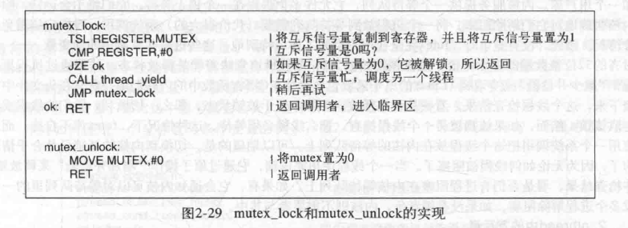

如果是之前讲过的enter_region，进入临界区失败，会进入忙等待，进程运行太久的话clock超时会调度切换其他进程运行。但是互斥量通常用在用户空间，没有时钟来把运行过长时间的线程停掉，为了防止一直循环，所以上图要主动调用thread_yield来把CPU让给其他线程。

#### Futexes（fast user space mutex） 快读用户区互斥量futex

1. futex是Linux的特性，实现了基本的锁，但是可以不用陷入内核dropping into the kernel。==》避免切换到内核的开销、改善性能。
2. futex包含两个部分：一个内核服务（内核服务提供一个等待队列，可以让多个进程在一个锁上等待）和一个用户库，结合用户空间和内核空间的功能。
3. 适用于锁竞争不激烈的情况，**因为只有在锁竞争的情况下才用得到内核**，没有内核的时候futex完全再用户空间工作。
4. 具体过程：线程尝试获取一个互斥锁的时候，执行原子操作“减少并检验”夺取锁，没被锁就顺利夺取，**被锁的话futex不会自旋不会忙等待，会使用系统调用把这个线程放在内核的等待队列上**。线程用完锁之后，通过原子操作释放锁，通知内核在队列中挑进程/线程来唤醒。

#### Mutexes in Pthreads ，Pthreads中的互斥锁

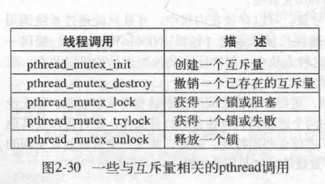

1. 条件变量condition variables ，一种同步机制synchronizatiojn mechanism。跟互斥锁mutex一起用，让线程由于一些条件去阻塞，主要是wait和signal操作。
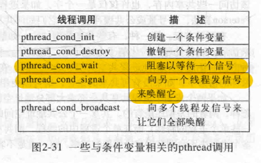

### 2.3.7 Monitors 管程==》比心好象更高级的同步原语synchronization primitive

1. 管程是一个过程procedures，变量variables和数据结构data structures的集合，他们一起组成特殊的module或者package。
2. 管程的重要特性：任一时刻管程中只能有一个活跃进程==》进程调用管程时自动互斥，**如果检查到管程中有其他活跃进程，调用进程就被挂起，等待活跃进程离开时把自己唤醒**。==》这种互斥由编译器负责不是程序员负责==》出错率小。
3. 使用的时候把临界区转换成管程。
4. 如何实现调用管程的进程在需要等待时被阻塞？==》condition variables 条件变量的wait操作和signal操作。
5. 条件变量如果signal操作了，但是该条件变量上没有等待进程，信号会永远丢失==》signal操作之前一定要先wait操作。
6. 管程是一个语言概念language concept，C不支持，java支持。
7. **Java支持用户级线程supports user-level threads。**
8. Java class中的方法添加了synchronized关键字声明之后，Java保证一旦某个线程执行了这个方法，其他线程就不能执行这个类对象中的任何带有synchronized方法。
9. 下面是Java中实现生产者-消费者问题的解法，但是Java没有内嵌的条件变量，所以提供了wait()和notify()方法与sleep和wakeup等价。
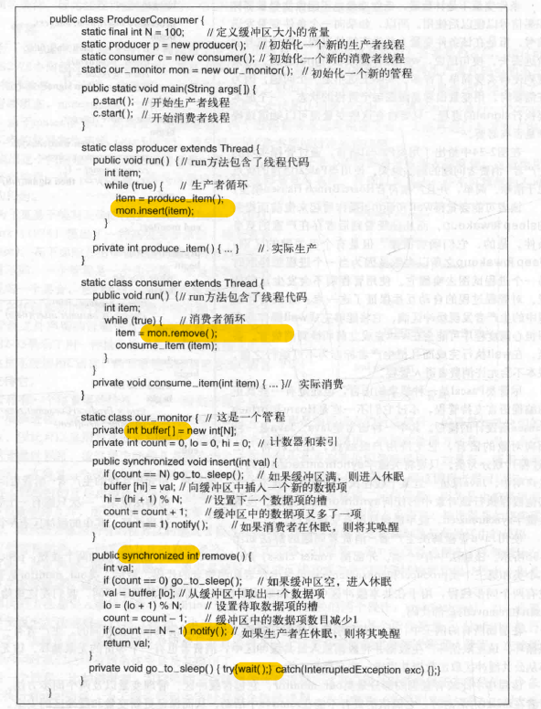
10. 管程和信号量都是设计及用来解决 访问公共内存的一个或多个CPU上的互斥问题的。信号量缺点：太基础，需要程序员直接操作计数器，容易出错，且是为共享内存设计的，无法直接应用于每个CPU拥有自己的私有内存的分布式系统；管程缺点：只有个别语言支持。

### 2.3.8 消息传递 Message Passing==》网络中不同机器上的通信进程，分布式进程

1. 两条原语 primitives：send 和receive，像信号量一样是系统调用。
2. send(destination, $msg)向给定目标发送一条消息; receive(source, $msg)从一个给定源接收一条消息;
3. 接收方收到之后回发一条确认消息acknowledgement。同样的消息重发：可以在原消息中嵌入同样的连续序号来表明是同一条消息。
4. 将消息从一个进程复制到另一个进程通常比信号量操作和进入管程更慢。
5. 用消息传递解决生产者-消费者问题：共使用N条消息，类似于一块共享内存缓冲区中的N个槽。消费者首先将N条空消息发给生产者，生产者取走一条空消息并回发一条填充了内容的消息。
6. 消息的地址问题：（1）给每个进程分配一个唯一地址； （2）使用mailbox信箱的数据结构，send和receive的地址参数是信箱的地址。目标信箱作为缓冲机制buffering mechanism容纳已被发送但尚未被接收的消息。
7. 消息传递结接口Message-Passing Interface, MPI消息传递接口就是一个著名的消息传递系统。

### 2.3.9 屏障Barriers ==>用于进程组的同步机制，也是一种原语

1. 以cfd中的迭代计算为例，第n次迭代的每个进程在执行完当前迭代的内容之后都要执行一个屏障操作，当所有的进程都执行完第n次迭代的内容、即都到达屏障barriers之后，才可以开始第n+1次迭代。

 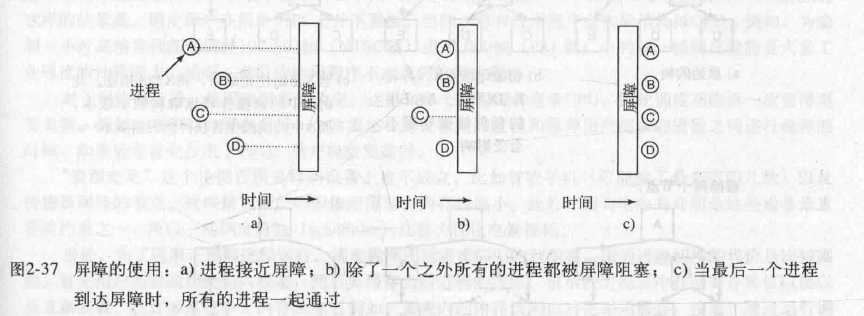

### 2.3.10 避免锁avoiding locks：读-复制-更新，read-copy-update, RCU==》最快的锁就是根本没有锁

1. RCU 在没有锁的情况下，如何册灰姑娘共对共享数据结构的并发读写进行访问？：  
（1）read读操作可以无锁的访问共享数据结构，因为他不会修改数据，不需要特殊的同步机制保护数据一致性。  
（2）write写操作要 先copy一份数据结构的副本，在副本上修改，修改之后为了确保所有在修改前开始的读操作都已经结束（之前的读操作都正常读取旧数据），需要等待一个宽限期Grace Period的时间，再真的更新数据结构。
2. RCU中的读操作不允许被阻塞或者休眠==》为了保证宽限期Grace Period不被干扰。
3. 等到所有线程执行完一次上下文切换，就可以确保之前所有的读操作都离开了临界区完成工作了。==》**上下文切换context switch**就是 一个线程放弃CPU的控制权，操作系统保存当前线程的状态，加载另一个线程的状态，即**切换了线程运行的环境**。

### 参考Javaguide--线程间同步的方式有哪些？

0. 原语Primitives：是指在操作系统或编程语言中，提供的一组基本操作或功能。具有原子性、不可分割性等特点。原语通常由硬件或操作系统内核提供，以确保其操作的原子性和安全性。
1. 互斥锁（Mutex）：采用**互斥对象**机制，互斥对象是一个名词，就是同一个时刻只有一个线程能获取到这个对象，保证该对象不会被多个线程同时获取==》**Java中的synchronized关键字和Lock都是这种机制。**
2. 信号量：信号量是一个整型变量，用于累计唤醒次数，sleep对应信号量减一，wakeup对应信号量加一。当一个线程需要访问共享资源时，信号量减一，如果信号量变为0，则该线程被阻塞；当一个线程释放共享资源时，信号量加一，如果信号量从0变为1，就唤醒一个等待的阻塞进程。
3. 屏障：**屏障是一种同步原语**，当某个线程到达屏障之后就停止执行，等待其他线程也到达屏障，当所有线程都到达屏障之后，他们才会一起越过屏障继续执行下一步。
4. 读-复制-更新Read-Copy-Update，RCU。**不设置锁**，读操作直接执行，写操作先在复制的副本上执行，等到临界区中所有的读操作都完成之后，再更新数据。
5. 读写锁：读锁是共享的，同一时刻只能由一个线程获得到写锁。

### 参考Javaguide--进程间通信的方式有哪些？todo看不懂

1. 套接字：TCP套接字实现网络通信；
2. 信号
3. 信号量
4. 管道---跟管程不一样，管程是进程间同步的原语，管道用于进程间通信。

## 2.4 SCHEDULING 调度

1. multiprogrammed computer中选择接下来要运行的进程的程序，是调度程序scheduler,算法是调度算法scheduling algorithm。
2. 如网络服务器经常面都多个进程竞争CPU。

### 2.4.1 调度简介

1. 当一个进程因等待外部设备完成工作而被阻塞时，才是I/O活动。
2. bursts值CPU的突发使用，**CPU密集型进程CPU-bound process， I/O密集型进程I/O-bound process**。
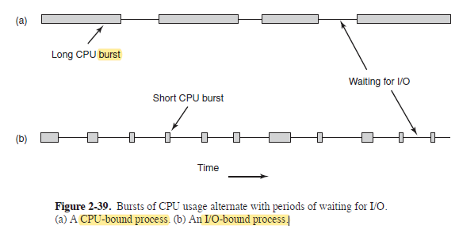
3. CPU更新换代的快，越来越多的进程变得倾向为I/O-bound。
4. 硬件时钟可以提供50Hz，60hHz或者其他频率的周期性中断。
5. 调度算法分为两种：

   (1). **非抢占式调度算法** nonpreemptive scheduling algorithm：在时钟中断时不会发生调度，可以让某进程连续运行很久。

   (2). **抢占式调度算法** preemptive scheduling algorithm：让进程在某一时间段内运行，时间一到发生时钟中断，**CPU控制权返给调度程序**。

#### 调度算法的分类

1. 调度算法运行的三种环境：  
（1）. 批处理Batch。非抢占式算法或者长时间周期的抢占式算法==》减少进程的切换从而改善性能。  
（2）. 交互式Interactive。必须要抢占式，比如服务器。  
（3）. 实时Real time。

#### 不同环境下调度算法的目标或者说评价指标

1. 均衡性就是：用户觉得点击放大图片的心理预期是3s，实际上用了20s用户可能就会气急败坏的抱怨了，这样均衡性就不好。
2. 可预测性：多媒体系统中保证音视频的品质。
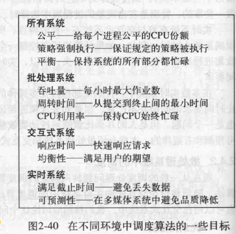
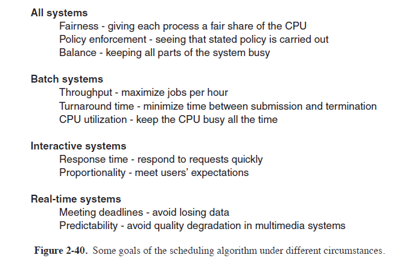

### 2.4.2 批处理系统Batch Systems中的调度

1. **先来先服务first-come first-served算法**：**非抢占式**。**就绪进程单一队列**排队请求使用CPU，运行中的进程被阻塞时，第一个进程接着运行，阻塞进程变为就绪后到队尾排队。
2. **最短作业优先shortest job first**：**非抢占式**。N个同等重要的作业**同时开始运行**的情况下，最短作业优先时最优的。如果作业不是同时到达，有先后顺序，就不适用。
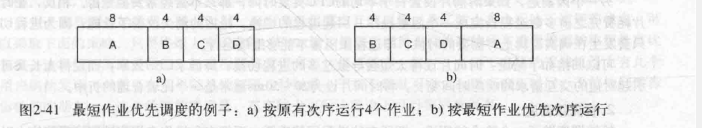
上图左边依次运行时间是8，12，16，20，平均作业14分钟。右边依次运行时间是4，8，12，20，平均作业11分钟。
3. **最短剩余时间优先shortest remaining time next**：最短作业优先的**抢占版本**。总是选择剩余运行时间最短的进程运行。

### 2.4.3 交互式系统Interactive systems中的调度

1. **时间片轮转调度round-robin scheduling**。抢占式。允许每个进程在一个时间段内运行，超时切换进程，称这个时间段是时间片quantum。  
    （1）. 调度程序需要维护一张可运行进程列表，运行到时间的进程去列表末尾排队。  
    （2）. 时间片的长短：过短需要频繁切换进程，切换进程本身就需要CPU运行时间，可能会浪费CPU在切换进程即管理上。过长则排在后面的请求响应时间太长了。通常20~50ms比较合理。
2. **优先级调度priority scheduling**。每个进程被赋予一个优先级，**优先级最高的先运行**。  
  （1）. 可以先把进程按照优先级分类，优先级高的先运行，同一优先级内部用轮转法让每个进程运行一个时间片。  
  （2）. 防止高优先级一直运行，低优先级饥饿==》调整优先级，对于I/O密集型**可以动态调整优先级**：在上一个时间片中占用时间越少的进程获得更高的优先级。**让I/O密集型更优先，因为I/O操作时CPU可以被其他进程使用，实现并行处理**。
3. 多级队列Multiple Queues。为CPU密集型进程设置较长的时间片比频繁分给他短时间片更高效。
4. 最短进程优先。如何预估哪个进程最短==》根据当前测量值和先前估计值加权平均。
5. 保证调度：保证用户能明确得到多少资源。系统要跟踪各进程的使用时间，跟保证的应获得时间进行对于，根据对比结果及时调整。如n个进程保证每个有1/n的CPU使用时间。
6. 彩票调度。lottery scheduling。给所有进程提供资源彩票，一共有100张彩票，拥有20张彩票的某个进程大约得到系统资源的20%。
7. 公平分享调度fair-share scheduling。不按照进程分配，按照用户分配，让每个用户得到的资源比较公平，比如用户a有10个进程，用户b有1个进程，10个加起来得到的资源应该和b的那一个一样多。

### 2.4.4 实时系统中的调度：调度程序的任务就是要满足所有截至时间

1. 硬实时hard real time必须满足绝对的截至时间。软实时soft real time偶尔不满足也可以容忍。
2. 实时系统中的事件分为周期性和非周期性。只要这些进程共同需要的CPU事件综合小于CPU能提供的事件，这个实时系统就是可调度的。

### 2.4.5 策略和机制policy versus mechanism

1. 主进程能掌握子进程哪个更重要，但是以上调度算法没有从用户进程接受这些决策信息。==》**把调度机制和调度策略分离**，**调度机制在内核中**，把某些东西参数化，**让用户填写参数来决定调度策略**。

### 2.4.6 线程调度

1. 线程的调度分用户级线程还是内核级线程。
2. 用户级线程是先选择进程，然后进程里面的再进行线程调度。
3. 内核线程调度一般来说不用考虑线程属于哪个进程，但是因为跨进程切换线程的代价高于进程内部切换线程（跨进程切线程要修改内存映像maps，清楚cache等），所以当两者同样重要的时候内核也偏向于在进程内部切换线程。
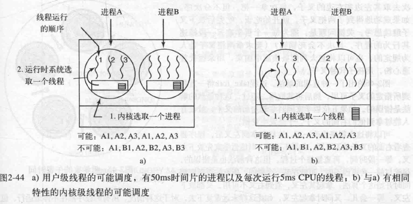
4. 用户级线程可以使用专为应用程序定制的线程调度程序，能比内核调度更好的满足应用需求。

## 2.5 经典IPC问题

1. 哲学家就餐问题：定义一个数组state记录每个哲学家的状态（进餐，思考，饥饿），一个哲学家只有在两个邻居都没有进餐时才允许进入到进餐状态。
