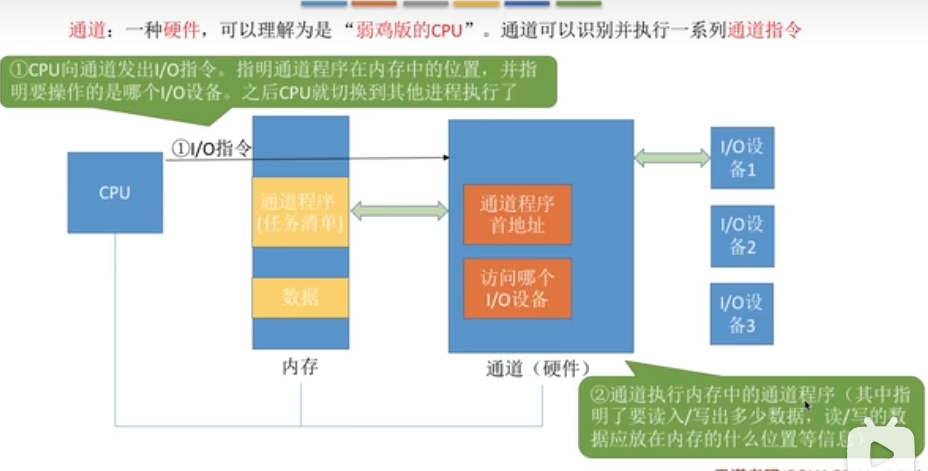

TODO: 这个章节看的王道考研操作系统视频==》有机会再看书

1. "I/O"==>“输入/输出”（Input/Output）
2. I/O设备是计算机中的硬件部件，能将数据输入到计算机。
3. I/0设备分类：按照信息交换的单位分为块设备（传输快，可寻址，如硬盘）和字符设备（传输慢，不可寻址，如鼠标，常采用**中断驱动方式**）。

### I/O控制器

1. I/O设备 = 机械部件 + 电子部件。
2. 机械部件就是看得见的鼠标、键盘、屏幕等。
3. **电子部件**通常是一块插入主板扩充槽的印刷电路板。==》作为CPU和机械设备中的“中介”，**用于实现CPU对设备的控制**，因此**又称为I/O控制器**或设备控制器
4. **一个I/O控制器可能会控制多个设备** ==> 所以每种寄存器有多个 ==> 需要给寄存器编址。
5. 寄存器编址的两种方式：

    (1). **寄存器独立编址**：采用I/O专用地址，给每个寄存器分配一个I/O端口；缺点：访问寄存器需要**C或者C++中没有的特殊指令**，因此需要**使用到汇编代码**，开销大，且要给出 I/O控制器的编号 + 寄存器的地址。

    (2). **内存映像I/O memory-mapped I/O**：让寄存器占用内存地址的一部分；优点：设备控制寄存器只是内存中的变量，可以可其他变量一样寻址。I/O设备驱动程序可以完全使用C语言编写。

6. I/O控制器的功能:

    (1). 接收和识别CPU发出的命令；I/O控制器中有相应的**控制寄存器**用来存放CPU命令和参数。

    (2). 向CPU报告设备的状态；I/O控制器中有相应的**状态寄存器**用来记录设备的状态；

    (3). 数据交换：I/O控制器中有相应的**数据寄存器**用来在CPU和设备之间交换数据，

    (4). 地址识别：需要**给寄存器设置地址**，I/O控制器通过地址判断CPU要读写的是哪个寄存器。

7. I/O控制器的组成 = CPU与控制器的接口 + I/O逻辑 + 控制器与设备的接口。

### 中断

#### 特权指令和非特权指令

1. 特权指令（Privileged instructions）：（1）**只能在内核态下运行**。（2）**高权限访问**：允许操作系统直接访问底层硬件资源，修改系统状态或执行与系统管理相关的操作。（3）**用于系统管理**。
2. 常见的特权指令：

   (1). I/O操作指令，如IN和OUT指令；

   (2). 关机和重启指令；

   (3). 中断控制指令：如CLI、STI，用于控制中断的响应与屏蔽；

   (4). 修改CPU的状态寄存器或控制寄存器的指令：如写PSW、修改内存单元的配置、修改页表基地址寄存器。

3. 非特权指令（Non-priviledged instrucitons）：（1）既可以在用户态下执行也可以在内核态下执行的；（2）用于普通逻辑运算、计算和数据处理等用户程序的日常操作；（3）无法直接访问系统资源。

4. 常见的非特权指令：**trap**、加减乘除等。

#### 中断的概念

1. 操作系统分内核态和用户态。

   (1). 从内核态转为用户态，是操作系统主动转换的；

   (2). 而**中断 是从用户态转为内核态的唯一途径**，使操作系统重新夺回对CPU的控制权。

2. 中断的类型：

    (1). 内中断，也称异常，与当前执行的指令有关，中断信号来源与CPU内部；

    (2). 外中断，狭义的中断，与当前执行的指令无关，中断信号来源于CPU外部；

3. 内中断的例子：

   (1). **当前执行的指令是非法的**，就会引发一个中断信号。如除法指令的除数是0、试图在用户态下执行一条特权指令等。

   (2). **应用程序**想请求操作系统内核的服务，**主动执行一个trap指令**，引发一个中断信号，让系统陷入内核态。

   (3). 缺页中断这种，内核程序修复后会把CPU使用权再次还给应用程序。

4. 外中断的例子==》每一条指令执行结束后，CPU都会例行检查是否有外中断信号：

    (1). 时钟中断：时钟是CPU外部的一个硬件，每隔一个时间片（如50ms）给CPU发送给一个时钟中断信号==》让CPU切换应用程序，实现多个应用程序并行运行。

    (2). I/O中断：由输出/输出设备在输入输出任务完成时给CPU发送中断信号。

5. 系统调用的过程

### I/O控制方式

#### 方式一、程序直接控制方式

1. 程序控制I/O最根本的点是**轮询polling**,又称忙等待==>在每次输入/输入一个字符之后以及输入/输出的过程中，CPU要不断的查询设备的状态以了解设备是否就绪好输入/输出下一个字符。
2. 例子：下图中的读操作指的是CPU从I/O设备中读取数据。
3. 特点：

   (1). 需要CPU频繁干预，且CPU和I/O设备只能串行工作，因为CPU要不断进行轮询检查，即CPU长期处于忙等待状态；

   (2). 每次只能读/写一个字符；

   (3). 读操作的数据流向：I/O设备 -> CPU寄存器 -> 内存；写操作的数据流向：内存 -> CPU寄存器 -> I/O设备。

#### 方式二、 中断驱动方式

1. **不让CPU轮询了**，引入中断机制，**在CPU发出读/写命令之后把等待I/O的进程阻塞，让CPU去运行其他进程**如进程a，当I/O完成后，I/O控制器向CPU发出一个中断信号，CPU每运行完一个指令之后就会检查有没有中断信号，CPU检查到该信号后，会保存当前进程a的运行环境，然后转头去处理该中断，此时CPU会从I/O控制器**读一个字的数据**传送到CPU寄存器，再写入主存。然后CPU恢复进程a的运行环境，继续执行进程a
2. 特点：

    (1). CPU干预频率低，**CPU可以和I/O设备并行运行**；

    (2). 中断处理过程中需要保存、恢复进程a的运行环境，这需要开销 ==>中断发生的太频繁会消耗较多CPU时间。

    (3). 每次只能读/写一个字符==>每次完成一个字符就要中断一次；

    (4). 读操作的数据流向：I/O设备 -> CPU寄存器 -> 内存；写操作的数据流向：内存 -> CPU寄存器 -> I/O设备。

#### 方式三、 DMA方式（Direct memory access，直接存储器存取）

1. 特点：

   (1). 主要用于块设备的I/O控制，**每次传输一个或者多个块，但是多个块必须连续，且这些块存入内存后在内存中也必须是连续的**，而不是一次一个字符的传输，

   (2). **数据流向不经过CPU寄存器**。读操作：I/O设备 -> 内存；写操作：内存 -> I/O设备。

   (3). CPU干预频率最低。仅在最开始时CPU发出向DMA控制器发出读/写命令（命令包含数据量、内存存放位置等），CPU转去运行其他进程，DMA控制器根据命令完成整块数据的读写操作之后，才向CPU发送中断信号。

2. DMA控制器的组成：DMA控制器在传输数据的数据流：磁盘 -> DR数据寄存器 -> 内存；内存 -> DR数据寄存器 -> 磁盘。也是每次只传输一个字符。

#### 方式四、通道控制方式

1. **通道是一种硬件**，是一个“弱鸡版的CPU”,可以识别并执行一系列通道指令。
2. **通道程序被存放在内存中**，一个通道程序可以完成多个读写任务。CPU向通道发出I/O指令（**指令告诉通道需要执行的通道程序在内存中的哪个位置**，并指明要操作的I/O设备），CPU就去执行其他进程，通道执行内存中的通道程序来完成I/O任务。
3. 特点：

    (1). CPU干预频率低，通道可以**每次读写一组数据块**（DMA必须是连续的多个块,不连续就要分多次执行，通道弥补了这个缺点）。

    (2). **数据流向不经过CPU寄存器**。读操作：I/O设备 -> 内存；写操作：内存 -> I/O设备。

    (3). CPU、通道、I/O设备可以并行工作，资源利用率最高，但是**实现复杂，需要专门的通道硬件支持**。

### I/O软件层次结构

1. ，主要看I/O核心层的功能。

2. 用户层级I/O软件：

   (1). 实现了与用户交互的接口。提供库函数给用户，如printf("hello");  

   (2). 通过库函数实现系统调用，即把printf("hello")翻译成等价的write系统调用;

   (3). **假脱机技术（spooling技术）**。
3. 与设备无关的操作系统软件：

    (1). 向上层提供统一的read/write系统调用接口；

    (2). **I/O调度**：用来确定处理多个I/O请求的顺序的算法。如磁盘调度（最短寻道优先算法、先来先服务算法等）；打印机的先来先服务算法、短作业优先算法等。

    (3). **对设备的保护**；在UNIX系统中设备被看作是一种特殊的文件，对文件访问权限的控制，称作文件保护功能。

    (4). 差错处理；

    (5). **设备的分配与回收**；

    (6). **数据缓冲区管理**:通过缓冲技术屏蔽设备之间数据交换单位大小和传输速度的差异；

    (7). 通过“逻辑设备表(LUT,Logical Unit Table)”建立逻辑设备名到物理设备名的映射关系，并找到该设备对应的设备驱动程序（不同的设备有不同的驱动程序，因为硬件不一样）。；要给不同用户设置不同的LUT，因为不同用户可能会使用相同的逻辑设备名。
4. 设备驱动程序（**直接和硬件打交道**）：主要负责对硬件设备的具体控制，如**设置设备寄存器、检查设备状态**等。将上一次发出的命令转换成特定设备能听懂的命令。
5. 中断处理程序（**直接和硬件打交道**）：I/O任务完成后，I/O控制器发送中断信号，根据中断信号查找到对象的中断处理程序，让中断处理程序**进行中断处理**。中断处理过程如下

#### 输入/输出应用程序接口

1. 在用户层I/O软件需要针对不同类型的I/O硬件设备提供不同的接口，因为功能和参数不一样：

    (1). 字符设备接口：get/put系统调用，向设备读/写一个字符。

    (2). 块设备接口：seek系统调用修改读写的**指针位置**；read/write系统调用在指针位置开始进行读写。

    (3). 网络设备接口/网络套接字socket接口:socket系统调用创建一个网络套接字；bind系统调用将套接字与本地的某个端口绑定；connect系统调用将套接字连接到远程地址；read/write系统调用从套接字读/写数据。

#### 阻塞/非阻塞I/O

1. 阻塞I/O：应用程序发出I/O系统调用之后，发起系统调用的需要转为阻塞态等待。如字符设备接口的get系统调用（scanf库函数）；
2. 非阻塞I/O：应用程序发出I/O系统调用之后，系统调用可以迅速返回，发起系统调用的进程无需阻塞等待。如块设备接口的write系统调用，往磁盘里写入数据。

#### 统一标准的设备驱动程序接口

1. 不同的设备有不同的设备驱动程序，但是**设备驱动程序需要根据操作系统的要求，向上层**的与设备无关的操作系统软件**提供统一标准的驱动程序接口**。

#### 用户层级I/O软件-假脱机技术

1. 脱机技术的由来：纸带人工输入时，人工输入输出速度很慢，CPU处理速度快，导致CPU一直在等待输入输出完成。因此**在批处理阶段引入脱机技术**，输入时先**把数据从人工纸带输入到磁带中，这个过程跟CPU无关，是脱机进行的**，输出时也是脱机地从磁带读取数据到人工纸带中。主机从磁带中读取数据要快一些。
2. **假脱机技术是用软件模拟脱机技术。在磁盘上设置一个输入井一个输出井，用来模拟磁带，输入进程和输出进程用来模拟外围控制机。输入/输出进程一定是和用户进程并发执行的**
3. 独占式设备：只允许各个进程串行使用的设备；
4. 共享设备：允许多个进程同时使用的设备（微观上可能是交替使用）。
5. 共享打印机就是通过假脱机技术把打印机这种独占式设备改造成共享设备：在多个用户进程提出输出打印机的请求时，系统都会答应，并在磁盘上为每个进程申请一个输出井，把需要打印的输入存在输出井中，在打印机空闲时再从假脱机文件队列中取出打印任务，按照打印任务从输出井中取出数据进行打印。使得每个用户进程都觉得自己的独占了一台打印机==>假脱机技术把一台物理设备虚拟成逻辑上的多台设备。

#### 与设备无关的操作系统软件-设备的分配与回收

1. 设备分配时应考虑的因素：

    (1). 设备的固有属性：分为 独占设备、共享设备、虚拟设备（通过spooling技术把独占设备改造成虚拟设备的共享设备）；

    (2). 设备的分配算法：先来先服务、优先级高者优先、短任务优先；

    (3). 设备分配中的安全性：

        安全分配方式：为进程分配一个设备之后就将进程阻塞，本次I/O完成之后再将进程唤醒。优点：破坏了“请求和保持”条件，不会死锁；缺点：CPU和I/O设备只能串行工作。   

        不安全的分配方式：为进程分配一个设备之后进程不阻塞、可以继续发起其他I/O请求；优点：CPU和I/O设备可以并行运行；缺点：可能会死锁。

2. 静态分配与动态分配：

    (1). **静态分配**：进程运行前就分配好所需资源，运行结束后进程归还资源==>**破坏了“请求和保持”条件，不会发生死锁**。

    (2). 动态分配：进程运行过程中动态申请设备资源。
3. 设备分配管理中的数据结构：一个通道可以控制多个设备控制器，一个设备控制器可以控制多个设备。

    (1). 系统设备表(SDT):记录了系统中全部的设备情况，每个设备对应一个表目。

    (1). 设备控制表(DCT),每个设备对应一张DCT，记录设备状态，内含指向控制器表的指针。

    (2). 控制器控制表(COCT),每个设备控制器对应一张COCT，内含指向通道表的指针。

    (3). 通道控制表(CHCT),每个通道对应一张CHCT，内含与通道连接的控制器表首址和通道队列的首尾指针。
4. 设备分配的步骤：根据进程请求的物理设备名即设备标识符查找SDT ==>根据SDT找到DCT，若设备忙碌则将进程PCB挂到设备等待队列中，否则把设备分配给进程 ==> 根据DCT找到COCT，若控制器忙碌则将进程PCB挂到控制器等待队列中，否则把控制器分配给进程 ==> 根据COCT找到CHCT，若通道忙碌则将进程PCB挂到通道等待队列中，否则把通道分配给进程。==> **只有当设备、控制器、通道三者都被分配成功时，才可以启动I/O设备进行数据传送。**
5. 设备分配步骤的改进方法：上述使用设备的物理设备名，编程不方便，物理设备名跟设备本身一一对应，所以设备a和设备b是同类型的设备，但是进程请求的是设备a，若a在忙碌中b是空闲的，进程也只能阻塞等待设备a，用不了设备b。==> 改进方法：同一种类型的设备他们的逻辑设备名相同，建立逻辑设备名与物理设备名的映射机制，用户编程时使用逻辑设备名，因此要用到逻辑设备表LUT。

#### 与设备无关的操作系统软件 - 缓冲区管理

1. 什么是缓冲区：缓冲区是一个存储区域，一种是由专门的硬件寄存器组成（成本较高、容量较小），另一种是由内存作为缓冲区（本节讲的就是内存作为缓冲区）。
2. 缓冲区的作用： CPU快速的把数据放入缓冲区中，CPU就可以去做别的事了，I/O设备可以慢慢的从缓冲区取走数据。

3. 缓冲区的特性：**缓冲区只有充满之后才可以开始取走数据，只有取空之后，才可以开始充入数据。**
4. 不同的缓冲策略分析：处理一块

   (1). 单缓冲区：

   (2). 双缓冲区:

   (3). 循环缓冲区：将多个大小相等的缓冲区链接成一个循环队列

   (4). 缓冲池：很多缓冲区组成的。
5. 两台机器之间通信时设置缓冲区用于数据的发送和接受。只设置单缓冲区，则任一时刻只能实现数据的单向传输（缓冲区的特性决定的）。设置双缓冲区才能实现双向数据传输
