## 资源

1. 把需要排他性使用的对象称为资源resource。

2. 资源分为：

   (1). 可抢占资源（preemptable resource）:可以从拥有它的进程中抢占，**抢占后不会产生任何副作用**;

   (2). 不可抢占资源（nonpreemptable resource）：把资源从占有它的进程处**抢占过来会引起原计算的失败**。

3. 竞争不可抢占资源可能会发生死锁，可抢占资源没事。

4. 使用一个资源所需的事件顺序：请求资源==》使用资源==> 释放资源。

## 什么是死锁deadlock

1. 如果一个进程集合中的每个进程都在等待只能由其他进程才能引发的事件，那么该进程集合就是死锁的。

2. 资源死锁resource deadlock==》每一个进程都在等待另一个死锁的进程已经占有的资源。

## 进程死锁、饥饿、死循环的区别

1. 相同点是进程都无法向下推进。
2. 饥饿：有的资源分配策略可能会让一些进程永远得不到服务。如打印机打印文件，策略是优先打印小文件，那么大文件可能永远不会被打印（SPF短进程优先算法），小文件一直在占用资源（大文件进程处于阻塞态），资源被释放了大文件处于就绪态但是CPU不调该进程、或得不到处理机==》解决饥饿问题：采用先来先服务资源分配策略。

3. 死循环：是程序bug导致的，如while循环。

4. 三者区别：

   (1). 产生死锁和饥饿是操作系统的原因，产生死循环是程序员的原因。

   (2). 死锁时进程处于阻塞态；**饥饿时，进程可能是阻塞态，可能是就绪态**；死循环时进程可能是**运行态**（while循环内部不断System.out.println）。

   (3). 死锁因为是“循环等待对方手里的资源”，所有是至少两个进程（进程集合）同时发生死锁。饥饿可能只有一个进程发生饥饿。

## 资源死锁产生的四个必要条件

1. 互斥条件Mutual Exclusion：每个资源是互斥的，一个资源不能被同时分配给多个进程。
2. 不可剥夺条件 No Preemption：资源被分配给进程后不能被其他进程强制性占有，只能是当前进程显示地释放。
3. 持有并等待条件 Hold and Wait：每个进程都已经持有了至少一个资源，并请求新的资源。（请求新资源的请求被阻塞wait，但是又占着已有进程不放hold）
4. 环路等待条件 Circular Wait：死锁发生时，**系统中一定有两个或者两个以上的进程组成一条环路**，该环路中每个进程都在等待下一个进程所占有的资源。
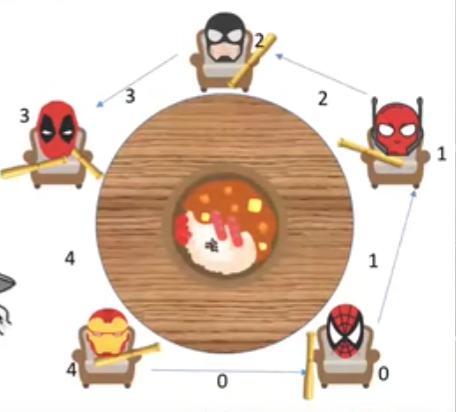

5. 循环等待是死锁的必要不充分条件。==》可能有别的进程有需要的资源。

## 6.2.2 死锁建模

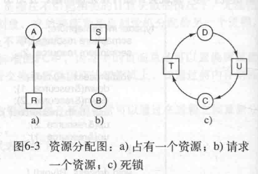

圆形是进程，方形是资源==> 建模图中出现了环路就表示死锁发生。

## 死锁的处理策略

### 策略一：忽略、逃避==》鸵鸟算法==》5年10年才发生一次死锁，工程师可能会选择忽悠

### 策略二：死锁发生后、检测并恢复 detection and recovery

#### 死锁检测

1. 每种类型的资源数量只有一个。

   (1). 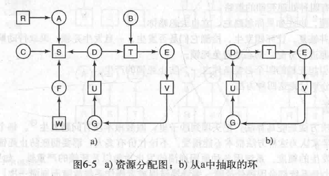

   (2). 检测算法：假设线程和资源加一起共有N个结点，**依次把每个结点作为根节点进行深度优先搜索，看是否形成环路**，如果再任意一轮深度优先搜索中出现了访问过的结点，证明有环。如果全部搜索结束都没有visited过的结点，就没有环。

2. 每种类型的资源有多个数量。

   (1). 数据结构，E是所有资源，共有m种资源类型，矩阵共有n行表示共有n个进程，Cnm矩阵表示第n个进程对第m个资源的占有情况，Rnm是第n个进程想请求第m个资源的情况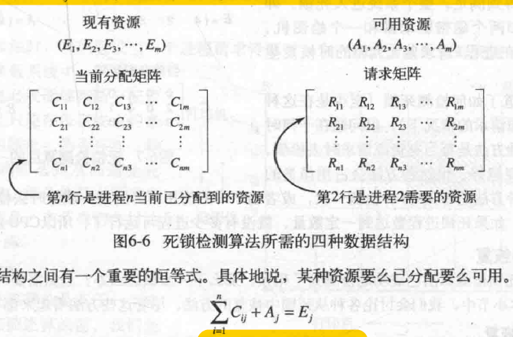

   (2). 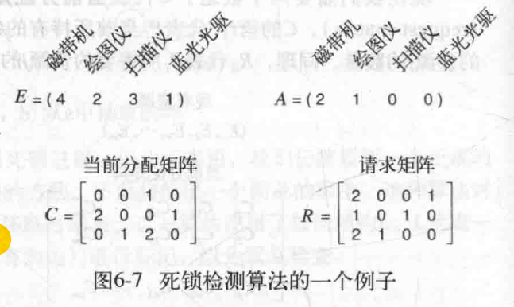检测算法：在R矩阵中查找任意一行A现有资源能满足的进程，如进程3，进程3运行结束之后把自己占有的资源还给A，即矩阵C第三行。依次进行找到所有可运行的进程并标记，**结束后还剩下的进程就是死锁的进程**。

3. 何时进行死锁检测：

   (1). 定时检测，每隔K分钟检测一次。

   (2). 当CPU的使用率降到某一域值时去检测：死锁进程达到一定数量，可运行的进程少、死锁的进程多，CPU空闲。

#### 从死锁中恢复

1. 利用抢占恢复Recovery through Preemption：大多是人工干预，临时将某个资源从它的当前所有者那里强行取走转移给另一个进程，用完之后再送回。

2. 利用回滚恢复Recovery through Rollback：周期性的对进程进行检查点检查（checkpointed），把进程的状态如存储映像、资源使用情况等保存在一个文件中==》当进程执行时会每隔一段时间生成一个检查点文件，积累起来。==》恢复时选择恢复到哪个检查点。

3. 通过杀死进程恢复Recovery through killing rrocesses，最好杀死可以从头开始重新运行且不会带来副作用的进程：

   (1). 方法一：杀掉死锁环中的一个进程，如果其他进程还没恢复就继续杀死环中的其他进程，直至死锁环被打破。

   (2). 方法二：牺牲一个环外的进程（该进程正好持有换种某些进程需要的资源），杀死它以释放资源给环中的进程使用。

### 策略三：避免deadlock avoidance==>通过仔细对资源进行分配，动态地避免死锁（避免方法：银行家算法）

#### 安全状态的概念

1. 避免死锁的主要算法是基于一个安全状态的概念，**资源轨迹图(Resource Trajectories)**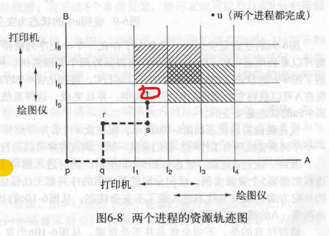以单处理机下运行A、B两个进程的资源轨迹图为例，从p点出发，沿横轴运行表示调度程序选中进程A运行，沿纵轴运行表示调度程序选中进程B运行。进程A运行到I1~I3表示需要获取打印机，运行到I2~I4表示需要获取绘图仪；进程B运行到I4~I7表示需要获取绘图仪，运行到I6~I8表示需要获取打印机==》t点则进程A已经获取了打印机==》**阴影区域表示两个进程同时需要同一种资源，互斥使用的规则决定了不能进入图中任何一个阴影区域，否则会死锁**。==》只能从t点一直横向行走到I4，先让进程A运行完之后释放资源，之后沿任意路线到u点都可以。==》**上图红色部分就是不安全状态**，因为向上、向右都会进入阴影区域。

2. **安全状态**：如果没有发生死锁，并且即使所有进程突然请求对资源的最大需求，仍然存在某种调度次序（**通过系统仔细的调度**）**能让每一个进程运行完毕**，则称该状态是安全的。==》如下图共有10个资源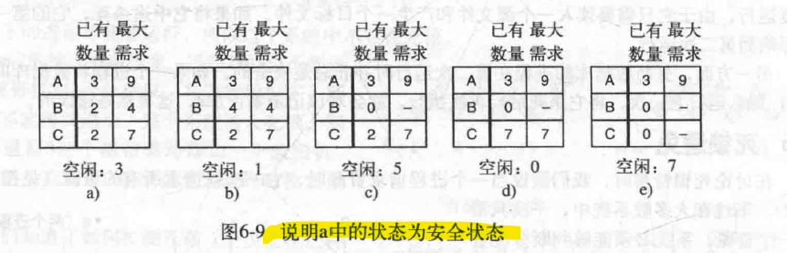

3. **不安全状态**：如果任何分配资源的序列都**无法保证每个进程都运行完毕**，就是不安全状态。**不安装状态不等于死锁**，不安全状态下系统还能运行一段时间，甚至能完成某些进程，如下图b运行至图d。**不安全状态也不一定会引起死锁**，并不是所有进程都需要最大资源。
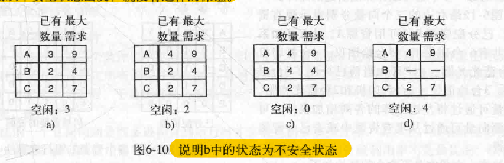

#### 避免死锁的情况一：单个资源的银行家算法the Banker's algorithm for a single resource

1. 银行家算法(Dijkstra提出)：对每一个请求进行检查，**检查满足这一请求之后是否还是安全状态**，如果是就满足该请求，不是就推迟对该请求的满足。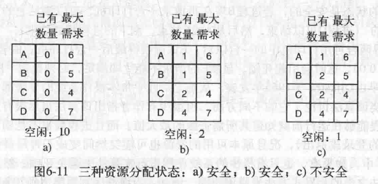检查每个请求的过程==》检查满足该请求之后能够通过仔细的调度让上图每个进程都运行完毕。

#### 避免死锁的情况二： 多个资源的银行家算法the Banker’s algorithm for multiple resources

1. E是总共的资源，P是已分配资源，A是剩余可用资源。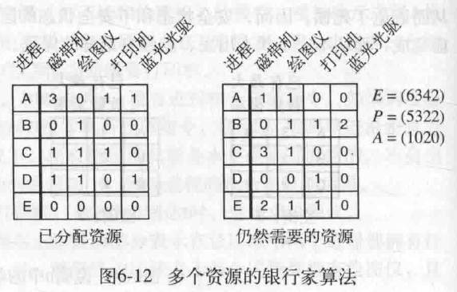对每个请求进行检查：现有资源A能不能满足右边矩阵中任意一行，有就假设它获取资源并运行结束，然后释放所有资源，再找下一个，**如果所有进程都能运行完毕，初始就是安全状态**，所有进程的资源需求都得不到满足就是死锁了。

#### 银行家算法的缺点

1. 缺乏实用价值,即**现实中不可能做到死锁避免deadlock avoidance**：

   (1). 因为很难在进程运行前就知道它所需的最大资源;

   (2). 且进程数也不是固定的、会随着系统运行动态的增加或减少;

   (3). 剩余可用资源的数量也可能会突然变化，如打印机突然坏了。

### 策略四：预防deadlock prevention==>破坏引起死锁的四个必要条件

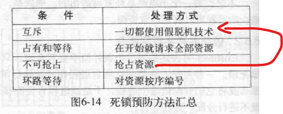

#### 破坏互斥条件

1. **使用假脱机技术把只能互斥资源改造成共享资源**。==> 可以同时答应多个进程的输出请求，但是唯一真正使用物理打印机的进程是打印机守护进程，而打印机守护进程不会请求其他资源，所以不会产生死锁。缺点：不是所有资源都可以这样改造。

#### 破坏占有并等待hold and wait条件

1. 禁止已持有资源的进程再去请求其他资源：

   (1). **静态分配资源** ==> 在进程开始执行之前就分配好进程所需的所有资源，如果资源能够满足进程，进程才能开始运行并且肯定能够运行结束。（**不再动态的分配资源**）==> 缺点：很多进程是在运行过程中才知道自己需要多少资源，且这样资源利用率低。

#### 破坏不可剥夺条件

1. 方法一：当某个进程请求新资源得不到满足时，它必须立刻释放保持的所有资源，待以后需要时重新申请 ==> 那这些资源就可剥夺了。
2. 方法二：当某个进程需要的资源被其他进程所占用的时候，由操作系统协助将该资源强行剥夺。
3. 上述方法实现起来都比较复杂，且释放已保持的资源会造成前一阶段工作的失效，适用于易保存和恢复状态的资源，如CPU。反复的申请和释放资源会增加系统开销。

#### 破坏环路等待条件

1. 消除环路的方法：**给所有资源从小到大编号，所有进程只能请求比自己已经占有的资源编号更大的资源**。==> 被分配到最高编号资源的进程无法请求剩余资源，不会产生死锁。
2. 缺点：不方便增加新的设备，因为需要重新编号。用户编程麻烦。

## 6.7 其他问题

### 6.7.1 两阶段加锁Two-phase locking,2PL

1. 两阶段加锁是一种并发控制协议，用于确保事务在并发执行时能够保持数据库的一致性。
2. 第一阶段，进程尝试对所有所需的记录进行加锁（请求资源），一次锁一个记录，如果发现某个记录已经被加锁，说明该记录已经被其他进程占有了，该进程释放它所有加锁的记录，然后重新开始尝试第一阶段。如果第一阶段成功，就开始第二阶段==>更新数据然后释放锁。==> 本质上就是要在更新之前请求到所有所需要的资源，防止死锁。

### 6.7.2 通信死锁

1. 上述讲述的都是资源死锁，资源死锁是竞争性同步的问题。
2. 通信死锁是协同同步的问题 ==> 处于这种死锁中的进程如果是各自独立执行的，则无法完成服务。
3. 通信死锁的例子：进程A向进程B发送请求信息，然后阻塞直至B回复。如果请求信息丢失了，A就会一直阻塞着等待回复，B就是一直阻塞等待请求，这就死锁了 ==> 符合广义上的每个进程因为等待另外一个进程引发的事件而产生阻塞的定义。
4. 解决办法：超时重传 ==> 计算机网络相关。

### 6.7.3 活锁livelock

1. 两个或多个进程在不断的运行，没有被阻塞，但是因为相互之间的干扰导致进程都无法取得进展。
2. 下图就是活锁，进程A占有资源1并请求资源2，进程B占有资源2并请求资源1，当他们请求资源失败时都会释放自己已经占有的资源，等待一段时间然后再试一次。
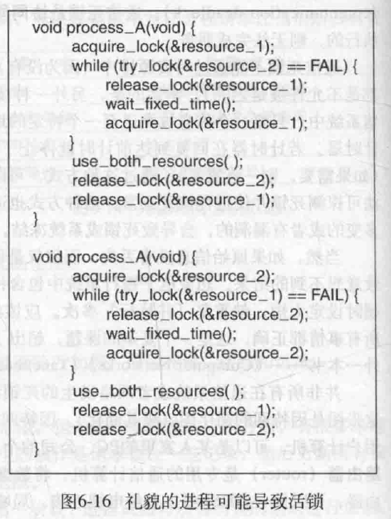
