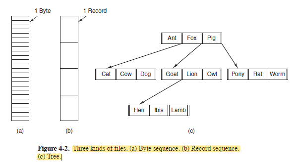
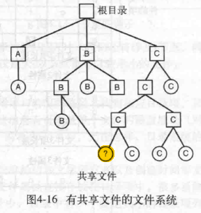
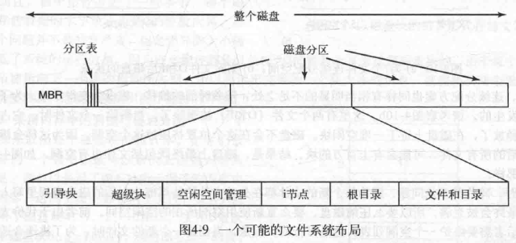
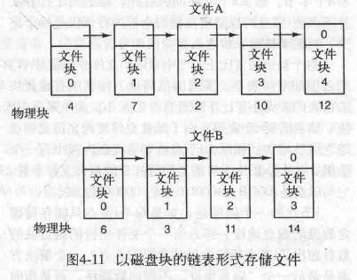
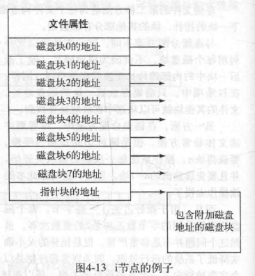
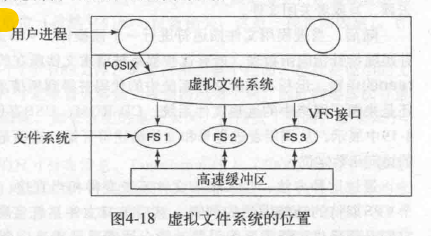

# 第四章 文件系统

1. 长期存储信息有三个基本要求：

   （1）能够存储大量信息；
  
   （2）永久保存，使用数据的进程终止时，数据仍然存在；
  
   （3）**能让多个进程并发访问。**

2. 文件file也是一个抽象概念，是进程创建的信息逻辑单元。

## 4.1 文件

### 4.1.1 文件命名

1. 进程在创建文件时给文件命名。
2. UNIX系统中文件名区分大小写。
3. 文件扩展名file extension，UNIX中文件能有多个扩展名=》homepage.html.zip 被压缩过的html文件。

### 4.1.2 文件结构

1. 三种文件结构：字节序列；记录序列(固定长度的记录record)；tree；

### 4.1.3 文件类型

1. 类型：

 （1）**普通文件**分为：

   （1.1）ASCII文件：能显示和打印，能用文本编辑器进行编辑；

   （1.2）二进制文件：可执行文件一般都是二进制文件。

 （2）**目录**：管理文件系统结构的系统文件。

1. 所有操作系统必须至少能识别他们自己的可执行文件的文件类型。

### 4.1.4 文件访问

1. 顺序访问sequential access：早期操作系统，只能从头按顺序读取文件内容；
2. 随机访问文件random access file：能以任何次序读取其中字节或记录。

### 4.1.5 文件属性file attributes

1. attribute文件属性又叫元数据metadata如 创建日期、创建者、文件大小、创建时间、最后访问时间等。

### 4.1.6 文件操作

1. create;delete;open;close;read;write;append(write的限制形版==》只能在文件末尾添加数据);seek（用来随机访问文件，指定从哪里开始获取数据）;get attributes;set attributes;rename。

## 4.2 目录

### 4.2.1 一级目录系统

1. 根目录下面有一层文件==》简单的嵌入式装置常用。

### 4.2.2 层次目录系统==》目录树

### 4.2.3 路径名Path names

1. 绝对路径名：第一个字符是分隔符；
2. windows中是反斜杠\，在键盘上方；UNIX中是斜杠/在键盘下方：
 (1) windows: \user\ast\mailbox
 (2)UNIX:/user/ast/mailbox

### 4.2.4 目录操作

1. create；delete;opendir;closedir;readir;rename;
2. **硬链接**：
 link(**硬链接**,指定一个存在的文件和一个路径名，通过**指定文件唯一的index节点号**，来建立从该文件到路径所指名字的链接==》**允许在多个目录中出现同一个文件**)；
 unlink(删除链接，如果文件只跟一个目录链接，就删除文件，如果文件存在其他链接，就只删除当前的指定的链接)。

3. **符号链接symbolic link，就是软链接soft link**:**类似于windows中的快捷方式**，创建一个类型为LINK的新文件，**LINK文件指向源文件**，因此只有源文件所在的路径跟序号节点绑定；源文件删除后软链接仍在，但是指向一个无效文件；
4. **软链接能跨越磁盘界限、文件系统，甚至命名远程计算机上的文件，硬链接不可以，因为不同文件系统的索引表是相互独立的，跨系统会冲突和混淆、不知道找的是哪个文件**。

## 4.3 文件系统的实现

### 4.3.1 文件系统布局

1. 每个磁盘的0号扇区是主引导记录master boot record，MBR，后面分区表给出每个分区的起始地址，每个分区是一个独立的文件系统。
2. 每个分区以引导块boot block开始，**引导块中的程序负责装载该分区的操作系统（也可能没有）**，超级块superblock是文件系统的所有关键参数。

### 4.3.2 文件的实现

1. 连续分配：老旧的方式，磁盘碎片浪费空间。
2. 链表分配：充分利用每个磁盘块，但是随机访问速度慢，因为每次都要从链表头节点开始读。

3. 用内存中的表进行链表分配：把链表分配中的指针拿出来放在内存中，形成文件分配表file allocation table，FAT，这样磁盘中所有容量全部用来放数据，而且随机访问不需要引用磁盘了，会快点；缺点磁盘大、FAT表可能会很大。
4. i节点：以文件为本位，表里存一个文件分布在所有磁盘块的地址==》至于对应文件打开时，其i节点才在内存中==》比FAT表小。

### 4.3.3 目录的实现

1. 目录就是映射了文件到对应磁盘块。

### 4.3.5 日志结构文件系统Log-structured file system,LFS

1. 高速缓存的发展很快，磁盘利用率低，导致传统文件系统的读写操作很零碎==》磁盘利用率很低。
2. 把磁盘结构化为一个日志，把需要的写操作先缓冲在内存中，然后周期性地他们作为一个单独的段segment，顺序写入日志尾部。
3. LFS有一个清理线程定期清理日志并进行磁盘压缩。

### 4.3.6 journaling file systems日志文件系统

1. 写出一个日志项（就是某操作的具体内容），把日志项写入磁盘中
，写入之后才能进行操作，都完成之后擦除日志项。==》系统崩溃之后通过查看日志检查未完成的操作。
2. 写入的日志项必须都是idempotent幂等性的==》重复执行操作，每次获得同样的结果。
3. 引入数据库中的原子事务atomic transaction。一组动作要么没开始，要么一起成功完成。

### 4.3.7 UNIX的虚拟文件系统virtual file systems，VFS

1. 把多种文件系统统一成一个有序的结构，抽象出共有的部分，形成虚拟文件系统，对用户进程有一个“上层”接口POSIX可以让用户使用虚拟文件系统，对“下层”有一个VFS接口用来使用真正的文件系统。

## 4.4 文件系统管理和优化

### 4.4.1 磁盘空间管理

1. 文件系统都是按照固定大小的块存储，不是连续存储。==》1）选定合适的块大小；2）用磁盘块链表或者位图来记录空闲块；3）多用户操作系统提供 强制性磁盘配额，每个用户不能超过分给他们的配额。

### 4.4.2 文件系统备份

1. 备份是为了从意外灾难和错误操作中恢复。
2. 只备份特性目录下的文件，不需要备份整个文件系统。

### 4.4.3 文件系统的一致性

1. 出现系统崩溃的情况，重启时要保持文件系统的一致性。
2. 计算机都带有一个实用程序来检验文件系统的一致性：UNIX是fsck，windows是scandisk。
3. 一致性检查包括：

    (1) 块的一致性检查,检查块在文件中出现的次数和空闲表中出现的次数，两个表一核对，如果某个块在两个表里都没有就是块丢失;

    (2) 文件的一致性检查。

### 4.4.4 提高文件系统性能的方法

#### 高速缓存cache：块高速缓存block cache 或 缓存区高速缓存buffer cache

#### 块提前读

1. 需要用到块之前，试图提前把他写入高速缓存，提高高速缓存命中率，如顺序读取的文件，就可以。

#### 减少磁盘臂运动

1. 对于装有磁盘臂的磁盘来说，尽量把顺序访问的块放在一起、同一个柱面，从而减少磁盘臂的移动次数。
2. 现在的固态硬盘SSD没有磁盘臂这种移动部件，它的随机访问顺序和顺序访问顺序差不多了已经。

### 4.4.5 磁盘碎片整理

1. **移动文件让他们相邻，消灭碎片**。==》但是**SSD固态硬盘**不适用，因为没有机械移动部件，SSD的性能不会因为磁盘碎片而降低，因为SSD使用闪存芯片存储数据，其**读写操作不依赖于物理位置**。而且闪存单元的写入次数有限，移动文件带来不必要的磨损SSD。
