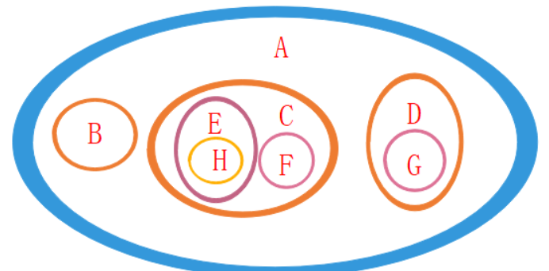
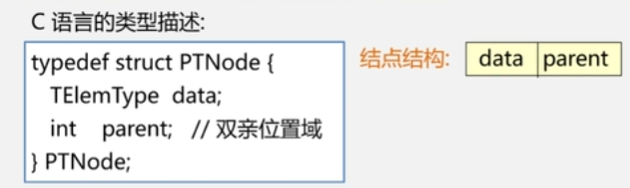
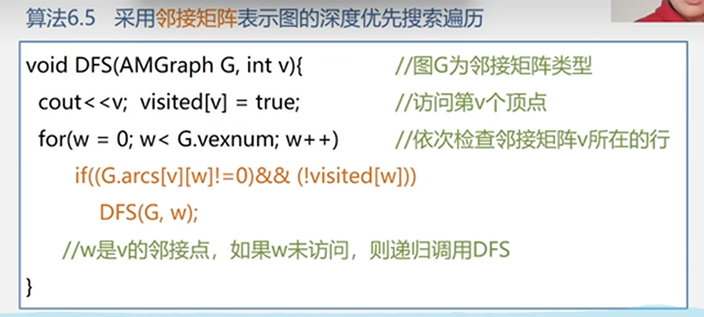
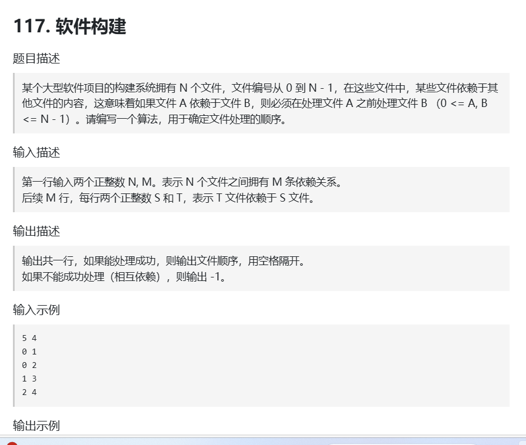
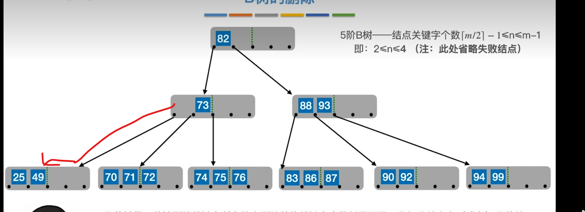
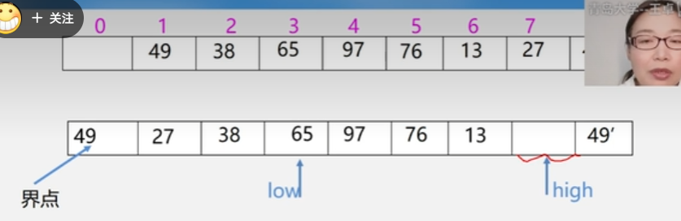

 做算法题注意测试极端例子

# 时间复杂度和空间复杂度

## 时间复杂度

1. 一条语句的重复执行次数称作语句频度。
2. 算法的时间复杂度跟一个算法的所有语句执行的次数之和f(n)是同一数量级的。
   如一个算法所有语句执行之和f(n)=2n^3+n^2+2n+1,则f(n)的数量级是n^3，时间复杂度就是O(n^3)===》因此在计算f(n)的时候要找到循环最里层的语句的执行次数，因为最里层执行次数最多。
3. 一般情况下有几层for循环，时间复杂度就是n的几次方==》有例外，实际还是看每个数据被访问的次数。
4. for(i=1;i<=n;i=i*2){}
   该循环中2^(f(n))<=n,f(n)<=log2为底的n
5. 时间复杂度递增排序：常数阶O(1)、对数阶O(log2n)、线性阶O(n)、线性对数阶O(nlog2n)、平方阶O(n^2)、立方阶O(n^3)、k次方阶O(n^k)、指数阶O(2^n)。
6. 算法的执行时间取决于问题规模和待处理的数据的初始状态==》某些排序数据的初始状态不同会影响执行时间，因此会有最好、最坏和平均的情况，我们给的O(n)都是平均理论评估跟待处理数据的初始状态无关。

## 空间复杂度

1. 计算时需要占用的其他辅助储存空间的数量级。

### 顺序表

1. **线性表的顺序表示==》顺序表**
2. 顺序表是一组连续的内存来存储==》容量有限
3. **顺序表长度为n，访问操作可以通过index直接访问，O(1)**；在i和i+1中间插入，需要把i+1及以后的元素都后移一格；删除第i个元素需要把i+1及之后的元素都前移一格，因此**插入和删除操作都是O(n)**。

### 链表

1. 链表是线性表的链式表示。
2. 物理内存不连续，用指针指引==》**动态扩容但是比顺序表费空间，因为要存指针**。
3. 插入和删除操作在知道元素位置的前提下复杂度是O(1)，因为只要改变指针指向；查找操作是O(n)，需要从头到尾逐个对比。
4. 分类：
   单链表，通常有一个不保存任何值的头节点，尾节点指向null；
   双向链表，一个pre指针，一个next指针；
   循环链表，特殊的单链表，尾节点指向头节点；
   双向循环链表。

### 栈和队列都是线性结构，是操作受限的线性表

### 栈

1. 后进先出LIFO,last in first on， 只能在表尾也称作栈顶进行push和pop操作。表头是栈底。
  
2. 用顺序表实现的栈叫做 顺序栈，用链表实现的栈叫做 链式栈。
3. 插入和删除操作，因为只能在栈顶直接push或pop，时间复杂度为O(1),访问栈中元素，需要把元素上面的其他元素都移出栈，时间复杂度O(n)。

4. # TODO: 栈的应用, 检查符号()是否成对出现/反转字符串/DFS中用栈来保存搜索路径/实现递归/函数调用的“后调用先返回”

### 递归与分治法

1. 递归就是函数的内部又调用函数自身。

2. 分治法就是把复杂的问题分成多个相同或相似的子问题，再把子问题分解到更小的能直接求解的问题，具体步骤：

   （1）分解：将原问题分解为若干规模较小，相互独立，与原问题形式相同的子问题；

   （2）解决：若子问题规模较小而容易被解决则直接解，否则递归地解各个子问题；

   （3）将各子问题的解合并为原问题的解。
3. **递归是分治法的一种。**

```C++
void p(参数)
{
  if（递归结束条件成立）可直接求解；
  else p（较小的参数）；// 归纳项
}
```

4. 某些数据结构本身带有递归特性，如链表，链表的节点LNode由数据和指针next组成，指针next又指向下一个LNode==>指定的里又引用了LNode，所以**链表是一种递归的数据结构。**==》链表问题考虑递归可能会更方便。
5. 汉诺塔，求解f(n)的过程中，不要考虑f(n-1)是怎么解出来的，用就行。

```java
class Solution {
    public void hanota(List<Integer> A, List<Integer> B, List<Integer> C) {
        move(A.size(),A,B,C);
    }

    public void move(Integer n,List<Integer> s, List<Integer> aux, List<Integer> des ) {
        if (n == 1) {
            Integer temp = s.remove(s.size()-1);
            des.add(temp); 
        } else {
            move(n-1,s,des,aux);
            Integer temp = s.remove(s.size()-1);
            des.add(temp); 
            move(n-1,aux,s, des);
        }
    }
}
```

6. **多个函数嵌套调用的时候，按照“后调用先返回的”原则==》栈**，后调用的函数在栈顶，最顶上的函数返回了之后才能执行下面的===》所以递归中不用考虑f(n-1)怎么实现，最终都会化解为f(1)。


7. 函数调用的过程：

    调用前系统完成：

    （1）将实参、返回地址等传递给被调用函数 ==》

    （2）为被调用函数的局部变量分配存储区 ==》

    （3）将控制转移到被调用函数的入口；

    调用后系统完成：

    （1）保存被调用函数的计算结果 ==》

    （2）释放被调用函数的数据区 ==》

    （3）依照被调用函数保存的返回地址将控制转移到调用函数。

8. **递归工作栈：递归程序运行期间使用的数据（上面的实参、返回地址、局部变量等）存储区。**
9. 迷宫问题也用递归==>下一步去哪里==》下一步还是解一个小一圈的迷宫

### 队列

1. Queue先进先出FIFO的线性表；
2. 顺序表实现的是顺序队列；链表实现的队列是链式队列。
3. n个元素的队列，插入和删除操作时O(1),访问操作是O(n)。

#### 顺序队列

1. 顺序队列：空队列时rear==front，添加元素时后移rear，删除元素时也后移front。
2. 
3. 顺序实现的队列有**假溢出**现象：大小为6的队列满了，队头的4个元素出队列，后两个元素在原地不动，此时前面有空位但是无法再在队尾加元素了。


6. **解决假溢出：循环队列**：循环队列的时候队满和空队列front都等于rear，**怎么判断是不是空队列？（TODO还有一种方法）**==》下图d少用一个位置，当rear +1 = front的时候就称之为满了，此时空队列时rear还是等于front。

7. 循环时rear到达尾部时采用**模运算**rear=（rear+1）%n,n是队列最大空间，%是求余数。

#### 链队

1. 链队通常用单链表来表示，增加一个头节点令头指针始终指向头节点。
2. 如下图a，初始化一个空队列，就是一个头节点，front和rear都指向它。


#### 队列基本操作的时间复杂度

1. **双端队列 Deque**，队列的两端都可以进行插入和删除操作,addFirst、addLast、removeFirst、removeLase操作。==》是这么叫，不是正经队列不符合先进先出。

#### 队列的应用

1. 阻塞队列，使用阻塞队列可以很容易实现“生产者-消费者”模型。
2. 线程池中的请求队列。
3. Java中普遍用双端队列Deque来实现栈stack。
4. **广度优先搜索BFS过程中，用队列存储待访问的节点**==》保证按照层次顺序遍历图的节点。

# 第四章 串、数组、广义表

## 4.1 串的定义

1. **串/字符串string是一种内容受限的线性表**，是由零个或多个字符组成的有限序列。==》串的数据对象约束为字符集。
2. 子串：串中任意个连续的字符组成的子序列。
3. 称两个串是相等的，当且仅当这两个串的值相等。
4. 对串的操作通常不是对某个元素，而是以“串的整体”作为操作对象。
5. **串也分顺序存储和链式存储，多采用顺序存储（串的顺序存储效率高、更灵活）**。

### 串的存储结构：顺序存储

6. **串的堆式顺序存储结构**：堆是一个自由存储区，可以为每个新产生的串**动态分配**一块**实际串长**所需的存储空间，若分配成功则返回一个指向起始地址的指针，作为串的基址。==》**新产生的串多大就分配多大的空间**。

### 串的存储结构：链式存储

1. 单链表方式存储串，除头指针外，可附设一个尾指针表示链表中的最后一个结点，并给出当前串的长度==》称这种为块链结构。
2. **链表中的每个节点可以放一个字符，也可以放多个字符**。

### 串的模式匹配/定位运算算法，子串在主串中的位置

#### BF算法

1. 枚举原串 ss 中的每个字符作为「发起点」，每次从原串的「发起点」和匹配串的「首位」开始尝试匹配：
    匹配成功：返回本次匹配的原串「发起点」。
    匹配失败：枚举原串的下一个「发起点」，重新尝试匹配。

2. 字符串的前缀和后缀：

    前缀：对于字符串 abcxxxxefg，我们称 abc 属于 abcxxxxefg 的某个前缀。

    后缀：对于字符串 abcxxxxefg，我们称 efg 属于 abcxxxxefg 的某个后缀。

3. leetcode 第28题

```java
class Solution {
    public int strStr(String s, String t) {
        char[] ss = s.toCharArray(); char [] tt = t.toCharArray();
        int i = 0; int j = 0;

        while(i <ss.length && j < tt.length) {
            if(ss[i] == tt[j]) {
                i++ ;
                j++;
            } else {
                i = i - ( j + 1) +2; // k位的字符串减去自身长度 再加N 得到自身的第N个字符
                j = 0;
            }
        }
        if(j > tt.length -1 ) {
            return (i -1) - tt.length + 1;  // i正确出while循环之后i++对应于匹配项最后一个字符的后面一位
        } else {
            return -1;
        }
    }
}
```

#### KMP算法优化的BF算法，每次i不用回溯，j是next[j]

1. 有相同的前缀后缀，j就推到最大前缀的下一个字母；没有相同的前缀j再回到匹配串的第一位。


### KMP求next[j]数组

```java

class Solution {
    public int strStr(String s, String t) {
        char[] ss = s.toCharArray(); char[] tt = t.toCharArray();
        int i = 0; int j = 0;

        int[] next = getNext(tt);

        while(i <ss.length && j < tt.length) {
            if(j == -1 || ss[i] == tt[j]) { // 因为j变成next[j]可能会是-1 所以改动
                i++ ;
                j++;
            } else {
                j = next[j]; // 对比BF算法改正的地方 i不回溯，j变成next[j]
            }
        }
        if(j > tt.length -1 ) {
            return (i -1) - tt.length + 1;  
        } else {
            return -1;
        }
    }

    public int[] getNext(char[] tt) {
        int i = 0; 
        int j = -1;
        int [] next = new int[tt.length];
        next[0] = -1;  // 跟理论不一样， next[]数组第一位是-1， 其他情况是0；
        while(i < tt.length -1 ) {  // 里面会i++，所以循环条件i不用到达最后一位。
            if(j == -1 || tt[i] == tt [j]) {
                i++ ;
                j++ ;
                next[i] = j;
            } else {
                j = next[j];
            }
        }

        return next; 
    }
}

```

lc 459的KMP模式

## 4.4 数组

### 4.4.1 矩阵的类型定义

1. 数组是有序集合。
2. 一维数组可以看作线性表，还有n维数组。
3. 数组一旦被定义，它的维数和维界就不再改变，适合用顺序存储结构，如果每个元素占的存储单元一样大，计算出任一元素Aij的存储位置的时间都相同===》存取任一元素的时间相等==》**数组是一种随机存储结构**。

### 4.4.3 压缩

1. **压缩存储就是，给值相同的多个元只分配一个存储空间，对零元不分配空间。**
2. 对于对称矩阵、上/下三角矩阵、对角矩阵等可以利用矩阵特性压缩。
3. 对于非零元较少且分布没有规律的**稀疏矩阵**压缩比较复杂。

## 4.5 广义表

1. 广义表一般记作LS=（a1，a2，...an）。ai可以是单个元素也可以是广义表，即广义表的原子或子表。==》广义表是一个递归的概念，广义表中用到广义表。
2. 广义表很灵活，可以兼容线性表、数组、树、有向图等数据结构。

3. 上图D广义表长度为3，((),(e),(a,(b,c,d))),深度为3，有几层括号就是几层深度。
4. A()表示空表。
5. 广义表取表头GetHead(D)=A,取出非空广义表的第一个元素;取表尾是除掉头之外剩下的所有元素组成的广义表，GetTail(D)=(B,C)
6. **广义表采用链式存储结构。**

# 第五章 数和二叉树

1. 树是非线性数据结构。
2. 树是n（n>=0）个结点的有限集，有且仅有一个根节点，同一层次的子树都是互不相交的。
3. 树共有四种表示法：

    树状表示法；

    集合表示法：同一层次的集合互不相交；
    凹入表示法；

    广义表示法。

### 二叉树的定义

1. 二叉树每个结点最多有两颗子树，且有左右之分、次序不能颠倒，子树也都是二叉树。

### 5.4.1 二叉树的性质==>手写笔记

1. 满二叉树（每一层的结点数都达到最大值）。
2. 完全二叉树（除最后一层外其他层的节点数都达到最大值，最后一层是从左往右依次长叶子结点）。  
3. 平衡二叉树（左右两个子树的高度差不超过1，子树也都是平衡二叉树）。
4. 二叉搜索/排序树（左子树**所有结点**小于 根节点， 右子树所有结点大于 根节点，左右子树也是二叉搜索树）。

### 5.4.2 二叉树的存储结构

1. 顺序存储：适合完全二叉树，从根结点开始，从上到下、从左到右的存储。对于不是完全二叉树的，假装它是完全二叉树来存储==》完全二叉树应该有的位置为空，则数组对应位置为空，如下图树状表示法是二叉树顺序存储[A,B,NULL,C,D, NULL, NULL,NULL,NULL,E,F,NULL,NULL,NULL,NULL,NULL,G]。


1. 链式存储结构：

    （1）二叉链表的结点 = 左指针域 + 数据域 + 右指针域；在含有n个结点的二叉链表中有n+1个空链域，即下图(a)红色部分；
    （2）三叉链表的结点 = 左指针域 + 数据域 + 双亲指针域 + 右指针域。


## 5.5 遍历二叉树和线索二叉树

### 5.5.1 递归遍历二叉树 traversing binary tree==》遍历的实质是对二叉树进行线性化的操作

1. 先序遍历（根左右）：**二叉树不为空**则==》访问根结点==》先序**遍历左子树**==》先序遍历右子树；

```java
import java.util.ArrayList;
import java.util.List;

public class Solution {
    public List<Integer> inorderTraversal(TreeNode root) {
        List<Integer> result = new ArrayList<Integer>();

        inorder(root, result);
        return result;
    }

    public void inorder(TreeNode root, List<Integer> result) {
        if(root == null) {
            return;
        } else {
            inorder(root.left, result);
            result.add(root.val);
            inorder(root.right, result);
        }
    }
}
```

1. 中序遍历（左根右）：二叉树不为空则==》中序遍历左子树==》访问根节点==》中序遍历右子树；
2. 后序遍历（左右根）：二叉树不为空则==》后序遍历左子树==》后序遍历右子树==》访问根结点

3. 上述遍历中都用到遍历本身===》二叉树遍历是递归的==》**可以利用栈将任何递归算法改写成非递归算法，因为调用递归函数时是后被调用的函数先返回，符合栈的特性**，（复杂、可读性差==》不常用，了解即可）。

### 相关概念波兰表达式：操作符在哪个位置

1. 表达式的前缀表示：操作符在前面==>波兰表达式；
2. 表达式的中缀表示：操作符在中间；
3. 表达式的后缀表示：操作符在后面==>**逆波兰表达式 Leetcode036，用了栈**。

### 利用循环和栈来模拟递归的非递归遍历

1. 中序遍历：建立一个栈，根节点进栈==》遍历左子树==》根节点出栈，输出根节点并遍历右子树。

```java
public class Solution {
    public List<Integer> inorderTraversal(TreeNode root) {
        List<Integer> result = new ArrayList<Integer>();
        Stack<TreeNode> stack = new Stack<>();
        TreeNode curNode = root;
        while (curNode != null || !stack.isEmpty()) {
            if(curNode != null) { // 根结点不为空就进栈
                stack.push(curNode);
                curNode = curNode.left; // 下一个循环遍历左子树
            } else { // 结点为空说明找到最下层的左子树了
                curNode = stack.pop(); 
                result.add(curNode.val); // 访问根节点
                curNode = curNode.right;  // 遍历右子树
            }
        }
        return result;
    }

}

```

2. 前序遍历：建立一个栈，根节点入栈，输出根节点==》遍历左子树==》根节点出栈，遍历右子树。

```java

public class Solution {
    public List<Integer> preorderTraversal(TreeNode root) {
        List<Integer> result = new ArrayList<Integer>();
        Stack<TreeNode> stack = new Stack<>();
        TreeNode curNode = root;
        while (curNode != null || !stack.isEmpty()) {
            if(curNode != null) {
                stack.push(curNode);
                result.add(curNode.val);  // 只有这一步 什么时候访问根节点这里有区别
                curNode = curNode.left;
            } else {
                curNode = stack.pop();
                curNode = curNode.right;
            }
        }
        return result;
    }

}
```

1. 后序遍历：左右中==》中右左的倒叙==》中右左可以由 前序遍历中左右改变得到。

```java
public class Solution {

        public List<Integer> postorderTraversal(TreeNode root) {
        List<Integer> result = new ArrayList<Integer>();
        Stack<TreeNode> stack = new Stack<>();
        TreeNode curNode = root;
        while (curNode != null || !stack.isEmpty()) {
            if(curNode != null) {
                stack.push(curNode);
                result.add(curNode.val);
                curNode = curNode.right;
            } else {
                curNode = stack.pop();
                curNode = curNode.left;
            }
        }
        return reverse(result);
    }
    public List<Integer> reverse(List<Integer> arr) {
        List<Integer> result = new ArrayList<>();
        for(int i = arr.size() -1 ; i >=0 ; i --) {
            result.add(arr.get(i));
        }
        return result;
    }
}
```

### 用队列实现二叉树的层次遍历 leetcode102已提交

1. 新建队列==》根节点进队 ==》开始循环，循环到队列中没有元素时结束循环==》循环内容：队列中元素**出队**进入result数组，如果它有孩子就把它的左/右孩子**进队**。如下图b出队时把他的孩子cd入队


1. 层次遍历的难点是需要表明遍历结果是哪一层的。

   输入：root = [3,9,20,null,null,15,7]

   输出：[[3],[9,20],[15,7]]

   两种解决方法:

   (1). 结点进队时用Map\<TreeNode, Integer>记录该结点是哪一层的，父节点的层数加一。

   (2). 队列的类型是Queue\<List\<TreeNode>>，按层出队列、按层进队列！

```java
class Solution {
    public List<List<Integer>> levelOrder(TreeNode root) {
        List<List<Integer>> result = new ArrayList<List<Integer>>();
        if(root == null) return result;
        Queue<List<TreeNode>> queue = new LinkedList<List<TreeNode>>();

        List<TreeNode> firstL = new ArrayList<>();
        firstL.add(root);
        queue.offer(firstL);
        while (!queue.isEmpty()) {
            List<TreeNode> currentL = queue.poll();
            List<Integer> currentLVals = new ArrayList<>();
            List<TreeNode> nextL = new ArrayList<>();

            // for循环按层出队列
            for(int i = 0; i< currentL.size(); i++) {
                TreeNode temp = currentL.get(i);
                currentLVals.add(temp.val);
                if(temp.left != null) {
                    nextL.add(temp.left);  // 左右子树的根节点加入到下一层中
                }
                if(temp.right != null) {
                    nextL.add(temp.right);
                }

            }
            result.add(currentLVals);  // 把下一层加入到队列中
            if(!nextL.isEmpty()) {
                queue.offer(nextL);
            }

        }
        return result;
    }

}
```

```java
Queue<TreeNode> queue = new LinkedList<TreeNode>();
queue.offer(firstL);
TreeNode currentL = queue.poll();

queue.add(firstL);
TreeNode currentL = queue.remove();
```

add()在队列满时抛出异常，而offer()返回false。
offer()更适用于需要避免异常的场景。
remove()在队列为空时抛出异常，而poll()返回null。
poll()更适用于需要避免异常的场景。
综上，算法中使用add和remove更好。

### 建立二叉树

1. **二叉树中各节点的值都唯一的前提下**，可以根据**中序遍历和先序遍历** 或者 **中序遍历和后序遍历** 来画出唯一的二叉树。==》先序遍历根节点在最前面，后序遍历根节点在最后面，根据他们取到根节点之后 来分割 中序遍历 得到左子树和右子树==》一直递归得到整棵树。

2. **方法 int[] in = new int[]{1,2,3,5}; int[] subInt = Arrays.copyOfRange(in,0, i);**

```java
class Solution {
    public TreeNode deduceTree(int[] preorder, int[] inorder) {
        return getTree(preorder, inorder);
    }

    public TreeNode getTree(int[] pre, int[] in) {
        TreeNode root = null;
        if(pre.length == 0) {
            return root;
        }
        root = new TreeNode(pre[0]);
        if(pre.length == 1) {
            root.right = null;
            root.left = null;
            return root;
        }

        // 找到左右子树的中序序列和前序序列
        int[] leftInorder = null;
        int[] rightInorder = null;
        int[] leftPre = null;
        int[] rightPre = null;

        for(int i = 0, j =1; i< in.length; i ++) {
            if(Objects.equals(in[i], pre[0])) {
                leftInorder = Arrays.copyOfRange(in,0, i);
                rightInorder = Arrays.copyOfRange(in, i +1, in.length);
                leftPre = Arrays.copyOfRange(pre, 1, i+1);
                rightPre = Arrays.copyOfRange(pre, i+1, pre.length);
                break;
            }
        }

        root.left = getTree(leftPre, leftInorder);

        root.right = getTree(rightPre, rightInorder);

        return root;
    }
}
```

### 复制二叉树：先序遍历，新建一个结点，复制根节点，递归复制左子树和右子树

### 计算二叉树的深度/最大深度

1. 二叉树的深度 = 左右子树中深度较大的那个加1。==》 左右子树的深度 递归来求。

```java
class Solution {
    public int calculateDepth(TreeNode root) {
        if(root == null) {
            return 0;
        }
        int lDepth = calculateDepth(root.left);
        int rDepth = calculateDepth(root.right);
        if(lDepth> rDepth) {
            return lDepth +1;
        } else {
            return rDepth +1;
        }
    }
}
```

### 完全二叉树的深度/满二叉树的深度

1. 不用递归来求，沿着根节点向左边一直数到底，有几个结点就有多深。

```java
    public int countDepth(TreeNode root) {
        int result = 0;
        if(root == null) {
            return result;
        }

        // 完全二叉树的深度只需要数最左边的结点有几个
        while(root != null) {
            result ++;
            root = root.left;
        }
        return result;
    }
```

### 二叉树的结点个数

1. 结点的个数 = 左子树结点的个数 + 右子树结点的个数+ 1；（左右子树结点的个数递归求得）。

### 完全二叉树的结点个数==》利用完全二叉树的子树存在满二叉树的情况来简化，不用完全遍历整颗树

```java
public class Solution {
    public int countNodes(TreeNode root) {
        int result = 0;
        if(root == null) {
            return result;
        }

        int lDepth = countDepth(root.left);
        int rDepth = countDepth(root.right);
        int lNodes = 0;
        int rNodes = 0;
        if(lDepth == rDepth) {
            // 左右子树高度一样，说明最底层已经长到右边去了，左子树是满二叉树
            lNodes = (int) (Math.pow(2,lDepth) -1);
            rNodes = countNodes(root.right);
        } else {
            // 左右子树高度不一样，右子树比左子树少一层，右子树是满二叉树
            rNodes = (int) (Math.pow(2,rDepth)) -1;
            lNodes = countNodes(root.left);
        }

        return  lNodes + rNodes +1;
    }

    public int countDepth(TreeNode root) {
        int result = 0;
        if(root == null) {
            return result;
        }

        // 完全二叉树的深度只需要数最左边的结点有几个
        while(root != null) {
            result ++;
            root = root.left;
        }
        return result;
    }

}
```

### 5.5.2 线索二叉树threaded binary tree==》第一遍遍历时把结点的前驱、后继保存下来，方便下一次遍历

1. 遍历就是把二叉树的结点变成线性序列==》线性序列中每个结点有前驱和后继.
2. **有n个结点的二叉链表中必定有n+1个空链域**==》利用这点存放结点的前驱和后继，来形成**线索二叉树**。==》结点如果没有左子树，就用**左链域存前驱**，如果没有右子树，就用**右链域存后继**。
3. 存的前驱和后继就是 线索，对二叉树以某种次序遍历使其变为线索二叉树的过程叫线索化。==》按照不同顺序遍历二叉树，得到不同的线索二叉树。
4. 遍历之后顺序是abcdsf，a没有前驱，f没有后继，让a的左链域和f的后链域指向头节点，头结点是新增的数据域为空，ltag=0、lchild指向根节点，rtag=1、rchild指向遍历序列最后一个结点f。
5. 存完之后不知道左右指针域lchild和rchild指向的是自己的孩子还是前驱/后继线索==》用ltag和rtag标志，ltag值为0指向孩子，值为1指向前驱；rtag值为0指向孩子，值为1指向后继。结点数据结构如下：


## 5.6 树和森林

1. 树是m（m>=0）颗互不相交的树的集合。

### 5.6.1 树的存储结构

1. 双亲表示法(顺序存储结构)：结点组成一个数组，其中每个结点的结构=数据域+双亲域（数组下标）。==》找双亲容易，找孩子难。
2. 孩子表示法/孩子链表法：结点组成一个数组，其中的每个结点的结构=数据域+自己的第一个孩子结点。每个结点的所有孩子组成一个顺序链，指向下一个孩子结点。

n是结点个数，r是root结点的位置。

2.2. 孩子表示法找孩子容易，找双亲难。

2.3. 带双亲的孩子链表：就是孩子链表中数组中每个结点加一个域指向每个结点的双亲。

1. 孩子兄弟表示法/二叉树表示法/二叉链表表示法：用二叉链表而不是上面的结点数组存储。**二叉链表**中每个结点的两个指针域分别指向**自己的第一个孩子结点**和**自己的下一个兄弟结点**。


上图中，沿着第一个孩子的右指针一路向下，就能找到某结点的所有孩子结点。==》找双亲不好找。

### 树和二叉树的转换

1. 树和二叉树都能用二叉链表表示，同一条二叉链表可以解释成二叉树也可以解释成树。==>**给定一棵树,可以找到唯一的一颗二叉树与之对应**.
2. 树转化成二叉树:**树上的兄弟在二叉树上是右孩子**,**兄弟相连留长子**转化时把树里的兄弟都连线,除左边第一个孩子之外,其他兄弟都跟双亲结点解除关系.

3. 二叉树转化成树:**左孩右右连双亲,去掉原来右孩线**==>某节点是双亲的左孩子,把他的右孩子及右孩子的右孩子都与自己的双亲相连,去掉右孩子之间的线.

### 森林和二叉树的转换

#### 森林转换成二叉树

1. 森林是多个树组成:**树变二叉根相连**

   (1)先把每一个树转换成二叉树;

   (2)二叉树的根结点相连接;

   (3)以第一个二叉树的根节点作为最后的根节点.

1. 因为树变成二叉树之后第一层不会有左孩子,所以上述第(2)步相当于把后面的二叉树变为自己的右孩子.

#### 二叉树转换成森林

1. (1)把根节点的右孩子及右孩子的右孩子都断线;(2)断线后形成的孤立二叉树都转换成树.

### 5.6.3 树与森林的遍历

1. 树会有多个孩子,遍历时分不出是谁"中",所以树的遍历有三种方式:

   (1)先根遍历:先根节点后依次遍历各子树;

   (2)后根遍历:先后根遍历各子树,然后访问根节点;

   (3)层次遍历.

2. 森林的遍历,前提:把森林看作三部分:

   (1)第一棵树的根;

   (2)第一棵树的子树组成的森林;

   (3)剩下的树组成的森林.
3. 森林的先序遍历顺序(1)-(2)-(3):先访问(1),再访问(2)即先根遍历第一棵树,然后先序遍历剩下的森林(3)==>相当于依次从左至右先根遍历每一颗树;
4. 森林的中序遍历顺序(2)-(1)-(3):先访问(2),再访问(1)即后根遍历第一颗树,然后再中序遍历剩下的森林==>依次从左到右后根遍历每一颗树.

## 5.7 哈夫曼树Huffman及其应用

1. if-else判断树,用于描述分类过程的二叉树.数据量大的情况下,先判断是不是最大概率的结果效率更高.


2. 哈夫曼树又称最优树,是**度相同的树**中**带权路径长度最短的树**==>一个结点有几个孩子就有几度,因此二叉树跟二叉树比,三叉树跟三叉树比.

   (1)路径:从树中一个结点到另一个结点之间的分支;

   (2)路径长度:两个结点路径之间的分支数;

   (3)树的路径长度:从根结点到每个结点的路径长度之和;==>**结点数目相同的二叉树之中,完全二叉树是路径长度最短的二叉树,路径长度最短的二叉树不一定是完全二叉树.**

   (4) 权,weight:每个结点的权重,不同的应用场景上对应不同的物理意义;

   (5) 结点的带权路径长度:从根节点到该结点的路径长度L和该结点的权值w的乘积==>L*w;

   (6) 树的带权路径长度WPL:树中所有**叶子结点**的带权路径长度的和.


3. 哈夫曼树中权越大的叶子离根越近.
4. 具有相同带权结点的哈夫曼树不唯一.
5. 贪心算法:选择每一阶段的局部最优,从而达到全局最优.
6. 构造哈夫曼树的算法就是哈夫曼算法==>贪心算法:构造哈夫曼树时首先选择权值小的叶子结点:

   (1) n个结点每个结点给定权值,形成n颗只有根节点的森林;

   (2)取两个根节点权值最小的树a和b组成一颗新的二叉树c,根节点的权值是左右子树的根节点权值的和;

   (3) 原始森林中用c替换a和b;

   (4)重复步骤(2)和(3),直到只有一颗树,就是哈夫曼树.

7. 哈夫曼算法组成的哈夫曼树,原始的n个结点都是叶子结点,构造过程中生成的结点都有左右子树,所以只有度为0和2的结点,没有度为1的结点.===>哈夫曼树有n个度为0的结点,n-1个(n个结点共合并n-1次生成n-1个新的根节点)度为2的结点,共n+n-1个结点.


8. 哈夫曼树的顺序存储结构:一维数组2n-1个元素,双亲表示法,加上weight权重属性.


9.算法实现:

    (1) 首先初始化长度是2n-1的数组,把所有元素的lch,rch,parent设置为0,然后把前n个原始结点的权重赋值.


    (2) 然后开始合并.循环剩下的n+1至2n-1的结点,从parent值是0的结点中选出权重最小的两个,作为其左右孩子设置lch,rch,权重为左右孩子之和;被挑选的作为孩子的parent值设置为当前结点.


### 5.7.3 哈夫曼编码

1. 远程通信中把字符串转换成二进制进行传输.
   (1) 定长的编码方式:每个字母ABCDE都转换成同样长度的二进制数字.==>但是字符串中每个字母出现的频率不一样,有高有底,都一样就造成空间浪费.

   (2) 不定长编码:高频出现的字符编码短一点,低频出现的字符编码可以长一点.==>但是可能出现**重码**,如A是0,B是00,0000可以解释称AAAA/ABA/BB三种方式,有歧义.

   (3)为了解决不定长编码的重码问题,必须使用**前缀编码**:**必须让任一字符的编码都不是另一个字符的前缀**.

2. 哈夫曼编码利用哈夫曼树的特点:权越大的离根节点越近,对应出现频率越多的字符的编码要越短;二叉哈夫曼树的左分支标为0,右分支标为1,从根到叶子结点连接起来形成该叶子结点的字符编码.

3. 哈夫曼编码为什么能保证时前缀编码==>**哈夫曼树的原始结点都是叶子结点,不会被其他叶子结点路过,所以形成的编码不会是其他叶子结点的编码的前缀**!.==>**哈夫曼树的性质1:哈夫曼编码是前缀码**.
4. 哈夫曼编码为什么能保证字符编码总长最短?==>哈夫曼树就是带权路径长度最短的.==>**哈夫曼树性质2:哈夫曼编码是最优前缀码**
5. 哈夫曼编码的算法实现:前提是已经有哈夫曼树了.然后从叶子结点开始往根节点回溯,注意此时编码是逆序的.

    (1) 对从1~n的每个叶子结点找编码,每次把过程编码暂时存放在数组arr中,数组arr的长度是n-1,因为n个结点合并n-1次,形成的哈夫曼树最多n-1层,对应的路径和编码位数最多n-1个.

    (2) 过程(1)中存放数组arr时,需要指针start从数组arr最后一个元素开始,每放一个编码指针向左移一个,从叶子结点回溯到根节点之后复制数组从start到最后一个位置的编码即可,然后释放暂时数组arr,继续找下一个叶子的编码.

    (3) 通过与双亲结点的左孩子和右孩子对比来确定当前位的编码是0还是1.


6. 编码和解码:

   (1)编码:根据字符查哈夫曼编码表;

   (2)解码:**借助哈夫曼树**,依次读二进制码,从根节点开始按照二进制码往左或者往右,直到到达叶子节点.然后从根节点开始解码下一个字符.

# 第六章 图

## 6.1 图的定义和术语

1. 线性结构是一对一,树形结构是一对多,图是多对多.
2. 图的定义:图是顶点和边的集合.顶点集合不能为空,边的集合可以为空.
3. 边带方向是**有向图**,不带是**无向图**;有向图的边又称为弧.

4. **完全图:任意两个点之间都有边相连**;有向完全图任意两个顶点之间都有两条边相连.

5. 稀疏图,边或者弧少于nlogn;稠密图,边/弧很多;**网,边/弧上有权值的图**;**邻接**,两个顶点之间有边/弧相连就是临接.
6. (vi,vj)无向图,vi和vj互相邻接;<vi,vj>有方向的,vi邻接到vj,vj邻接于vi,从vi到vj的.
7. **关联**,表示边/弧与顶点之间的关系,某个边/弧关联与vi和vj.
8. **顶点的度**,与该顶点关联的边的数目,记为TD(v);对应树有几个子结点就有几度;
9. 有向图中的度分为入度ID(v)和出度OD(v)

10. 有向树:只有一个结点的入度为0,其他结点的入度均为1.

11. **路径**:用边/弧相连的多个顶点的序列;**路径长度**:边/弧没有权值就等于边/弧的数量,有权值就是权值之和==>**路径v1 v2 v3的路径长度是2**.
12. **回路**,路径的起点和终点相同,如v1 v2 v3 v1;
13. **简单路径**,除了起点和终点之外的中间段路径上没有重复的顶点;
14. **简单回路**,起点和终点相同的简单路径.
15. **连通图**,任意两个顶点之间都有路径可以到达;
16. **强连通图**,**有向图**中的任意两个顶点之间都有路径可以到达;下图的非强连通图就是因为从v1到达不了v0.

17. 子图

18. **极大连通子图**就是**加一个顶点**就不连通了;
19. 无向图G的**极大连通子图**是G的**连通分量**;
20. 有向图G的**极大强连通子图**是G的**强连通分量**;
21. **极小连通子图**,G的连通子图中**删除任意一条边**,子图就不连通了.
22. G的**生成树**,包含了无向图G的所有顶点的**极小连通子图**;

23. G的**生成森林**,对于非连通图G,组成G的各个连通分量的生成树组成的森岭.

## 6.3 图的类型定义

1. 数据对象V,顶点集合;
  
   数据关系R={VR},
   VR= {<v,w>|v,w属于V且P(v,w)<v,w>表示从v到w的弧，谓词P{(c,w)定义了弧<v,w>的意义或信息}

## 6.4 图的存储结构==》每个结点可能有多个前驱多个后继

1. 数组表示法==》邻接矩阵
2. 链式存储结构==》邻接表、邻接多重表、十字链表

### 6.4.1 邻接矩阵

1. 一个顶点表（记录各个顶点信息）Vexs[n]+ 一个邻接矩阵A.arcs[n][n]（二维数组表示各个顶点之间有没有边/弧，有值是1，没有值是0）


2. 无向图的邻接矩阵是对称的，对角线上都是0；顶点i的度就是第i行/列中1的个数。
3. 完全图上只有对角线上是0，其余值都是1.
4. 有向图的邻接矩阵就不对称。结点i出发的弧对应第i行上的值是1的。
5. 有向图的顶点的出度 = 第i行元素之和。
6. 有向图的顶点的入度 = 第i列元素之和。
7. 有向图顶点的度 = 出度+入度。
8. 网（有权的图）的邻接矩阵，边/弧的权值替代矩阵的1，无穷大替代0。

9. 邻接矩阵的优点：直观、简单、方便看有没有边、顶点多少度。
10. 邻接矩阵的缺点：空间n的平方，如果是边少的稀疏图、浪费空间。

### 6.4.2 邻接表

1. 一维数组中的元素是线性链表，每个链表用来存储每个结点和结点所有的边。头节点包含结点信息data和firstarc指针指向结点的第一条边；表结点中的adjvex是firstarc的边的终结点，nextarc指向data的下一个边，info可以存储边的权值等信息。


2. 无向图中有n个结点，e条边，邻接表需要n个头节点和2e个表结点（一个边会在两端结点的链表中出现两次）。==》比邻接矩阵n的平方节省空间。
3. 有向图n个结点，e条边，需要n+e个结点空间（边有方向不需要出现两次）。
4. 有向图vi结点的出度就是链表中表结点的个数；vi结点的入度要遍历每条链表看有无表结点是vi结点。
5. 也可以给有向图制作逆邻接表==>把弧度终点处的结点作为表头。逆邻接表找入度容易，找出度难。
6. 当邻接表确定后，对应的图是唯一的。
7. 对于确定的无向图，邻接矩阵是唯一的，邻接表不唯一==》邻接表单链中各个元素的顺序不一样。

#### 采用邻接表表示法创建无向网

1. 输入总顶点数和总边数；
2. 用循环建立顶点表（依次输入点的信息存入顶点表中，每个表头结点的指针域初始化为null）；
3. 建立邻接表（很多条保存边和两个顶点的单链表）==》遍历所有边，匹配顶点表找到边对应的结点，把边结点插入到对应顶点的单链表的头部。
4. 邻接表对于稀疏图的空间复杂度好，多用于稀疏图，邻接矩阵多用于稠密图。邻接矩阵空间复杂度n^2，邻接表空间复杂度n+e


#### 有向图的十字链表

1. 就是在邻接表的基础上，头节点上加一个指针域firstin指向入度边链表，对应的弧结点tailvex表示弧尾（远离箭头的一方）tlink指向弧尾相同的胡节点；headvex和hlink是一对，表示弧头和hlink指向弧头相同的胡结点。


#### 无向图的邻接多重表

1. 无向图的邻接表中每条边要被储存两遍==》使用邻接多重表，每条边只出现一次。边界点中主要的是ivex，ilink，jvex，jlink四个域。ilink指向跟ivex连接的下一条边，jlink指向跟jvex连接的下一条边。


## 6.5 图的遍历

1. 图的遍历：从某一顶点出发沿边访问且仅访问一次所有的结点。==》需要辅助数组记录结点是否被访问过。
2. 深度优先搜索遍历Depth first search DFS==》一条道走到黑，当前顶点没有没被访问过的邻接点了，就返回上一个顶点；
3. 广度优先搜索遍历Breadth first search BFS。
4. 连通图的深度优先遍历类似于树的先根遍历。

### 深度优先遍历邻接矩阵表示的图

1. 辅助数组记录顶点是否被访问过。顶点的相邻顶点w如果没被访问过就**递归调用DFS方法**，即从w点继续出发接着深度搜索。
2. G.arcs[v][w]是判断邻接矩阵中w列的点是不是v点的邻接点；
3. visited[w]方法判断某点是否被访问过。



4. 当前顶点没有没被访问过的邻接点了==》当前顶点的DFS方法的调用结束，程序回退到上一个顶点的DFS方法中继续for循环==》递归结束自动回溯。

5. 非连通图的深度优先遍历：先访问完一个连通分量，之后在剩下的没被访问的结点中随便选一个调用DFS递归函数继续遍历。
6. 算法题力扣-岛屿的数量

```java
class Solution {
    public int numIslands(char[][] grid) {
        int result = 0;

        if(grid == null || grid.length == 0 ) {
            return result;
        }
    

        int nr = grid.length;
        int nc = grid[0].length;
        // vistied记录访问过的结点,初始化全部值为0；
        int[][] vistied = new int[nr][nc];
        for(int i =0; i< nr; i++) {
            for(int j = 0;j<nc;j++) {
                vistied[i][j] = 0;
            }
        }

        for(int i = 0; i< nr; i++) {
            for(int j =0; j< nc; j++) {
                // 没被访问过的值为‘1’的点是岛屿的开始
                if(grid[i][j] == '1' && vistied[i][j]!=1) {
                    result++;
                    dfs(grid, i, j, vistied);
                }
            }
        }

        return result;
    }

    void dfs(char[][] grid, int r, int c, int[][] vistied) { // Java方法内的参数，是和外面的vistied对象引用的一个地址，会改变外面对象的值；但是不能改变基本类型数据的参数值。
        vistied[r][c] = 1;
        //如果点上下左右四个点的位置都在图范围内，并且值为‘1’且没被访问过就递归
        int nr = grid.length;
        int nc = grid[0].length;

        if(r-1>=0 && r-1 <nr && grid[r-1][c]=='1' && vistied[r-1][c]!=1) {
            dfs(grid, r-1,c,vistied);
        }

        if(r+1>=0 && r+1 <nr && grid[r+1][c]=='1' && vistied[r+1][c]!=1) {
            dfs(grid, r+1,c,vistied);
        }

        if(c-1>=0 && c-1 <nc && grid[r][c-1]=='1' && vistied[r][c-1]!=1) {
            dfs(grid, r,c-1,vistied);
        }

        if(c+1>=0 && c+1 <nc && grid[r][c+1]=='1' && vistied[r][c+1]!=1) {
            dfs(grid, r,c+1,vistied);
        }
    }
}
```

### 广度优先遍历BFS，也需要辅助数组记录已经被访问过的结点

1. 从某一结点v1出发，访问该结点所有的邻接点v2,v3，然后依次访问v2的所有邻接点，v3的所有邻接点。==》**类似二叉树的层次遍历,访问某结点时把他的所有邻接点/孩子结点入队，该结点出队后继续访问队列中的下一个结点。**
2. 非连通图的广度优先遍历，对一个连通量执行完BFS之后，在剩下的没被访问的结点中选一个开始继续BFS。
3. BFS是使用while循环（只要队列不为空就继续遍历）的，不需要使用递归。


4. leetcode994腐烂的橘子 多源广度优先搜索；

```java
class Solution {
    public int orangesRotting(int[][] grid) {
        int result = 0;
        if(grid==null) {
            return result;
        }
     
        int nr = grid.length;
        int nc = grid[0].length;
        int[][] visited = new int[nr][nc];

        for(int i = 0 ; i< nr; i++) {
            for(int j = 0; j< nc; j++) {
                visited[i][j] = 0;
            }
        }

        //多源BFS，循环把所有烂橘子找出来，在初始化队列时就都放进队列中，标记为已访问
        //难点是记录访问访问了多少层==》用map记录
        Queue<Integer> que = new LinkedList<>();
        Map<Integer,Integer> depth = new HashMap<Integer, Integer>();
        for(int i = 0 ; i< nr; i++) {
            for(int j = 0; j< nc; j++) {
                if(visited[i][j]==0 && grid[i][j] == 2) {
                    int id = i*nc + j;
                    que.add(id);
                    visited[i][j] = 1;
                    depth.put(id,0);
                }
            }
        }

        while(!que.isEmpty()) {
            int id = que.remove();
            int r = id / nc;
            int c = id % nc;

            if(r-1>=0 && r-1 < nr && grid[r-1][c] == 1 && visited [r-1][c] != 1) {
                int nextId = (r-1) *nc + (c);
                que.add(nextId);
                visited [r-1][c] = 1;
                depth.put(nextId, depth.get(id) + 1);
                result = depth.get(nextId);
            }

            if(r+1>=0 && r+1 < nr && grid[r+1][c] == 1 && visited [r+1][c] != 1) {
                int nextId = (r+1) *nc + (c);
                que.add(nextId);
                visited [r+1][c] = 1;
                depth.put(nextId, depth.get(id) + 1);
                result = depth.get(nextId);
            }

            if(c-1>=0 && c-1 < nc && grid[r][c-1] == 1 && visited [r][c-1] != 1) {
                int nextId = (r) *nc + (c-1);
                que.add(nextId);
                visited [r][c-1] = 1;
                depth.put(nextId, depth.get(id) + 1);
                result = depth.get(nextId);
            }

            if(c+1>=0 && c+1 < nc && grid[r][c+1] == 1 && visited [r][c+1] != 1) {
                int nextId = (r) *nc + (c +1 );
                que.add(nextId);
                visited [r][c +1] = 1;
                depth.put(nextId, depth.get(id) + 1);
                result = depth.get(nextId);
            }
        }

        // 所有的连通量同时开始深度优先遍历，返回大于等于0的分钟数；最后遍历grid数组，如果还有没被访问过的新鲜橘子就返回-1，否则返回所有分钟数中最大的数；
        outerLoop:
        for(int i = 0 ; i< nr; i++) {
            for(int j = 0; j< nc; j++) {
                if(grid[i][j]==1 && visited[i][j]==0) {
                    result = -1;
                    break outerLoop;
                }
            }
        }

        return result;

    }
}
```

5. LEETCODE200岛屿的数量 广度优先搜索；

```java
class Solution {
    public int numIslands(char[][] grid) {
        int result = 0;

        if(grid == null || grid.length == 0 ) {
            return result;
        }
    

        int nr = grid.length;
        int nc = grid[0].length;
        // vistied记录访问过的结点,初始化全部值为0；
        int[][] vistied = new int[nr][nc];
        for(int i =0; i< nr; i++) {
            for(int j = 0;j<nc;j++) {
                vistied[i][j] = 0;
            }
        }

        for(int i = 0; i< nr; i++) {
            for(int j =0; j< nc; j++) {
                // 没被访问过的值为‘1’的点是岛屿的开始
                if(grid[i][j] == '1' && vistied[i][j]!=1) {
                    result++; // 找到一个岛屿的开始结果加1；
                    bfs(grid, i, j, vistied); // 岛屿的数量就是进行广度优先搜索的次数
                }
            }
        }

        return result;
    }

    void bfs(char[][] grid, int r, int c, int[][] vistied) {
        int nr = grid.length;
        int nc = grid[0].length;
        // 新建队列
        Queue<Integer> que = new LinkedList<>();

       // r*nr+c  // 结点序号从0开始
        que.offer(r*nc+c);
        vistied[r][c] = 1;  // 结点被放进队列时就是被访问了

        while(!que.isEmpty()) {
            Integer currentP = que.poll();
            int cr = currentP / nc;  // int 类型 有几整个nc；
            int cc = currentP % nc;  // 余几

            if(cr-1>=0 && cr-1 <nr && grid[cr-1][cc]=='1' && vistied[cr-1][cc]!=1) {
                que.offer((cr-1)*nc+cc);
                vistied[cr-1][cc] = 1;
            }

            if(cr+1>=0 && cr+1 <nr && grid[cr+1][cc]=='1' && vistied[cr+1][cc]!=1) {
                que.offer((cr+1)*nc+cc);
                vistied[cr+1][cc] = 1;
            }

            if(cc-1>=0 && cc-1 <nc && grid[cr][cc-1]=='1' && vistied[cr][cc-1]!=1) {
                que.offer(cr*nc+cc-1);
                vistied[cr][cc-1] = 1;
            }

            if(cc+1>=0 && cc+1 <nc && grid[cr][cc+1]=='1' && vistied[cr][cc+1]!=1) {
                que.offer(cr*nc+cc+1);
                vistied[cr][cc+1] = 1;
            }
        }

    
    }
}
```

## 6.6 图的应用

### 最小生成树 Minimum Spanning Tree ==》应用 修路花费最少

1. 生成树：图所有顶点连接在一起但是没有回路存在。
2. 无向图的生成树怎么生成==》遍历一遍，按照遍历顺序把顶点连接起来就行。==》DFS和BFS遍历方法生成的生成树不同，分别是 深度优先生成树和广度优先生成树。
3. **最小生成树**：各边的权值之和最小的那颗生成树。

4. 生成树必须是原图的子图，所以生成树中的顶点和边必须是原图中有的。

**TODO：队列相关的题目不会，多练习**

### MST性质，贪心算法，局部最优达到全局最优

1. 设N = (V,E)是一个连通网，U是顶点集V的一个非空子集。取两个点u和点v，使得边(u,v)满足条件u∈U、v∈V-U并且边的权值最小 ，则必存在一颗包含边(u,v)的最小生成树。

### 利用MST性质构造最小生成树的算法：普里姆Prim算法

1. **选择顶点**。U是已经被选到最小生成树中的点，V-U是剩下的点。需要借助辅助数组**closedge，closedge中存V-U中各个顶点到U中权值最小的边,key是V-U中各个点的id，value是最小边的权值**。先选择一个点放进U，初始化closedge，然后找到closedge中到U距离最小的边，对应的点放进U中，**更新closege**。

2. **ACM模式数据输入和输出、初始化邻接矩阵，背下来**
卡码网53题寻宝<https://kamacoder.com/problempage.php?pid=1053>


```java
    public static void main(String[] args){
        Scanner scanner = new Scanner(System.in);
        int v = scanner.nextInt();
        int e = scanner.nextInt();

        // 初始化邻接矩阵
        int[][] grid = new int[v][v];
        for(int i=0; i<v; i++) {
            Arrays.fill(grid[i], 100000);
        }

        // 读取边的信息并填充邻接矩阵
        for(int i = 0; i<e;i++) {
            int v1= scanner.nextInt();
            int v2 = scanner.nextInt();
            int val = scanner.nextInt();
            grid[v1-1][v2-1] = val;
            grid[v2-1][v1-1] = val;
        }

        // 找权值最小的边，并且边的另一个顶点不在已经被选择的顶点里面
        int result = 0;
        // visited里面存邻接矩阵中顶点的id，从0到v-1,如果被选中就放进去
        Set<Integer> U = new HashSet<>();
        U.add(0); // 将序号为0的顶点作为初始顶点加入U中
        // closedge中存V-U中各个顶点到U中权值最小的边,key是V-U中各个点的id，value是最小边的权值
        Map<Integer, Integer> closedge = new HashMap<>();

        for(int c = 1; c < v; c ++) {
            closedge.put(c,grid[0][c]); // 填入V-U中各点到id=0的点的距离
        }

        while (U.size() < v) {
            Integer idOfMin = getMinPointId(closedge);
            U.add(idOfMin);  // 把idOfMin加进U中
            result = result + closedge.get(idOfMin);
            closedge.remove(idOfMin); // 把已经放进U中的点删除
            // 更新closedge,V-U中的点到idOfMin距离如果更小，就更新
            for(Map.Entry<Integer, Integer> entry : closedge.entrySet()) {
                Integer id = entry.getKey();
                if(grid[id][idOfMin] < entry.getValue()) {
                    entry.setValue(grid[id][idOfMin]);
                }
            }
        }
        
        System.out.println(result);

    }

    private static Integer getMinPointId(Map<Integer, Integer> closedge) {
        int minValue = Integer.MAX_VALUE;
        int minKey = -1;
        for(Map.Entry<Integer, Integer> entry :closedge.entrySet()) {
            if(entry.getValue() < minValue ) {
                minValue = entry.getValue();
                minKey = entry.getKey();
            }
        }

        return minKey;
    }

```

### 利用MST性质构造最小生成树的算法：克鲁斯卡尔Kruskal算法

1. **选择边**。连通网N=(V,E),初始时所有顶点都在T=(V,{})、边集合为空。**在边集合E中选择权值最小的边e，且加入T后不能形成环**。重复上述步骤直到T中所有顶点都在同一连通分量上。

**重点是记录并更新所有顶点所属的连通分量**
卡码网53题寻宝<https://kamacoder.com/problempage.php?pid=1053>

```java
import java.util.*;

class Edge {
    int head;
    int tail;
    int val;

    Edge(int h, int t, int v) {
        this.head = h;
        this.tail = t;
        this.val = v;
    }
}
public class Main {
    public static void main(String[] args){
        Scanner scanner = new Scanner(System.in);
        int v = scanner.nextInt();
        int e = scanner.nextInt();
        List<Edge> edges = new ArrayList<>();
        int[] indexOfT = new int[v]; // 记录顶点id 1~v所属的连通分量

        // 读取边的信息并填充邻接矩阵
        for(int i = 0; i<e;i++) {
            int v1= scanner.nextInt();
            int v2 = scanner.nextInt();
            int val = scanner.nextInt();
            edges.add(new Edge(v1, v2, val));
        }

        int result = 0;

        // 所有的点都在，每次选权值最小的边E加入，但是E的两个顶点必须属于不同的连通分量，这是重点，因此要有辅助数组记录并更新各个顶点所属的连通分量
        // 初始化时所有顶点都属于不同的连通分量。
        for(int i = 0; i< indexOfT.length; i++) {
            indexOfT[i] = i;
        }

        // edges按照权值从小到大排序
        edges.sort(Comparator.comparingInt(edge -> edge.val));

        for(int i = 0; i< edges.size(); i ++) {
            // 按照val值从小到大一个一个找边，两个点不是一个连通分量的就纳入。
            int head  = edges.get(i).head;
            int tail = edges.get(i).tail;

            int headT = indexOfT[head-1];
            int tailT = indexOfT[tail-1];
            if(headT != tailT) {
                result = result + edges.get(i).val;
                // 把跟点tail连通的所有点的连通分量都改成跟head点一样。
                for(int j = 0; j < indexOfT.length; j++) {
                    if(indexOfT[j] == tailT) {
                        indexOfT[j] = headT;
                    }
                }
            }

        }


        System.out.println(result);

    }
}

```

### 比较

1. n^2和e*loge两者的曲线差不多，但是稀疏图是边或者弧比较少的图，适合选择边的算法。


### 最短路径==》有向图，有向图比无向图初始化grid[][]少一句

#### 单源最短路径，求v0到其他各个点的最短路径分别是什么==》用Dijkstra 迪杰斯特拉算法

1. 对于把网中的点分为S和V-S，已经找到从v0到vi的最短路径则把vi放进S中，没找到的还在V-S中。
2. 初始化：把v0放进S中。找出v0点到其他点的直达路径，没有直达路径则记为无穷大。
3. 选择上述路径的最短路径E（**最短路径的终点不在S中，!S.contains(i)**），E的终点是顶点Vk，就找到了从V0到Vk的最短路径，把Vk放进S中。
4. **下一条最短路径的终点x，要么是v0直达x，要么是v0经过vk再到达vx**。更新V-S中所有点（**!S.contains(ii)**）的路径，比较现有路径和以vk作为中转的路径的大小，谁更短就保留谁。
5. 更新之后重复选择步骤，选出下一个vk，直到所有顶点都被放进S。
6. 需要辅助数组,设有n个点：

    (1). 一维数组S[i]、长度为n,表示S集合，记录顶点的最短路径是否已经被找到。

    (2). 一维数组D[i],长度为n，从D[1]开始填充，记录从v0到v1~vn-1各个点目前的最短路径；

    (3). 一维数组Path[i]、长度为n,从Path[1]开始填充，记录到达顶点vi的最短路径上，vi前面那个点。===》通过Path数组可以知道到达所有顶点的路径，如4个点之间的最短路径是0->1—>3->2,则Path=[null,0,3,1],Path[1] = 0。


7. 卡码网47题


```java
public class Main {
    public static void main (String[] args){
        Scanner scanner = new Scanner(System.in);
        int n = scanner.nextInt(); // 定点数
        int m = scanner.nextInt(); // 边数

        // 初始化邻接矩阵
        int[][] grid = new int[n][n];
        for(int i = 0; i< n; i ++) {
            for(int j = 0; j < n ; j++) {
                grid[i][j] = Integer.MAX_VALUE;
            }
        }
        for(int i = 0; i < m; i++) {
            int head = scanner.nextInt();
            int tail = scanner.nextInt();
            int val = scanner.nextInt();
            grid[head-1][tail-1] = val; // 表示从点head-1 到 点tail-1 的距离是 val;
//            grid[tail-1][head-1] = val; 有向图没有这行！!!!!!!!!!!!!!!
        }

        System.out.println(grid);

        // 算法初始化
        Set<Integer> S = new HashSet<>();
        int[] D = new int[n]; // 到v1~vn-1各个点最短路径的路径长度
        int[] Path = new int[n];
        for(int i = 0; i < n; i++) {
            D[i] = grid[0][i];
            if(D[i] < Integer.MAX_VALUE) {
                Path[i] = 0; // 有弧，前驱结点是v0
            } else {
                Path[i] = -1; // 如果v0和vi之间没有弧，前驱结点是-1.
            }
        }
        S.add(0);
        D[0] = 0; // 从源点到源点的距离为0

        // 开始循环n-1次，每次求得到某个点的最短路径
        for(int i = 1; i< n; i++) {
            int indexOfMinD = getIndexOfMinD(D, S);
            if(indexOfMinD > 0 ) {
                S.add(indexOfMinD);
                //更新D
                for(int j = 1; j< n; j++) { // 从点1到点n-1
                    // 看看以点indexOfMinD作为中转路径会不会缩短
                    if(!S.contains(j) && grid[indexOfMinD][j] != Integer.MAX_VALUE && D[indexOfMinD] + grid[indexOfMinD][j] < D[j]  ) {
                        D[j] = D[indexOfMinD] + grid[indexOfMinD][j];
                        Path[j] = indexOfMinD; // 如果缩短了就更新j的路径前驱
                    }
                }


            }


        }

        int result = D[n-1];
        if(result == Integer.MAX_VALUE) {
            result = -1;
        }

        System.out.println(result);


    }

    private static int getIndexOfMinD(int[] D, Set<Integer> S) {
        // 在不在S中的点里面找最小值
        int minD = Integer.MAX_VALUE;
        int index = 0;
        for(int i = 0; i< D.length ; i++) {
            // 在没找到最短路径的点中求最小的
            if( D[i] < minD && !S.contains(i)) {
                index = i;
                minD = D[i];
            }
        }

        return index;
    }    
}
```

#### TODO: Dijkstra算法的堆优化==》用邻接表替代邻接矩阵，选择边而不是点

#### 所有点到其他点的最短路径分别是什么。==》用Floyd弗洛伊德算法

1. 不是单源，是v0到v1~vn-1;v1到v0、v2~vn-1;...vn-1到v0~vn-2。
2. 可以用Dijkstra算法，每次以一个顶点为源点，重复执行Dijkstra算法n次，时间复杂度O(n^3)。
3. 弗洛伊德算法也是O(n^3)。N个点逐个插入D[i][j]中，看点k作为途经点有没有路径更短

4. **Integer>MAX_VALUE相加会溢出得到负值**，所以要加条件判定D[i][k] < Integer.MAX_VALUE

```java
if(k != i && k != j && i != j && D[i][k] < Integer.MAX_VALUE && D[k][j] < Integer.MAX_VALUE && (D[i][k] + D[k][j]) < D[i][j])
```

卡码网97题. 小明逛公园


```java
import java.util.*;

public class Main {
    public static void main(String[] args) {
        Scanner scanner = new Scanner(System.in);
        
        int N = scanner.nextInt(); // N个顶点
        int M = scanner.nextInt(); // M条双向道路
        
        int[][] grid = new int[N+1][N+1]; // 顶点id从1到N；
        int[][] Path = new int[N+1][N+1]; // Path[i][j]表示点i到点j的最短路径上，点j的前驱结点
        int[][] D = new int[N+1][N+1]; // 最短路径
        // 初始化邻接矩阵grid
        for(int i = 1; i <= N ; i++) {
            for(int j = 1; j <= N; j++) {
                grid[i][j] = Integer.MAX_VALUE;
            }
        }
        for(int i = 1; i <=M ; i++) {
            int u = scanner.nextInt();
            int v = scanner.nextInt();
            int w = scanner.nextInt();
            grid[u][v] = w;
            grid[v][u] = w; // 双向道路==>无向图
        }
        
        // 初始化D和Path
        for(int i = 1; i <= N ; i++) {
            for(int j = 1; j <= N; j++) {
                if(i == j) {
                    D[i][j] = 0; // 同一个点之间没有距离
                    Path[i][j] = -1; // 同一个点之间没有弧
                } else {
                    D[i][j] = grid[i][j];
                    Path[i][j] = D[i][j] < Integer.MAX_VALUE ? i : -1;
                }
            }
        }
        
        // N个点逐个插入D[i][j]中，看点k作为途径点有没有路径更短
        for(int k = 1; k<= N; k ++) {
            for(int i = 1; i <= N; i++) {
                for(int j = 1; j <= N; j++) {
                    // !!!!**** Integer>MAX_VALUE相加会溢出得到负值，所以要加条件判定
                    if(k != i && k != j && i != j && D[i][k] < Integer.MAX_VALUE && D[k][j] < Integer.MAX_VALUE && (D[i][k] + D[k][j]) < D[i][j]) {
                        D[i][j] = D[i][k] + D[k][j];
                        // 从i到j点的最短路径的后半段是k到j点的最短路径，所以前驱结点相同。
                        Path[i][j] = Path[k][j];
                    }
                }
            }
        }
        
        
        // 输出结果
        int Q = scanner.nextInt();
        for(int i = 1; i <= Q; i++ ) {
            int start = scanner.nextInt();
            int end = scanner.nextInt();
            int minD = D[start][end] < Integer.MAX_VALUE ? D[start][end] : -1;
            System.out.println(minD);
        }
        
    }
}

```

#### 有向无环图,DAG(Directed Acycline Graph)

1. 有向无环图通常用来描述一个工程或系统的进行过程，如程序流程。
2. AOV网（Activity On Vertex network）,**顶点表示活动**，弧表示活动之间的优先制约关系。==>**解决拓扑排序问题**


3. AOE网（Activity On Edge）,**边/弧表示活动，弧的权值表示活动持续时间**，顶点表示活动的开始或结束事件。==》一般用来解决**工程计划**的**关键路径**问题。
下图v1~v7表示某个事件结束、某个事件开始:

    (1). 入度为0的点是AOE网的**源点**，即v1；

    (2). 出度为0的点是AOE网的**汇点**，即v7。


##### 拓扑排序列：排课表

1. 排课，但是课程之间有先后关系。==》用AOV网，顶点表示课程，边是课程之间的先后关系、即活动之间的优先制约关系。
2. 拓扑排序的定义：在AOV网没有回路的前提下，把AOV网中所有结点排成一个线性序列，且元素在线性序列中的顺序不违背AOV网中结点的优先顺序（有弧度<i,j>存在则i一定在j前面）。这种线性序列被称为拓扑有序序列。
3. 在AOV网中**任选一个没有前驱的结点输出**，并删除以它为尾巴的弧（就是从它出发的弧），重复该步骤直到全部没有前驱的顶点都被选完==》**如果结束之后还有顶点不在拓扑序列中，说明AOV网中存在环**。


4. 因为**任选**，所以一个AOV网中的拓扑序列是不唯一的。

5. 求拓扑序列的算法，**辅助数组用栈或队列都可以**，因为任选一个没有前驱的结点输出即可，拓扑序列不唯一。卡码网题目117：

    (1). 先构建邻接表List<List<Integer>> adjList = new ArrayList<>();

    (2). 辅助数组记录每个点的入度，每次进行删除弧的动作时就把后继结点的入度减一。int[] inDegree = new int[N];

    (3). 入度为0的结点的队列或栈while循环==》while(!stack.isEmpty())



```java
// 拓扑排序不成功则输出-1，成功则输出拓扑排序

import java.util.*;
              
public class Main{                                   
    public static void main(String[] args) {
        Scanner scanner = new Scanner(System.in);
        int N = scanner.nextInt(); // N个点
        int M = scanner.nextInt(); // M个边 
        
        int[] inDegree = new int[N]; // 辅助数组记录每个点的入度
        // 先构建邻接表存储有向图
        List<List<Integer>> adjList = new ArrayList<>(); // S==》很多T
        for(int i = 0; i < N; i++) {
            adjList.add(new ArrayList<Integer>());
        }
        
         
        for(int i=0; i< M; i++) {
            int S = scanner.nextInt();
            int T = scanner.nextInt();
            adjList.get(S).add(T); // 邻接表填值
            
            // 入度
            inDegree[T]++; // int[] 初始值为0；
        }
        
        List<Integer> result = new ArrayList<>(); // 拓扑序列
        
        // 辅助数组，保存入度为0的点
        Stack<Integer> stack = new Stack<>();
        for(int i = 0; i< N; i++) {
            if(inDegree[i] == 0) {
                stack.push(i);
                result.add(i);
            }
        }
        
        while(!stack.isEmpty()) {
            Integer id = stack.pop();
            
            List<Integer> listOfT = adjList.get(id);
            for(int i = 0; i< listOfT.size(); i ++) {
                int indexOfT = listOfT.get(i);
                inDegree[indexOfT]--;
                if(inDegree[indexOfT] == 0) {
                    stack.push(indexOfT);
                    result.add(indexOfT);
                }
            }
        }
        
        if(result.size() < N) {
            System.out.println(-1);
        } else {
            String s = "";
            for(int i = 0; i< result.size(); i++) {
                s = s + result.get(i);
                if (i < result.size() - 1) {
                    s = s + " ";
                }
            }
            System.out.println(s);
        }
        
    }
}
```

##### 关键路径

1. AOE网的关键路径是从源点到汇点**路径长度最长的路径**。

2. 关键路径上的活动叫做**关键活动**，关键活动e的开始时间是固定的，不能移动。即关键活动的最早开始时间e(i)和最晚开始时间l(i)相等。
3. e(i) = ve(j) ; l(i) = vl(k) -W(j,k). i是活动的序号，j和k活动两边结点的序号，W是活动耗费的时间即弧的权。


# 第七章 查找


## 7.1 查找的基本概念

1. 查找表是同一类型的数据元素的集合，元素之间的关系比较松散，没有前驱和后继。
2. 查找的概念：根据给定的某个值，在查找表中确定一个其**关键字**等于给定值的数据元素或（记录）。
3. 主关键字：可以唯一地标识一个记录的关键字是主关键字；次关键字：能标识很多记录的关键字是次关键字。
4. 静态查找表：仅查询；动态查找表，查找之后作“插入”或“删除”操作的查找表。
5. 查找算法的评价指标==》关键字的平均比较次数，也称平均查找长度ASL(Average Search Length)

6. 查找的方法取决于查找表的结构。
7. 在构造查找表时，在集合中的数据元素之间人为地加上某种 确定的约束关系，可能能提高查找效率。

## 7.2 线性表的查找==》适用于静态查找表

### 顺序查找Sequential Search/线性表的查找

1. **对存储结构无要求**，**顺序表或线性链表**表示的静态查找表**都行**；表内元素之间**无序**。


2. 顺序查找算法，下面算法index从1开始，返回0表示没查找到

上述算法每次循环都要比较两次，一次判定i有没有越界，一次判定关键字域相不相等==》改进，表头插入key作为哨兵，从后往前查找，就不用在循环中判定i是否会越界了，因为到哨兵位的时候循环一定会停止。
【算法7.2】


3. 算法7.2效率分析，每个元素的被查找的概率相等。

   时间复杂度：O(n)，ASLs(n) = (1+2+...+n)/n = (n+1)/2

    空间复杂度：O(1)

4. 各个元素的查找概率不相等时如何提高效率==》如从尾往前查找，把查找概率高的放尾部，查找概率低的放头部。

### 二分查找 Binary Search

1. 适用于**有序**表表示的静态查找表,**且仅限于顺序存储结构，链表不行**，因为链表不支持随机访问、没法儿在常数时间内访问mid中间元素。
2. 二分法注意点：

    (1). mid = (low +high) / 2 (**结果向下取整**);以index = mid的元素为界，中间元素的左边是前半区，右边是后半区。让目标值key跟中间值比较，判定目标值在那个区域。

    (2). while循环的条件是**low<=high**，不是<是<=,low==high时还剩最后一个点需要比较。


3. 二分查找的递归算法

```
// 伪代码
int Search_Bin(SSTable ST, keyType key, int low, int high) {
    // 非递归算法中while循环low <= high的条件取反是low > high
    if(low > high) return 0;
    mid = (low + high)/2;
    if(key == ST.elem[mid].key) {
        return mid;
    }
    else if(key < ST.elem[mid].key) {
        //递归,在前半区查找
    }
    else{
        //递归,在后半区查找
    }
}
```

4. 二分查找的**判定树**，根节点是第一个mid结点，左右结点分别是前半区和后边区的mid结点，以此类推。根节点只需要查找一次。


5. 二分查找的效率分析，时间复杂夫O(log2(n))


### 分块查找Blocking Search\索引顺序查找

1. **分块有序**：**要求块间有序，块内无序**。若i<j，第j块中的每个记录的关键字都大于第i块中最大的关键字。
2. 索引表：记录每个结点记录每块的**最大关键字域**，然后指针指向每块的开始结点。
3. 先利用索引表**二分查找**确定目标在哪一块，然后**块内用顺序查找**。
4. 性能分析：Lw块内查找是无序的，用顺序查找法。最终平均查找长度ASL介于顺序查找法和二分法之间，更接近二分法的ASL。


5. 优点：插入和删除时（表会动态变化），只需要在对应的块内做插入和删除，比较快，且**块内是无序的，插入和删除时不需要移动大量元素**。
6. 缺点：需要额外给索引表增加存储空间，并对索引表排序==》所以主表的存储结构可以是顺序表或链表，索引表必须是顺序表。

## 7.3 树表的查找==》适用于动态查找表

1. 线性表中二分法的效率最高，但是不能用链表，所以插入删除操作多时要移动很多元素，效率又会降低了==》需要树表
2. 动态查找表: 二叉排序树、平衡二叉树、红黑树、B-树、B+树、键树。

### 7.3.1 二叉排序树 Binary Sort Tree，BST

1. 又称为二叉搜索树、二叉查找树。
2. **二叉排序树可以是空树**，不是空树时要满足如下性质：

   (1). 若其左子树非空，则左子树上**所有结点**的值均**小于<**根结点的值**；==》中序遍历时前驱结点小于当前结点

   (2). 若其右子树非空，则右子树上**所有结点**的值均**大于>**根节点的值**；==》中序遍历时后继结点大于当前结点

   (3). 左右子树本身也是二叉排序树。


3. 中序遍历非空二叉排序树==》获得一个**递增有序**序列

leetcode98题目 验证二叉搜索树

根据二叉树的性质验证，主要是如何找到在左子树上找到结点的前驱结点、如何在右子树上找到结点的后继结点。

```java
/**
 * Definition for a binary tree node.
 * public class TreeNode {
 *     int val;
 *     TreeNode left;
 *     TreeNode right;
 *     TreeNode() {}
 *     TreeNode(int val) { this.val = val; }
 *     TreeNode(int val, TreeNode left, TreeNode right) {
 *         this.val = val;
 *         this.left = left;
 *         this.right = right;
 *     }
 * }
 */
class Solution {
    public boolean isValidBST(TreeNode root) {
        // ！！！左子树上所有节点都小于root
        //右子树上所有结点都大于！！！
        //并且左右子树也都是二叉搜索树    
        return LDR(root, Long.MIN_VALUE, Long.MAX_VALUE);
    }

    public boolean LDR(TreeNode root, long Lmax, long Rmin) {
        if(root == null) {
            return true;
        }

        //左右子树也都是二叉搜索树    
        boolean leftTree  = LDR(root.left,Lmax , root.val);
        boolean rightTree = LDR(root.right, root.val, Rmin);

        // 根结点大于左子树的最大值==>最大值就是中序遍历时根结点的前驱结点，就是左子树上沿着右边一直向下的结点
        boolean leftTreeVal = false;
        // 寻找前驱结点
        TreeNode preNode = root.left;
        while(preNode != null && preNode.right != null) {
            preNode = preNode.right;
        }
        if(preNode == null || root.val > preNode.val) {
            leftTreeVal = true;
        }

        // 根结点小于右子树的最小值==>就是中序遍历时根结点的后继结点，就是右子树上沿着左边边一直向下的结点
        boolean rightTreeVal = false;
        // 寻找后继结点
        TreeNode nextNode = root.right;
        while(nextNode != null && nextNode.left != null) {
            nextNode = nextNode.left;
        }
        if(nextNode == null || root.val < nextNode.val) {
            rightTreeVal = true;
        }

        return leftTreeVal && rightTreeVal && leftTree && rightTree;

    }
}
```

中序遍历时前驱结点必须比当前结点小

```java
/**
 * Definition for a binary tree node.
 * public class TreeNode {
 *     int val;
 *     TreeNode left;
 *     TreeNode right;
 *     TreeNode() {}
 *     TreeNode(int val) { this.val = val; }
 *     TreeNode(int val, TreeNode left, TreeNode right) {
 *         this.val = val;
 *         this.left = left;
 *         this.right = right;
 *     }
 * }
 */
class Solution {
    public boolean isValidBST(TreeNode root) {
        // ！！！左子树上所有节点都小于root
        //右子树上所有结点都大于！！！
        //并且左右子树也都是二叉搜索树    

        boolean result = false;
        // 直接中序遍历，当前输出的结点必须要大于前驱结点
        double inOrder = -Double.MAX_VALUE;
        Deque<TreeNode> stack = new ArrayDeque<>();
        // 左根右
        TreeNode curNode = root;
        while(curNode != null || !stack.isEmpty()) {
            if(curNode != null) {
                stack.push(curNode); // 根结点入栈
                curNode = curNode.left; // 遍历左子树
            } else {
                curNode = stack.pop(); // 根节点出栈
                int val = curNode.val ; 
                if(inOrder >= val) {
                    return result;
                }
                inOrder = val; 
                curNode = curNode.right; // 遍历右子树

            }
        }

        result = true;
        return result;
    }

}
```

#### 二叉排序树的查找

1. 二叉排序树的存储结构。

2. 二叉排序树的递归查找==》很像二分查找


3. 分析：查找到二叉排序树上某个结点所需要的次数 = 结点所在的层次数；最多的比较次数 = 树的深度。

4. 二叉排序树的平均查找长度**和树的形态有关**，**最优的二叉排序树和二分查找的判定树相同，O(log2(n))**。==》引出平衡二叉树。
5. 单支的二叉排序树是最坏的情况，O(n),跟顺序查找一样。


#### 二叉排序树的插入操作

1. **插入的结点均为叶子结点**==》不需要移动其他结点。
2. 如何进行插入操作：

   (1). 如果二叉排序树为空，则插入的结点就是根节点。

   (2). 如果不为空，则从根节点开始进行查询操作，查询过程中查找到树上已经有该结点，就结束、不再进行插入操作；否则就一直查找，直到某个叶子结点的左孩子或右孩子为空，就把该结点作为这个叶子结点左孩子或者右孩子。

leetcode701题目

```java
/**
 * Definition for a binary tree node.
 * public class TreeNode {
 *     int val;
 *     TreeNode left;
 *     TreeNode right;
 *     TreeNode() {}
 *     TreeNode(int val) { this.val = val; }
 *     TreeNode(int val, TreeNode left, TreeNode right) {
 *         this.val = val;
 *         this.left = left;
 *         this.right = right;
 *     }
 * }
 */
class Solution {
    public TreeNode insertIntoBST(TreeNode root, int val) {
        if(root == null) {
            root =  new TreeNode(val);
        }

        if(val < root.val) {
            // 在左子树
            // 根节点的左孩子，等于插入结点之后生成的新的左子树
            root.left = insertIntoBST(root.left, val);
            //这里如果不给root.left赋值，只是调用insertIntoBST(root.left, val);结果不会改变，因为没有把root结点跟新的左右子树扯上关系
        } else if(val > root.val) {
            // 右子树
            root.right = insertIntoBST(root.right, val);
        } 
        return root;

    }
}
```

#### 根据给定序列生成二叉排序树

1. 第一个结点作为根结点生成二叉排序树，之后的**每个结点都是在树上进行插入操作**==》**每插入一个结点都要从根节点开始搜索**。
2. 一个无序序列可通过构造二叉排序树变成一个有序序列==》构造树的过程就是对无序序列进行排序的过程。
3. 不同插入次序的序列会生成不同形态的二叉排序树。==》ASL不一样


#### 二叉排序树的删除操作

1. 保证

   （1）删除后还是二叉排序树；

   （2）**删除后得到的树的高度不能增加**，因为二叉排序树的高度影响查找效率。

2. (1). 结点是叶子结点，可以直接删除。

   (2). 被删除的结点只有左子树或者只有右子树，直接让它的双亲结点指向它的左子树或者右子树。

   (3). 被删除的结点b既有左子树又有右子树。==》用它的左子树上的最大值（中序遍历时结点b的前驱结点a的值）或者右子树上的最小值（中序遍历时结点b的后继结点c的值）替换它。然后用同样的方法递归删除a结点或c结点。**用哪个替代之后树的高度更小就用哪个**。

3. !!!! mother.right = node.right; 这种属于有修改mother的right属性，能改变原本的树。mother = node.right;这种数据给局部变量mother赋值，改变不了原来的树的结构。

leetcode450题

```java
/**
 * Definition for a binary tree node.
 * public class TreeNode {
 * int val;
 * TreeNode left;
 * TreeNode right;
 * TreeNode() {}
 * TreeNode(int val) { this.val = val; }
 * TreeNode(int val, TreeNode left, TreeNode right) {
 * this.val = val;
 * this.left = left;
 * this.right = right;
 * }
 * }
 */
class Solution {
    class NodeAndMother {
        TreeNode node;
        TreeNode mother;

        NodeAndMother() {
        };

        NodeAndMother(TreeNode node, TreeNode mother) {
            this.node = node;
            this.mother = mother;
        }
    }

    public TreeNode deleteNode(TreeNode root, int key) {
        // 先找到对应结点,且找到node结点的双亲结点f
        // 如果没有返回root
        // 如果有结点node，分几种情况：
        // （1）叶子结点直接删除。
        // （2）只有左子树或右子树，直接用唯一的子树替代node；
        // （3）同时有左子树和右子树，左子树上的前驱结点设为pre, 让node.val = pre.val;然后在左子树上删除pre结点。
        // 在左子树上删除pre结点,因为pre是左子树上最右边的叶子结点，所以pre没有右孩子，左孩子可能有可能没有，属于（1）或（2）的情况

        TreeNode mother = null;
        TreeNode node = root;
        while(node != null) {
            if(node.val == key) {
                break;
            } else if (key < node.val) {
                mother = node;
                node = node.left;
            } else if(key > node.val) {
                mother = node;
                node = node.right;
            }
        }

        if (node == null) {
            // 结点不在树上
            return root;
        }

        // 确定node是mother的左孩子还是右孩子
        boolean isLChild = true; 
        if (mother != null && mother.left != null && mother.left.val == node.val) {
            // 因为节点值唯一，所以可以只对比节点值
            isLChild = true;
        } else if (mother != null && mother.right != null && mother.right.val == node.val) {
            isLChild = false;
        }

        if (node.left == null && node.right == null) {
            // (1)
            if(mother != null && isLChild) {
                mother.left = null;
            } else if (mother != null && !isLChild) {
                mother.right = null;
            } else {
                //node是根节点且是叶子结点
                return null;
            }

        } else if (node.left == null && node.right != null) {
            // (2)

            if(mother != null && isLChild) {
                mother.left = node.right;
            } else if (mother != null && !isLChild) {
                mother.right = node.right;
            } else {
                //node是根节点
                return node.right;
            }
            

        } else if (node.right == null && node.left != null) {
            // (2)
            if(mother != null && isLChild) {
                mother.left = node.left;
            } else if (mother != null && !isLChild) {
                mother.right = node.left;
            } else {
                //node是根节点
                return node.left;
            }

        } else {
            // (3)

            // 找到左子树的前驱结点pre,和前驱结点的双亲结点preM
            TreeNode preM = node;
            TreeNode pre = node.left;
            boolean isPreLChild = true; // pre是preM的左子树
            while (pre != null && pre.right != null) {
                preM = pre;
                pre = pre.right;
                isPreLChild = false; // pre是preM的右子树
            }
            node.val = pre.val;

            if(isPreLChild) {
                preM.left = pre.left;
            } else {
                preM.right = pre.left;
            }

        }

        return root;
    }

    private NodeAndMother findNodeAndMother(TreeNode mother, TreeNode root, int key) {
        NodeAndMother result = new NodeAndMother();
        if (root == null) {
            return new NodeAndMother(null, mother);
        }

        if (root.val == key) {
            result.node = root;
            result.mother = mother;
        } else if (key < root.val) {
            result = findNodeAndMother(root, root.left, key);
        } else {
            result = findNodeAndMother(root, root.right, key);
        }

        return result;
    }
}
```

### 7.3.2 平衡二叉树 balanced binary Tree, 又称AVL树（俄国科学家名字缩写）

1. 一颗平衡二叉树或者是空树，或者是具有以下性质的二叉排序树：

   (1). 左右子树的高度差的不超过1；

   (2). 左右子树也是平衡二叉树。

2. 结点的**平衡因子BF** = 结点的左子树的高度 - 结点的右子树的高度。 ==》平衡二叉树上所有结点的BF只能是-1，0或1.

3. 对于一棵n个结点的AVL树，其高度保持在O(log2(n)),ASL也保持在O(log2(n))量级。

#### 失衡二叉排序树的分析与调整==》往一个平衡二叉树上插入一个结点后不是平衡二叉树了

1. 四种失衡情况：，四种情况对应的调整方案==》先找到失衡结点是哪一个，然后判断是哪种类型的失衡，然后调整==》按照ABC值的大小决定位置，左子树结点<根节点<右子树结点。
2. 如何判断是那种类型的失衡，**找到被插入新结点的子树C**，然后在网上找A和B，对应形态。


上图数字9是C结点，所以是RL型号。


### 红黑树 Red-Black Tree, RBT

1. **二叉搜索树BST的search、insert、delete操作都是O(n)，因为最坏的情况下二叉搜索树会退化成一个链表；平衡二叉树AVL和红黑树RBT的查、插入、删除都是O(log2(n))，因为平衡二叉搜索树的查找操作类似于二分查找是O(log2(n))**。
2. 既然红黑树和平衡二叉树的效率一样，为什么还要发明红黑树？==》**插入/删除等操作容易破坏平衡二叉树的平衡特性**，因此需要频繁调整树的形态，计算结点的平衡因子BF，再进行LL/RR/LR/RL调整。红黑树的插入/删除很多时候不会破坏**红黑**特性，无须频繁调整树的形态，即使有也可以在常数级时间内完成。
3. **应用时，平衡二叉树以查为主，红黑树适用于频繁插入/删除的场景。**
4. 平衡二叉树和B树中的叶子结点跟上面的不一样，指的是失败节点，即null结点，是实际上不存在的结点。上面说的有值的叶子结点在B树中被称为终端节点。

5. 红黑树的**定义**：

   (1). 红黑树是一种特殊的自平衡的二叉排序树。

   (2). **根节点是黑色的**；叶子结点（外部结点、null结点、失败结点）均是黑色；

   (3). 红节点的父节点和孩子节点都是黑色的==》红节点之间不存在路径直接连接；**不红红**

   (4). 对每个结点，**从该结点到任一null结点的简单路径上，所含的黑节点的数目相同**。==》因此结点有黑高bh属性。

```java
struct REnode {  // 红黑树结点的定义
    int key;
    RBnode* parent; // 双亲结点指针
    RBnode* lChild; // 左孩子指针
    RBnode* rChild; //右孩子指针
    int color; //结点颜色，只有两种值

}
```


上图方块的就是null结点

5. 结点的黑高BH==》从某结点出发（不包含该结点）到达任何null结点（包含null结点）的路径上黑结点的总数。

6. 红黑树的性质：

   (1). 从根节点到叶结点的最长路径不大于最短路径的2倍。（最短路径就是一路黑节点，最长路径红结点只能穿插在黑结点之间，最多两倍）。==》**红黑树任何结点的左右子树的高度差不超过2倍，AVL平衡二叉树高度差不超过1，红黑树比AVL更宽松，插入时树的性质更不容易被破坏。**

   (2). 有n个内部节点的红黑树高度h<=2log2(n+1)。

7. 红黑树的查找与二叉排序树一样。

8. 红黑树的插入操作：

   (1). 新结点new为根节点，把新节点的颜色染黑；

   (2). 新节点不是根节点，颜色染红，然后插入。插入之后如果违背了**不红红**的原则，看新节点的叔叔结点的颜色：

    (2-1). 叔叔结点是黑色，先按照LL/RR/LR/RL调整树的姿态，调整前ABC三者最顶层结点和调整后ABC三者最顶层的结点，这两个结点都进行染色（结点node染色指的即 node.color = ! node.color ）。==》判断属于有LL/RR/LR/RL哪种类型的时候，把新插入的结点看作下图C结点，B结点是父亲结点、A结点是爷爷结点。


   (2-2). 叔叔结点是红色，把叔叔结点、父亲结点、爷爷结点三个都染色，然后**把爷爷结点看作新插入的结点递归调整**。


9. 根节点的黑高是h，内部结点数量最少的情况是都是黑结点，没有红节点的满二叉树，黑高是h的全黑满二叉树高度是h，结点有(2^h)-1个。==》推出性质2


10. 红黑树的删除：删除操作的时间复杂度O(log2(n))，先按照**二叉排序树的删除操作**删除结点，删除后如果破坏红黑树的特性，就调整树的姿态和颜色。

### B树，Balance-tree，多路平衡查找树

1. 取整符号：向上取整⌈m⌉、向下取整⌊n⌋。
2. 二叉树是通过一个mid值把区域分为左右两部分，B树就是m叉树，m叉树被称为**m阶B树**。==》同样多的数字m叉树的高度比二叉树小，所以查找效率更快。
3. B树的定义,一颗m阶B树或为空树，或是满足以下特性的m叉树：

   (1). 树中每个结点至多有m棵子树；

   (2). 对于任一结点，**所有子树的高度都相同**，B树是**绝对平衡**的==》**根节点如果不是叶子结点，则最少有两棵子树，一棵的话不平衡**。而且所有的叶子结点（null结点）都在同一层次上。

   (3). 除根节点之外的所有结点，至少有（m/2）向上取整个子树（充分使用m叉树保证效率），节点关键字的个数是子树的个数减1。

   (4). 结点内部关键字是**有序**的，非终端节点（就是有子树的节点）的结构如下：
   

帮助理解


4. 核心特性(记这个简单)

5. 有n个关键字的m阶B树，求它的最小高度、最大高度：

   (1). 最小高度，则每个节点尽可能填满，每个节点最多(m-1)个关键字，如果有h层，则

   (2). 最大高度：


6. B树结点类型定义：（看不懂）

```c
typedef struct BTNode {
    int keynum;   // 结点中关键字的个数，即结点的大小
    struct BTNode *parent; // 指向双亲结点
    KeyType K[m+1] // 关键字向量；
    struct BTNode *ptr[m+1]; // 子树指针向量
    Record *recptr[m+1]; // 记录指针向量
}BTNode, *BTree; // B树结点和B树类型

```

#### B树的查找

1. m阶B树每个节点的关键字序号从1~m-1,指针序号从0到m-1。将目标值key与根节点的各个关键字K1~Kj(1<=j<=m-1)进行比较，可以顺序查找也可以折半查找，查找时：key = Kj则查找成功，key<Kj,则顺着指针P(j-1)指向所在的子树继续查找；若key>Kj,则顺着Pj指向的子树继续查找，找到null节点都没找到就查找失败。

#### B树的插入

1. 插入关键字时先在**最底层的合适的非终端结点**中添加一个关键字。插入之后该结点的关键字个数超过m-1个了变成m个了，就以中间关键字（第m/2向上取整个）为界把结点一分为二，左边的在原结点不变，**中间结点向上插入到双亲结点中**，右边的形成一个新结点。==》中间结点向上插入到双亲结点中，本身也是一个插入操作，也可能使双亲结点关键字超出，递归的执行。


#### B树的删除

1. 如果删除的是终端结点上的关键字，则直接删除，如果删除的是非终端节点上的关键字，用当前关键字的**直接前驱**或者直接后继替换当前关键字**==》就是当前结点的左子树**最下层**结点中最右边的关键字，或者的当前结点的右子树**最下层**结点中最左边的关键字。相当于删除的是终端结点。


2. 删除终端结点有三种情况：

   (1). 删除后当前结点的关键字个数仍满足⌈m/2⌉，则直接删除关键字Ki和结点右侧的指针Pi。

   (2). 删除后当前结点的关键字个数不够了，但是它**相邻的兄弟够借**，如右兄弟，就用当前结点和右兄弟之间夹着的双亲结点关键字parent替代当前结点，用右兄弟结点的最小值替代parent==》即被删除结点的**直接后继和直接后继的后继**关键字往前移动一个位置，或**直接前驱和直接前驱的前驱**关键字往后移动一个位置。




   (3). 自己不够，相邻兄弟结点的也不够，就把**当前结点 + 不够的兄弟结点 + 他们的之间的双亲结点的那个关键字合并**到当前结点。如果导致双亲结点关键字个数不够，就继续借或者继续合并。

### B+树

1. 类似分块查找，

   (1). 可以把所有的**非终端结点**看成**是索引**;

   (2). 非终端结点（上图蓝色的）**关键字的个数 = 子树的个数**，每个关键字用于**保存**它子树的根节点中**最大的关键字**，指针指向子树根节点。

   (3). 上图绿色的是终端结点，所有的**终端结点包含所有关键字**以及**指向相应记录的指针**，并且**所有关键字按照顺序排列**，**相邻的终端结点按照顺序相互链接**==》**支持顺序查找**，其实已经不符合树的定义了。

2. 一棵m阶的B+树：

   (1). 每个分支结点最多有m棵子树。

   (2). **非叶根节点至少有两棵子树，其他每个分支结点至少有⌈m/2⌉棵子树**。

3. B+树最下层的**关键字会重复出现在上层中**。

4. B+树适用于文件索引系统，非终端结点都是索引，终端结点只是用来保存指向记录的指针，而**不是需要的记录本身**。

#### B+树的查找

1. 查找路径如图所示，每次都要从根节点一直走到终端结点。

2. 而且能查找某个范围内的关键字，如[a,b]，先找到a在终端结点的位置，然后沿着终端结点之间的链接p顺序查找，一直到b。

#### B+树为什么适合文件处理，对比B树

1. 在操作系统的文件系统中，**B+树和B树中的结点实际上都保存在磁盘中的块中**，不在内存中，操作系统**在磁盘中读取数据比较慢**，**查找操作需要不断在磁盘和内存中切换**，树的结点越多、层数越大，访问磁盘的次数就越多。B树中的结点关键字就是记录本身，而**B+树中结点因为只作为索引不保存记录本身，所以同一个大小的磁盘块，能放更多B+树中的关键字，B+树的结点个树和层数就更少，读取文件更快速**。
2. 典型应用：关系型数据库的“索引”，如MySQL。

## 7.4 散列表Hash Table的查找

1. **散列方法**的基本思想：记录的存储位置与关键字key之间存在对应关系==》通过**哈希函数/散列函数**Hash进行转换，Loc(i) = H(key(i))。

2. 上述方法形成的表叫**散列表**。
3. **冲突collision/哈希碰撞**：不同的关键字key映射到同一个散列地址。即key1 != key2, 但是H(key1) = H(key2)。
4. **同义词**：具有相同函数值H(key)的多个关键字key。
5. 查找的时候直接带入哈希函数Loc(i) = H(key(i))得到位置，**优点查找效率高O(1)，缺点空间效率低（上图很多空间空着）**。==》**用空间换时间**
6. 装填因子α = 表中记录数/散列表长度。
7. 在散列查找方法中，冲突是不可能避免的（数据量大的时候），只能尽可能减少。
8. 使用散列查找法要解决的两个问题：

   一、**构造好的散列函数**：

   (1). 所选**函数尽可能简单**，以便提高转换速度，每一个关键字只能有一个散列地址与之对应；

   (2). 所选函数按照关键码计算出的**散列地址要分布均匀**，以减少空间的浪费。

   二、制定好的**处理冲突**的方案

leetcode 第一题，两数之和

### 7.4.2 散列函数的构造方法

1. 构造散列函数要考虑的因素：

   (1). 函数执行速度；

   (2). 关键字的长度；

   (3). 散列表的大小（太大浪费空间，太小容易冲突）；

   (4). 关键字的分布情况（更均匀）；

   (5). 查找频率（让经常用到的更容易查找到）；

2. 希望散列的地址空间尽量小，尽量均匀。
3. 构造散列函数的常用方法：

    (1). 直接定址法：Hash(key) = a*key + b (a,b为常数)。适合关键字的分布基本连续的情况。

    优点：以关键码key的**线性函数**值为散列地址，线性函数是一一对应的，所以**不会产生冲突**。

    缺点：要**占用连续的地址空间，空间效率低**。

    (2). 除留余数法：Hash(key) = key mod p。p是整数，表长为m（表长是要存的关键字的数量），取p是不大于m但是最接近m的质数。如key是61，取p是质数7，61除以7等于8余5，存在5的位置。

    为什么p要是质数？用质数取模，分布更均匀，冲突更少（《数论》）。

    (3). 数字分析法：关键字长度为n，如手机号码11位，数码在各个位置上出现的频率不一样，前面一般都是138等不均匀，后四位每种数码出现的更均匀==》**选取数码分布较均匀的若干位作为散列地址**。

    (4). 平方取中法：取关键字的**平方值的中间几位**作为散列地址。适用于关键字本身分布不均匀，或者每位都小于散列地址所需的位数的情况。如下图左边关键字本身分布不均匀的情况，**平方计算结果显示中间的几位和关键字的每一位都有关系**，这样又关联又均匀：


### 7.4.3 处理冲突的方法

#### 开放定址法（开地址法）

1. 有冲突时就去找一个空的散列地址。通常把寻找下一个空位的过程称为**探测**。
   Hi = (H(key) + di) % m, i = 1,2,...,k(k<=m-1)。H(key)是散列函数，m是散列表的表长，**di是增量序列**
2. 根据不同增量序列di分为以下三种探测方法：
   
   只有物理过程中产生的才是真随机数，靠算法生成的都是伪随机数。线性探测法的例子：注意29存到了8的位置，按理来说8这里只能存30的同义词，29应该存在7的位置，29不是30的同义词但是还是存在了8的位置==》**开放定址法的开放指的是散列表中的某个位置既能存同义词也能存非同义词**。


    二次探测法/平方探测法就是先去下一个位置找，再去前一个位置找。   

3. 线性探测法容易造成同义词、非同义词的**二次聚集/堆积**现象，因为发生冲突后再探测是沿着一个连续的位置往后放，这附近的同义词和非同义词都在争夺这块位置。严重影响查找效率==》找不到就沿着连续的位置一直往下找。
4. 二次/平方探测法要求：散列表的长度m必须是一个可以表示成4*j + 3的素数，才能探测到所有位置（《数论》）。

#### 链地址法（拉链法）

1. 同义词放在一个单链表中，形成一个动态结构。查找时先根据散列函数找到链表头，然后在链表上顺序查找，所以冲突越多链表就越长，ASL就越大。
2. 插入时保持单链表是有序列表，能提高查找效率。
3. Java里的HashMap、HashSet就是用拉链法。
4. 优点：（1）拉链法不会有**聚集现象**;（2）链表上的结点空间是动态申请的，更适合表长不确定的情况。

#### 再散列法（双散列函数法）

1. 多准备几个散列函数，冲突时用下一个散列函数计算一个新地址。

#### 建立一个公共溢出区

### 7.4.4 散列表的查找

1. 首次根据散列函数找到的关键字和目标值不一样，就通过处理冲突的方法查找下一个位置，如果一直找到空地址都匹配不上就查找失败。

2. 散列表查找的ASL取决于：散列函数、处理冲突的方法、散列表的装填因子α（α越大，表装的越满，发生冲突的可能性越大，查找次数增加，ASL增加）。


3. 链地址法优于开放地址法，除留余数法作散列函数优于其他类型函数。

# 第八章 排序

1. 排序：将无序序列排成一个有序序列的运算。

## 排序方法的分类

1. 按存储介质可分为：

   (1). 内部排序：数据量不大，在内存中排序；

   (2). 外部排序：数据量较大，需要用外存，排序时把数据分批调入内存来排序，中间结果还要及时放入外存。==》复杂

2. 按比较器的个数来分：

    (1). 串行排序：单处理机（同一时刻比较一对元素）；

    (2). 并行排序： 多处理机（同一时刻比较多对元素）。

3. 按主要操作分：

   (1). 比较排序：根据比较的方法可分插入排序、交换排序、选择排序、归并排序。

   (2). 基数排序：**不比较元素的大小**，仅根据元素本身的取值确定其有序位置。

4. 按辅助空间可分为：

   (1). 原地排序：辅助空间用量为O(1)的排序方法；

   (2). 非原地排序：辅助空间用量超过O(1)的排序方法。

5. 按稳定性可分为：

    (1). 稳定排序：值相等的元素，排序前后的相对次序不变。
    (2). 非稳定排序：值相等的元素，排序前后的相对次序变化。

稳定排序只对于结构类型的数据排序有意义，且不能用来衡量一个排序算法是否优劣。

6. 按自然性分类：

    (1). 自然排序：输入的数据越有序，排序的速度越快的排序方法。

    (2). 非自然排序：不是自然排序的方法。


## 记录的存储结构


### 8.2 插入排序

1. 插入排序的基本思想：每步将一个待排序的对象，按照他关键码的大小，插入到前面已经排好序的一组对象的适当位置，直到全部对象全部插入为止。==》边插入边排序，在有序序列中插入，插入后得到的子序列还是有序的==》类似玩扑克抓牌的过程

2. 确定插入位置的方法不同，插入排序可以分为三种：

### 8.2.1 直接插入排序（稳定排序）


1. 一个无序的序列，开始是全橙色的，插入排序进行到一半后index <= i-1的绿色部分是排好序的，index >= i的黄色部分是还没被插入排序的。index = i的元素是当前正在被插入的元素。

2. 直接插入排序的过程中**使用哨兵**


3. 直接插入排序算法：

   (1). 从无序序列的第二个元素开始循环执行插入操作。
   (2). if条件是，如果当前元素比前面的有序子序列最后一个元素小，说明当前元素的位置应该在子序列的中间，才需要插入；否则直接i++。
   (3). 确定插入位置的内层for循环中使用哨兵(算法题也可以不使用哨兵，灵活点)。
   

4. 性能分析，分析**比较次数和移动次数**：

    (1). 最好的情况，本来就排好序的，每个元素只需要比较一次，移动O次。

    (2). 最坏的情况，序列是逆序的，每次需要把元素插入到最前面,O(n^2)。

    (3). 平均情况耗时是最坏情况的一半，也是O(n^2)。

    (4). 空间复杂度O(1)==>用了哨兵。

### 8.2.2 折半插入排序（稳定排序）

1. 用二分法查找插入位置：

   (1). **while循环结束后high + 1是插入位置**。

   (2). 找到插入位置后还需要把插入位置后面到i-1的元素后移一格，空出插入位置。

2. 比较次数分析：

    (1). **折半插入法比较的次数跟**待排序**序列的初始顺序无关**，只跟元素的个数有关。

    (2). n比较大的时候，折半插入排序比较次数介于 直接插入排序最好和最坏的情况之间。

    (3). 初始序列接近有序的时候，用直接插入法比折半插入法好。

3. 移动次数分析：跟直接插入法一样，依赖于初始序列的有序情况。
4. 跟直接插入法比：减少了比较次数，没有减少移动次数，平均性能优于直接插入排序。

### 8.2.3 希尔排序（不稳定排序）

1. Donald.L.Shell发明的
2. 希尔排序的基本思想：**把整个待排记录序列分割成若干子序列，分别进行直接插入排序，使得整个序列"基本有序"后，再对全体记录进行一次直接插入排序**。
3. 希尔排序的步骤和特点：

   (1). 定义一个递减的增量序列Dk，如D3 = 5，D2 = 3，D1 = 1，**增量序列要互质**。

   (2). 根据间隔Di挑选除同组的元素划分成子序列，即下图中同一个颜色的元素作为一个组进行希尔排序，几间隔就有几个颜色就分成几个子序列。全部 ==》每次**移动的位置大，跳跃式的接近排序后的最终位置**。

   (3). 完成5-间隔之后继续3-间隔，直到1-间隔即对所有元素进行一次直接插入排序，此时**共进行了5+3+1共9遍直接插入排序**，又称“缩小增量排序”(Diminishing Increment Sort)。

   (4). 最后一次直接插入排序的时候，整个序列已经**基本有序**了，此时只需要少量的移动了。

4. 希尔排序的算法：t是增量序列的长度，ShellInsert插入排序就是直接排序，只不过i++，i--变成i+Dk,i-Dk。

5. 希尔排序算法效率分析:与增量序列的取值有关。
6. 空间复杂度O(1),不适合在链式存储结构上实现。

## 8.3 交换排序

1. 基本思想：两两比较，如果是逆序的就交换两者，直到所有记录都排好为止。

### 8.3.1 冒泡排序（稳定排序）

1. 每趟不断将记录两两比较，并按照“前小后大”规则交换。
2. 两两比较。每一趟都把最大值交换到队尾，**n个元素共需要n-1趟**。每一趟都增加一个有序元素，下一趟在剩下的元素中进行。**第m趟内部需要两两比较的次数是n-m**。

3. 下面算法是从index = 1开始的 

4. 每趟结束时，不仅在把最大值挤出到最后面的位置的过程中，能够同时部分理顺其他元素。

5. 改进的冒牌排序：一旦某一趟比较时没有出现记录的交换，说明已经排好序了，后面的几趟不用再执行了。==》算法增加flag标志记录上一趟里有没有发生交换。

6. 冒泡排序算法分析：

### 8.3.2 快速排序（不稳定排序）

1. 基本思想：

   (1). 任取一个元素（通常是第一个元素）作为中心pivot；

   (2). 所有比中心小的元素放在它的左边，比中心大的元素放在它的右边，形成左右两个子表；

   (3). 对子表递归快速排序，**直到每个子表的长度都为1**。

2. 重点是第(2)步，把元素分放到中心点左右的过程怎么实现==>表长加1用来暂时存放中心点，此时index = 1位置空出。设置双指针，low用来查找大的元素，high用来找到小的元素。初始时左边有空位，因此high指针指向的元素先跟中心点比较，如果比中心点小就把元素移动到左边空位low的位置，low++此时high空位了，因此用low找大于中心点的元素，搬去high的位置


直到low == high，这就是中心点应该在的位置
==》采用**从两头向中间交替式逼近法**

3. 算法Partition就是第(2)步。下图第二个while循环用来找到high指针指向的比中心点小的，第三个while循环用来找到low指针指向的比中心点大的。

4. 快速排序的算法分析

   (1). 时间复杂度（快速排序是我们讨论的所有内排序中最快的一个）：

   (2). 空间复杂度：**快速排序不是原地排序，因为用了递归，递归需要栈的支持，栈的长度取决于递归调用的深度**，平均情况下快速排序要用O(logn)的栈空间，最坏情况下栈空间可达O(n)。

   (3). 是不稳定排序。

   (4). 不是自然排序，并不是序列越有序找的越快。如果一个有序序列取第一个元素作为中心，一趟快排之后一个子表为空，一个子表有全部值==》**快速排序退化成冒泡排序了**。快排是次序越乱越随机越好。

leetcode 第215题 快速选择==》重要是**随机化选取中心点防止极端案例**

```java
import java.util.*;
class Solution {
    private final static Random random = new Random(System.currentTimeMillis());
    public int findKthLargest(int[] nums, int k) {
        return findKthLargest(nums, k, 0, nums.length - 1);
    }

    private int findKthLargest(int[] nums, int k, int low, int high) {
        int result = nums[0]; 
        if(nums.length == 1 && k == 1) {
            return nums[0];
        }

        //快速排序
        int pivotLoc = Partition(nums, low, high);
        // index从0开始，从小到大
        if(pivotLoc == nums.length - k) {
            result = nums[pivotLoc];
        } else if (pivotLoc < nums.length - k) {
            // 第k大的元素在右边子序列
            int[] nR = Arrays.copyOfRange(nums, pivotLoc + 1, nums.length);
            result = findKthLargest(nR, k, 0, nR.length - 1);
        } else {
            //第k大的元素在左边子序列
            int[] nL = Arrays.copyOfRange(nums, 0, pivotLoc);
            result = findKthLargest(nL, k-(nums.length-pivotLoc) , 0, nL.length -1);
        }

        return result;
    }

    private int Partition(int[] nums, int low, int high) {
        int pIndex = low + random.nextInt(high - low + 1);  // 随机选取中心点，并把它跟第一个元素交换。
        int first = nums[low];
        nums[low] = nums[pIndex];
        nums[pIndex] = first;

        int pivot = nums[low];
        while(low < high) {
            // high找小于pivot的移到左边
            while(low < high && nums[high] >= pivot) {
                high--;
            }
            nums[low] = nums[high];

            // low找大于pivot的移到右边
            while(low < high && nums[low] <= pivot) {
                low++;
            }
            nums[high] = nums[low];
        }
        nums[low] = pivot; // 最后把中心点放进去
        return low;
    }
}
```

## 8.4 选择排序

### 8.4.1 简单选择排序（不稳定的排序）

1. 基本思想：每一趟选出待排序数据中的最大值/最小值放在最终的位置。
2. 基本操作：n个元素共执行n-1趟，第一趟在n个元素中经过n-1次关键字比较找到最小值与第一个记录交换；第二趟在n-1个元素中经过n-2次关键字比较找到最小值与第二个记录交换...。
3. 简单选择排序算法：k=i是每趟都假设最开头的元素是最小值，然后进行关键字比较
4. 算法分析：无论待排序处于什么状态，都要进行比较才能选出最小值，最好的情况和最坏的情况时间复杂度都是O(n^2),只是移动次数不一样。

### 8.4.2 堆排序HeapSort（不稳定的排序）

1. 堆Heap的定义：
2. 堆就是满足如下性质的**完全二叉树**：任一结点均大于/小于它的左右孩子结点。**结点i的左孩子和右孩子分别是(2*i)和(2*i+1)**。大根堆的左右子树也是大根堆，因此根节点是最大值。
3. 跟选择排序的关系：选择排序就是选最大值或最小值，即输出二叉树的根节点==>输出堆顶元素，剩下的元素再调整成堆然后递归，就是堆排序。
4. 剩下的元素如何调整成一个新的堆？

   **小根堆**：

   (1). 输出堆顶元素后，用最后一个元素替代堆顶；

   (2). 把根结点与左右子树的根节点值进行比较，用小的那个与根节点交换==》被交换的子树的根节点再与左右孩子比较，重复进行就直至叶子结点，就得到新的堆，这个调整过程称为“筛选”。

   **大根堆**  

   (1). 跟小根堆一样，只不过把大的值交换到根节点。

5. 堆排序筛选过程的算法：**将待排序记录r[1..n]看作是一棵完全二叉树的顺序存储结构**。if中j<m是因为有j+1要<=m。


6. 怎么从无序的序列建堆。

    (1). 完全二叉树中以叶子结点为根节点的子树都是堆==》n个元素，从最后一个元素的双亲结点开始调整即可，即从第n整除2个元素开始，一直到第一个元素，对每个元素作为根节点的子树进行筛选调整算法，把每个子树调整成堆。

7. 如何进行堆排序，先把一个无序序列建堆，然后输出根节点，再把剩下的调整成堆，继续输出根结点。


8. 堆排序的耗时跟初始序列是正序还是逆序没什么关系，适合n较大的文件。

## 8.5 归并排序 （稳定的排序）

1. 基本思想：将两个或两个以上的有序子序列“归并”为一个有序序列。
2. 
3. 具体怎么合并，双指针法，哪个小取哪个放在辅助序列中，指针向后移一个。
4. 时间复杂度O(n*log2n),空间复杂度O(n)辅助空间的长度。
5. 适合对链表排序。leetcode148题链表排序,自顶向下的归并排序需要递归。

```java
/**
 * Definition for singly-linked list.
 * public class ListNode {
 *     int val;
 *     ListNode next;
 *     ListNode() {}
 *     ListNode(int val) { this.val = val; }
 *     ListNode(int val, ListNode next) { this.val = val; this.next = next; }
 * }
 */
class Solution {
    public ListNode sortList(ListNode head) {
        if(head == null || head.next == null) {
            return head;
        }
        //自顶向下的归并排序，利用递归

        //快慢指针法找到链表中点
        ListNode fast = head;
        ListNode slow = head;
        while(fast != null && fast.next != null && fast.next.next != null) {
            slow = slow.next;
            fast = fast.next.next;
        }
        //循环结束后slow指针在中点，归在左半边链表中
        ListNode rightHead = slow.next;
        slow.next = null; // !!!从中间把链表断开。
        ListNode leftHead = head;
        //左右半边分别排好序之后，把两个有序列表合并成一个有序列表
        ListNode sortedLeft = sortList(leftHead);
        ListNode sortedRight = sortList(rightHead);

        ListNode root = new ListNode();
        ListNode result = root;
        while(sortedLeft != null && sortedRight != null) {
            if(sortedLeft.val < sortedRight.val) {
                root.next = sortedLeft;
                sortedLeft = sortedLeft.next;
            } else {
                root.next = sortedRight;
                sortedRight = sortedRight.next;
            }
            root = root.next;
        }
        root.next = sortedLeft == null? sortedRight : sortedLeft;

        return result.next;
    }
}
```

## 8.6 基数排序 （稳定排序）

1. 基本思想：分配+收集。
2. 适合多关键字且关键字有一定范围的排序，有几个关键字就要分配几趟，n个元素每一趟意味着分配n次到桶中，每一次收集的时候有几个桶就要收集几次。
3. 先**从最低的关键字开始分配**，如先分配个位数，再十位数百位数。
4. 例子：，第一趟按照“日”排序，分31个桶，然后收集结果，按照“月”排序，分12个桶，然后收集结果按照“年”排序，分89个桶。
5. 时间效率：O(k*(n+m)),k是关键字的个数，n是元素个数，m是桶的数量。
6. 空间效率O(n+m)。n是存储过程子序列的，m是桶个数。

## 各个排序算法的对比


## 做题技巧

1. 快慢指针leetcode141题、双指针、栈、递归、动态规划、贪心、滑动窗口

### 快慢指针-环形链表

1. 快指针一次走两步，慢指针一次走一步，如果链表有环，快慢指针一定会相遇且在环中相遇。
2. 怎么找环的入口：推公式得到，x等于z，即快慢指针相遇之后，重新定义两个指针（用slow和新建的index1替代）分别从头节点和相遇节点一次一步的前进，他们再次相遇的地方就是环的入口。

3. leetcode142题，注意找环入口的时候，新建slow和fast时是从head开始，相遇后新建的index1也要从head开始；新建slow和fast时从head前面的pre开始，相遇后新建的index1也要从head前面的pre开始。==> 否则会找不到入口。

```java

public class Solution {
    public ListNode detectCycle(ListNode head) {
        ListNode fast = new ListNode();
        ListNode slow = new ListNode();
        fast.next = head;
        slow.next = head;
        while(fast != null && fast.next != null) // 如果能走到头说明没有环 
        {
            if(fast.equals(slow)) {
                // 有环，找入口
                ListNode index1 = new ListNode();
                index1.next = head;
                while(!index1.equals(slow)) {
                    index1 = index1.next;
                    slow = slow.next; // slow从相遇点开始在环里前进
                }
                return index1; // index1和slow的相遇点是环的入口。
            } else {
                fast = fast.next.next;
                slow = slow.next;
            }

        }

        return null;
    }
}
```

4. 链表题涉及调整结点的顺序生成新的链表，可以考虑递归，应该在最前的结点node，node.next指向剩下的结点递归返回的链表。leetcode21题、24题。

### 快慢指针还可以用于寻找链表的中点

### 回溯问题都是树形结构的、递归的

1. 回溯问题都是树形结构的、递归的，包括子集、组合、排列、切割、棋盘等问题。
1. for循环是横向遍历本层，递归是纵向遍历

```java
void backtracking(参数) {
    if (终止条件) { // 纵向遍历结束
        存放结果;
        return;
    }

    for (选择：本层集合中元素（树中节点孩子的数量就是集合的大小）) { // for循环本层的横向遍历
        处理节点;
        backtracking(路径，选择列表); // 递归纵向遍历
        回溯，撤销处理结果
    }
}
```


回溯重要的是复位。
回溯很容易超时，一般数组长度是二位数可以用回溯，三位数就会超时了。
leetcode79题 当前路径搜索失败的情况下visited进行复位。

双指针 除了一前一后，还有快慢指针

滑动窗口的l从0开始，r从-1开始。

前缀和？？560题

### 单调栈

1. 单调栈适用于：

   (1). **从左往右遍历，查找每个元素i右边第一个比自己大的数 ==> 下一个进栈的数只能比栈顶的小**。

   (2). 从左往右遍历，查找每个元素i右边第一个比自己小的数 ==> 下一个进栈的数只能比栈顶的大。

   (3). 从右往左遍历，查找每个元素i左边第一个比自己大的数 ==> 下一个进栈的数只能比栈顶的小。

   (4). 从右往左遍历，查找每个元素i左边第一个比自己小的数 ==> 下一个进栈的数只能比栈顶的大。

2. 上述遍历方式，**栈内保存的是还没找到答案的元素**，**一旦找到答案**，如情况(1)，下一个数b比栈顶元素a大，说明b就是a右边第一个大于自己的数，此时**就弹出栈顶元素a并记录a的答案**。

leetcode每日温度,下一个更高温度出现在几天后。

输入: temperatures = [73,74,75,71,69,72,76,73]

输出: [1,1,4,2,1,1,0,0]

```java
class Solution {
    public int[] dailyTemperatures(int[] temperatures) {
        //从左往右遍历，找右边第一个更大的数字，用从队头到队尾单调递减的栈，后面放进来的数字只能比栈里的小，因为大的是答案。
        // 栈里放的是还没找到答案的数字，弹出的是已经找到答案的。

        int[] result = new int[temperatures.length];
        Deque<Integer> que = new LinkedList<>();
        for(int i = 0; i< temperatures.length; i++) {
            if(que.isEmpty()) {
                que.push(i); // 队头进 Deque的push和pop是队头进队头出
                continue;
            } 
            while(!que.isEmpty() && temperatures[que.peekFirst()] < temperatures[i]) {
                // 栈里的比temperatures[i]小，说明找到答案了可以弹出，因此这里不是小于等于号temperatures[que.peekFirst()] <= temperatures[i]
                int index = que.pop(); // 队头删；
                result[index] = i - index;
            }
            que.push(i);
        }

        while(!que.isEmpty()) {
            int index = que.pop();
            result[index] = 0;
        }
        
        

        return result;
    }
}
```

2. 单调栈的另一个中情况，求滑动窗口中的最大值Leetcode239。单调栈从队尾添加和删除元素，栈内单调递减，则队头的就是最大值；同时限定了范围是滑动窗口l~r范围的最大值，因此队头的元素在l左侧时，就从队头删除元素 ==>双端单调队列。

### DFS 和 BFS 和 二叉树

1. 二叉树是图的一种。
2. **二叉树的递归遍历就是图的深度优先搜素，二叉树的层次遍历就是图的广度优先搜索**，即**图的广度优先搜素要用队列实现**。

### 分治、贪心、动态规划

1. 分治是把复杂问题分解成相互独立且**与原问题形式相同的子问题**，**递归解决子问题**，然后合并各个子问题的解得到原问题的解。
2. 贪心是每一步都选取当前状态下的最优解，通过局部最优达到全局最优。
3. 动态规划，问题会分解成**重叠的子问题**，通过**记忆已经解决的子问题**来避免重复计算这部分，逐步找到更大问题的最优解。 ==> **动态规划中每个状态是由上一个状态推导出来的**。

#### 动态规划

1. 步骤：

   (1). 确定dp数组以及下标的含义；

   (2). 确定递推公式；

   (3). dp数组如何初始化；

   (4). 确定遍历顺序；

   (5). 举例推导dp数组。

2. 打家劫舍 状态机

3. 01背包问题，每个物品取一次
4. 完全背包问题，每个物品可以取无限次。
5. 完全背包问题如果是**求组合，就先遍历物品再遍历背包；如果是求排列**（组合相同但是顺序不同表示不同的排列）**，就先遍历背包再遍历物品。**因为先遍历物品再遍历背包，后面的物品永远不可能在前面的物品前面，就求不了排列。

leetcode377题求排列：

```java
class Solution {
    public int combinationSum4(int[] nums, int target) {
        int n = nums.length;
        int[][] dp = new int[n + 1][target + 1]; //dp数组长度是nums.length+1
        for (int i = 0; i < n + 1; i++) {
            dp[i][0] = 1;
        }
        for (int j = 1; j < target + 1; j++) { //先遍历背包
            for (int i = 1; i < n + 1; i++) { //再遍历物品
                if (j < nums[i - 1]) {
                    //背包只能装小于等于nums[i - 2]的物品，对应dp[i-1][j]
                    dp[i][j] = dp[i - 1][j];
                } else {
                    // dp[i]对应nums[i-1]
                    //加dp[n]是为了把后面顺序的物品放进去
                    dp[i][j] = dp[i - 1][j] + dp[n][j - nums[i - 1]];
                }
            }
        }
        return dp[n][target];
    }
}
```

这题如果是求组合就是这样：

```java
class Solution {
    public int combinationSum4(int[] nums, int target) {
        //顺序不同怎么解决
        //完全背包问题
        //dpij表示nums[0]至nums[j]组成的和为i的元素组合数
        //当i<nums[j],只能不装nums[j],dpij = dpi,(j-1)

        //dpij表示nums[0]至nums[1]组成的和为j的元素组合数
        int[][] dp = new int[nums.length][target + 1];
        for (int i = 0; i < nums.length; i++) {
            dp[i][0] = 1;
        }
        for (int j = 1; j < target + 1; j++) {
            if (j % nums[0] == 0) {
                dp[0][j] = 1;
            }
        }

        for (int i = 1; i < nums.length; i++) {
            for (int j = 1; j < target + 1; j++) {

                if (j < nums[i]) {
                    dp[i][j] = dp[i - 1][j];

                    continue;
                }
                dp[i][j] = dp[i - 1][j] + dp[i][j - nums[i]];
            }
        }

        return dp[nums.length - 1][target];

    }
}
```

//每步取1到m步，多少种方法让每步的和加起来等于n，顺序不同算不同的方法

import java.util.*;
import java.lang.*;

public class Main {
    public static void main(String[] args) {
        Scanner scanner = new Scanner(System.in);
        int m = scanner.nextInt();
        int n = scanner.nextInt();

        int N = palouti(m,n);
        System.out.println(N);
    }

    private int palouti(int m, int n) {
        int[][] dp = new int[m + 1][n + 1]; // m是物品，n是背包容量
        // dpij是1到i物品填满容量是j的背包的方法
        for(int i = 0; i< m + 1; i++) {
            dp[i][0] = 1;
        }

        for(int j = 1; j< n +1 ; j++) {
            for(int i = 1; i< m + 1; i++) {
                if(j < i) {
                    dp[i][j] = dp[i-1][j];
                } else {
                    dp[i][j] = dp[i-1][j] + dp[m][j - i];
                }
            }
        }

        return dp[m][n];
    }
}

6.多重背包 是有N中物品背包容量为V，第i种物品有Mi件可用 ==> 分开成01背包


7. 当递归超时，又不会动态规划的解法时，可以用map记下已经算过的结果，这样就不用重复计算了，就不会超时。
